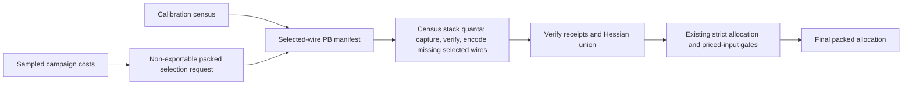
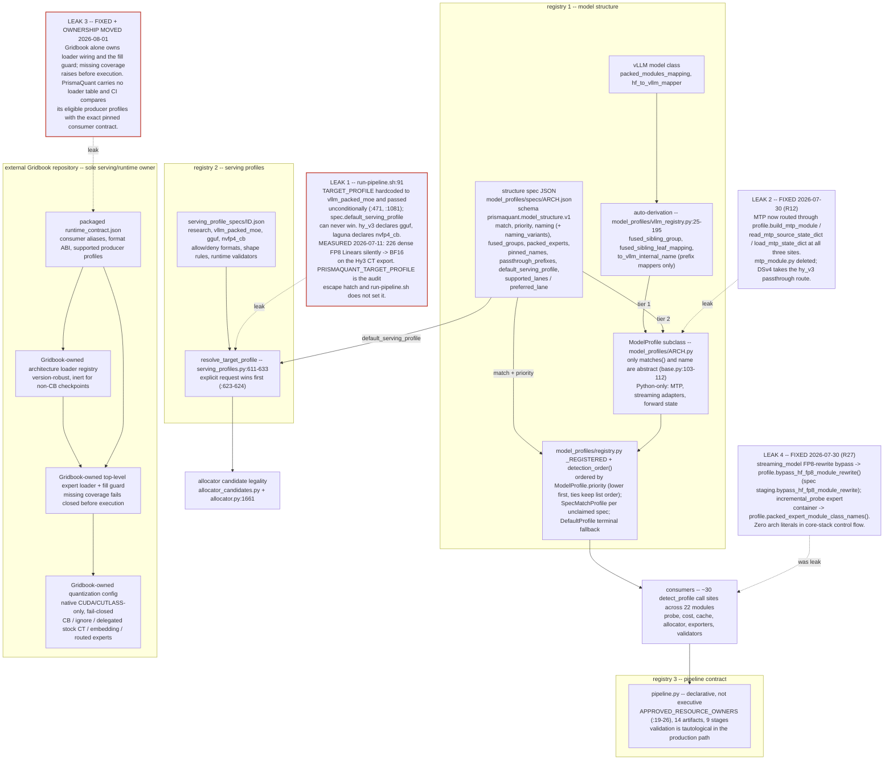
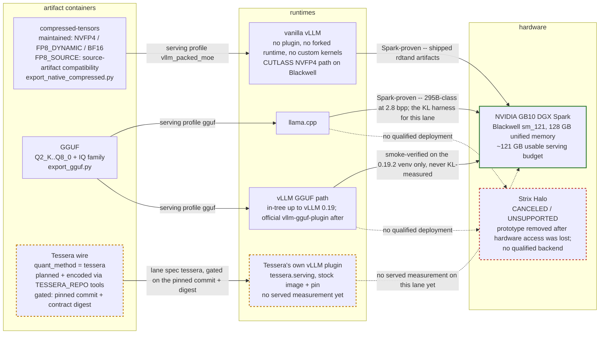

# PrismaQuant Architecture

As of: 2026-09-12 · `pq/529-lane-spec-per-platform`. Stamps
follow, newest first, each recording its own branch and date.

Re-stamped (2026-09-12, `pq/529-lane-spec-per-platform`) for the Tessera lane
spec's **per-platform executed-contract derivation** (#529).
`lane_specs/tessera.json`'s `served_activation_quantization` gains
`executes_by_platform`, derived from the pinned contract's
`lane_eligibility.platforms[*].executes` and refused on drift by
`tessera_export_lane.require_platform_executes_derived_from_contract`, which
`require_executes_derived_from_contract` now calls — so the existing preflight
covers it with no new call site in `run-pipeline.sh`.

**Why it is not redundant with the flat list.** `executes` is derived from
`formats[]` and answers *what does this family's route run?* — a property of
the family, true wherever the family is served. It is therefore silent about
*is it served HERE?*, which is the first question a producer targeting an AMD
device has to answer, and which nothing about the family implies. Contract v23
is the first grammar that can state it: before v10 a `platforms` entry was a
bare key, so the only way to say anything about a device was to have served on
it, and a cell is a receipt. The flat list and the sm_121 derivation are
byte-identical to what they were.

The gate iterates the platforms the CONTRACT declares rather than the ones some
profile targets, so `gfx1151` is covered before anything targets it, and a
separate check asserts every Tessera profile's `target_platform` is a platform
the pinned contract declares — a target the runtime never heard of prices
against nothing. A non-null entry is permission to PRICE, never to ship: the
eligibility gate reads cells, the contract gives neither AMD platform one, and
the live resolver — `tessera_render.tessera_attesting_cells`, reading the pinned
table — returns no attesting cell for any family on either. Gates:
`tests/test_tessera_lane_spec_platforms.py`.

Re-stamped (2026-09-12, `pq/528-platform-aware-route`) for the **platform-aware
Tessera serving route** (#528). `tessera_serving_route` takes an optional
`target_platform`; with none it is the platform-blind layout fact it has always
been and the returned object is unchanged field for field. With one, the
pinned contract is asked
`lane_eligibility.platforms[target].executes[family]` and the answer lands on
one new boolean, `platform_backed`. **The priced route does not move**: same
contract string, same `(act_bits, act_group_size)`, same terminal format —
a platform answers whether a family is served there, never how. An unbacked
rung therefore stays priced and stays on the menu (principle 1); an allocator
that reaches for it is reporting a serving gap, and removing the rung would
hide the signal.

**What this retires is `min_capability_sm` as a GATE INPUT.**
`tessera_allocator._capability_gate` used to parse an SM number out of the
profile's `target_platform` string (`_SM_PLATFORM`, now deleted) and compare it
to the terminal format's floor. That is a producer asserting what another
runtime executes, derived from an id — principle 14's own failure mode — and it
has no answer at all for `gfx1151`, where it refused every family including the
one the runtime does execute. The gate now reads the contract and fails closed
three ways, each named in its detail: no readable pinned table, a platform the
table does not carry (`unstated` — the document declined to answer), and
`executes: null` (a measured platform fact). `min_capability_sm` stays on the
route and in the byte-breakdown JSON as the recorded NVIDIA fact it is.

Parser half: `lane_eligibility` gains `PlatformEntry` and
`PLATFORM_AXIS_LANE_SCHEMAS`, with the backend / arch-key / optional-key sets
TRANSCRIBED from `tessera.serving.contract` the way `CELL_ROUTE_STATUSES`
already is, and one rule checked rather than trusted: a non-null `executes`
value must equal the `activation_contract` that family's own `formats[]` row
publishes. `EligibilityTable.platform_executes` returns three states, because
folding `unstated` into `null` would report an unread question as a measured
refusal. Gates: `tests/test_tessera_platform_route.py`.

Re-stamped (2026-09-12, `pq/527-lane-schema-v10`) for the Tessera pin at
**runtime contract v23 / lane-eligibility schema v10** (#527, consuming
Tessera #464). The pin moves to Tessera `1c827abc4a`, contract digest
`bafe8a4e…0bb922a`. **What v10 changes is the `platforms` entry, and nothing
else**: each entry stops being a bare key and becomes an object carrying
`backend` (`cuda | hip`), exactly one of `compute_capability` / `gcn_arch`, a
`serve_image` that is a digest iff the platform has at least one cell and
`null` otherwise, and `executes` — a map over every family in `formats[]`
whose value is that family's own route contract or `null`. Two AMD platforms
arrive with it, `gfx1151` (Strix Halo, RDNA3.5) and `gfx1201` (RDNA4), with
`serve_image: null`, **no cells**, `TESSERA_BF16_K1` backed and
`TESSERA_E4M3_K1` / `TESSERA_E2M1_K2` `null`. The ten `sm_121` cells are
byte-identical and `versions.default_serve_image` is unchanged, so this pin
admits exactly what its predecessor did. `null` is the fact principle 9 needs
and v9 had no way to say: not "no receipt yet" but "the pinned runtime has no
native route for these bytes on this device". A schema bump is deliberately
not additive — a v9-closed reader refuses a v10 document by NAME rather than
reading a platform object as a key — so admitting it is a reviewed edit here:
`LANE_ELIGIBILITY_SCHEMA_TESSERA_V10` joins every set v9 is in, because v10
cells are v9 cells byte for byte and a set it were missing from would read an
attested cell as one that publishes no evidence. `TESSERA_DEV_PIN_ANSWER`
moves by exactly one entry (`lane_schema` v9 → v10): no gate here reads a
platform's `executes` yet, and the first that does widens the projection and
re-reviews the answer by the rule the answer already carries. Gates:
`tests/test_tessera_lane_v10.py`, `tests/test_tessera_serving_pin.py`,
`tests/test_tessera_lane_admission.py`.

Re-stamped (2026-09-12, `claude/519-launcher-safe-path`) for **the campaign
container launcher importing the pinned tree it was given** (§4.10; #519).
`tools/tessera_campaign_container.py` launched `python3 -u -m
prismaquant.tessera_campaign` with the working directory set to the PB sealed
checkout, which carries its own `prismaquant` package. `python -m` places the
working directory at `sys.path[0]`, ahead of every `PYTHONPATH` entry, so the
pinned mount named first in `PYTHONPATH` never won: 111 completed
`extension-r1024-02` rows stamped the sealed checkout's package digest, and the
16/32-reader prefetch path that exists only in the pinned tree never ran. The
launcher now sets `PYTHONSAFEPATH=1` in the container environment, which drops
that implicit entry, and refuses a spec that supplies the variable itself. The
environment variable is used rather than `-P` because the launcher execs a
caller-supplied command that need not be a CPython interpreter, and because the
producer image's Python version is not established anywhere in this repository;
both spellings require Python 3.11 or newer, and on an older interpreter the
variable is ignored while `-P` would fail. So the guard alone is not the gate.
Before exec, the launcher replays the interpreter's module search over the
launched environment and working directory, mapping container paths back
through `/workspace` and the declared mounts, and refuses when the package that
would be imported is not the pinned mount's, byte for byte, under
`tools/container_runtime_identity.prismaquant_source_sha256` — the same digest
the row stamps as `prismaquant_source_sha256`. The refusal is narrow: it fires
when a declared mount holds a PrismaQuant package and the import resolves
elsewhere, which is #519 itself, and a `.` or `/workspace` entry written ahead
of that mount is refused rather than launched, because safe-path mode removes
the implicit working-directory entry and not a written one. When no declared
mount holds a PrismaQuant package there is nothing to shadow, so the launch
runs the sealed checkout and the receipt records `pinned_by_default` against
the checkout's own root rather than staying silent; every container
`PYTHONPATH` recorded in this repository has that shape, since the 2026-09-08
census invocations name `/workspace` and then Tessera trees. The comparison
applies only to a launch that can import PrismaQuant at all: when the guarded
search reaches no package, the receipt records that nothing was pinned.
The launcher's JSON line, schema `prismaquant.tessera_campaign_container.v1`,
gains `pinned_source_entry`, `pinned_source_root`, `pinned_source_sha256`,
`pinned_by_default`, `import_resolution_root`,
`import_resolution_source_sha256`,
`working_directory_source_sha256` and `safe_path_guard_is_load_bearing`;
existing readers take named members and are unaffected. These digests are a
prediction made on the host from the launched environment, not an observation
of the executed process — the row's own stamped digest remains the observation,
and the two agreeing is what closes the loop. The container environment is part
of the PrismaBuild action key, so this changes the key of future campaign rows;
it must not be applied to rows of a campaign already in flight. Host-interpreter
rows carry the same shadow shape through PB's own `cwd` and are out of scope
here. No cost currency, wire recipe, format menu, serving pin, allocator default
or ship-gate change, and no GPU, served or quality measurement was run. Gates:
`tests/test_campaign_launcher_pinned_import.py`,
`tests/test_tessera_campaign_container.py`.

Re-stamped (2026-09-12, `claude/520-step-coverage-alignment`) for
**step-scoped ownership in the recomputed partition, and a placement
obligation that is a maximum rather than one budget** (#520, producer
tessera#451). The consumer now reads the two observations the producer added,
`observations.step_intervals` (`{step_id, begin_index, end_index}`) and
`observations.step_coverage` (`{state, declared, executed, reason}`, plus
`scope` whenever a step was declared), and reproduces the producer's
step-scoped rule instead of refusing every allocation that no unit interval
contains: contained in exactly one declared step is scratch, overlapping a
step without containment is a carried activation, and overlapping none is the
new `non_step` lifetime class that no composition term charges. The whole
classification is gated on `step_coverage.state == "complete"`; `partial` and
`unobserved` leave the row unclassified, which nulls every term, because a row
live during no *declared* step may still be live during an undeclared one. The
coverage state is itself recomputed from the declared and executed counts. An
interval that spans two steps refuses in either of the two ways one can: a
declared step interval that spans another declared step's extent, and a unit
invocation that overlaps a declared step without being contained in it, which
is derived from an `inside_unit` allocation because the report carries no unit
intervals.

**The admitted extent is now
`max(scalar_budget_bytes, non_step_transient_peak_bytes)`.** The seven
composition terms price one engine step; off-step bytes are priced beside them
by the same simultaneous sweep, and `admit_fixed_resources` refuses by name
when either side is not recomputable rather than admitting against the half it
has. At this producer schema version the budget side is never expressible --
`fixed_resident` depends on `worker_startup`, which has no closing condition --
so the obligation is null on every report the producer can emit today and the
gate stays closed; what changed is that the refusal names the missing side.
Nothing reads the report's `derived` block: both sides are recomputed and the
producer's claims for them, including the frozen `derived.placement_obligation`
formula string, are compared against the recomputation.

Two corrections travel with this change. The consumer charged an allocation to
the **innermost** scope on its stack; the producer charges the outermost, which
is the interval it reads `unit_invocation` from and decides `lifetime_scope`
against, so nested unit intervals both mis-bucketed rows and tripped the
consumer's own invocation check. And the #520 issue text spells the interval
fields `begin_trace_index`/`end_trace_index`; the producer emits
`begin_index`/`end_index`, and the producer is what travels.

No measured table, production setting, pin, serving lane, format menu or export
gate changes, no allocator default moves, and no GPU, served, latency, quality
or capacity measurement was run. The committed report fixtures are synthetic
and exercise refusal paths only; no live capture of this report exists. Gates:
`tests/test_full_engine_resource_report.py`,
`tests/test_runtime_fixed_resource_admission.py`,
`tests/test_runtime_provenance.py`.

Re-stamped (2026-09-12, `claude/518-data-manifest-at-submit`) for the campaign
submit path (#518). **`dispatch_tessera_campaign.py submit` now derives a
PrismaBuild data manifest for every row and refuses a row whose read set it
cannot derive.** Only the producer knows what a row reads, and a row that
reaches the fleet without that list is invisible to PrismaBuild's prewarm
loop: measured on sparky, row-0074 started against cold spindles at 26 MB/s
over 64 GB, about 40 minutes of idle GPU, while a server-side warm of the same
bytes ran at 1,653 MB/s and dropped the client to 0.21 ms per RPC
(2026-09-12). The manifest names the row's capture files, the byte extents of
its members' weights inside the safetensors shards, and the seed wire the
row's own `--seed-wire-dir` argv points at, in that order -- the order the row
reads them. The seed bytes are new: the producer used to resolve them from
the campaign's own plan, which for a re-planned campaign names a different
workspace, so every manifest declared `seeds: 0` while the row read 9.4-19 GB
of wire at 41 MB/s (row-0065, 2026-09-12). A row that names a seed directory
and finds nothing readable in it is refused rather than submitted with
`seeds: 0`. `submit` writes the manifests under
`WORKSPACE/data-manifests/` and submits `WORKSPACE/manifest.submitted.json`;
`plan` still owns `manifest.json` and is not rewritten. The campaign argv is
byte-identical with and without the manifest -- the manifest is a `pbrun`
input, outside the campaign's checkpoint identity -- and `produced_by` carries
no clock reading or hostname, because `pbrun` seals the manifest's digest into
the action key and a field that drifted would re-key a finished row. Gates:
`tests/test_glm_data_manifest_at_submit.py`,
`tests/test_glm_data_manifest_matches_the_prismabuild_contract.py`.

Re-stamped (2026-09-12, `claude/522-derive-mem-gb-from-plan`) for the campaign
dispatcher's derived memory demand (#522). **A row's `demand.mem_gb` now
carries every term of the predicate the row will check itself against**, and a
manifest that does not is refused before submission rather than after
admission.

Three terms, one `ceil`: the phase plan's `memory_bytes`, the process floor,
and the guard's physical margin.

* **The floor.** `process_baseline_bytes` on the campaign spec now defaults to
  `DEFAULT_PROCESS_BASELINE_BYTES` = 1,150,000,000 rather than to `0`. That is
  the top of the range of floors the GLM `extension-r1024-02` rows measured for
  themselves on 2026-09-12 (rows 0058, 0061, 0062, 0063, 0066, 0074, 0079:
  0.88-1.15 GB), so it covers the worst reading rather than the average one. A
  spec still overrides it, including with `0`, and `baseline_policy` says which
  of the two a plan carries: `explicit-spec-reservation-measured-in-row` for a
  spec's number and `measured-fleet-default-reservation-measured-in-row` for
  this default. The reservation is still charged on the demand and never inside
  `memory_bytes`.
* **The margin.** `CaptureMemoryGuard` refuses at `cap - margin_bytes`, so a
  demand covering plan and floor alone still buys an admission the row's first
  `check` declines. The dispatcher reads `CaptureMemoryGuard.MARGIN_BYTES`, now
  a class attribute, instead of restating 2 GiB.
* **The check.** `dispatch_tessera_campaign.py check` recomputes each manifest
  row's demand **from the row's own argv**, not from the planning spec, and
  refuses a row whose declared `demand.mem_gb` is below the derived value or
  whose derived value exceeds a declared GPU-box capacity (`--box-memory-gb`,
  else the spec's `box_memory_gb`). `submit` runs the same check first and
  refuses to submit an unverifiable manifest. Both refusals name plan, floor,
  margin, derived and declared bytes.

Consequence, stated rather than engineered around: the relaunch rows derive
108.63 GB + 1.15 GB + 2 GiB = 105 GiB, above the 104 GiB a Spark declares.
Those rows are now refused at submit instead of dying about twenty seconds
after admission. Making them fit is a plan-term or a box question, not an
allowance to shrink.

The row's own refusals now print their arithmetic. `memory_admission_detail`
returns `plan_bytes`, `cap_bytes`, `baseline_bytes` (absent where no reading
has been taken) and `slack_bytes`; both cgroup-admission refusals in
`tessera_campaign.py` embed it, and the selected-anchor refusal also writes
`<cache-dir>/selected-anchor-memory-refusal.json` with the guard snapshot.
Three rows died on this predicate on 2026-09-12 and the cause had to be
recovered by unpickling completed rows' `cost.pkl`.

Gates: `tests/test_campaign_demand_derivation.py`,
`tests/test_tessera_selected_source.py`,
`tests/test_tessera_campaign_fanout.py`.

Re-stamped (2026-09-12, `pq/420-admit-fixed-resources`) for the consumer half
of the fixed-resource admission design's last prerequisite row, "integrate
allocator admission" ([design](design/runtime_fixed_resource_admission.md),
#420). **`admit_fixed_resources` no longer refuses unconditionally; it
recomputes, and then refuses by name.** The gate reads the
fixed-resource receipt's `full_model_resources` as one `{path, sha256}`
reference to a `tessera.full_engine_resource_report.v1` document -- an inline
resource claim, a status flag or an opaque proof digest refuses before
anything else runs, because none of them is recomputable -- and hands that
reference to `full_engine_resource_report.consume_full_engine_resource_report`
with the run identity it independently supplies: the source model from the
table's own context, the serving configuration and the full-engine runtime
manifest from the loaded runtime relation, and the device from the context's
GPU identity. Nothing reads the report's `derived` block. The table's declared
`fixed_resources` are then compared against what that consumer recomputed from
`observations` and `partition`, term by term, and "not expressible" is kept
separate from "disagrees": a null term is an absence of evidence, while an
integer that differs from the recomputation is a refusal naming both numbers.
A producer that restates a table's wrong number in `derived` still refuses,
which is the property the whole split exists for.

What the gate additionally refuses on its own authority: a synthetic capture
(`fixture_provenance` travels from capture to ledger to `identity`, so a
fixture can never read as a measurement); a table whose graph mode, residency,
topology or batch size is outside the one supported scalar boundary (TP1, one
device, resident, eager, one request); a table pricing more than one format
for a unit, because one measured assignment establishes no invariant fixed
charge under the alternatives; a canonical census or selected-row set that
does not partition the units this table prices, duplicates a unit, names no
format, or names a row the table does not price; and a workload naming another
calibration than the table's. The native-row and full-engine transient charge
boundary is deliberately *not* compared: a native row's scratch includes its
returned output while the full-engine partition classifies by lifetime inside
the unit interval, so the design owes a versioned boundary model ("Set
native/full-engine charge boundary") before either may be equated to the
other.

**Admission is still closed in practice, and the prefill axis stays blocked on
the producer.** At `tessera.full_engine_resource_report.v1` only
`fixed_scratch` and `candidate_scratch` are reachable at all, so the resident,
activation and KV terms that the table declares have no evidence, and the
scalar composition cannot complete even on a flawless capture. More narrowly
for #420's purpose: **the report carries no timing partition at all** -- there
is no timing term, `observations.timing_captures` is one of the members the
schema names and sets null, and the `timing_partition` domain has no closing
condition -- so `fixed_resources.prefill_ms` and `decode_ms`, the numbers
`serve_constraints.evaluate_measured_assignment` sums into the operator-sum
budget `--slo-prefill-p95-ttft-ms` gates, are not recomputable. Wiring this
gate does not open the prefill-versus-accuracy knee; a versioned producer
change and a live isolated engine capture do. No measured table, production
setting, pin, serving lane, format menu or export gate changes, no allocator
default moves, and no GPU, served, latency, quality or capacity measurement
was run. Gates: `tests/test_runtime_fixed_resource_admission.py`,
`tests/test_runtime_provenance.py`,
`tests/test_full_engine_resource_report.py`.

Re-stamped (2026-09-12, `fix/synthesize-adopted-renders`) for **synthesized
renders on adopted joint-AURA rungs, recorded as synthesized** (#515). A rung
the Tessera campaign adopted rather than encoded has a verified wire blob and
no decoded PWC shard, which blocked
`tessera_joint_aura.load_measured_anchor_input` on
`original decoded PWC shard missing`. That shard is now synthesized from the
wire through the one decode seam -- the bound reader's
`read_unit_artifact` when a reader is declared, the module-level decoder
otherwise -- and the refusal is kept for the cases that remain broken: no
wire, a wire that does not decode, or a decode that is not the census BF16
render. Synthesis costs an I/O and decode pass instead of a re-encode.

What it does not buy is evidence about the encode, and the record says so.
Every cell and every `verify_anchor_render` receipt carries a closed-vocabulary
`render_origin` (`encoded | synthesized_from_wire`) and a second closed
vocabulary, `render_comparison`, naming what the `torch.equal` leg established
for that rung: `independent_render_vs_wire` for an encoded shard, and
`wire_round_trip_only` for a synthesized one, where the comparison is
`decode(wire)` against a shard written from `decode(wire)` and can only catch
corruption between the write and the read. That leg still runs on both
origins. The load-bearing, independent leg is unchanged:
`verify_cached_unit` still checks the wire against an encoder identity
re-derived from the streamed source weights and H, and it is what qualifies an
adopted rung at all. Origin lives in a `prismaquant.tessera_joint_aura.
render_origin.v1` marker written beside the shard, and written *before* it, so
a crash between the two writes re-synthesizes rather than leaving a shard that
reads as encoded; the campaign journals fresh and resumed wires through one
receipt grammar, so nothing in the record itself distinguishes the two.
The per-origin census travels into the prepared completion, the prepared PWC
metadata, `results.json`, the joint payload's `tessera_joint_anchors` block and
the allocation handoff's provenance, so "verify_anchor_render passed on all
rungs" can never be read as "all renders were independently compared"
(principle 12, applied to verification rather than route; principle 14's scope
corollary). The prepared record is `prismaquant.tessera_joint_aura.prepared.v3`;
a v2 preparation requires a fresh prepare. No format, default, wire or serving
gate changes. Gate: `tests/test_tessera_joint_aura.py`,
`tests/test_tessera_joint_allocation.py`.

Re-stamped (2026-09-12, `pq/420-full-engine-report-consumer`) for the pure
artifact consumer half of the fixed-resource admission design's "freeze and
implement producer schema" prerequisite
([design](design/runtime_fixed_resource_admission.md)).
`prismaquant/full_engine_resource_report.py` reads one
`tessera.full_engine_resource_report.v1` JSON report and nothing else: it
imports no serving runtime, shells out to none, and adds no dependency on one,
so the artifact travels and the code does not. It recomputes the partition from
`partition` and `observations` — the simultaneous allocation/free sweep, the
owner and lifetime classification, the term composition — and treats `derived`
as a claim to check rather than a number to read. A producer total that
disagrees with the recomputation refuses, as does a domain the consumer cannot
itself see closed, a `shared` or `unknown` owner label, an unclassified
allocation, a foreign device, a reused pointer generation, a live/free
mismatch, a checkpoint that misstates its live extents, an unsupported
topology or graph mode, and a boolean or nonfinite value where an integer is
declared.

**Admission stayed closed and nothing read this partition at this stamp**
(superseded by the stamp above, which wires the gate to it and still admits
nothing). `admit_fixed_resources` kept its unconditional refusal, no gate
imported the consumer, and wiring one was the separate "integrate allocator
admission" row of the same design. On the supplied producer artifact the consumer's verdict is a
refusal that names the five open domains and the one unclassified allocation,
with every recomputed term null; its own recomputation agrees with that
producer in full, which is what the agreement check is for. At this schema
version four of the six domains — `worker_startup`, `provenance_admission`,
`cache_capacity`, `timing_partition` — carry no closing condition the report
emits an observation for, so the resident, activation and KV terms cannot
become numbers and the scalar composition cannot complete at all. The producer
schema now says so on its face (tessera#450): `observations` names each owed
member and sets it null — `worker_startup_records`, `runtime_provenance_relation`,
`kv_observations`, `timing_captures`, `owner_views`, `observer_qualification` —
so a capture that did not observe something is distinguishable from a producer
that dropped it, and the consumer refuses a value there rather than reading one
whose shape v1 does not define. `partition` owns the domain states and `derived`
may no longer restate them, and a domain's evidence must name an observation the
envelope carries. That schema also records `partition.domains_source`, because
the producer accepts a caller handing it a domain table so its own arithmetic
stays testable; a handed-in table closes every domain on the caller's word, so
this consumer refuses any partition whose `domains_source` is not `derived`.
`partition.uncharged_allocations` and `partition.scope.uncharged_allocation_count`
name the classified rows the seven terms do not reach -- a KV backing with a
transient lifetime, a candidate allocation with no unit -- and the consumer
derives that set itself from `observations.torch_allocations`, compares it to the
producer's by allocation id and by `(owner_class, lifetime_class, unit)` rather
than by the prose reason, and refuses on disagreement. One uncharged row nulls
every term on both sides, exactly as an unclassified row does: an overcount
wastes headroom, but a composition that silently omits an allocation hands a
serving gate a budget smaller than the engine needs. The three candidate terms are per-unit charge tables, keyed
as the producer keys them, and the consumer compares them unit by unit and
reduces only inside the composition (`sum` for residency, `max` for the
transients): two units that trade the same bytes agree on every reduction while
both charges are wrong, so comparing totals would not see it. `kv` is a third
owner class, so a KV backing is classified and `fixed_kv` is the sum of the
resident KV rows -- what it waits on is `cache_capacity`, which never closes
here. Only `fixed_scratch` and `candidate_scratch` are reachable at
this version; altered cache capacity, a missing timing tail and overlapping
streams reach the consumer only as a domain state, which is why it has no test
for them. No measured
table, production setting, pin, serving lane or admission behavior changes,
and no GPU, served, latency, quality or capacity measurement was run.
Gates: `tests/test_full_engine_resource_report.py`,
`tests/test_runtime_provenance.py`.

Re-stamped (2026-09-11, `claude/495-probe-reduction-schedule`) for the routed
stack **probe-reduction schedule**, parts 1-3 of RobTand/prismaquant#495
(§4.10). Three changes, all opt-in or provenance-only:

* `dispatch_tessera_campaign.py plan --stack-sample-sizes {probe,counts}`
  chooses what the PPS draw is proportional to. `probe` is the default and a
  plan written without the flag is byte-identical, field for field, to the
  plans already on disk (gate:
  `tests/test_tessera_stack_sample_sizes.py::test_the_default_draw_is_byte_for_byte_what_it_was`,
  which rebuilds the pre-change record from the campaign's own primitives and
  compares serialisations). `counts` draws on the census's per-expert
  routed-row counts -- the only per-expert size that exists on a model with no
  `h_trace_per_expert` probe, which is why the sampling path was unreachable on
  GLM-5.3-Flash. A `counts` record names the source, carries the vector and its
  digest, and suffixes `design` with `_counts`; `selection_stack_samples`
  replays the draw on the declared vector and refuses a record whose declared
  digest is not the draw's. The stack row's Fisher currency is untouched: the
  allocator still multiplies by the probe's own `h_trace`, so `--stack-sample`
  still requires `--probe`, and §5's "run without a probe" is **not** delivered
  (see §12 debt).
* `prismaquant/tessera_rate_surface.py` gains the **stack transfer law**:
  `fit_stack_transfer_law(stacks_measured, hold_out)` pools per-projection OLS
  slopes of `log2 mse(rate)` on `log2 mse(reference)` over every stack but the
  held-out one, and `predict_stack_rates(stack, law)` fits that stack's own
  per-projection intercept from its sampled experts and returns the predicted
  totals plus a model error. `TesseraRateSurface` is untouched and dense units
  keep three anchors. Gate: `tests/test_tessera_stack_transfer_law.py`.
* **Provenance on a two-tier stack.** A rung encoded on every expert with
  certainty now writes `cost_source: tessera_campaign_measured` rather than
  `tessera_campaign_measured_stack_sample` -- it is a census, not an estimate,
  and its Horvitz-Thompson variance is an exact zero, so the sampled spelling
  was describing a draw that did not happen. That removes the `cost_source`
  refusal in `tessera_joint_aura.load_measured_anchor_input`; it does **not**
  make a stack row consumable there, because that reader matches the cost
  roster, the checkpoint journal and the receipts against the census's source
  units (`_same(set(payload["costs"]), names, "complete merged cost roster")`)
  while a stack's cost key is the packed qname -- the same stack-to-member
  indirection recorded as D35(iii) is still what stands between a census stack
  and joint AURA. A rung encoded only on the transfer-law draw is
  predicted and written `PROVENANCE_INTERPOLATED` /
  `cost_source: tessera_campaign_interpolated` with a `transfer_law` block
  (slopes, pooled stacks, intercepts, sample ids, n, residual sd, model error)
  and **neither** `dloss_stderr` **nor** `estimator: horvitz_thompson`: those
  describe a sampling design, and no design produced this value. The
  pre-existing stack interpolation path leaked `estimator` onto its rows by
  building their `sampled_experts` block by subtraction; it is now built from
  an allowlist. Gate: `tests/test_tessera_stack_transfer_law_rows.py`.

No cost-mode default, stage graph, format menu, serving lane, wire recipe or
ship gate changes. Parts 4 (selective encode of the allocated winners) and 5
(repair loop and regret gate) of #495 are not in this stamp, and no planner
flag emits a two-tier schedule yet.

Re-stamped (2026-09-11, `claude/row-head-parallel`) for the **row head on
threads** (§4.10). With `--campaign-identity-bytes M` set,
`--campaign-identity-threads N` (default 1, the serial head) builds the
closed-roster identity hold on N workers -- each hashes one unit's resident
weight and Hessian through the producer's `encoding_input_identity`, and the
mapping is filled in sorted unit order whatever the completion order, so every
template and the run-level identity are byte for byte the serial ones -- and
verifies a resumed journal's wire receipts on the same N workers in adopt
order, the first refusal in that order being the one raised. The calibration
owner's capture seal (`ActivationSource.capture_sha256`, ~40 GiB of sha256 on
an 864-unit GLM expert row) is taken on a helper thread the moment the owner
exists, under the producer projection and the identity plan, and joined before
the hold: the seal is the producer's own, and the owner is sealed exactly once
because that join precedes every other first read. The H commitments the export
inputs write (`canonical_hessian_reference_descriptor`) are the per-unit
receipts the hold sealed from the same resident tensor objects, handed back
only for those objects (`_BoundCheckpointUnitIdentity.hessian_identity`), so
they are no longer a second full digest; `prepare_journal` compares the
manifest's digest and canonical identity before walking the identity for a
field name. The selected-source plan charges N in-flight host copies as
`campaign_identity_hold_scratch_bytes` in the resident-anchors phase (0 with
the hold off), the dispatcher forwards N to it, and the row never runs more
builders than the CPUs it was admitted with. The thread count is an execution
knob, excluded from checkpoint identity like the identity reservation. Outputs
are unchanged byte for byte (gate: `tests/test_tessera_row_head_parallel.py`).
Before, on GB10 row-0079 (sparky, serial, 10 admitted CPUs): capture prefetch
132 s, producer projection 28 s, identity hold 102 s, H commitments 38 s; the
after-figures are recorded on the PR that landed this stamp.

Re-stamped (2026-09-10, `claude/480-campaign-progress`) for the campaign
execution contract. `dispatch_tessera_campaign.py plan` no longer seals a
14,400 s deadline into every pricing row; `--timeout-s` is unset by default
and seals only when asked for. Rows instead declare the phases they walk and
the quiet each is allowed -- `startup=3600 pricing=900 finalize=1800`, from a
least-squares fit of elapsed time against committed batches over the 23
completed 864-unit GLM rows in the fleet's terminal records (18.6728 s per
committed batch, an 836.1 s fitted intercept, greatest absolute residual
160.5 s; [reproducible evidence](measurements/pq480_progress_grace_fit_2026-09-10.md))
-- and `tessera_campaign` reports its committed anchor count through
`prismaquant/prismabuild_progress.py` after each journal flush, once the
shards are durable. A row that keeps committing is given no total-duration
limit; one that stops ends within 6,300 s, less than half the limit that
killed row-0050 and row-0065 mid-round. The container wrapper carries the
progress channel in and refuses at launch when the file would land outside a
writable declared mount. Requires the PrismaBuild generation carrying
RobTand/prismabuild#480; an older fleet refuses these rows at submit rather
than admitting and killing them. No cost currency, wire recipe, format menu,
serving pin or ship-gate change. Gates:
`tests/test_campaign_progress_replaces_the_blanket_timeout.py`,
`tests/test_tessera_campaign_container.py`.

Re-stamped (2026-09-09, `fix/qwen35-tf517-rotary-positions`) for the
profile-owned `rotary_position_ids` hook at the shared streamed rotary call.
Qwen3.5/3.6 supplies three identical rotary axes for two-dimensional text
positions and preserves explicit three-axis inputs. This carries the model
forward's expansion into streaming after Transformers 5.17 removed it from
the rotary module. Mask and decoder-layer positions remain unchanged; other
profiles pass rotary positions through. Gates: real Qwen hybrid integration
and the existing rotary/mask tests. See #477.

Re-stamped (2026-09-10, `perf/glm-boundary-pipeline`) for the **batch-boundary
pipeline** (§4.10): with `--publication-overlap-bytes N` and
`--campaign-identity-bytes M` both set, every post-encode step of a batch that
touches no device runs on the publisher's writer thread behind that batch's
own files -- the render/wire writes, the per-anchor identity derived from the
unit's sealed template (`_AnchorPublicationLedger.record(anchor, derive=...)`),
the wire receipt read back off the published file, and the journal write --
while the encode thread starts the next batch. The writer stays CPU/IO-only by
contract: the producer's graph capture forbids surprise device work from
another thread, so the render score and the device-to-host copy remain on the
encode thread, and without a bound identity the producer's
`encoding_input_identity` (which hashes the resident weight and Hessian)
still runs there. A refused deferred identity is a publication failure: no
receipt, no row, and the action stops. Outputs are unchanged byte for byte
(gates: `tests/test_tessera_publication.py`, `tests/test_tessera_bound_identity.py`,
`tests/test_tessera_campaign_publication_cli.py`).

The identity reservation's planner now charges the retained per-unit hold as
the fixed object term, the interpreter's own frozenset table size for the
closed roster's borrowed format references, and the serialized receipt
envelope; the roster transient (two closed rosters of per-format namespaces
live during construction) is charged explicitly in the planning scratch. The
former 1 KiB-per-format retained envelope charged an 864-unit GLM expert row
~1.9 GB and pushed its admission past the box; the bound is exact in the
interpreter's terms and is still tested against `observed_metadata_bytes` on
every run. The 864-unit row now fits a 256 MiB reservation.

Anchor batches are emitted unit-major (`_anchor_batches`): the chunks of one
`(family, shape, dtype, device)` key are ordered by chunk position first and
rung second, so consecutive batches encode the same expert units at successive
rungs and the encoder memo -- sized to the batch width by the plan -- reuses
each unit's block-LDL factorization across its rungs instead of refactorizing
once per (unit, rung) with every other unit's batches in between
(PrismaQuant #389). Batch membership, wire bytes, prices and the checkpoint
identity are unchanged; only the order of encodes moves.

Re-stamped (2026-09-10, `perf/glm-publication-transition-optimization`) for
experimental `--campaign-identity-bytes N`. It is off when `N=0`. A positive
value is a declared selected-source PB reservation; runtime derives the closed
roster's conservative metadata peak before construction and refuses if it exceeds
`N`. When enabled,
a campaign creates one Tessera producer input-receipt template per priced unit
before journal admission, then derives each closed-menu anchor receipt from
that template using Tessera's current `wire_recipe`. The option changes neither
source/H/calibration identity nor wire bytes and is excluded from checkpoint
identity like publication staging; the normal PrismaQuant package-source seal
remains strict, so journals from a different package source still require the
existing rebind gates. A reference-backed activation owner may replace the
pre-export owner only after it proves the same resident H objects and producer
settings. H-free rosters retain no H receipt and use the ordinary run-level H
check.

For selected-source rows, the dispatcher forwards `N` to the shared
`selected_anchor_resources` plan as the `campaign_identity_metadata_bytes`
resident-anchors term before PB admission. The runtime's conservative topology
bound covers one holder/result mapping, signatures, producer receipt
dictionaries, closed-format references, settings, projection serialization and
shape/name lengths, plus the bound-map and largest per-unit JSON planning
transient. It does not read source tensors or change the producer authentication
API. `N` covers both retained and planning terms. Each real hold reports an
interpreter-specific observed metadata diagnostic and refuses if it exceeds
its admitted bound. Holder construction failure closes prior holders; normal
and exceptional exits close them only after the publication drain. Qualification
requires balanced native campaign profiles that include startup and drain,
energy, and Netdata evidence. Gates: `tests/test_tessera_bound_identity.py`,
`tests/test_tessera_publication.py`, `tests/test_selected_source_authentication.py`
and selected-source admission tests.

Re-stamped (2026-09-09, `perf/glm-selected-source-snapshot`) for
`dispatch_tessera_campaign.py plan --seed-workspace`. A new plan can offer each
matching prior row's completed or partial checkpoint to the existing seed gates.
The planner requires the same model, census, capture, group bundles, membership
and sampling; it records the source plan digest and each available seed manifest
identity. These at-plan digests are provenance, not execution gates: the source
may advance before adoption, and the runtime checks the then-current scoring
inputs and wires. Group additions or changed bundles/sampling refuse the plan;
a matching row without a checkpoint prices fresh. Seed files retain their original
owner. PB continues to own all admission, placement and retries. The runtime validates
the seed identity and wire bytes when adopting them. Gate:
`tests/test_tessera_campaign_seed_workspace.py`.

Re-stamped (2026-09-09, `perf/glm-selected-source-snapshot`) for seed-score
identity validation. `--seed-checkpoint` now requires a digest-bound source
manifest and matching unit envelopes, then compares calibration, score currency,
static-scale policy, actual per-unit scoring-row identity and input scale before
linking that unit's wires or inheriting its measured error. Producer input and
wire checks still apply. Menu and source-package changes can reuse compatible
measurements; changed scoring activations cannot inherit old scores. Missing
unit shards remain eligible for fresh pricing, preserving partial-checkpoint
recovery. Gates: `tests/test_tessera_campaign_resume.py` and
`tests/test_tessera_campaign_fanout.py`.

Re-stamped (2026-09-09, `perf/glm-selected-source-scope`) for opt-in
`--source-snapshot-policy selected-tensors-v1` in selected anchor rows that
reuse a complete, SHA-bound capture. The default remains `whole-layer-v1`.
The source-only mode builds the declared meta skeleton but materializes no
head, embedding or vision tensors. Its one-shot selection narrows the existing
`StreamingContext` maps before prefetch, using the same profile-derived
source dependency closure as resource admission. The existing reader, layer
cache, concat merger and expert packer remain the owners of source bytes.
A selected projected expert requires its entire packed parent, including all
expert indices and sibling projections; a concat target requires every source.
Forward installation and full source-initialization attestation are refused.
The selected source keys are compared with the admitted plan before reading
and recorded in the source receipt. Source shard SHA256 authentication and
held-descriptor mutation fences remain unchanged: consuming one tensor still
authenticates its entire shard once per row. The initial policy supports
unscaled floating checkpoints; scaled FP8/FP4 sources fail closed.

Admission excludes unconsumed source tensors and nonbody materialization,
retains selected H/X, encoder, packing and publication charges and the existing
full-layer source-validation allowance, and preserves
the full-header identity and decoder coverage check. Snapshot policy is an
execution choice outside cost identity, like compatible batch width: source
weight bytes, calibration, encoder policy, wire format and shipping gates do
not change. Qualification requires selected weight parity and a complete
matched-group GPU profile before claiming a production speedup. Gates:
`tests/test_selected_snapshot_scope.py` and existing streaming, source
authentication, selected-anchor and dispatcher admission tests.

Re-stamped (2026-09-09, `claude/dispatch-process-baseline`) for the campaign
dispatcher's explicit process-baseline reservation. A recipe may declare
`process_baseline_bytes` on its spec; `_row_memory_gb` charges it once on the
demand, in both the streaming and resident-source branches, and never inside
`memory_bytes`. `baseline_policy` gains
`explicit-spec-reservation-measured-in-row` for a plan that carries one, and
the plan records the integer beside `row_memory_gb`. The default was `0`, which
preserved every row's resource demand exactly; the plan file itself was not
byte-identical, since it carries `process_baseline_bytes`. The runtime's
measured fail-closed guard is unchanged. **Superseded on 2026-09-12 (#522):
the default is now the measured fleet floor, and the guard's margin is charged
beside it. See the newest stamp.**

Re-stamped (2026-09-09, `fix/glm-resident-hessian-source`) for resident
Hessian commitment reuse in the selected campaign's existing opt-in
`--export-hessian-reference-policy` path. Resume and seed validation still
precede publication of export inputs. After those gates accept, the campaign
binds its resident H tensors to the producer's authenticated reference owner
over the just-published commitments. The encoder and checkpoint identity paths
share that owner's resident mapping; capture sealing uses its committed
digests instead of hashing the full population again. Each encoder consumption
still checks actual H content against its commitment. No H payload is loaded
through the reference reader on this path, and the campaign's existing source
scope closes the held metadata on successful returns and exceptions. The
original capture seal and per-unit encoding input identities are preserved;
the conservative producer source seal continues to track dependency changes.
The plain mapping path remains for campaigns without reference export inputs.
Tests in `tests/test_tessera_hessian_reference_handoff.py` cover the public CLI
regression, identity parity, provenance refusal and metadata-owner cleanup.
Native performance measurements are recorded separately from this contract.
This integration pins the producer and serving dependency to the same Tessera
development commit `387eda36fd41`, the merge of PR #441. Its packaged runtime contract
is unchanged, so admission, formats and serving cells retain their previous
answers. Producer source identity changes; existing priced rows are not
relabeled under this source. Native qualification uses fresh output paths.

Re-stamped (2026-09-09, `claude/bounded-publication-overlap`) for the campaign's
opt-in **bounded publication overlap** (§4.10). `--publication-overlap-bytes N`
(default `0`, which is the historical synchronous path byte for byte) runs one
bounded writer thread so the next anchor batch encodes while the previous
batch's artifacts are persisted. Three links move onto that thread, in queue
order: the render and wire files, the wire receipt that is read back off them,
and the `write_unit` journal write that cites the receipt. The
device-to-host copy of each render stays on the thread that owns the device
work, and the writer then calls the same
`production_weight_cache._store_rendered_weight_entry` and the same
tmp-plus-`os.replace` wire write the synchronous path calls, so there is no
second cache and no change to what a published file is. An anchor is added to
`measured` and marked for the journal only after its own receipt exists, so
the checkpoint invariant that every journalled anchor row carries a wire
receipt read back off a published file is unchanged. A round, a deadline stop
and the end of the loop are drain barriers; the publisher's lifetime is a
`try`/`finally` it is started inside. That `finally` runs on every exit, a
successful return included; on the success path the loop's own drain and
flush have already emptied the pending state, so its close and flush are
no-ops. What it exists for is the exception path, where it commits the rows
whose receipts really completed before dropping what is still staged, so a
batch that succeeded before a later one failed keeps its journal row. That commit
is unconditional: rows a batch's `apply_completed` had already put into the
pending checkpoint are unwritten until a flush, and the batch cadence need
not have reached one, so flushing only when the unwind itself journalled
something would lose exactly the batch it exists to keep.

The byte budget is a bound rather than a statistic: the producer reserves
before it allocates, an artifact larger than the whole budget is refused
instead of admitted as a special case, and `autoscale.
selected_anchor_resources` charges the budget as `publication_staging_bytes`
in the `resident_anchors` phase, propagated from both the campaign CLI and
`tools/dispatch_tessera_campaign.py`. The memory guard's
`after_selected_anchor_batch` bracket therefore includes staged bytes, and the
publisher's budget, peak charge and blocked seconds are stamped on cost
provenance under `publication_overlap` so a reader can attribute them. A
writer failure is closed: everything queued behind it is dropped unwritten and
the campaign's batch handler re-raises rather than continuing. The option is
excluded from checkpoint input identity, because it chooses which thread
performs writes whose arguments it does not touch. Gates:
`tests/test_tessera_publication.py`,
`tests/test_tessera_campaign_publication_cli.py`. The barrier tests establish
ordering and bounds only; the device-to-host copy remains synchronous, and no
speed, work-per-joule or I/O claim is made here.

Re-stamped (2026-09-09, `integration/glm-reviewed-best-form-producer`) for the
synchronized development/serving dependency pin to Tessera `b1eb1dccc9df`
(#437/#438). Its best-form window recurrence and tile controls remain opt-in;
the package also includes the reviewed calibrated cached-export and rank-local
TP2 intake fixes (#434/#436). The packaged runtime contract is byte-identical
to `07ad344c3275`, and the admission answer, format menu, serving cells and
encoder defaults remain unchanged. Native GLM row-0076 measurements preserve
all 32 selected experts' wire bytes and scores at both R832 and R1088 with
this producer; they do not establish full-model KL, a serving release or a
blanket batch-width policy. Wider batches improved work/J at R832 and worsened
it at R1088. The original complete calibration capture remains reusable under
its own identity; old priced anchors retain their old source seal and are not
relabeled or automatically adopted under the new producer. New pricing binds
the new source identity. Provision fleet dependencies with
`tools/provision_tessera_pin.py` through PrismaBuild; the provisioner compares
the shipped package files as well as the contract and builds outside the frozen
source tree. Detailed measurements and gates accompany the pin integration.

Re-stamped (2026-09-08, `fix/glm-selected-verified-capture`) for opt-in
`--capture-load-policy` on selected streaming reuse of a SHA-bound complete
calibration capture. The existing verified activation loader authenticates
one private serialized buffer against each original manifest entry, validates
its archive/storage/FP32 tensors, and releases the buffer before CUDA transfer.
The dispatcher and runtime share the selected-resource plan's additional
capture-prefetch phase: resident selected weights/X/H, one decoded storage S,
private file buffer F, full-file source-page exposure F, explicit scratch M,
and existing headroom. All original phases and physical refusal gates remain.
Digest-named `capture-load-execution-<sha256>.json` sidecars record the actual
load chain, byte counts, original manifest binding, resources and memory guard;
selected-source provenance binds the sidecar's path/SHA. A later refused or
interrupted resume cannot replace an earlier sidecar. The explicit CLI policy
remains in checkpoint settings and changed implementation source remains a
resume boundary; this does not authorize silent reuse of old priced anchors.
The canonical capture identity and payload bytes remain unchanged; the option
does not run calibration forward or reprobe source projections. The option is
still unset by default. Gates: `tests/test_selected_verified_capture.py`,
existing verified-load, selected-source, admission and campaign resume tests.
CPU contracts alone do not establish native I/O, speed or served quality.

Re-stamped (2026-09-08, `feat/tessera-campaign-family-restriction`) for the optional
campaign `--family-restriction` pricing contract. Its closed
`prismaquant.tessera_campaign_family_restriction.v1` JSON supplies nonempty
canonical Tessera family lists for both `dense` and `routed_moe`. Campaign
discovery supplies each unit's topology and the existing profile-aware
`unit_structure_from_stats` validator resolves its structure; missing,
conflicting or malformed facts refuse. The existing menu expander receives
the family's allowlist before rung enumeration, and its cache key binds that
allowlist alongside shape and serving context. Checkpoint and cost provenance
bind the canonical policy and exact unit structures. Restricted seed intake
refuses incompatible active families and out-of-band anchors before linking
their wires; the existing producer receipt checks still govern accepted bytes.
Fanout merge refuses mixed policies or incomplete structure maps and preserves
their complete union. The option narrows research pricing only: existing
reader, shape, serving-cell, release and export gates still decide support.
Unset preserves the prior menu and seed behavior. No format default, producer
pin, wire arithmetic, residency mechanism or PB placement changes.
Gates: `tests/test_tessera_campaign_family_restriction.py`, existing campaign
resume/fanout/context tests. CPU contract tests do not qualify native fit,
batch throughput or a serving release.

Re-stamped (2026-09-08, `triage/selected-anchor-plan-baseline`) for the
selected-anchor plan's derived terms and its measured process baseline (#390).
Every charge in `autoscale.selected_anchor_resources` now names the line that
allocates what it bounds and the shape and dtype that line allocates: the
export file-page window is one FP32 `[in, in]` Hessian record, serialization
scratch is the two live copies the capture digest holds (a CPU copy of one
Hessian and the bytes object taken from it) rather than the smaller staging
copy `torch.serialization._save` makes per device storage, entry validation is
one capture entry's CPU payload beside its
device copy at the loader's own `_capture_storage_bytes` arithmetic, the
factorization transient is two FP32 copies of the widest Hessian across the
producer's sequential seal and factorise stages, and the encoder memo is sized
by the capacity the plan publishes rather than by the anchor batch width, so
the charge and the memo's construction have one owner. Two terms are stated as
gaps and left unchanged: the export archive's pickle-and-directory metadata,
whose size follows pickle framing rather than any shape or dtype, and the
producer's own working set inside `encode_linear`.
The plan states deltas; `CaptureMemoryGuard` reads absolute process bytes.
The guard now records its first reading as a measured baseline and reports
`peak_checkpoint` and a per-phase-prefix peak map, the selected row stamps
that baseline beside its plan, and selected admission compares the plan with
the cap less the baseline instead of with the raw cap. The guard's own refusal
arithmetic is unchanged: its readings are already absolute. No pre-run baseline
is derived for the dispatcher, which never enters the box a row lands on, but a
recipe may **declare** one: `process_baseline_bytes` on the campaign spec, a
non-negative integer of bytes. It defaulted to `0` here and defaults to the
measured fleet floor since #522; the newest stamp carries the current rule.
`load_spec` refuses anything else, `bool` included, before a row is derived. `_row_memory_gb` adds it to the
demand in **both** branches, streaming and resident-source, since a process
floor exists either way; it is never summed into `memory_bytes`, because the
demand becomes a cap of exactly that many GiB while the row compares its plan
with the cap less its measured floor, so a reservation folded into the plan
would inflate both sides and net to zero. That is why `headroom_gb`, a term
inside `memory_bytes`, could not close this gap. `baseline_policy` records
which pre-run term a plan has:
`declared-headroom-pre-run-measured-in-row` when nothing is reserved,
`explicit-spec-reservation-measured-in-row` beside the integer when a spec
declares one, and `measured-fleet-default-reservation-measured-in-row` when the
dispatcher supplied its measured default (#522), so an absent reservation
cannot read as coverage and an inherited one cannot read as a spec's choice. The row's own first
`CaptureMemoryGuard.check` remains the only measured floor of the three.
Rounding was not a reservation: `ceil` leaves at most one GiB of slack and the
floor measured on this fleet is 1,062,359,040 bytes, 0.9894 GiB, so before this
key a row admitted according to where its `memory_bytes` landed modulo one GiB,
and both inspected example rows lost that, at 827,603,112 and 266,244,264 bytes
of slack. The declared value is the recipe's bound, not a claim about any
universal maximum.
A third quantity is measured and reported rather than charged. On the
streaming fixture the first encode step grew 165.6 MB and the second grew
2.7 MB against a 10.3 MB `resident_anchors` plan, and the row's peak sat
157.8 MB above its own measured baseline, 73.9 MB of it resident host pages
and 83.9 MB CUDA allocator segments. Nearly all of it is the first step:
loading the CUDA factorisation path and building the encoder's working
buffers once. The charge follows no shape in the roster and is not even
fixed for one roster, since the same fixture grew 93.7 MB over its baseline
with a one-rung menu and 157.8 MB with two, so it is recorded in the guard
telemetry and left uncharged; a constant would be a multiplier by another
name.
Gates: `tests/test_tessera_selected_source.py` for the derived terms and the
measured baseline, and the native GLM selected row in
`tests/test_glm_campaign_streaming.py`, which pins declared headroom to zero,
asserts the admission arithmetic against the cap less the measured baseline,
and runs two encode steps so the first-use charge and the steady state are
separable. The campaign takes the anchor-batch bracket per occurrence and
stamps one growth figure per step on the receipt; the row asserts that every
step after the first fits the `resident_anchors` phase plan, so a forgotten
term fails there rather than disappearing into headroom. This bounds
attribution and admission arithmetic on a fixture roster; it is not a
full-GLM fit claim, and it does not bound the first step.

Re-stamped (2026-09-08, `triage/layer-major-prefetch-reassert`) for the exact
layer-major visitor's residency contract (#403). `StreamedCausalLM.
visit_layer_batches` with v2 `layer_major` storage keeps no residency state of
its own: the streaming runner owns residency, and `StreamingContext.
schedule_prefetch` is idempotent (None for a hot layer, the held future for a
read in flight or delivered and unclaimed, a fresh read only when nothing is
held, and None with a counted memory skip when the pressure floor refuses a
fresh one). A held read is now returned before the pressure floor and admission
gates, so re-asserting a schedule under pressure is never counted as a memory
skip. The visitor speculates each layer once ahead of its turn
(`prefetch_lookahead`) and re-asserts it once, immediately before
`install(require_prefetched=True)`, releasing its record of the speculation
at that re-assert: the record is the runner's future, whose result is the
layer's tensors, and the runner drops its own reference at install, so the
visitor never holds a claimed layer's source bytes past its turn. A
speculation the runner no longer holds,
because the layer was hot when speculated and the LRU evicted it before its
turn, or because the pressure floor refused the read, therefore gets exactly
one bounded retry, costing one serialized source read in the critical path.
The install refusal stays fail-closed for everything else and its message
names the layer. The layers that needed a fresh read are recorded on the
runner as `layer_major_prefetch_retries` and logged by
`compute_aura_cost_streamed` after the capture. The visitor's previous private
`scheduled` set vetoed the re-schedule, so an evicted or refused speculation
could only be recovered by rerunning with a larger budget. Gates:
`tests/test_layer_major_boundary_capture.py` (a fake context that refuses
install like `ensure_loaded`, both defects injected, plus a fake handing out
real delivered futures that must be dead at the next install) and
`tests/test_streamed_prefetch_scheduling.py`. No default, stage, format, lane
or ship-gate change.

Re-stamped (2026-09-08, `triage/container-gpu-declaration`) for **the campaign
container's GPU attachment contract** (§4.10, #430). The launcher no longer
maps the device because nobody said not to. `--gpus all` is withheld when any
declaration withholds it: an explicit `--cpu-only`, an empty
`CUDA_VISIBLE_DEVICES` in the action environment, which is exactly what
`pbrun` sets when it granted no GPU slots, or an empty `CUDA_VISIBLE_DEVICES`
in the spec's own `env` block. Otherwise the device is attached, as before.
The two checks are not redundant with the variable itself: an empty
`CUDA_VISIBLE_DEVICES` hides the device from CUDA inside the container but
does not stop the runtime attaching and initialising it, so a row that
reserved no GPU could still own one while PrismaBuild's GPU tokens stayed
unspent, and a power reading taken beside it had a second owner it could not
see. An unset variable is not a declaration: a run outside `pbrun` has no
grant to read and keeps the behaviour it had, where `--cpu-only` remains the
way to withhold the device. The launcher's existing JSON line now carries
`gpu_attached` and `gpu_decision`, so the choice and the declaration that made
it are readable rather than inferred. No serving pin, wire recipe, cost
currency, format menu or ship-gate change. Gate:
`tests/test_tessera_campaign_container.py`.

Re-stamped (2026-09-08, `fix/glm-streamed-gold-companion`) for the opt-in
streamed gold companion (#437). The existing v1 8×512 seed-42 WikiText
all-position top-K=8192 payload and coverage/fidelity gates retain their
defaults. V2 can retain normalized full-vocabulary final rows from the same
streamed forward, with explicit observed GLM source-derivative binding,
pre/post checkpoint/tokenizer/input/source identity checks, and tool/package
provenance. Model-bound WikiText inputs require an independent file digest.
V2 students verify teacher evidence and candidate tokenizer/family/vocabulary
before engine loading and retain the teacher evidence in final-position KL.
Fitting overlap remains unverified in this payload; full-vocabulary scope is
not a held-out claim. This tools-only extension changes no pricing package,
streaming residency mechanism, fitting capture, quantization or serving gate.

Re-stamped (2026-09-08, `fix/glm-model-bound-wikitext-inputs`) for the
explicit offline `prismaquant.model_wikitext_inputs/2` input contract.
The existing materializer opts in with `--input-schema model-v2`; its default
DSv4 v1 exact-value refusals remain unchanged. V2 file intake requires an
independent SHA256, exact tokenizer-file identity and normalized model family
and vocabulary. It retains datasets 4.6.0, the pinned WikiText revision and
corpus construction, eight 512-token train windows at seed 42 and the 8192-token
test prefix. Tokenizer-dependent counts, starts and token values are derived
and digest-bound. PPL consumes these pre-tokenized inputs before engine load;
source config bytes are provenance, while source/candidate pairing uses the
shared token domain. This CPU preparation does not establish held-out status,
model fidelity, serving qualification or a measured quality improvement.

Re-stamped (2026-09-08, `fix/glm-gold-topology`) for explicit stock-vLLM
topology in the offline gold KL/PPL tools (#434). Shared closed arguments
forward TP degree, node count, rank-0 rendezvous, MP backends and an optional
MoE backend to the existing LLM construction; omitted arguments retain TP1.
The gold coordinator does not launch remote nodes. Multi-node runs require
separately launched stock headless workers, explicit compatible MP settings,
and per-node runtime evidence. Configured topology and the helper's source
bytes join existing gold provenance. Full-vocab final-position KL remains
distinct from HTTP top-K KL. This instrument change touches no frozen pricing
package input, Tessera producer, serving qualification or performance claim.


Re-stamped (2026-09-08, `integrate/glm-packed-source-20260908`) for the
synchronized development/serving dependency pin to Tessera `07ad344c3275`
(Tessera #431). The producer can bind an explicit packed research execution
input through export, partition identity and checkpoint config; the ordinary
registered plugin reconstructs the existing packed expert owner from that
closed declaration. All carried copies use the same strict integer grammar.
The packaged contract SHA and allocator admission answer are unchanged from
`9d2314819f02`; this source/API dependency does not qualify full-model serving
or TP2 and does not change the serving knob. Pricing and export must retain
the frozen producer source seal, including this bridge, before new wires exist.

Re-stamped (2026-09-08, `feat/glm-packed-research-profile`) for the opt-in
`glm_packed_research_sm121` allocation profile. It extends the existing Tessera
research profile and restricts both logical routed expert names and aggregate
stack names matching `(^|\.)mlp\.experts(\.|$)` to legal `TESSERA_E4M3_K1`
rungs or plain `BF16`. `ServingFormatRule.allow_tessera_families` unions with
exact scalar `allow_formats`, validates canonical family declarations and uses
the existing full rung parser; it is not wildcard matching or a new registry.
The real candidate filter applies this restriction before allocation/grouping,
then retains the existing shape, source-precision and per-unit context gates.
Dense readable families are preserved. The profile is explicitly emulation-only,
has no export lane, keeps TP world size 1 and grants no per-role expert format
scope, serving qualification, TP2 qualification, menu/default or pin promotion.

Re-stamped (2026-09-08, `plan/glm-full-anchor-campaign`) for adaptive anchor
progress refusal. When a fused member fails at a shared refinement rung,
later rounds schedule only members still missing that rung; existing measured
costs and wire records remain unchanged. An adaptive round with pending work
and zero successful anchors flushes the journal and refuses, allowing a retry
to validate and reuse earlier successes. Initial unpriced-unit reporting and
hard Hessian/activation contract refusals retain their existing semantics.
An already journaled bootstrap proceeds to the adaptive gate; it does not
mistake zero new endpoint work for a completed refinement surface.
This prevents an unbounded no-progress refinement loop without shortening the
full-roster scope, changing the anchor budget, or imposing a round-count cap.

Re-stamped (2026-09-08, `integrate/glm-bounded-handoff-20260908`) for the
synchronized development/serving dependency pin to Tessera `9d2314819f02`
(#429), required by bounded canonical H references. The exact packaged
contract SHA is `a688f8de244f936ec3a63a782e20af7985733e7a6fb0b4b981b5fe4c44112212`.
Its only structural change from the prior pin is LFM construction output
sizes; the allocator admission answer, serving-cell and native-extension
tables are unchanged. Version `0.1.0` remains advisory with
`version_is_release=false`. The explicit research TP2 controls do not promote
a runtime cell. New priced wires bind the final producer source identity.

Re-stamped (2026-09-08, `fix/bounded-export-handoff`) for the opt-in
canonical Hessian reference handoff. Selected reuse may declare
`--export-hessian-reference-policy` with explicit metadata/file/H byte caps.
The existing row writer emits `hessian_capture.references.json`, binding the
complete canonical capture and exact census, full-census counts, per-unit H
commitments and the unchanged old row capture SHA. Dispatcher merge verifies
row/provenance/selection bindings and unions only metadata; it does not load
or copy the full H corpus. Allocation carries the separate canonical binding,
and export emits `tessera.priced_export_inputs.v2` for the producer's bounded
reference reader. Intake reports H payload verification as deferred; every
actual H consumption, including cached-wire identity, checks original file
bytes and the committed H through the producer's held-descriptor owner.
Legacy `.pt` handoffs keep their eager behavior. Sampled selected-wire
materialization explicitly refuses reference inputs until it has a bounded
reference union; complete priced wires remain the supported reference scope.
This adds no cache or scheduler, changes no row resident-prefetch estimator,
wire format or ship gate. It requires the reviewed producer reader
and a fresh producer source identity for new prices; old wire identities are
not reused under the changed producer hash. CPU contract validation does not
establish native throughput, GPU residency or full-model serving performance.

Re-stamped (2026-09-08, `audit/glm-full-stack-admission`) to distinguish the
historical v1 writer limit from current v2 admission. A metadata-only replay
of all 132 original GLM groups (36,423 units), one group per row and encoder
batch size one, derives a 98.041521 GiB maximum, rounded to 99 GiB under the
104 GiB box budget. No sampling, H alias discount or production code change
is involved. This is a derived plan, not a full-stack native fit qualification.
Evidence: `experiments/measurements/glm-full-stack-admission-20260908/`.

Re-stamped (2026-09-08, `codex/glm-capture-compatibility-issuance`) for the
explicit GLM compatibility issuance CLI. A hash-bound closed plan binds the
original config, corrected image policy, existing native/CPU proofs and
original producer evidence. `python -m prismaquant.glm_capture_compatibility
preflight` permits only the four original completion fields to remain pending;
it constructs the actual corrected model through the shared streaming meta
skeleton helper, verifies its live derivative and native execution identity,
and writes no receipt. `issue` requires every completion field, validates the
unchanged complete capture and producer before constructing the model, then
calls the existing exclusive-create receipt API, which revalidates all gates.
Both commands require CUDA unavailable and uninitialized and load no weights.
They reuse the completed native measurements and do not compute new forward or
backward passes. The ordinary streaming path uses the same extracted skeleton
constructor before its unchanged resident-head materialization.

Re-stamped (2026-09-08, `fix/runtime-v2-fixed-resources`) for the concrete
full-engine fixed-resource admission prerequisites (#420). The gate remains
closed: current raw ledgers leave shared/escaped ownership, native output/input
charge boundaries, allocator/context domains and timing qualification unresolved.
A positive schema cannot infer those measurements. The design specifies a
closed evidence envelope, independent extent/lifetime/event recomputation and
candidate-versus-fixed coverage, with exact source/workload/runtime bindings.
The scalar v2 resource model does not establish TP2 or whole-host/UMA fit;
those need explicit topology/domain modeling. This optional allocator input
is not a prerequisite for the six-variant GLM task: the ordinary byte/quality
allocator can reuse one common probe, then exported variants can be compared
using actual held-out KL and served prefill under the existing runtime and
publication gates. The current quality selector has no direct served-prefill
axis; that bounded metadata/selection integration is separate. No measured
table, production setting, pin or admission behavior changes.
Design: [fixed-resource producer prerequisites](design/runtime_fixed_resource_admission.md).
Gate retained: `tests/test_runtime_provenance.py`.

Re-stamped (2026-09-08, `plan/glm-six-variant-recipes`) for validated-frontier
metadata ownership. Before writing any selection output, the selector refuses
to carry a destination recipe's Tessera metadata, expert population or measured
serving claims into a different canonical assignment, including changes to its
BF16 units. For an unchanged assignment the selector preserves existing claims;
downstream provenance and export gates still validate them. The
Pareto/validation payload chain does not yet publish selected Tessera wire and
scale provenance; an older destination is not an authority for a changed pick.
Until that handoff exists, publish each such recipe through the allocator's
existing metadata and selected-wire gates. CB and whole-artifact-budget stamps
continue to come from the selected payload. This changes a metadata refusal,
not runtime pricing, GPU execution, or serving qualification.
Gate: `tests/test_select_validated_frontier.py`.

Re-stamped (2026-09-08, `codex/joint-operator-windows-profile`) for the opt-in
GLM KDA derivative contract. The GLM profile declares a closed, source-pinned
strictly upper-triangular premask of the fallback decay exponent; declaring it
does not activate it. Binding verifies a separate image build, the actual
decorated Torch fallback, the original accelerate wrapper and its live closure,
and live nonpositive gate configuration. Callable authentication compares all
immutable code fields recursively without inheriting verifier compiler flags.
Corrected models emit `source_execution.v2` with the derivative identity, and every
identity reread checks that binding. Unbound callers retain exact v1 identity.
The existing streamed builder accepts the explicit policy and refuses the
recognized corrected runtime when it is omitted. The joint preparation and
resume paths bind the policy before source/probe identity, require a separate
original-capture compatibility receipt, and preserve the original capture's
exact completeness, source and runtime validation. Receipt issuance requires
the original completed PB capture action, canonical CAS/producer digests and
snapshot input, actual image/config/layer evidence, the original modeling
source, core/final-state CPU equivalence, original/corrected native layer0
equality and the corrected 72-call bounded graph gate, rechecking the exact
schedule, finite nonzero cotangents, and per-arm numerical and route equality.
The native layer0 check is not a full-model forward A/B; the closed causal-expression transform and
observed gate configuration supply the broader equivalence argument.
The original image and canonical capture remain separate producer artifacts;
no compatibility or native correction qualification follows from CPU numerical
evidence. This remains research-only and introduces no serving or format gate.
Evidence: `experiments/measurements/glm-kda-backward-source-repro-20260908/`
and `experiments/measurements/glm-derivative-contract-20260908/`. The corrected
72-call native graph passed finite cotangent and exact replay/route checks;
compatibility receipt issuance still requires the original capture to complete.

Re-stamped (2026-09-08, `integrate/dispatch-admissible-partition-20260908`)
for failed-fit replan preservation. The dispatcher derives all proposed
selection bytes and demands before the fit check. If that check refuses,
existing selection files, plan and manifest remain byte-identical; a previous
manifest cannot silently acquire newly bundled members from the refused plan.
Gate: `test_failed_fit_replan_preserves_published_selection_bytes`, reproduced
failing before this correction. This covers fit-check refusal, not concurrent
planning or crash-atomic publication.

Re-stamped (2026-09-08, `triage/dispatch-admissible-partition`) for the
campaign dispatcher's **admissible partition** (§4.10, the campaign fanout's
rows-per-box paragraph; #391). The fit check was all-or-nothing: one row wider than the
worker refused every row. Under the historical v1 whole-file Hessian writer,
the GLM plan's 864-unit routed stacks derived 124.783 GiB against a 104 GiB
worker and blocked the 90 smaller rows. That motivating number is superseded
by the bounded writer's v2 accounting (#379), not a current routed-stack limit.
`plan` partitions on the current resource arithmetic: the manifest holds the
admissible rows, `plan.json` keeps the whole layout with an `admissible` flag
per row and an `inadmissible_rows` record carrying each declined row's derived
demand, multiplier, box and reason, and only a plan with nothing admissible
refuses. No demand is rewritten to fit, no placement moves: PrismaBuild still
admits and places on the row's declared demand, and all that changed is which
rows the dispatcher declines to submit. The merge's gap refusal is untouched,
so a partitioned plan cannot become a merged scope table. Gates:
`tests/test_tessera_campaign_fanout.py`, shown failing before the change.

Re-stamped (2026-09-08, `triage/stack-group-cli-coverage`) for end-to-end cover
of the completed-anchor page release on a sampled routed stack (#389). The
verified page advice recorded below is now driven through the CLI by a
selected-source row whose selection carries a planner-drawn `s:` stack group, so
the release of each completed anchor's rendered shard and `.tessera` wire is
observed rather than inferred. This adds coverage only: no default, stage,
format, lane or gate contract changes.
Gate: `tests/test_tessera_stack_group_cli.py`.

Re-stamped (2026-09-08, `fix/selected-source-authentication`) for selected
source authentication from a hash-bound complete canonical capture (#388).
The full source roster, calibration identity and capture identity stay byte
identical. Before model construction, the campaign validates that complete
manifest against the census and freshly hashes its metadata and producer
auxiliaries. Existing streaming readers authenticate each consumed shard once
per selected invocation through a held read-only descriptor, including early
nonbody state, FP8 scales and projected expert reads. Header-only inspection of
an unconsumed shard does not hash its payload. The descriptor owner is shared
by existing reader/prefetch threads and remains alive through their completion;
source mutation or pathname replacement fails closed. Files must remain stable
through these read leases; stat fences reject changes and never authorize a
cached digest. The preparation receipt reports consumed-file authentication
separately from the unchanged canonical identity. There is no persistent hash
cache, new source residency mechanism, or relaxed partial-capture acceptance.
CPU regression and tamper/thread/descriptor tests qualify this ownership
contract; native selected-row I/O, memory and timing still require a matched
before/after run with the original complete GLM manifest and both profiler and
host telemetry. No full-GLM speed or fit gain is claimed by this change.
Gate: `tests/test_selected_source_authentication.py` and existing selected,
streaming reader, capture and campaign tests.

Re-stamped (2026-09-08, `fix/verified-capture-load`) for explicit capture load
policy `prismaquant.verified_activation_load.v1` (#405). Canonical capture
replay, seal and joint qualification may opt into one private serialized byte
buffer with positive `max_buffer_bytes` and `max_scratch_bytes` (at least 1 MiB).
The existing activation owner binds a regular nonsymlink file identity, checks
the complete selected roster's file caps, hashes each source byte once, then
checks canonical non-concatenated uncompressed ZIP storage and metadata bounds
before deserializing the same read-only buffer. ZIP64 uses a fixed-size footer. Directory counts and byte extents are bounded before
ZIP entry objects exist. A bounded opcode pass refuses sparse memo/frame
allocations and extension lookup before the C unpickler is constructed. Inert
pickle reconstruction then checks declared storage sizes against ZIP records
before any Torch allocation, including each view’s extent within its own storage
record. A metadata pass checks tensor geometry before CPU reconstruction; the CPU pass checks unique backing
storage. Verified CPU finite validation requires contiguous FP32 and reduces
each full tensor to two scalar extrema, preserving NaN/Inf refusal without
tensor-sized masks. Its scalar/thread reduction scratch is explicitly checked
inside M; legacy finite validation retains its prior path. Source reads use up to 16 MiB
views of the admitted byte buffer, with memory/identity/page-advice checks at
every read boundary. A separate full-file F term conservatively prices kernel
source-page retention despite best-effort advice; page rounding and bookkeeping
remain covered by the physical guard's runtime margin.
The raw buffer expires before CPU results can transfer to CUDA. File changes,
unknown owners, overbudget storage and unsupported copying reads refuse.

`--capture-load-policy` accepts that JSON with streamed
`shared-inputs-bounded-v1` capture or selected streaming reuse of a hash-bound
complete capture. Materialization and final sealing price
private serialized buffer, full-file source-page exposure and scratch separately; forward/source-validation phases
retain their existing terms. The unchanged physical cap must admit the maximum
phase. Joint preparation accepts the same top-level `capture_load_policy` only
with explicit qualification windows and adds these terms to its physical guard;
the qualification v1 PWC load-buffer meaning is unchanged. Separate execution
receipts record the policy digest, artifact/load digest chain, source bytes and
peak buffer/storage bytes in `capture-load-execution.json` or prepared cache
metadata. Canonical manifest, journal identity and tensor/file bytes do not
change. Legacy/default capture and exact-boundary activation prefetch retain
their existing routes. PWC shares file-signature/archive inspection helpers;
its bounded loader and LRU behavior are unchanged. Gates include
`tests/test_verified_capture_load.py` and streamed admission/qualification/PWC
regressions. File read counts alone establish no physical-I/O or speed claim.
The [2026-09-08 native loading report](../experiments/measurements/verified-capture-load-20260908/README.md)
records an instrumented two-unit ABBA: final prefetch elapsed was 21.6% lower,
while replay/seal were 4.3%/12.5% slower. Exact byte/tensor parity and raw-buffer
expiry passed under unchanged 6 GiB physical/2 GiB GPU limits. This qualifies
that opt-in loading scope only; full-capture fit, serving and per-operation
energy ranking remain unestablished.

Re-stamped (2026-09-08, `integrate/capture-followups-20260908`) for Hessian
writer refusal and completed-file page release (#395, #396). A tensor-bearing
sidecar that produces no stable `data/*` record refuses publication and removes
its temporary payload, preserving the previous published pair. Completed anchor
and sidecar page release uses the existing descriptor identity check, fsync and
page advice without a second discarded hash pass. Successful archive bytes,
content seals, source identity checks and production defaults are unchanged.
Regression gates are `tests/test_bounded_hessian_sidecar.py` and
`tests/test_tessera_calibration_cache.py`; this establishes no measured speedup.

Re-stamped (2026-09-08, `qualification/joint-statistics-native-scale`) for
native statistics-storage qualification following #392. Two existing operator
leases each held 1,023 distinct FP32 matrices totaling 31.96875 GiB on the
original GLM census's layer-three projection shapes. Eight-row fixture operands
passed sampled FP64 contractions and exact cotangent checks; every matrix owner
expired before the next window. Frozen Linear shape stand-ins plus a geometry
remainder held the planned 33,315,763,888-byte source footprint. The existing
allocator cleanup released retired reservations under unchanged 104 GiB physical
and 92 GiB GPU admission. This qualifies the tested matrix-storage and lifetime
behavior; original GLM source graphs, packed routing, PWC candidates and the full
calibration draw remain separate gates. Evidence and limits:
`experiments/measurements/glm-joint-statistics-scale-20260908/README.md` and
`experiments/measurements/glm-joint-allocator-turnover-20260908/README.md`.

Re-stamped (2026-09-08, `fix/layer-major-boundary-capture`) for explicit
`prismaquant.aura.boundary_storage.v2` with `capture_order: "layer_major"`
(#394). The existing layer visitor installs each baseline source layer once
and dispatches the original complete batches in order. It keeps each batch's
original source kwargs/pass state, leases exact input windows from the existing
activation owner and writes the original output boundary before advancing.
No full-draw hidden tensor plane is added. Metadata and all live forward/shared
states remain under the auxiliary cap; physical admission remains separate.
V1 and default callers preserve batch-major capture. The reverse/probe order,
source arithmetic, RNG coordinates of Fisher probes, candidate formats and
serving gates are unchanged. The new capture requires evaluation mode and
refuses observed Torch CPU or runner-device CUDA RNG consumption during
preparation/source calls. Other mutable custom-model state is outside this
qualification; no blanket stateful-model equivalence is claimed. Gates include
`tests/test_layer_major_boundary_capture.py`, actual shared-state regressions,
and a paired original-layout GLM source-read/profile qualification with Netdata
from both hosts. This remains default-off and establishes no full-GLM fit. The
visitor's prefetch re-assert contract (#403) is stated in its own stamp above.

Re-stamped (2026-09-08, `feat/joint-operator-windows`) for opt-in streamed
operator windows (#392). A closed `operator_windows` v1 policy bounds GW/GA,
one FP32 candidate delta, PWC residency and serialized load buffers, workspace
and one replay cotangent fork. The existing target planner supplies whole-target
windows. Each window observes every calibration batch before projection; all
signed components sum before squaring. The installed source and its settled
lookahead remain owned by the existing streaming cache across all windows and
probes. Reverse installation disables adaptive top-up and explicitly schedules
only the configured successor range before settling it; spare cache slots do
not enlarge that reservation. PWC owns identity preparation and candidate read windows; no complete
layer dW menu or parameter-gradient plane is created. Earlier windows use one
quiescent shared-cotangent fork per batch; only the final window advances the
original shared adjoints and outgoing boundary. Eval mode is required, observed
Torch RNG consumption refuses, and source fingerprints remain sealed across
windows/probes. This assumes the profile's source forward is deterministic;
it does not certify arbitrary mutable user modules. CUDA execution requires the
bounded source environment and the conservative cgroup-plus-CUDA physical
guard. Each guarded allocation phase first returns inactive CUDA allocator
blocks through the existing streamed cleanup helper, retaining all live source,
statistics and candidate owners. This prevents retired blocks being charged
again alongside the next phase reservation; it does not relax physical caps.
Workspace/source/graph fit remains a measured admission requirement.
The arithmetic and complete policy enter probe/checkpoint identity; legacy
scalar rows cannot silently mix with summed FP32 operator rows. Default behavior
is unchanged. Gates include dense/packed FP64 residual oracles, exact replay
cotangents, shared-state forks, PWC file/alias ownership and interrupted resume
in `tests/test_joint_operator_windows.py`. Native qualification on a genuine
three-layer original-layout GLM fixture passed 21 complete probe calls with
exact cotangents and fixed signed-component tolerances, including v2 boundaries,
source turnover beyond two cache slots, and real 256 MiB allocator retirement.
The instrumented small fixture was slower and completed fewer calls per GPU
joule than the legacy path. Full GLM fit and production throughput remain
unqualified; the separate near-32 GiB shape-fixture gate is described above.
Evidence and limits are recorded in
`experiments/measurements/glm-joint-operator-windows-20260908/final-runtime.md`.
The joint campaign's `execution.operator_windows` carries the same closed
policy into cost execution, requires exact boundary storage and keeps its PWC
cap within campaign admission. It replaces whole-layer candidate admission
only for that explicit run policy, checking every donor's read bound first.
Every selected target must have a measured candidate; a passthrough-only target
refuses before capture rather than emitting an unmeasured zero diagnostic.
Preparation retains its independent qualification policy. No other stage or
legacy configuration inherits the new mode.

Re-stamped (2026-09-08, `feat/joint-operator-windows`) for sealed operator
diagnostics (#392). The statistics lease reduces each complete FP32 GW sum
into a trace and optional independently owned CPU column vector. It requires
no parameter-gradient plane, and cancellation occurs before squaring. This
arithmetic differs from norms of BF16 leaf gradients; a caller must identify
that difference and admit one matrix scratch separately. This accessor alone
does not enable streamed replay. Gate: `tests/test_joint_operator_diagnostics.py`.

Re-stamped (2026-09-08, `feat/joint-statistics-target-windows`) for whole-target
operator-statistics planning (#385). The planner and both existing joint
projection leases share one target-validation and activation-group requirement
calculation. A target charges one FP32 GW matrix plus one FP32 GA matrix per
distinct executed nonidentity QDQ group. Sorted target names form deterministic
whole-target windows under an explicit statistics cap; oversize targets refuse
before hooks or allocation. Plans retain names, shapes, ordered format groups
and activation receipts, never source tensors, specs or callable pointers.
Dynamic callable distinctions remain separate groups, while static served
contracts retain their shared QDQ owner. Existing lease insertion order and
projection arithmetic remain unchanged. The planner does not execute replay or
admit source, boundary, graph, candidate or allocator memory. Gates:
`tests/test_joint_statistics_plan.py` plus existing joint lease/projection tests.

Re-stamped (2026-09-08, `fix/joint-qualification-windows`) for explicit
`prismaquant.joint_anchor_qualification.v1` (#383). Joint anchor preparation
can qualify one canonical unit's X/H at a time, with exact candidate renders
leased through existing PWC windows. It checks the complete roster's capture
sizes and donor file bounds before loading; source prefetch futures settle
before growing unit state. Every format retains its original source/H/settings,
wire decode, render-byte and activation-scale checks, with one bound identity
per complete unit roster. Unit tensors and candidate owners expire before the
next unit/window, including on failure. The existing verified page helper
advises completed capture, PWC and wire files.

The opt-in policy declares finite capture-resident and serialized-load caps
plus a separate verification workspace reserve. Source/fixed state, loader
transients and allocator overhead remain part of physical admission. CUDA
requires the existing finite-cgroup guard, source-page policy and immediate
host-allocator purge; advice alone never certifies reclamation. This bounds
preparation ownership only. The cost stage still enforces its existing
whole-layer candidate limit until a separate phased probe implementation is
qualified. Legacy preparation, formats, numerical checks and serving gates
retain their defaults. Gates: `tests/test_joint_qualification_windows.py` and
existing joint-anchor, capture and PWC integrity tests; native qualification
must establish exact records and memory behavior before a full-model fit claim.
The [tiny native qualification](../experiments/measurements/glm-joint-qualification-20260908/README.md)
preserved 26 verified cells across 50 invocations and reduced simultaneous
X/H/PWC ownership from 6.75 to 1.375 MiB. Instrumented latency regressed and
CUDA allocation peaks were unchanged; this is an ownership qualification,
with no production speed or full-GLM fit claim.


Re-stamped (2026-09-08, `integration/glm-probe-memory`) for the combined
integration of issues #374, #377, #380 and #381. The reviewed operator-statistics,
Hessian writer, consumed-source-page and PWC window changes retain their
individual contracts and measurement scopes below. This integration resolves
architecture stamps only; it does not enable the experimental policies or claim
that a complete GLM capture, joint probe or served artifact has passed.


Re-stamped (2026-09-08, `fix/bounded-hessian-sidecar`) for within-file Hessian
sidecar page ownership (#377). Selected-source export keeps Torch's existing
path writer, archive record names and serializer, pausing after each tensor
record to pass its stable visible prefix through the existing inode/size/time
checks, durability fence and page advice. It changes no tensor, archive byte,
content seal or publication order; failures retain the previous published pair.
The v2 selected-anchor resource plan charges one largest H record plus metadata
as the export file-page window, while all selected H/X/weights and serialization
scratch remain charged. The physical cgroup guard remains decisive because page
advice alone is not evidence of release. Resident-source serialization retains
its previous policy. The bounded writer is byte-qualified against the supported
Torch runtimes, including shared storage and noncontiguous views; it does not
establish a full GLM fit or change an exact anchor quantum.
Gates: `tests/test_bounded_hessian_sidecar.py`, existing capture byte/identity
checks, and before/after native writer memory traces with both Sparks' Netdata.


Re-stamped (2026-09-08, `research/joint-operator-statistics`) for the explicit
one-probe `JointOperatorStatisticsLease` (issue #374). It extends the existing
joint-AURA source hooks and packed Linear observers. A finite matrix budget
admits one FP32 sum(G.T@X) per target and one sum(G.T@dX) per distinct nonidentity
activation group. After all backwards finish, an observation seal contracts
activation terms against unchanged source weights and releases this lease's
source references. Caller-prefetched candidate dW quanta then produce the three
signed components; each quantum must fit a finite complete-backing-storage
budget. Unknown, repeated, incomplete, stale-source and nonfinite results
refuse. A failed backward poisons the lease; even a caught error cannot be retried
into a successful seal. Completed hooks release their input/source captures,
and abort clears pending observer captures. Matrix and candidate owners expire
at their explicit phase boundaries.
Matrix accumulation has its own arithmetic identity. The original signed
per-invocation lease and pipeline defaults remain unchanged. This primitive
does not schedule source/cache transfers or certify full-model physical
residency, GPU saturation, KL, bpp or serving quality. Production integration
requires separate phase admission and numerical/performance qualification.
Gate: `tests/test_joint_operator_statistics.py` and existing joint lease/oracle
and packed-source tests.
The [primitive measurement](measurements/joint-operator-statistics-2026-09-08.md)
records the synthetic native before/after profiles and explicit integration limits.


Re-stamped (2026-09-08, `fix/selected-source-anchors`) for bounded selected
encoder-factor ownership (#370). The existing `(unit, scale_plane)` memo in a
selected-source row retains at most `--anchor-batch-size` entries. Evicted
factors are recomputed from the same resident uncapped H and producer settings;
their values, wire bytes, scores and checkpoint identities remain unchanged.
Admission charges that bounded memo plus a separate factorization transient.
The existing export-input writer has its own phase: all selected H, X and
weights remain resident while one complete Hessian sidecar and one tensor
serialization temporary may coexist. Completed sidecar, rendered-weight and
wire files receive verified page advice through the existing helper before
encoding continues. This does not bound the sidecar writer's within-file peak;
an indivisible full routed stack can therefore remain above admission.
Selected weight bytes follow the loader's HF dtype plan, including strict FP32
parameters; the skeleton's initial dtype does not authorize a cast or a budget.
Resident-source campaign behavior remains unchanged. This establishes an
ownership bound, not a throughput gain or full-GLM fit claim.

Re-stamped (2026-09-08, `fix/selected-source-anchors`) for selected Tessera
anchor preparation from a complete canonical capture (#370). `--streaming`
with `--units` requires the capture manifest and its expected SHA-256. Scope,
geometry, calibration draw, runtime, initialization witness and current source
hashes remain bound to the full census. The initialization witness describes
the historical capture; sparse preparation does not certify a new full-source
forward. `StreamedCausalLM.snapshot_selected_weights` uses the existing layer
cache and a finite selected-layer prefetch sequence, requires resident delivery,
and copies selected logical expert views into independent storage. Completed
source layers and fixed source state are released before selected X/H prefetch.

The campaign planner reserves the largest of selected source preparation,
export-input serialization and resident anchor encoding, using source headers and the existing loader dtype
policy. It records the selected layers and phase terms in each planned row;
PrismaBuild continues to own placement and admission. CUDA execution requires
source-page advice, immediate host allocator purge, and the existing
finite-cgroup physical memory guard. Source weights and all selected H/X remain
charged even with bounded encoder factors, so a selected stack may still exceed
admission. This introduces no new
capture, sampling policy, joint scope, serving format or numerical calibration.
Gates: `tests/test_tessera_selected_source.py`,
`tests/test_glm_campaign_streaming.py`, and existing capture/fanout/resume tests.
With `--groups-per-row 1`, the canonical GLM census becomes 132 independent PB
rows whose deterministic union covers all 36,423 units. Its 42 routed-stack
groups each contain 864 logical units. The current planner cannot subdivide an
exact full-stack group into smaller independently measured rows; statistical
stack sampling is a different contract and does not fill that gap.


Re-stamped (2026-09-08, `fix/coalesced-source-page-release`) for consumed
source-page release (#380). The existing CUDA reader chunk validates selected
safetensors spans, merges adjacent or overlapping consumed bytes, then advises
only complete pages of each union. This releases internal tensor-boundary
pages while preserving headers, unread gaps and outer partial pages. The
existing completed-copy fence, mapping lifetime and source-identity checks
remain unchanged. No global page drop, admission allowance or source cache is
introduced; advice remains best effort. Gates cover adjacency, unread gaps,
invalid-span refusal, CUDA lifecycle and a bounded real-checkpoint native
profile. A full canonical capture still requires its own successful receipt.


Re-stamped (2026-09-08, `codex/pwc-resident-windows`) for opt-in candidate
windows through `ProductionWeightCache` (#381). `plan_resident_windows`
resolves aliases in input order and bounds each finite quantum by a declared
byte cap and loader count. `resident_window` uses the existing prefetch pool;
`get_resident` refuses missing or evicted entries and preserves CB integrity
and active file-load receipts. Whole backing storages count, including views,
aliases and unrelated resident entries. Incoming standard uncompressed Torch
archives have a conservative file-size bound plus storage-record preflight;
opaque/compressed inputs refuse. Serialized load buffers have a separate
aggregate cap. Nested windows and LRU eviction of other entries refuse.
Context completion or failure releases the selected disk-backed cache owners
through the existing release mechanism. Optional checked file-page advice
follows the verified load, without changing artifact bytes or promising
physical reclaim. Callers still admit allocator overhead, borrowed references
and projection workspaces separately. Legacy cache defaults, pipeline order,
quantization arithmetic and serving gates are unchanged. CPU lifecycle and
budget gates are in `tests/test_pwc_resident_windows.py`; this API is not a
full-model fit or throughput qualification.


Re-stamped (2026-09-08, `fix/joint-boundary-residency`) for the explicit
`prismaquant.aura.boundary_storage.v1` policy (#373). Streamed AURA can store
exact decoder boundaries and rolling cotangents through the existing
activation artifact writer, checked page-release helper and bounded prefetch
window owner. A window validates every complete tensor before source replay;
lookups never load a missing entry. Source traversal remains batch-major
capture and layer/probe/batch reverse, with the original B1 RNG coordinates,
source kwargs, cotangents and signed scalar projection arithmetic. Legacy
callers keep their in-memory behavior. PWC, full-layer dW and parameter-gradient
lifetimes are unchanged.

Exact storage uses a fresh isolated working generation per invocation. It binds
source, calibration, producer and probe identity; immutable receipts bind
shape, dtype, bytes and coordinates. Successful cotangent writes replace only
the preceding boundary generation of the same probe/batch slot. Interrupted
working tensors are never resumed; existing complete cost shards remain the
only resumable measurement state. The policy has finite tensor-window,
artifact-storage and auxiliary-state caps. Metadata tensors and potential
per-probe shared-state adjoints are explicitly charged, with opaque owners
refused. Completion/failure releases working entries and retains a small
non-reusable generation receipt.

This memory-lifetime change does not admit a full GLM run. The existing
batch-major source traversal rereads decoder layers for each calibration
microbatch, and full candidate/delta/diagnostic planes remain separate limits.
A production path still needs a separately qualified layer-major boundary
capture using `visit_layer_batches` and the original per-batch shared state,
plus bounded candidate/projection lifetimes. No full-draw fit, GPU-bound
throughput or serving claim follows from the exact-storage mode. Gates include
`tests/test_streamed_boundary_artifacts.py`, existing joint microbatch/packed/
lease and shared-state regressions, and a bounded native paired profiler and
both-host Netdata qualification. The mode remains default-off.

Re-stamped (2026-09-08, `fix/campaign-portable-image-content`) for optional
campaign container `content_sha256` (issue #371). The existing runtime identity
helper binds the inspected OS, architecture, variant, ordered RootFS layers
and complete runtime Config using `prismaquant.container_image_content.v1`.
The adapter resolves a requested reference once, compares a declared content
seal before launch, records both content and local image identity, and executes
the resolved immutable ID. A shared tag with this seal permits identical images
in different Docker stores while refusing changed layers or runtime settings.
Existing digest-reference specs remain supported. This changes no serving gate,
model/calibration identity, PB placement rule, cache or production default.
Gate: `tests/test_campaign_image_content.py` plus existing container identity tests.

Re-stamped (2026-09-08, `fix/capture-memory-lifetime`) for the bounded capture
allocator contract (issue #366). The dispatcher seals `MIMALLOC_PURGE_DELAY=0`
and source-page release into both the PB action and its container environment
before Python starts; an explicitly conflicting setting refuses. Direct bounded
CUDA capture requires the same environment. This releases completed CPU H/X
from Torch wheels with statically linked mimalloc, whose delayed purge can
otherwise retain an entire layer after all tensor owners expire. The physical
guard also samples after output deletion, before the next layer is installed.
Admission limits, source prefetch, per-unit tensor bytes and canonical calibration
identity retain their contracts. This remains the opt-in bounded policy.

Re-stamped (2026-09-08, `perf/tessera-layout-pricing`) for producer-owned
payload-free pricing. `tessera_footprint` uses Tessera's paired
`build_plane_extents` / `build_terminal_extent` APIs when the installed
producer exposes them. The existing pinned producer remains supported through
its writer-based byte calculation. Both paths use the same declared geometry,
recipe, plane counts, alignment and terminal arithmetic; returned footprint
and recipe identities remain identical. This adds no probe, cache, format,
serving admission, or pin change. The older producer still incurs placeholder
payload construction. Gates: `tests/test_tessera_footprint_extents.py` and the
existing footprint/menu tests; the modern producer path additionally requires
validation against a Tessera revision exposing the extent APIs.

Re-stamped (2026-09-08, `feat/streamed-capture-admission`) for experimental
`--streaming-capture-policy shared-inputs-bounded-v1`. The legacy and prior
shared-input policies keep their conservative v1 reservation. The bounded
policy uses a v2 resource plan with separate source-validation, forward and
materialization phases; their maximum determines admission. Expected packed
input groups come from the profile and must equal actual collector groups
before any forward. Device prefixes reserve the full row capacity, including
short draws; independent CPU sibling outputs remain fully charged. The
existing prefetch futures settle before capture growth and again before
completed-source release, retaining successor cache/delivery ownership.

CUDA execution requires `PRISMAQUANT_RELEASE_SOURCE_PAGES=1`,
`MIMALLOC_PURGE_DELAY=0` at process startup, and a finite cgroup v2 budget. The shared memory guard adds the entire CUDA reservation to
the cgroup charge conservatively, preserves a 2 GiB margin and 8 GiB host
available-memory floor, and reserves upcoming growth before allocation.
It checks bounded source-hash reads, source projection checks, original
forwards, output materialization, writes and sealing. A refusal latches.
Completed source-hash pages and byte-verified projection payload pages receive
kernel advice through their existing readers; completed capture files are
advised only after durability and unchanged-file checks. Kernel advice never
certifies release: observed counters decide whether capture can continue.
The existing per-unit capture writer, source/census identities, numerical
calibration and downstream prefetch remain authoritative. CPU qualification
exercises ownership and byte parity; CUDA qualification additionally exercises
the physical guard. No full-GLM fit or throughput improvement follows from the
formula or tiny-model parity alone. Full-model capture remains a measurement
gate before this policy can become a default. Gates:
`tests/test_streamed_capture_admission.py`,
`tests/test_glm_campaign_streaming.py`, and
`tests/test_tessera_calibration_cache.py`.

Re-stamped (2026-09-08, `feat/streamed-shared-capture`) for the experimental
campaign `--streaming-capture-policy shared-inputs-release-v1`. Only full-scope
streamed capture accepts it. It selects the existing shared packed-input
collector and releases the exhausted current source through
`StreamingContext.release_completed_layer` after original forwards and hook
removal, before CPU output materialization. The existing next-layer prefetch,
per-unit capture writer and census identity gates remain authoritative.
Capture telemetry records the selected policy and completed release boundary;
the canonical numerical identity stays the same because H/X/count/max bytes
must match the legacy policy. The default is `legacy`, and the existing
conservative resource reservation is unchanged. A bounded workspace fit does
not establish that the complete campaign capture fits; full-model admission
and measurement remain required. Gates: `tests/test_glm_campaign_streaming.py`
and the collector's existing shared-input and source-lifetime regressions.

Re-stamped (2026-09-08, `fix/allocator-quality-endpoint`) for the allocator's
unrounded quality endpoint. `solve_with_promotion` first considers each unit's
minimum measured loss option, breaking local ties toward larger payloads. It
returns that assignment only if existing serving-group promotion preserves
every unit's minimum and the unrounded candidate payload fits the declared
bit target and tolerance. Otherwise the binned search proceeds as before.
The outer exact artifact/sidecar budget filter remains mandatory. This avoids
rounding away a feasible zero-loss endpoint without a BF16-specific default,
changing DP bin charges, re-probing or claiming global artifact optimality.
Gate: `tests/test_allocator_quality_endpoint.py`.

Re-stamped (2026-09-07, `fix/joint-aura-validation-cost`) for allocator-local
joint-AURA probe identity reuse. After loading a cost table, the allocator
owns immutable JSON copies of shared probe identities and validates each
source-model identity once. The row validator reuses only that checked model
identity and its probe digest; operator, scalar, sample, currency and cross-row
checks still run. Mutable values returned from an owned identity are detached
copies, replacement identities receive full validation, and pickle restores
ordinary dictionaries requiring fresh admission. No persisted cost schema,
calibration, numerical objective, format, cache or serving gate changes.
Gate: `tests/test_joint_aura_validation_reuse.py`.

Re-stamped (2026-09-07, `fix/glm-streaming-campaign`) for the **opt-in
completed-current-source release boundary**. The bounded workspace's
`--release-completed-source` requires shared-input collection and the original
source-prefix route. After all original forwards and hook removal, the
collector drops its packed source views before invoking the optional
`on_forwards_complete` callback. The existing `StreamingContext` unload and
`LayerCache.discard(current)` then release only the exhausted layer, without
pressure-trimming its resident successor. Next-layer cache/future ownership,
hidden boundaries and the strict next-prefetch gate remain intact. No new
cache, source reader or two-pass output drain is introduced.

Callback failures clear capture owners and retain integer row observations.
The diagnostic records actual group start/completion boundaries, completed
qnames, the foreground refusal checkpoint and allocator state, plus source
owner metadata before/after release. The normal campaign does not enable this
release callback; its checked live projection views are dropped after identity
validation. This option remains default-off pending a reviewed GPU fit result;
the retained full-prefix-05 shared collector still refused at the original
memory guard before this lifecycle change.

Re-stamped (2026-09-07, `experiment/glm-shared-input-capture`) for the
**default-off shared packed-input collector experiment**. The private
`_collect_activations(..., shared_packed_inputs=True)` option groups only the
same packed module, expert and derived input kind. It reuses the existing
store/H/count/max owners, accumulates one batch-ordered FP32 Gram and fmax per
unique input, and keeps a private bounded FP32 device prefix. Full-row H,
counts and maxima remain uncapped. Each group drains to compact CPU storage
before independent sibling CPU clones; per-transfer and per-clone callbacks
retain the workspace's existing memory refusal. Returned qnames never alias.
The normal campaign default remains the legacy collector; no new cache,
source prefetch path, format, serving gate, calibration draw or wire changes.

`experiments/glm_layer_workspace.py --shared-packed-inputs` explicitly selects
that candidate for a later full fit measurement. Its separate
`--qualify-shared-inputs --qualification-expert-ids ...` mode captures a bounded
fixture of actual derived gate/up/down inputs during the original source-prefix
traversal and replays those identical tensors through both real collectors in
legacy/shared/shared/legacy order. It profiles cold, row-filled and CPU-return
windows while reusing both-host bounded Netdata and the physical guard. This
measures isolated collector cost, excluding source forwards and derivation;
it does not publish a full calibration capture or establish a served result.
The first legacy arm has no retained CPU reference; later arms report that
reference footprint and provide matched contexts for memory comparisons.
Gates: bytewise and serialized H/X/count/max equality, independent CPU storage,
complete original batch order, CPU failure-lifetime checks, then reviewed GPU
A/B and a separate full 512-sample candidate fit. Bounded real-input GPU replay
passed exact-output checks; the full 512-sample candidate still refused during
CPU output return at the unchanged memory guard. The option remains default-off.

Re-stamped (2026-09-07, `fix/glm-streaming-campaign`) for the campaign
collector's optional `resource_check(label)` output-materialization checkpoints.
The bounded workspace diagnostic passes its existing memory guard before and
after each scoring-row concatenation and Hessian CPU transfer, so a latched
refusal stops before another unit is copied. A failed materialization clears
owned row/Hessian/maxima tensors and temporaries before rethrowing, while
retaining integer row observations for diagnostics. CUDA callers also attempt
to return freed allocator blocks without masking the original failure. The
collector default adds no checks; these checkpoints establish containment,
not successful workspace admission or a new capture-fit allowance.

Re-stamped (2026-09-07, `fix/glm-streaming-campaign`) for the shared source
reader's opt-in `PRISMAQUANT_RELEASE_SOURCE_PAGES=1`. CUDA gathers can advise
complete consumed regular-file tensor payload pages after each existing reader
chunk finishes its copies, closes its context, and releases its host staging
views. A completed chunk advises its pages without waiting for sibling readers;
a failed chunk fences copies but never advises, and the whole gather still
drains every reader and refuses partial installation. Header,
unread-tensor and partial edge pages are excluded; CPU-backed outputs retain
their mappings. Source identity is checked before advice. This is kernel
advice through the existing reader, with no additional cache or page ledger;
the reader default, resident source-cache/prefetch ownership and hard workspace
admission bounds are unchanged. CPU byte/range and mocked CUDA lifecycle
regressions are in `tests/test_streaming_source_pages.py`; successful GLM
workspace admission and performance remain unqualified.

Re-stamped (2026-09-07, `codex/joint-allocation-handoff`) for the opt-in
completed joint-table allocation handoff (#351). `tessera_joint_allocation`
authenticates the original plan, joint table, preparation and PWC metadata by
content hash, validates their exact measured candidate roster and source,
render, activation, calibration and original wire identities, and carries the
original Hessian/static-scale and expert projection/population receipts into a
new table. All joint prices, signed components, probe/operator identities and
statistics remain unchanged; scalar anchor losses are never copied. The handoff
uses the existing measured-anchor intake and expert projection validator. It
neither re-encodes weights nor re-probes them, adds no cache, and does not certify
current wire bytes or runtime coverage: those remain existing export/serving
gates. The CLI requires bound input hashes and new output/receipt paths.
Gate: `tests/test_tessera_joint_allocation.py`.

Re-stamped (2026-09-07, `fix/pr348-orphan-cache-root`) for missing-manifest
export-cache refusal. Existing `layer_*.pt` files without a manifest are
discarded through the same refusal path as mismatched fingerprints before
any layer can be replayed. A fresh empty cache retains its initialization
behavior. Real streaming-export regressions check emitted bytes and absence
of orphaned payload reads for both unchanged and changed source weights.

Re-stamped (2026-09-07, `triage/340-export-resume-source-identity`) for the
standalone compressed-tensors export resume cache's **source identity** (#340).
`--export-cache-dir` replays `layer_NNN.pt` payloads whenever the manifest
matches. The manifest bound the render levers and named no source, so the same
cache dir reused against a different checkpoint replayed the first checkpoint's
quantized bytes; the `assignment_hash` beside them compared nothing either,
because `hashlib` was in scope nowhere inside `materialize_tensors_streaming`
and the swallowed `NameError` stamped a null on every manifest ever written.
`_export_resume_fingerprint()` now adds three fields the payloads silently bake
in: `source_identity` (the sha256 of every safetensors shard the run consumes
AND of the non-shard files it reads from the checkpoint root — `config.json`,
which decides the skeleton the payloads were quantized against, and
`model.safetensors.index.json`, which decides where each tensor is read from,
and every root `*.py` (all of them, not only the ones `auto_map` names), which
a `trust_remote_code` checkpoint is built through — via the
shared `cost_streaming.build_source_checkpoint_identity()`),
`requested_dtype`, and `declared_buffer_dtypes`, and it computes the recipe
hash with no swallow. `_admit_export_resume_cache()` decides admission
before any payload is read and fails closed: a manifest missing any of those
keys — every pre-fix cache — is refused, not treated as a weaker match, and no
field may degrade to `None`. Identity is CONTENT, not path: a relocated
checkpoint still resumes, a same-size same-header value edit does not. The hash
runs only when a cache dir was requested, and a `source_identity_cache.json`
beside the manifest keys each digest to the shard's full stat fingerprint
(`ctime_ns` included), so unchanged shards can reuse their recorded content
digests. Resume still performs source discovery, metadata reads, digest-cache
JSON handling, identity construction and manifest admission; primitive stat
timings do not measure that full path. Gate:
`tests/test_export_resume_source_identity.py`, which drives the real streaming
exporter and asserts on whether a `layer_*.pt` was read at all. No served
artifact gate is claimed.

Re-stamped (2026-09-07, `fix/profile-dispatch-identity`) for declared
scheme-dispatch identity rewrites. `ModelProfile.to_vllm_internal_name()` now
honors a matched structure-spec rule even when the spelling stays unchanged.
The existing `mtp.` identity/stop rule therefore remains authoritative when
the body runtime's weight-loader map drops or renames MTP keys. Native-causal
body identity rules are preserved for the same reason; unmatched names still
use the existing runtime fallback. No profile, mapping declaration, format or
serving lane is added. CPU regressions cover both drop and rename destinations,
unchanged body names, completed rewrite chains and unmatched fallbacks.

Re-stamped (2026-09-07, `fix/joint-source-transition-integration`) for the explicit
`empty_joint_lease_v1` transition. Its sole approved source closure is the
interrupted first-model joint run's exact producer package. A CPU preflight
reverses only the reviewed empty-lease fix and exact transition API glue,
then requires the complete reconstructed package hash. An independently bound,
create-once receipt records the actual new Git/package/verifier hashes, original
plan/preparation/cache/manifest identities and every preserved unit's envelope
and payload hashes. Source or input drift fails before model/calibration CUDA
work. The opaque factory-issued transition replaces only the two top-level
checkpoint source fields for the strict original manifest comparison; all
non-source fields must still match, and signed rows retain their original
measurement identity. New unit state and final output separately record the
actual execution source and receipt. A new PB snapshot binds its predecessor
receipt and existing post-original unit hashes, preserving each unit's actual
producer commit while requiring identical package/verifier bytes. Later resumes
reject missing predecessor bindings and unbound new units.
Original manifest, prepared cache and completed unit bytes are never rewritten.
The complete-package source function remains truthful. This opt-in repair
changes no arithmetic, calibration, format, allocator, cache or serving gate.
Contract and negative attempt evidence:
`docs/design/joint_resume_source_transition_2026-09-07.md`.

Re-stamped (2026-09-07, `fix/joint-resume-empty-lease`) for streamed joint
AURA resume: a fully checkpointed reverse layer skips projection-lease
construction while still executing every probe's input/shared-state cotangent
traversal. Earlier pending layers retain the same Fisher probe, signed terms,
squaring and arithmetic identity. The existing source-identity checks remain
strict; this fix does not authorize adoption across producer source versions.

Re-stamped (2026-09-07, `review/pq325-buffer-precision`) for the compressed-tensors
streaming export's persistent-buffer read policy (#311). The exporter passes
the skeleton's declared buffer dtypes to the shared layer reader before
passthrough emission. Its existing per-layer resume-cache fingerprint and
shipcard render provenance now include `persistent_buffer_read_policy`.
Caches without this policy stamp are invalidated through the existing manifest
comparison, so replay cannot retain FP32 labels over values narrowed by an old
reader. Parameter dtype and format policy are unchanged. CPU source-read,
full streaming emission, serialized buffer-byte identity, and legacy-cache
invalidation are covered by `tests/test_export_buffer_precision.py` and
`tests/test_export_buffer_resume.py`; no served artifact gate is claimed.

Re-stamped (2026-09-07, `codex/joint-fused-promotion-20260907`) for **explicit
qualified joint-projection backends**. The joint anchor plan retains the native
`torch` multiplication/sum reference by default. Its optional
`execution.projection_backend` selects `fused_fp32_v1` only with an independently
SHA256-bound prebuilt extension. The existing joint lease uses the selected
backend at its weight, activation, and mixed product/reductions, preserving FP32
leaf rounding, PyTorch's native reduction tree, GEMMs, invocation/format/probe
order, QDQ and signed accumulation. No cache or activation residency owner is
replaced; the backend retains code modules and device-prewarm markers only.

`joint_projection_backend.py` verifies the packaged qualification before
loading: exact Torch/version/git/CUDA, reduction header hashes, compiler identity,
source/compiler flags, GB10 device geometry, and actual loaded binary SHA256.
Production never JIT-builds an unqualified replacement. Prewarm launches a
transient zero-matrix check before source/projection hot execution; a lease
refuses a selector that has not been prewarmed, a different device, or an
unqualified matrix shape. The six original-census shapes are explicitly
qualified; ineligible alignment/layout/dtype retains the reference expression.
Runtime/backend identity is sealed in prepared PWC metadata, completion,
probe arithmetic and resumable operator identities. This changes prepared,
probe, operator and joint-run schemas to **v2**: v1 prepared and signed artifacts
require fresh preparation and recomputation, including when choosing `torch`.
There is no legacy-cache adoption or checkpoint identity override.

The exact-tree kernel's local actual-source evidence is 208 bit-exact individual
reductions and four seven-rung signed/forward/backward comparisons; five
additional original source/capture/rung geometry gates each add 52 exact
reductions using explicitly seeded qualification cotangents. These cover all
six matrix shapes in the first model's 2142-unit census. They do not establish
full-model timing or served quality. The opt-in does not change a format,
serving gate, allocator objective, calibration draw or pipeline default.
Gates: `tests/test_joint_projection_backend.py`, `tests/test_joint_projection_reduce.py`,
the retained-source production-lease replay and
`docs/results/joint_projection_backend_promotion_2026-09-07.md`.

Re-stamped (2026-09-07, `fix/glm-streaming-campaign`) for **bounded shared
expert packing**. The profile-driven per-expert bridge validates the complete
layout and source dtype/device before mutation, allocates each final packed
parameter once, and copies original projections directly into their final
expert slices. Consumed source members and completed shard-read futures release
their references as packing proceeds. It preserves source bytes, dtype and
projection order without intermediate fused slabs. Canonical resource planning
still charges all original packed-source bytes as a conservative physical
allocator allowance; released references alone do not prove returned DRAM.
Original CPU token draws and device token states are both charged explicitly.
Gate: `tests/test_per_expert_packing.py`, native GLM source parity, and the
real GLM/LFM per-layer byte and allocator comparison.

Re-stamped (2026-09-07, `fix/glm-streaming-campaign`) for **bounded canonical
source calibration**. Full-scope census/capture may explicitly select
`--streaming`, reusing the shared model construction, resident layer cache,
prefetch and profile forward adapters. The original ordered sample microbatches
drive the existing activation collector unchanged: float32 prefix X, uncapped
H, routed counts and maxima retain their canonical semantics. Only current
sample boundaries survive between layers; masks/positions are ephemeral per
original batch, and each completed layer's capture is drained to the existing
activation-cache writer/journal before the source layer unloads.

This route produces `prismaquant.streaming_initialization.v1` only after actual
installed source state has been observed across every decoder layer. Its scope
is the text source forward; vision/MTP are outside that witness. A streamed
capture requires a census from the same route and verifies its own completed
initialization witness before publishing the full manifest. Legacy pretrained
contracts remain readable through the strict schema dispatcher. Interrupted
capture entries must replay with exact X/H/metadata; incomplete traversal cannot
publish a complete capture. Header-derived admission charges the source window,
loader transients, current boundaries, one layer's H/X, entry validation and
explicit workspace; disk admission charges all H/X plus atomic replacement.
PB owns admission and placement. Defaults are two cache slots, one prefetch
worker and 24 GiB explicit headroom; no complete BF16 model is materialized.
Gates: `tests/test_glm_campaign_streaming.py`,
`tests/test_tessera_calibration_cache.py` and native GLM source parity.

Re-stamped (2026-09-07, `fix/glm-streaming-campaign`) for **checkpoint loader
precision parity**. Shared resident materialization, cold reads and prefetched
layer reads apply Hugging Face's declared dtype plan, including strict FP32
parameters. Split checkpoint sources inherit their final concatenated live
parameter's dtype before any conversion. Model buffers retain their declared
precision and layer-cache sizing charges the resolved loaded dtype. This keeps
GLM KDA convolution, recurrence and routing state consistent with the source
checkpoint loader under BF16 execution.
Gate: `tests/test_streaming_buffer_precision.py` and native GLM source parity.

Re-stamped (2026-09-07, `fix/glm-streaming-campaign`) for **GLM live KDA
pin aliases**. The profile's existing immutable attention scope also names
`self_attn.forget_gate.f_a_proj` and `f_b_proj`, the live spellings produced by
checkpoint conversion. Both source and live names remain pinned.
Gate: `tests/test_glm5_next_pinned_names.py`.

Re-stamped (2026-09-07, `perf/joint-prepare-single-read`) for **verified
single-read PWC preparation**. Joint-anchor preparation performs complete
metadata/roster/producer-receipt intake, then verifies payload bytes on their
necessary layer-scoped consumption. The existing PWC loader can capture a
SHA256 receipt from one explicitly bounded serialized-file read and deserialize
those exact bytes. Its receipt is valid only for the same unchanged resident
tensor and donor-file signature; eviction and compaction discard it. Temporary
serialized buffers use each file's observed size, capped before any prefetch
by the declared PWC budget; they are bounded per admitted loader worker and
never persist as another cache. Preparation uses this load receipt instead of global and
post-prefetch render scans; the existing verifier reads each original wire,
checks its recorded SHA/source/H/settings, and compares decoded values exactly.
Prepared completion remains withheld until every measured cell qualifies.
The strict intake API default and cost/resume payload scans remain unchanged.
Gate: `tests/test_pwc_file_load_receipts.py`, `tests/test_tessera_joint_aura.py`,
and equal-work original fourteen-cell qualification with reader/identity held fixed.

Re-stamped (2026-09-07, `codex/joint-sampling-profiler`) for **sampling joint
preparation and cost execution**. The explicit plan profiler may be `py-spy`:
the admitted container runs a pinned sampler as the command's ancestor, with
50 Hz Python stack sampling across its subprocesses. The joint process binds
its actual wrapper's start receipt; the wrapper separately records the observed
command's exit status. Completion requires both successful child execution and
nonempty sampled stacks, checked through `profile-result.json` alongside the
PB terminal and CAS receipt. Sampling avoids deterministic callbacks on every
grid/hash call. Explicit `cprofile` remains supported for retained plans.
Both-host Netdata and per-process IO observations remain required when reporting
performance; sampled stack fractions are not isolated throughput measurements.
Gate: `tests/test_profile_command.py`, with real sampler cases run under PB.

Re-stamped (2026-09-07, `perf/joint-anchor-identity-reuse`) for an **explicitly
versioned Tessera reader beside the frozen producer**. An optional plan `reader`
record declares the external package path and exact source SHA256. The consumer
loads under its own source-named namespace; imported files are checked against
that sealed source tree, absolute primary-Tessera imports and serving modules
are refused. Primary `tessera` still derives original source/H/settings/encoder
identities. The separate reader verifies these actual expected identities and
original wire grammar, then decodes bytes; it never substitutes its source seal
into old producer receipts. Reader identity is bound into prepared PWC/completion
records and dependent joint checkpoints. This is a producer/consumer boundary,
not a serving-runtime import or a wire/default change.
Gate: `tests/test_tessera_reader_namespace.py` plus original-wire old/new parity.

Re-stamped (2026-09-07, `perf/joint-anchor-identity-reuse`) for **bounded
source/H identity reuse during anchor preparation**. The shared campaign seam
can bind one unit's closed anchor roster from actual source/H tensors through
Tessera's unchanged producer API. Source finite checks, source/H hashes and the
PWC source receipt are derived once for that lifetime; storage, version, device,
shape, stride, dtype, calibration settings and projection guards refuse stale
reuse. Each format still resolves Tessera's canonical recipe and retains its
anchor/static-scale/H applicability checks, original wire grammar/hash checks
and exact decoded-render comparison. The binding closes before source unload;
it accepts no caller-supplied prehash and creates no tensor cache or dispatcher.
Gate: `tests/test_tessera_bound_identity.py` plus original-wire qualification.
Strict intake wire/render verification may use explicit `file_hash_workers`,
bounded by PB-assigned CPU affinity. Preparation instead uses that worker bound
for the existing PWC loader and its single-read receipts described above.
Exact content hashes and consumption lifetime guards remain mandatory; placement
stays PB's.

Re-stamped (2026-09-07, `fix/native-workspace-receipt`) for the native MoE
workspace receipt binding described below (#328).

Re-stamped (2026-09-07, `codex/runtime-provenance-relation`) for **explicit
cross-run runtime provenance** (#323). Opt-in measured-runtime context/table v2
binds a separately hashed relation while retaining original native and engine
manifests. Admission checks exhaustive production-library relationships,
observed instrumentation source/build artifacts, canonical loaded package
origins/bytes, source-archive packaging subsets, configuration, stock core and
the same GPU identity. Exact pinned manifest bytes relate Docker manifest and
config ID representations; original IDs and producer/installed source seals
remain distinct. Native rows still pass their original same-panel numerical,
route, tensor and resource-trace gates. Parsing v2 cannot supply allocation
resources. Loading remains fail-closed because no qualified recomputable
full-engine fixed resource/timing partition is yet supported; raw ledgers and
completion flags cannot fill that gap. This adds no measured table, serving
import, SLO attestation, format/default change or release-pin promotion.
Contract: [runtime provenance relation](design/runtime_provenance_relation.md).
Gate: `tests/test_runtime_provenance.py`.

Re-stamped (2026-09-07, `feat/tessera-joint-anchor-bridge`) for **joint AURA
from completed measured Tessera anchors** (#322). The explicit
`prismaquant.tessera_joint_aura.plan.v1` intake binds a complete campaign fanout,
its fleet receipts, merged scalar payload/journal, full census and canonical
token/capture artifacts. Only journaled measured wire cells enter the exact
per-Linear format plan; interpolated MSE rows never become joint prices.
Preparation derives the producer's encoding identity from actual streamed source
weights and original prefetched Hessians, verifies original wire bytes, and
requires their decoded BF16 values to equal original PWC shards (see the
2026-09-12 `fix/synthesize-adopted-renders` stamp for what that comparison
establishes on a rung whose shard was synthesized from its own wire). Fused-census
maxima use the existing static-scale contract and must reproduce measured E2M1
scales. The existing PWC indexes original absolute donor paths and owns prefetch
and eviction; no encoder, cache store or dispatcher is added. A sealed prepared
record binds every qualified render plus source/backend/calibration/implementation
identity. The dependent run verifies those bindings and calls existing streamed
joint AURA with explicit complete-sequence microbatches, global-row probes and
durable checkpoints. Both preparation and pricing require explicit source-cache
slots, prefetch workers/lookahead and memory floors, with strict prefetched
residency enabled; omitted settings and cold-read fallback refuse at intake.
The plan digest binds these settings through preparation and cost resume.
Source BF16 remains the independent zero-cost terminal.
Full-duration in-process profiles and allocation/IO records accompany these
research actions; no format/default, wire or serving gate changes.
Gate: `tests/test_tessera_joint_aura.py`.

Re-stamped (2026-09-07, `feat/joint-aura-calibration-microbatch`) for
**bounded full-calibration streamed joint AURA** (#318). Explicit
`--probe-microbatch N` partitions the exact token draw into contiguous complete
sequence rows through the existing streamed boundary/shared-state mechanism.
The opt-in `prismaquant.kl_fisher.global_row.v1` noise layout derives each row's
seed from its global row index, probe seed, scope and token/vocabulary geometry;
all partitions use the full draw's token normalizer. The same per-Linear signed
residual lease spans every partition of a probe and squares only after their
sum. Gradient diagnostics likewise sum FP32 gradients before taking norms.
GPU full-vocabulary tensors and recompute graphs are bounded by N; CPU boundary
and cotangent storage still scales with the full draw, and existing source
prefetch/cache residency remains required. Probe identity seals the full draw,
source backend and row layout. Its existing arithmetic descriptor also seals N,
as do execution provenance and checkpoint identity. The row RNG layout stays
partition independent; paired candidates, assignments and resume reject mixed
execution sizes because floating-point source kernels can round differently
across batch shapes. Zero retains the legacy streamed probe draws;
resident microbatch semantics remain unchanged. This is opt-in research with no
format, allocator-objective, serving or export gate change.
Gates: `tests/test_joint_aura_microbatch.py`, `tests/test_joint_aura_packed.py`.

Re-stamped (2026-09-07, `fix/fp8-native-parity`) for **served FP8 activation
arithmetic**. The shared dynamic activation adapter uses FP32 tensor-denominator
division for per-token scales and direct divide/clamp/cast for codes, matching
the stock vLLM native kernel's rounding and signed-zero behavior. Scalar
division's rounded reciprocal can move a scale one ULP and cross FP8 midpoints.
This applies to plain FP8 and Tessera routes inheriting that activation policy;
the compressed-tensors weight quantizer, wire recipes, format menu and serving
gates are unchanged. Existing producer source hashing distinguishes newly
measured costs from prior arithmetic. Gate: `tests/test_fp8_dynamic_native_parity.py`.

Re-stamped (2026-09-07, `integration/native-moe-panel`) for **whole routed native
operator evidence** (#309). `prismaquant.native_moe_panel` retains original
routed inputs and all 96 ordered source/PWC/wire members of one 32-expert LFM
stack. Canonical checkpoint initialization, actual eager attention, source
files/config and exact calibration are required. Freezing also compares the
actual attention/expert backend selectors for every source module with the
joint probe. A retained capture without selectors needs an independently hashed
source replay that reproduces all five original boundary tensors bit-exactly;
the original capture remains unchanged and the qualification is sealed in the
panel. The existing packed-expert
reference applies the shared activation QDQ at both GEMM boundaries. Native
measurements bind all aligned joint rows through `RuntimeBinding`; no new
scalar group cost or sum of leaf timings is produced. Persistent vLLM workspace
is recorded separately from layer residency and per-apply scratch. Its identity
is carried in the complete frozen receipt panel and joined to the resource
observation's workspace digest and byte count; the reader requires no duplicate
top-level workspace fields. Full-model fixed resources and workspace composition
remain unknown. This is a research boundary; no format, pin, serving gate or production default changes.
The research CLI `experiments/pq309_native_moe_panel.py` consumes the existing
canonical capture-v2 PAC boundary and original PWC/wire artifacts; it re-derives
encoder identities from the pinned full Hessians and retains lossless routing
transport. An optional first-sequence integration screen verifies actual subset
IDs against the full draw and preserves both identities in `probe_scope`; it
never relabels subset joint rows as full-draw quality. It does not render a
replacement cache.
Gate: `tests/test_native_moe_panel.py`.

Re-stamped (2026-09-07, `fix/lfm-streamed-parity`) for **checkpoint missing-state
initialization**. The shared Transformers compatibility hook suppresses random
initialization for from-config skeletons, but enables the genuine initializer
inside ordinary checkpoint missing-state finalization. A context-local scope
prevents exceptions or concurrent skeleton construction from leaking that
permission. This restores nonpersistent buffers (including LFM rotary frequency
buffers) rematerialized by Transformers with uninitialized storage. Successfully
finalized models expose `prismaquant.pretrained_initialization.v1` through
`pretrained_initialization_contract`; from-config models and malformed descriptors
refuse. This descriptor records the checkpoint load phase, not later model
mutations. Gate: `tests/test_pretrained_buffer_initialization.py`.

Re-stamped (2026-09-07, `feat/packed-joint-aura`) for **joint costs for
profile-declared packed source Linears** (#313). Opt-in streamed joint AURA
with routed experts extends `PackedExpertProjection` views over the original
packed Parameters. Views refresh after each shared streaming install/unload;
one gradient hook per physical leaf distributes the existing gradient into its
logical projections. The signed residual lease observes the unchanged packed
`F.linear` or `F.grouped_mm` calls, validates packed transposes and cumulative
expert row offsets, splits fused outputs according to the profile, and restores
its taps on success or failure. An unobserved packed implementation refuses.
Each source Linear receives its own aligned joint row, source/render identities
and activation policy. Probe identities also seal each module's resolved attention
and expert backend; a changed backend refuses checkpoint resume, and mutation
during measurement refuses before that layer's rows are written. Repeated calls and the three local residual terms sum
while signed within that Linear before squaring. The allocator's additive
per-Linear objective is unchanged. Original decoded `ProductionWeightCache`
entries are required; the dense-only on-demand renderer refuses before the
source forward. LFM exposes 96 w1/w3/w2 source rows per 32-expert block, while
native runtime binding still assigns one whole-block measurement to that roster.
Gates: `tests/test_joint_aura_packed.py`, `tests/test_joint_aura_lease_lifetime.py`.

Re-stamped (2026-09-07, `integration/native-panel-267`) for **exact calibration
draw intake** (#267, #237). The shared AURA CLI accepts an independently hashed
safetensors token draw through `--calibration-input` plus
`--calibration-input-sha256`, preserving its IDs instead of invoking a sampler.
The shared calibration loader checks sample/sequence geometry, int64 token
storage, the campaign's int32 draw digest and its provenance. Joint AURA keeps
its existing int64 tensor digest; both identities are recorded explicitly.
Dataset sampling remains the default. Gate: `tests/test_native_panel_calibration.py`.

The same research integration adds a native operator panel/receipt boundary
(`#267`, `#237`) in `prismaquant.native_operator_panel`. Frozen PWC renders,
source wire and shared activation QDQ provide the independent references;
actual joint rows bind the same calibration and predeclared probes. Tessera's
separate producer owns native preparation/execution. PQ consumes exact
panel/runtime/route/tensor and resource-trace identities while retaining
unknown fixed/full-model resources. Operator observations alone cannot become
a measured-runtime table, and no pin, format default or serving gate changes.
Gate: `tests/test_native_operator_panel.py`.

Re-stamped (2026-09-07, `codex/campaign-capture-reuse-20260907`) for
**reusable campaign calibration** (§4.10; #305). With an existing full census,
`--capture-calibration-out` captures once and exits before encoding. The shared
PB driver exposes this dependency as `capture`; `plan --calibration-cache`
hash-binds the completed manifest into each ordinary fanout row. The
existing activation-cache writer stores each unit's first scoring rows in
float32, uncapped float32 Hessian, full row count and maximum; ordinary
perturbed-cache precision and row selection remain unchanged. The existing
cost-stage journal binds per-unit file hashes to a versioned complete manifest,
the exact census/draw, source checkpoint bytes and full unit geometry. Its v2
contract requires the actual checkpoint-initialization descriptor, explicit
attention backend and matching Torch/CUDA/Transformers versions in both the
census producer and the capture. Legacy unqualified v1 captures are refused.
`--calibration-cache` verifies that identity and hashes source files anew, then
loads only selected artifacts and makes X/H resident before encoding. Missing,
corrupt or mismatched selected inputs refuse reuse. Completed full captures
validate on resume without another forward. Cost provenance binds the manifest
path and hash; merged rows must agree, and selected-wire materialization derives
its cache from those priced bytes. Legacy campaigns without a capture continue
with explicit model calibration. This changes no format, serving gate or wire
recipe. Gate: `tests/test_tessera_calibration_cache.py`.

Re-stamped (2026-09-07, `codex/canonical-campaign-census-20260907`) for
**canonical census provenance** (§4.10; #305). Census production now requires
an explicit `--attention-implementation eager|sdpa`. After checkpoint loading,
the campaign obtains the shared initialization descriptor from the actual model
and checks its resolved attention backend against the request. The census
records that descriptor, actual backend, and Torch/CUDA/Transformers versions.
An uninitialized model or backend mismatch refuses before calibration. Ordinary
campaigns retain their library attention default unless explicitly configured.
First-model calibration uses explicit eager attention. Gate:
`tests/test_tessera_canonical_census.py`.

Re-stamped (2026-09-07, `codex/campaign-amax-residency-20260907`) for
**resident calibration maxima**. Campaign collection keeps each unit's running
maximum on the model device and reads it once after the full draw. The full-row
scope and Python-max NaN behavior remain unchanged. Gate:
`tests/test_campaign_amax_residency.py`. This changes no format or serving gate.

Re-stamped (2026-09-07, `fix/lfm-streamed-parity`) for **AURA attention
backend parity**. AURA explicitly requests eager attention in both resident
checkpoint and streamed skeleton construction. The shared streaming builder
passes an optional explicit `attn_implementation` through the auto-model and
resolved-class construction routes; callers that omit it retain Transformers'
backend selection. Together with checkpoint initialization and buffer precision,
this makes the LFM BF16 source forward comparable on the same exact token draw;
it does not loosen the full-vocabulary tolerance or quantization gates.

Re-stamped (2026-09-07, `fix/lfm-streamed-parity`) for **declared buffer
precision in shared checkpoint loading**. Resident materialization and streamed
cold/prefetch/cache paths cast parameters to the requested compute dtype while
retaining each model buffer's declared dtype. This preserves FP32 LFM expert
bias arithmetic when BF16 router scores are corrected before top-k selection;
representable bias values alone do not make a BF16 buffer equivalent. The
existing layer cache carries these tensors without a parallel residency path.
Gate: `tests/test_streaming_buffer_precision.py`.

Re-stamped (2026-09-07, `fix/lfm-streamed-parity`) for **checkpoint missing-state
initialization**. The shared Transformers compatibility hook suppresses random
initialization for from-config skeletons, but enables the genuine initializer
inside ordinary checkpoint missing-state finalization. A context-local scope
prevents exceptions or concurrent skeleton construction from leaking that
permission. This restores nonpersistent buffers (including LFM rotary frequency
buffers) rematerialized by Transformers with uninitialized storage. Successfully
finalized models expose `prismaquant.pretrained_initialization.v1` through
`pretrained_initialization_contract`; from-config models and malformed descriptors
refuse. This descriptor records the checkpoint load phase, not later model
mutations. Gate: `tests/test_pretrained_buffer_initialization.py`.

Re-stamped (2026-09-07, `codex/selected-wire-materialization-20260907`) for
**selected expert-wire materialization** (§4.10; #301). The allocator's opt-in
`--tessera-materialization-plan` writes a versioned, non-exportable selection
request before the existing complete-wire allocation gate. The request binds
the original cost bytes and preserves packed decisions and sampled estimates.
`tessera_materialization plan` turns census anchor stacks with missing selected
wires into ordinary PrismaBuild rows; complete stacks require no new quantum.
Each row captures only its selected source units on the same calibration draw,
uses the campaign encoder and `ProductionWeightCache` (including its opt-in
`--anchor-batch-size` adapter), verifies existing
producer receipts, and journals only the selected missing renders. Finalization
verifies source bytes, producer recipe, every selected wire, and exact equality
of overlapping Hessians before binding the verified capture union and publishing
the packed allocation through the existing receipt and priced-input gates.
Static-scale preflight expands the explicit member map and checks each source
scalar; unequal expert scales cannot be replaced by a packed scalar. The
producer's source-unit plan view remains a downstream export product. No
format, pricing estimate, production default or serving admission changes.
Gates: `tests/test_tessera_materialization.py`,
`tests/test_tessera_packed_export_scope.py`.

Re-stamped (2026-09-07, `codex/campaign-batched-anchors`) for **bounded
expert anchor batches** (§4.10; #300, #275; Tessera #385). The campaign's
optional `--anchor-batch-size` groups pending expert anchors with equal shape,
dtype, device, family and rung inside the existing admitted action. The
adaptive schedule still chooses every anchor; PrismaBuild still assigns the
actions. `tessera_render.encode_tessera_units` reuses the scalar input guard
and calls Tessera's `encode_linears` with each unit's own ActivationSource
mapping. Each result uses the scalar path's served activation scale, wire
decoder, production scorer and cache writer. Per-unit wire identity and
journal envelopes remain unchanged; each completed batch is journalled before
the next starts (under `--publication-overlap-bytes` a batch is journalled when
its own files land, which may be during the next batch's encode; see the
2026-09-09 stamp). Batch width is excluded from input identity, so a resume can
change execution width without repricing completed rows. Measured rows record
batch width and identify equally apportioned batch encoding time; that is
accounting, not independently measured per-unit latency. Default width remains
one pending performance qualification. No serving pin, wire recipe, cost
currency or format menu changes. Gate: `tests/test_tessera_campaign_batch.py`.

Re-stamped (2026-09-07, `codex/first-model-integration-20260907`) for
**campaign quanta in the declared Docker runtime** (§4.10). The shared fanout
spec accepts an optional `container` block with `image` and explicit absolute
`mounts` (`source`, `target`, optional `readonly`). The worker resolves the image
once, logs its immutable ID and content digest, and executes that ID; use an
immutable reference or an explicit `content_sha256` seal in versioned specs
when retries must retain the same runtime. The existing environment is
passed into the container. Its source is the PB worker's sealed checkout at
`/workspace`, read-only; data mounts cannot hide that source. The container
runs with the worker's UID/GID so shared output remains writable under NFS root
squashing. Docker's ordinary PB shim retains CPU affinity and scope ownership.
Host-interpreter specs remain supported. Census, anchor and materialization
quanta share the same row builder; the adapter does no scheduling or fanout.
Gate: `tests/test_tessera_campaign_container.py`.

Re-stamped (2026-09-06, `fix/packed-plan-handoff`) for **the producer plan
input for packed decisions** (§4.10; #293). Scoped preflight already resolved
packed allocations against per-expert wire receipts, but the producer's
translator still received packed names absent from the source checkpoint.
After successful scope admission, preflight now writes a separate source-unit
assignment using the same explicit population member map. Its metadata retains
the original allocation path/hash and member ownership; the build anchor binds
both original and derived inputs. The pipeline passes only the derived view to
Tessera's translator, verifies its digest before and after translation, and
includes it in plan cache settings. The original packed allocation remains the
allocation and serving-census identity. No format, wire recipe or cost changes.
Gate: `tests/test_tessera_packed_plan_handoff.py` uses the pinned producer's real
translator; `tests/test_tessera_plan_input_binding.py` executes the shell arm.

Re-stamped (2026-09-06, `codex/campaign-review-20260906`) for **packed
sampling across merge and export** (§4.10; RobTand/prismaquant#293, #294).
Fanout preserves full v2 selection entries, replays their packed draws, rebuilds
the complete population decision map, and unions checkpoint sampling identities,
audit probabilities and empty-menu evidence. Rate bands must agree; a shared
checkpoint field missing from any row refuses. Overlapping serving contexts or
producer stack projections must agree before their identities can be merged.
Export resolves packed decisions
through allocation's population member map and inherits each packed owner's
serving context for its source members before the existing whole-stack geometry
and wire checks. The serialized allocation remains packed. Contradictory source
assignments or contexts, missing source ownership, wires or scales still refuse.
Gates: `tests/test_tessera_merge_sampling.py`,
`tests/test_tessera_packed_export_scope.py`.

Re-stamped (2026-09-06, `codex/campaign-review-20260906`) for **campaign
merge input validation** (§4.10; RobTand/prismaquant#294). The merger reads
every source journal through `cost_stage_checkpoint.prepare_journal`, which
checks manifest identity and per-unit envelope identity/checksums, before
publishing a merged journal through the existing writer. Its manifest roster
must match its identity roster and canonical shard paths. A merge cannot
rehash unchecked bytes into trusted state. Diagnostic refusals use one
canonical ordering in both the campaign and merger, including incomplete
sampled rungs that name a format rather than a family. No prices, formats,
defaults or serving gates change. Gate:
`tests/test_tessera_campaign_merge_integrity.py`.

Re-stamped (2026-09-06, `fix/stack-campaign-integration`) for **the packed
probe-to-campaign selection boundary** (§4.10; RobTand/prismaquant#293).
The planner accepts the original packed probe, draws once per profile-defined
packed parameter, and persists the exact Fisher vector and stack multiplier,
full-frame inclusion probabilities, draw receipt, and audit experts in each
selection. Gate/up projections of one parameter share expert IDs at every
rung. Campaign intake reconstructs `StackExpertSample`, replays the draw,
checks whole-census and sampled projection membership, and passes those
records to `campaign_cost_payload`. The checkpoint binds the probe/draw
values and audit subset in `stack_sampling_identity`; equal measured-unit
names alone cannot establish equal stack prices. Allocation reads the original
packed probe. Missing export wires or static scales remain refusals. CPU
regressions use attributable LFM probe data to exercise the planner and
supported Tessera shapes to exercise scoped `allocator.main()`; they make
no served-quality or performance claim. Gate:
`tests/test_tessera_stack_driver_integration.py`.

Re-stamped (2026-09-06, `review/pq-joint-evidence-20260906`) for **expert
projection retries across different stack menus** (RobTand/prismaquant#295).
The campaign preserves its existing nominal plan attempts and also asks the
producer at each family shared by every stack, matched by family name rather
than menu position. Each request covers the whole population and retains the
producer's exact projection and source-byte checks. Attempts remain bounded
by twice the maximum number of distinct families in a stack menu; this is not
an exhaustive search of arbitrary mixed-family plans. No format menu, serving
admission, numerical pricing or exported bytes change.

Re-stamped (2026-09-06, `main-campaign/pq282-campaign-fanout`) for **what a
campaign quantum measures: the expert sample, the rate band, and the refusal
of an empty menu** (§4.10; RobTand/prismaquant#282, #291). Three changes, each
paid for by a measurement rather than an economy. (1) A routed stack is priced
from a sample of its experts, drawn by the planner proportional to the probe's
per-expert `h_trace` — randomized systematic PPS without replacement with a
take-all stratum, exact inclusion probabilities, seeded from `(seed, stack)`
and never from `h`. Pricing every expert is ~250 box-days at GLM-5.3 Flash
scale; an unweighted reconstruction from a uniform draw showed −6…−28 % error
on campaign-01's table. That screen does not establish bias for a uniform
Horvitz–Thompson estimator, which is unbiased. The configured PPS design has
no uniform fallback: a probe with no per-expert
`h_trace` refuses and names PrismaQuant #290. The planner draws, stamps
`{units, inclusion_probability, certainty, permutation, start, audit}` into the
units file and the plan, and the campaign prices exactly the sampled units —
and binds the full probe/draw receipt in the checkpoint identity. The
stack-price and population bridges described above carry the estimate through
allocation; the measured-unit roster alone does not identify a draw. (2) `--rate-band lo,hi` puts a window
family's two round-one anchors at the ends of the band the artifact will
actually be allocated in, instead of across the family's whole realisable
range: a two-anchor fit spanning 1–8 bits misses the interior of a 1/4.5/8-bit
triple by median 0.32 and p90 0.76 log₂ with the same sign at both ends —
curvature, not noise — while the same fit inside a one-bit bracket lands at
median 0.08. One sampled expert in ten (`--audit-rate`) gets a third anchor
inside the bracket, which the existing leave-one-anchor-out report scores; two
anchors define a line and can never disagree with it, so a bracket priced at
its ends carries no evidence about its own interpolation. (3) A menu mode that
admits nothing now exits 2 naming the mode and the contract, instead of
writing `costs: {}` and exiting 0; units the mode admits no rung for are
stamped `no_admitted_rung` rather than silently absent. Unset flags reproduce
every artifact built before this date: no cost model, format menu, serving
lane, ship gate or byte changes. Gate:
`tests/test_tessera_campaign_fanout.py`.

Re-stamped (2026-09-06, `main-campaign/pq282-campaign-fanout`) for **the
anchor campaign's execution contract** (§4.10; RobTand/prismaquant#282). The
campaign was one exclusive GPU action and the second GB10 sat idle beside it.
`--units` selects fused anchor groups to measure and narrows the checkpoint
identity with the selection; `--census-out` / `--calibration-census` carry the
three scope-wide answers no shard may re-derive (the calibration row counts
behind `fit_tokens`, the fused-unified activation maxima behind
`input_global_scale`, and the producer's whole-scope expert projection);
`--seed-checkpoint` offers an in-flight campaign's anchors to this run's own
row gates. `tools/dispatch_tessera_campaign.py` is
census/plan/check/submit/merge over `pbcampaign`, and the merge unions disjoint captures into the object a
whole-scope run writes, recomputes its digest and refuses on any identity the
rows do not already share. A row whose rung this run's menu does not admit is
carried as `unservable` evidence rather than refused or priced, and
`plan --rows-per-box N` checks that a box can hold N of these rows rather than
shrinking a demand to make it so. No cost model, format menu, serving lane,
ship gate or byte change: a whole-scope invocation with no new flag behaves
exactly as before. Gate: `tests/test_tessera_campaign_fanout.py`.

Re-stamped (2026-09-06, `main-campaign/pq290-stack-payload`) for **the routed
expert stack as one Tessera decision unit, priced from a sample** (§4.10;
RobTand/prismaquant#290). The campaign encodes one expert Linear at a time, so
the cost table was keyed per expert and the allocation was fed a probe expanded
to match. The expansion drops `_packed_experts_module` while keeping a numeric
`expert_id` and a null `router_path`, so the explicit Tessera serving scope
refused every unit -- `model.layers.18.feed_forward.experts.0.w2: conflicting
router_path/expert_id topology` -- and all nine arms of the #275 LFM campaign
fell back to the serving profile. `campaign_cost_payload` now accepts a
`StackExpertSample` per packed parameter and emits ONE row per (family, rung)
at the packed parameter's own qname, which the probe already carries with its
packed topology and its stack `h_trace`; the measured members ride along as
evidence and are no longer cost keys, so nothing is priced twice. The estimate
is Horvitz-Thompson over the drawn experts, in the currency the allocator
multiplies (`output_mse = (Σ_e h_e·mse_e/π_e) / h_stack`), with a Hartley-Rao
standard error stamped beside it. No default, stage graph, format menu, serving
lane, ship gate or byte changes: a campaign that passes no `stack_samples` is
byte-identical. Gate: `tests/test_tessera_stack_sample_cost.py`.

Re-stamped (2026-09-06, `main-campaign/pq284-readable-menu`) for **the
contract-readable Tessera menu mode** (§4.10; RobTand/prismaquant#284). The
menu had two modes and the pinned contract publishes three facts: which
families a cell attests, and — in `formats[].reader_rate_range_q256` — which
rates the plugin's decoder accepts at all. Nothing read the second, so a
research campaign paid to encode bytes no reader will take: on the #275 LFM
campaign, 168 rows × 27 s on `TESSERA_E2M1_K1`, a family the contract does not
publish, plus two of three `TESSERA_E2M1_K2` anchors outside its `[896, 896]`
range. `RouteAdmission` now derives `readable` from that field on both the
dev-pin and the packaged path, `PRISMAQUANT_TESSERA_MENU=readable` admits
`serialisable and readable`, and `menu_width_report` carries `readable_rungs`.
Route status is untouched: readable is a decoder fact, not a served-KL
receipt, so a readable-but-unattested rung still stamps `unattested` and the
export gate still fails closed on it. No default, stage graph, format menu,
serving lane, ship gate or byte changes. Gates:
`tests/test_tessera_menu.py`, `tests/test_tessera_menu_real_table.py`.

Re-stamped (2026-09-06, `claude/pq280-projection-family-ladder`) for **the
nominal rung the campaign plans a packed-expert stack on** (§4.10;
RobTand/prismaquant#280). The campaign asked the producer at the first menu
rung, and the menu is ordered by rate, so on LFM2.5-8B-A1B it asked for an
NVFP4 expert stack the pinned build has no route for and refused the whole
population -- including the family that does have one. It now walks the menu's
families in order and keeps the first the producer accepts, carrying every
refusal.

Re-stamped (2026-09-06, `main-campaign/pq278-attested-count`) for the
Tessera menu width report (#278). `[alloc] Tessera menu: N of M priced rungs
are attested` counted the caller's explicit `--formats` list, and the token
expansion's `dropped` is empty by construction when the `TESSERA` token is
absent, so an explicit unattested menu printed "3 of 3 attested" one line
before the eligibility gate refused all three -- a producer-side attestation
with no contract read (principle 14). `tessera_menu.partition_attested` now
applies the same `format_is_producer_eligible` predicate the gate applies to
every explicit Tessera name, `menu_width_report` builds the provenance widths
and the line from that partition (new fields `explicit_unattested_rungs`,
`research_admitted_rungs`, `menu_mode`; `attested_rungs` is 0 under
`PRISMAQUANT_TESSERA_MENU=research`, whose line says "admitted under research
mode, not attested"). No default, stage graph, format menu, serving lane, ship
gate or byte changes. Gate: `tests/test_tessera_menu_attested_count.py`.

Re-stamped (2026-09-06, `codex/lfm-mixed-serving`, second pass) for the
mixed-LFM observation's admission and encoder pin (#253). vLLM serving is
exempt from PrismaBuild (Rob, 2026-09-06): the wrapper admits exactly one of a
PrismaBuild action (`PRISMABUILD_CONTAINER_OWNER`) or a declared direct run
(`PRISMAQUANT_DIRECT_SERVE=<reason>`), and stamps the mode into
`host-status.json`; batch work (tests, export quanta) still goes through the
pool. The wrapper's Tessera pin moved to master `d19e3ad` (tessera#382: the
census roster counts a row-sliced owner's source tensor once, not per role).
That change is `experiments/`-only, so an artifact encoded at `5ac9b72` keeps
its encoder fixture id and serves under the new pin; the artifact seal records
both `artifact_encoder_git` and the serving `encoder.commit`. The serving
loader forwards the artifact's stamped fixture id to its shards rather than
recomputing one (tessera#236, `serving/sharding.py`); the fixture-id equality
rule in `encoder_identity` governs encoder cache reuse, not load. Load under
pin `d19e3ad` did not refuse (serve-03, 74 owners driven, no lane refusals).
The census gate's population is resolved
from the runtime's attested construction entry (tessera#377). No export
scheduler, runtime pin or production default changes. Gate:
`tests/test_lfm_mixed_serving.py`.

Re-stamped (2026-09-06, `codex/lfm-mixed-serving`) for the opt-in mixed-LFM
assembled-artifact observation (#253). A bounded host action verifies the actual
PB assembly stdout CAS blob and its unique completion record, plus immutable
encoder/calibration inputs, seals all artifact
bytes, drives all 74 owners in prefill and decode, preserves the strict census
result separately, and collects a matched BF16/student greedy smoke. Missing
EUGR dense cell attestations remain a refusal of production admission; a raw
route or paired-smoke receipt cannot promote them. Every launched container
has explicit resource/native limits, captured ownership and ID cleanup. A
CPU-only prerequisite can stop after the same handoff checks and seal; completed
owned results can be archived with byte hashes after cleanup. A verified archive
prelude materializes the immutable code input in task-local temporary storage;
there is no persistent source cache or model placement logic.
No export scheduler, runtime pin or production default changes. Gate:
`tests/test_lfm_mixed_serving.py`.
Re-stamped (2026-09-06, `claude/pq244-campaign-causality`) for **an exiting
helper being the same helper** (§3.0; RobTand/prismaquant#244, P2). The #239
contract above reads "a failed owner-environment read now rechecks process
identity"; it rechecked identity and then called a live one ambiguous anyway.
Linux `do_exit` runs `exit_mm()` before `exit_notify()`, so a helper on its way
out has released its address space while `/proc/<pid>/stat` still reports the
recorded start time and a state that is not `Z`, and `/proc/<pid>/environ`
stops being readable. Measured on this kernel (6.17.0-1032-nvidia): 199 of 200
exiting children pass through that window, and all 2492 samples taken inside it
read `EACCES`/`EPERM` -- never empty, never truncated -- with the recorded
start time intact in every one. The old code read "I could not ask who owns
this" as "somebody else owns this" and the campaign failed closed on a process
it owned. `_proc_has_owner` is therefore split into `_proc_owner_observation`,
which reports what the read established rather than a bare boolean, and the
`_owned_process_state` rule is stated on the fact that decides it: field 19 of
`/proc/<pid>/stat` establishes identity, and the owner token is a second check
that can only ever fail to be *readable*. So a read that **failed** -- refused,
empty or absent -- leaves a process whose recorded start time is intact
`owned`, and the caller's existing bounded wait looks again. A **successful**
read whose environment lacks the token is the one observation that establishes
a different owner, and it still fails closed; so does a changed start time, and
neither authorizes killing that process. Two smaller
consequences: terminating a recorded owned process that has already ended
reports success rather than failure -- there is nothing left to kill and the
receipt is recoverable -- and `CampaignTerminalFailure` now names each
terminal stage's attempt, its refusal detail and its worker log, so the next
occurrence records why it stopped instead of only that it stopped. No default,
stage graph, format menu, serving lane, ship gate or byte changes.

Re-stamped (2026-09-06, `codex/pq262-static-anchor`) for streamed static
activation calibration (#262). `_render_dense_layer` uses the resident cache's
resolved-format predicate `_formats_need_static_activation_max`, including
Tessera-only A4 plans. Native NVFP4 weight-global derivation remains separate.
Sparse transient requests calibrate the complete planned layer scope and unify
fused-sibling maxima before scoring any member, so render batching/order cannot
change the activation identity consumed by joint AURA. Existing calibration,
source, render-lever and transient-consumer bindings remain required; no new
cache, serving route, numerical promotion or production default is introduced.
Re-stamped (2026-09-06, `codex/237-paired-diagnostics`) for validated paired
assignment diagnostics (#257, research groundwork for #237). The shared joint
AURA row contract establishes probe/calibration/source/currency and actual
operator bindings before covariance is reported as aligned. Legacy equal-length
arrays retain an explicitly unverified diagnostic. Assignment comparisons
declare additive unary loss or the quadratic of summed signed projections;
unchanged units remain in the latter's cross terms. Empirical probe uncertainty
conditional on fixed calibration and caller-supplied held-out sequence
uncertainty stay separate. Measured KL must be finite, and its supplied standard
error must be finite and nonnegative; finite negative sample KL estimates remain
valid. The existing additivity report CLI exposes the
comparison without allocator refinement or serving admission. Gates:
`tests/test_joint_aura_assignment_diagnostics.py`,
`tests/test_aura_additivity_identity.py`. See
`docs/design/joint_aura_runtime_allocation.md`.

Re-stamped (2026-09-06, `codex/lfm-mixed-preparation`) for the opt-in
LFM full-body mixed-family sanity input preparation (#253). The producer's
source classification and fusion roster define 22 E4M3 routed stacks, six
E2M1x2 dense matrices and 60 BF16-grid trellis matrices; retained source tensors
are explicit. Existing PQ calibration and static activation-scale policy collect
32 x 512 WikiText train tokens, seed 0, for the six dense inputs, with producer
fusion supplied through the existing profile interface. This experiment seals a
weights-only export plan: no Hessians, invented expert observations, empirical
allocation, serving admission or production-default changes. PrismaBuild owns
export execution and distribution. Gate: `tests/test_lfm_mixed_preparation.py`;
actual preparation/calibration receipts remain separate from serving evidence.

Re-stamped (2026-09-06, `codex/tessera-row-count-255`) for truthful calibration
row counts without Hessians (#255). The shared Tessera campaign collector
counts all observed dense or routed input rows independently of the Hessian
flag and scoring-row cap. Disabling H retains an empty Hessian result; it no
longer reports zero observed rows after a real static-scale capture. Existing
H-mode Gram accumulation and row counts are unchanged. Gate:
`tests/test_tessera_capture_row_counts.py` (actual CPU torch tensors).

Re-stamped (2026-09-05, `codex/pq183-tessera-reader`) for saved Tessera
campaign assignment intake (#183). The shared torch-free layer-config reader
accepts a Tessera rung name as a shorthand string as well as the existing
`data_type=tessera` dictionary representation. Both preserve the family,
arity and body-rate identity; malformed or group-only names, including trailing
newlines in either representation, refuse. Parsing
does not import the numerical runtime, establish rung legality, or certify
target admission: the existing producer and serving gates still own those
checks. Gate: `tests/test_layer_config_tessera_strings.py`.

Re-stamped (2026-09-05, `codex/pq183-router-bias`) for packed LFM routing
compatibility (#183). Activation capture, packed-cost replay and empirical
down-input statistics pass the parent MoE block's `expert_bias` to routers
whose forward signature declares it, alongside existing HYV3
`e_score_correction_bias` handling. A bias-enabled router without its required
parent buffer fails before routing; explicitly bias-disabled LFM routers remain
valid. Capture follows actual biased expert selection and gate weights rather
than recomputing an uncorrected assignment. Gate:
`tests/test_lfm_parent_router_bias.py`, including the real Transformers 5.15.1
router and derived input rows.

Re-stamped (2026-09-05, `measurement/pq208-2026-09-05`) for the opt-in paired
stack treatment contract: validation manifest v2 declares one immutable image
and the exact artifact identity and resident-extension set for each role.
Boundary-control receipt v2 retains the raw observed manifest and recomputes
its full fingerprint before projecting only the declared extension coordinate
out of paired comparison. Every other stack payload field uses canonical JSON
digest equality, including JSON types. Extra/missing extensions, wrong roles,
artifacts, images or unreadable residency refuse. The identical declaration,
existing same-campaign binding and candidate's exact control hash compose
through offline replay; a declaration may be reused, receipts cannot be mixed.
Legacy v1 remains strict and cannot silently consume v2 proof. Per-arm full
pre/post residency checks and general serving/gold guards remain unchanged.
Gates: `tests/test_boundary_stack_contract.py`, boundary/controller/identity
tests and architecture/doc staleness tests. This enables an explicit experiment,
not a shipping-policy promotion or a candidate measurement claim.

Re-stamped (2026-09-05, `measurement/pq208-2026-09-05`) for retained
paired-client preflight evidence and the opt-in `--stack-preflight` diagnostic
(#208). The client writes its raw observed server manifest before any
identity refusal. The paired controller's diagnostic reuses the same frozen
inputs, sequential servers, warmups and owned-container cleanup, but runs no
policy/PPL clients and ends as `preflight_completed`, never a completed
validation. Raw full performance fingerprints and all pairing guards remain
unchanged. This diagnoses cross-arm stack differences without repeating
the control's cap search.

Re-stamped (2026-09-05, `codex/pq183-measurement`) for Tessera campaign
population v2 (#183). Enumerated targets and emitted prices are distinct:
empty admitted menus and targets without a successful anchor are recorded
as in-scope unpriced units, with their reason. Only nonempty emitted cost
rows establish priced coverage; a packed stack is priced whole only when
every projected unit has a price. Stride and profile omissions remain
separate. An allocation consuming v2 must explicitly retain each unpriced
unit at BF16, records those retained names, and refuses missing or quantized
choices. Intake checks priced names against nonempty cost rows and refuses
overlapping priced/unpriced declarations or an enumerated target without
either disposition. Legacy v1 receipts remain readable.
This preserves partial
campaign evidence without certifying coverage from attempted work.

Re-stamped (2026-09-05, `measurement/pq208-2026-09-05`) for the opt-in
paired Qwen3-0.6B campaign's explicit vLLM startup memory budget (#208).
Both native BF16 and NVFP4 servers pass `--gpu-memory-utilization 0.2`,
about 24.3 GiB on the campaign's 121.63 GiB GB10, inside its 28 GiB
container and 32 GiB PrismaBuild reservation. Fixed 1 GiB KV bytes alone
do not bypass the pinned image's startup fraction check; its inherited
0.92 default refused before any prompt ran. The sequential servers,
numerical contracts and production shipping defaults are unchanged.
Gate: `tests/test_pq87_paired_validation.py`.

Re-stamped (2026-09-05, `claude/pq-227`) for integration of the cache
activation-scale policy guard with joint AURA and the current producer pin.
Both sets of contracts and their qualification limits remain in force.

Re-stamped (2026-09-05, `claude/pq-227`) for **the resolved activation-scale
policy travelling with the cache whose costs it priced** (§5.4, §5.6;
RobTand/prismaquant#227, P1). `PRISMAQUANT_NVFP4_INPUT_GSCALE_FP8_RANGE` is a
free post-export knob for an *artifact* (§5.6) but it is not free for a
*priced cache*: the same calibration maximum derives `G = 6/amax` under
`legacy_6_over_calibration_amax.v1` and `G = 448*6/amax` under
`full_e4m3_range_448x6_over_calibration_amax.v1`, and the served oracle at
those two G is two different quantisers — measured on `TESSERA_E2M1_K2_R896`
with amax=6, a `[1e-3]*16` block and W = rendered-W: G=1 scores
2.5571882724761963e-4 and serves the block as 0, G=448 scores
5.622899834634154e-7 and serves it as 1.04522705078125e-3. Each is right
under its own policy (#205's positive control); what was wrong is that
`StaticActivationContract.input_global_scale_from_max_abs` resolved the
process's CURRENT policy on every call while nothing the cache persisted named
the policy its scores were priced under, so a directory filled under one
policy resumed, kept its scores and was KL-validated under the other with an
**identical render identity**. One home, chosen as the resolved render levers:
`_resolve_production_render_levers` is already where every env-valued render
input (`nvfp4_scale_rule`, the fixed damp, act-order, JSO) becomes a stamped
value shared by the resident and streaming fills, and the policy already
reaches `render_production_weight` as that fill's `input_global_scale`, so it
joins them as `nvfp4_input_global_scale_policy` and travels into
`render_identity.json`, the CB render contract and the union per-shard
identity — a policy change is now an identity mismatch naming that field. The
contract object is deliberately NOT frozen: its G rule still resolves live by
default (a screen, a fresh fill and the export legitimately read the setting)
and takes an explicit `policy=` only from a caller that already resolved one
for a whole operation. Two further lines, because the identity gate admits a
pre-guard directory on trust: every retained render score now records
`input_global_scale_policy` beside its `input_global_scale`, the fill checks
each retained cost's recorded G against the G the current policy derives from
the same recorded maximum and refuses **by name**
(`ActivationScalePolicyMismatchError`, a subclass of the #205 refusal), and
the assignment-KL hooks compare the same two numbers per unit — preflighted in
`measure_assignment_kl` so the refusal lists every affected unit before the
first forward. Rows scored under a dynamic quantiser (FP8/MX, stock NVFP4's
screen default) record no policy and are invalidated by none. Gates:
`tests/test_served_activation_contract.py`,
`tests/test_production_cache_render_identity.py`. **Operator note:** an
existing cache directory's `render_identity.json` has no
`levers.nvfp4_input_global_scale_policy`, so the first fill that resumes it
refuses with that field named; the shards themselves are policy-independent,
but the fix for a resume is a fresh `--cache-dir`.


Re-stamped (2026-09-05, `codex/237-integration`) for the joint probe-count
contract: joint harvesting and row admission require at least two probes.
One sample cannot estimate sampling variance and must not publish a zero
standard error as if it established certainty. The default remains 16;
legacy weight-only harvesting is unchanged.

Re-stamped (2026-09-05, `codex/237-integration`) for the current-model
qualification result of joint AURA. The Qwen3-0.6B three-unit fixed-teacher
screen verifies the residual projection, but establishes no selection
quality gain: both estimators choose the same assignment, joint neighboring
rankings are slightly worse, and selected NLL regresses against the
selected-unit uniform controls. This remains research; actual served
operator timings, end-to-end SLOs and broader quality gates are still open
in #237. Evidence: `docs/measurements/pq237-joint-aura-screen-2026-09-05.md`.

Re-stamped (2026-09-05, `codex/237-integration`) for unambiguous measured
operator binding. Runtime-mode fused aggregation keeps one canonical
choice for a uniform per-NAME option and its already verified composite
twin; all distinct member recipes remain. Measured cost intake hashes and
parses the same owned bytes, so an in-place rewrite cannot verify different
prices from those admitted. Both integration corrections have regression
tests. Legacy candidate reduction and cost loading are unchanged.

Re-stamped (2026-09-05, `codex/237-integration`) for allocator CLI wiring
of joint quality and measured runtime search (#237). `--measured-runtime-table`
and `--measured-runtime-context` reuse the prefill/decode/device budget flags,
preserve unpruned alternatives, bind source/calibration and operator recipes,
and recheck the expanded assignment including fixed auxiliary resources.
Legacy relative dispatch inputs are separate. Unsupported shared sidecars,
changed promotion and missing measurements refuse. Final artifacts and
Pareto seeds explicitly identify research operator-sum predictions without
p95 or end-to-end certification. The default allocator path is unchanged.

Re-stamped (2026-09-05, `codex/237-integration`) for joint AURA's resolved
activation projection groups. Static served QDQ identity names the shared
static owner and its actual no-preclip policy. Compatible candidates share
one activation projection even when unused dynamic registry callables
differ. Group resolution occurs outside the output-gradient hook. Tests
also cover transient anchor consumption and complete signed checkpoint
replay. No activation quantizer, format default or serving gate changes.

Re-stamped (2026-09-05, `codex/237-integration`) for joint AURA allocator
currency admission (#237). Complete joint rows are validated before generic
MSE/weight/exactness branches and consumed directly, with no scalar Fisher,
calibrated gain or activation transfer. One table must share a joint
calibration/probe identity and bind each operator to its unit/format key;
malformed or mixed-currency rows refuse. Optional UCB uses the measured probe
standard error once, and grouped uncertainty does not reapply a family
activation penalty. Legacy tables keep their existing pricing branches.

Re-stamped (2026-09-05, `codex/237-integration`) for opt-in streamed joint
AURA (`compute_aura_cost_streamed(..., joint_activation=True)` and
`aura_cost --streaming --joint-activation`, #237). The existing resident
render/cache path supplies full weight and activation perturbations. Output
cotangents project their signed weight, activation and mixed terms; repeated
invocations sum before one square. Complete BF16 controls, aligned probe
components and source/render/activation/arithmetic identities persist through
checkpoint replay. This is a research quadratic price, not a new served
quality result. See `docs/design/joint_aura_runtime_allocation.md`.

Re-stamped (2026-09-05, `codex/237-integration`) for the opt-in discrete
`allocator_solver.solve_runtime_frontier` (#237). Its declared additive
model keeps nondominated bytes, quality and prefill time, with optional
decode and separate terminal-residency/activation/scratch coordinates. It
uses exact integer byte charges and retains nonconvex choices. Finite state
and transition limits refuse rather than return incomplete allocations.
The legacy solver is unchanged; timing provenance, nonadditive artifact
overheads, serving-group composition and end-to-end validation remain
caller responsibilities. Exactness here describes this supplied resource
model, not a claim of global model-quality or served-latency optimality.

Re-stamped (2026-09-05, `codex/237-integration`) for measured runtime price
inputs (`measured_runtime_prices`, #237). The optional versioned table binds
an independently supplied workload context and cost-payload digest to exact
whole-operator recipes, repeated GPU timing samples and their raw receipts.
It accounts separately for serialized bytes, terminal residency, activation
and scratch peaks, and fixed resources. Operator medians remain proposal
prices; they do not certify end-to-end TTFT/decode quantiles. No runtime
measurement table or serving promotion ships with this contract.

Re-stamped (2026-09-05, `codex/237-integration`) for the optional runtime
frontier preservation contract (#237). Candidate construction and fused
Tessera folding accept `preserve_runtime_frontier=True`: byte/loss dominance
and DP-bin collapse are deferred until whole-operator timings are attached.
The fold keeps every licensed coherent member recipe under its existing
explicit combination cap; it refuses excess work instead of truncating the
menu. Defaults retain the previous byte/loss reductions. This plumbing does
not supply timing measurements or establish an end-to-end SLO.

Re-stamped (2026-09-05, `codex/cluster-recovery-delivery`) for coordinator
recovery across helper exit (PrismaQuant #239). A failed owner-environment
read now rechecks process identity: disappearance or a zombie with the same
start time means the helper ended, permitting exact receipt recovery. PID
reuse, unreadable/malformed process state and live owner mismatch remain
ambiguous and fail closed; they never authorize killing that process.
The same refusal applies when ownership becomes ambiguous during recovery
polling, before any receipt probe or retry.

Re-stamped (2026-09-05, `codex/tessera-anchored-surface`) for opt-in,
receipt-bound Tessera anchored-shape replay (§4.10). A declared shared pilot
and one/two per-unit anchors predict a curve; separate audit rungs, exact
measured values, a PWL comparison and deterministic measurement requests
make its limitations inspectable. The CLI emits a research report only and
imports the campaign's actual output-MSE currency. It does not qualify an
AURA price, publish allocator rows or replace the campaign scheduler.

Re-stamped (2026-09-05, `codex/tessera-anchored-surface`) for the shared
`anchored_shape` numerical core. The existing AURA receipt/currency wrappers
delegate centered log-shape fitting without changing their numerical result
or admission. The neutral core additionally supports a per-unit level and
slope correction from sparse anchors, with exact measured values and frozen
independent audit predictions. This adds no production interpolation policy.

Re-stamped (2026-09-05, `codex/tessera-anchored-surface`) for correlated
group uncertainty (PrismaQuant #236). Uniform fused/packed groups retain the
sum of scaled standard errors as a conservative bound; shared AURA probes
do not establish independence. Default `PRISMAQUANT_COST_UCB_Z=0` candidate
prices are unchanged, while grouped uncertainty metadata can increase even
at zero. The mixed-rung Tessera fold still refuses opt-in UCB pricing.

Re-stamped (2026-09-05, `codex/two-anchor-bootstrap`) for campaign
bootstrapping from two endpoints (§4.10). A requested initial count of one
or two retains both endpoints; subsequent rounds use the existing widest-gap
fallback until leave-one-out can be evaluated, subject to the existing budget,
round limit and available rungs. This repairs scheduling without qualifying
interpolation quality or changing production defaults.

Re-stamped (2026-09-05, `codex/audit4-integration`) for the coordinated
producer API pin following Tessera #356: `ba582d476a3b6db9057ebd1385dc52926f171451`.
PrismaQuant #231 now passes a digest-bound priced-input snapshot to the
exporter, so a checkout predating those arguments cannot operate this driver.
The runtime contract SHA-256, v22/v9 schemas, reviewed admission answer and
serving evidence are unchanged. The complete Tessera checkout supplies the
producer scripts; installing only its wheel does not supply `experiments/`.

Re-stamped (2026-09-05, `codex/audit4-input-handoff`) for **retaining the
priced-input binding across producer intake** (§5.7; PrismaQuant #231).
The build anchor carries `priced_inputs` with schema
`tessera.priced_export_inputs.v1`, the expected capture SHA-256 (null for a
weights-only allocation), and the exact selected F32 `input_global_scales`.
`--print-build-sha256` returns the digest of the preflight's serialized build
bytes directly to the driver; diagnostics go to stderr. The exporter receives
`--priced-inputs` and `--priced-inputs-sha256`, reads and verifies that build
snapshot once, and checks the actual loaded `ActivationSource` seal and
owned scalar values before creating output. The existing per-unit H seal
continues to guard consumption. Same-path campaign republishing remains
supported: replacement before intake refuses; replacement afterwards leaves
the owned inputs unchanged. No Hessian copy/cache, wire recipe or serving gate
changes. CPU regressions exercise H, scale and build replacement, successful
unchanged inputs and the existing no-H/no-scale/all-BF16 controls.

Re-stamped (2026-09-05, `codex/audit4-admission`) for production route
conditions (PrismaQuant #234). After the production pin and admission gates
succeed, `route_admission` derives status and required serving flags from the
matched cells, using the same conflict refusal as the dev-pin path. Resolved
serving-lane serialization retains those conditions. Admission also reports
the family's published closed-world TP ceiling; this metadata does not grant
TP admission or change release, evidence, or export gates.

Re-stamped (2026-09-05, `codex/audit4-census`) for **replaying scoped census
runtime-image declarations at fill and publication** (PrismaQuant #232,
§7.1). A v2 image label alone is legacy evidence. Both consumers require the
supported launcher declaration and replay its image, resolved reference,
RepoDigests membership and non-refusal through Tessera's pure
`runtime_image.declared_reference` helper. No launcher evidence is invented
for historical receipts; the missing declaration receives a named refusal.

Re-stamped (2026-09-05, `codex/audit4-smoke-grammar`) for producer/consumer
v9 smoke-record grammar parity (PrismaQuant #233). Before deriving admission,
the reader delegates the entire record grammar to the pinned producer's pure
`_evidence_smoke_record` validator. Nullable references and reference statuses
survive parsed provenance and JSON round trips; unknown reference arms,
nonportable instrument paths and duplicate `(prompt, form)` observations
refuse. A missing validator is a named runtime mismatch. This changes no
status policy, serving format, pin or GPU execution path.


Re-stamped (2026-09-05, `claude/tessera-pin-v0.1.0`) for **reading the lane
table Tessera publishes at the pinned commit** (§5.7, §9.4). Tessera released
at `e78959ed83b3ebb2f9ea838888bd725fef47b3f2` (contract v20) while this branch
was open, then landed contract v21 (its #313) before it merged,
and the lane-eligibility schema moved twice under it: `v7` (Tessera
#195) gives a greedy smoke a `control` — the same prompt against the BF16
SOURCE — and an `attribution` DERIVED from it; `v8` (Tessera #198) gives
`evidence` an `artifact`, the encoder commit that wrote the bytes a cell's KL
was measured on and a single-unit re-encode screen at a later commit. The
reader (`lane_eligibility.parse_cell_evidence`) parses both closed at the
table's own schema — vocabularies transcribed from Tessera's validator,
attribution re-derived from the control exactly as the grade is re-derived
from the KL entries, an `identical` payload with a non-`equal` weight error
refused, a v7 field on a v6 table refused as unknown — and carries them into
the refusal text, into `RegimeRoute` provenance (`evidence_attribution`,
`evidence_artifact`) and into the reviewed dev-pin answer. **What the reader
does NOT do:** Tessera's v18 changelog states the consumer rule it expects
("refuses on status `repetitive` AND attribution other than
`shared_with_reference`"), and on the v20 table that rule would have ADMITTED
both `routed_moe` cells, whose control showed the BF16 source returning the
same degenerate completion. `cell_evidence_admits` still refuses on the status
alone: the control removes the evidence against the route without adding any
for it, and admitting a structure this producer has never shipped on that
basis is a promotion. The refusal names the control it read; the decision was
put to Rob in RobTand/prismaquant#198 and resolved by its option C on the
Tessera side: contract v21 (Tessera #313) re-measures the routed-MoE smoke
through the checkpoint's own chat template, both cells read `status:
recorded` (receipt `docs/measurements/moe-smoke-recorded-2026-09-05.md`,
control retired, `attribution: unattributed`), and the UNCHANGED status-only
rule therefore stops refusing them. Consequence on the pinned (v21) table:
all ten cells pass the evidence gate on their own published evidence — the
eight dense cells exactly as at v17, the two routed-MoE cells for the first
time, by a Tessera measurement and not by a predicate change here.

**Which raised the question of who checks a status, answered by lane schema
v9.** RobTand/tessera#327 (P1) found that v21's `recorded` rested on a
repetition rule that lived only in a dated measurements file: derived and
checked by nothing in the contract, and satisfiable by an empty completion —
a status a consumer could only take on trust. Tessera's contract v22 puts the
rule and its observations INSIDE the table. `smoke` gains one nullable
`record` (`{instrument, rule, reference, rows[{prompt, form, interface,
status, reference_status}]}`; `null` on a cell nobody re-ran, which the eight
dense cells are), and the lane schema goes `v8` → `v9`.

What this reader does with it is DELEGATE, not re-implement
(`lane_eligibility._parse_smoke_record`). The grade is re-derived here from
the KL kinds and the v7 attribution from the control, because both are
one-line projections this repository can state exactly. A repetition rule
over completion text is not, and a second implementation of it is the same
two-homes defect #327 reports one level down — so on a v9 table the status
and the attribution are re-derived by calling Tessera's own
`derive_smoke_status` / `derive_smoke_attribution`, and a published value
that disagrees with what they return is refused as a contract defect rather
than resolved. The record grammar is also owned by Tessera:
`_parse_smoke_record` calls the pinned metadata module's
`_evidence_smoke_record` validator before converting its result to immutable
consumer dataclasses. This validates closed record and row members, known
forms, interfaces and statuses, a portable repository-relative instrument
path, a nonempty rule and nonempty rows. The reference is a known arm or
`null`; each row's reference status must be null exactly when no reference
arm is named. Observation identity is `(prompt, form)`, so changing an
interface or verdict cannot manufacture a second observation of that pair.
A record beside a non-null v7 control is refused by the same owning validator.
The immutable pin binds this private metadata API; its absence is a named
refusal rather than a fallback grammar. Whether a cell's status was derived
is asked through `smoke_status_is_derived` and carried into provenance.

**The pin names v23, so v10 is the CURRENT grammar, not one this reader
merely accepts.** `LANE_ELIGIBILITY_SCHEMA_TESSERA` is
`tessera.lane-eligibility.v10`, which is what `tessera_route_receipt` compares
a packaged table against, so the scoped-census gate fires against the table
actually installed. v10 republishes the ten `sm_121` cells byte for byte and
widens only the `platforms` entry (§9.4), so it joins every set v9 was in —
`SCOPED_`, `EVIDENCE_`, `ATTRIBUTED_SMOKE_`, `ENCODER_SCOPED_` and
`RECORDED_SMOKE_LANE_SCHEMAS` — and a set it were missing from would read an
attested cell as one that publishes no evidence. v5–v9 stay
in `SCOPED_LANE_SCHEMAS` — a bump must never demote the grammar it succeeds to
"legacy unscoped" — and the tests that are ABOUT those grammars now own their
fixtures through `conftest.down_convert_lane_table`, which learned the v9 → v8
step: dropping the record also re-derives the attribution under the older
rule, because v9 derives it from the record and v7/v8 from the control, and a
fixture that dropped one and kept the other would be a table no validator
would accept. On the pinned table both routed-MoE cells publish `recorded`
with `attribution: shared_with_reference` — derived from the rows, not
asserted — and the reviewed answer moved in exactly three places against v21:
`lane_schema`, and those two cells. The eight dense cells did not move at all. Under v9 both routed-MoE cells still
publish `recorded`, now with the rows behind it, so the unchanged status-only
predicate admits them on evidence a reader can check. The four dense E4M3
cells now
carry an encoder scope into provenance — their KL was measured on a checkpoint
built at `8070ec6…`, and a same-source `down_proj` re-encode at `3317036…`
produced a DIFFERENT payload (lower weight SSE), which a shipcard now says
rather than a receipt. **Second, the lane predicate (contract v20, Tessera
#264).** Every `native_extensions[]` row now publishes `lane.{decoder,
requires}`, the predicate its kernel gates on; the reader parses it closed
(`lane_eligibility.parse_lane_claim`), binds every `extension::symbol`
launch a cell names to that extension's lane, and at every admission leg
(menu, dev pin, export) decides it over the wire THIS producer plans at the
rung (`tessera_render.planned_wire_facts`) by calling Tessera's own
`tessera.serving.scheme.decide_lane_requirements` — the rule's one home;
nothing here restates it. Nothing on the pinned table is refused by it today
(only the two streamed dense E4M3 cells launch through the window-GEMV lane,
and their plan is what the lane reads); a BF16 cell claiming that launch at
1792 (column rate 7, outside `[1,2,4]`) would be, by name. **Third, the
pin names one reviewed producer/runtime revision**: `TESSERA_DEV_PIN_COMMIT`,
the serving pin JSON and its module constants now name `1c827abc…` (Tessera
#464, closing its #456). The contract SHA-256 is `bafe8a4e…` (v23, lane schema
v10), and `TESSERA_DEV_PIN_ANSWER` moved by exactly one entry — `lane_schema`
v9 → v10 — because the platform axis v23 adds is grammar no gate here reads
yet; the first gate that reads it widens the projection and re-reviews the
answer by the same rule. Earlier pins: `ba582d4…` (#356) and `387eda36…`
(#441), both contract v22 at digest `a688f8de…`; a producer API dependency
requires a re-pin even when the contract digest is unchanged. No tag names the pinned commit, so `version_is_release` stays
`false`. **The admission flip, stated
once:** before this branch `tessera_lane_attested` answered `False` for every
rung by the PENDING sentinel — no pin, so nothing admitted. After it the
answer is digest-gated: under the pinned v21 table, with an explicit serving
context (`sm_121`, the cell's image, `eager`, a residency), the eight dense
rungs (E4M3 1024 resident and streamed, E2M1 896, BF16 1792; decode and
batch) answer `True`, and so — for the first time — do the two routed-MoE
E4M3 1024 resident cells. A context-free call still answers `False`, now by
SCOPE (§5.7): the pinned table is scoped and the operator supplies the scope
through `--tessera-platform/--tessera-runtime-image/--tessera-execution-mode/
--tessera-residency` (`run-pipeline.sh` derives them from `TESSERA_PLATFORM`,
`TESSERA_RUNTIME_IMAGE`, `TESSERA_EXECUTION_MODE`, `TESSERA_SERVE_MODE`).
**Fourth, two gates the pin used to hold shut are now reachable** (§7.1).
The scoped `route.census` leg — dormant under `1221d2a` because the packaged
table was v4 and the producer emitted `route_census/1` — replays against the
pinned v9 table, and Tessera's `tools/tessera_route_census.py` at the pinned
commit emits `route_census/2`; no comparison has yet run against a real serve, so
the strictness caveat below stands. And `verify` on an UNSCOPED card now
refuses a flat legacy census by the schema that refused it (`current
tessera.lane-eligibility.v9 cells cannot attest an unbound legacy flat
census`) — the rule was on main, comparing the packaged schema to
`LANE_ELIGIBILITY_SCHEMA_TESSERA`, and never fired while the two differed;
its only remaining positive path is a historical card verified where no
`tessera` is installed; `fill-route-census` applies the same rule at fill
time, from the same home (RobTand/prismaquant#214).

Re-stamped (2026-09-04, `claude/tessera-pin-v0.1.0`) for **pinning Tessera by
commit and contract digest instead of by release tag, lane-eligibility v6, and
the evidence gate** (§5.7, §9.4). Rob retired the tag — *"can we just pin
prismaquant to latest version of tessera? then we won't have to keep cutting
releases"* — so the pin is now an exact Tessera commit
(`5acc2a6fc98b97ed41fe1d7cac6933eb3e3bbc68`) plus the SHA-256 of the
`runtime_contract.json` that commit packages
(`ba3a3c69…e055e6`, contract v17). The digest is the ENFORCED half:
`require_pinned_tessera_runtime` hashes the installed contract and refuses any
Tessera whose bytes are not the pinned bytes, which keeps the fail-closed
property the PENDING sentinels used to provide. `version_is_release` is
demoted to advisory — recorded, structurally constrained, read by no gate —
because requiring it would re-impose the tag. Pin schema
`prismaquant.tessera_serving_runtime_pin.v2`. Two consequences of admitting,
in the same commit because they are the same landing: the checkout that
ENCODES must be the pinned Tessera too (gate 5,
`require_producer_repo_is_pinned` — gate 1 hashes the package this process
*imports*, and nothing bound that to `$TESSERA_REPO`), and a cell the packaged
contract's own `evidence` refuses is not admitted — which is what keeps
contract v17's two `routed_moe` cells out, on their published
`smoke.status: "repetitive"` rather than on a structural ban.

The reader moves to `tessera.lane-eligibility.v6`: per-cell
`runtime {image, execution_modes, vllm, torch}`, `versions.attested_on`
withdrawn in favour of `versions.default_serve_image`, and a required per-cell
`evidence {grade, kl[], smoke}` block whose grade this reader RE-DERIVES rather
than reading as written. `lane_eligibility.cell_evidence_admits` is one
predicate read by both admission legs, and it refuses a cell whose greedy smoke
the runtime recorded as degenerate — principle 9's "generates correctly" leg,
failing in a structured field. **Consequence, stated because it is a
promotion boundary: the two `routed_moe` cells contract v17 introduced are
NOT admitted.** Both publish `evidence.smoke.status: "repetitive"`; one rests
on a top-1024 intersection LOWER BOUND scored in batch and the other on no KL
at all. Promoting routed-MoE Tessera is Rob's decision under principle 9, and
nothing here bans the structure: the refusal is what was measured, and the
evidence block is part of the reviewed dev-pin answer so a cleaner smoke
re-stales the pin and asks a human rather than silently promoting.

**What this flips, precisely.** The PIN conjunct stops refusing, so a SCOPED
query — an explicit `ServingContext` naming platform, structure, residency,
runtime image and execution mode — now admits the dense E2M1/E4M3 rungs the
contract attests. Context-free `producer_eligible` on a `FormatSpec` stays
False, and the reason is the SCOPE, not the pin: the installed lane table has
required an explicit serving context since schema v5, and a rung admitted
without one would be borrowing a claim scoped to a runtime nobody named. Two
different refusals, and the shipcard has to be able to tell them apart.
`FORMATS` stays `NVFP4,FP8_DYNAMIC,BF16` and no default, stage or exporter
moves.

Re-stamped (2026-09-05, `claude/pq-222`) for **an allocation that keeps every
routed expert in BF16 no longer being refused by its own export gate** (§5
export lane; RobTand/prismaquant#229, P1). Selecting Tessera for a dense
Linear while every routed expert stays BF16 is a decision the allocator is
built to emit: `allocation_expert_projection_block` keeps the population and
the producer's projection, records the stack's format as `BF16`, and carries
an empty `tessera_expert_wires` map. The export lane filters the assignment
to Tessera rows, so the selected routed subset is empty — yet
`_carried_expert_projection` still returned a projection (with empty `units`
and `stacks`) and `preflight` tested only that it was non-null, handing the
empty map to the bundle writer, whose `cached_units_manifest` refuses `no
priced expert wires to bundle`. Because `run-pipeline.sh` **always** passes
`--write-cached-expert-units` on the Tessera export path, a valid mixed
allocation exited 2 and published no build anchor, against `preflight`'s own
documented contract that an allocation selecting no routed expert unit
bundles nothing. The predicate is now the receipt's own value from the stamp
below: the bundle is written exactly when `routed_expert_bytes` is
`priced_wires`, so an anchor names a bundle in precisely the runs whose bytes
come from one. The projection provenance is kept, not discarded, and
`cached_units_manifest` still refuses an empty bundle where one is genuinely
required. This is the case #222's third value (`no_routed_units`) exists to
name, and it is distinct from #222's own: #222 is a routed **Tessera**
selection carrying no projection, which silently re-encodes; #229 has a valid
carried projection and **no selected Tessera expert at all**.

Re-stamped (2026-09-05, `claude/pq-222`) for **the routed re-encode fallback
being readable in the receipt** (§5 export lane; RobTand/prismaquant#222, P3).
#220 made the producer's expert projection an UNLOCK, not a requirement: an
allocation carrying none keeps the pre-#183 lane byte for byte, and
`require_assignment_scope` refuses only the INCOHERENT case (priced wires,
`tessera_expert_stack_formats` or a wire directory carried with the projection
stripped). That call stands and is unchanged here — the fallback is not
refused, no unit's bytes move, and making the projection mandatory (#222's
option (b)) remains Rob's to price, because it would force every profile that
gains a producer tool to re-run its campaign before it could export again.
What was wrong is that the fallback was **silent**: an allocation with all
four keys absent re-encodes its routed units from source and nothing said the
bytes about to ship were not the bytes the campaign priced. It now says so.
`_carried_expert_projection` returns the ANSWER beside the bundle —
`priced_wires`, `reencoded_from_source`, or `no_routed_units` when the
allocation selects no routed unit at all, so a dense export is never
mislabelled a fallback — because it is the only function that sees both the
carried keys and the selection, and a receipt derived anywhere else could
disagree with the path taken. `require_assignment_scope` stamps it as
`routed_expert_bytes` in the scope receipt and `preflight` copies it into the
build anchor as `tessera_routed_expert_bytes`, whence `lane_shipcard open
--build-json` carries it onto the artifact's ship record. **A reader of the
old shape sees neither key, and that absence means "this preflight predates
#222 and does not say" — never `priced_wires`.** New anchors stay readable by
older consumers: the build block is an open schema (`build_shipcard` stores it
verbatim, `_verify_build_block` checks only keys it knows and states that a
card written before a key existed is left alone), so an unknown key is
carried and ignored. No default, format menu, serving lane, ship gate or byte
changes.

Re-stamped (2026-09-05, `claude/pq-221`) for **one home for "does this route
execute a static activation contract"** (§5.1, §5.7; RobTand/prismaquant#221,
P3). PR #213 (#205) made "which activation quantiser does this spec serve" a
property of the spec (`FormatSpec.static_activation_contract`) and moved the
assignment-KL hooks and the production cache scorer onto it; the Tessera
campaign and export lane kept answering the same question by comparing the
route's source-format NAME against `"NVFP4"`, in three places and two
spellings — one of them a helper whose docstring was literally the question.
The derivation now has one owner:
`tessera_formats.route_static_activation_contract(route)` returns the contract
of the registry row the route names (`activation_source_format`), and every
consumer reads it. `tessera_render.synthesize_tessera_spec` re-stamps its
result `measured_as_served=True` onto the rung's spec — the one step that
stays where it was, because turning the ROW's contract into the SPEC's is a
different question. `tessera_campaign._measure_anchor` prices and refuses
through the spec's copy (`contract.quantize_dequantize` instead of a hardcoded
`nvfp4_activation_qdq_served`, and a refusal naming `contract.execution`
instead of a format name); `_format_executes_static_nvfp4` becomes
`_format_executes_static_activation_contract` over the same spec field; and
`tessera_export_lane`'s `--input-scales` gate calls the route accessor
directly rather than `get_format(<rung>)`, which would reach
`synthesize_tessera_spec` and pull the `tessera` package into a preflight
built not to need it (that module's own docstring). **Nothing resolves
differently today**: over all 80 registry rows `canonical_format_name(name) ==
"NVFP4"` and `static_activation_contract is not None` agree exactly, and
`NVFP4` is the only row carrying a contract. The regression is the day a
second row gets one — `StaticActivationContract` is a general dataclass and
`FormatSpec` types the field as a spec-level property, not an NVFP4 flag — and
`test_static_activation_contract_one_home.py` constructs exactly that: with
`FP8_E4M3` given a static contract the name compare answers "not NVFP4" while
the cache scorer and the KL hooks, which already read the row, refuse the same
unit; the campaign then stamps no `input_global_scale` and the export ships a
unit whose static A-side scale nothing ever bound — the failure #205 was
opened to close, at a different format name. **Machine-readable change**: the
preflight report key `w4a4_units` is renamed
`static_activation_contract_units`, because it can now hold units that are not
W4A4; its only readers were this module and four test assertions, and no
receipt, allocation JSON or shipcard carries it (the CLI serialises only
`report["build"]`). Refusal texts in the campaign and the export lane now name
the executed contract rather than "NVFP4". No default, format menu, serving
lane, ship gate or byte changes.

Re-stamped (2026-09-05, `claude/pq-gates`) for **a campaign test that cannot
leak the child it orphans on purpose** (§3.0; RobTand/prismaquant#219, P3).
`test_resume_after_coordinator_death_recovers_owned_helper_receipt` kills the
coordinator while a stage child polls a release file, and after #206 replaced
that child's self-limiting `time.sleep(1.0)` with an unbounded wait, writing
the release file became the only thing that could ever end it — the worker's
`timeout_seconds` enforcement (`cluster_campaign.py:1164-1178`,
`start_new_session=True` then `_terminate_child_process_group`) is dead by
construction. The write sat outside the guard: anything raising between
`coordinator.terminate()` and it — most concretely the 120 s wedge backstop, or
the session being killed, which happened to agents on this box today — left a
`python -c` polling at 50 Hz forever, on a release file that `tmp_path` cleanup
then made unreachable. Its sibling
`test_abrupt_worker_death_leaves_stage_lock_owned_by_child` already had the
`finally` and the comment explaining why. Now both share one home for it:
`_orphaned_helper(release_path)` releases and, if the child did not take the
release, kills its session on every path out, and the child announces its PID
so `helper.assert_exited()` can make "this test leaves nothing running" an
assertion rather than an arrangement. Test-only; no production code, no
pipeline behaviour and no contract changes.

Re-stamped (2026-09-05, `claude/pq-gates`) for **the dead-override census
seeing every handler shape that catches its exception** (§8.1;
RobTand/prismaquant#217, P3). `tests/test_vendored_override_gate.py`'s
tree-wide pin that "a dead vendored override must never be *answered*"
recognised only `except:`, `except Exception:` and `except BaseException:` —
but `DeadVendoredOverrideError` subclasses `RuntimeError` deliberately, so
`except RuntimeError:` swallowed the refusal and the census reported the site
as refusing. Three shapes were invisible: bare `RuntimeError`, a tuple naming
it, and a dotted `builtins.Exception`; a fourth, a handler that substitutes an
answer on one branch and re-raises on the fall-through, passed
`_handler_always_reraises`, which tested only the last statement. The census's
whole justification is the four call sites with no behavioural test
(`aqua_activation_cost.py:661`, `build_rtn_cache.py:500`,
`sensitivity_probe.py:3592`, `streaming_production_cache.py:1776`). Now
`CATCHES_DEAD_OVERRIDE` is derived from `DeadVendoredOverrideError.__mro__`
rather than a second typed list, so the census follows the class if it is
re-parented; `_handler_catches_dead_override` matches bare, dotted and
tuple clauses against it; and `_handler_always_reraises` additionally requires
no `return`, and no `break`/`continue` that would carry control past the
trailing `raise`, ignoring nested scopes and loops written inside the handler.
No production code changed: the widened census reports **zero** newly
swallowing sites over `prismaquant/` (31 `try` blocks wrap a detection call —
25 `except DeadVendoredOverrideError: raise` then broad, 4 `try/finally`, 1
`SampleParallelProbeError`+broad-that-re-raises, 1 narrow non-catching), so
the tree was and stays clean; what changed is that the pin now holds the shape
it claims to hold. The census's own docstring names what it does not cover
(aliased or dispatched calls, a swallow one frame up, computed exception
classes, callers outside `prismaquant/`), since it is cited as future-proofing.

Re-stamped (2026-09-05, `claude/pq-gates`) for **the export seal's
capture-context roster read from Tessera rather than typed** (§5.7;
RobTand/prismaquant#216, P2). `tessera_export_lane.CAPTURE_CONTEXT_FIELDS` was
the literal `("model", "seqlen", "source")` and nothing in the tree read
`tessera.export.CAPTURE_CONTEXT`, so half of the roster
`ActivationSource.capture_sha256` seals had no owner — while its sibling
`tessera_hessian.HESSIAN_IDENTITY_FIELDS` derives the identity triple from
`tessera.export.HESSIAN_IDENTITY` and a test pins the two together. The two
rules agree today; a field added to Tessera's constant would have split them,
and at a pin with no `capture_sha256` (the dev pin 1221d2a) the split is
silent: two captures differing only in the new field digest identically and an
allocation binds to a capture that did not price it, which is #204's failure
reintroduced with no signal. Now: `CAPTURE_CONTEXT_FIELDS,
CAPTURE_CONTEXT_FIELDS_SOURCE = _capture_context_fields()` reads
`tessera.export.CAPTURE_CONTEXT` where the running Tessera publishes it and
otherwise falls back to `_CAPTURE_CONTEXT_FALLBACK` — the ONE place the roster
is typed, commented with the Tessera it was copied from (0.1.0, release
`3efd690`, `src/tessera/export.py:244`) — and names which was used.
`_require_capture_context_roster`, called from `hessian_capture_sha256` before
a byte is digested, re-reads the constant live and refuses by name when it is
not the roster the digest covers, listing the fields each side names; this is
the half of the drift guard that needs no `capture_sha256`, so it holds at the
dev pin where `_crosscheck_capture_seal` compares nothing. No wire bytes, no
digest values and no report keys change while the rosters agree. Tests:
`test_tessera_priced_export_inputs.py` — `test_the_capture_context_roster_is_
tesseras` (roster equality, runs at BOTH pins, unlike the skipped runtime-seal
comparison), the drift refusal at the digest and at the gate, and the
documented fallback (pre-fix at the release tip: `DID NOT RAISE
TesseraExportLaneError`, the bind reaching the seal cross-check instead).

Re-stamped (2026-09-05, `claude/pq-218`) for **format-name resolution: case is
the registry's question, and a predicate over a format menu must be total**
(§5.1; RobTand/prismaquant#218, P1 — a regression in #213/#205). `#213`
replaced a string membership test on the production-cache fill path with a
registry lookup, and a lookup can raise where a membership test could only
answer: `_format_uses_static_activation_clip` upper-cased an already
upper-cased name and called `get_format`, so any fill whose menu or assignment
carried `INT4_W4A16_g128` — the one mixed-case registry row, and what
`validation_harness._entry_format_name` maps a 4-bit precision-plan entry to —
died with an unhandled `KeyError` at `fill_production_weight_cache` before a
tensor was rendered. Enumerated over the whole registry (80 rows + 3 aliases),
that name is the **only** one `_render_base_format`'s `.upper()` makes
unresolvable, and no name resolves to a *different* spec after an upper- or
lower-case round trip. The fix is therefore not at the caller: (1)
`format_registry.canonical_format_name` gains a case-insensitive last probe,
so every caller that normalizes by upper-casing — the render base, the cache
identity keys, `render_production_weight` (whose own `.upper()` predates #213
and crashed on the same name at render time, so fixing only the gate would
have moved the `KeyError` rather than removed it) — resolves again; identity
spellings are unchanged, and nothing that resolved before resolves
differently. (2) `production_weight_cache._resolve_format_spec` is one home
for "does this requested name resolve to a spec, and if so which", shared by
`_format_uses_static_activation_clip`, `_is_cb_format_name` and
`_weighted_render_family`; it does not upper-case (the registry settles case)
and answers `None` rather than raising, so an unresolvable menu entry answers
`False`. No default, menu, lane or gate moves; `INT4_W4A16_g128` remains
research/registry-only.

Re-stamped (2026-09-05, `claude/pq-211`) for **the export leg's inputs being
written only after the resume identity has accepted the run** (§5.7;
RobTand/prismaquant#211, P1). `tessera_campaign.main()` called
`write_export_inputs` immediately after collecting activations — before
`prepare_journal` and before the per-row resume verification — so a resume the
checkpoint identity **refuses** had already overwritten
`<cache-dir>/hessian_capture.pt`, its `.provenance.json` sidecar and
`input_scales.safetensors` with the refused draw's Hessians and static scales.
The checkpoint and the previous cost file correctly survived that refusal; the
export half of the same surviving table did not, so the table that survived
could not be exported and had to be re-priced from scratch. #204 bounded the
damage (the old allocation now refuses the rewritten capture by
`capture_sha256` instead of exporting under the wrong Hessian and scale) but
did not stop the destruction. The call is now made **after** the resume
verification loop and its `[campaign] resumed …` print and **before**
`started = time.time()`, so #193's guarantee — written before the anchor loop,
so even a deadline-stopped campaign leaves them — is unchanged, and an
accepted resume rewrites byte-identical files because the run-level identity
binds the Hessians, static scales and scale policy that are exactly that
call's inputs. Nothing between the two sites consumes `hessian_capture_path`,
`input_scales_path` or `capture_sha256`; the first consumer remains the
provenance block, and `_campaign_checkpoint_identity` takes the Hessians and
the calibration identity, never the digest. No file format, field, default or
gate changes. Regression:
`test_tessera_campaign_resume.py::test_refused_resume_leaves_the_surviving_tables_export_inputs`,
which needs the release Tessera's `cached_unit` receipt API to reach the
resume and therefore skips at the development pin.

Re-stamped (2026-09-05, `claude/pq-183-packed-bridge`) for **the export lane
handing the exporter the priced expert wires** (§4.10, §9.4; PrismaQuant
#183). `require_assignment_scope` now re-binds every selected routed expert
unit to the projection the allocation carries
(`_carried_expert_projection`), before it resolves a single route: the unit
must be one the producer projected, its source tensor must sit in the shard
the producer hashed, each executed stack must be selected whole at one rung
(agreeing with the allocator's `tessera_expert_stack_formats` stamp), and
every selected rung's priced blob must be in the campaign's wire directory
with its receipt's size and sha256 (`verify_expert_wire_record`). Because the
producer's record — not a source-member dimension — attests the executed
unit, a **predicated `routed_moe` cell now resolves** on that geometry
instead of being refused; a selected routed unit the allocation carries no
projection for is still refused by name, and a dense unit keeps the
source-member refusal unchanged. `--write-cached-expert-units` then writes the
producer's own `tessera.cached_units.v1` bundle
(`write_cached_expert_units`, schema imported from
`tessera.cached_unit.CACHE_SCHEMA`, never restated) into that wire directory
and names it in the build anchor; `run-pipeline.sh` reads the path back from
the anchor into `TESSERA_CACHED_UNIT_ARGS` and passes it to
`export_tessera_serving.py --cached-expert-units`, so the exported
routed-expert bytes ARE the priced bytes rather than a re-encode. A checkout
whose tessera has no `cached_unit` API cannot bundle and refuses by name
(PrismaQuant #192). Gate: `tests/test_tessera_export_projection.py` (pre-fix:
`KeyError: 'expert_projection'`; the predicated case refused with
`TesseraExportLaneError: ... cells ['routed_moe_decode', 'routed_moe_batch']
carry predicates requiring the producer's executed-unit projection`; the six
by-name refusals and the three receipt-damage cases `Failed: DID NOT RAISE
TesseraExportLaneError`; the two CLI cases `SystemExit: 2` on `unrecognized
arguments: --write-cached-expert-units`; the driver case `assert
'--write-cached-expert-units' in ...`). 13 passed / 1 skipped at the dev pin,
14 passed against the release producer (the bundle case needs
`tessera.cached_unit`).

Re-stamped (2026-09-05, `claude/pq-183-packed-bridge`) for **the allocation
carrying the priced expert population into `__prismaquant__`** (§4.10;
PrismaQuant #183). `allocator.main` now adds
`tessera_expert_projection.allocation_expert_projection_block(cost_data,
assignment_expanded)` to the layer config's metadata, after the metadata dict
is built and before the file is written: the campaign's `population` block
verbatim (which units were priced, which omitted), the producer's
`tessera_expert_projection` they were priced under, `tessera_expert_wires`
holding -- for every projected unit -- the receipt of exactly the rung
selected here (checked by `check_expert_wire_receipt` against that unit's
projection and that rung before it is carried), `tessera_expert_stack_formats`
(one format per executed stack, `require_stack_uniform_assignment`) and
`tessera_expert_wire_dir`. Refused by name before the layer config is written
(`[alloc] ERROR: expert projection: ...`): a projected unit the assignment
does not place, a stack whose members were given different rungs, a selected
Tessera rung with no priced-wire receipt, a receipt sealed for another rung or
another unit, a table with wires but no projection, a population block of
another schema. A stack kept whole at a non-Tessera format carries no receipt
and records the format. Additive: a stock cost table adds no keys. Gate:
`tests/test_allocator_expert_projection.py` (drives the real `allocator.main()`;
pre-fix: `KeyError: 'tessera_expert_projection'` on the emitted metadata and
`Failed: DID NOT RAISE SystemExit` for the two by-name refusals). The main()
tests need a lane table this checkout's `lane_eligibility` reads and skip by
name against the release producer's v8 table (PrismaQuant #192); the
block-level refusals run on every checkout.

Re-stamped (2026-09-05, `claude/pq-183-packed-bridge`) for **the campaign
pricing the producer-projected packed population** (§4.10; PrismaQuant #183).
`tessera_campaign.main` now keeps the population `_require_campaign_population`
admits -- the in-scope packed parameters the profile splits into per-expert
`gate_up`/`down` projections, with the producer's projection tool declared and
present -- and prices those per-expert 2-D views beside the dense Linears:
one producer request per campaign (`_project_expert_population`), the answer
bound exactly to the profile-declared units, every unit's source tensor read
from the shard the producer hashed and compared byte-for-byte with the live
view (a disagreement refuses by name before any encode), expert anchors
grouped per producer stack, receipts sealed with the producer's
`unit_input_identity`, measured-only cost rows for wire-backed units, and a
payload that names the priced and omitted population
(`provenance.population`, `provenance.tessera_expert_projection`,
`tessera_expert_wires`). The gate refuses what the bridge does not carry: an
in-scope packed parameter without a declared split, or no producer tool
(`TESSERA_REPO` unset), each named before calibration. What is NOT claimed:
no rung is scored on this branch against either producer checkout (the pin
lacks `tessera.cached_unit`; the release publishes lane-eligibility v8, which
PrismaQuant #192 admits), so the main-entry gate runs the producer's real
encode and receipt without `_measure_anchor`'s route admission and says so.
Gate: `tests/test_tessera_campaign_packed.py`
(`test_main_prices_the_producer_projected_expert_population`, pre-fix:
`RuntimeError: Tessera campaign cannot price the packed expert population
yet: model.layers.2.feed_forward.experts.down_proj (2, 64, 64), ...` -- the
old gate refused every packed population; the two by-name refusals and the
source-mismatch refusal also shown failing before the change).

Re-stamped (2026-09-05, `claude/pq-183-packed-bridge`) for **the producer's
expert count as the producer states it** (§4.10; PrismaQuant #183).
`bind_expert_projection` read the stack's `experts` field as a list of
indices; the producer (`plan_expert_stack`) states the COUNT, having already
refused a gap or an undeclared index against `config.json`. The binder now
requires an integer count whose units are exactly `range(count)`; a list is
refused. Found by the first real run of the tool inside the campaign gate.
Gate: `tests/test_tessera_expert_projection.py` (pre-fix:
`producer stack experts 2 disagree with its units' experts [0, 1]`).

Re-stamped (2026-09-05, `claude/pq-183-packed-bridge`) for **the producer's
expert projection, read in one place** (§4.10, §9.4; PrismaQuant #183).
`prismaquant/tessera_expert_projection.py` is the only reader of Tessera's
`tessera.expert_projection.v1` answer (`experiments/tessera_producer_plan.py`,
now the third declared `producer_tools` entry in `lane_specs/tessera.json`,
located through `TESSERA_REPO` like the translator and the exporter). It binds
the producer's per-stack unit records to the profile-declared per-expert units
exactly -- schema, `unpacked_per_expert` layout, whole-tensor selector, source
tensor in the hashed roster, `[rows, cols]` geometry, full expert coverage --
and refuses anything else by name: a packed source layout is refused because
slicing it here would be a second home for the producer's
`packed_expert_weight`. The same module owns the export-side rules the later
stamps use: one rung per executed stack (no role split, no partial stack), the
priced-wire receipt check that precedes the producer's own `verify_cached_unit`,
and the producer's `tessera.cached_units.v1` bundle shape. This stamp is the
vocabulary and the binding only; the campaign, allocator and export-lane uses
are stamped separately. Gate: `tests/test_tessera_expert_projection.py`
(vocabulary pinned to `tessera.serving.scheme.MOE_SOURCE_UNPACKED`,
`tessera.cached_unit.unit_input_identity`'s sealed keys and
`tessera.serving_parts.source_identity`'s roster where the producer is
importable) and the roster assertion in `tests/test_lane_gate_recording.py`.

Re-stamped (2026-09-05, `claude/pq-204`) for **binding the Tessera export
inputs to the payload and the values that priced the allocation** (§5;
RobTand/prismaquant#204, P0). The #193 gate compared the allocation's identity
triple against `<capture>.provenance.json` — a sidecar Tessera's
`ActivationSource.from_capture` never reads — and checked only that each W4A4
unit's key existed in the scales file; codex's `prismaquant_seam_inputs.py`
showed a stale sidecar over a rewritten payload, the same triple over H = I vs
H = 2I, and `input_global_scale` 1.0 vs 10000.0 at one key all accepted.
Now: (1) `tessera_export_lane.hessian_capture_sha256` — Tessera's own
`ActivationSource.capture_sha256` rule (release e78959e), reimplemented with
torch alone because the dev pin 1221d2a predates it: the triple plus capture
context (`model`, `seqlen`, `source`) and every unit's H by dtype/shape/bytes;
where the running Tessera publishes the seal the gate computes both and refuses
on disagreement. The campaign stamps that digest on every cost row
(`hessian_identity.capture_sha256`) and in `provenance.hessian.capture_sha256`;
`assert_uniform_hessian_identity` keys on it, so two captures of one draw
refuse to merge; the allocator's `tessera_hessian` stamp carries it; the gate
always loads the `.pt`, digests it, and refuses a payload whose digest is not
the allocation's (by name, distinguishing "same triple, different content"
from a triple mismatch), an allocation without the digest (pre-#204: unbound,
never "any capture of this draw"), and a sidecar that does not seal the
payload beside it. `write_export_inputs` stages both files and renames the
sidecar last, carrying `capture_sha256` / `capture_sha256_schema`, so no
sidecar can sit beside a payload it does not describe; it returns the digest.
(2) `tessera_menu.priced_static_scales` reduces the selected units' rows to
`tessera_activation_static_scales` (`{"schema":
"prismaquant.tessera_activation_static_scales.v1", "units": {unit:
input_global_scale}}`), emitted in `layer_config.json` metadata whenever a
Tessera unit is selected; the gate reads each selected W4A4 unit's F32 scalar
from the file and refuses a value that is not the priced one, an allocation
without the block (unbound), and a unit the block prices no scale for. Stock
runs' metadata is unchanged. New fields: cost-row `hessian_identity.
capture_sha256`; layer_config `__prismaquant__.tessera_hessian.capture_sha256`
and `__prismaquant__.tessera_activation_static_scales`; sidecar
`capture_sha256`, `capture_sha256_schema`; preflight report
`hessian_capture_sha256`, `hessian_capture_seal_crosscheck`,
`input_scales_bound_units`. Consequence: H-aware or W4A4 allocations from
pre-#204 tables refuse at export until the campaign is re-run and the
allocation rebuilt. Tests: `test_tessera_priced_export_inputs.py` (pre-fix:
the codex cases accepted), `test_allocator_tessera_priced_inputs.py` (the
real allocator's stamp through the gate), `test_tessera_campaign.py`
additions.

Re-stamped (2026-09-05, `claude/pq-cleanup`) for **one home for text-only
staging** (PrismaQuant #210). `sensitivity_probe.stage_text_only` and
`perturbed_x_cache.stage_text_only_under_work_root` each carried their own
~90-line copy of the same body, including a textually-identical hardcoded
7-key strip-key fallback (`vision_config`, `audio_config`, `speech_config`,
`image_token_id`, `video_token_id`, `vision_start_token_id`,
`vision_end_token_id`). Both names now delegate to one shared
`sensitivity_probe._stage_text_only_impl(model_path, *, staging_root)`;
`staging_root=None` keeps `stage_text_only`'s tempdir-under-`/tmp` +
`atexit` cleanup, an explicit `staging_root` keeps
`stage_text_only_under_work_root`'s caller-owned, non-`/tmp` root. Both
public names and their exact signatures are unchanged, so no caller moves.
Established per the issue's own ask: several live `ModelStructureSpec`s
already declare a `text_only_strip_keys` that differs from that hardcoded
7-key fallback — `gemma4.json` adds `audio_token_id` (8 keys);
`lfm2_moe.json` and `qwen3.json` declare `[]` (strip nothing) — but this
does not make the two call sites disagree with each other: `detect_profile`
never actually returns `None` for a real checkpoint (an unregistered
architecture resolves to `DefaultProfile`, a real profile whose own
`base.py` default is a *different*, 3-key list, `vision_config`/
`audio_config`/`speech_config`), so both call sites always took the
identical `profile.stage_text_only_strip_keys()` branch on independently
-detected-but-equivalent profiles; the hardcoded 7-key literal itself is
reachable only if `detect_profile` raises a non-`DeadVendoredOverrideError`
exception, which does not happen in normal operation. Verified empirically
on `main` before this merge (byte-identical staged `config.json` for a
synthetic multimodal+MoE checkpoint) and pinned by
`tests/test_stage_text_only_shared.py`
(`test_stage_text_only_and_under_work_root_agree_on_staged_config`) — a pin,
not a failing-first regression, since the two paths already agreed.
Severity stays P3: no live divergence found *between* the two staging call
sites, only between the (dead-in-practice) hardcoded fallback and
profile-declared lists, which is an existing, unrelated policy split
untouched by this merge. No default, format menu, or served byte moves.

Re-stamped (2026-09-05, `claude/pq-205`) for the **served activation contract
as a property of the spec** (§5.1, §5.7; #205). A Tessera W4A4 rung is served
by `scaled_fp4_quant` with a STATIC per-unit `input_global_scale` and UE4M3
block scales; the campaign priced it that way (#196) but the assignment-KL
hooks (`perturbed_x_cache._activation_qdq`) and the production cache scorer
(`production_weight_cache._render_score_record`) decided "which activation
quantizer does this spec serve" by `canonical_format_name(spec.name) ==
"NVFP4"`, which a Tessera name fails — so both priced the rung under NVFP4's
dynamic FP32-scale RTN, the Tessera record could never retain a calibration
maximum (the fill only measured max|x| when `"NVFP4"` was in the format set),
and at G=1 a 1e-3 block that serves as exactly 0 was priced at 1e-3 (codex's
`prismaquant_activation_consumers.py`). One rule, one home:
`FormatSpec.static_activation_contract`
(`nvfp4_activation_contract.StaticActivationContract`: execution, group
size, the owner's G rule, the served oracle, and `measured_as_served`) is set
on the `NVFP4` row (screen default, served emulation stays the env opt-in) and
re-stamped `measured_as_served=True` on a Tessera W4A4 spec, whose plugin has
no dynamic path. `_activation_qdq`, `_render_score_record` (now recording
`activation_max_abs` and `input_global_scale`), the fill's two max|x| gates
(`_formats_need_static_activation_max`) and `measure_assignment_kl`'s hook
construction (`PerturbedActivationCache.served_activation_scale_gaps`, a
preflight refusal by name before the first forward) all read the spec; the
refusal is the owner's `ActivationScaleContractError`, which the campaign's
class of the same name now subclasses. The stock-NVFP4 screen default and the
campaign callback do not move. Gate:
`tests/test_served_activation_contract.py` (pre-fix: `Tessera hook priced
0.00099945068359375 where the served oracle gives 0.0`; cache score `0.0 ==
0.000255718827...`); `test_the_activation_side_is_the_serving_formats_own_quantiser`
now asserts the served contract alongside the by-reference dynamic callable.

Re-stamped (2026-09-05, `claude/pq-202-detection-swallows`) for **the
dead-vendored-override refusal reaching every call site** (§8.1; PrismaQuant
#202, follow-up to #201). #201 made `_resolve` raise
`DeadVendoredOverrideError` and stopped three gate call sites re-swallowing
it; the census filed with that issue found 22 more, across 11 modules, each
wrapping detection in a broad `except Exception` and continuing with a
substituted profile — so the refusal was converted back into the silent wrong
answer one level up. All 22 now re-raise this one class ahead of their broad
handler. Each was read against its own contract, and the answer was the same
at all 22, including the two the census flagged as possibly legitimate
swallows: `layer_streaming.py:1140` returns a count, but returning `0` on a
dead override reports exactly the zero-initialized-experts breakage the
function exists to prevent; `streaming_model.py:112` returns a bool, but is
only reached for a native-FP8 block-scaled checkpoint, where `False` runs the
HF module rewrite the profile would have forbidden. No shared helper was
added — the rule keeps its single home in the registry, and a helper would
have had to own each site's differing fallback. No default, format menu,
serving lane or exported byte moves, and the *absent*-profile path is
unchanged everywhere; what changes is that a dead vendored path now refuses at
the call site instead of being answered. The rule is pinned tree-wide by an
executable census that fails for any future detection call inside a broad
`except`. Gate: `tests/test_vendored_override_gate.py`.

Re-stamped (2026-09-05, `claude/pq-decisions`) for the **replayed candidate
decision in the paired validation driver** (§7.2; #87). The opt-in
`experiments/pq87_paired_validation.py` counted a candidate arm as observed
when the receipt's stored `decision.verdict` agreed with the client's exit
status — a stored bit, which `replay_no_new_failures` exists to refuse and
which had no caller outside the tests (pq-190 review, side-finding 3). The
driver now replays the stored decision against the control receipt of the
same run before the verdict counts; a decision that does not replay refuses
by name (`boundary decision differs from replayed paired policy`) and the
run stays inconclusive. Nothing else moves: no shipcard slot, threshold or
default. Gate: `tests/test_pq87_paired_validation.py`
(`test_stored_candidate_verdict_is_replayed_against_the_control_not_trusted`,
pre-fix: the forged `accepted` on a refused pair counted as observed).

Re-stamped (2026-09-05, `claude/pq-decisions`) for the **pinned Tessera CI
dependency's receipt** (§8.6; RobTand/prismaquant#175). RobTand/tessera went
public on 2026-09-05; the unchanged workflow then installed the pin with
ordinary checkout credentials in both jobs and ran green end-to-end (run
33950707718, `main` at `8a77b0ad`, 06:45Z: `Check out pinned Tessera` and
`Install pinned Tessera` green, 4698 passed). That is the issue's own
completion receipt. The `codex/pq-175`
stamp below recorded "checkout failure is expected until Rob publishes it" as
the then-current state; this stamp closes that sentence. No token bridge was
added: the workflow needs no secret now, and one would not reach fork PRs.

Re-stamped (2026-09-05, `claude/pq-201-dead-override`) for **a
dead-vendored-override refusal that actually refuses** (§8.1; PrismaQuant
#201). The gate added by #19 was calling `_refuse_dead_vendored_override`
*inside* `_resolve`'s per-candidate `except Exception: continue`, so its raise
never left detection: it demoted the profile that matched and `detect_profile`
answered `DefaultProfile` — the silent substitution the gate's own docstring
says it refuses. The gate now runs after that `except`, on the candidate that
won, and raises `DeadVendoredOverrideError` (a `RuntimeError` subclass, so the
gate's original contract is unchanged) so a caller can tell "nothing matched
this checkpoint" — a legitimate `DefaultProfile`, guarded downstream by
`allocator.validate_default_profile_format_menu` — from "a profile matched and
its vendored modelling path is dead", which has no legitimate answer.
`detect_profile_with_warning` re-raises it rather than logging a fallback: its
tolerance is for an unknown architecture, and its warning would otherwise have
claimed "architecture unregistered or config unreadable", which is false. The
candidate walk keeps its tolerance for a profile that cannot be asked or built,
and the `register_vendored_modeling()` swallow is unchanged. No default, format
menu, serving lane or exported byte moves; what changes is that a checkpoint on
a dead vendored path now refuses by name instead of being probed under
`DefaultProfile`. Three call sites that were the same swallow one level up —
the completeness gate, the incremental probe's shard detection and the native
export validator — re-raise it too; the other 22 broad-`except` swallows around
detection, across 11 modules, are censused with `file:line` in #202 rather than
swept here. Gate: `tests/test_vendored_override_gate.py`.

Re-stamped (2026-09-05, `codex/pq186-campaign-identity`) for **one resume
identity, including the served A-side contract** (§4.10; merge of the
identity-bound resume below with the priced-inputs contract stamped beneath
it). The static NVFP4 `input_global_scale` per unit and the resolved
`input_global_scale_policy` are scoring inputs, so the campaign checkpoint's
journal identity binds them beside the score rows and Hessians: a checkpoint
priced under another calibration or policy refuses at the manifest, by field,
before a row of it is read. The per-row half of the same rule — a resumed
W4A4 row must carry exactly this run's scale for its unit, a dynamic-route
row must carry none — is asked inside the per-anchor identity check, beside
the Hessian-applicability check and before the producer's wire receipt is
verified; the separate resume-time scale gate is gone. One rule, one home,
one refusal grammar (`checkpoint identity mismatch at
units.<unit>.input_global_scale` / `ActivationScaleContractError` on the row).
Gate: `tests/test_tessera_campaign_resume.py` (`input_scale`, `scale_policy`
and pre-contract-row cases) and
`tests/test_tessera_campaign.py::test_resume_refuses_w4a4_anchors_priced_under_another_contract`.

Re-stamped (2026-09-04, `codex/pq186-campaign-identity`) for **identity-bound
Tessera campaign resume** (§4.10; PrismaQuant #186). The existing cost journal
binds the current selected weights, scoring rows even with Hessians off, actual
Hessians, corpus/token draw, menus/scope, explicit campaign settings, resolved
encoder configuration and both producer/package source seals. Its original
`--checkpoint` file path is the manifest; sibling `.parts` shards hold durable
checksummed per-unit anchors and the producer's own cached-byte receipts.
Every resumed anchor must belong to the current unit/menu, agree with the
producer's Hessian applicability and verify its exact wire bytes against a
fresh producer input identity before entering the cost payload. Legacy unbound
JSON, changed inputs, extra/missing receipts and missing/changed wire refuse;
old anchors never acquire today's identity. This consumes the pending producer
`tessera.cached_unit` API and does not change the release pin, admit packed
campaigns, or establish served/GPU qualification. Gate:
`tests/test_tessera_campaign_resume.py`.

Re-stamped (2026-09-04, `codex/pq186-campaign-identity`) for the shared
checkpoint journal's **explicit manifest pathname** (§4.10; PrismaQuant #186).
`cost_stage_checkpoint.prepare_journal` can retain a file-oriented caller's
manifest path while storing per-unit shards in its checkpoint directory. It
uses the existing manifest/unit schemas, exact identity comparison, checksums,
and durable writes; existing directory-oriented callers are unchanged. This
adapter enables the campaign's identity-bound resume without changing its
`--checkpoint` filename/default or introducing another checkpoint grammar.
The campaign's intake/wire verification is a separate change, not supplied
merely by this optional argument.

Re-stamped (2026-09-05, `codex/pq183-packed-capture`) for **one campaign
capture, dense or packed** (§4.10; merge of the packed source-unit capture
below with the priced-inputs contract stamped beneath it). The campaign has
one Hessian-capture accumulator: a dense Linear's pre-hook and a packed
projection's derived routed rows land in the same three per-unit outputs
(bounded scoring rows, the exact XᵀX, and the max|x| behind the static
`input_global_scale`), so a packed unit feeds `hessian_capture.pt` and
`input_scales.safetensors` by the dense path rather than by a second capture.
Nothing packed reaches those artifacts yet: the main-entry population refusal
below still turns a live packed population away before calibration, by name,
until the exact cached-wire/stack-plan bridge (PrismaQuant #183) lands. Gate:
`tests/test_tessera_campaign_packed.py` (max|x| asserted per packed unit).

Re-stamped (2026-09-04, `codex/pq183-packed-campaign`) for **profile-pinned
campaign exclusions** (§4.10). The dense target walk now consults the existing
`ModelProfile.is_pinned_name` accessor before capture/menuing. In particular,
LFM's already-pinned router and short-convolution Linears cannot be priced as
quantizable parameters. The profile still owns every pin; no new roster or
default is introduced. Real main-entry regressions exercise both LFM's declared
pins and a changed profile declaration, so the test cannot be satisfied by a
private campaign pin list. Gate: `tests/test_tessera_campaign_pins.py`.

Re-stamped (2026-09-04, `codex/pq183-packed-campaign`) for **packed
source-unit capture** (§4.10; PrismaQuant #183). Shared routed-expert
discovery exposes per-expert projection views using the native exporter's
profile-owned split; it does not invent Tessera serving groups. The existing
packed activation collector offers an optional synchronous full-row consumer,
leaving its default reservoir behavior unchanged. Campaign capture uses the
existing router/SwiGLU derivation on those live inputs, accumulating every
routed row into each selected unit's own Hessian before retaining bounded
scoring rows. An unobserved selected expert refuses; no shared-Hessian or
weight-only fallback is introduced. The main-entry packed-population refusal
remains in force pending the producer's exact cached-wire/stack-plan bridge
and its measured coverage. This is CPU-tested capture plumbing, not packed
campaign/export eligibility or a GPU/served performance claim.

Re-stamped (2026-09-04, `codex/pq183-packed-campaign`) for the **campaign
population refusal** (§4.10; PrismaQuant #183). Before calibration, the
Tessera campaign checks the profile-declared routed target population against
live rank-three parameters under the same explicit layer stride used by its
dense walk. Any in-scope packed expert parameters are named and refused;
they can no longer disappear from a dense-only cost payload. This guard does
not implement packed activation capture or the exact cached-wire/stack-plan
producer bridge, and it makes no packed-MoE qualification claim. Gate:
`tests/test_tessera_campaign_packed.py` (real main-entry synthetic mixed
dense/packed regressions, both shown failing before the refusal).

Re-stamped (2026-09-04, `codex/pq87-paired-policy`) for a **frozen sequential
native-candidate validation plan**, not a measured result. The opt-in
`experiments/pq87_paired_validation.py` reuses the existing bounded BF16
instrument helpers and the paired client. A committed manifest declares
distinct native BF16/quantized sources, screen and disjoint held-out schedules,
both-box telemetry URLs and the deadline. It freezes both artifacts before
startup, serves one model at a time, records the paired policy on each
population and runs the existing small PPL check on both servers. A candidate
refusal is retained as a completed observation; missing/incomparable evidence
is inconclusive, never an automatic retry or a default promotion. The
reference native NVFP4 candidate's existing shipcard is unfilled. This one
model cannot cover the additional representative population or gold/downstream
promotion gates. Gate: `tests/test_pq87_paired_validation.py`.
Container cleanup uses a Docker-published exact ID and verifies both the
PrismaBuild action label and a fresh campaign nonce before any stop/remove.
An unused output directory does not prove Docker-name ownership; prelaunch
failure cleans nothing, name collisions refuse, and uncertain creation stays
inconclusive for PrismaBuild's action-owner cleanup.
The numeric screen distinguishes a measured PPL threshold refusal from
empty/skipped/speculative logprobs: only finite full-roster metrics with
scored tokens are completed observations. Missing data stays inconclusive.

Re-stamped (2026-09-04, `codex/pq87-paired-policy`) for the **opt-in paired
no-new-boundary-failures decision** (§7.2; #87). The separately versioned
`prismaquant.no_new_boundary_failures/1` policy replays both measurement
receipts before comparing defect-kind sets on identical prompt/seed pairs at
the BF16-derived uncensored cap. A newly broken clean pair or a new kind on
an already-broken pair refuses; repairs never offset failures elsewhere.
Missing, malformed, incomparable or censored control evidence is inconclusive.
`measure_boundary_control.py candidate --decision-policy no-new-failures`
records this optional decision and exits 2 on refusal. Offline replay
recomputes every decision field. This adds no shipcard waiver, changes no
production threshold and claims no quantized/held-out measurement. Gates:
`tests/test_boundary_policy.py`.

Re-stamped (2026-09-05, `codex/pq-census-v5-integration`) for **naming the
scoped census leg dormant at the current pin** (§7.1; Tessera #126). No code
moved. The scoped replay requires the packaged lane table to carry the schema
`LANE_ELIGIBILITY_SCHEMA_TESSERA` names and the census to be
`tessera.serving.route_census/2`; at `TESSERA_DEV_PIN_COMMIT = 1221d2a` the
packaged table is `tessera.lane-eligibility.v4` and the pinned producer emits
`route_census/1`, so the leg refuses everything by the pin. The doc said which
gates the leg applies but not that none of them can be reached yet, which reads
as a live comparison. Re-pinning, not an edit here, is what makes it reachable.

Re-stamped (2026-09-04, `codex/pq-census-v5-binding`) for **runtime-bound
route census replay** (§7.1; Tessera #126). The complete producer
`tessera.serving.route_census/2` record retains exact runtime, execution mode,
residency, both driven phases, owner maps, backend-qualified launches and
checkpoint-sidecar seals. Exact allocation text is rehashed against the
independent card build anchor, and artifact sidecars are independently
rehash-checked at fill and verification. Current v5 cells, not an embedded
agreement or a global decoder blacklist, decide launch eligibility. Legacy
unscoped rows remain compatible only without a scoped build/current v5 table.
No default, bytes, promotion threshold or reviewed runtime pin moves.

Re-stamped (2026-09-05, `codex/pq184-prepriced-cost-override`) for **the
prepriced override's handoff to the priced-input export gate** (§4.10; #184
after #193/#196). The cost-builder bypass never reached the export leg's
priced inputs, and it still does not: `TESSERA_HESSIAN` /
`TESSERA_INPUT_SCALES` are resolved before the cost stage and consumed in the
Tessera arm, and the allocation's `tessera_hessian` block comes from the
supplied table itself, so `require_priced_export_inputs` still refuses an
H-aware prepriced allocation exported without its capture. Only the operator
instruction was wrong: the TESSERA-token refusal told the operator to re-run
with `COST_PATH_OVERRIDE` alone, and now names both priced-input variables
and where the campaign writes them. No gate, default or byte changes.

Re-stamped (2026-09-04, `codex/pq184-prepriced-cost-override`) for **actual
prepriced cost dispatch** (§4.10; #184). `COST_PATH_OVERRIDE` now runs the
shared read-only intake before probe/GPU work, passes the original supplied
path to the allocator, and bypasses the entire local/render/AURA cost-builder
and finalization stage. Its separate local receipt is reverified immediately
before allocation, including lexical-path resolution and exact SHA-256.
Supplied files and their sidecars are not rewritten. No-override generation,
`COST_MODE` defaults and existing allocator/serving gates remain unchanged;
the requested mode must match the explicit producer stamp, never be inferred
by changing a default. Evidence: `docs/results/prepriced_cost_override_2026-09-04.md`.

Re-stamped (2026-09-04, `codex/pq184-prepriced-cost-override`) for the
**read-only prepriced-input validator** (§4.10; #184). The explicit
`prepriced_cost` CLI validates existing schema, objective currency,
research provenance and uniform Tessera Hessian identity, requires
the exact producer-stamped mode and model reference, and records the
input bytes' SHA-256. Its separate local receipt retains both the original
absolute argument path and resolved file; re-verification checks both
resolution and bytes before allocation. The input is never rewritten,
model-reference equality is not checkpoint-content attestation, and
historical unstamped Hessian rows retain their owner-reported no-claim
status. This helper does not itself wire the shell's cost-stage bypass.

Re-stamped (2026-09-04, `codex/pq184-prepriced-cost-override`) for
**Tessera currency-stamp completeness** (§4.10), encountered during
#184 intake work. `cost_currency` recognizes Tessera rows through the
existing format grammar and refuses a usable row with a missing or
unknown campaign currency. Removing the stamp can no longer evade the
objective gate. Diagnostic error rows are not prices; unstamped stock
tables keep their existing behavior. No currency or estimator changes.

Re-stamped (2026-09-04, `codex/pq184-prepriced-cost-override`) for
**finite cost-schema signals** (§4.10), encountered during #184 intake
work. `schemas.validate_cost_payload` now refuses non-finite values in
the existing primary scalar fields and per-expert weight-MSE vector,
naming the input file and exact field/element. Finite signed values,
diagnostic error rows and non-cost schema behavior are unchanged. This
adds no numeric threshold, cost estimator or promotion claim.

Re-stamped (2026-09-05, `claude/pq-tessera-audit`) for **the Tessera
priced-inputs contract** (§5, §9.4; RobTand/prismaquant#193/#194/#195, one
story). The campaign now writes the export leg's inputs beside its cache —
`hessian_capture.pt` (the exact un-normalised per-unit XᵀX plus the identity
triple, the shape `ActivationSource.from_capture` loads, with a JSON
provenance sidecar) and `input_scales.safetensors` (one static
`input_global_scale` per unit, fused-sibling unified) — and the driver's
Tessera arm threads `TESSERA_HESSIAN` / `TESSERA_INPUT_SCALES` through one
array to both the lane preflight and Tessera's exporter, which previously
received only `--plan-json`/`--device` and so re-encoded H-aware allocations
weights-only and could not export an E2M1 selection at all. A fifth lane gate
(`tessera_export_lane.require_priced_export_inputs`) fails closed before the
plan translation: an H-aware allocation without its identity-matched capture,
a weights-only allocation handed a stray one, an undeclared allocation, and a
W4A4 selection whose scales file does not cover every selected unit all
refuse by name. Feeding it, the campaign prices every W4A4 anchor under the
**served** static UE4M3 contract (`nvfp4_activation_qdq_served` at the unit's
calibrated scale; a missing scale refuses rather than falling back to the
dynamic FP32-scale RTN — existing E2M1 cost rows are stale and need
re-measuring), and `assert_uniform_hessian_identity` compares the full
required identity triple, so two draws can no longer collapse to one legacy
key. Tests: `test_tessera_priced_export_inputs.py` plus the campaign-file
additions.

Re-stamped (2026-09-04, `codex/pq-tessera-v5-endpoints`) for **raw scoped
census handoff instructions** (§9.4). The driver prints the producer's actual
artifact/output/runtime-image census API, preserving compiled mode when
requested, and a consumer fill command with the exact allocation and artifact
paths. A log summary and caller-supplied route list are not v5 evidence. The
census must run inside the same verified runtime image; instructions explicitly
note that combined dense compiled traces cannot prove per-regime agreement.
The scoped receipt implementation remains the separate #126 integration leg.

Re-stamped (2026-09-04, `codex/pq-tessera-v5-endpoints`) for **scope-preserving
serve instructions** (§9.4). The printed Tessera launch recipe now supplies
the validated exact `IMAGE`, eager/compiled `TESSERA_LANE_EAGER`, residency
and `TS` producer checkout with shell-safe quoting. Legacy unscoped callers
retain the existing wrapper image/mode defaults. This changes instructions,
not serving defaults or attestation.

Re-stamped (2026-09-04, `codex/pq-tessera-v5-endpoints`) for **allocation-bound
Tessera plan reuse** (§9.4). The plan stage now records the full SHA-256 of
the exact allocation bytes as a late-bound settings key. Changed allocations
refuse cached plans before export, even under an unchanged model/runtime
target. Existing plans without their own recorded allocation binding refuse
instead of acquiring today's hash by trust-on-first-use; other stages keep
their legacy missing-manifest policy. The independently generated shipcard
build anchor does not substitute for evidence of what an old plan translated.

Re-stamped (2026-09-04, `codex/pq-tessera-v5-endpoints`) for **selected
export scope and shipcard binding** (§5.7, §9.4; Tessera #126). V5 export
requires a complete runtime target before work and rechecks every selected
Tessera unit against allocation contexts, source headers/name projection,
profile topology and same-runtime native, device-qualified cells covering all
regimes before the external translator runs. Exact two-dimensional source
units are supported; packed/aggregate shapes and predicates needing the
producer's fused-unit projection refuse. No projection is guessed. The shell
threads scope into allocator and export gates and keys plan reuse by the
resolved platform, image, mode and residency. Name-only body intake checks
serializability and defers admission to per-unit gates; the head has its own
explicit context. `--write-build-json` binds exact raw assignment SHA and
validated scope through the existing shipcard `--build-json` interface,
providing the independent allocation anchor for scoped census replay. This
does not yet implement that replay or the prepriced cost-stage repair (#184).
The release pin stays PENDING and no serving or GPU result is claimed.

Re-stamped (2026-09-04, `codex/pq-tessera-v5-endpoints`) for **scoped
campaign and allocator entry points** (§5.7; Tessera #126). The real CLIs
thread the explicit target and each unit's discovered/probed structure
through menu-token intake, every candidate construction, fallback-route
caches and final selected-route provenance. Shared-menu intake is the union
of actual unit contexts; the cached global `FormatSpec` stays a context-free
byte description and the final candidate mask still gates each unit. The
exact target and per-unit contexts are recorded under
`__prismaquant__.tessera_serving_scope` in the allocation recipe. Tests run
the real allocator endpoint with both literal and token-expanded Tessera
menus, preserve dense/expert separation and refuse image/mode mismatch.
This does not add packed expert activation capture: the existing campaign's
Linear-only population and packed export bridge are tracked in PrismaQuant
#183. Pins, wire bytes, encoder defaults and promotion thresholds stay put.

Re-stamped (2026-09-04, `codex/pq-tessera-v5-endpoints`) for **explicit
serving-target intake** (§5.7; Tessera #126). `tessera_serving_scope` owns
the optional target arguments and per-unit context construction. Image,
execution mode and residency are explicit; platform is explicit or comes
from the selected serving profile, never the probe device. All-absent keeps
the legacy context-free call; partial/conflicting targets refuse. Probe
router/expert or packed-module facts determine unit structure, cross-checked
against the declared model profile. Missing facts cannot silently become
dense. The helper delegates value validation to `ServingContext`; it does
not change a runtime default or attest any new serving cell.

Re-stamped (2026-09-04, `codex/pq87-physical-ab`) for the opt-in bounded
physical boundary controller. `experiments/pq87_physical_ab.py` freezes and
hashes native BF16 source before starting one read-only-model server, then
requires the client to observe that same content. It journals every completed
HTTP response and cap step, uses explicit one-sequence/4096-context/1-GiB-KV
limits, and bounds the whole physical action to 1200 seconds plus cleanup.
Timeout or refusal remains inconclusive; cleanup verifies only its uniquely
named container. CPU controller tests are not a served result, and no shipping
policy changes. Gate: `tests/test_pq87_physical_ab.py`.
The cleanup reader accepts Docker's case-varying absence diagnostic only when
it names this exact container; an unrecognized error never proves absence.
The first BF16 instrument A/B is recorded in
`docs/results/pq87_bf16_boundary_ab_2026-09-04.md`: 64-token raw/chat were both
censored on 30/30 samples; the uncensored chat control and same-session repeat
at the measured 2,048 cap were 0/30. This remains one instrument population,
not a quantized-candidate promotion or a new default budget.

Re-stamped (2026-09-04, `codex/pq-87-control-relative`) for the paired
instrument's **exact native weight identity** (§7.2). Each boundary binding
carries the existing model-metadata hash plus the shared safetensors content
manifest; its compound `artifact_id` is recomputed during replay. The client
hashes before and after measurement and uses the existing weight-stat
attestation around each hash and across the interval to refuse mutation,
including same-size replacement or change-and-restore. Generic shipcard
identity is unchanged. These observations attest source content during the
measurement, not what a pre-existing server loaded earlier: the physical
campaign must pin/freeze the same artifact before launch. Gate:
`tests/test_measure_boundary_control_identity.py`.

Re-stamped (2026-09-04, `codex/pq-87-control-relative`) for shared serve
process discovery. `tools/serve_fingerprint.py` now identifies the vLLM
executable, Python module/script or worker process title rather than searching
arbitrary argv payloads. A measurement client's `--image spark-vllm@...` and
a shell's quoted launch command no longer join the server process census or
change its session identity. Gate: `tests/test_serve_fingerprint_descendants.py`.

Re-stamped (2026-09-04, `codex/pq-87-control-relative`) for the **opt-in
paired boundary instrument** (§7.2). `prismaquant/boundary_control.py`
records a frozen prompt/seed schedule and replays every raw scored outcome.
The BF16 budget grows until no sampled completion is censored, bounded by
the live model context minus chat-tokenized input lengths; exhausting that
bound or the explicit iteration backstop is inconclusive. A candidate uses
the identical final cap and schedule, with common campaign/host/stack and
tokenization bindings. `tools/measure_boundary_control.py` captures live
process/residency manifests before and after, and can also run the historical
raw-request arm in the same control session. Per-stratum defect deltas are
**advisory only**: this adds no pass threshold, fills no shipcard slot, and
does not replace the historical mandatory 64/zero policy. No physical served
result is claimed by implementation or CPU tests.

Review follow-up on the same branch binds the actual chat token-ID arrays,
not merely their lengths, and requires the same producer-source closure digest
across arms. The BF16 label also refuses an observed non-BF16 dtype or an
explicit quantization override even when the source config says bfloat16.

Re-stamped (2026-09-04, `codex/pq-87-control-relative`) for the boundary
probe's input refusal (§7.2). Empty prompt/repetition populations, non-finite
or nonpositive sampling temperatures, nonpositive token caps and malformed
defect bounds now fail before HTTP, rather than producing an empty pass or
asking the endpoint to validate the measurement contract. This does not
change any shipping threshold. Gate: `tests/test_ship_boundary_behavior.py`.

Re-stamped (2026-09-04, `codex/pq-tessera-v5-scope`) for **complete encoder
recipe provenance** (§5.4). The default activation-aware recipe is projected
from Tessera's `ActivationSource.config_block()`, excluding only Hessian
capture identity and explanatory prose. It retains every producer setting,
including an unset trailing refit objective, a disabled Gauss-Seidel sweep
and producer-normalized per-plane maps. Encoder defaults and bytes do not
change. Gate: `tests/test_tessera_encoder_recipe.py`; both completeness
regressions failed before the fix on the omitted settings.

Re-stamped (2026-09-04, `codex/pq-tessera-v5-scope`) for **legacy scope
honesty** (§5.7). The context-free v4 lookup remains compatible, but an
explicit runtime query on a legacy table is now unattested. A caller's image
and execution mode cannot be serialized beside a backed family-only claim.
The same refusal covers generic, development, released-pin and menu admission;
candidate masking honors an explicit query even when the legacy table itself
does not require context. Opt-in research remains writable and unattested.

Re-stamped (2026-09-04, `codex/pq-tessera-v5-scope`) for **runtime-scoped
Tessera admission** (§5.7, §9.4; Tessera #126, approved by Rob). A v5 cell
requires an exact image digest and explicit eager/compiled execution modes;
the shared parser retains both and refuses malformed or overlapping scopes.
An immutable `ServingContext` supplies platform, per-unit structure, residency,
runtime image and execution mode. Admission requires every declared regime
under that same context. Menu and candidate provenance retain it, and campaign
and candidate caches include it in their keys. Missing context remains
unattested; a unit whose final candidate is excluded is refused by name rather
than omitted from allocation. Explicit legacy v4 reads remain supported.
This adds no positive MoE attestation and changes no image default, wire bytes
or quality threshold. The development source pin remains the reviewed v4
source until a separate review of the producer's v5 contract; the release pin
remains PENDING. Name-only/CLI callers without an explicit context remain
closed under v5 rather than guessing a model-wide MoE or runtime scope.

Re-stamped (2026-09-04, `codex/pq-175-ci-tessera`) for the **pinned Tessera
CI dependency** (§8.6; RobTand/prismaquant#175). Both CPU jobs resolve the
single `TESSERA_DEV_PIN_COMMIT` literal with a stdlib-only source parser before
PrismaQuant can be imported, check out that exact commit with ordinary checkout
access without persisting credentials, and install its bytes before
PrismaQuant. Tessera remains private until its fixes and audit are complete;
checkout failure is expected until Rob publishes it. No private-repository
secret is required by this workflow. A failed
pin resolver stops the step before publishing any checkout output; its exit
status is preserved by a separate shell assignment, so an empty ref cannot
fall back to Tessera's default branch. Gate:
`tests/test_ci_tessera_install.py` (pre-fix: the workflow contained no pinned
Tessera checkout).

Re-stamped (2026-09-04, `codex/pq-tessera-v4-consumer`) for **development
admission's predicate refusal** (§5.7). The shared parser retained cell
predicates, but the shape-free development reader discarded them. It now
refuses non-empty predicates before constructing an unconditional menu; the
export resolver continues to evaluate predicates against unit facts. The
reviewed contract has no predicated cells, so its current menu is unchanged.
Test: `test_tessera_dev_predicates.py`.

Re-stamped (2026-09-04, `codex/pq-tessera-v4-consumer`) for **Tessera lane
schema v4 consumption** (§5.7, §9.4). Development and export readers now share
the cell parser. Executed `(symbol, decoder)` pairs and explicit residency
scope are retained; malformed launches, missing plugin/residency declarations
and overlapping scopes refuse. Per-unit route resolution requires a residency
for v4 and records the selected launches. The development answer is reviewed
against Tessera `1221d2a`, including its window-GEMV native extension, while
the exact release pin remains PENDING and no routed-MoE attestation is added.
Tests: `test_lane_eligibility_v4.py`, `test_tessera_contract_v4.py`.

Re-stamped (2026-09-03, `muse/pq-172-173-append`) for the **append-identity
follow-ups** (§5.4; RobTand/prismaquant#172, #173). Two configurations the
#170 guard could not describe now have a section each. Streaming packed
appends (`module_acts_override`, one materialized module per call) record a
`packed_expert_streaming_append` union keyed by the experts-module qname
each call saw — shared budgets/mode plus each layer's activation-snapshot
hash — so consecutive layers merge while the same module under a different
budget or snapshot refuses. The resident `packed_expert_append` section binds
the fit corpus per pair (`pair_fit_calibration_hashes`, `"qname|FMT"` to
`calibration_data_hash`): disjoint pairs under a different calib merge with
each pair keeping its own hash — the sanctioned M4 lazy gap-fill renders
disjoint FP8 pairs on the render-split calib — while the same pair under a
different hash refuses, since the bytes on disk are the first render's.
Deliberately still unbound: the render narrowing on both paths. Gates:
`tests/test_packed_append_streaming_and_pair_identity.py` (8, each shown
failing before the fix).
Re-stamped (2026-09-03, `muse/pq-146-stamp`) for the **pre-guard
trust-admission record** (§5.4; RobTand/prismaquant#146, remaining leg). The
guard admitted a directory holding shards but no sidecar on trust with a
WARNING, then wrote the current identity as if guarded since birth — from that
moment the directory was indistinguishable from one guarded throughout, and a
downstream artifact could not say part of it rested on unverified shards. The
first write now records `pre_guard_admission` in the sidecar itself (the
trusted shard count plus their sorted `.pt` names; a fresh directory carries
no such record), and every later sidecar write carries it forward: the append
merge preserves the stored file, the base adoption re-validates the record
through the same validator, and the match path rewrites nothing — so the guard
cannot launder its own confession on the next run. The record is history,
never render input: it is excluded from the comparison, so a guarded directory
carrying it still resumes cleanly. Warn-and-admit stays, since refusing would
strand every existing cache. No downstream consumer is wired: nothing outside
`production_weight_cache.py` reads `render_identity.json`, so no shipcard or
receipt echoes the admission; the sidecar is the record. Gates:
`tests/test_production_cache_render_identity.py` (7 new: a hand-built v1
sidecar resumes, pre-guard records while fresh does not, the append merge and
the base adoption preserve, no false mismatch, malformed refuses).
Re-stamped (2026-09-03, `muse/pq-170-append`) for the **production cache
append-identity guard** (§5.4; RobTand/prismaquant#170). #146's sidecar
covered the dense fill only, so the MTP and packed-expert appends — which
stream further shards into the same `--cache-dir` after that fill returns —
could land two configurations in one directory under a still-matching
sidecar. Each append now compare-or-writes its own `mtp_append` /
`packed_expert_append` section of `render_identity.json` (budgets, gate
corpus, MTP activation source, hooked enumeration) before any capture or
render, and refuses naming the field on mismatch; the base fill compares
its base projection only and preserves both sections. Deliberately unbound:
the render narrowing (MTP stripes replace scope; the M4 lazy gap-fill
renders disjoint subsets with identical bytes) and the packed fit corpus
(existing shards are never re-rendered, and the sanctioned gap-fill runs on
the render-split calib). Gates:
`tests/test_production_cache_append_identity.py` (8, each refusal shown
failing before the fix).

Re-stamped (2026-09-03, `muse/pq-146-cache`) for the **production cache
directory's render-identity guard** (§5.4; RobTand/prismaquant#146). Resume
admitted a unit by file presence alone, so the same `--cache-dir` resumed
under a different `--render-scope`, include-file, lever string, `max_act_rows`
or calibration mixed units rendered against different row sets into one
directory, and the settings were stamped into `cache.metadata` only at the
END of a fill and never read back at the start. `build_production_cache_
render_identity` now canonicalises every value-bearing render input — scope,
requested formats, resolved levers, mechanism order, calibration hash, the
hooked-enumeration digest and count, the exact rendered `qname|FMT` pairs, and
`max_act_rows` — into a `render_identity.json` sidecar written atomically on
the first fill and compared on every later one, immediately after the
`cache_dir` mkdir and before any shard is read or written. A mismatch names
the exact field and says to rebuild rather than resume; an unreadable sidecar
refuses fail-closed. **A directory with no sidecar (every cache built before
this) is admitted on trust with a WARNING** — refusing them would strand every
existing 90 GB cache, and that trade is recorded here rather than hidden in the
code. Gates: `tests/test_production_cache_render_identity.py` (9),
`tests/test_cb_cache_pair_resume_identity.py` (updated for the earlier, louder
refusal).

Re-stamped (2026-09-03, `muse/pq-140-licence`) for the **licensed per-member
promotion** (RobTand/prismaquant#140 -- closing the second prose copy the
#132 stamp below left tracked). Serving-unit promotion moved a unit onto one
Tessera family with a rate per member on the strength of its own docstring,
and fired for packed-expert groups the contract does not cover. The groups are
now tagged by kind where they are built, and the family branch runs only for
fused-kind components under the pinned contract's `fused_module` word for the
rate field (`q256: per_member`, read through `tessera_menu.fused_module_licence`;
`None` with no pin is the absence of a licence, not a permissive default). A
packed-expert component takes the uniform path -- the contract's
`expert_parallel` is a closed world with no unit in it -- a re-tightened
`q256` collapses fused groups to one rung and re-stales the dev pin with the
field named, and a component unioning a fused group with a packed one refuses
rather than picking a side. Gates:
`tests/test_allocator_family_licence.py` (packed lands on one rung, fused keeps
its rates, shared/absent licence collapses both, mixed refuses, each shown
failing before the fix); the pin-level refusal is #132's
(`tests/test_tessera_menu.py::test_a_withdrawn_fused_module_licence_refuses_at_the_pin`).

Re-stamped (2026-09-03, `muse/pq-162-slots`) for the **derived lane-slot
vocabulary** (§7.1; RobTand/prismaquant#162 closed). `shipcard.ALL_SLOTS` and
`shipcard.LANE_SCOPED_SLOTS` are no longer two enumerated tuples: the
vocabulary is every `shipcard_slot` any `lane_specs/<lane>.json` declares,
union the base set, and each derived slot names its replay in
`shipcard.LANE_SLOT_VERIFIERS`. `route.census`'s entry is the #136
priced-vs-served replay, dispatched through the registry. A lane that declares
a slot with no verifier is REFUSED at parse time, the same way
`LaneGate.from_dict` refuses a null slot with no `unrecorded_reason` -- so a
fourth lane with a novel gate is one spec file plus one verifier, and neither
roster exists to be forgotten.


Re-stamped (2026-09-04, `codex/pq-87-boundary-chat`) for the **sampled
boundary-behavior request contract** (§7.2; issue #87, still open). The first
physical run showed that the original implementation posted bare prompts to
`/v1/completions`; vLLM applies no chat template there, so healthy DSV4 and
Qwen references both failed 30/30 before artifact behavior was exercised. The
check now posts a user `messages` body to `/v1/chat/completions`, explicitly
enables thinking and reasoning output, and recovers the raw boundary semantics
from either unparsed `message.content` or vLLM's structured `reasoning` /
`reasoning_content` split. The endpoint plus request/response schema are filed
in the check metrics and replayed by `shipcard.verify`, so a copied zero count
from the old route cannot certify an artifact. **This fixes only the request
contract.** The same run disproved the universal 64-token/zero-defect policy
(healthy DSV4: 7/30 at 64; stock Qwen3-8B: 10/15 even at 600), so those values
remain fail-closed historical defaults pending a same-session control-derived
cap and control-relative verdict; no artifact is promoted and #87 is not
closed on this commit. Gate: `tests/test_ship_boundary_behavior.py`.

Re-stamped (2026-09-03, `pq132-fused-licence`) for the **fused module's
per-member rung licence, read from the contract** (§4.10; PrismaQuant #132
consuming RobTand/tessera#37). The group knapsack gave each member of a fused
group its own rung on the strength of its own docstring -- "they can disagree
about the rate" -- which is a claim about what the serving runtime's loader
accepts, carried in a field no gate can read. Tessera publishes the same fact
machine-readably (contract v6's `fused_module.fields`, checked on the Tessera
side against `tessera.serving.scheme.FUSED_MODULE_FIELDS`, the dict the loader
itself gates on), and the fold now reads it. The read runs **both** ways, and
the second direction is where the defect was: holding only the FAMILY fixed
does not honour the block's `shared` fields, because `wire_recipe` is a
function of `(grid, q256)`. Measured on the parent commit, a family-only fold
put a WINDOW-body rung (`TESSERA_E2M1_K2_R850`) and a TCQ one (`R896`) in one
module, on the frontier at 30 bytes -- two `body` values where the contract
publishes one
(`tests/test_allocator_sibling_aggregation.py::test_one_family_is_not_one_decoder_so_two_bodies_never_share_a_module`).
The fold now partitions each member's menu by the shared fields a rung decides
and sums only within a class; a `shared` field it cannot evaluate refuses
outright rather than being skipped; and `fused_module` is inside
`contract_answer`, so a contract that re-tightens `q256` re-stales the pin with
a named field instead of silently changing what may be allocated.
**Default behaviour changed**: with no contract pinned -- production today,
since no Tessera RELEASE tag exists -- the fold returns no options at all where
it previously folded, and stamps `__licence__` saying so. The stamp is written
for every group with a Tessera rung on a member's menu; a group whose members
carry only stock formats never asks the licence question and its super item is
byte-identical to before. `mixed_rung_receipt`
is still `false`: the relaxation is proven by a decode identity, not by a
serve. The solver's second, still-prose copy of the same licence
(`allocator_solver._resolve_family_group`) is out of scope here and tracked as
PrismaQuant #140.

Re-stamped (2026-09-03, `muse/pq-147-145-hooks`) for the **activation hook
scope gates** (§5.4; issues #145, #147). The §5.4 stamp below closed with the
hook-scope field as provenance nothing read; the three consumers now exist.
`union_production_cache` refuses a bundle whose shards' hook digests disagree
— equal digests is the rule, since each stripe hooks the whole enumeration
and renders its slice, and the merged scope sums the slices so a
full-coverage union reads exactly like the unstriped build it reproduces.
`synthesize_production_render_cost_payload` stamps the priced contract with
the hook enumeration it was priced from and refuses a baseline priced from a
different rendering. `_production_cache_fingerprint` records the enumeration
the shipped bytes were rendered against, which reaches the artifact through
the render levers the shipcard echoes. The same session closed the packed
path the dense fix did not reach: `_PackedExpertActivationCollector` built
its hook set render-narrowed while `force_format` hooked every module, so a
frontier build and an assignment-scoped export build sampled different rows
(measured 2/2 layer-1 expert tensors diverging on a frozen two-layer MoE);
the collector now hooks the full visible module set with `store_qnames`
narrowing only storage, stamps `activation_hook_scope_packed`, and the union
merge requires agreeing packed digests. What this does NOT do: guard the
cache directory itself — that is #146, closed by the stamp below. Gates:
`tests/test_activation_hook_scope_gates.py` (5),
`tests/test_packed_expert_hook_scope.py` (4).

Re-stamped (2026-09-03, `muse/pq-156-158-replay`) for the **three receipt
blocks the producers wrote and nothing replayed** (§7.1, §7.2;
RobTand/prismaquant#156, #157, #158). Every `ship_gate` receipt carried its
threshold contract, check ledger, token evidence and endpoint binding, every
`native_export.*` receipt its arm identity and generation evidence, and every
card a ten-key build forensic block — and `verify` read one key of the third
block and none of the other two, so a wrong-server receipt, a mislabeled arm,
a lowered threshold, an empty ledger, or an unvalidated Fisher correction all
verified clean. `verify` now replays all three: the `ship_gate` threshold
contract against the fixed catastrophic bounds, the exact four-check ledger,
positive scored-token evidence and the endpoint binding's presence-and-shape;
the `native_export` arm, residency and generation evidence against the slot;
and the build block's Fisher policy bit (refusal) plus the forensic hashes'
shapes. Staged deliberately: the replays read what the producers already
stamp, so previously-verifying minimal fixtures now fail and the suites carry
producer-shaped records instead. The one honest limit is stated in §7.2: an
offline `verify` cannot bind a well-formed receipt to the wrong server, only
refuse one that names none. Gates: `tests/test_shipcard.py::test_ship_gate_*`,
`::test_native_export_*`, `::test_build_*`, shown failing before the wiring.

Re-stamped (2026-09-03, `muse/pq-156-158-replay`) for the **ship-gate receipt
replay** (§7.2; RobTand/prismaquant#156). `verify` closed the one universal slot on a bare
`passed` flag while the producer filed a threshold contract, a check ledger, token evidence
and an endpoint binding nobody read. The replay now runs on every lane — tool identity and
producer commit, exact catastrophic bounds against the filed thresholds, a complete passed
ledger, perplexity numerics re-cleared with a positive scored-token count and known
non-spec-decode state, and the endpoint binding present and shaped — with fixtures derived
from the producer's own `DEFAULT_*` bounds and check names rather than restated. Gates:
`tests/test_shipcard.py` (refusals for lowered bounds, missing binding, incomplete ledger,
unscored perplexity).

Re-stamped (2026-09-03, `claude/pq-tessera-lane`) for the **lane-aware ship
record** (§7.1, §9.2, §9.4, D33; RobTand/prismaquant#119 in part, #162 filed).
An earlier stamp below records the Tessera lane's addition. The gate set that lane
declared was enforced by nothing: `lane_specs/tessera.json` gave `route.census`
-- principle 12's second leg on this lane -- `shipcard_slot: null`, and the arm
exited about 130 lines above the driver's shipcard block, so no card existed to
carry that gate even had it named a slot. Four links hold now.
`lane_spec.LaneGate.from_dict` refuses a null `shipcard_slot` that carries no
`unrecorded_reason`, so "advisory by construction" is a value rather than a
silence. `route.census` names its slot and the derived vocabulary knows
it (`shipcard.lane_scoped_slots`, #162 closed). `python -m prismaquant.lane_shipcard open --lane tessera` opens a record
whose slots are the lane's own gates, and the tessera arm runs it before
`exit 0` (`run-pipeline.sh:2452-2458`). And `shipcard.required_slots` UNIONS the
lane's slots with the base set, so a lane can add a requirement and never
subtract one; a declared slot with no registered verifier RAISES rather than
being filtered away (`shipcard.lane_gate_slots`, #162 closed: the vocabulary
is derived from every lane spec and each derived slot names its replay). Two rosters moved into
the declaration they belong to: `wired_architectures`, from two sets in
`tests/test_profile_export_lanes.py`, and `producer_tools`, from a hardcoded
`for` loop in the driver into preflight gate 4
(`tessera_export_lane.require_producer_tools`) with each tool's `stability` and
`tracking_issue`. `model_profiles.structure.RETIRED_EXPORT_LANES` names the wall
`nvfp4_cb`'s code went behind, so the vocabulary refusal says where to look.
What this does NOT do: run a gate. Each Tessera gate needs a fresh vLLM
container with the pinned plugin editable-installed, which is R16's open half
and stays with #119, and both producer tools remain
`unsupported_experiments` until the release-tag commit promotes them. Gates:
`tests/test_lane_gate_recording.py` (34), `tests/test_profile_export_lanes.py`.

Re-stamped (2026-09-03, `muse/pq-136-141-142-receipts`, rebased onto the
#137/#138/#139 fingerprint and #119 lane-record work) for the **three
Tessera receipt fields nothing consumed** (§7.1, §7.4; PrismaQuant #136,
#142 — #141 filed against work that has not landed here, so it is recorded
as open, not closed). The serve manifest recorded only the `.so` basenames
it *found*, so a resident serve that kept serving on the named substitute
decoder fingerprinted differently with nothing naming what ran; the pin now
transcribes the contract's `when_unavailable` block beside prefix/glob/match
under the same contract→pin refusal, and the fingerprint tool reads that
block from the transported pin JSON (no carried constant survives) and
records per-row expected-vs-found status on every manifest -- excluded from
both fingerprints, so no recorded fingerprint moves. `kl_ab` replays the
block and names the substitute in the §7.4 refusal instead of implying the
drift band. And the route `decoder` Tessera stamps on every route record
finally has a consumer: the priced-vs-served comparison
(`prismaquant/tessera_route_receipt.py`) refuses a census run on a known
substitute, without a decoder, or disagreeing with the priced routes either
way, and the receipt closes the lane's required `route.census` slot --
required through the lane union, not a rate-axis special case -- replayed
from the carried records at publication. Gate:
`tests/test_tessera_substitute_decoder.py`,
`tests/test_tessera_route_receipt.py`, each shown failing before the fix.

Re-stamped (2026-09-03, `claude/pq-120-tp-fail-closed`) for the **fourth
fail-open seam of prismaquant#120**. The stamp below says `check_serving_shape`
now fails closed "like its three siblings"; a fourth seam had not been counted.
`allocator_candidates._tensor_parallel_applicability` — the Tessera
shard-granularity gate (§4.10) — caught the same `FileNotFoundError` and
loaded `research`, so a typo'd `--target-profile` priced every Tessera rung
under the research world size and left the export to refuse what the
allocator had already chosen. It now returns the `profile_mismatch` refusal
`check_serving_format` returns, naming the id in `detail` and `provenance`;
`profile_id=None` still resolves to `research`, the declared default. Zero
`load_serving_profile("research")` fallbacks remain in the package. Gate:
`tests/test_tessera_menu.py::test_tp_gate_refuses_an_unknown_profile_instead_of_becoming_research`,
shown failing on the parent commit before the change.
Re-stamped (2026-09-03, `pq133-native-extensions`) for the **serve
fingerprint's Tessera extensions, now derived** (§7.4, §9.4; PrismaQuant #133
consuming RobTand/tessera#28). The pin's `serving_extension_basenames` was a
hand-written claim about which CUDA libraries the Tessera plugin loads, with a
refusal only at the last link (pin → tool) — the link that was already sound —
and the hand-written value was wrong by one character. The tool matched it by
substring over the whole mapped path, which is not the predicate the runtime
publishes. Contract v7's `native_extensions` is now the source: the reader
refuses a contract that does not publish the table, the table is part of
`contract_answer`, `require_pin_native_extensions_match_contract` refuses a pin
that is not the contract's table in either direction (under the dev pin at
runtime, and in the test suite always — the release admission path does not call
it), and the tool applies the `match` rule the table names and refuses a rule it
does not implement. The
`when_unavailable` half — a resident serve that substitutes
`torch_materialize_stock`, and `TESSERA_SERVE_MODE` being absent from the
manifest entirely — is recorded as open, not closed (#142, #143).

Re-stamped (2026-09-03, `claude/pq-121-uniform-gate`) for the **byte-matched
uniform control on the shipcard** (§7.1; PrismaQuant #121, the closure of the
served 2.00x loss in #117 / RobTand/tessera#1). A rate-axis artifact (one whose
`quantization_config.quant_method` is `tessera`) now carries a required
`uniform_control` slot: the verdict of the allocated arm against the
byte-matched uniform arm, measured on the gold lane. `verify` REFUSES a card
whose allocation lost to its control, and refuses the ways a loss could be
dressed up -- a control that is not byte-matched, a self-widened tolerance, a
control whose `model_sha` is the candidate's own, a `passed` flag that
disagrees with the KL it sits beside, a control that never served. The hatch
is `shipcard_cli override-control`: basename re-typed at stamp time (the
`--force-unverified` ceremony), stamped with the forgiven ratio and bound to
the card's `model_sha`; `verify` re-checks the binding, never the directory
name, because the publisher verifies a snapshot copy under a randomised
basename. `publish_artifact` prints the verdict beside the bpp claim. The
control's KL comes from outside the card, as a gold-shaped record replayed
through the same verifier the candidate's is (`fill-control`). What the gate
does not do: fix the allocator -- the oracle ceiling for this loss is 0.941x,
so the closure is a gate, not a better cost. Gate:
`tests/test_shipcard_uniform_control.py` (27).
Re-stamped (2026-09-03, `claude/pq-126-plane-charges`) for the **TCQ forest** in the
byte accountant (§8.4). `wire_overhead_q256` had four terms and no forest, so
the ALPHABET and DESCENDANT planes a trellis body writes per unit were priced
at zero and `tessera_footprint` handed the plane builder an empty descendant
blob; the cap rung of E2M1x2 was 512 B light per unit and the arity-1 E2M1
rungs 24-44 B (RobTand/prismaquant#126). The forest is now sized by
`tessera.grammar.forest_plane_bytes`, which makes every TCQ recipe
shape-dependent: `recipe_is_shape_free` and `artifact_q256_bounds` are deleted
rather than made to return a floor nothing may price bytes with.
Amended (2026-09-03, `claude/pq-126-plane-charges`, at merge): two things the
forest term exposed. (i) `expand_tessera_menu`'s **W(n<=A)** rule compared
`bits_per_param` -- planes and forest included -- against the route's
activation width, so the day the forest was charged the attested E2M1x2 cap
rung (R896, 3.5 b/wt) left the A4 menu and every family's cap rung would have
left its own route; the rule is about the weight's coding rate and now
compares `rung / 256`. (ii) The accountant asked Tessera's grammar whether a
`(rung, columns)` pair is realisable only on the TCQ body (to size the
forest); a WINDOW rung the encoder refuses at a width (257/256 over 320
columns needs 5/4 columns at rate 2) was priced and offered. `_schedule_rates`
now walks `bresenham_rate_schedule` for every body, refusing in
`TesseraFormatError`, and the sweep in `tests/test_tessera_forest_bytes.py`
asserts the two accountants agree on which rungs EXIST as well as what they
cost, with a bound derived from 256 | 768, 1024 rather than typed.
Re-stamped (2026-09-03, `claude/pq-130-stripe-rows`) for **what the striped
cache-union identity does not bind** (§5.4; issue #130). The campaign identity
binds coverage, source, calibration, code, settings, levers, scope and formats,
and the section read as a guarantee of equivalence with an unsharded render. It
is not one. Measured by rendering, not by reading the diff: a stripe narrows the
collector's *hook* set, which the shared priority generator makes every later
Linear's row sample depend on, and 4/4 units diverge in rows and rendered bytes
— for a non-prefix stripe, for a *prefix* stripe once `NSAMPLES >= 2`, and for
the shipping `--render-scope assignment` default against a `format-menu` build
of the same recipe. Hooking the full enumeration and narrowing only the render
reproduces the unstriped bytes exactly. The claim is recorded where the
mechanism is described, not only where the defect was found.
Re-stamped (2026-09-03, `claude/pq-130-stripe-rows`) for the **activation hook
set** (§5.4; issues #130, #135). A narrowed render used to keep different
calibration rows than a whole one, so a stripe — and the shipping
`--render-scope assignment` default — rendered different bytes than a
`format-menu` build of the same recipe. Measured by rendering, not by reading
the diff. The collector now hooks the caller's whole `qnames` enumeration and
narrowing arrives as `render_assignment`/`render_qnames`, which makes the bytes
of a `(qname, fmt)` pair a function of the enumeration and the calibration and
not of which subset a call renders. Caches stamp the hooked enumeration
(`activation_hook_scope`) so a reader can tell two renderings apart, which
`render_scope` alone could not. The claim is recorded where the mechanism is
described, not only where the defect was found.
Re-stamped (2026-09-03, `claude/pq134-memo-key-space`) for the **rung-keyed
memo bounds** (§4.10; RobTand/prismaquant#134). The two memos next to the ones
below were sized by round numbers against the wrong space:
`tessera_render.tessera_rung_is_serialisable` at 4096 and
`tessera_formats._recipe_for` at 512, both keyed on a rung of *any* family a
name can name -- 13,068 over the twelve `enumerate_grid_space()` builds, not
the 6916 of the four the menu admits. Measured before: the serialisable memo
took **0 hits against 6916 misses on every pass**, and `_recipe_for` hit only
within a rung (34,580 hits, 6,920 misses on its *second* pass over one shape).
Both are now sized by `grid_space_rung_keys()`, counted off the grid space at
the grammar's cap so the sizing cannot reenter the memo it sizes; after, a
second pass and a second *shape* both recompute nothing. The mechanism moved to
the leaf module (`tessera_formats.lazily_sized_cache`) so there is one spelling
of it. tessera#46's own two memos were re-checked against the wider space and
are correctly bounded: a non-serialisable family is refused at the first menu
gate, so a 13,068-rung grid-space pass at tp=2 fills the geometry memo with
exactly 6916 entries and no more.

Re-stamped (2026-09-03, `claude/pq-menu-cache-bound`) for the **menu memo
bound** (§4.10; RobTand/tessera#46). Admitting the 16-bit family took one
2048x1024 unit's research menu from 3055 rungs to 6764 and left both per-rung
memos at `maxsize=4096`, which is smaller than one shape's menu: a pass evicted
its own entries and a repeat pass hit nothing (cold 10.06 s, warm 9.958 s). The
bound is now a product of two named factors — the widest menu one shape can
produce, computed from `menu_families()`, times a stated shape retention — so
it moves with the family roster and cannot fall under one shape. The two memos
are sized apart on measured entry cost (351 B flat vs 8.7–131.6 KB, O(cols)),
and the memory each commits is stated where it is chosen.

Re-stamped (2026-09-03, `tessera/decouple-gridbook`) for the **family roster
in §8.4's plane bullet**, which counted eleven families because it was measured
on a worktree predating the day `ANCHOR_BUDGET_BITS` became the TCQ body's
refusal rather than the grid's. Re-measured on the
merged tree: twelve, `TESSERA_BF16_K1` on WINDOW/CHANNEL climbing L=14→15→16 to
its 4096 terminal with its plane unmoved, so the `(unit, plane)` memo key still
holds and E4M3 and BF16 correctly share entries. The test that attests the same
fact now derives its roster from `menu_families()` instead of naming five
formats. *A doc re-stamped in lockstep with a stale measurement is current and
wrong.*

Re-stamped (2026-09-03, `claude/tessera-plane-drift`) for the **activation
seam's plane axis** (§1.1, §8.4). Tessera's 2026-09-02 release made the refit
objective a map keyed by scale plane and deleted the two CHANNEL-only guards
this document quoted. PrismaQuant read half that change: `for_unit` refused
every caller (the symptom that raised) while `rung_accepts_hessian` went on
pricing both E2M1 families weights-only (the one that did not). The plane is
now threaded from the recipe the encode itself resolved, the predicate is
derived from what the pinned `ActivationSource` emits rather than restated, and
the campaign's per-unit memo is keyed `(unit, plane)`. The sections that read
"CHANNEL-plane-only" are retracted in place. *Currency is not truth*: this file
was re-stamped twice in lockstep with that false belief.

Re-stamped (2026-09-03, `tessera/decouple-gridbook`) for the **Tessera dev
pin's move from identity to answer, and the third attested rung** (§4.10,
§10.x; RobTand/tessera#38, #14). The pin compared the environment's value
against an exact commit and the contract file's sha256 against a recorded one.
Both legs fired on *identity*, and the thing they name is an editable checkout
on the same box, so every Tessera commit that touched a `detail` string, a
changelog paragraph or `contract_version` turned the attested path off and
seven tests red in a repo nobody was editing — while the rungs' meaning had not
moved. That is P14 read backwards: prose explains and is never a value a gate
reads, so a prose edit is not a thing to re-review. `contract_answer()` now
draws the line mechanically and `TESSERA_DEV_PIN_ANSWER` is the reviewed
answer as a literal whose git diff *is* the review; a commit that moves no
answer passes silently, one that moves any answer refuses naming the field —
**including a family or cell that is merely added**, which is additive for a
reader and not for an admission gate. The commit and sha survive as the record
of the review and travel into provenance beside the bytes this run read.
Second fix in the same read: the parser required `candidate_rungs_q256`, the
name Tessera retired at contract v2 and keeps only as a deprecated alias it
says it drops at schema v2; it reads `attested_rungs_q256` first now. With
`pq-allocator-menu` merged in the same commit range, the attested menu is
**three** rungs: contract v5's BF16 receipt and PrismaQuant's body-aware anchor
budget arrived independently and met.

Re-stamped (2026-09-03, `pq-tessera-lane`) for the **addition half of the
lane decision** (§1.1, §3.3, §8.4, §9.4, D33, D34; issues #116 and
RobTand/tessera#20). Robert's 2026-09-02 decision made the sanctioned lanes
compressed-tensors, GGUF and Tessera; the driver implemented the retirement
half the same day and the addition half never landed, so `EXPORT_LANES` was a
2-tuple with a test pinning it and no Tessera artifact could be planned,
exported or gated from here regardless of what Tessera could produce. Four
things change. `tessera` joins the `EXPORT_CONTAINER` vocabulary and `qwen3`
— the only architecture with served evidence and matching fused-group wiring —
declares it. `run-pipeline.sh` gains a real `EXPORT_CONTAINER=tessera` arm
that plans and encodes through **Tessera's own** tools under `TESSERA_REPO`
rather than growing a second codec here, behind three fail-closed preflight
gates (`tessera_export_lane.py`): the checkpoint's structure against the
contract's declared `structures`, the lane spec's `executes` against the
contract's `formats[]` rows (principle 14), and the release pin — which is the
only one that refuses today, and does so naming RobTand/tessera#17. The serve
fingerprint learns the Tessera decoder's `.so`, so a serve running Tessera's
own native decode no longer reports "nothing resident" (the names are the
pin's; deriving them from the runtime's own table is RobTand/tessera#28). And
D34's two deferred observations are closed: `check_serving_shape` now fails
**closed** on an unknown profile id like its siblings instead of resolving
silently to `research` (a fourth seam, `_tensor_parallel_applicability`, was
found and closed by the stamp above), and `activation_pricing_branches`'s
`unrecorded` bucket is tested again.
Re-stamped (2026-09-02, `tessera/decouple-gridbook`) for the **archival of the
Gridbook trellis rate surface** (§4.9). The five `prismaquant/trellis_*.py`
modules, `serving_profile_specs/trellis_research_sm121.json` and the four
`tests/test_trellis_*.py` files are archived whole at `archive/trellis_wire_2026-09-02/`, tracked as
RobTand/prismaquant#118. They priced `gridbook.trellis.wire.v1`, and the lane
that read those bytes was retired the same day by the stamp below; Tessera's
wire is `prismaquant.tessera.v1`, a different plane set and deliberately not a
port, so there was nothing to migrate. Both seams the surface reached through
are cut: the exporter's `parse_trellis_format_name` branch is gone and a
`TCQ_*_R256` name now takes the generic `FORMAT_SCHEME` refusal, which still
fails closed and still names the format; `allocator_candidates` no longer
imports `trellis_menu`. **`PRISMAQUANT_TRELLIS_SURFACE` still refuses** — from
`allocator_candidates.refuse_retired_trellis_surface`, called as the first
statement of `build_candidates`, naming the retired wire and #118. Dropping the
variable would have handed a stale driver a *different* allocation with no
diagnostic, which is the fail-open class of prismaquant#120. Gate:
`tests/test_retired_trellis_surface_refusal.py`.
Re-stamped (2026-09-02, `pq-allocator-menu`) for the **16-bit Tessera family**
(§4.10): `ANCHOR_BUDGET_BITS` is now the TCQ body's refusal rather than the
grid's, so `TESSERA_BF16_K1` is namable, enumerable and priceable and
`menu_families()` returns four. The wall is asked of
`tessera.export.recipe_table` — does this grid reach the TCQ body at any rung —
so `TESSERA_E4M3_K2` stays refused for the reason it always was and nothing
here caps the window's own width. Both byte accountants now charge a WINDOW
table at `PayloadGrid.code_bytes * 2^L`, which is a 2x correction on BF16 and a
no-op on every other family, pinned exactly against
`tessera.calculator.terminal_rate`. Nothing about attestation moved *at the
time this landed*: the family was namable and priceable, and the pinned
contract attested no rung of it. **It does now** — Tessera contract v5 gave
`TESSERA_BF16_K1` `attested_rungs_q256: [1792]` and two dense sm_121 cells on
the 2026-09-02 BF16 route receipt, so `route_admission('TESSERA_BF16_K1_R1792')`
answers `backed_with_serve_flag` and the attested menu is **three** rungs. The
2026-09-02 campaign table still reports `2 of 2423`, because it was priced
before the family existed and holds no BF16 column: that count is a fact about
that table's vintage, not about the menu. Also in this stamp: the Tessera menu path gains its first
end-to-end test against a real campaign cost table
(`tests/test_tessera_menu_real_table.py`, Tessera issue #19) — the class of
failure that hid the `TESSERA`-token expansion hole was that every test asked
one function about one hand-written list.
Re-stamped (2026-09-02, `pq-gridbook-debt`) for **the attestation source the
Tessera menu stamps** (§5.7). `RouteAdmission.source` read
`gridbook_serving_runtime_pin:lane_eligibility` on every unit built without a
development override — a module archived that morning
(`archive/gridbook_lane_2026-09-02/`) whose pin stopped governing Tessera
admission when Gridbook withdrew its Tessera lane. The table that actually
answered was Tessera's OWN packaged `runtime_contract.json` (v0.1.0, publishing
`TESSERA_E2M1_K2` and `TESSERA_E4M3_K1`), so the verdict was right and its
provenance named a runtime that no longer speaks — the unattested assertion
principle 14 refuses, in the field a gate reads. It now reads
`tessera_packaged_contract:lane_eligibility:<version>`. The `detail` was wrong
in the same place and for the same reason: it said the release "publishes no
cell covering this family and rate" when the contract publishes exactly that
rung, and what refuses is `_release_pin_satisfied()` — no Tessera release tag.
`tessera_render.tessera_lane_admission` now returns the refusing conjunct
beside the verdict and four honest strings replace the one wrong one; the
VERDICT is still `tessera_lane_attested`, so patching it cannot invent a
rationale the contract never gave. Two smaller residues in the same pass: the
sample-parallel probe's retirement refusal moved to parse time (it sat below
`load_num_hidden_layers`, so a retired mode's refusal needed a live checkpoint
to reach, and was untestable without one), and the dead
`ROUTE_GRIDBOOK_MXFP8_DENSE` constant — no reader anywhere in the tree — was
deleted. Three more residues in the same pass, all of them a value or a
string a reader would ACT on rather than prose they would merely read.
(a) `serving_profile_specs/tessera_research_sm121.json` declared
`"runtime": "gridbook_plugin"` and derived its `world_size: 1` from
`gridbook_runtime_contract.0.9.1.json`'s tensor_parallel table — a runtime name
and a contract file that both left the tree that morning. It now declares
`vllm+tessera_plugin`, the same string `lane_specs/tessera.json` uses, and
re-derives the ceiling from Tessera's own packaged contract, whose
tensor_parallel table pins `TESSERA_E2M1_K2` and `TESSERA_E4M3_K1` at
`max_world_size` 1 — same conclusion, checkable derivation. Its
`_emulation_only_rationale` said the pinned Gridbook release publishes no cell
naming any Tessera family; the packaged Tessera contract publishes both
families, so what refuses is the pin, and the rationale now says which.
(b) `allocator.py`'s `--serve-dispatch-table` help offered
`prismaquant/serve_dispatch_tables/gridbook_gb10_2026-08-01.example.json`,
which went to the archive with the lane while `example_table_path()` was
correctly updated to return `None` — a CLI pointing at a file the tree does not
ship. (c) `allocator.py`'s `--allow-quantized-pinned` help said `embed_tokens`
is servable "on the GRIDBOOK lane only, via the quantized_embedding
declaration". That was the only route, so with the lane retired there is now
**no sanctioned route for a quantized token embedding at all** — a fifth
capability loss alongside the four Tessera #21 names, recorded on that issue.
Three smaller present-tense claims were re-scoped to the past in the same pass
(`mxfp4_widen`'s `MXFP8_GROUPED_ROUTE_EVIDENCE`, which is a constant a gate
reads and a test pins, and two `aqua_activation_cost` refusal strings that cite
the CB lane's zero A-side as live). Guarded by
`tests/test_serving_profiles.py::test_no_live_serving_profile_spec_names_the_retired_gridbook_runtime`,
which requires every remaining mention of Gridbook in a live serving-profile
spec to carry its retirement date — the machine-checkable half of "record the
scope or do not record the claim". Three decisions were surfaced rather than
taken: the `trellis_*` stack (#118), `check_serving_shape`'s fail-open (#120),
and the 111 undated Gridbook mentions still in module docstrings and comments (#123). D34
otherwise unchanged.
Previously stamped (2026-09-02,
`tessera/remove-gridbook`) for the **retirement of the Gridbook codebook
lane** (§1.1, §3.5, §9, §9.2, D34). Robert, 2026-09-02: *"put Tessera in
PrismaQuant and remove Gridbook."* PrismaQuant carries **one** non-vLLM-native
wire, and it is Tessera's. The producer-side lane is archived whole at
`archive/gridbook_lane_2026-09-02/` — pins, exporter, lane spec, four serving
profiles, ship-gate slots, 73 test modules (1,691 node IDs) and the lane's 27 documents including every
served measurement it produced — and `EXPORT_CONTAINER=nvfp4_cb` is now the
twelfth `exit 2` gate. The sanctioned containers are three:
`compressed-tensors`, GGUF, Tessera. Three things the removal really does, and
none of them is an opinion: `FP8_BLOCK_UE8M0_SOURCE` becomes
`ROUTE_STATUS_BLOCKED` because its only route was the plugin (the rung stays
priced, per principle 1; export fails closed, per principle 9);
`MXFP4_SOURCE` keeps its backed stock-Marlin route but loses its only writer
and its only serving profile; and `gridbook_lane_eligibility.py` — the
**generic** engine that admits Tessera — is renamed `lane_eligibility.py`, its
publisher-specific schema and asset lookup removed, and now demands an explicit
`contract_path=` so that with none, every unit resolves UNATTESTED. The CB
format/cost/render plumbing is deliberately **not** excised and is recorded as
debt **D34**. Previously stamped (2026-09-02,
`tessera/decouple-gridbook`) for **Tessera's own vLLM plugin** (§5.7, §9,
§9.2, §9.4, §5.1's format table, D33): Tessera now serves ITSELF. The
serving half moved into the Tessera repository as the package
`tessera.serving` — a `vllm.general_plugins` entry point
`tessera = "tessera.serving:register"`, registering `quant_method = "tessera"`,
selected by the checkpoint with no enable flag and one operator knob
`TESSERA_SERVE_MODE=resident|streamed` — and it packages its own
`runtime_contract.json` (`tessera.runtime-contract.v1`, lane table
`tessera.lane-eligibility.v3`) whose every cell carries a new machine-readable
field `requires_plugin: "tessera"`: stock vLLM has no reader for these bytes,
so the route is plugin-gated, not merely flag-gated. **Gridbook's Tessera lane
is withdrawn** — its contract v14, described in the stamp below and in §9.2,
was never released, so nothing that shipped is broken, and the Gridbook pin no
longer governs Tessera admission; read that stamp and that passage as history.
Producer side, three things are new and one is rewired.
`gridbook_lane_eligibility.py` becomes a two-vendor parser by three ADDITIVE
widenings — an accepted-schema set, a `tessera_wire` format kind that is
rate-addressed exactly as `tcq_trellis` is, and `requires_plugin` as an
OPTIONAL cell key propagated as `requires_plugins` through `RegimeRoute` /
`UnitRoute` / the provenance payload — and every pre-existing Gridbook
eligibility test passes unchanged. `prismaquant/tessera_runtime/` +
`tessera_serving_runtime_pin.py` are the new boundary object, modelled on the
Gridbook serving pin minus the wheel digest (Tessera publishes no wheel; it is
installed from a source checkout, and asserting a digest for an archive that
does not exist is the hand-assertion principle 14 refuses).
`tessera_lane_attested` now reads Tessera's packaged contract through
`importlib.resources`, RAISES on a cell that claims a route without naming its
plugin, and ANDs the release pin into its answer — **and the answer is False
today BY THE PIN**: there is no Tessera release tag (cutting one is Rob's
call), so the pin carries `PENDING_TESSERA_RELEASE_COMMIT` /
`PENDING_TESSERA_RELEASE_VERSION`, `version_is_release: false`, and
`require_exact_tessera_runtime_release` refuses them. Without that conjunct
admission would flip to True the moment the `tessera` package became
importable, which it already is as a producer-side render dependency — a
producer-side import is not a serving release. A fourth lane spec
`lane_specs/tessera.json` declares the bar (gates ADVISORY, dense-only, TP=1,
no routed MoE — no served measurement covers experts, so the contract carries
no `routed_moe` cell), and its `served_activation_quantization.executes` is
DERIVED from the packaged table by a test rather than typed. No exporter, no
stage, no menu default changed: `FORMATS` stays `NVFP4,FP8_DYNAMIC,BF16`.
Re-stamped (2026-09-02,
`tessera/continuous-menu`) for the **Tessera dev pin, the H seam and the group
fold's measured cost** (§4.10): PrismaQuant now reads Tessera's own packaged
`runtime_contract.json` through a named development override
(`PRISMAQUANT_TESSERA_DEV_PIN`, checked on the contract's *answer* rather than
its bytes since issue #38, refusing rather than degrading to "unattested"), and that table publishes **one rung per family and
`max_world_size: 1`**, so the attested menu is three points (one per family
since contract v5) and empty above tp=1
while the research menu is thousands of rungs per unit (6764 on a 2048x1024
unit, 3709 of them the 16-bit family's). Tensor-parallel legality now
asks `tessera.layout.shard_granularity` rather than deriving a period locally;
a mixed Bresenham schedule takes the column period to the 256-column
superblock, which collapses a row-parallel `[3072,1024]` menu from 3060 rungs
to 17 at tp=8. Activation-aware encoding goes through
`tessera.export.ActivationSource`, formed in one place
(`prismaquant/tessera_hessian.py`) for both the anchor campaign and the
production render, and since Tessera's 2026-09-02 release it reaches **every
plane**: E4M3 (CHANNEL) and both E2M1 families (LUT16) all take an H, and
`for_unit` requires the unit's `scale_plane` because the refit objective is a
map keyed by plane. The former "CHANNEL-plane-only" reading is **retracted** —
it restated two Tessera guards that release deleted, and under it the W4A4
route was priced against bytes the export does not write: Tessera measures
served KL 0.6404 weights-only against the H-aware wire's 0.5310 at identical
bytes. The one-rung fused-group constraint is measured on a
per-group-anchored table at **1.237x / 1.558x / 1.113x**. The `TESSERA` menu
token now expands to priced-**and-attested** rungs and prints the narrowing:
a cost table is priced under the campaign's menu mode while attestation is a
property of the runtime, so a research-priced table read back on the default
path used to make `require_producer_formats` refuse the entire run and the
backed rungs never reached the DP. An explicitly named unattested rung still
refuses. Measured on the default path with the dev pin: 2 of 2423 priced rungs
attested, floor 4.000 bpp (7 x `E2M1_K2_R896`), ceiling 4.042 bpp, and
`--target-bits 3.0` refuses as infeasible. **And the menu now carries a
measured requirement**: served on Qwen3-0.6B against a byte-matched uniform
arm, this menu's own allocations lose **2.00x** in KL-vs-BF16 at 4.0 bpp
(2.33x / 2.88x at 3.0 / 5.0) with bytes exact to the bit, and the loss is in
the cost model on the units it priced (1.93x on those seven Linears, where the
surrogate scores them 1.13x better). `SELECTION_MODE=validated-surrogate`
**plus a byte-matched uniform control served beside the candidate** is
therefore a requirement of this menu, not a suggestion; the allocator warns and
stamps `tessera_menu.selection_caveat` into provenance. Previously re-stamped
(2026-09-02,
`tessera/continuous-menu`) for the **Tessera continuous menu** (§4.10): the
production allocator can now allocate across Tessera's whole realisable rate
set — four families, thousands of legal rungs per unit — through the `FORMATS=TESSERA`
token, an anchor campaign that measures a few rungs per (unit, family) and
refuses to extrapolate past them, dominance-only menu reduction (never a hull),
and serving-unit promotion relaxed to share a FAMILY with rates free per member.
Tensor-parallel degree and direction are per-unit legality inputs read through
one function and stamped into provenance. Two facts the brief assumed otherwise
are recorded rather than worked around: Tessera's embedded axis is a decode-time
completion axis and **does not exist on the wire**, so every rung costs its own
encode; and no pinned release attests a Tessera route, so the default menu is
empty and research mode stamps `unattested`. No export leg, no served KL.
Previously re-stamped (2026-09-02,
`tessera/decouple-gridbook`) for **Gridbook contract v14** (§5.7, §9.2, D33):
the Tessera lane serves two families — `TESSERA_E2M1_K2` (W4A4) and
`TESSERA_E4M3_K1` (W8A8) — behind one flag pair, and one checkpoint carrying
both was served in one process; the pin is unchanged (0.9.1 / v12), so
admission still answers False by the pin, and `tests/test_tessera_formats.py`
gains the v14-shaped admission case. Re-stamped (2026-09-02,
`tessera/decouple-gridbook`) for the **Tessera seam** (§5.7): a Tessera
rung is a synthesized `FormatSpec`, not a registry row — `format_registry.get_format`
falls through to `tessera_render.synthesize_tessera_spec` for any
`TESSERA_<grid>_K<arity>_R<q256>` name, `FormatSpec.bits_for_shape_fn` prices
it exactly per shape or refuses to quote a scalar, and the render goes through
the `tessera` package with no numeric constant of its own. **Producer
eligibility is a lookup, not a constant** (`tessera_lane_attested`): it reads
the pinned SERVING release's eligibility table and admits a rung only when a
`device_qualified` cell on a native route names its family and rate. The pin
is still 0.9.1 / contract v12, which publishes no Tessera row, so every
Tessera rung is producer-ineligible today **by the pin, not by an edit**;
Gridbook contract v13 (unreleased) carries the first row from a served
receipt. No exporter, lane spec, stage or menu default changed: `FORMATS`
stays `NVFP4,FP8_DYNAMIC,BF16`. This stamp closes a principle-13 gap: the
branch's fourteen Tessera commits reached this document only now. Re-stamped
(2026-08-30, `claude/gridbook-v12-pin`) for the **Gridbook 0.9.1 / contract-v12 pin
advance**, which is the step the stamp below deliberately did not take.
Gridbook 0.9.1 was released from `227420f` (tag `v0.9.1`, PyPI wheel
`cb4d7ad6…`, digest confirmed against `pypi.org/pypi/gridbook/0.9.1/json`),
its packaged contract materialized byte-verbatim as
`gridbook_runtime_contract.0.9.1.json` (`836b7831…`), and **both** pins moved
together with `GRIDBOOK_RUNTIME_CONTRACT_SCHEMA` → `gridbook.runtime-contract.v12`
— `parse_gridbook_runtime_pin` refuses a pin whose schema differs from that
constant, so the three are one change. **This changes gate behaviour, in the
direction the pin was supposed to change it and one direction it was not.**
Route status on the CB lane stops being `unattested`-by-absence and becomes a
resolution against a published table: `route_status_source` now reads
`gridbook_runtime_contract:0.9.1:no_cell` where it read `…:0.8.11:absent`.
**And the v12 table names no CB cell on `sm_121` at all** — its twelve CB cells
are `compile_only` on `sm_89`/`sm_120`, its four `sm_121` cells are
`device_qualified` trellis — so with `serving_profile_specs/nvfp4_cb.json` now
declaring `target_platform: sm_121` (a v3 cell is platform-scoped; no platform
named is no route resolvable), **a CB export targeting GB10 fails closed**
unless the artifact declares a non-native target or carries a per-run override,
either of which is stamped on the shipcard. That is the table reporting a real
serving gap, not a gate defect, and no cell was invented to paper over it: the
only device-qualified CB-on-sm_121 receipt that exists is Gridbook **0.4.0**
(2026-07-31, `/home/rob/dq-runs/evidence/gridbook-0.4.0-jason-gb10/`), four
months and the whole v2/fused/persistent-B kernel line before this release, and
whether it is still evidence is a judgment for Rob, not a gate for an agent.
The blast radius is worth stating plainly, because it measures how much of the
CB surface was resting on the absence of a table: **ten test modules, 90
tests**, build synthetic CB bodies and now have to declare
`PQ_CB_NON_NATIVE_TARGET` to build at all (one opt-in `pytestmark` per module,
`tests/cb_synthetic_target.py`; not autouse, so nothing is silenced by
default, and the real `sm_121` refusal stays asserted against the real pin in
`tests/test_cb_route_status_gate.py`). None of those bodies is ever served —
they are CPU fixtures for packing and decode geometry — but the count is the
honest measure of how many CB exports in this tree have no backed route on the
platform the lane targets. The count is measured, not asserted: stripping the
declaration one module at a time reproduces the failures per module
(`test_nvfp4_cb_streaming` 51, `test_cb_lane_sharding` 10,
`test_nvfp4_cb_formats` 9, `test_resident_routed_moe_cbl` 6,
`test_nvfp4_cb_pipeline` 6, `test_nvfp4_activation_contract` 3,
`test_dsv4_packed_expert_export_bridge` 2, `test_dspark_cb_streaming_sidecar`
1, `test_per_expert_cb_export` 1, `test_cb_export_pipeline` 1 — plus 5 more
in `test_per_expert_cb_export` reached only by declaring inside its
module-scoped fixture, because pytest sets higher-scoped fixtures up before a
function-scoped one). Nine modules declare module-wide; the tenth,
`test_cb_export_pipeline`, declares on the single test that exports, because
the other three drive the pipeline without one and must keep running with the
gate armed. Two further modules
were marked on a first pass and the mark then removed: the two
`test_validate_cb_endpoint_*` modules pass with the declaration stripped, so
their failures were the pin-literal and receipt-digest classes below, not the
route gate. An inert declaration is false documentation about where the
serving gap falls, so it does not stay.
Second, quieter consequence, recorded because a build will meet it: 0.9.1
publishes `formats[FP8_CB_K].producer_rungs = [40, 44, 48]` and
`formats[NVFP4_CB_K].producer_rungs = [12..24]`, a narrower ladder than the
decode/reader surface, and the shipped DSv4 routed experts are built on
`FP8_CB_K28`/`K32`. `gridbook_format_contract.py` is **deliberately left bound
to v4/v11** so that narrowing does not silently re-scope what PrismaQuant may
build inside a pin commit; its docstring records the open decision, and a v12
contract handed to that reader raises rather than degrades. That narrowing was
not merely latent: `test_gridbook_runtime_contract.py` asserted
`producer_rungs == list_producer_formats(family)` on a branch dormant under v4,
and v12 fires it on both families, so the pin commit splits the equality —
keeping `producer_rungs ⊆ producer menu` and moving the reverse direction (a
menu ban, vetoed by principle 1) to principle 9's per-artifact export gate. `NVFP4_CB_S`
disappears from the published formats, which is consistent — PrismaQuant
deleted that family on 2026-08-17. Verified against the release wheel on
GB10/sm121: RELEASING §2.2 compile check (including the trellis extension),
fused-FP4 SASS 58 passed / 0 skipped, kernel-adjacent 444 passed,
`test_trellis_r256_cuda` 49 passed / 0 skipped. Re-stamped (2026-08-30,
`claude/lane-eligibility-v3`) for the **lane-eligibility v3 parser and the
scoped route-status refusal** (§9.2.1). `gridbook_lane_eligibility.py` and
`ServingLaneSpec.route_status_for` read
`gridbook.lane-eligibility.v1` (`{schema, regimes, lanes}`); Gridbook publishes
v3 at `30287aa` (`{schema, platforms, regimes, structures, cells}`), so the
consumer would have refused the very table it was written to consume. The
parser now reads v3 — platform-scoped cells, explicit `rungs` / `rungs_q256`
dispatched on each family's `formats[].kind`, `activation_contract`,
`qualification` — and `UnitStructuralFacts` gained `rate_q256`. **This changes
gate behaviour**, which is why it is stamped here: because a v3 table has no
`unbacked` cell, absence is the runtime's only way to say no, so an uncovered
unit resolves `unattested` and the export gate now **fails closed on it** for
any family the contract publishes, while units outside those families are
counted and reported rather than judged. The previous claim in §9.2.1 that
flipping the index to `present` would need "no PrismaQuant code changes" is
**retracted** — it was written about a table nobody had yet seen. The pins are
**not** bumped: that step is release-keyed and outward-facing (see the end of
§9.2.1). Re-stamped (2026-08-29,
`rescue/grouped-woa`) for
**pricing the grouped operand `wo_a`** (§8.9): DSv4's grouped-BMM attention
output projection — 17.9% of decode read traffic — was never an allocator
decision because the probe skipped its class. The grouped Fisher accumulator
(`prismaquant/sensitivity_probe.py`: exact per-group bmm reductions, flat-plane
marginals, the ONE global-token normalization) landed FIRST; then
`DeepseekV4GroupedLinear` moved from the spec's `probe_skip_module_class_names`
to the new `probe.grouped_module_class_names`, which routes the probe to the
grouped accumulator and lets the walk claim `wo_a` as an ordinary `decide`.
Cost cells flow from probe keys with no new plumbing; the joint-output-MSE
screen ships honestly unmeasured (`output_mse_measured=False`) for grouped
units because the dense screen mis-models the contraction. No shipped artifact
changes: the DSpark sidecar contract keeps all three `wo_a` bases on
source-FP8 W8A16 (`dspark_cb_expected_physical_targets`), CB export still
refuses grouped operands, and and the W8A16 handoff's frozen source closure
drifted on three files (`model_profiles/base.py`,
`model_profiles/deepseek_v4.py`, `specs/deepseek_v4.json`), which are
re-frozen in this stack with the review recorded in
`dsv4_w8a16_export_handoff.py` (spec data-only, `deepseek_v4.py`
docstring-only by whole-module AST, `base.py` one added accessor with zero
existing bodies changed; no exporter, completeness, decode-source or
footprint consumer reads either declaration). `wo_a` becoming an allocator
decision means the 92 GB budget split must be re-checked on the next DSv4
export rather than inherited.
Re-stamped (2026-08-29, `rescue/name-projection`) for
**the cost consumer migrating onto the shared name-projection layer** (§8.8.1):
`_scan_source_dtype_manifest` lost its private checkpoint→live→recipe builders
(`_strip_weight_suffix`, `_to_recipe_name`, `_packed_to_recipe_name`,
`_per_expert_packed_recipe_name`) and now projects every source-kind row
through `NameProjection.checkpoint_to_live` / `recipe_unit` /
`packed_parent_of_expert_param` (`prismaquant/allocator_candidates.py`);
`decision_units._recipe_name` is retired for
`name_projection.strip_weight_leaf`, as is the inline leaf surgery in
`production_render_cost.canonical_cost_name` (whose umbrella-infix half stays
a total normalizer — render/cost payloads key costed MTP rows physically,
which a declining projection must never drop) and `measure_quant_cost`'s
act-cache candidate builder. Emitted values are UNCHANGED for existing
profiles and artifacts — the manifest's profile=None convention now builds
over the repo's declared generic baseline (`DefaultProfile`, the substitution
`resolve_cost_target_name` always made) instead of inlined string surgery.
One deliberate behavior change, fail-closed only: a profile accessor that
RAISES now propagates `NameProjectionError` instead of silently skipping the
row (the wo_a shape); MTP rows stay recipe-native verbatim by an explicit,
commented short-circuit pending a profile declaration of recipe-native
checkpoint prefixes. Probe, footprint, and read-traffic remain unmigrated.
Previously re-stamped (2026-08-22, `walker/consumer-probe`) for **the probe
consumer migrating onto the shared name-projection layer** (§8.8.1): `FisherAccumulator`
now builds one `NameProjection`, and the probe holds no private name mapping — the
packed-expert shard-scope filter reads its block id through `NameProjection.block_id`
(previously a positional `[:3]` qname slice of its own; value-identical on every qname
shape reachable at that site, pinned by `tests/test_consumer_probe_name_projection.py`),
and the Fisher skip set keys its embedding clause on the profile's declared
`ModelProfile.embedding_name()` (previously a hardcoded `"model.embed_tokens"` substring
test). Probe stats keys, inventories, and shard regexes are untouched, and the regression
baseline is byte-identical; the walk-edge-list migration itself stays open for all four
consumers.
Previously re-stamped (2026-08-22, `walker/consumer-footprint`) for **the
second R5 consumer migration**: `footprint.py` holds no private name mapping anymore — its
private `.weight` strips and its packed-expert parser (`packed_expert_alias` + the legacy
parent fallback, now defined in `name_projection.py` and re-exported) are the shared
layer's; `source_tensor_bytes_manifest` / `floor_bytes_for_model` accept a prebuilt
`NameProjection` (keyword-only, mutually exclusive with the raw accessor kwargs), map
checkpoint keys through `checkpoint_to_live`, keep the profile's DECLARED drops as raw-key
floor entries (data, not exceptions), and propagate layer refusals instead of swallowing
them. Emitted bytes are unchanged — projection/accessor parity is pinned test-side.
Previously re-stamped (2026-08-22, `walker/consumer-readtraffic`) for
**the first name-projection consumer migration: read-traffic**
(`prismaquant/read_traffic.py`). Both entry points build one
`NameProjection(profile)` and route every checkpoint→live question through
it: the classifier's decline-to-map rule branches on
`ProjectedName.outcome == declared_out_of_graph` (`excluded_non_text_graph`),
the private `_strip_weight` leaf helper is deleted in favor of
`strip_weight_leaf`, and a profile accessor that fails now refuses as
`NameProjectionError` instead of silently passing the raw key through
(previously it would have re-priced unmappable tensors at p=1). No emitted
number moves; the class table, byte authorities, and refusals are pinned
byte-identical by `tests/test_read_traffic.py`. Previously re-stamped
(2026-08-22, `walker/name-projection`) for
**the shared name-projection layer** (§8.8.1, `prismaquant/name_projection.py`):
one profile-routed projection between the live/recipe/checkpoint/export/vLLM
namespaces, fail-closed with structured refusal codes, explicit
many→one/one→many shapes for fused siblings and packed experts, round-trip
identity pinned where the profile's rules are total (Qwen3, Qwen3.5
multimodal, DSv4 — including the surfaced `hc_head` inverse gap), and no
rank/shard/degree anywhere in the API (the TP seam stays in
`model_walk.per_device_bytes`). Consumers are not migrated; the module ships
with its conformance tests only.
Re-stamped (2026-08-29, `rescue/walker-export-gate`) for
**the discovery walker as a fail-closed export gate** (§8.8,
`prismaquant/model_walk.py`): the R5 design contract's remaining open half —
wiring the walk as an export gate — is closed; the probe/cost/footprint/
read-traffic migration onto its edge list stays a separate workstream.
`run-pipeline.sh` stage **[3d]** (`python3 -m prismaquant.model_walk`) runs
before EVERY export lane (Tessera, GGUF, compressed-tensors) and refuses (`exit 2`)
on an unclaimed matmul-fed node, an unresolved floating multiplicand, an
unknown walk-failure kind, or a decided-but-unpriced contradiction, deciding
from STRUCTURED fields only (`artifacts/model_walk.json`, gate schema
`prismaquant.model_walk_gate.v1`). The explicit override
(`PRISMAQUANT_WALK_GATE_OVERRIDE=<reason>`) excuses trace incompleteness ONLY
(DSv4's data-dependent scalar aborts the fake trace) and is stamped; claim
failures have no override — they are fixed by pinning with reasons in
`ModelProfile.walk_claim_rules()`. Same commit: the walk became a cacheable
artifact (`SCHEMA prismaquant.model_walk.v1`; envelope `{schema, provenance,
result}`, atomic write, fail-closed reload on foreign schema / execution
mismatch / claim-rule digest mismatch), carrying trace-time provenance
(model+config identity, versions, input contract) and the serialized applied
rule list; byte semantics are pinned as LOGICAL-TOTAL with the
`per_device_bytes(total, tp_degree, policy)` seam for Tensor-Parallel
(decision unit: whole logical tensor; dispositions are TP-invariant; the
future group/shard misalignment refusal lands as an unknown-until-implemented
walk-failure kind that already refuses). The R5 profile sweep's findings land
here too: universal base rules now pin MoE router gates and decide packed
expert stacks (six/seven profiles were unclaimed; gemma4's router was
decided-but-never-priced — wrong polarity inside the claim table itself, now
pinned like every other router), and the gate surfaces that contradiction
class structurally.

Re-stamped (2026-08-29,
`docs/architecture-currency-20260829`) for a **§8.4 conformance-matrix
correction on `glm5_next`**, found by a principle-13 sweep of `origin/main`
rather than by a test — the two doc gates were green across both drifts. (i) The
row claimed the CB lane. `58eb69d` withdrew it: the pinned Gridbook 0.8.11
`producer_profiles.supported_ids` does not name `glm5_next` at any release
through 0.9.0, so declaring it was the over-declaration that serves
uninitialised expert memory rather than crashing, and the spec now carries the
exact re-enable condition. That commit changed a serving-lane declaration
without touching this file — a § P13 trigger missed, and `d2b4614` later
updated this file and still did not catch it. (ii) The row named
`vllm_packed_moe` as the default serving profile; the spec has said
`vllm_glm5_next_packed_moe` since `b35ed53`, and that profile — which denies
quantized formats outside the three module families PR #53906 wires a
`quant_config` into — appeared nowhere in this document. Drift (ii) predates the
`b4a8846` refresh, so it is the § P13 "currency is not truth" case: this file
was re-stamped in lockstep while carrying a false statement about a serving
default. Nothing else in the window crossed the trigger; the reasoning is in the
commit message.

Earlier stamp (2026-08-29, `claude/trellis-continuous-surface`) for the **trellis seam correction**
(§4.9): the seam that landed earlier the same day is now **fail-closed** when
enabled, and this document's claim that it made trellis rungs "pass the same
legality, aggregation and byte accounting every other candidate does" is
**retracted** — it was false on all three counts, written in the same commit as
the code it described (§ P13, "currency is not truth"). `trellis_menu.
UNWIRED_LINKS` is the authoritative eight-entry ledger of what is missing and
is the text of the refusal; `build_trellis_menu` still builds a correctly
priced menu for research, now using the repo's own `_shape_from_stats` and
`_stats_indicates_packed_expert` (the hand-rolled 2-tuple underpriced a
128-expert row **128×**, silently, and the guard meant to catch it read a stats
key nothing writes). Two of the seam's tests asserted on source text and now
assert behaviour. Earlier same-day stamp
(`claude/trellis-continuous-surface`) for the **opt-in continuous trellis rate
surface** (§4.9): `prismaquant/trellis_menu.py` is now the one seam through
which the previously islanded trellis modules reach
`allocator_candidates.build_candidates`, behind
`PRISMAQUANT_TRELLIS_SURFACE=<manifest.json>` whose unset default returns the
menu object unchanged. Rungs are named by the shape-free closed
`TCQ_{E2M1,E4M3}_R<q256>` vocabulary so fused-sibling and packed-expert
promotion — which intersects member menus by format name — still finds a common
format; the per-tensor recipe digest rides `serialized_identity`. New profile
`serving_profile_specs/trellis_research_sm121.json` declares
`target_platform: sm_121` for the one reason it exists: `_capability_gate`
returns legal without comparing anything when a profile declares no platform,
and six of ten specs declare none. Export refuses a `TCQ_*` assignment with a
pointed message — there is no render mechanism and no runtime attestation, so
this is allocation-time reach only.

Re-stamped (2026-08-28,
`claude/trellis-continuous-surface`) for the **PrismaSnap source-dtype
contract** (§3.0): the BF16-realization lane now accepts a native-FP8 source as
well as BF16, dequantizing through the checkpoint's declared block grid and
folding in BF16. The prior refusal was guarding a real hazard, not being
conservative — `apply_diagonal_transform` restores the *source* dtype by
default, so a naive widening would have rounded every fold back into
`float8_e4m3fn` against a stale block scale. Uplifted operands drop their
scale siblings from shard and index. FP8 **materialization** is not yet
reachable — every liftable FP8 source refuses, up front, at
`_preflight_uplift_publishability`; the dense lane only, as the MoE plan
lane remains BF16-gated. Re-stamped (2026-08-28,
`claude/trellis-continuous-surface`) for the **packed-expert cache render
identity (SB-1)**: `fill_packed_expert_cache_entries` appended packed-MoE keys
to `cache.weights` without touching `requested_entries`, `render_scores` or
`render_gates`, so the exact cache union refused at its first subcommand on
every packed-MoE model (35B, 122B, 284B, GLM-5.3). Every packed expert is now
scored honestly — per-expert render scores summed into the one record the cache
key owns — each packed entry carries a truthful empty-trace gate record naming
the mechanism that actually ran, the counters are recomputed from the cache so
the M4 lazy gap-fill loop stays exact, and no exclusion or subtraction is added
to the union arithmetic (§ exact multi-host striping;
`tests/test_packed_expert_union_identity.py`). Earlier same-day stamp
(`claude/trellis-continuous-surface`) for the **PrismaSnap dead-gate repair**:
`merge_checkpoint_parts` now takes `production` and runs
`_require_attested_container()` first, so the CLI's `merge-checkpoint-parts`
(which now passes `production=True`) is held to the same attested-container
contract as `materialize-part`. It deliberately takes **no** `device`: the
union executes on no device, so the CUDA leg of `_require_production_execution`
would have been satisfied by a caller-supplied string with no referent, and
that leg is now split out for the paths that do execute -- each of which
asserts `torch.cuda.is_available()` immediately after the gate;
`_producer_identity` additionally binds `prismasnap_moe.py`,
`prismasnap_moe_checkpoint.py` and `prismasnap_contract.py`, so an edit to the
MoE plan stack or the lane-admission contract invalidates a producer receipt;
and `_layer_source_graph`'s `source` parameter now binds every planned MoE
operand to the live checkpoint header (`_Checkpoint.metadata`) instead of
trusting the tensor census alone, matching the dense twin. Earlier stamp
(2026-08-27,
`claude/trellis-continuous-surface`) for the **glm5_next export bring-up**: the
streamed exporter now builds the multimodal skeleton when the profile declares
`requires_multimodal_skeleton()` (stage_multimodal + declared-arch class, weight
map `multimodal=True`), the tensor-sink rename composes `live_to_recipe_name`
before `export_tensor_name`, the 3e layer passthrough ships concat-merge SOURCE
tensors verbatim instead of the merged live key, per-layer progress lines are
unconditional with sweep rate/ETA, `fill_packed_expert_cache_entries` probes its
device from the first non-meta parameter, live↔recipe probe/cost rekeying exists
as `glm53_stock_reprice rekey-recipe`, and `specs/glm5_next.json` declares the
MLP gate/up fused groups attested from the pinned PR image (see §Model-profile
plugin, concat_merges / multimodal-forced export). Earlier same-day stamp
(`claude/trellis-continuous-surface`) for the **GLM stock anchored campaign +
streamed non-CB checkpointing**: the streamed AURA durable-checkpoint guard now
accepts the production-anchor renderer's exact identity as the value-bearing
render identity, so an anchored run on a CB-free menu checkpoints on the anchor
identity alone (the fail-closed refusal remains for non-anchored non-CB;
`tests/test_streamed_cost_checkpoints.py`), `run_streamed_production_anchor_aura`
exposes `allow_packed_expert_omission` for MoE models whose routed experts are
priced empirically, the streamed capture/reverse passes emit per-layer rate/ETA
progress lines, and a new manual campaign row (§ stage table: **GLM stock
anchored**) wires `prismaquant.glm53_stock_harvest` (GPU batched adjoint over
the dense plan) → `prismaquant.glm53_stock_reprice campaign` (CPU three-
provenance merge) for the GLM-5.3-Flash teacher artifact. Re-stamped
(2026-08-26, `claude/trellis-continuous-surface`) for the **GLM-5.3-Flash /
Qwen3.8-Flash-Next plugin-contract change**: two new registered profiles (`qwen4_exp` 200,
`glm5_next` 210 — §8.4), and a new spec key + profile accessor,
`concat_merges` / `ModelProfile.concat_merge_groups()`, backed by a generic N→1
source-concatenation bridge in the streaming loader
(`layer_streaming._merge_concat_sources`, wired into the probe/cost read path and
the exporter). It closes glm5_next's one hard blocker — the KDA short
convolution's `{q,k,v}_conv1d → conv1d` `Concatenate(dim=0)`, which a
1:1-or-drop `checkpoint_to_live_name` cannot express and which would otherwise
have loaded uninitialised. Both new profiles are enablement scaffolds: no vLLM
class is importable for either, so neither is export-ready (§8.4). Re-stamped
(2026-08-26, `claude/snapquant-productionalization`) for the **model-calibrated PrismaSnap fold
threshold**: the served fold gate is no longer the fixed `5e-4` alone but
`max(5e-4, 2.0 × measured null perturbation floor)` when the attestor receives a
saturation-licensed null-floor receipt, content-hashed into
`fold_fidelity.threshold_derivation` (the fixed constant, calibrated at 0.6B, sits
below the measured 27B BF16 perturbation floor; evidence and decision in
`docs/results/qwen38_prismasnap_fold_gate_floor_2026-08-26.md`). The realized v2
machinery is merged with the MoE plan family on one mainline. Re-stamped (2026-08-25,
`codex/prismasnap-bf16-v2-20260825`) for the **cast-aware BF16-realized PrismaSnap v2
plan transition**. The nominal fast `stage,polish` v1 search remains the immutable parent,
but it is no longer executed directly by the repaired arm. `realize-bf16` accepts only one
complete merged v1 plan plus its content-verified original BF16 source and emits a distinct
v2 schema/algorithm. For each input/post-norm seam it preserves the nominal float64 scale,
stores the selected projected BF16 norm bytes, and derives a separate positive consumer
inverse from projected/source effective gamma. Zero or collapsed gamma, non-finite values,
sign disagreement, or a non-bit-exact quotient replay executes identity for that channel;
materialization writes the projected BF16 norm directly rather than recreating it from the
quotient. The transition re-scores exact `BF16(W / s_real)` under the static-6 NVFP4 full
render objective with `importance * s_real**2`, falling an entire seam back to identity on no
strict improvement. Dense up/down is identity in v2. Parent plan/scales/producer, source,
nominal vectors, projected norm payloads, executed vectors, reason counts, and realized
objectives are cryptographically bound; provenance v2 carries that derivation through parts,
collation, served fold attestation, native export admission, and the unchanged downstream
pipeline. Legacy v1 plans/provenance remain readable, but v2 cannot re-enter worker-plan merge.
The reason for the transition is measured and preserved at
`/home/rob/dq-runs/prismasnap-qwen38-27b-20gb-20260825/fold-fidelity/`: direct v1 snapped-BF16
KL was `0.002956950685081059` while source-vs-source was exactly zero, so the v1 checkpoint
failed the `5e-4` prerequisite and remains unverified. No repaired 27B fold result, quantized
A/B result, or release promotion is claimed by this stamp. Previously re-stamped (2026-08-25,
`claude/snapquant-productionalization`) for the **candidate PrismaSnap
additive BF16 source-preparation lane**. PrismaSnap is outside the four-stage quantization
pipeline: an unmarked source takes the historical path unchanged, while a marked source must
carry a content-replayed `VERIFIED` receipt before the existing probe, AURA, per-Linear
allocator, `ProductionWeightCache`, recache, native compressed-tensors exporter, and validation
stack may consume it. Production planning fixes the measured-fast `stage,polish` search,
requires CUDA plus an attested container and complete source/probe/producer identity, and
materializes ordinary BF16 safetensors without a serving transform. The version-2 cluster
campaign runner can close an explicit local/SSH dependency graph without an agent: two Spark
workers build disjoint layer plans and shard parts, exact-union merges reject overlaps or gaps,
and the low-space campaign requires same-filesystem hardlink collation after the remote part is
content-verified on the coordinator. Materialization alone is not admission; original-BF16 to
snapped-BF16 served all-position KL must be at most the attested fold threshold — the plan's
`5e-4` by default, or `max(5e-4, 2.0 × the model's measured null perturbation floor)` when the
attestor is given a saturation-licensed null-floor receipt (2026-08-26: the fixed `5e-4`,
calibrated at 0.6B, sits below the 27B BF16 perturbation floor of ~5–6.6e-4, so the threshold
is now derived per model; see `docs/results/qwen38_prismasnap_fold_gate_floor_2026-08-26.md`).
The receipt requires at least two independent matched-mass null arms agreeing within 3×, is
content-hashed into `fold_fidelity.threshold_derivation`, and is re-validated on every
provenance read. Source, calibration, evaluator, serve-stack, index, and shard identities are
replayed before the atomic `VERIFIED` transition.
The pipeline GGUF branch and direct-GGUF API, plus both Gridbook/codebook exporters, reject any
PrismaSnap marker; the native exporter replays
the verified source immediately before copying its receipt under the unambiguous
`source_prismasnap_provenance.json` name. The first production gate is the still-running,
text-only/no-vision Qwen3.8-27B strict-decimal-20-GB A/B; its requested 20% KL improvement is an
acceptance threshold, **not a result**. The MoE planner and release-layout gate are second and
remain experimental; Qwen3.5-family native/wrapper namespace resolution and explicit RMSNorm
parameter-offset metadata are prerequisites, not a Qwen3.8-125B-A3B promotion. No completed
27B result, MoE result, release readiness, or serving-performance claim follows from this stamp,
and the final integration commit is deliberately not predicted. Previously re-stamped
(2026-08-24, `codex/rtx5060-fp4-gridbook-pilot-20260824`) for the **maintained SM120/RTX50
W8A16 exclusion**. The shared registry retains W8A16 assignment compatibility, while generic
source-model container profiles retain source-FP8 wire compatibility for already-published
artifacts; neither is target-performance eligibility. `qwen38_sm120_cb_validation_only` now
carries an explicit deny for `format_registry.W8A16_COMPAT_FORMAT_NAMES` on top of its closed
allow-list, and the dense
Qwen3.8 campaign refuses any non-BF16 body source before plan construction, allocation, or GPU
work. Both CB materializers read the allocator's stamped target profile and reject a denied
assignment before opening the destination transaction, so a hand-edited W8A16 recipe cannot
bypass chooser legality. New SM120 candidates therefore remain exactly both public CB ladders
plus native NVFP4/FP8_E4M3/BF16; source-FP8 and other W8A16 formats cannot enter its chooser or future
release decision. The generic DSv4/MiniMax compatibility producers and readers are deliberately
unchanged. No device or served performance claim follows from this policy. Previously re-stamped
(2026-08-24, `codex/rtx5060-fp4-gridbook-pilot-20260824`) for the **validation-only SM120
candidate registration and the dense full-ladder AQUA scaffold**. The new
`qwen38_sm120_cb_validation_only` profile extends `nvfp4_cb`, binds exact platform `sm_120`,
and closes admission to NVFP4-CB K1..K25, FP8-CB K4..K48 step 4, plus deliberate native
NVFP4/FP8_E4M3/BF16 terminals. It has no `producer_policy`: candidate v11 is compile-only and
unpinned, so this is neither a device-qualified claim nor a release identity. The dense
anchored driver defaults to that explicit profile (with a CLI override), stamps it into plan
and allocator provenance, and exposes both complete public producer ladders. Its FP8 panel now
spans K4/K28/K48 around a K24 anchor and validates off-panel at K8/K20/K36/K44; the campaign is
lattice-only and AQUA sees both executed activation contracts with no manual family preference.
The immutable release pin plus exact device-qualified route contract remain the fail-closed
shipping gate. No new device or served measurement is claimed, and the final integration
commit is deliberately not predicted. Previously re-stamped
(2026-08-24, `codex/rtx4090-fp8-gridbook-pilot-20260824`) for the
**CPU-tested exact sample-axis probe reducer and four-render-per-Linear RTX 4090 FP8
campaign**. The opt-in probe lane partitions one immutable calibration tensor by complete
samples; its two-stage barrier first reduces raw shifted-token CE, then every worker reruns
phase 1 with the same global mean and executes the complete dense text qname schedule. The
strict reducer adds raw Fisher/marginal sufficient statistics and finalizes once at the global
token denominator; it also refuses raw Fisher marginals whose row/column sums do not reproduce
the raw trace. Its activation side independently replays the complete global priority domain,
exact top-R order/cardinality, and fused-sibling row alignment through the existing
activation-cache path. Bundle validation consumes the same no-follow probe bytes it hashes;
the burn passes that captured payload forward, while lazy activation loads are checked against
the captured committed tensor identities through a pinned directory descriptor. The documented
launcher executes its verifier from the exact pinned Git object, makes and checks the candidate
snapshot non-writable, starts the host-verified immutable registry RepoDigest with canonical `/model`,
`/dataset`, and `/run` paths plus read-only source/model/data mounts, and enters only through
Python's safe-path snapshot bootstrap. A closed common execution attestation joins the sample
execution identity to that live snapshot closure/commit/tree and launcher-owned RepoDigest before
either burn entry point can touch CUDA. The RTX4090 cost lane stripes whole layers across
two hosts and physically renders only lattice `FP8_CB_K4`, `FP8_CB_K16`, `FP8_CB_K48`, and
delegated `FP8_E4M3` per body Linear. It preserves those measured AURA rows, imputes only the
nine remaining K%4 CB rungs inside the lattice segment, and adds BF16 solely as the exact
unrendered source terminal. Producer scoring is fail-closed full-graph Inductor under one
explicit strict switch: every live helper return proves exactly one compiled backend dispatch,
while resume-restored units inherit the same settings/producer/source identity through AURA's
already validated unit envelopes. The shard receipt distinguishes those covers and marks LDLQ
atom execution not applicable. No NVFP4 format is admitted. Its streamed source contract is exactly
two existing `LayerCache` slots, effective lookahead one, and
`require_prefetched_residency=true`: both forward capture and reverse AURA require each current
layer to be resident or already prefetched, while reverse schedules the next lower layer before
the current render/backward work. A missed or rejected prefetch refuses before synchronous
source I/O. Both mechanisms are implemented and
CPU-tested, but the two-host GPU campaign, merged-vs-monolithic numeric gate, validation-only
GB10 artifact, and physical RTX 4090 correctness/performance/full-graph qualification remain
unrun. Existing Gridbook graph requirements are unchanged. The final integration commit is
deliberately not predicted in this provenance stamp. Previously re-stamped
(2026-08-24, `audit/math-reunderwrite-2026-08-21`) for the **final implemented, still
unqualified strict RTX 4090 FP8-Gridbook candidate and its categorically unreleasable GB10
structural-validation producer**. FP8-CB has two different authorities:
`cb_layout.FP8_ACCEPTED_RUNGS` is the backward-compatible reader domain
(K4/K8/K12/K16/K20/K24 plus every historical integer K28 through K48), while
`cb_layout.FP8_PRODUCT_RUNGS` is exactly K4..K48 step 4 and is the only new-producer ladder.
The opt-in `qwen38_rtx4090_fp8_cb` profile admits that producer ladder, delegated
`FP8_E4M3`, and BF16 only. It fixes `lm_head` and MTP to BF16, sets
`CB_ACTIVATION_SCOPE=none`, forbids native and codebook NVFP4 at every manifest/census
boundary, and remains lattice-only until raw learned-v2 promotion evidence is carried into the
strict artifact attestation (`rtx4090_qwen38_policy.py`). Its architecture-specific source
census closes the official wrapper at exactly 1,199 source tensors and 615 Linears, requires
an assignment for every Linear, then replays exact config-group ownership, `ignore`, finalized
tensor keys/dtypes/shapes, and codebook-sidecar references (`rtx4090_artifact_census.py`). The
AURA build streams from one absolute checkpoint directory; its cached streamed-model identity
is the source-census identity, while cost, frontier KL, and export share the probe's full-corpus
imatrix and its value digest. The complete frozen publication tree, including documentation
and evidence, may not exceed exactly 18,000,000,000 bytes, and neither that invariant nor any
strict evidence/replay failure is forceable by `--force-unverified` or `--confirm-name`.
Strict publication folds container, upload-block, and raw-tensor hashes into the existing
held-descriptor freeze traversal, then replays the frozen manifest/ledger/index from that receipt
without a second weight scan (`tools/publish_artifact.py`). The physical serve workload is 32K and one live smoke request
with `n=1`, TP=1, and exactly 4 GiB of FP8 KV; `max_num_seqs=64` exists solely so vLLM FULL
capture admits `[1,2,4,8,16,32,64]`, not as a 64-concurrent-context claim. Graph evidence
requires compilation mode 3, explicit Inductor, `FULL_AND_PIECEWISE`, **7/7 PIECEWISE and
7/7 FULL** capture completion, and the installed wrapper's direct
`torch.compile(..., fullgraph=True, dynamic=False)` call, with any compiler/graph fallback
refusing (`rtx4090_graph_contract.py`, `validate_rtx4090_fp8_cb.py`). The strict launcher
additionally requires a closed vLLM runtime pin naming only the official upstream Git URL,
one exact commit and version, and the installed `RECORD` digest; server collection binds
matching PEP 610 VCS metadata plus RECORD-bound `direct_url.json` and wrapper bytes, and
manifest/shipcard replay require the same pin. No candidate vLLM pin is supplied, so an
immutable image digest alone cannot qualify the lane. The last pre-vLLM operation inside the
serving container scans every individually read-only-bound safetensors shard once and writes a
stat-bound no-clobber receipt; post-serve census and endpoint/shipcard replay reuse it without a
second weight-payload pass (`tools/serve_fingerprint.py`). Gridbook contract v11
separates reader `rungs` from `producer_rungs` and adds closed-world
`gridbook.lane-eligibility.v2` (superseded by the published v3 table, §9.2.1); a candidate runtime must device-qualify exact sm89 dense decode
and batch routes for the **entire twelve-rung producer ladder**, even if one artifact selects a
legal subset. Its v0.9.0 tensor-parallel and expert-parallel contract subtrees and runtime
behavior remain preserved. The available sm89 evidence is deliberately only `compile_only`.
The separate `qwen38_rtx4090_fp8_cb_validation_only` profile may build the same FP8-only wire
artifact on exactly one DGX Spark GB10 through the ordinary GPU-bound pipeline, but stamps it
`UNRELEASABLE_VALIDATION_ONLY` and validates it only through
`validate_rtx4090_fp8_cb_validation_only.py`. Shipcard verification, publication (including
force flags), and the physical strict validator categorically refuse that identity. The
production profile and its device-qualified resolver are unchanged: no physical RTX 4090
correctness, graph, memory, or performance gate has run, no v11 Gridbook release is claimed or
pinned, and strict release remains fail-closed. The final
integration commit is deliberately not predicted in this provenance stamp. Previously
re-stamped (2026-08-23,
`audit/math-reunderwrite-2026-08-21`) for the **fixed output-head policy,
profile-synthesized MTP production renders, and exact striped cache union**. `LM_HEAD_FORMAT`
now defaults to historical BF16; an explicit non-BF16 head is a measured fixed auxiliary
assignment outside the body DP/bpp and inside exact artifact bytes, while
`ALLOW_PINNED=lm_head` remains the mutually exclusive research/DP path. Every persisted
cost/cache stage binds the resolved head policy. `build_production_cache` now appends
profile-built `mtp.*` Linears from the probe activation rows into the one
`ProductionWeightCache`, with exact source/module/activation coverage and qname-allowlist
filtering. `production_cache_stripes.py` emits deterministic layer-local qname stripes, and
`union_production_cache.py` publishes, verifies, and atomically unions portable disjoint
cache bundles under exact source/calibration/code/settings/render coverage; this native-only
set union is not the archived surrogate-driven smart union. The final integration commit is
deliberately not predicted in this provenance stamp. Earlier same-day stamp (2026-08-29, `review/pr86`, merged to main as #89) for the
**codebook lane's namespace contract** (§6.2): delegated (stock-CT) and
source-passthrough group targets now ship in the CANONICAL namespace rather
than the full live-tree spelling, mirroring the pinned consumer's
`_canonical_prefix`/`_candidate_bases`; live-spelled expert-group keys are
normalized to the recipe spelling and collisions refuse; packed expert stacks
are named by their group's checkpoint prefix. Same commit fulfils the FP8
serialized-scale contract in the packed-expert imatrix replay
(`moe_imatrix._load_tensors`), reading the dequant grid through the streaming
loader's `_declared_weight_block_size` so the two paths cannot disagree about
one checkpoint. Reported and implemented by smb209 (PR #86).
Previously re-stamped (2026-08-21,
`merge/proven-rescues`) for the
**Gridbook 0.8.11 PRODUCER pin**: the producer pin
(`gridbook_runtime_pin.json`) advanced 0.8.5/v3 → 0.8.11/v4 at commit
`187c721`, in lockstep with the serving pin, and a new test
(`test_gridbook_runtime_boundary.py::test_producer_and_serving_pins_name_the_same_gridbook_release`)
now makes divergence between the two a failure. The two pins had drifted three
releases: builds, exports and the gold measurement environment resolved through
0.8.5 while every route-status gate, certificate and shipped artifact resolved
through 0.8.11. CI surfaced it sideways — the `gridbook-contract` job installs
the PRODUCER commit, and only 0.8.10/0.8.11 have indexed materialized
contracts. Consequences carried in this revision: the closed gold measurement
environment grew 29 → 31 names (`PRISMAQUANT_CB_FP8_GEMV_V2`,
`PRISMAQUANT_CB_MOE_PERSISTENT_B_D2R`, both canonical `"0"`), execution 19 →
21; the 29-name historical projection still hashes to its original digest, so
the 0.8.5-era gold environment is proven unchanged rather than re-frozen; and
the FP8-CB fused mid-M backed set is untouched (the `rungs_by_runtime_version`
table already carried `0.8.11`). Previously re-stamped (2026-08-21,
`merge/proven-rescues`) for the
**producer half of campaign rule R1** (§"The learned-codebook selector"): the
routed book burn and selector (`tools/dsv4_onlaw_book_burn.py`,
`tools/dsv4_onlaw_book_select.py`) take `--keying stack|role`, defaulting to
`stack` like the bundle builder, and a stack cell is the bundle's own fused
population — every expert's gate rows then its up rows in the profile's
declared order, weighted by the packed target's imatrix entry through the
builder's `_stack_col_weights`. A per-expert-Linear checkpoint's harvest has
no packed entry, so `tools/dsv4_packed_col_weights.py` writes one with the
export's own `_packed_expert_col_weights` derivation (the per-expert mean of
the gate and up vectors) into a sibling pickle, never in place. Verified on
DSv4 layer 0: the production builder under stack keying binds the new
`gate_up_proj` shards and the unchanged `down_proj` role shards with its own
digests. Previously re-stamped (2026-08-21, `merge/proven-rescues`) for the
**Gridbook 0.8.11 serving pin**: 0.8.11 is 0.8.10 plus two CUDA-graph capture
fixes, both reported by smb209 and neither changing a route, a codec, or a
default. gridbook#46 pre-warms the MXFP8 dense lane's swizzled-plane A-side
offsets at load (an unpinned first-use copy had aborted `FULL_DECODE_ONLY`
capture). gridbook#47: `_padded_route` read a routing-**dependent** trim count
on the host — and, for the BF16 grouped bridge, the per-expert block offsets —
so vLLM 0.27's default `FULL_AND_PIECEWISE` capture of prefill sizes above the
16-token GEMV band died at engine start; that abort was protective, because a
captured graph would have replayed one routing's tile count on every later
routing. Under capture the fused lanes launch the static-capacity layout
(`P // tile_m + E`, the `PRISMAQUANT_CB_GROUPED_TRIM=0` arm); only the opt-in
sm12x bridge (`PRISMAQUANT_CB_BF16_SM120=1`) refuses capture — the default
bridge and persistent-B never host-read. Eager and decode-band dispatch are
byte-identical to 0.8.10; measured on the shipped DSv4 body, the card command
decodes 20.53–20.61 tok/s (0.8.10: 20.54–20.63) and vLLM's default
`FULL_AND_PIECEWISE` with capture sizes up to 64 now starts and serves. Pin 0.8.11/v4, commit `187c721`, wheel digest read
from `gridbook:0.8.11-clean-187c721`'s PEP 610 record (PyPI archive
byte-identical to a tag rebuild, 60/60 members); the packaged runtime contract
is byte-identical to 0.8.10's, materialized as
`gridbook_runtime_contract.0.8.11.json` and still `lane_eligibility: absent`;
`fp8_cb_fused_mid_m` carries its backed set forward unchanged. Previously
re-stamped (2026-08-21, `feat/cb-route-status`)
for **structured route status on the CB lane** (§9.2.1,
`prismaquant/gridbook_lane_eligibility.py` +
`prismaquant/cb_route_status_gate.py`): serving-lane eligibility becomes a
fail-closed export gate instead of a serve-time discovery. Every CB serving
lane gains a `route_status_source` naming which structural class of the
runtime's eligibility table it consults, and `ResolvedServingLane` carries
`route_status` / `requires_serve_flags` / `route_status_source` resolved from
the **serving** pin — never declared in a spec file. Measured and recorded
here rather than worked around: Gridbook 0.8.10's packaged
`runtime_contract.json` (unchanged in 0.8.11) publishes `formats`, `packing`, `layout`,
`abi_features`, `quant_method` and `producer_profiles`, and **no
lane-eligibility table at all** — its own validator enforces that exact key
set — so the honest verdict for this pin is `unattested`, derived from a
byte-verbatim copy of the packaged contract now materialized in
`prismaquant/gridbook_runtime/`. Transcribing the runtime's persistent-B
role-split refusal into local constants would have been an assertion, which
principle 14 refuses. The export gate runs in both CB exporters before any
byte is written, because `role_split` — the fact that made 11 shipped DSv4
layers take an announced fallback with nothing consuming it — exists only
once the per-`(qname, format)` codebook cells resolve. Its payload shape is
load-bearing: under an absent attestation it carries `units_unattested` and
**no** backed/fallback counters at all, so the
`units_on_fallback_route = 0` defect is unrepresentable rather than merely
discouraged. `archive/gridbook_lane_2026-09-02/docs/design/gridbook_lane_eligibility_contract.md` (archived 2026-09-02) is the
proposal that asked Gridbook for a table; it is superseded as a specification
by the v3 shape Gridbook actually published (below) and is retained only as the
record of the ask. Re-stamped (2026-08-21, `feat/pooled-stack-books`)
for **pooled routed codebooks and the split-book ship gate** (campaign rule
R1, §"The learned-codebook selector"). Routed learned books are now burned per
`(layer, STACK, rung)` — gate and up pooled into one book — and the exporters
emit one codebook target for a fused weight whose bundle cell says `stack`.
The pre-R1 per-`(layer, projection, rung)` form survives behind
`build_cb_learned_bundle --routed-book-keying role` for the campaign's A/B
arm, and its artifact now needs `--allow-per-role-books` at export, stamped on
the shipcard. The defect this closes: the shipped 87 GB DSv4 body's 11 routed
FP8-CB layers agree on format — gate = up = down = `FP8_CB_K28`, union-find
promotion ran and bound — yet ship distinct `codebook_sha256` per role,
because codebook identity was in no promotion's domain and the exporter
emitted per-role unconditionally. Nothing refused it. The allocator is
untouched: no post-allocator rewrite, no format ban, and the new refusal is a
structural producer-side count of the codebooks one fused weight names, not a
claim about a runtime. Not covered here: the GPU burn that produces pooled
books, and any quality comparison between the two arms — that is the
campaign's B3 real-KL A/B. Re-stamped (2026-08-21, `feat/discovery-walker`)
for **the discovery walker** (§8.8, `prismaquant/model_walk.py`): every
weight-bearing computation is discovered by traversal — module tree plus one
matmul-intercepted forward traced under `FakeTensorMode` on a meta load —
and every discovered node must carry a claim (`decide` / `pin(reason)` /
`exclude(reason)`) from `ModelProfile.walk_claim_rules()`, or the walk fails
with the parameter named and the op cited. This is the `wo_a` enablement
generalized: the pipeline's decision universe stops being defined by the
pipeline's own enumeration. Walking the real DSv4 modeling code immediately
surfaced three further unclaimed matmul-fed families (router gates, mHC
mixers, hyper head), now pinned with reasons in
`DeepseekV4Profile.walk_claim_rules()`. API only — no consumer is wired yet;
migration of probe/cost/footprint/read-traffic onto the walker's edge list
is separate work. Re-stamped (2026-08-21,
`feat/decode-read-bytes-stat`) for **per-token decode read bytes as a
first-class exported stat** (§7, `read_gb_per_token`). An artifact has two
rates, and we only ever reported one: bpp prices the disk, while decode
throughput is set by the bytes streamed per generated token — and on a sparse
MoE those diverge by ~40x on the dense-vs-expert margin, because a dense weight
is read every token while an expert stack is read `topk/E` of the time. On the
shipped DSv4-Flash 87 GB artifact the dense path is **8.3% of the checkpoint and
76.8% of the read**; on Ornith-1.5-35B-A3B's export, **10.4% and 81.5%**. The
allocator's byte budget cannot see this, so it overspends decode bandwidth on
the dense path. Principle 1 says that is a measurement gap: `read_traffic.py`
measures it exactly (no estimates — assigned units priced by the footprint
primitives, everything else by the checkpoint's own spans, the whole ledger
reconciled against `assignment_artifact_bytes` to the byte before any
probability is applied), and it is stamped beside `achieved_bpp` on the
exporter card, the CB card, and every `validate_assignments_kl` result.
Embedding, MTP sidecar, and non-text-graph tensors are **excluded but
itemized**, never silently dropped; CB codebooks are reported as resident
bytes. **No allocator change** — pricing the axis inside the DP is a separate
decision. Re-stamped (2026-08-21,
`feat/cb-lane-sharding`) for **the CB lane joining the ~1 GiB shard standard**
(§"Output packaging"). Both CB exporters take `--shard-bytes` with the native
lane's 1 GiB default, `run-pipeline.sh` passes `EXPORT_SHARD_BYTES` on the CB
branch, and the partition rule is now one shared implementation
(`prismaquant/shard_layout.py`) rather than two writers that agreed by
inspection. One resulting shard still publishes `model.safetensors` with no
index, so a budget at least as large as the artifact reproduces every
pre-2026-08-21 CB layout; more than one publishes
`model-XXXXX-of-YYYYY.safetensors` plus `model.safetensors.index.json`, which
is what a stock HF/vLLM loader already reads. Motivation is a real user: the
shipped 87 GB single-container DSv4 CB artifact stalled the default HF loader
on a 128 GB unified-memory GB10 and the reporter resharded it by hand
(RobTand/gridbook#47). **`model_sha` is unchanged and deliberately so** — it
binds weight-container filenames and sizes (`shipcard.py:270-279`), so a
different shard budget is a different artifact identity, which is correct for
a freshly exported artifact and is not a reshard-in-place story. What the
change adds instead is a layout-INVARIANT payload digest,
`provenance.tensor_payload_identity` (`shard_layout.tensor_payload_identity`,
stamped by **both** CB exporters), hashed in the pass that already touches the
bytes: two exports of identical tensors at different budgets agree there and
differ in `model_sha`, so a resharded export stays recognisable as the same
model without changing what identity means. Previously re-stamped (2026-08-20,
`merge/proven-rescues`) for **the A-side reaching routed MoE experts, on both
the surrogate and the gate** (§"AQUA-AURA"). AQUA priced only `nn.Linear`
units, because per-channel marginals come from a backward hook and a packed
`[E, M, N]` expert is an `nn.Parameter` on a fused module: on Ornith-1.5-35B-A3B
that left **94.5% of the quantizable parameters** weight-only. The site already
existed — `install_packed_expert_hooks` swaps `F.linear` for the experts
module's whole forward and therefore sees every expert slice, **`down_proj`
included, whose input is the post-SwiGLU intermediate** — and nothing was
reading its `(x, gy)` for the activation side. Card **schema 1.1** carries
`expert_g_sq_sum`/`expert_act_sq_sum`/`expert_act_absmax`/`expert_tokens` per
expert, because routing makes `g` and the activation distribution functions of
`e` and the aggregate does not factor. Two normalizations on purpose: `g` by the
**global** token count (PR #14 — a rare expert should price low), the variance
fit by that expert's **routed** count (it is a per-token magnitude, not a
frequency); one denominator for both would discount a rare expert twice.
`PerturbedActivationCache` installs the same interception at eval, so the
selecting gate measures what the surrogate prices — vLLM registers both
`w13_input_global_scale` and `w2_input_global_scale`, so this closes a
principle-8 execution-identity gap and **frontier KL is not comparable to
earlier runs**. Coverage 5.5% → 99.89% of quantizable mass; NVFP4 A/W median
**0.67 on packed experts vs 5.77 on dense**. Corollary: `expert_empirical_cost`
must stay activation-blind or the two paths double-count. Principle 7 with it —
the A-side reduction moved to the GPU (host float64 matvec; agrees to 7.4e-9)
and the per-expert synthetic draw became one shared common-random-numbers
sample instead of ~65 s of CPU `randn`. Previously re-stamped (2026-08-20,
`main`) for **the default lane's own activation contract, and ~1 GiB output
shards**. (a) `compressed_tensors` had
never declared `served_activation_quantization`, so AQUA-AURA *refused* on the
one lane every flagship ships through — the term had only ever been priced on
CB. It is declared now, and **derived rather than asserted**: vanilla vLLM
packages no runtime contract, but on this lane what the runtime executes is a
function of the artifact we write, since vLLM's compressed-tensors dispatcher
selects the scheme from the checkpoint's own
`config_groups[*].input_activations` that `export_native_compressed` emits. Both
ends are readable, so the list is their intersection. `executes` =
`["NVFP4", "FP8_E4M3", "MXFP8_E4M3", "MXFP8_E5M2", "FP8_SOURCE"]`, verified
against the image the lane's `serve` block names and the current serving pin
alike (byte-identical vLLM `0.26.1rc1.dev693+g7f7a32cfe`), dense scheme **and**
fused-MoE method checked separately per family. **`MXFP4` is excluded on
purpose**: its scheme declares no `input_activations` key at all, so vLLM serves
it W4A16 while the format registry's descriptor calls it W4A4 — pricing it off
the registry would charge a phantom A4, the exact shape of the DSv4
mispricing. One recorded hole: `FP8_SOURCE` is executed by the runtime but
priced at zero, because its descriptor says otherwise and AQUA skips
non-activation formats before consulting the lane; no shipped artifact has
combined an FP8_SOURCE rung with AQUA, and the first that does must close it.
(b) Published artifacts are packaged in **~1 GiB safetensors shards**
(`EXPORT_SHARD_BYTES`, and `export_native_compressed`'s own `--shard-bytes`
default, both down from 5 GiB) on Robert's standing instruction; the CB lane
was out of scope then and is covered as of 2026-08-21 (stamp above).
Previously re-stamped
(2026-08-18, `main`) for
the **CB-lane A-side correction — both families execute** (§"AQUA-AURA"):
`lane_specs/nvfp4_cb.json` `served_activation_quantization.executes` is now
`["NVFP4_CB_*", "FP8_CB_*"]`. The 2026-08-17 entry (`["FP8_CB_*"]`) rested on
reading gridbook's "exact native BF16 bridge" as activations-left-exact; the
runtime QDQs NVFP4_CB activations to E2M1 group-16 on every served route
(`linear.py` `fp4_act_qdq_or_codec`, moe.py's three routed sites, `codec.py`
`fp4_group16_act_qdq`), so the bridge names a GEMM schedule, not an activation
precision — retracted the same day; spec, tests, and this doc caught up here.
Measured on the Qwen3.8-27B card: the corrected merge re-allocates identically
to the shipped artifact, while the stale entry moves 337/496 body units (272
FP8_CB → NVFP4_CB family flips). Derivation debt stands per principle 14: the
packaged Gridbook runtime contract publishes no activation table yet, so the
spec cites runtime call sites instead of asserting preflight equality.
Previously re-stamped (2026-08-18, `main`) for the **Gridbook 0.8.10 serving pin**: 0.8.10 is 0.8.9 plus a fix
for a load regression 0.8.9's own suite could not see — the tri-state
refactor renamed a `moe_gemv_select` symbol that `gridbook/moe_mixed.py`
still imported, so any artifact declaring `per_expert_format_groups` (a
split-bank mixed expert stack) died with an ImportError at `config.py`'s
dispatch, while uniform stacks — every published artifact — were unaffected.
The break shipped green because `tests/test_moe_mixed.py` importorskip'd
gridbook's own module (the importorskip all-skip trap, second occurrence);
0.8.10 skips only on missing vLLM, adds a static import-name guard, and the
serving image build hard-gates `import gridbook.moe_mixed`. No route, codec,
or default changes for uniform stacks, so the pin supersedes 0.8.9 with zero
serving-behaviour delta on everything shipped today: pin 0.8.10/v4, commit
`f4b3274`, wheel digest read from `gridbook:0.8.10-clean-f4b3274`'s PEP 610
record (PyPI archive byte-identical to a tag rebuild, 60/60 members);
`fp8_cb_fused_mid_m` gains the 0.8.10 backed-set key carried forward
unchanged (packaged runtime contract byte-unchanged since 0.8.6).
Previously re-stamped (2026-08-18,
`fix/aqua-profile-aware-resolver`) for
the **Gridbook 0.8.9 serving pin — the qualified CB kernels default on**:
three selectors became tri-state with unset → auto in Gridbook 0.8.9
(`PRISMAQUANT_CB_MOE_PERSISTENT_B` — both persistent-B payload families
engage where the load-time predicate and the extension attest, and per-role
FP8-CB split books keep the expand+grouped bridge, announced per layer — plus
`PRISMAQUANT_CB_GEMV` and `PRISMAQUANT_CB_FP8_GEMV_V2` in the routed M ≤ 16
band). Every EXPLICIT spelling keeps its exact 0.8.8 semantics, so the
canonical gold environment (`PERSISTENT_B=0`, `CB_GEMV=inherited`) replays
gold routes unchanged; `PRISMAQUANT_CB_FP8_GEMV_V2` stays outside the closed
Gridbook-0.8.5 measurement registry by design (that profile is release
evidence and its scan refuses namespace changes) **[superseded 2026-08-21 by
the producer-pin advance: the registry now describes 0.8.11 and pins that
selector to `0`; see the top stamp]**, and the 0.8.9 default-state
served leg on the shipped clean 87 GB body measured kl_mean +0.17 % /
PPL −0.06 % vs its gold record, inside the ±0.7 % cross-session KL envelope.
The serving pin moves to 0.8.9/v4 with the wheel digest read from
`gridbook:0.8.9-clean-23a3955`'s PEP 610 record (the published PyPI archive
is byte-identical to a rebuild from tag v0.8.9, 60/60 members);
`fp8_cb_fused_mid_m` gains its omitted 0.8.8 backed-set key plus 0.8.9 — the
packaged runtime contract is byte-unchanged since 0.8.6 so both mirror the
attested table — and the fp4-CB lane's detail now records that its
"MoE T > 16 expands to BF16 + Ampere grouped GEMM" sentence describes
runtimes BEFORE 0.8.9 and the announced fallbacks after it. Recorded evidence
is untouched: gold drivers bind their pin from the runtime snapshot that
carried the artifact, so shipped-era replays stay on 0.8.8 by construction.
Previously re-stamped, the same day, for
the **card-figure `model_sha` exclusion** (`CARD_FIGURE_FILENAMES`, §9.3 — the
README doctrine now also covers `allocation-map.png`/`byte-budget.png`, with a
legacy fallback) and, previously the same day, for
the **body-only parity scoping** (§9.3): `perf.matched_budget_parity`'s
verifier census walks every construction unit of the displaced container, and
a namespace-excluded (body-only) export moves the excluded units into a
separate sidecar artifact by construction (DSv4: `mtp.` lives in the 4.597 GB
DSpark draft) — a gate no correct body-only artifact can pass. `required_slots`
now scopes the demand out for such artifacts, keyed on `quant_config.json`
`provenance.excluded_namespaces` (bound by `compute_model_sha`, so not
flippable without breaking identity); a non-null parity claim on any card is
still replayed. Previously re-stamped for
the **served activation contract governing the A-side** (§"AQUA-AURA"): whether
a format quantizes activations is a property of the RUNTIME, not of the format
registry. Gridbook's CB lane decodes to BF16 and runs a BF16 GEMM unless a
process-global selector picks a fused mode, and every CB gate and gold serve
leaves it unset — so the A-side there is exactly zero. Pricing one anyway drove
DSv4-Flash at 87.403 GB from 96.8% `nvfp4_cb` (K16 bulk) to 25.4% FP8_CB with
the bulk rung crushed K16 → K12, paying weight bits to escape a cost the served
artifact never incurs. Lanes now declare
`served_activation_quantization.executes`, the pricing requires it, and a lane
that executes nothing refuses the merge. Previously re-stamped for
the **streamed rope-axis fix** (§4.1): `_call_layer` bypasses `Model.forward`,
and where DSv4-Flash's rotary keys (*rope axes* `main`/`compress`) failed to
match a layer's reported *attention schedule*, the streamed driver silently
substituted `main` — rotating 41 of 46 layers on base 10000 with YaRN off
instead of 160000 with YaRN. That is the defect behind the perplexity-262
teacher, it is a reintroduction of the bug PATCH 06 had already fixed inside
the vendored forward, and it reached the teacher, the incremental probe and the
sensitivity probe alike. The mapping now has one definition and the silent
fallback raises. Re-stamped with it for
the **teacher forward-fidelity gate** (§7.3): the DSv4 gold lane's first
execution built a BF16 teacher whose *own* teacher-forced perplexity was 262 —
far worse than the 2.34-bpp student it was grading — and every existing gate
passed it, because top-K coverage cannot distinguish a confidently wrong
distribution from a correct one. The new gate enforces **context-monotonicity**
on the teacher's own NLL, recovered from the payload alone, and refuses at
build, `teacher_meta` and `load_teacher_evidence` alike. Re-stamped with it for
the **DSv4 gold lane's first execution**, which found two further defects that
made it unrunnable as written (§7.3). Its teacher support widens from top-1024 to
**top-8192** — measured, not chosen: at 1024 the BF16 teacher misses the 0.90
per-position coverage floor on 34 of 4,088 positions, so the gate refused every
teacher the lane could build; 8192 is the smallest swept K that clears it, and
the floor itself is unchanged. And the lane now installs the **0.8.8/v4 serving
pin** rather than the 0.8.5/v3 producer pin, because both gold measurement tools
attest the serving pin against the live runtime and would refuse a producer-pin
container after the teacher pass had already been paid for.
Previously re-stamped for
the **judge/runtime split in the serve gate**, and with it the
**split-release decode topology and the per-role cover** (§9.3). The gate bound
the *judge* to the artifact's build commit as well as the served stack, which
made a validator bug incurable for bytes already on disk; the container still
runs the artifact's own build commit, but the host-side verdict now runs at
HEAD, guarded by a descendant check and a `judge-divergence` proof that every
differing closure path is judge-only. The fixes that exposed it: a DSv4 release
may now ship as two artifacts, with the body declaring itself by *recording* the
`mtp.` omission; and a routed packed expert stack is covered per **role** rather
than per tensor, because the CB ABI binds one codebook per role.
Previously re-stamped for the
**published-bpp cross-check** — `shipcard.verify` now refuses a card whose
`build.achieved_bpp` contradicts the per-unit serialized bytes the recipe it
names declares (§7). Precedence alone could not catch a right field describing
the wrong point: DSv4-Flash `artifact-aura-cb-112p69` published 4.3065 bpp from
a sibling `pareto.knees.json` for a recipe that prices to 2.7385, 57% wide.
Previously re-stamped (2026-08-17, `merge/proven-rescues`) for the
**deletion of the signed `NVFP4_CB_S*` family and the per-regime correction to
native-execution reporting** (§9.2). The signed family is gone from the registry,
encoder, exporter, footprint and serving profile: every native Gridbook FP4 route
tests the unsigned two-tier product layout exactly
(`n_sub == 2 and type_size == 4*k + 9`), so an `n_sub = 1` rung could only ever
ride a fallback, and it had already lost 78.48% of matched weight-MSE comparisons.
`subtable_bit_widths(..., "signed", ...)` and a recipe carrying `cb_mode: "signed"`
now **refuse** rather than silently resolve to the product rung of the same `k` —
a silent fall-through would hand a stale caller a different subtable geometry
under the same name. No allocation on disk referenced a signed rung, so no
assignment changed. Recorded with it: **`fused_mid_m` is one lane for one
batch-size regime, not a whole-unit verdict.** NVFP4-CB *decode* is native and
default-on on both the routed (`T <= 16`) and dense (`M <= 8`) paths; only the
batch regime rides the Sm80 BF16 bridge, and the mid-M fused lane is dense-only
and can never cover a routed expert. The DSv4 92 GB body's "73.7% unbacked" was
that misreading — its decode path is 100% native — and native execution is now
reported per regime. Previously re-stamped for the
**Gridbook 0.8.8 serving pin, the gold-contract lane scope, and the
`README.md` exclusion from `model_sha`** (0.8.7 shipped
the quantized-embedding method and its dispatch branch, but vLLM dispatches
quantized modules from inside the layer constructor and `qwen3_5.py` builds its
embedding with neither a `quant_config` nor a `prefix`, so neither was ever
reached — §3.2. Recorded with it: `shipcard.verify` was holding *every* CB
artifact to the **DSv4-Flash** gold contract, which pins
`tokenizer_mode=deepseek_v4`; the first CB artifact off that lane therefore had
`gold.kl`/`gold.ppl` slots that no measurement could fill. The flag is now the
lane, read fail-closed off the identity-bound `config.json`, and
`serve_manifest.json` — the fingerprint of a *serve*, not artifact content — no
longer moves `model_sha`, so validating an artifact stops invalidating its own
card; §9.3. **`README.md` is now excluded from `model_sha` for the same
reason**: on the Hub the README *is* the model card, so hashing it made
documenting an artifact invalidate its own shipcard — and made an artifact
structurally unable to quote its own gold numbers, since every gate record binds
`model_sha` but the gold measurements only exist after the gates. Re-running the
gates does not escape it (KL is only bit-identical *within* a docker session).
Legacy cards stamped while the README was hashed still verify, through
`compute_model_sha(..., legacy_readme_hashed=True)` behind a single
`accepted_model_shas()` helper that `verify` and `reattest` share so the two
cannot drift on which identities they accept; §9.3. **The card figures
(`CARD_FIGURE_FILENAMES`: `allocation-map.png`, `byte-budget.png`) joined that
exclusion 2026-08-18** by the same argument — they are rendered *from* the
attested `quant_config.json` after the gates by construction, decoded by no
runtime, and hashing them made illustrating an artifact invalidate the records
that measured it; exact filenames, not a category, with a
`legacy_figures_hashed=True` fallback in `accepted_model_shas()` and the same
exclusion honored by the gold inventory replay. The **whole CB ship-gate stack turned out to be DSv4-shaped**, not
just the gold contract: `validate_cb_endpoint.py` pinned the served-model
brand, `--tokenizer-mode deepseek_v4`, the eugr image and `model_type ==
"deepseek_v4"` itself, and `perf.matched_budget_parity` structurally requires a
displaced container a net-new size class does not have — nor can a *body-only*
(namespace-excluded) DSv4 artifact satisfy its census, whose walk demands the
construction units living in the separate DSpark draft; both scopings are keyed
on identity-bound artifact provenance, and a volunteered parity claim is still
replayed wherever it appears. No CB artifact on this
box — DSv4's included — had ever had a single slot filled, so the stack had
never run end-to-end. The three genuinely lane-varying constants now come from
one table, `CB_SERVING_LANE_SPECS`, that the launcher *reads* rather than
restates; §9.3.) Previously re-stamped for
**architecture-conditional naming** (a profile now receives the `model_type`/
`architectures` the checkpoint declares, and a structure spec may carry
`naming_variants` so a family's multimodal wrapper and its text-only carve-out
each get the namespace vLLM will actually build them under — §"Plug-in a new
architecture". A delegated `config_groups` target is the one string in an
artifact that must match vLLM's module tree literally; spelled for the wrong
class it matches nothing, the unit loads unquantized, and its orphaned scale
kills the load. That is how a finished 12.98 GB Qwen3.8-27B CB artifact failed
its first serve.) Previously re-stamped for the
**Gridbook 0.8.7 serving pin** (advanced from 0.8.6 so the CB lane can serve a
`quantized_embedding`, which no released runtime could; the build pin stays at
0.8.5/v3, the serving contract stays v4 byte-for-byte, and the fused mid-M
backed set is carried forward under a new key rather than widened — §3.2. The
0.8.7 image was built from the *published* wheel, so the served-image digest
rule and `pip download` now name the same archive and the 2026-08-14 cache
collision cannot recur at this version.) Previously re-stamped for
`prismaquant.dense_anchored_cb` (a **dense** sibling driver for the
platform-agnostic anchored-cost mechanism, and the first campaign to apply
**AQUA on a CB menu** — the anchored branch adds the A-side rather than
multiplying it by P5a's transfer, so AURA's activation blindness stops hiding
the `NVFP4_CB`/`FP8_CB` A4↔A8 boundary; §4.3. It renders 22.5% of a full-menu
campaign, transiently, where the stock `COST_MODE=aura` path would retain
~865 GB. AQUA-on-CB remains a candidate until its served A/B lands.) Recorded
with it: a validation rung that is also the segment's **anchor** measures
nothing — its dex is 0.0000 by construction — and the **shared planner**
`plan_cb_panel_and_validation` now refuses that configuration for every CB
driver, after the first campaign shipped 48 such vacuous cells; §4.3. The
guard originally landed in `dense_anchored_cb._panel_policy`, which has **no
importers** — it is a `__main__` — so it protected nothing on the DSv4 lane
that builds its own policy literal. A validation rung the *panel* also
contains is a weaker but genuinely different case and is **not** refused: it
still tests transfer to a held-out unit, and on a two-rung ladder whose second
rung is the anchor (DSv4 routed experts: K28, K32=anchor) it is the only
validation that can structurally exist. Every validation cell is now tagged
`held_out_axes` (`["unit","rung"]` vs `["unit"]`) and the factorisation report
breaks its counts out per axis, so a single-axis hold-out can no longer read
as a two-axis one; §4.3. Previously re-stamped at `a56c6f8`:
(`run-pipeline.sh` now forwards **`ALLOW_PINNED`** to the allocator, so a
profile-pinned `lm_head` can enter the DP budget instead of shipping at source
dtype — 2.543 GB, 20% of a 13.0 GB card budget, on Qwen3.8-27B; §4.5. Recorded
with it: a **CB rung on `lm_head` exports cleanly and does not load**, because
no gridbook method claims `ParallelLMHead` — shape legality is not servability,
and the head rides the delegated stock-CT path instead; §9.2. Previously
re-stamped at `e586670`: the CB lane can ship a **quantized token embedding**, a
weight-only `quantized_embedding` wire contract that rides neither
`config_groups` nor `ignore`, with its gridbook serving mechanism proven under
eager *and* CUDA-graph capture — §6.2 and §9.2. Previously re-stamped at `1dbf146`:
AQUA-AURA's activation term now reaches a production allocation, and its
`act_var` can be measured on real cached activations rather than modelled — see
the AQUA-AURA note below and §"Three cost tiers"). Previously verified against
implementation baseline commit `ed4f2e0` (v0.12.3) merged with the Sensitivity
Card contract branch at `c8f3cfd`. That baseline carries the cherry-picked Gridbook
wheel-attestation repair described by the named schemas and symbols below, the
Gridbook pin promotion, the serve-environment census readability fix (`SPT_NOENV`,
§"Parent + EngineCore live attestation", verified end-to-end on a live server
2026-08-14), and the serving-wheel cache integrity guard (§9.2). The final
integration commit is
deliberately not predicted in this provenance stamp. This revision includes the Spark
BF16 AURA-anchor residency and streamed-reverse lifetime corrections, the activation-safe
AURA terminal/replay policy, the endpoint live-session and matched-budget
execution-route identity contracts, the immutable AURA producer-image and mounted-source
resume identity contract, the content-addressed campaign/release source-snapshot closure,
the exact Gridbook VCS-or-wheel installed-import-origin closure, the strict Gridbook runtime-contract-v3
feature boundary, and the bundle-authoritative
per-rung learned/lattice source-map contract, the routed-MoE learned-codebook
producer contract, the DeepSeek DSpark source-overlay contract, the experimental
DSpark hybrid CB/source-FP8 sidecar producer and physical/construction namespace
contract, the finalized-assignment/render/source exact-scope closure, stable
pre/post DSpark serving-stack fingerprint equality, claim-aware optional-slot
verification, canonical DSpark group/layout/assignment and logical-codebook
payload closure, canonical frozen-byte/full-file-set publication authority with
remote parent-commit CAS, the separate current-consumer Gridbook-0.8.7 serving
profile and paired DSpark runtime/route census, strict
matched no-MTP/K12-MTP throughput-and-headroom release gate with a source-closed,
lifecycle-owned arm collector, reference-only
Entrpi long-prefill/concurrency comparison contract, the streamed CB
cached-menu render/consume contract, and the profile-declared routed-expert
AURA/empirical hybrid key-space contract, the offline value-closed DSv4
WikiText gold-input contract, plus the platform-agnostic anchored-cost
mechanism, CB mapping plugin, DSv4 one-shot acceptance-driver contract, the
anchored-AURA allocator admission branch (P0, closed 2026-08-11), the
one-purpose CPU-only W8A16 readmission plus the deliberately restamped v2
pre-export handoff gate, and the shareable Sensitivity Card contract with its
format-cost plugin seam and the default-ON probe per-channel Fisher marginal
emission that backs it (§4.8, §8.7, §12 D30).

The current handoff approval binds the 15-file
`prismaquant.dsv4_w8a16.export_source_closure.v1` semantic closure at identity
`7517d87cfc231e5cfa60faa74728505a272540d33d8bc15c2196c54e62fa7fca`;
the v2 handoff implementation source is
`ba1a7ae844a2187abe24f059037ceb22d3da73aecf2136ead39230b5cb8320de`
and its reviewed streaming-exporter member is
`f740ebd9b90e586fc10ffa975f2f624ee8f7f85b02bb927701e946989bc3319f`.
older v1 handoff receipts remain dated history and are not current export
authority.

The Sensitivity Card item changes exactly one shipping default, and it is
probe-side: `incremental_probe.py` now emits five per-channel marginal vectors
into `probe.pkl` unless told not to (§3.3, §4.1). The card and its three cost
tiers remain additive modules with no `run-pipeline.sh` call site and no
`COST_MODE` value.

**AQUA-AURA is no longer one of them.** As of 2026-08-14 its activation term
reaches a production allocation: `aqua_activation_cost.py` prices the A-side off
a card and merges it into an existing weight-only cost pkl as `act_dloss`, and
`allocator_candidates.cost_entry_predicted_dloss` adds it on the weight-only
branches only (`78ec816`, `3c14209`). The term rides **inside** P5a's per-family
multiply — `(base + act) · penalty`, never `base · penalty + act`, since the
fitted constants run to ×8103 and adding outside dilutes an A-side worth 6× the
W-side to 0.07%, which produced a Pareto byte-identical to the weight-only one.
`act_var` is measured on the probe's real cached activations when
`--act-dir` is given and modelled from a per-channel Gaussian fit otherwise
(`1dbf146`; the two differ by 3.23% of Linears at 5.0–5.5 bpp). It is **still
research** — there is no served KL/PPL A/B against the weight-only arm at
matched bpp, and that A/B is the promotion gate.

**It covers routed MoE experts as of 2026-08-20, not just the dense trunk.**
Until then the A-side reached only `nn.Linear` units, because per-channel
marginals come from a `register_full_backward_hook` and a packed `[E, M, N]`
expert is an `nn.Parameter` on a fused module — on an A3B that is 94.5% of the
quantizable parameters priced weight-only. `sensitivity_probe`'s existing
`F.linear` interception (`install_packed_expert_hooks`) is the equivalent site
and already holds `(x, gy)` per expert slice, **including `down_proj`'s, whose
input is the post-SwiGLU intermediate**; it now also accumulates
`expert_g_sq_sum [E, M]`, `expert_act_sq_sum [E, N]`, `expert_act_absmax
[E, N]` and `expert_tokens [E]` into card **schema 1.1**. Per expert, not
aggregated: routing makes both `g` and the activation distribution functions of
`e`, and `Σ_e W²·g·var ≠ (Σ_e W²)(Σ_e g)(Σ_e var)`.

Two normalizations, and they differ on purpose. `expert_g_sq_sum` divides by
the **global** calib token count (the PR #14 convention — a rarely-routed
expert *should* price low, that is its share of the objective);
`expert_act_sq_sum` divides by **`expert_tokens[e]`**, because it fits a
per-token noise magnitude rather than a frequency. Using the global count for
both discounts a rare expert twice — PR #14's inverted importance weighting in
mirror image. Corollary for the empirical branch: `expert_empirical_cost.py`
must stay **activation-blind**, or the two paths double-count the expert
A-side.

**The selecting gate measures the same term (2026-08-20).**
`PerturbedActivationCache` emulated activation quantization with a module
`forward_pre_hook`, which on a packed-experts module sees only the module input
— gate_up's. It now installs the same `F.linear` interception at eval, so each
projection is quantized with its own calibrated scale, and the pre-hook stands
down for packed plans so gate_up is not quantized twice. vLLM's
`CompressedTensorsW4A4Nvfp4MoEMethod` registers **both**
`w13_input_global_scale` and `w2_input_global_scale`, so the served runtime
quantizes both: this closes a principle-8 execution-identity gap, and frontier
KL values are **not comparable to pre-2026-08-20 runs**. Measured on
Ornith-1.5-35B-A3B: card AQUA coverage 5.5% → 99.89% of quantizable mass, merge
310→390 units (the 11 remaining are BF16 MTP sidecar), and the NVFP4 A/W ratio
is median **0.67 on packed experts vs 5.77 on dense** — experts do not behave
like the trunk.

**The A-side belongs to the SERVING LANE, not to the format registry — and on
this lane BOTH CB families execute their activation grids (corrected
2026-08-18).** Whether choosing a format actually quantizes activations is a
property of the runtime that will serve the artifact, so
`activation_dloss_table` refuses the format registry's word for it and resolves
the executed set from the lane spec. On `nvfp4_cb` gridbook executes both:
`FP8_CB_*` is W8A8 — `gridbook/linear.py` hands quantized `xq` with per-token
dynamic scales to `native_cutlass_scaled_mm`, and `moe.py` declares
`_FP8_GROUPED_CONTRACT = "fp8_per_token_dynamic"` — and `NVFP4_CB_*` rounds
activations onto the E2M1 group-16 grid before every GEMM (`linear.py`
`fp4_act_qdq_or_codec`; `moe.py`'s three routed `fp4_act_qdq` sites;
`codec.py` `fp4_group16_act_qdq`, which mirrors
`format_registry._make_rtn("fp4_e2m1", 16)`). Gridbook's "exact native BF16
bridge" is a **GEMM-schedule** statement, not an activation-precision one: the
BF16 operand has already been rounded onto the E2M1 grid, and
`nvfp4_activation_contract.bridge_contract` documents that every quality route
consumes the exact native QDQ the decode path uses, differing only in GEMM
schedule. A 2026-08-17 revision read "exact" as "activations left exact" and
scoped the lane's executes to `["FP8_CB_*"]`; it was retracted the same day —
the runtime was never ambiguous — and the spec, this section, and the tests
were corrected on 2026-08-18. The shipped DSv4 92 GB body and the shipped
Qwen3.8 13 GB artifact were priced with both A-sides and are correct as
shipped. The stakes are measured, not argued: re-allocating the Qwen3.8 card
under the stale entry moves **337 of 496 body units** (272 of them FP8_CB →
NVFP4_CB family flips — the DP floods into the family whose real activation
error the cost stopped seeing, reporting predicted_dloss 0.0486 vs the shipped
0.0735 only because it prices less of reality), while the corrected entry
re-allocates to the shipped `layer_config.json` **byte-for-byte**. Fresh cost cards consume this list **silently**
(`dense_anchored_cb` resolves `lane_id="nvfp4_cb"` with no flag; any non-empty
set means no refusal), which is why the value carries runtime call-site
citations, and — per principle 14 — should graduate to a preflight equality
assert once gridbook packages its per-scheme activation contracts in
`runtime_contract.json` (it computes them today; it does not package them).
Lanes declare `served_activation_quantization.executes` as **glob patterns
over format names** (`lane_spec.LaneActivationContract`,
`lane_specs/nvfp4_cb.json` — `["NVFP4_CB_*", "FP8_CB_*"]`), because rungs
within a family are open-ended; enumerating rungs would under-declare silently
the day one is added. `activation_dloss_table` **requires** the pattern set
and refuses to fall back on the registry's W4A4 claim; a lane that declares an
empty set refuses the merge outright rather than writing an all-zero A-side
that is indistinguishable later from a real one. Pass
`--lane-executes-all-activation-grids` for a lane that genuinely serves every
activation grid.
Name resolution goes through the **model profile**: the stage inverts
`checkpoint_to_live_name` over the safetensors index, because a card's unit
names come from the module tree the probe walked while a checkpoint may rename
both the path and the leaf (DSv4-Flash stores
`model.layers.N.mlp.experts.E.down_proj` as `layers.N.ffn.experts.E.w2`, which
resolved **0 of 33,325** units under the previous path-only aliasing). The
forward direction is not usable — `source_tensor_name` rewrites the path but
not the leaf. Two failures that were previously silent now **refuse**: zero
name resolution, and a merge that writes zero entries (the signature of a
scalar-only card with no `g_sq_sum`). Both would otherwise emit an artifact
with the right units and formats and an absent A-side, which
`cost_entry_act_dloss` reads as 0.0 — i.e. free — making "unmeasured"
indistinguishable from "costless" to the DP.
On a **quantized-source** checkpoint the resolved tensor is not a dense weight
(DSv4-Flash: MXFP4 nibble-packed routed experts, block-FP8 everything else,
both with E8M0 `.scale` siblings), so `materialize_source_weight` dispatches on
the streaming loader's own `_build_fp8_scale_inv_map` — declaration-driven,
never shape-inferred — and reuses the loader's decoders
(`dequantize_mxfp4_source`, `_dequant_fp8_block_weight`); the materialized W is
bit-identical to the weights the loader installs for the probe. Dense
checkpoints hit the map-empty passthrough and behave exactly as before; any
tensor that cannot be materialized to the card's `(out, in)` **raises** rather
than pricing a wrong-shaped or code-range W.
The external runtime record pins Gridbook **0.9.1** at exact commit
`227420f9821bab7089632ee914f0ba050f82b817`, with
`gridbook.runtime-contract.v12` and the exact required feature map
`routed_moe_per_role_codebook_lut=1`, `source_fp8_block128_w8a16=1` plus
`dspark_construction_physical_bridge=1`, and `version_is_release=true`. It
advanced 0.8.5/v3 → 0.8.11/v4 on 2026-08-21 and 0.8.11/v4 → 0.9.1/v12 on
2026-08-30, and is held in lockstep with the serving pin by a test. The
feature map is unchanged across the v12 advance: the 0.8.11 and 0.9.1 packaged
contracts have **equal** `abi_features`, `quant_method`, `packing`, `layout`
and `producer_profiles` maps, and differ only in `contract_version`, the
`formats` rows (two trellis families added, `NVFP4_CB_S` removed,
`producer_rungs`/`kind` added to the two CB families) and the three new
`lane_eligibility` / `tensor_parallel` / `expert_parallel` keys. The 0.8.5 wheel — the release that first attested
`source_fp8_block128_w8a16` — passed its GB10/sm121 GPU gate (91 passed, 0
skipped), including
raw-source W8A16 residency, native decode/prefill dispatch, and JIT extension
identity/capability. That closes the route-existence and export gates; exact
full-artifact eager/graph generation, performance parity, and served quality
remain post-export shipcard gates. The measured command, immutable inputs, and
raw evidence paths are recorded in
`docs/results/gridbook_0p8p5_w8a16_gate_2026-08-12.md`; that gate has not been
re-run on 0.8.11 or 0.9.1, both of which carry the same attestation forward in
their packaged contracts; the claim's scope is still the 0.8.5 measurement. Gridbook 0.8.4 introduced the explicit
routed per-role LUT feature; capability
decisions now read the closed feature map rather than infer from a numeric
version. The on-law K28/K32/K36/K40/K44/K48 FP8-CB set is unchanged. This
branch also preserves the dated 2026-08-01 DeepSeek-V4-Flash-0731
92 GB study record (§9.2) as historical candidate-era evidence. It is not promotion
evidence for the current runtime: the release path is the separately gated
112.690 GB AURA artifact authorized only by the exact W8A16 handoff.

That producer record is not silently repointed when the serving plugin
changes: it moves only by a reviewed edit, and since 2026-08-21 a test refuses
a producer/serving pin that name different releases, so drift is loud in
either direction. Serving has a
second, current-consumer pin in
`gridbook_runtime/gridbook_serving_runtime_pin.json`. It names Gridbook **0.9.1**
(0.8.6 → 0.8.7 on 2026-08-15, → 0.8.9, → 0.8.11 on 2026-08-21, → 0.9.1 on
2026-08-30), runtime-contract v12, the
routed-MoE/source-FP8 features above, and
`dspark_construction_physical_bridge=1`. **That pin is now RESOLVED** (release
commit `98916b09`, `version_is_release=true`), superseding this section's former
description of it as `PENDING_...` sentinels;
`test_packaged_serving_pin_is_resolved_and_loads_in_shell` asserts the resolved
state from both the Python and shell readers.
`gridbook_serving_runtime.sh` downloads or accepts only the exact pinned wheel,
validates its archive paths and METADATA, installs it from the read-only local
file, and checks PEP 610 plus the feature closure at the pinned schema. A wheel that fails that
digest check is **never published into the digest-named cache** — the cache's
first branch trusts the directory name, so caching a rejected wheel is permanent
and bricks the lane (2026-08-14 incident; guarded and regression-tested in
`tests/test_gridbook_serving_runtime_pin.py`).

**Which wheel the digest names — the tension is now dissolved in practice, not
resolved in principle.** This section formerly required the digest "reported by
the published PyPI file", on the ground that a local pre-tag wheel is not
byte-reproducible evidence. The shipped pin does the opposite, and
`prismaquant/gridbook_serving_runtime_pin.py` states that rule normatively: the
digest is read out of the **served image** — the runtime the accepted numbers
were taken on — and "a locally rebuilt wheel is a DIFFERENT archive and must not
be substituted here". Both cannot be the rule.

At 0.8.6 the two rules genuinely disagreed on which archive to name. Measured
2026-08-14: the two 0.8.6 wheels were **content-identical** (all 58 archive
members byte-for-byte equal; they differ only in zip container metadata), and
the PyPI wheel was built by the release run from exactly the pinned commit
`dde15e04` — so the rules selected the same *code* and differed only in which
archive's digest was asserted. The consequence was operational: a plain
`pip download gridbook==0.8.6` did **not** satisfy that pin, and the lane had to
be given `GRIDBOOK_SERVING_RUNTIME_WHEEL=<wheel extracted from the served image>`
(or a correctly populated cache).

**0.8.7 makes them agree.** `gridbook:0.8.7-clean-98916b0` was built by
installing the *published* `gridbook==0.8.7` archive from a local file, so the
image's PEP 610 `archive_info.hashes.sha256` **is** the PyPI wheel's digest
(`c58daf5d…`). The served-image rule still governs — the pin is still read out
of the image — but it now selects the published archive, so `pip download` and
the cache path both satisfy it and the 2026-08-14 poisoning collision cannot
recur at this version. Verified before use: all 59 members of the PyPI wheel are
byte-identical to a local rebuild from the tag. Which rule is normative when
they *don't* coincide is still Robert's call; building the image from the
published wheel is the cheap way to keep the question moot.

**0.8.8: the mechanism 0.8.7 shipped was unreachable on this architecture.**
vLLM dispatches a quantized module from inside the layer's own constructor, and
`qwen3_5.py` builds `VocabParallelEmbedding(vocab_size, hidden_size)` with
neither a `quant_config` nor a `prefix` — so `get_quant_method` is never called
for the lookup table and both the method and the dispatch branch 0.8.7 added
were dead on Qwen3.5/3.6. It fails silently at construction and surfaces later
as vLLM refusing a parameter nothing claims (`embed_tokens.weight_global_scale`).
`gridbook/embedding_construction.py` supplies the two arguments the model's own
`__init__` already holds, inert unless the config is ours, declares that exact
prefix, and the embedding was built bare. This is load-bearing for the
Qwen3.8-27B "A" artifact: its embedding is 248320x5120 = 1.27 B parameters,
1.83 GB of 12.98 GB, and serving it BF16 instead takes the artifact from
12.09 GiB to 13.79 GiB — which is the 16 GiB card. `gridbook:0.8.8-clean-064a4cb`
is built the same way (from the published wheel), so its
`archive_info.hashes.sha256` is again the PyPI digest (`a982e884...`), verified
60/60 members byte-identical to a local rebuild from the tag.

**What 0.8.7 changed, and what it did not.** It adds the `quantized_embedding`
serving mechanism (`model.embed_tokens` as a Gridbook-claimed, weight-only unit
— vLLM's compressed-tensors embedding path raises for FP4/FP8) and re-audits the
vLLM 0.26 dense-NVFP4 preflight, which had no entry for the
`FlashInferCutlassNvFp4LinearKernel` that 0.26's ladder actually selects and so
failed closed on every delegated dense W4A4 group. Its three new routed-MoE
kernel lanes are all opt-in and default-off, and `gridbook/runtime_contract.py`
is byte-identical to 0.8.6 — contract v4 and the three-feature ABI closure carry
over, so the **build** pin (0.8.5/v3) is untouched and the fused mid-M backed set
`{28,32,36,40,44,48}` is carried forward under a new `0.8.7` key rather than
widened. The DSpark serving profile shares this pin; its closed source census
was re-run against both tags rather than assumed, and gains exactly two
identifiers (`PRISMAQUANT_CB_FP8_GEMV_V2`, `PRISMAQUANT_CB_MOE_PERSISTENT_B_D2R`),
both declared and pinned **off** because they name lanes that did not exist in
the runtime its accepted numbers were measured on.

**Which pin a launcher crosses is a property of the artifact.** Until
2026-08-15 `scripts/serve_dsv4_cb_validate.sh` was the only script sourcing
`gridbook_serving_runtime.sh`; every other launcher sourced the build-pin
helper and installed the build pin from source into `vllm-node:latest` (0.8.5
at the time; 0.8.11 since the 2026-08-21 producer-pin advance — those
launchers' artifacts have not been re-served on it). A CB
artifact whose recipe assigns `model.embed_tokens` to NVFP4 cannot load that
way — the quantized embedding mechanism does not exist before 0.8.7 — so the
Qwen3.8-27B CB "A" build serves through
`scripts/serve_qwen38_cb_a_smoke.sh`, the second serving-pin launcher, against
`gridbook:0.8.8-clean-064a4cb` — 0.8.8 and not 0.8.7, because on 0.8.7 the
declared NVFP4 embedding never reaches our dispatch and the artifact does not
load at all. It still runs `install-container`, which here
is a reinstall-and-verify no-op whose value is the assertion, not the install:
it proves the running interpreter imports the exact reviewed archive. The
membership set lives in `tests/test_gridbook_runtime_boundary.py`
(`SERVING_PIN_SCRIPTS`). The two pins remain independent *mechanisms* — only
the serving pin binds a wheel digest — but since 2026-08-21 they may not name
different releases: `test_producer_and_serving_pins_name_the_same_gridbook_release`
fails on drift. Choosing the wrong helper is still a load-time failure rather
than a warning; what the lockstep test removes is the silent three-release gap
that made the wrong helper *plausible*.

This revision retains the four 2026-07-30 architecture re-vet waves documented in
`docs/audits/architecture_re-vet_2026-07-30.md` and closes the runtime-ownership debt: the
vendored Gridbook tree and sync path are gone, producer ABI/menu/config facts have one owner,
and required CI checks the independent producer and consumer at one immutable commit. The
Gridbook boundary (0.8.5 then, 0.8.11 now) carries forward the closed
measurement environment — 29 variables then, 31 since the 0.8.11 advance — with
`GRIDBOOK_MXFP8_DENSE` now affirmatively absent, exact installed-distribution provenance,
artifact-derived native-extension requirements, and a dedicated raw-source W8A16 kernel
family. These harden evidence and admission and back the source W8A16 route for export; they do
not by themselves promote an unmeasured full artifact. The four behavioural facts a
returning reader must know are that **`COST_MODE` defaults to `aura`** (§3.3), Gridbook serving
is native CUDA/CUTLASS-only and fails closed (§9.2), and fused native-NVFP4 remains default-off
after its teacher-backed quality gate (§9.2); direct group-32 MXFP8 remains W8A8 while the
block-128 checkpoint source route is W8A16.

**Prime directive:** the code is the authority. Where this document and the tree disagree, the
document is wrong — fix it, or record the divergence in §12; never propagate it.

---

## Contents

[0 Maintenance contract](#0-maintenance-contract) ·
[1 What PrismaQuant is](#1-what-prismaquant-is) ·
[2 Methodological spine](#2-methodological-spine) ·
[3 The quantization pipeline](#3-the-quantization-pipeline) ·
[4 Cost models & allocation](#4-cost-models--allocation) ·
[5 Formats & render](#5-formats--render) ·
[6 Export & serving invariants](#6-export--serving-invariants) ·
[7 Validation & ship gates](#7-validation--ship-gates) ·
[8 Model support: the plugin architecture](#8-model-support-the-plugin-architecture) ·
[9 Serving lanes](#9-serving-lanes) ·
[10 Hardware & environment](#10-hardware--environment) ·
[11 History](#11-history--what-was-tried-and-rejected) ·
[12 Known gaps and debt register](#12-known-gaps-and-debt-register)

## 0. Maintenance contract

This file is the master document. `docs/README.md` is the index and carries a status tag
(CURRENT / HISTORICAL / ARCHIVED) per doc; everything else is a rule set this file points at,
a lane record, or history.

**The rule.** A commit that changes any of the following must update this file in the same
commit: (1) a `prismaquant/run-pipeline.sh` default, gate, or stage order (§3); (2) the format
menu, a scale rule, or a render lever (§5); (3) an export codec, a `config_groups` emission
rule, or a serving invariant (§6); (4) a ship-gate threshold or what the pipeline runs versus
echoes (§7); (5) the plugin contract — profile accessors, registry order, serving-profile
schema, gridbook per-arch wiring (§8); (6) a serving-lane default or a promoted/reverted kernel
lever (§9). If topology changed, the affected mermaid diagram changes with it. The provenance
block at the top must be re-stamped (date, commit, branch) on every substantive edit.

**Corollaries.** Handovers (`docs/handovers/`, gitignored) and dated results (`docs/results/`,
`docs/lanes/*/`) are append-only history: they record what was true on a date and never
substitute for updating this file. Every normative claim here carries a `file:line` or a commit
hash — a claim without one is a lead, not a fact. Staleness discovered in this document is a
bug: fix it, or if the fix is larger than the edit, add it to §12 with a severity. Do not
silently leave a wrong line here for the next reader.

## 1. What PrismaQuant is

Mixed-precision LLM quantization that chooses a serving format **per Linear**, selects the
assignment on **real end-to-end KL-vs-BF16**, and ships the result as an artifact a stock or
plugin-extended vLLM serves. No forked runtime on the native lane. Allocation is a
multiple-choice knapsack over a per-(Linear, format) cost (§4); the winning candidate is decided
by measurement, not by the cost model (§2).

### 1.1 The three artifact containers

| Lane | Container | Runtime | Formats | Status |
|---|---|---|---|---|
| Native | `compressed-tensors` | vanilla vLLM, Blackwell CUTLASS | maintained: NVFP4, FP8_DYNAMIC/E4M3, BF16; FP8_SOURCE remains a source-artifact compatibility codec | production default for the maintained W4A4/W8A8/BF16 menu; W8A16/source FP8 is not SM120 performance eligibility |
| **Tessera** | `tessera` wire (`quant_method = "tessera"`) | vLLM + **Tessera's own** plugin (`tessera.serving`), installed into the stock image from an immutable pin; PrismaQuant consumes only the packaged `runtime_contract.json` | the Tessera trellis wire, synthesized and priced by name (§5.7) | **declared, with a container arm, and admitted by the pin**: `EXPORT_CONTAINER=tessera` is a lane the driver can act on since 2026-09-02 (§9.4), and since 2026-09-04 the pin names an exact Tessera commit plus the SHA-256 of the `runtime_contract.json` it packages — `tessera_lane_attested` answers True for the dense rungs when the installed Tessera hashes to that digest, and False for any other tree, by the pin rather than by an edit. Dense-only at TP=1 for anything shipped; the contract's two `routed_moe` cells are decided by their own packaged `evidence.smoke.status` — refused on `"repetitive"` (v17–v20), not refused on `"recorded"` (v21), with no predicate change either way. Lane schema v9 (Tessera #327) puts the rule and the rows behind a status into the contract, and this reader re-derives both the status and the attribution by calling Tessera's own functions rather than restating the rule |
| GGUF | single `.gguf` | llama.cpp; vLLM via `vllm-gguf-plugin` | Q2_K…Q8_0 k-quants + IQ family + BF16 | enabled end-to-end; the only 2–3 bpw path |

A fourth container — the **codebook (CB) / gridbook** lane — was **retired 2026-09-02** on Robert's decision (*"put Tessera in PrismaQuant and remove Gridbook"*) and archived whole at `archive/gridbook_lane_2026-09-02/`, its served measurements included. `EXPORT_CONTAINER=nvfp4_cb` now `exit 2`s. See §9.2 for what went with it.

Lane detail, defaults and proven results: §9. Export codecs: §6. Pipeline defaults: §3.3.

### 1.2 Shipped artifact family

bpp is over **quantizable body** parameters only (excludes `lm_head`, MTP/visual sidecars,
and profile-pinned Linears) and labels are **not** comparable across accounting eras (§12).
A fixed quantized `lm_head` stays outside that body denominator and the body's predicted
Δloss, but its measured auxiliary Δloss and exact serialized payload are carried separately and
its bytes count toward every whole-artifact budget (`allocator.py` `aux_fixed_*` fields).
conf-KL =
confident-position KL-vs-BF16; ALL-KL = all positions. Comparative lane deltas belong to §9;
the numbers below are each artifact's own readout.

| Artifact | Lane | bpp | Quality readout | Provenance |
|---|---|---|---|---|
| Qwen3.6-27B `prismaquant-cb-5.5bit-vllm` | CB | 5.501 | ALL-KL **0.0134** / conf-KL 0.0113; PPL 9.166 vs BF16 9.123 | `docs/lanes/nvfp4-cb/prod_27b_results.md` |
| Qwen3.6-27B `PrismaAURA-5.5bit` | native | 5.5 | ALL-KL 0.0321 / conf-KL 0.0241; TEB 91 (BF16 86) | same A/B table; TEB from memory, unverified vs code |
| Qwen3.6-27B PrismaSCOUT 5.31 (DOI `10.57967/hf/8656`) | native | 5.31 (≈4.76 under current accounting) | held-out KL 0.0151, 20.17 GB | superseded by the two rows above |
| Ornith-1.0-35B (CB) | CB | 4.758 | conf-KL **0.01706** / ALL-KL 0.0278; PPL 9.542 (+1.1%) | `docs/lanes/nvfp4-cb/prod_35b_results.md` |
| Ornith-1.0-35B PrismaAURA | native | 4.748 | conf-KL 0.03625 re-measured; the older **0.0143** figure is a different protocol and is *not* comparable | `prod_35b_results.md` |
| Hy3-295B-A21B `prismaquant-cb-2.9bit-vllm` | CB | 2.902 | no quality claim possible (no 295B BF16 teacher on one box); TEB 87/100; serves on one Spark | `docs/lanes/nvfp4-cb/prod_hy3_results.md` |
| Hy3-295B-A21B `PrismaQuant-2.8bit-gguf-vllm` | GGUF | 2.799 (103.686 GB) | TEB 87/100 (IQ) vs 86 (k-quant) | `docs/lanes/gguf.md` |
| Hy3-295B-A21B `PrismaQuant-5.3bit-2xSpark-vllm` | GGUF | 5.3 (190 GB) | two-Spark target | memory, unverified vs code |
| Laguna-S-2.1 117B | CB | 6.0 (84 GB) | no BF16 teacher at 117B; serves 256k ctx | memory `laguna_s21_lane`, unverified vs code |
| Gemma4-31B-IT | native | 6.0 | −24% conf-KL vs the shipped 5.5, +5.9 pp top-1 | memory, unverified vs code |
| LFM2.5-8B-A1B | native | ~6.58 (labelled 6.5) | ToolEvalBench = BF16 parity | memory, unverified vs code |
| Qwen3.5-122B-A10B · Mistral-Medium-3.5-128B · Qwen3.6-35B-A3B | native | 4.75 | — (the 35B-A3B predates 4 allocator/export fixes; do not re-export without an orthogonal reason) | memory, unverified vs code |
| MiniMax-M2.7 | native | 3.2 | — | memory, unverified vs code |

The two CB rows carry the load-bearing result: at matched body bytes, codebook formats buy
materially more quality. The magnitudes, and the speed side of the trade, are §9.2.

Author: Robert Tand, independent researcher; public attribution uses
`robert.tand@icloud.com`. Paper: `paper/main.tex` (AURA spine; the PrismaSCOUT spine was
retired 2026-06-05 and archived at `paper/archive/prismascout_paper_2026-06-05.tex`).

## 2. Methodological spine

### 2.1 Two axes

- **Local** — *given a fixed format, how do you round this Linear best?* Well studied: GPTQ,
  AutoRound, rotations, scale rules. The render toolkit; it runs *under* whatever format is
  chosen (§5).
- **Global** — *how many bits does each Linear get, and in which hardware format?* Allocation,
  and the contribution (§4). Sensitivity is wildly unequal across a transformer's Linears, so a
  heterogeneous assignment extracts quality no single-format method structurally can.

### 2.2 Surrogates generate, real KL selects

The governing sentence: *an allocator does not need a perfect cost model if every candidate it
proposes can be cheaply re-scored end-to-end on a held-out split.* Cross-layer interaction
therefore stops being a quantity you must **model** and becomes one you **observe**.

The modelling branch of the literature (CLADO's pairwise IQP, HAWQ-V3's second-order ILP,
CoopQ's Shapley allocator) is not reproduced here: measured pairwise interaction is noise at
the bit-widths that ship (3/1180 pairs significant; pair-term ρ = −0.10), and the apparent
non-additivity is largely a bf16 KL-differencing floor — in fp32 the per-Linear unary KLs are
near-additive (`paper/main.tex` §additivity; §11).

**There is one cost level, not three.** The three-level cascade (L1 additive Fisher → L2
perturbed-X fixed point → L3 propagated end-KL) was **retired from the spine on 2026-07-30**
and its code walled at `archive/l3_propagated_2026-07-30/` (re-vet R4). What ships is *one
faithful unary cost* — **AURA by default since 2026-07-30** (re-vet R2),
`production-render-score` as the explicit/legacy spelling, plus measured empirical unit-KL for
profile-declared routed experts in either packed or per-expert-Linear form — and *real held-out KL* to select among
the candidates that cost proposes. The retiring evidence is measured, not argued: the L2
fixed point beat additive L1 by **−1.5%** while AURA beat L1 by **−38.5%** on the same
baseline (`aura_cascade_headtohead`); a better single cost was worth 25× more than another
level. Status, citations and what survives: §4.4; wall and lesson: §11.

### 2.3 Metric authority

Highest first. A claim is worth exactly the rung it was measured on.

| # | Metric | Contract | Where |
|---|---|---|---|
| 1 | Served-artifact vLLM KL-vs-BF16 at matched bpp: exact full vocabulary where feasible; DSv4Flash all-position top-8192 support plus one tail bucket | n=8 × seqlen=512 | `tools/measure_vllm_full_kl.py`; DSv4 source builder `tools/build_streamed_full_kl_teacher.py` with the offline input from `tools/prepare_dsv4_wikitext_inputs.py` — invoked **manually**, never by the pipeline |
| 2 | Direct WikiText PPL on the served artifact | pinned WikiText test revision; 8,192-token prefix in 16 non-overlapping 512-token windows; 8,176 scored positions | `tools/measure_vllm_wikitext_ppl.py` with that same offline input, contract `prismaquant.wikitext_ppl_calibration/1` — manual |
| 3 | Mean NLL alongside PPL; KL-vs-BF16 (`/home/rob/dq-runs/kl_tool.py`) for IT/BOS-sensitive models where raw PPL is meaningless | — | §7.5 |
| 4 | Downstream suite on materialized artifacts: GSM8K, IFEval, MMLU, **ToolEvalBench** (`--no-think --hardmode --parallel 1`) | — | tool-use fidelity is the deep reason KL matters: a small probability shift at a decision point flips a tool call |
| 5 | Cheap last-token "hook KL" screens | — | **triage only**; never a selection or promotion metric |

Rung 2 can veto a rung-1 win — a lower *mean* KL can hide a heavier tail. A candidate that
improves calibration KL but regresses held-out PPL/NLL or a downstream task stays
research-only unless Robert explicitly accepts the trade. (The selector has no tail term
today; §12 D1.)

**Held-out discipline.** The selection split must be disjoint from the text that generated any
cost — an audit found "validation" KL had been in-sample; the house rule and the
token-disjoint construction are documented at `validate_assignments_kl.py:513,581`. Small-scale
levers are validated on Qwen3-0.6B *and* 4B with `--calib-repeats ≥ 4`; single-seed n=8/T=512
is dangerously noisy (+10% can flip to −5.2% across repeats).

**Reproducibility is a gate.** Git commit, calibration hash, assignment hash and cache
hit/miss/RTN-fallback counts are baked into output JSON; an irreproducible number is
quarantined, not trusted. KL is bit-identical within a docker session and drifts across them —
mechanism, magnitude and the resulting A/B rule are §7.4.

### 2.4 Promotion ladder

| Stage | Bar |
|---|---|
| Research | opt-in, documented, excluded from defaults |
| Candidate | small-model GPU + vLLM smokes, plus a measurement plan on a real target |
| Production recipe | wins or preserves KL/bpp/runtime on the target stack; serving suite green; tests |
| Default-on | cleared on the target **and** one more representative model/shape |

Regression or inconclusive → demote back to Research. The numeric ship gate that guards
materialization is separate, automated and thresholded (§7.2).

### 2.5 Honest accounting

Retraction is routine and is itself a deliverable. The grouped-KL surrogate's "−3.52% PPL win"
was a local/HF screen that **inverted** on the vLLM A/B; the "17 promotions / 0.0056 KL" polish
headline and the "4× lower KL" framing were withdrawn the moment the comparisons were found
non-rigorous; the staged-render last-token-KL win regressed direct PPL; `current_only`
extrapolation won its hook screen and lost full-vocab KL; the damp sweep's "+137.5% if
disabled" was a hook screen that inverted on the gold lane. Hence the rule: **never sell a
screen as a result.** Expect most pipeline "improvements" to be <5% deltas — the cost surrogate
is itself mis-ranked against PPL at the margin (5.5 bpp beats 6.0 bpp on Qwen3-4B WikiText
PPL). Negative results are recorded with the durable lesson (§11); the paper publishes the
graveyard.

## 3. The quantization pipeline

The orchestrator is `prismaquant/run-pipeline.sh` — **not** the repo root; several older docs
imply a root-level copy and there is none. One bash script, four numbered phases (probe → cost
→ allocate → cache+export), each phase file-artifact-coupled and skip-if-exists.
`prismaquant/pipeline.py` is a *declarative* spec layer invoked once at the top; it executes
nothing (§3.6).

### 3.0 Optional PrismaSnap BF16 source preparation

**PrismaSnap is purely additive to this graph.** It is an offline BF16 checkpoint-to-checkpoint
pre-pass, not a format, allocator, cache, export layout, kernel, or runtime adapter. An original
source with no `prismasnap_provenance.json` enters the four numbered phases exactly as it did
before this feature. A snapped source is still an ordinary HF BF16 checkpoint; once admitted,
the same probe, AURA objective, per-Linear allocator, `ProductionWeightCache`, recache, native
exporter, and serving validators run with no PrismaSnap scheduler or serve-time operation
(`prismasnap.py` module contract; `prismasnap_contract.require_verified_prismasnap_if_present`).

**The source may be BF16 or native FP8; the fold's output is always BF16.**
`SUPPORTED_SOURCE_DTYPES = {BF16, F8_E4M3}` (`prismasnap_checkpoint.py`). A fold is a
per-**channel** diagonal, while a native-FP8 checkpoint carries a per-**block**
`weight_scale_inv`, so the fold is not constant inside a block and cannot be absorbed into the
scale. An FP8 operand is therefore dequantized once through the checkpoint's own declared grid
(`_Checkpoint.load_bf16`, delegating to the streaming path's `_declared_weight_block_size` /
`_apply_fp8_dequant_inplace` — one dequant mechanism, per principle 8) and folded in BF16, which
is the dtype `attest_fold_fidelity` serves anyway. The materializer forces `output_dtype` to
BF16 for those operands: letting it default to the source dtype would round each fold back into
`float8_e4m3fn` while the stored block scale stayed put — wrong values with no error. A BF16
source takes a byte-identical no-op path. `I8`, per-tensor-scale FP8, and any dtype PrismaSnap
cannot lift exactly are refused by name; a checkpoint that pairs FP8 weights with scales but
declares no `weight_block_size` fails closed rather than assuming a 128x128 grid.

An uplifted operand's `weight_scale_inv` no longer describes it, so it is dropped from the
shard and from the output index, and `_verify_output_census` states that derived census exactly
rather than relaxing its comparison.

**Completion boundary — FP8 sources support plan build and fold measurement, not
materialization.** This is not a corner case: it is *every* liftable FP8 source, so no FP8
checkpoint can currently be materialized. Uplift leaves the output **mixed** — folded operands
BF16 with no scale, untouched operands still block-scaled FP8 — and two consumers read that mix
without a way to be told about it. (a) `config.json` declares one `quantization_config` for the
whole checkpoint, and the block-scaled FP8 schemas in play
(`{quant_method, fmt, weight_block_size, scale_fmt}`) carry no per-operand exclusion key, so
there is no attested way to name the uplifted operands (principle 14). (b) A profile that
overrides `fp8_scale_pairs` supplies the scale map from the *profile*, not the index
(`layer_streaming.py:301`), so dropping a scale from the index never reaches it — it would
dequant a BF16 tensor against a scale the shard no longer holds. Both are owed design work.
`_preflight_uplift_publishability` refuses at plan validation, **before any bytes are written**,
rather than at the downstream config/census gates that are only reached after the whole body has
been streamed — on a 284B FP8 source the late refusal costs hours and a full checkpoint of disk.

The widening covers the **dense** lane. `prismasnap_moe_checkpoint.py` still gates every
operand, router and norm on `dtype == "BF16"`, so an FP8 MoE source is refused at plan
discovery.

The candidate's nominal search is the measured-fast `stage,polish` algorithm, not Fable's
original sequential greedy implementation. `PrismaSnapSearchConfig` is versioned data and
production accepts only its canonical value: group size 16; alpha candidates
`[0,.125,.25,.375,.5]`; at most four fixed-global rounds; round-one staging of the top half of
predicted gains; then true-render polish over the top-eight-gain and near-maximum groups, capped
at 16 groups per seam. Each logical tensor keeps its own static-6 NVFP4 global, candidate folds
are rounded to fp32 for the nominal objective. A full true-render no-op comparison is the hard
upper bound. Fused-sibling globals, one-final-cast materialization, a different codec objective,
and the slower greedy search are different algorithms, not aliases for nominal v1
(`prismasnap.PrismaSnapSearchConfig.as_dict`, `search_diagonal_scale`,
`prismasnap_checkpoint.plan_dense_checkpoint`).

Before materialization, `realize-bf16` derives the executable v2 plan. Offset-one norm bytes are
projected once to BF16 and stored directly; consumer columns use a separate positive realized
inverse, unsafe channels execute identity, and the exact executed-BF16 static-6 objective must
strictly beat the original seam or the seam becomes identity. Up/down is identity. The v2
validator reconstructs every copied parent field and requires its canonical digest to equal the
bound merged-v1 plan digest; it separately hashes every nominal, executed, and projected vector
(`prismasnap_checkpoint.realize_bf16_plan`, `_validate_bf16_realized_plan_semantics`). Rejected
norm seams and all up/down seams omit identity transforms; changed-tensor coverage and v2 seam
summaries therefore report executed movement/objective gain while the parent records retain the
explicitly nominal search statistics.

The application lifecycle is
`PREPARED → PLANNED-v1 → REALIZED-v2 → MATERIALIZED → VERIFIED → COMMITTED`:

- **PREPARED** validates the original config/index/shard closure, complete tensor census and
  BF16 transform domain, profile, probe bytes and calibration/source binding, producer source
  closure, CUDA device, and attested container rootfs before a production plan may start.
- **PLANNED** is an atomic, self-digested plan plus float64 scale vectors. It binds three exact
  dense seams per claimed layer, the complete safetensors tensor metadata, transform order,
  search semantics, and the fp64 algebra gate (`≤1e-10`).
- **REALIZED** is the derived executable plan. It binds its complete merged-v1 parent and
  original source, preserves nominal statistics as nominal, stores direct BF16 norm payloads
  plus separate realized consumer inverses, records per-channel refusal reasons, and gates each
  norm seam on its exact executed-BF16 render objective. Production derives it on CUDA with
  `tools/prismasnap.py realize-bf16 --resume`.
- **MATERIALIZED** is the atomically published BF16 checkpoint. Per-shard receipts prove the
  source/output bytes, tensor shapes/dtypes, changed-tensor count, exact source-shard cover,
  checkpoint weight-map digest, index digest, and whole shard-content identity. It is explicitly
  not a numerical verdict.
- **VERIFIED** is the only state admitted downstream. `attest-fold-fidelity` replays the original
  source identity, teacher payload and calibration windows, BF16 teacher/student launch
  contracts, both serve fingerprints, all-position metric coherence, and current checkpoint
  bytes; original-BF16 → snapped-BF16 forward KL must be at most the attested threshold:
  the plan's `5e-4`, or `max(5e-4, 2.0 × measured null floor)` under a saturation-licensed
  `--null-floor-receipt` whose content hash is stamped into the verified provenance.
- **COMMITTED** is the fail-closed handoff of that verified source to the unchanged native
  pipeline/export transaction. `PLANNED`, `REALIZED`, `MATERIALIZED`, and `VERIFIED` are
  serialized receipt states; `PREPARED` and `COMMITTED` name validated transition boundaries rather than additional
  mutable JSON states (`prismasnap_checkpoint.py`, `prismasnap_validation.attest_fold_fidelity`).

Multi-Spark operation is deterministic application code, not an agent protocol.
`cluster_campaign.manifest.v2` declares local/SSH hosts, exact argv arrays, dependencies,
working directories, closed environments, expected receipt hashes, timeouts, retry bounds, and
maximum parallelism. Workers execute with `shell=False`; host-local locks, PID/start-time/owner
checks, fsynced self-hashed compare-and-swap state, sealed-stage receipts, and dependency barriers
make restart decisions mechanical and ambiguous ownership a refusal
(`cluster_campaign.run_campaign_v2`). For the two-Spark dense campaign, workers plan disjoint
layer sets, `merge-plans --resume` accepts only their exact layer union, workers materialize
disjoint original shard sets, and `merge-checkpoint-parts --resume` accepts only an exact
non-overlapping source-shard union. The remote part is transferred as an explicit
content-addressed campaign stage. `merge-checkpoint-parts` is the last writer of the tree the
two `materialize-part` workers staged, so the CLI runs it under the same `production` execution
gate they use (`_require_production_execution`: CUDA-typed device plus an attested container
rootfs); an unattested merge would otherwise launder both workers' receipts. The strict
low-space collation arm passes
`--require-hardlinks`: every admitted part shard must already be on the coordinator filesystem,
and the staging and committed trees must retain the same device/inode binding or fail. This
avoids another full-checkpoint copy; the general-purpose CLI's durable-copy mode is not the
27B low-space campaign contract (`prismasnap_checkpoint.merge_plans`,
`merge_checkpoint_parts`; `tools/prismasnap.py`).

Planning and transform materialization are CUDA-only in production and bind the attested Docker
rootfs plus producer commit/source bytes; source identity binds semantic config, sorted weight
map, every shard size/hash, and a portable content digest; the probe receipt binds its own bytes,
calibration hash/dataset/sample count/sequence length/modality, original model path, BF16 dtype,
streaming-GPU device map, and execution device. Plan construction streams only the tensors for
one layer and materialization streams one shard at a time. Part transfer and hardlink collation
are explicit offline checkpoint-lifecycle I/O, separate from the GPU-bound search/transform and
the ordinary GPU-bound quantization hot path (`prismasnap_checkpoint._require_production_execution`,
`_validate_source_identity`, `_validate_probe_source_contract`).

Admission is deliberately narrow. `run-pipeline.sh` validates any marker before work and then
admits it only when `EXPORT_CONTAINER=compressed-tensors`; the native exporter re-hashes the
verified BF16 input before opening its transaction and again before preserving the source receipt
as `source_prismasnap_provenance.json`. The pipeline GGUF branch and direct-GGUF API, plus both
Gridbook/codebook exporters, reject the mere presence of a PrismaSnap marker before output. The measured candidate
menu is therefore native `{NVFP4, FP8_DYNAMIC, BF16}` only
(`run-pipeline.sh:92-99`; `export_native_compressed.main`;
`prismasnap_contract.refuse_prismasnap_for_unvalidated_lane`).

Promotion remains ordered and evidence-gated. First is the Qwen3.8-27B text-only/no-vision,
strict decimal 20,000,000,000-byte arm against the existing unsnapped control, with the same
16×512 diverse-v1 probe, assignment/accounting semantics, production cache behavior, and gold
8×512 served protocol. The requested ≥20% all-position and confident-position KL reduction is
still a threshold, not a measured result (`docs/results/qwen38_prismasnap_20gb_ab_2026-08-25.md`,
status **RUNNING**). `plan_dense_checkpoint` currently refuses a non-dense profile. MoE is the
second experimental gate and must separately prove router/shared-gate compensation, packed
expert axes and per-expert importance, route stability, partial-source disk lifecycle, and the
released tensor layout. The Qwen3.5-family profile's native-causal versus wrapper source census
and explicit RMSNorm stored-parameter offset are prerequisites for that work, not evidence that
Qwen3.8-125B-A3B is admitted (`model_profiles/qwen3_5.py`,
`ModelProfile.rms_norm_parameter_offset`; `docs/design/prismasnap.md`).

**DIAGRAM-1 — Pipeline dataflow:** source checkpoint to three artifact containers, with the
four `COST_MODE`s, the opt-in validated-frontier loop, and the manual (echoed-only) ship gate.

```mermaid
flowchart TD
  ORIG["original BF16 source checkpoint<br/>HF safetensors"]
  SRC["ordinary pipeline source<br/>unmarked BF16, or COMMITTED verified PrismaSnap BF16"]
  ORIG -->|"no PrismaSnap marker: historical path"| SRC

  subgraph PSNAP["optional additive PrismaSnap source preparation -- before [1/4]"]
    PSPREP["PREPARED<br/>source config/index/shards + full tensor headers<br/>probe/calibration + producer/container identity"]
    PSPLAN0["Sparky plan-dense<br/>disjoint layers; CUDA measured-fast stage,polish"]
    PSPLAN1["Sparklina plan-dense<br/>disjoint layers; CUDA measured-fast stage,polish"]
    PSMERGE["PLANNED-v1<br/>merge-plans --resume<br/>exact layer union + 3 seams/layer"]
    PSREAL["REALIZED-v2<br/>realize-bf16 --resume<br/>direct BF16 norms + realized inverses<br/>executed objective / identity fallback"]
    PSPART0["Sparky materialize-part<br/>disjoint original shards"]
    PSPART1["Sparklina materialize-part<br/>disjoint original shards"]
    PSTRANSFER["content-verified remote-part transfer<br/>explicit campaign stage"]
    PSCOLLATE["MATERIALIZED<br/>merge-checkpoint-parts --resume --require-hardlinks<br/>exact shard union; same-filesystem/inode proof"]
    PSKL["served original-BF16 → snapped-BF16<br/>all-position fold KL ≤ max(5e-4, 2× null floor)"]
    PSVER["VERIFIED<br/>source/calibration/serve/index/shard replay"]
    PSCOMMIT["COMMITTED<br/>atomic native-pipeline handoff"]
    PSPREP --> PSPLAN0
    PSPREP --> PSPLAN1
    PSPLAN0 --> PSMERGE
    PSPLAN1 --> PSMERGE
    PSMERGE --> PSREAL
    PSREAL --> PSPART0
    PSREAL --> PSPART1
    PSPART0 --> PSCOLLATE
    PSPART1 --> PSTRANSFER --> PSCOLLATE
    PSCOLLATE --> PSKL --> PSVER --> PSCOMMIT
  end

  ORIG -. "candidate pre-pass" .-> PSPREP
  PSCOMMIT --> SRC
  PROBE["[1/4] incremental_probe -- run-pipeline.sh:544-560<br/>per-Linear empirical Fisher h_trace<br/>artifacts/probe.pkl"]
  ACT["activation cache<br/>WORK_DIR/act"]
  CBL["learned-CB pre-render gate (scope fp8)<br/>immutable value-bearing CB_CODEBOOK_BUNDLE<br/>trained once before cost/cache/KL/export"]
  BASE["[2/4] incremental_measure_quant_cost -- :645-658<br/>RTN per-Linear-per-format error<br/>cost.pkl (local) or cost_baseline.pkl"]

  subgraph SPROBE["optional exact sample-axis probe map/reduce"]
    SPCAL["immutable ids[N,T] + closed source/run contract"]
    SPCE["N stage-1 workers<br/>raw shifted-token CE sum/count"]
    SPBAR["global CE barrier<br/>exact cover + one global mean"]
    SPWORK["N full-model stage-2 workers<br/>complete qname census per sample stripe"]
    SPMERGE["strict raw-stat + activation merger<br/>ordinary probe.pkl + act/"]
    SPCAL --> SPCE --> SPBAR --> SPWORK --> SPMERGE
  end

  SRC --> PROBE
  PROBE --> ACT
  SRC -. "source/config/header/content identity" .-> SPCAL
  SPMERGE --> ACT
  SPMERGE --> BASE
  SRC --> CBL
  ACT --> CBL
  PROBE --> BASE
  ACT --> BASE
  CBL --> BASE

  subgraph COST["cost stage -- one of three COST_MODEs, dispatched in the COST_MODE case"]
    PRS["production-render-score -- explicit/legacy<br/>build_production_cache --render-scope format-menu<br/>CB streaming: render -> acknowledged score checkpoint -> discard<br/>then production_render_cost -> cost.pkl"]
    LOC["local<br/>the RTN base cost IS the allocator cost<br/>the CB/GGUF lanes shipping recipe"]
    AUR["aura -- DEFAULT since 2026-07-30<br/>aura_cost excludes profile-declared routed experts -> cost_aura.pkl<br/>then expert_empirical_cost --merge-base -> cost.pkl<br/>then the [3c] additivity report"]
    CBH["CB sub-stage (:966-1035)<br/>cb_col_weights.pkl imatrix harvest, then<br/>expert_empirical_cost --replace-experts"]
  end

  subgraph DSVA["platform-agnostic anchored-cost mechanism -- DSv4 is the CB acceptance driver"]
    DAP0["evaluate<br/>format-blind streamed checkpointed KL-adjoint -> gW_i<br/>global Fisher; profile-declared routed experts"]
    DAMAP["map plugin<br/>format_registry family + model-profile role<br/>ladder/rate, transfer-equivalence partition,<br/>renderer + anchor policy + provenance"]
    DAP1["price<br/>one production anchor per legal unit/segment<br/>render -> fp32 AURA scalar -> discard<br/>within-equivalence fit + hull + exposure"]
    DAP3["allocate<br/>one exact-byte DP under the driver budget<br/>no iteration; blind export assignment"]
    DAART["driver-specific exportable artifacts<br/>DSv4 CB: layer_config.json + selection.json<br/>+ pareto.knees.json + render-input cb_col_weights.pkl"]
    DAP0 --> DAP1 --> DAP3 --> DAART
    DAMAP --> DAP1
  end

  BASE --> PRS
  BASE --> LOC
  BASE --> AUR
  LOC --> CBH
  SRC --> DAP0
  ACT --> DAP0
  CBL --> DAMAP

  ALLOC["[3/4] allocator + allocator_solver -- :1076-1090<br/>multi-choice knapsack DP over Linear x format<br/>union-find serving-unit promotion<br/>artifacts/layer_config.json + pareto.csv"]

  PRS --> ALLOC
  LOC --> ALLOC
  AUR --> ALLOC
  CBH --> ALLOC

  subgraph VS["SELECTION_MODE=validated-surrogate -- OPT-IN; default is surrogate (:250)"]
    FR["A. build_production_cache --render-packed-experts<br/>production_weight_cache_frontier_raw.pkl"]
    VAK["B. validate_assignments_kl -- :1243-1277<br/>measured held-out KL per Pareto point<br/>validated_frontier_kl.json"]
    SVF["C. select_validated_frontier -- :1281-1288<br/>kneedle -> rewrites layer_config.json"]
  end

  ALLOC --> FR
  FR --> VAK
  VAK --> SVF

  PCACHE["[4/4] D. build_production_cache / production_recache<br/>ProductionWeightCache -- the one rendered-weight store<br/>body + profile-synthesized MTP; levers: gptq, static_act_order, joint_scale_opt"]

  subgraph XUNION["optional exact multi-host cache build -- native materialized renders only"]
    SPLAN["production_cache_stripes<br/>probe-shaped LPT over whole decoder layers<br/>plus indivisible lm_head / MTP groups"]
    SCACHE["independent build_production_cache workers<br/>one --include-qnames-file and cache bundle per stripe"]
    SUNION["union_production_cache<br/>manifest -> verify-shard -> union -> verify<br/>exact disjoint set union; no candidate selection"]
    SPLAN --> SCACHE --> SUNION
  end

  SVF --> PCACHE
  ALLOC -->|"SELECTION_MODE=surrogate"| PCACHE
  PROBE -. "qname shapes" .-> SPLAN
  ALLOC -. "assignment coverage" .-> SCACHE
  SRC -. "same checkpoint identity" .-> SCACHE
  ACT -. "MTP activation rows" .-> PCACHE
  ACT -. "same calibration rows" .-> SCACHE
  CBL -. "exact learned tensors" .-> PCACHE

  EXPCT["export_native_compressed -- :1665-1699"]
  EXPCB["export_nvfp4_cb or export_nvfp4_cb_streaming<br/>auto-switch above 80 GB source (:1585-1641)<br/>optional read → ordered encode → bounded ordered write"]
  EXPGG["convert_hf_to_gguf.py skeleton -> export_gguf<br/>(:1461-1493)"]

  PCACHE --> EXPCT
  SUNION --> EXPCT
  ALLOC -->|"EXPORT_CONTAINER=nvfp4_cb, PRODUCTION_CACHE=0"| EXPCB
  ALLOC -->|"EXPORT_CONTAINER=gguf, PRODUCTION_CACHE=0"| EXPGG
  CBL -. "same tensors; no retraining" .-> VAK
  CBL -. "same tensors; emit once" .-> EXPCB
  DAART -. "selected assignment; same render inputs" .-> EXPCB

  OUTCT["compressed-tensors checkpoint<br/>WORK_DIR/exported"]
  OUTCB["CB checkpoint + quant_config.json + cb_codebooks.pqcb<br/>WORK_DIR/exported_nvfp4_cb"]
  OUTGG["single-file GGUF<br/>WORK_DIR/exported.gguf"]

  EXPCT --> OUTCT
  EXPCB --> OUTCB
  EXPGG --> OUTGG

  GGSMOKE["llama-completion greedy smoke<br/>in-lane, :1500-1516"]
  NOSMOKE["no in-lane serving smoke<br/>gate set declared in lane_specs/nvfp4_cb.json (R16)"]
  OUTGG --> GGSMOKE
  OUTCB --> NOSMOKE

  subgraph GATE["ship gate -- NOT executed by the pipeline"]
    VNE["validate_native_export<br/>vLLM eager+graph load + greedy smoke<br/>echoed at :1704-1705"]
    VQM["validate_quantized_model<br/>PPL 25 / mean-NLL 3 / worst-NLL 6 / MTP p0 0.60<br/>+ sampled boundary 0 defects (5 prompts x 6 reps, temp 1.0)<br/>validate_quantized_model.py -- never echoed"]
    GOLD["gold lane, invoked by hand<br/>measure_vllm_full_kl.py -- n=8 x 512<br/>DSv4 all-position topK-1024 + tail KL<br/>measure_vllm_wikitext_ppl.py -- 8192-token PPL"]
  end

  OUTCT --> VNE
  VNE --> VQM
  VQM --> GOLD
  NOSMOKE --> VQM
  GGSMOKE --> GOLD

  classDef optin stroke:#c07800,stroke-width:2px,stroke-dasharray:4
  classDef manual stroke:#c0392b,stroke-width:2px
  class PSPREP,PSPLAN0,PSPLAN1,PSMERGE,PSPART0,PSPART1,PSTRANSFER,PSCOLLATE,PSKL,PSVER,PSCOMMIT,AUR,CBH,FR,VAK,SVF,DAP0,DAP1,DAP3,DAART,SPLAN,SCACHE,SUNION optin
  class VNE,VQM,GOLD,NOSMOKE manual
```



### 3.1 Pre-flight gates

In current order, all failing closed: required `MODEL_PATH`/`WORK_DIR` (`48-49`); optional
PrismaSnap marker replay plus native-only admission (`93-99`); architecture lane and
serving-profile resolution (`357-388`); GGUF and CB lane consistency (`508-551`);
GPU-or-bust — both `DEVICE` and `EXPORT_DEVICE` must match `cuda*` and inline Python asserts
`torch.cuda.is_available()` (`554-565`); the archived-lever gates of §3.5 (`737-1077`);
`COST_MODE` dispatch and unknown-mode refusal (`391-507`, `972-1013`); work-dir creation
(`1081`); `SELECTION_MODE` legality (`1083-1089`); and declarative spec write/validate
(`1128-1147`). The PrismaSnap check is deliberately before profile resolution, GPU setup,
work-dir creation, cache work, or export: a corrupt, merely `MATERIALIZED`, or non-native marked
source cannot consume an expensive stage before refusal
(`prismasnap_contract.require_verified_prismasnap_if_present`).

The two lane gates encode one contract, and since re-vet **R3** they say so directly (§4.7):
the GGUF and CB exporters requantize the bf16 skeleton with **imatrix-weighted** renders, so
the render that produces the allocator's cost must be imatrix-weighted too — a
**render-faithfulness assertion**, keyed off the format family, not a `COST_MODE` whitelist.
`PRODUCTION_CACHE=0` + the matching `TARGET_PROFILE` remain mandatory for their own reasons
(those exporters never read the export cache; the exporter hard-fails on out-of-profile
formats). The lanes themselves are §9.

### 3.2 Stage table (execution order)

Line refs are `run-pipeline.sh` unless stated. Artifact paths are relative to `$WORK_DIR`.
**The line numbers in this table are indicative, not a contract** — the four 2026-07-30 re-vet
waves moved them repeatedly, and §3.3 already dropped them for exactly that reason. The
non-decaying anchor is the bracketed **stage label the script echoes** (`grep '\[2d-CB\]'`),
which is what the rows touched since are keyed on.

| # | Stage | Script | Artifact(s) | Reuse guard | Mode/lane gate |
|---|---|---|---|---|---|
| **PREPARED → PLANNED (optional, pre-pipeline; ×2)** | Validate the original BF16/source/probe/producer/container closure, discover exactly three dense seams per claimed layer, run the canonical CUDA `stage,polish` search, then exact-union the two disjoint layer plans | `tools/prismasnap.py plan-dense --resume`; `merge-plans --resume`; autonomous dependency/retry/barrier execution by `tools/run_cluster_campaign.py` / `prismaquant.cluster_campaign` | one self-digested plan directory per Spark; merged `plan.json` + `scales.safetensors`; campaign manifest/state/logs/sealed receipts | exact argv and producer closure; full source identity + tensor-header census; probe bytes/calibration/execution identity; canonical search; host locks and receipt hashes; merged layer cover must be disjoint, complete, and carry exactly three semantically valid seams per layer | opt-in candidate source-prep only; production requires CUDA and attested container; current planner is dense-only and excludes vision/MTP seams |
| **PLANNED → MATERIALIZED (optional, pre-pipeline; ×2)** | Stream disjoint original shard sets through the merged transform program, transfer the remote part by explicit receipt, then exact-union on the coordinator. The strict 27B low-space arm requires hardlinks and proves device/inode identity in staging and after commit | `tools/prismasnap.py materialize-part --resume`; `merge-checkpoint-parts --resume --require-hardlinks` | two `part.json` directories with per-shard receipts; atomically committed BF16 HF checkpoint + `prismasnap_provenance.json` state `MATERIALIZED` | plan/source/header identity; exact disjoint source-shard cover; source/output hash, size, tensor shape/dtype and transform census per shard; same-filesystem hardlink proof; producer/container attestation on the merge as well as on each part; fsynced no-clobber staging and committed-tree replay | still outside `run-pipeline.sh`; `MATERIALIZED` is not downstream admission |
| **MATERIALIZED → VERIFIED → COMMITTED (optional, pre-pipeline)** | Serve snapped BF16 against the original BF16 teacher, attest all-position fold KL, atomically replace provenance with the verified receipt, then hand the ordinary checkpoint to the unchanged native pipeline | `tools/measure_vllm_full_kl.py`; `tools/prismasnap.py attest-fold-fidelity`; admission by `python -m prismaquant.prismasnap_contract --model "$MODEL_PATH"` | student result + teacher metadata/payload; `prismasnap_provenance.json` state `VERIFIED`; native output copy `source_prismasnap_provenance.json` | BF16/no-quantization/no-spec-decode launch contracts; teacher/source/calibration windows and corpus; both serve fingerprints; coherent metrics; current index/weight-map/every-shard identity; forward KL `≤5e-4` | native compressed-tensors `{NVFP4, FP8_DYNAMIC, BF16}` only; GGUF and Gridbook/codebook refuse any marker; an absent marker is the historical no-op path |
| **1/4** | Sensitivity probe — per-Linear empirical Fisher `h_trace`, body + MTP in one pass; tied heads materialized and excluded, KV-sharing cotangents grafted (§7.5) | `prismaquant.incremental_probe` (`544-560`) | `artifacts/probe.pkl`; activations → `act/`; shards → `work/`; `logs/probe.log` | settings-hash `probe` (`703`); reuse also re-checks stored `calibration_modality` | — |
| **1/4×N (manual)** | Exact sample-axis probe map/reduce. Every worker processes the complete dense text qname census over one canonical contiguous sample partition. Stage 1 publishes raw shifted-token CE; a global scalar barrier closes the cover; stage 2 reruns phase 1 with that global mean, then the strict reducer finalizes raw Fisher/marginals once and publishes the deterministic dense-body activation union (§4.1) | `prismaquant.sample_parallel_probe` + `prismaquant.incremental_probe` + `prismaquant.sample_parallel_probe_merge` | immutable calibration/run contract and digest-bound sample cover; per-worker CE/probe/cache shards; global CE receipt; ordinary merged `probe.pkl` + `act/` | committed read-only source snapshot + host-verified immutable registry RepoDigest; source/config/header/content identity; exact sample cover replayed before GPU setup; duplicate-key-free trusted JSON; marginal-to-trace and independently replayed global top-R/fused-row checks; no-follow same-byte probe and committed-identity lazy activation consumption; no-clobber output | opt-in operator workflow; no `torch.distributed`, qname/layer partitioning, alternate cache, serving-runtime change, h-detail, visual, routed, or packed path |
| **2/4** | Baseline per-(Linear,format) RTN cost. The measured menu is derived `COST_FORMATS`; `lm_head` is included only for a fixed non-BF16 or DP-unpinned head | `prismaquant.incremental_measure_quant_cost --[no-]include-lm-head` | `artifacts/cost.pkl` (`COST_MODE=local`) or `artifacts/cost_baseline.pkl`; `logs/cost.log` | settings-hash `base-cost`, including all three resolved head-policy axes and `COST_FORMATS` | — |
| **2a-CB** | imatrix column-weight harvest | `harvest_cb_col_weights` — ONE shell function, four call sites (`[2/4] pre-cost`, `[2b/4] cost-cache`, `[2d-CB]`, `[4/4]`) → `export_gguf.build_imatrix_from_act_cache` + `moe_imatrix.synthesize_packed_expert_col_weights` | `artifacts/cb_col_weights.pkl` | settings-hash `cb-col-weights` | CB lane; called by whichever stage needs the vector first |
| **pre-2-CBL** | Train/verify the immutable value-bearing codebook bundle. Historical trainer v1 keeps its measured rung policy. Trainer v2 derives the existing probe imatrix and emits lattice for every FP8 producer rung unless an independently validated per-rung promotion receipt authorizes the exact learned candidate | `ensure_cb_learned_bundle` → `prismaquant.build_cb_learned_bundle` → streaming source reader; v2 additionally uses `cb_imatrix` + `cb_learned_promotion` | `artifacts/cb_learned_bundle.pqcb`; optional external `prismaquant.fp8_cbl_promotion_receipt.v1` input is embedded and digest-bound | settings-hash `cb-learned-bundle` includes the calibration/imatrix input identity; bundle load revalidates complete source, role, candidate-table, and receipt bindings | CB lane, learned scope only; runs before the first cost/cache/KL render. V2 without a valid receipt is all-lattice, never a guessed learned/lattice crossover |
| **2b/4** | Format-menu production render for allocator cost. Materialized mode retains render shards; streamed CB mode synchronously renders each full-menu pair, checkpoints the consumer acknowledgement, then discards the tensor (§5.4). The probe activation directory enables profile-synthesized MTP append; remaining profile pins are skipped | `build_production_cache --render-scope format-menu --activation-cache-dir act/` using derived `COST_FORMATS`; transient lifetime is implemented by `streaming_production_cache.py` through the existing `ProductionWeightCache` | `artifacts/production_render_score_cache.pkl`; `…_weight_cache/` contains tensors only for materialized mode, while transient CB pairs retain identity/digest/consumer sidecars but no rendered-weight shard | settings-hash `render-cost-cache`, including the resolved head policy | `production-render-score`; transient mode is CB-only and must cover the complete requested menu |
| **2c/4** | Synthesize allocator cost from render scores | `prismaquant.production_render_cost` (`704-711`) | `artifacts/cost.pkl` | settings-hash `render-cost` (`858`) + cost-mode provenance (`859`) | `production-render-score` |
| **2b/4** | Format-menu render for AURA dW. A materialized cache exposes dW later; the streamed CB lifetime exposes each canonical render to the synchronous cost consumer and discards it only after that row is durably acknowledged (§5.4). It uses the same activation-cache/MTP and remaining-pin policy as the cost cache | `build_production_cache … --render-scope format-menu --activation-cache-dir act/` | frontier cache under validated-surrogate, else `production_render_score_cache.pkl`; transient CB mode retains pair attestations rather than loser weight shards | settings-hash `aura-dw-cache`, including the resolved head policy | `aura`; `exit 2` if the menu is BF16-only; every requested candidate must be consumed |
| **2c/4** | AURA downstream-KL-adjoint cost. A fixed head remains auxiliary and is omitted; only `ALLOW_PINNED=lm_head` asks AURA to price the head inside the research DP | `prismaquant.aura_cost` with `--include-lm-head` only in DP-unpinned mode | `artifacts/cost_aura.pkl` | settings-hash `aura-cost`, including the resolved head policy | `aura` |
| **2d/4** | Hybrid finalize: empirical profile-declared routed-expert unit-KL + sidecar backfill | `prismaquant.expert_empirical_cost --merge-base --backfill-base` (with the shared `--col-weights` on weighted cached-menu lanes) or inline backfill (`run-pipeline.sh`, AURA `[2d]`) | `artifacts/cost.pkl` | settings-hash `aura-hybrid-cost` + cost-mode provenance | `aura` |
| ~~**2d-CB**~~ (RETIRED 2026-09-02 with the lane, §9.2) | CB hybrid: replace routed-expert rows with empirical unit-KL | `harvest_cb_col_weights "[2d-CB]"` → `expert_empirical_cost --replace-experts --col-weights` | `artifacts/cost_local_raw.pkl`, `artifacts/cost.pkl`, `cb_col_weights.pkl` | settings-hash `cb-hybrid-cost` + the in-payload merge probe; col-weights `cb-col-weights` | CB lane, `CB_EXPERT_EMPIRICAL=1` |
| **2b/4 cw** | Cost-cache col-weights (weighted lanes only) | `harvest_cb_col_weights "[2b/4] cost-cache"` → `build_production_cache --col-weights` | `artifacts/cb_col_weights.pkl` | settings-hash `cb-col-weights` | `COST_RENDER=cached-menu` on a CB/GGUF lane (§4.7) |
| **P0–P3** | Platform-agnostic anchored-AURA mechanism: format-blind streamed adjoint; plugin-mapped production anchors per legal `(unit,family,equivalence_class)`; within-segment shape fit; recomputed hull; one byte-budget DP (§4.3) | frozen DSv4 shim `tools/run_aura_cb_reprice.sh` → `prismaquant.dsv4_aura_cb_reprice`; generic mechanism `prismaquant.anchored_cost`; CB mapping plugin on `format_registry` + `model_profiles` | identity-bound scalar checkpoints; the driver atomically emits an exportable artifacts directory containing the AURA-stamped `layer_config.json`, matching `selection.json`, allocator `pareto.knees.json`, and the exact platform render inputs (`cb_col_weights.pkl` on CB) | qname-keyed atomic resume bound to model/menu/arm/plugin/calibration/format-plan/render-input identity | generic evaluate/price/allocate mechanism with a machine-specific map plugin; DSv4 remains the acceptance vehicle; never a full-menu render campaign |
| **RTX4090 sparse P1–P3 ×2 (manual)** | Strict 18 GB specialization of anchored AURA: derive the exact bundle-captured probe imatrix, attest one snapshot/image execution, split whole layers across two hosts, render only lattice K4/K16/K48 plus native FP8 per body Linear, reconstruct one exact global payload, fit the lattice rung law, byte-preserve direct rows, impute nine CB rungs, add the BF16 source terminal, and solve once (§4.3) | `prismaquant.rtx4090_fp8_burn` + `prismaquant.cb_anchored_cost` | durable no-clobber FP32 column weights; immutable execution attestation and two-stripe plan; 496×4 measured AURA cells; one mixed measured/imputed/source-terminal allocator table | complete disjoint qname/format/purpose/renderer/source/imatrix/snapshot/image/arm identity; worker chunk counters remain explicitly unverified planning metadata | Qwen3.8 strict FP8-only validation-artifact campaign; no NVFP4 and no twelve-rung physical render sweep |
| **GLM stock anchored (manual)** | Stock-vLLM single-rung specialization of anchored AURA for a non-CB menu: one batched streamed KL-adjoint over the dense plan (135 units × NVFP4, production render gptq+static_act_order+JSO), priced/merged CPU-side with measured packed-expert unit-KL and exact source terminals. Unblocked 2026-08-27: the streamed checkpoint guard accepts the production-anchor renderer identity as the value-bearing render identity on a CB-free menu (`tests/test_streamed_cost_checkpoints.py`), and the anchored renderer's transient per-layer render makes the retained format-menu dW cache moot | `tools/run_glm53_stock_harvest.sh` → `prismaquant.glm53_stock_harvest` (GPU) → `prismaquant.glm53_stock_reprice campaign` (CPU) with the `prismaquant.stock_anchored_cost` map plugin | harvest wrapper pkl (arm identity + exact plan + AURA payload) → `cost_stock_anchored.pkl` (135 anchored + 84 empirical + 69 pinned = 288 units; packed-expert FP8_SOURCE terminals refused `profile_mismatch` and recorded as serving-gap findings) | per-unit identity-bound AURA shards; arm identity binds render levers + costed format + probe calibration (a CB-free renderer identity binds no levers by itself); campaign refuses filtered harvests, plan drift, RTN-fallback rows, foreign calibration | GLM-5.3-Flash teacher-artifact campaign; single costed rung per unit so no shape transfer is expressible; routed experts stay on the empirical unit-KL currency |
| **3/4** | Allocator — multi-choice knapsack over per-Linear body formats plus explicit fixed auxiliary head/MTP/visual assignments (§4) | `prismaquant.allocator --lm-head-format "$LM_HEAD_FORMAT_CANONICAL"` | `artifacts/layer_config.json`, `artifacts/pareto.csv`, `artifacts/pareto_assignments/` (validated-surrogate only); `logs/allocator.log` | **none — always runs** | fixed non-BF16 head and `ALLOW_PINNED=lm_head` are mutually exclusive |
| **4/4 A** | Frontier format-menu cache, including profile-synthesized MTP when the menu requests it | `build_production_cache … --render-scope format-menu --render-packed-experts --activation-cache-dir act/` | `artifacts/production_weight_cache_frontier_raw.pkl` + `…_frontier/` | settings-hash `frontier-cache`, including the resolved head policy | validated-surrogate; `exit 2` if `PRODUCTION_CACHE=0` |
| **4/4 B** | Measured held-out KL per Pareto point | `prismaquant.validate_assignments_kl` (`1243-1248` per-point, `1272-1277` batched) | `artifacts/validated_frontier_kl.json` + `…_parts/*.json` (merged `1250-1269`) | settings-hash `frontier-kl-point` per point (`1294`) | validated-surrogate |
| **4/4 C** | Frontier point selection | `prismaquant.select_validated_frontier` (`1281-1288`) | overwrites `artifacts/layer_config.json`; `layer_config_validated_assignment.json`; `validated_frontier_selection.json` | none | validated-surrogate |
| **4/4 D** | Production cache build / recache for the selected assignment, including exact non-BF16 `mtp.*` renders synthesized through the profile from `act/` | `production_recache` or `build_production_cache --recache-layer-config --activation-cache-dir act/`; all direct builder calls receive the remaining profile pins | `production_weight_cache_frontier_<digest>_recached.pkl`, `production_weight_cache_recached.pkl` / `…_raw.pkl` and their shard directories | settings-hash `production-cache-recached`, `frontier-recache`, `production-cache-raw`, including the resolved head policy | `PRODUCTION_CACHE=1`; explicit quantized MTP fails closed without exact source/module/activation coverage |
| **4/4 D×N (manual)** | Exact multi-host cache striping and set union. Plan whole-layer/auxiliary qname groups, run independent allowlisted cache builds, manifest and verify each portable bundle, union, then verify again after transfer | `prismaquant.production_cache_stripes`; `build_production_cache --include-qnames-file`; `prismaquant.union_production_cache {manifest,verify-shard,union,verify}` | `stripe-plan.json`, `stripe-NN.qnames.txt`, per-worker cache bundles, final `production_weight_cache.pkl` + content-addressed `weights/` + `union_manifest.json` | campaign identity binds source, calibration, full producer code, settings, render semantics, and assignment or stripe-plan coverage | operator workflow, not a `run-pipeline.sh` default; native materialized formats only (§5.4) |
| **3c** | AURA additivity report — `residual = measured_end_KL − Σ predicted_dloss`, stamped into `cost.pkl` `provenance["additivity"]` (§4.3) | `prismaquant.aura_additivity_gate` (+ optional `validate_assignments_kl` under `AURA_ADDITIVITY_GATE=measure`) | `artifacts/aura_additivity.json`, `aura_additivity_kl.json` (measure only); `logs/aura_additivity*.log` | none — non-blocking report, skip-if-exists on the KL half | `COST_MODE=aura`, `AURA_ADDITIVITY_GATE≠0` |
| **3d** | Discovery-walker export gate (§8.8) — meta-load + one fake forward against the profile's claim rules; refuses the run before ANY export lane on an unclaimed matmul-fed node / unresolved floating multiplicand / unknown walk-failure kind / decided-but-unpriced contradiction, decided from structured fields only. Override env excuses trace incompleteness ONLY (stamped); claims have no override | `prismaquant.model_walk` (`python3 -m prismaquant.model_walk`) | `artifacts/model_walk.json`; `logs/model_walk.log` | none — always runs; it is the gate | every lane; knobs `WALK_GATE_SEQLEN=8`, `WALK_GATE_EXECUTION=fake`, `PRISMAQUANT_WALK_GATE_OVERRIDE=<reason>` |
| **4/4 E-gguf** | GGUF skeleton + export + llama.cpp smoke | `convert_hf_to_gguf.py` (`1461-1464`), `prismaquant.export_gguf` (`1469-1493`), `llama-completion` (`1500-1516`) | `artifacts/skeleton.gguf`, `exported.gguf` | settings-hash `gguf-skeleton` (`1488`); export always runs | GGUF lane; **exits 0** |
| ~~**4/4 E-cb**~~ (RETIRED 2026-09-02 with the lane, §9.2) | CB col-weights + codebook export | `harvest_cb_col_weights "[4/4]"`, `export_nvfp4_cb[_streaming]` | `exported_nvfp4_cb/` in **~1 GiB safetensors shards** (`EXPORT_SHARD_BYTES`, default `1073741824`) + `.pqcb` codebook sidecar | settings-hash `cb-col-weights`; export always runs | CB lane; no in-lane serving smoke; **exits 0** |
| **RTX4090 strict build (operator campaign)** | Run the ordinary per-Linear pipeline under the dense Qwen3.8 context-first policy, prove the exact 1,199-tensor/615-Linear source census, then replay config ownership and finalized artifact headers/sidecar before publication | `scripts/run_qwen38_rtx4090_fp8_cb_18gb.sh` → `run-pipeline.sh` + `rtx4090_qwen38_policy` + `rtx4090_artifact_census` | strict top-level `format: fp8_cb` lattice artifact, exact policy/runtime-contract/source-identity stamps, complete tensor-format assignment, and strict `rtx4090.fp8_cb` shipcard slot | no special cache: streamed AURA, the existing activation cache, probe-derived full-corpus imatrix, `ProductionWeightCache`, prefetch, allocator, and CB exporter remain authoritative and identity-bound | opt-in `TARGET_PROFILE=qwen38_rtx4090_fp8_cb`; exact menu FP8-CB K4..K48 step 4 + `FP8_E4M3` + BF16, `| **RTX4090 validation-only GB10 build** | Exercise the exact strict serializer, source/artifact census, top-level `fp8_cb` manifest, and complete FP8-only assignment under Gridbook v11 compile-only SM89 structural cells | `scripts/run_qwen38_rtx4090_fp8_cb_validation_only_gb10.sh` → the same launcher/pipeline with `RTX4090_BUILD_DISPOSITION=validation_only` → `validate_rtx4090_fp8_cb_validation_only` | artifact stamped `UNRELEASABLE_VALIDATION_ONLY`, `runtime_qualification_ceiling=compile_only`, `build_host=dgx_spark_gb10`; no serving receipt | exactly the strict build's streamed AURA, activation cache, imatrix, `ProductionWeightCache`, required resident prefetch, allocator, and CB exporter; no parallel cache | launcher requires one visible GB10 at CC 12.1; assignments/config groups/tensor formats admit only FP8-CB K4..K48 step 4, delegated `FP8_E4M3`, and BF16. Shipcard, publisher, and strict RTX4090 validator always refuse it regardless of filled slots or force flags |
| **RTX4090 validation-only direct export** | Consume a completed allocator assignment plus its exact value-bound column weights and original source; rerender only selected FP8-CB units, copy required source/BF16 tensors, then structurally validate | `scripts/export_qwen38_rtx4090_fp8_cb_validation_only.sh` → `prismaquant.rtx4090_validation_export` → existing `export_nvfp4_cb_streaming` → `validate_rtx4090_fp8_cb_validation_only` | the same top-level `fp8_cb`, `UNRELEASABLE_VALIDATION_ONLY` artifact; no retained-menu cache or serving receipt | no cache build: exporter streams the source and invokes the existing weighted renderer only for the selected assignment; `cb_render_identity` binds the exact supplied col-weights values and complete decoded-source identity | requires the allocator's assignment-bound whole-artifact budget stamp at a positive ceiling no greater than 18,000,000,000 bytes; refuses source namespace exclusions and every non-policy/NVFP4 format. It never calls `run-pipeline.sh`, and release/graph gates remain unchanged |
| **4/4 E** | compressed-tensors export (§6) | `prismaquant.export_native_compressed` (`1665-1699`) | `exported/` in **~1 GiB safetensors shards** (`EXPORT_SHARD_BYTES`, default `1073741824`); `logs/export.log` | **none — always runs** | default lane |

The strict launcher keeps validated-surrogate selection on the production
render path (`PRODUCTION_CACHE=1`, required resident prefetch) and deliberately
sets `PRODUCTION_RECACHE=0`: the CB serializer re-encodes the selected
assignment with the same bound codec and cannot consume a selected-assignment
recache. `AURA_COST_STREAMING=1` requires one absolute checkpoint directory,
and `PRISMAQUANT_STREAMED_MODEL_IDENTITY_CACHE` points into that directory so
the AURA resume identity is also the source-census identity. `CB_IMATRIX_SOURCE=probe`
makes cost, frontier KL, and export use one digest-stamped full-corpus imatrix
rather than a row-capped replay estimate. The official conditional-generation
wrapper is accepted only after its nested dense text identity, exact schedule,
1,199 source tensors, and 615 Linears validate; established text-only staging
then presents the flattened causal-LM body to the ordinary pipeline. The
strict serializer accepts only canonical lattice codebooks until a future
artifact contract can bind the raw learned-v2 promotion ledger, imatrix, and
source closure. Publication replays the strict slot after freezing the upload
tree; neither an invalid/unfilled slot nor frozen replay failure can be waived
or stamped with the generic force flags.

**Output packaging — ~1 GiB shards (2026-08-20; CB lane 2026-08-21).** Published artifacts are
packaged in ~1 GiB safetensors shards, down from 5 GiB, on Robert's standing instruction
("package all models using 1gb file sizes"). The value lives in
`prismaquant/shard_layout.py` (`DEFAULT_SHARD_BYTES`), which every lane's `--shard-bytes`
default reads (so a hand-run export gets it too), and in `run-pipeline.sh`'s
`EXPORT_SHARD_BYTES`, passed through on **both** the compressed-tensors branch and the CB
branch and echoed in the settings banner. The partition rule is one implementation
(`shard_layout.plan_shards`): accumulate in emit order, close the current shard when the next
tensor would push it past the budget, and give a single oversized tensor its own shard whole
rather than splitting it — so a wide `lm_head`/`embed_tokens` row may still exceed the target.
That is the writer's contract, not a violation of it. **There is no zero sentinel** in either
lane: the legacy single-container layout is what a budget at least as large as the finished
artifact already produces, and the writers publish `model.safetensors` with no index whenever
exactly one shard results.

**Scope now covers the CB lane.** `export_nvfp4_cb` (resident) and
`export_nvfp4_cb_streaming` (the 200-300B-class path) both take `--shard-bytes`; the streaming
writer partitions its recorded entry sequence up front, so every shard's name and header are
known before a byte is written, streams each container to a temporary file, runs the
source-coverage `before_publish` assertion once after the last producer, and only then renames
every container and writes the index — an abort at any point still leaves no partial artifact.
The CB refusal contract follows the layout rather than being told it: a single container must
carry no index and a `model-XXXXX-of-YYYYY` run must carry one naming exactly the planned
containers (`nvfp4_cb_footprint.cb_export_artifact_inventory`), and the shipcard's
`weight_content_manifest` lists every published shard with the digest the writer accumulated
in-stream (no second read of a 100 GB container). Motivation: the shipped 87 GB single-container
DSv4 CB artifact stalled the default HF loader on a 128 GB unified-memory GB10 and the reporter
resharded it by hand (RobTand/gridbook#47); `scripts/reshard_safetensors.py` is that repair
after the fact. **Serving evidence has that scope and no more** — the CB lane serves only in the
pinned Gridbook runtime, which this repo may not import (`AGENTS.md`), so what is attested here
is that the layout is the standard HF one and that the reporter's own reshard served; no CB
serve of a PrismaQuant-sharded artifact has been run.

The strict RTX4090 lane additionally closes value identity without multiplying full-artifact
I/O. `shipcard.verify_safetensors_content_once` walks each finalized shard forward exactly once
through `O_NOFOLLOW` descriptors and computes the full-container SHA-256 and every raw-tensor
SHA-256 in that same traversal. It binds the result to device, inode, size, mtime, and ctime.
The resident strict exporter pays that one read after `save_file`; the streaming strict writer
already hashes both scopes while emitting bytes, so it captures a zero-reread stat receipt.
Final export replay accepts either receipt only while the namespace and every bound stat are
unchanged; the operator build launcher's final check is metadata-only and does not add another
weight-content pass. A copied artifact or independent serve validator has no process-local receipt and
therefore performs exactly one fresh content traversal. The strict serve launcher performs that
traversal inside the actual container namespace immediately before `exec vllm`, with each shard
overlaid by its own read-only bind mount so a host pathname replacement cannot retarget the
verified inode. Its no-clobber `/run` receipt is reused by the post-serve finalized census through
stat and ledger validation, then rechecked against the same underlying bind-source stats by the
host endpoint gate, never a second payload pass, and finally bound into shipcard evidence.
In-place mutation changes the receipt stat and refuses. The small FP16 codebook sidecar
keeps its separate exact digest replay. Generic artifacts retain their historical manifest
behavior. This cross-process handoff is intentionally fail-closed, not atomic: per-shard mounts
eliminate pathname replacement, while a host in-place writer can still race vLLM's open but
cannot yield accepted evidence because post-serve ctime/mtime replay then fails. Unforked vLLM
does not accept inherited verified shard descriptors; copying would require a second content pass.

**Nothing in the pipeline validates the artifact** — that is a physical lane boundary (`vllm`
is not importable in the build venv), not laziness. What the script now does instead of
echoing a suggested command is **print the open ship record**: the closing block runs
`python -m prismaquant.shipcard_cli show <exported>/shipcard.json` and names every slot still UNFILLED
(re-vet R13 + the deferred wave-1 item). The build lane opens the record; the serve lane must
close it. Both the numeric ship gate and the gold-lane KL/PPL contracts remain manual; §7
owns that.

### 3.3 Defaults at HEAD (+ the 2026-07-30 re-vet waves)

This table is the single source of truth for pipeline defaults; other sections reference it
rather than restate it. `tests/test_architecture_doc.py` pins the enumerable half against
`run-pipeline.sh`, so a default change that skips this table fails the suite. (Line numbers
were dropped from this block: the re-vet waves shifted them, and a stale `file:line` is worse
than none — `grep ': "${NAME:='` is exact and never decays. The heading's HEAD hash was dropped
2026-08-09 by the same argument: it had decayed to `8f14400`, a commit not in this branch's
history at all. The provenance stamp at the top of this file is the one place a commit id is
maintained.)

```
FORMATS=NVFP4,FP8_DYNAMIC,BF16   TARGET_BITS=4.75
PARETO_TARGETS=4.5,4.6,4.7,4.75,4.85,5.0,5.25,5.5,6.0,7.0,8.25
NSAMPLES=32  SEQLEN=1024  DATASET=…/calibration/diverse-v1.jsonl
EXPERT_GATE_DATASET=…/calibration/xdom-gate-v1.jsonl (cross-domain)
ACTIVATION_ROWS_LIMIT=1024 on the GGUF/CB lanes else 256
COST_MODE=aura (R2 flip 2026-07-30; = COST_RENDER=cached-menu x
                COST_OBJECTIVE=aura-adjoint) PRODUCTION_CACHE_PREFETCH=require
PRODUCTION_RENDER_COST_SCORE_FIELD=weight_mse (M6, §4.2)
TARGET_DISK_GB=<unset>  EXPORT_CONTAINER=compressed-tensors
TARGET_PROFILE=<unset, spec-resolved>  TARGET_PROFILE_DEFAULT=vllm_packed_moe
ALLOW_PINNED=<none>  (forwards allocator --allow-pinned; see §4.5)
LM_HEAD_FORMAT=BF16  (fixed auxiliary policy; FP8_E4M3 is the approved native
                     compressed-tensors quantized-head rung, §4.5)
COST_FORMATS=<canonical FORMATS plus LM_HEAD_FORMAT when that fixed value is
                     non-BF16; no duplicate when the rung is already present>
SELECTION_MODE=surrogate, or validated-surrogate under a TARGET_DISK_GB card
EXPORT_PRODUCTION_CACHE_PREFETCH=require (native lane, D8)
MTP_FORMAT=BF16  PRODUCTION_CACHE=1  PRODUCTION_RECACHE=1
PRODUCTION_CACHE_LEVERS=gptq,static_act_order,joint_scale_opt
PRODUCTION_CACHE_RENDER_SCOPE=assignment  …_CACHE_PREFETCH=require
VALIDATED_SOURCE_PREFETCH=require   VALIDATED_FRONTIER_PICK=kneedle,
                                    or `budget` under a TARGET_DISK_GB card
VALIDATED_FRONTIER_SKIP_CALIB=$NSAMPLES (held-out disjointness, ON)
CB_EXPERT_EMPIRICAL / CB_SCALE_CODING / CB_CODEBOOK_* / CB_SCALE_SWEEP*  —
                     lost their shell DEFAULTS on 2026-09-02 with the Gridbook
                     codebook lane (archive/gridbook_lane_2026-09-02/). Every
                     default was set only inside an `EXPORT_CONTAINER=nvfp4_cb`
                     block, and that container now `exit 2`s. They survive as
                     settings-hash entries (`${VAR:-}`) because the CB render
                     plumbing still reads them (debt D34), so a persisted
                     cost/render artifact must still invalidate when an
                     operator sets one. With no shell default,
                     `allocator.py:2377` refuses a CB menu that reaches it
                     without an explicit --cb-scale-coding.
ACTIVATION_FAIR_PRICING=1  (exported as PRISMAQUANT_ACTIVATION_FAIR_PRICING)
PRISMAQUANT_CB_LDLQ / _SCOPE / _GATE, PRISMAQUANT_CB_MINCHAIN* — no shell
                     default since 2026-09-02; they survive only as
                     settings-hash entries (`${VAR:-}`). Their semantics are
                     unchanged and their code is live (debt D34), but nothing in
                     the pipeline sets them now that the CB export path is gone.
AURA_ADDITIVITY_GATE=measure
PRISMAQUANT_GGUF_IMATRIX=1  DEVICE=cuda  EXPORT_DEVICE=cuda
```

**The output-head policy has three resolved stage-identity axes.**
`LM_HEAD_FORMAT` is canonicalized once; `LM_HEAD_RENDER_ACTIVE=1` when either a fixed
non-BF16 head or the research DP-unpin needs head rows; and `LM_HEAD_DP_UNPINNED=1` only when
`ALLOW_PINNED` structurally names the profile's output head. `run-pipeline.sh` adds those
three values to `STAGE_SETTINGS_ENV`; `pipeline.py:_HEAD_SETTINGS` includes them in
`base-cost`, `render-cost-cache`, `render-cost`, `aura-dw-cache`, `aura-cost`,
`aura-hybrid-cost`, `frontier-cache`, `frontier-recache`, `production-cache-recached`, and
`production-cache-raw`. Cost-bearing stages use derived `COST_FORMATS`, so changing a fixed
head rung cannot reuse a body-only cost/cache artifact merely because `FORMATS` stayed the
same. `CACHE_FORMATS` and `AURA_CACHE_FORMATS` are derived from that expanded menu where
their stages need it. These are identity inputs, not new independent operator knobs.

BF16 preserves the old pin exactly. A non-BF16 `LM_HEAD_FORMAT` and an
`ALLOW_PINNED` token that lifts the head are a hard conflict: the first fixes a measured
auxiliary rung outside the body DP/bpp, while the second asks the research DP to choose one.
The pipeline includes the head in the baseline cost and render census whenever either mode is
active, but AURA includes it only for the DP-unpinned mode; fixed-head predicted loss is
reported as `aux_fixed_predicted_dloss` / `total_predicted_dloss_with_aux`, not folded into
the body objective. The fixed path requires an untied head plus exact probe and cost rows and
a candidate legal for the selected serving profile. The exporter lifts every alias of that
one structural head from profile pins while retaining unrelated pins; explicit `--ignore`
still wins. This policy quantizes no embedding by implication. The native production rung is
`FP8_E4M3`; CB head formats remain unservable (§9.2). A materialized format-menu cache may
render additional legal menu rungs for the active head even though the fixed assignment uses
only one; that is bounded cache/render overhead, not assignment or accounting drift
(`fixed_head.py`, `allocator.py`, `run-pipeline.sh`, `export_native_compressed.py`).

**One default in this section is not a shell default.** `--emit-marginals` /
`PRISMAQUANT_PROBE_MARGINALS` is **ON by default in the probe module itself**
(`incremental_probe._marginals_enabled`, `_env_flag(..., default=True)`), and
`run-pipeline.sh` sets nothing — `grep -c MARGINAL prismaquant/run-pipeline.sh`
→ 0. It is listed here anyway because it changes what every pipeline run writes
into `probe.pkl` (§4.1, §4.8): five per-channel vectors per Linear, costing
`(2·out + 3·in)·4` bytes. `--no-emit-marginals` restores byte-identical legacy
output. The flag is *not* a grouping axis but a key-set axis, so it joins the
precompute fingerprint, the per-shard reuse meta (`_expected_probe_shard_meta`)
and the LPS-invariant linear cache's `_CONTENT_META_KEYS` (`5639a8b`): a
flag-off shard is refused rather than pooled into a flag-on run, where it would
otherwise contribute marginal-less entries that nothing downstream checks for.

**`PRISMAQUANT_CB_LDLQ_SCOPE` is the authoritative LDLQ selector**; the older boolean
`PRISMAQUANT_CB_LDLQ` survives only as its degenerate spelling. `cb_serialization_context_from_env`
(`nvfp4_cb_footprint.py:660`, scope read `:683`) validates the scope against
`{none, nvfp4, all}` (`:717-720`) and, when the scope is set, requires the legacy bool to
agree with `scope != "none"` (`:726-737`) — with exactly one back-compat exemption, legacy
`true` paired with `scope=nvfp4`, because the bool cannot express a mixed per-family scope.
With the scope unset the bool decides and the scope is *derived* from it: `all` when true,
`none` when false or absent (`:739-745`). Under `require_explicit` at least one of the two
must be present (`:691-701`) — the CB producer settings are never defaulted silently. Neither
name has a `run-pipeline.sh` shell default; the CB drivers export them directly.

**The learned-codebook selector is versioned build-time intent; the bundle is
render authority.** Historical trainer v1 preserves the measured policy that
uses learned FP8 books at K28–K46 and lattice at K47/K48, with
`CB_CODEBOOK_SOURCE_SCOPE=none|fp8|all` selecting the family and
`CBL_RUNG_POLICY[k]["enabled"]` selecting its cells. Once a value-bearing bundle
is present, `CBLearnedBundle.codebook_source_by_format` freezes its complete
per-rung map and `cb_fields_for_context` checks the exact `(qname, format)` cell
before it decides whether calling strict `codebook_for()` is legal. Changing a
process-global policy after context creation cannot reinterpret that artifact;
`all` still warns because learned NVFP4-CB is measured NO-GO
(`cb_learned_bundle.py`, `nvfp4_cb_footprint.py`).

**Learned-v2 has no assumed crossover.** Its domain is the exact twelve-rung
FP8 producer ladder K4..K48 step 4, and every rung starts on the committed
lattice. `cb_imatrix.py` derives dense `act_sq_sum / n_tokens_seen` and routed
`expert_act_sq_sum / expert_tokens` values from the existing sensitivity probe;
it creates no calibration cache. A rung becomes learned only when
`prismaquant.fp8_cbl_promotion_receipt.v1` passes both held-out result gates and
binds the complete source checkpoint/tensor map, training calibration and
imatrix values, role census, exact candidate FP16 table digests, and all rung
decisions. Missing calibration, a density shortfall, a tie, or a missing,
tampered, substituted, or incomplete receipt keeps the rung lattice or refuses;
one rung's result is never transferred to another (`cb_imatrix.py`,
`cb_learned_promotion.py`, `build_cb_learned_bundle.py`). Trainer v1 remains the
compatibility default; choosing v2 changes no production default by itself.

**Routed learned books are keyed per (layer, stack, rung) — campaign rule R1.**
A routed book covers the fused `w13` stack, gate and up pooled, and `down_proj`
is a one-projection stack that keeps its own book. `build_cb_learned_bundle
--routed-book-keying` selects the rule: `stack` (the default) or `role`, the
pre-R1 book per `(layer, projection, rung)` that the campaign's A/B arm still
burns. The keying reaches everything that identifies a book — the burn
selection and bank shard name the population in their `projection` member
(`gate_up_proj` under stack keying, so a per-role bank can never satisfy a
pooled request), the pooled book is trained against the fused rank-3 stack and
the packed target's own imatrix entry, and every routed learned cell records
`routed_book_keying` in the bundle manifest. An absent field reads as `role`:
pre-R1 books are per role by construction. The producer side speaks the same
keying: `tools/dsv4_onlaw_book_burn.py --keying stack` burns one `gate_up_proj`
cell per `(layer, rung)` over the fused population (`load_population`, the
builder's `provide_weight` row order and `_stack_col_weights` reshape), and
`tools/dsv4_onlaw_book_select.py --keying stack` authors the selection over
`(layer, gate_up_proj | down_proj)`. The packed imatrix entry a stack cell is
burned against is the export's own derivation, materialized by
`tools/dsv4_packed_col_weights.py` for checkpoints whose experts are per-expert
Linears (DSv4) — the burn refuses a pickle without it, or one whose entry is a
different spelling of the per-expert vectors, so burn, bundle and export weight
the fused rows by one tensor. `down_proj` is a one-projection stack: its role
cell and its stack cell are the same tensors under the same name, so a role
bank's `down_proj` shards satisfy the stack request unchanged.

Both CB exporters branch on the bundle's own record, never on a flag. A
stack-keyed cell emits ONE codebook target for the fused weight, under the
packed spelling a lattice layer already uses; a role-keyed cell keeps the
per-half declaration Gridbook 0.8.4+ resolves independently. **A fused routed
weight whose scheme would name more than one codebook refuses at export**
(`routed_moe_codebooks.fused_targets_with_split_books`,
`export_nvfp4_cb_streaming.py`, `export_nvfp4_cb.py`), unless
`--allow-per-role-books` is passed, which stamps
`build.routed_codebook_books.per_role_books_override` onto the shipcard beside
the fused targets it covers. The gate's predicate is structural and
producer-side — it counts distinct codebook references the artifact is about to
write — so it asserts nothing about a runtime; the runtime consequence (split
books cannot attest the persistent-B FP8 fast lane) appears only in the
human-facing message. What made this a rule: the shipped 87 GB DSv4 body's 11
routed FP8-CB layers all agree on format, gate = up = down = `FP8_CB_K28`, and
still split because book identity was in no promotion's domain
(`tests/test_cb_banked_bundle_builder.py`,
`tests/test_resident_routed_moe_cbl.py`).

**Scale search remains family-scoped producer identity.**
`CB_SCALE_SWEEP_SCOPE=none|nvfp4|fp8|all` resolves the scale-search arm through
`scale_sweep_for_format`; with the scope unset, the old `CB_SCALE_SWEEP` boolean
still means all/none (`:205-216,525-547,921-1031`). Production two-tier FP4
requires the NVFP4 family to sweep, so a mixed artifact's measured one-shot-FP8
arm is `nvfp4`, while sweep-matched CBL is `all` (or the legacy unset+true
spelling; `:265-274`). Source-bearing cost stamps enumerate the exact
`codebook_source_by_format` map, round-trip it, and compare the complete key/value
map at the cost/render gate; the compact serialized-payload context copied into
`quant_config.json` carries the complete frozen bundle map too. The legacy
scalar is always the ANY of the stamped map, learned-content digests are required
iff that map contains a learned rung, and an explicit non-`none` build scope is
retained when the scalar alone cannot represent it (including an all-lattice
K47/K48 policy menu). A missing K43 entry, learned→lattice flip, or contradictory
scalar is a refusal (`nvfp4_cb_footprint.py`;
`tests/test_per_rung_codebook_source.py`). The render stamp writes a sweep scope
only for a genuinely mixed `nvfp4|fp8` choice; homogeneous scale-search choices
retain the legacy shape. Therefore the unset/default all-lattice source and
legacy all-family sweep retain the old stamp shape and rendered bytes, pinned
against baseline `76666bd` by
`tests/test_cbl_scope_identity.py:67-128`.

`EXPORT_CONTAINER` ∈ {`compressed-tensors`, `gguf`, `tessera`} selects the lane — the
sanctioned three (Robert, 2026-09-02); `nvfp4_cb` was the fourth until the Gridbook lane
retired that day and now `exit 2`s (§9.2), and `tessera` was added on 2026-09-03 together
with the driver arm that can act on it (§9.4). The
preflight **refuses a lane the architecture has not declared** (`supported_lanes`,
re-vet R6) — an undeclared lane does not fail at serve time, it serves uninitialised expert
memory and generates coherent-looking garbage. Being in the vocabulary is therefore not
permission to build: `tessera` is declared by `qwen3` alone, and its own preflight
(`prismaquant/tessera_export_lane.py`) refuses every run whose installed Tessera is not the
pinned commit/contract digest.

**`COST_MODE=aura` is the default since 2026-07-30 (re-vet R2).** Both flagship artifacts
(regen-27B, 35B arm-E) were produced with it and its served margin over the previous default
is −38%/−39.5% confident-KL at the 4B knee across two calibrations and −17.9% at 27B (§4.3).
`production-render-score` remains fully supported **on non-CB menus** and is the
explicit/legacy spelling — historical artifacts reproduce by setting it. It is **unlicensed on
any CB/CBL-containing menu** and fails `exit 2` there (§3.5): its score field is `weight_mse`,
and the per-unit factorization `mse(e,K) ≈ s_e·g(K)` fails in weight currency across a
codebook-basis change (CV monotone in rung, 0.088 at K28 → 0.224 at K48; 8 of 10 rung-pairs
breach the 0.10 bar, while lattice→lattice on the same planes passes at 0.067/0.056). The flip was gated on the two preconditions R2
named, both landed: the `provenance["cost_mode"]` stamp (§3.4), so a `WORK_DIR` built under
the old default **rebuilds its cost table loudly** instead of silently allocating on the other
estimator; and the wired additivity report (§4.3, stage `[3c]`), so every AURA artifact carries
its own trust-region number. The three CB/GGUF lanes resolve their own render and objective
through the render-faithfulness assertion (§4.7) rather than through this default.

**`TARGET_PROFILE` is deliberately unset** (re-vet R11 / D4). `resolve_target_profile` gives an
explicit request precedence, so a shell default silently beat every architecture's
`spec.default_serving_profile` — measured cost 2026-07-11: 226 dense FP8 Linears coerced to
BF16 on the Hy3 export. Unset, the spec wins; `TARGET_PROFILE_DEFAULT=vllm_packed_moe` is the
fallback for architectures that declare nothing (never `research`, whose menu is unbounded);
an explicit `TARGET_PROFILE` still wins, so every in-tree launch script is bit-identical. The
resolved profile is stamped into `layer_config.json`'s reserved `__prismaquant__` block and
read back by the exporter, so allocator and export cannot disagree.

**`TARGET_DISK_GB` makes the card the constraint** (re-vet R1 / D12). When set it overrides
`TARGET_BITS` (the allocator re-emits at the bpp whose exact footprint fits), narrows the
Pareto sweep to the ~3 rungs that can ship, flips `SELECTION_MODE` to `validated-surrogate`
and `VALIDATED_FRONTIER_PICK` to `budget` — min measured KL among the allocations that fit.
An explicit `SELECTION_MODE`/`VALIDATED_FRONTIER_PICK` still wins. §4.6 owns the selection
semantics; §4 owns the cost-mode semantics; §5 owns the lever semantics.

### 3.4 Reuse guards and the silent-reuse class

**The key set is `pipeline.py`'s job; the values are the shell's.** `STAGE_SETTINGS_KEYS`
(`pipeline.py`) declares, per artifact, which settings that artifact's identity depends on.
`run-pipeline.sh` passes every value once (`STAGE_SETTINGS_ENV`, `596`+), `pipeline.py
--write-stage-settings` projects them onto each declared key set and emits
`artifacts/stage_settings.json`, and `require_stage_settings <artifact> <stage> [LATE=v …]`
(`684`) reads that projection instead of re-deciding the key set at the call site. Late-computed
values (`AURA_CACHE_FORMATS`, `CACHE_FORMATS`, `ASSIGNMENT_DIGEST`) are passed as overrides;
a declared key nobody supplies is a hard stop, not a silent gap. This is re-vet **R5**, and it
closes **D6** by mechanism rather than by enumeration — the twelfth stage cannot arrive without
a guard, because adding one is a table entry, not a bespoke argument list.

Contract:

| state | outcome |
|---|---|
| artifact absent | record this stage's projection, build |
| recorded projection matches | reuse |
| recorded projection differs | **`exit 2`**, naming every differing key and the stale file |
| no record for this stage (pre-guard artifact) | **WARN**, record, guard from then on |

The manifest is `<artifact>.settings.json`, keyed by stage, so two stages can legitimately own
one path — under `COST_MODE=aura` + `validated-surrogate` the AURA dW cache and the frontier
cache **are the same file** (principle 8's one-render identity), and both key sets coexist.
Pre-R5 flat manifests are read as a `legacy` block and still guard the stage whose key set they
match, so no live `WORK_DIR` is invalidated by the upgrade.

**Coverage is now every skip-if-exists artifact** — **16 call sites over 16 declared
artifacts**: `probe`, `base-cost`, `render-cost-cache`, `render-cost`, `aura-dw-cache`,
`aura-cost`, `aura-hybrid-cost`, `cb-col-weights`, `cb-hybrid-cost`, `frontier-cache`,
`frontier-kl-point`, `frontier-recache`, `production-cache-recached`, `production-cache-raw`,
`gguf-skeleton`, and `cb-learned-bundle`. The last is keyed on the source model,
format menu, learned scope, bundle path, and the exact col-weight file digest
(`pipeline.py:158-167`; `run-pipeline.sh:1053-1081`). (Wave 3 reported 16 sites
because `cb-col-weights` was guarded at three
near-copies of the harvest; wave 4's `harvest_cb_col_weights` collapsed those into one function
with four callers, so the guard is now stated once and the artifact-to-site map is 1:1.) Render-affecting env is captured in `RENDER_ENV_SETTINGS` (`585`:
`PRISMAQUANT_NVFP4_SCALE_RULE`, `PRISMAQUANT_GPTQ_DAMP_SWEEP` default `0`,
`PRISMAQUANT_GPTQ_DAMP`, `PRISMAQUANT_ACT_CLIP_QUANTILE` default `0.999`,
`PRODUCTION_CACHE_LEVERS`, `PRODUCTION_CACHE_DISABLE_LEVERS`) and spliced into every artifact
that stores rendered weights.

**Over-keying is the risk the table is written against.** Declaring a key an artifact does not
depend on forces a spurious rebuild, and some of these are 90 GB. The rule applied: key an
artifact on the inputs that change its *bytes*, and key expensive artifacts conservatively (the
probe is keyed on model/corpus/windows/modality and **not** on `FORMATS` — it is format-blind;
`cb_col_weights.pkl` is keyed generously because it rebuilds in minutes). Historical manifest
key names (`NS`, `SL`, `SEED`) are preserved where they existed, so artifacts built before R5
compare equal instead of rebuilding.

**Cost tables get a second, orthogonal gate.** `cost.pkl` is the same path under *every*
`COST_MODE`, so a settings match is not sufficient — the file could be the previous mode's
estimator. Every producer (`incremental_measure_quant_cost`, `production_render_cost`,
`aura_cost`, `expert_empirical_cost`, and the inline sidecar-backfill finalize) now stamps
`provenance["cost_mode"]` from `--cost-mode`, and `cost_table_reusable()` (`669`) makes reuse of
the *allocator's* table conditional on it matching. A mismatch **rebuilds** with a loud line
naming both modes; an unstamped (pre-R2) table warns and is reused, never invalidated. Under
`COST_MODE=local` the baseline *is* the allocator table so it carries the same gate; under the
other modes `cost_baseline.pkl` is mode-agnostic on purpose and is shared across mode changes.
This is re-vet **R2 precondition (i)** — the prerequisite to flipping the `COST_MODE` default,
which is *not* done here.

**Sanctioned study-grade assembly (opt-in, 2026-08-03).** The production guards above and the
CB shard/serialized-payload/lattice/render-scope gates remain fail-closed. For the explicitly
user-accepted DSv4 learning experiment, `allocator --accept-research-cost-table` may assemble a
complete `layer_*.pkl` store over a production base when both `--research-cost-base` and
`--research-cost-segments-dir` are supplied. `research_cost_acceptance.py` verifies layer ids,
row keying/counts, source hashes and overlap precedence, then stamps
`cost_provenance="research_assembled_segments_user_accepted_2026-08-03"` plus its manifest.
The stamp travels into `selection.json` and the reserved layer-config metadata. A stamped table
is refused without the allocator flag; an unstamped table cannot be blessed by the flag.

### 3.5 Archived modes — the twelve `exit 2` gates

| Trigger | Lines | Archive |
|---|---|---|
| `COST_MODE=grouped-kl` | `308-312` | `archive/grouped_kl_2026-05-28` |
| `COST_MODE=production-render-staged` \| `-tail` | `318-322` | `archive/production_render_staged_2026-07-30` |
| `FISHER_WEIGHTED_GPTQ` truthy | `205-213` | `archive/fisher_2026-05-15` |
| `FISHER_OUTPUT_MSE_ALLOCATOR` truthy | `205-213` | `archive/fisher_2026-05-15` |
| `PRODUCTION_CACHE_LEVERS` ∋ `fisher_gptq` | `215-220` | `archive/fisher_2026-05-15` |
| `HADAMARD_DUQUANT` truthy | `354-360` | `archive/hdq_2026-05-14` |
| `PRODUCTION_CACHE_LEVERS` ∋ `hadamard_duquant` | `361-366` | same |
| `MULTI_SHOT_PASSES` ∉ {unset, 1} | `367-373` | `archive/multi_shot_2026-05-19` |
| `ALLOC_PROPAGATED_SENSITIVITY_REPORT` non-empty | `374-380` | `archive/l3_propagated_2026-07-30` |
| `PRODUCTION_CACHE_UNION` truthy (the archived surrogate-driven **smart-union candidate selector**, not the exact set union in §5.4) | `381-387` | `archive/union_cache_2026-07-30` |
| `MSE_PROMOTION` truthy | `388-394` | `archive/mse_promotion_2026-07-30` |
| `EXPORT_CONTAINER=nvfp4_cb` (the retired Gridbook codebook lane, 2026-09-02) | at the `EXPORT_CONTAINER` validity check | `archive/gridbook_lane_2026-09-02` |

**A thirteenth `exit 2` gate that is *not* an archived mode.** `COST_MODE=production-render-score`
(or `production-render`) refuses when the run targets a CB/CBL menu — detected as
`EXPORT_CONTAINER=nvfp4_cb` **or** a `FORMATS` entry matching `*_CB_*`. Since 2026-09-02 the
first of those two signals is subsumed: the `nvfp4_cb` container gate fires first and refuses
outright. The `FORMATS` limb still fires, and still matters, because the CB format/cost
plumbing survives the lane (§9.2, debt D34) and can still be named in a menu. The mode itself is
alive and correct off CB; what is unlicensed is the *pairing*, because the mode scores on
`weight_mse` and that currency does not survive a codebook-basis change (§4.3 wording above;
measured CV 0.088 → 0.224 across K28→K48). Activation currency holds where weight currency
does not, which is why `aura` is unaffected. The guard's predicate is executed — not merely
asserted to exist — by `tests/test_run_pipeline_defaults.py::test_cb_unlicensed_guard_actually_fires`,
which trips it on each CB signal independently and confirms both non-CB controls pass.

Four of these landed with the 2026-07-30 re-vet (R17, R4, R18 ×2). Each error string carries
**the measurement that killed the lever**, so the refusal teaches rather than merely blocks.
The archive directory names are load-bearing for the orchestrator: moving or renaming one
breaks its gate. Lessons: §11.

The word *union* is overloaded historically, but the mechanisms are not. The archived shell
flag selected which candidates deserved rendering from an `output_mse` percentile. The live
`prismaquant.union_production_cache` CLI makes no quality decision: it accepts only already
rendered, disjoint keys under exact expected coverage and performs their verified set union.
It is therefore a manual cache-build transport/reconciliation tool, not a restored pipeline
mode (`union_production_cache.py`; §5.4).

A fourteenth refusal lives outside `run-pipeline.sh`: `export_native_compressed.main()` calls
`_refuse_archived_block_output_match()`, which `SystemExit`s if
`PRISMAQUANT_BLOCK_OUTPUT_MATCH` is set truthy (`archive/block_output_match_2026-07-30`,
re-vet R25). It is a `SystemExit` rather than a shell gate because the lever was an exporter
env var no pipeline stage ever set.

### 3.6 `pipeline.py` — what the contract layer actually is

**It has exactly one load-bearing job, and §3.4 is it.** `pipeline.py` owns
`STAGE_SETTINGS_KEYS` — the per-artifact declaration of which settings each build artifact's
identity is keyed on — and the `--check-stage-settings` guard the orchestrator calls at every
skip-if-exists site. That is the one thing the shell provably got wrong (ten artifacts with no
guard at all, six more each holding their own opinion of their key set), and it is the one
thing `pipeline.py` was already positioned to fix: it receives the settings and it is the only
place where "what does this artifact depend on?" can be reviewed as a table rather than
rediscovered per call site. Re-vet **R5**, adjudicated in favour of Lens 2's narrow promotion.

`_HEAD_SETTINGS = (LM_HEAD_FORMAT, LM_HEAD_RENDER_ACTIVE, LM_HEAD_DP_UNPINNED)` is part of that
load-bearing table, not descriptive spec metadata. Those axes cover every persisted cost,
AURA, frontier, and production-cache artifact that can contain or depend on `lm_head`; the
cost-stage `FORMATS` key is sourced from derived `COST_FORMATS`. A head-policy change therefore
invalidates reuse before any pickle is opened (`pipeline.py:STAGE_SETTINGS_KEYS`, §3.3).

Everything else in the file remains **descriptive**: it also writes and `--validate`s a spec
JSON declaring 14 artifacts, 3 gates and 9 base stages plus render-mechanism stages generated
from `render_score.resolve_render_mechanism_order`. Nothing downstream reads that JSON back,
and its `validate()` is tautological in the production path — the spec it validates is the one
`default_production_pipeline_spec()` just generated from its own hardcoded `ResourceContract`s,
and `run-pipeline.sh` never passes `--input`. Treat the *spec* half as documentation with a
linter. Coverage stays partial in both directions by choice (re-vet: modelling the ten
executed-but-unmodelled stages would be fiction-surface without teeth): `validate.vllm_smoke` is
always stripped and `validate.kl` is stripped whenever `SELECTION_MODE=surrogate`.

`APPROVED_RESOURCE_OWNERS` is now honest (D10): `rendered_weights → ProductionWeightCache`,
`perturbed_activations → PerturbedActivationCache`, `streaming_model_weights → LayerCache`
(`layer_streaming.py`). The two placeholder names that existed nowhere in the tree
(`StreamingActivationCache`, `StreamingModelPrefetch`) are deleted, and a test asserts every
approved owner has a class behind it. `kl_measurement.QuantWeightCache`, the other candidate
owner, went to the archive wall with L3 (§4.4) and is no longer a live holder.

The one-cache rule (§5.4) is still enforced by the runtime strict-cache gates, not by this file.

### 3.7 `WORK_DIR` layout

Created at `408`:

```
artifacts/  probe.pkl, cost*.pkl, layer_config*.json, pareto.csv,
            pareto_assignments/, production_*_cache.pkl + shard dirs,
            validated_frontier_kl*.json, cb_col_weights.pkl,
            cb_learned_bundle.pqcb, skeleton.gguf,
            pipeline_spec.json, stage_settings.json, *.settings.json
act/        probe activation cache        work/  streaming layer shards
logs/       probe|cost|allocator|export   exported/  compressed-tensors ckpt
```

Plus `exported.gguf` (GGUF lane) and `exported_nvfp4_cb/` (CB lane) directly under `$WORK_DIR`.
Sizing discipline — a 27B cache is ~90 GB — is §10.

## 4. Cost models & allocation

The allocator needs one number per `(Linear, format)`: `predicted_dloss`, the estimated
end-loss damage of that rendering. Below, the machinery that produces it and spends a bit
budget against it. Paths are repo-root-relative; the orchestrator is
`prismaquant/run-pipeline.sh`. One lane exception to "one cost run, one cost table": on the CB
lane under an LDLQ scope the same run also emits a raw (no-LDLQ) render sidecar, so a second
allocator-consumable cost table falls out of it for free — §6.5.2.

### 4.1 Stages that always run

| Stage | Module | Produces |
|---|---|---|
| L1 Fisher probe | `incremental_probe.py` (`run-pipeline.sh:539-560`) | `artifacts/probe.pkl` (per-Linear `h_trace`, `n_params`, shapes; since 2026-08-14 also the five per-channel marginal vectors, default-ON — §3.3, §4.8) **and** `WORK_DIR/act`, the activation cache every later stage reads |
| Base RTN cost | `incremental_measure_quant_cost.py` (`:606-661`) | per-`(Linear, format)` measured RTN error; under `aura` demoted to sidecar-backfill source (`:928-952`) |

The probe is streamed shard-by-shard through `layer_streaming` — head resident, body paged,
MTP a built-in shard kind (`incremental_probe.py:2-17`); a modality guard aborts on
probe/`CALIBRATION_MODALITY` mismatch (`:562-599`).

**Exact sample-axis probe map/reduce is an opt-in execution of that same probe, not a new
estimator or cache.** `sample_parallel_probe.py` prepares one immutable `ids[N,T]` tensor,
derives the complete qname/disposition manifests from the strict Qwen3.8 configuration and
safetensors headers, binds the source checkpoint's value-bearing content identity, and emits a
closed run contract. That identity also binds the immutable PrismaQuant runtime-snapshot
closure/commit/tree and a trusted launcher's host-inspected `sha256:` container-image digest.
Each worker re-hashes the mounted read-only snapshot and derives its own source census through a
host-local `PRISMAQUANT_STREAMED_MODEL_IDENTITY_CACHE` before any CE/precompute/shard reuse; it
compares only the stable config/tensor/weight-map/model-content/qname projection across hosts and
repeats the local source fingerprint/census and snapshot checks immediately before publication.
The host-local streamed identity v1 and its original path-bearing `content_sha256` remain unchanged
for compatibility. Cross-host joins use an additive portable-content projection: recursively
canonicalized config semantics exclude only `_name_or_path` and `transformers_version`, while
checkpoint maps and unique shard basename/size/SHA-256 records remain value-bearing. Local cache
validation independently reconstructs the live text-only semantic config, so path neutrality does
not permit a rope/config drift. Run-contract creation requires a coordinator-local complete cache
and records that upstream portable digest beside the path-independent source-census digest. The
RTX4090 burn revalidates every host cache against its live checkpoint and requires both portable
joins before GPU-bearing measurement; a direct shard-hash-only contract is refused.
Python validates the snapshot but does not claim to inspect its own Docker image: the immutable
image digest is an explicit launcher-attestation trust boundary. Partitions are canonical
contiguous, disjoint sample ranges whose union is exactly `0..N-1`; every worker processes the
complete model schedule with `--unified-sweep --no-include-visual`. Partial layer schedules,
user-authored qname lists, h-detail, visual modules, and routed or packed statistics/caches fail
closed.

The operator runbook is strict about that boundary: it executes the snapshot verifier from the
exact pinned Git object rather than the candidate it judges, materializes a clean committed
snapshot, removes and checks all write bits, verifies the exact pinned registry RepoDigest on the
host, and launches by that digest-qualified reference. Docker's backend-dependent local image ID
is not a cross-host authority. Both hosts mount their possibly different absolute host roots at
the same canonical `/model`, `/dataset`, `/run`, and `/worker-state` paths; snapshot/model/dataset
are read-only. The container runs as the invoking non-root host UID/GID, with writable home,
temporary, and compiler caches confined to the private worker-state mount; the two reviewed Spark
hosts expose their NVIDIA device nodes to that user. The same container re-verifies the snapshot,
removes `PYTHONPATH`, enables safe-path/no-user-site/no-bytecode modes, sets both required CB
compilation switches, and invokes the producer only through the snapshot-owned
`prismaquant_source_bootstrap.py run-module`. Bare live-tree `python -m` commands are not a valid
campaign launch.

The digest-bound sample cover is a required worker input, not merely merge-side metadata.
Before model/GPU readiness, each worker strictly decodes the cover and run contract (duplicate
JSON object members refuse at any depth), replays their closed schemas/digests, and requires
the cover's execution identity and qname census to equal the run contract. The selected
partition loaded from the current calibration tensor must equal its exact cover member; that
comparison transitively binds the calibration artifact SHA-256 plus the local/global tensor
hashes, so a post-cover calibration replacement fails in CPU preflight.

The ordinary versioned `precomputed.pt` remains the sole phase-1/2 resume cache. Sample-v1 reuse
requires the exact dense-Qwen resident cover (`lm_head` only), closed raw-stat types and source
geometry, `N_i·(T-1)` tokens, FP32 marginals/`h_full`/per-token gradient squares with consistent
traces, finite activations at every layer boundary, and empty resident-activation, routed, and
shared-state maps. Writes are atomic; any readable-but-invalid payload is a cache miss and
recomputes through the existing streamed GPU path.

Importance weighting has a real two-stage scalar barrier. Stage 1 emits each partition's raw
shifted-token CE sum/count. `merge-importance` proves the exact sample cover and exactly
`N·(T-1)` observations before publishing one digest-bound global CE mean. Both local and global
v2 receipts bind the complete execution identity, stable source projection, producer snapshot,
dtype, and image digest, so none can cross a producer/source/runtime boundary. Stage 2
deliberately reruns phase 1, applies that identical global mean before body backward, and emits
raw Fisher and marginal sufficient statistics. `sample_parallel_probe_merge.py` adds
scalar/vector sums, takes an elementwise maximum only for activation absolute maxima, and calls
the ordinary Fisher finalizer once at the global `N·T` denominator. Per-worker coverage is
disposition specific: dense body rows see `N_i·T`, `lm_head` sees `N_i·(T-1)`, and MTP sees
`N_i·(T-2)`; the actual head Linear call excludes the unscored final token, so its raw count and
activation marginals have that same `T-1` cover. All Fisher rows still normalize by global
`N·T`. Before and after addition, `sum(fisher_row)` and `sum(fisher_col)` must each reproduce
`h_trace_raw` within the same `rtol=1e-3` numerical qualification used by `SensitivityCard`;
finite but miswired marginals therefore cannot enter the imatrix/rank-1 Fisher path. “Exact”
here means one calibration set, objective, sufficient-stat reduction, and final
normalization. It does not promise bitwise equality with a monolithic run because partitioning
changes GEMM shapes and therefore low-order floating-point accumulation.

Only dense body Linears publish FP32 activation rows; terminal BF16 `lm_head` and MTP retain
probe statistics but no activation-cache entry. The exact priority law is the collision-free
uint32 PRP `blake2b64-keyed-fmix32x2-prp-global-row-fused-group-v2`: BLAKE2b derives little-
endian `k0,k1` from the calibration hash and fused-group UTF-8 bytes, then priority is
`fmix32(fmix32(global_row XOR k0) XOR k1)` using overflow-free int64 limb multiplication.
`0 < N·T <= 2^32` is a hard contract. Global rows, priorities, and top-R reservoirs remain on
the input device during hooks; one cached plan is shared by q/k/v or gate/up siblings and the
device-to-host transfer occurs only at layer flush. The reducer independently reconstructs the
law with scalar/NumPy code, and exact local-top-R/global-top-R associativity produces the merged
cache without a tie convention. Public validation does not trust the manifest's claims: it
recomputes priorities over the full global row domain, exact order/cardinality, row uniqueness
and range, and identical fused-group rows. The campaign uses R=1024. Final publication requires one
`--output-bundle` directory containing fixed `probe.pkl`, `activation_cache/`, and `commit.json`:
the complete pair is staged/fsynced below one parent and atomically no-clobber renamed, so a
mid-publication crash exposes no half-pair and an exact retry succeeds. All model execution
remains on the streamed model, `LayerCache`, prefetch, and existing activation-cache path; there
is no `torch.distributed` process group, parameter tensor parallelism, secondary residency
layer, or serving/graph-compilation change (`sample_parallel_probe_contract.py`,
`sample_parallel_probe.py`, `sample_parallel_probe_merge.py`, `incremental_probe.py`).
Consumers validate the bundle as one object: exact topology and commit bytes, the complete closed
probe census, activation-manifest identity, and every activation tensor are replayed before use.
Probe hashing and deserialization consume one regular no-follow descriptor and the burn uses that
captured payload rather than reopening a pathname. `ActivationIndex` keeps an opened directory
descriptor for the validated activation cache and verifies each lazy blob's stable file identity,
tensor hashes, qname, and merge stamp against the captured manifest at consumption; an
`os.replace` between validation and use therefore refuses rather than feeding different rows.

**The streamed driver must reproduce the model's own forward, and where it
cannot observe a rule it must not guess one.** `_call_layer` drives one decoder
layer at a time and therefore bypasses `Model.forward` entirely, so everything
that forward does *between* layers has to be re-supplied: the profile's
`expand_hidden_for_layers`/`collapse_hidden_after_layers` (DSv4's `hc_mult=4`
streams), `extra_layer_kwargs` (DSv4 hash-routed layers' `input_ids`),
`new_forward_pass_state` (Gemma4 shared K/V), the mask, and the rope. Rope is
the subtle one, because two namespaces collide: a multi-rope model's rotary is
keyed by *rope axis*, while a layer can only report its *attention schedule*.
On Gemma3/Gemma4 those coincide. On DSv4-Flash they never do — axes are
`main`/`compress`, schedules are `sliding_attention` /
`compressed_sparse_attention` / `heavily_compressed_attention` — so the lookup
missed every layer, and the code answered the miss by substituting `main`.
That silently rotated 41 of V4-Flash's 46 layers on base 10000 with YaRN
disabled where `DeepseekV4Model.forward` uses `compress_rope_theta` 160000 with
YaRN, an angle error that grows with position. The BF16 teacher built through
that path scored perplexity **262** — worse than the 2.34-bpp student it
existed to grade — while the served artifact was healthy, and it was used as a
gold KL reference. The bug is notable twice over: PATCH 06 had already found
and fixed exactly it *inside* the vendored forward
(`modeling_deepseek_v4.py:1514-1521`), and the streamed path reintroduced it.
The mapping now has a single definition,
`DeepseekV4RotaryEmbedding.rope_axis_for_layer_type`, which the model's forward
and `ModelProfile.rope_axis_for_layer_type` both resolve through;
`_compute_position_embeddings` re-keys the rope dict by attention layer type so
every `_call_layer` caller is fixed at once; and the `main` fallback is gone —
an unresolved layer type now raises. Guarded by
`tests/test_multilayer_rope_forward.py` and
`tests/test_deepseek_v4_profile.py::test_rope_axis_mapping_matches_the_vendored_definition`.
See also the teacher forward-fidelity gate (§7.3), which is what makes a
teacher this broken impossible to ship silently.

`h_trace` is the empirical CE Fisher diagonal trace. Additive model:
`0.5 · h_trace · weight_mse · gain` (`allocator_solver.py:60-63`, derivation
`allocator.py:13-52`).

**One denominator: the global calibration token count** (PR #14, `f53945f`). Every row —
dense trunk and per-expert alike — is `h_trace_raw / (nsamples × seqlen)`
(`finalize_fisher_stats`, `sensitivity_probe.py:496-534`; the incremental backend calls the
same function, `incremental_probe.py:2644`, stamping `meta["fisher_norm_tokens"]` at `:2754`).
Both backends share it, and `h_detail` blobs use the identical count (`h_detail_version: 4`,
`sensitivity_probe.py:488`).

This **reverses** the earlier per-routed-token convention that this document and `CLAUDE.md`
previously described. Dividing an expert row by its own routed count inflates it by
(global / routed) — the same `1/p_e` overweighting audit M4 set out to remove, merely implicit,
and exactly inverted importance weighting (the least-used experts look the most sensitive).
Typical inflation is ~`n_experts/top_k` (≈32× on a 256-expert top-8 model); the degenerate
1-routed-token case reaches ~33,000× at a 32k-token calibration. `n_tokens_seen` and
`route_prob` both survive as metadata only.

**Legacy probes hard-fail.** `renormalize_probe_fisher` (`allocator.py:1066-1163`, called
`:1455`) recomputes every row from the stored raw accumulators. Per-row
`h_trace_norm_tokens` stamps win over the meta count — a merged multimodal visual pass was
finalized at its own token count, so honouring the stamp keeps the recompute idempotent. A row
that carries raw accumulators but has neither a stamp nor a usable meta count is a `SystemExit`
naming the remedy (re-probe); `--allow-legacy-fisher-norm` (`:1190-1195`) downgrades it to a
warning for reproducing historical allocations (`612fc38`). Re-solves of the shipped
Qwen3.6-27B and Qwen3.5-35B-A3B probe/cost pairs at `TARGET_BITS` were unchanged by the fix.

### 4.2 `production-render-score` — the explicit/legacy cost mode

The default until 2026-07-30, now the explicit spelling that reproduces every pre-flip
artifact (§3.3; the flip is re-vet R2). It builds a format-menu render-score cache and derives cost from the scores
the render itself recorded (`run-pipeline.sh:665-715`; staged/tail variant `:717-823`).
Contract at `production_render_cost.py:1-16`: the rendered score is the damage of the weights
export will actually ship, so rows set `output_mse_measured=False` and the allocator consumes
`predicted_dloss` directly instead of re-applying the Fisher proxy.

The streamed CB spelling changes **render lifetime only**, never menu membership or score
semantics. `streaming_production_cache.py` visits every eligible `(Linear, requested CB rung)`,
hands the cache-canonical tensor to the scalar consumer synchronously, and requires an
acknowledged pair checkpoint before releasing it. `production_render_cost.py` may consume a
score-only CB pair only through that attestation; an unattested scalar with no retained shard
is stale, not a cache hit. The complete pair count is a close condition, so disk pressure can
bound residency but can never prune the allocator's candidate set (§5.4; contrast the archived
`PRODUCTION_CACHE_UNION`, §11).

**M6 — the score field is `weight_mse`, not `h_trace × output_mse`.** The legacy product
carries activation energy `E‖x‖²` twice, since `h_trace` is already a weight-space Fisher
trace. Served A/B at matched 4.75 bpp: Qwen3-4B KL −50.8% / PPL −15.1%; Qwen3-0.6B KL −58.5% /
PPL −24.4% (`run-pipeline.sh:191-200`). 27B-class confirmation is ladder debt.

The stratified per-expert subsample (`PRISMAQUANT_EXPERT_COST_SAMPLE`) is applied on this path
too since `79964de` — `_measure_production_render_dense` had the `resolve_cost_target_name` fix
but not the subsample, so under the *default* cost mode the lever silently did nothing on
exactly the models that need it (DSv4: 256 experts × 3 projections × 43 layers). Split at
`incremental_measure_quant_cost.py:291`, extrapolated at `:421`, filled before the `render_path`
stamp so extrapolated rows still carry production provenance. Export still quantizes every
expert.

### 4.3 AURA — the default cost mode (`COST_MODE=aura`)

`aura_cost.py`. Cost is the KL-adjoint inner product with the production-rendered weight error
(`:5-14`, impl `:695-725`):

```
predicted_dloss[i,f] = 0.5 · mean_k ( <gW_i^(k), dW_{i,f}> )²
gW_i^(k) = ∂/∂W_i fisher_probe_scalar(logits; seed=k)   # KL/GN Fisher, rademacher
dW_{i,f} = Q_f(W_i) − W_i                               # production-rendered
```

The probe is `kl_fisher.fisher_probe_scalar` (`kl_fisher.py:77-131`). `dW` provenance is
recorded per row as `rendered` vs `rtn` (`aura_cost.py:195-234`) — immaterial at fp4, decisive
at fp8 (+36% served KL under RTN dW); `--require-production-cache` makes a missing rendered row
fatal and the pipeline always passes it (`run-pipeline.sh:886`). Passthroughs are zero-cost by
construction (`aura_cost.py:_ZERO_COST_FORMATS`). Every routed expert declared by the resolved
`ModelProfile` is hard-excluded, independent of whether its physical weight is a packed 3-D
Parameter or a per-expert 2-D `nn.Linear`
(`routed_experts.py:ProfileRoutedExpertClassifier`,
`aura_cost.py:_guard_packed_expert_coverage/_target_linears`). The classifier routes the
decision through `packed_expert_format_group()` after the profile's name mappings and validates
the projection vocabulary through `packed_expert_projection_names()`,
`unpacked_expert_projection_names()`, and
`vllm_fused_moe_scheme_projection_names()`; missing, malformed, conflicting, or throwing
profile answers are fatal rather than an empty success. The pipeline passes
`--allow-packed-expert-omission` and covers the omitted routed rows in `[2d]`. Three sub-stages:
`[2b]` format-menu cache for dW (`run-pipeline.sh`, AURA `[2b]` — under
`validated-surrogate` this *is* the frontier cache, per the one-cache principle), `[2c]`
`aura_cost`, `[2d]` hybrid finalize.

On the streamed CB path, `[2b]` and the scalar consumer are coupled by the synchronous
`ProductionWeightCache` consumption protocol in §5.4: AURA reduces the live canonical render
to its row before the pair can be discarded. The resulting cost table must cover the same
full format menu as a materialized run. The later assignment/export pass remains
assignment-scoped and retained; it re-renders only the selected pairs and must match each
scored pair's canonical tensor digest before the bytes are accepted.

**Empirical expert costs** (`expert_empirical_cost.py`) exist because AURA's smooth cost is
route-flip-blind on routed experts (Spearman 0.45→0.35 under faithful dW; predicted NVFP4/FP8
ratios 2–49× vs measured 1.1–1.5×, module preamble). The unit is every tensor in one
profile-declared serving-format group (vLLM FusedMoE must share one format); unit cost is
end-to-end mean-token `KL(BF16 ‖ unit-quantized)` split across allocator rows ∝ `n_params`
(`measure_expert_unit_costs`). Packed models retain their existing direct-stack renderer.
For live per-expert Linears, the empirical path validates contiguous expert/projection coverage,
virtual-packs the rows in `packed_expert_projection_names()` order, quantizes the same full
stack spelling export uses, scatters the rendered slices into the live model for KL, and restores
the originals exactly (`_unpacked_expert_units`, `_virtual_packed_module`,
`_unpacked_unit_kl`). CB col weights use the exporter's `_packed_expert_col_weights` pooling
rule; a missing member vector is fatal, and the AURA `[2d]` invocation receives the same
`--col-weights` argument as its cached-menu render. FP8 stays in the expert menu by standing
decision — no hardcoded ban; the DP plus real KL rejects it. CB families render the whole stack
in one qdq call, with opt-in holdout-gated RD-law ladder interpolation
`D(k)=C·2^(−k/4)`.

#### Platform-agnostic anchored cost; DSv4 CB acceptance driver

The dependency direction is **evaluate → price → allocate**, with a machine-specific
**map plugin** supplying the vocabulary that pricing needs. `prismaquant.anchored_cost` owns the
format-blind mechanism: scalar production anchors, identity-bound resume, shape fitting,
same-segment extrapolation, hull computation, and exposure reporting. A mapping plugin obtains
format family from `format_registry`, consumes exact source-gated payload rates from the shared
allocator legality path, obtains role/unit structure from the active `model_profile`, and declares five facts: the source-gated candidate ladder, the
shape-transfer equivalence partition, the production renderer hook and arm identity, the anchor
rung policy, and extra provenance identity fields. The core does not import or enumerate CB,
GGUF, NV, MX, or FP vocabulary.

The shape-transfer equivalence class is load-bearing. The generic segment key is
`(family,role,equivalence_class)`, and the core refuses to fit or apply one curve across two
classes declared by the plugin. CB maps the class to its bundle-authoritative codebook basis;
ordinary single-basis families can declare one trivial class, while a future platform can
declare a different partition without changing the mechanism. This turns the learned/lattice
seam defect from a campaign convention into a checked plugin contract.

`prismaquant.dsv4_aura_cb_reprice`, launched by the frozen
`tools/run_aura_cb_reprice.sh`, is the acceptance driver wiring the DSv4 profile, the CB mapping plugin,
and the **112.690 GB exact-byte budget** into that mechanism. It remains a one-shot campaign
rather than a four-phase `run-pipeline.sh` cost mode: rank the weights, solve once, and export
the resulting assignment blind. There is no contested set, certificate, or cost-driven
iteration. The only quality gate is the served artifact: all-position top-8192-plus-tail-bucket
vLLM KL-vs-BF16 plus direct WikiText PPL against `artifact-112p69-raw` at matched bpp. Qwen3.8-27B can reuse the
same generic mechanism and CB plugin while supplying its own model profile, source-gated unit
classes, budget, and acceptance driver.

On a single Spark, this driver hard-caps the streamed source `LayerCache` at one decoder layer
and disables lookahead prefetch. The worst routed layer subtracts each production anchor from
its source weight in FP32, stores the resulting `dW` in BF16, and upcasts that `dW` for the
load-bearing FP32 gradient projection (`aura_cost.run_streamed_production_anchor_aura`). The
production renderer's identity-bound transient-consumer seam hands one canonical CPU anchor at
a time directly to that subtraction; it never materializes a complete layer anchor mapping.
The complete BF16 `dW` plane remains resident for all probes. Post-accumulate hooks project and
clear each fully accumulated parameter gradient immediately instead of retaining a second
source-sized gradient plane, each probe's outgoing boundary cotangent replaces its consumed
incoming tensor in place, and dead activation boundaries and CUDA blocks are released
progressively. The normal CUDA caching allocator remains enabled inside each layer's VQ
render loop so temporary matmul buffers are reused; after the final transient anchor, the
driver synchronizes and calls `empty_cache()` before backward. The base campaign image still
carries a historical `PYTORCH_NO_CUDA_MEMORY_CACHING=1`, so the DSv4 launcher explicitly
overrides it to `0` and asserts that value inside the container rather than turning every inner-loop allocation into a driver
`cudaMalloc`. A 2026-08-12 diagnostic attempt with caching disabled produced no durable layer
after 21 minutes and averaged only about 26% GPU utilization; a privileged stack sample placed
the active thread in `nvfp4_cb_formats._vq_assign` below `cudaMalloc`. An operator override
cannot reintroduce a multi-layer source cache into this campaign.

The producer environment is also a resumable input, not a local tag convention.
`tools/run_aura_cb_reprice.sh` defaults to the immutable
`gridbook@sha256:f7dad9260fea6f4207bd894acc9ebc034d91c599a70489a89ab1938a75db9c47`
campaign image, rejects every mutable tag, resolves the reference to a full Docker image ID
once, and launches by that ID. Before the first container of a future campaign,
`tools/prismaquant_runtime_snapshot.py` uses `git archive` to materialize the exact clean,
reviewed HEAD under a commit/tree-addressed local cache. Its manifest inventories and hashes
every tracked regular file and symlink, not only the importable package. The cache publisher is
atomic and serialized; an existing entry is always re-hashed before reuse. The launcher verifies
the complete closure on the host, mounts that standalone snapshot at `/pq:ro`, and passes its
commit, tree, closure hash, and PrismaQuant package-source hash into the container. There the
snapshot helper replays the complete closure check and `tools/container_runtime_identity.py`
proves both the package hash and Python import origin, with user-site/current-directory import
fallbacks disabled, before the same shell process immediately execs the DSv4 producer. The
dense path repeats that complete boundary immediately before each of its two producers and
execs the terminal one. Thus neither a changing live worktree nor an old site-package install
can enter the multi-hour measurement window.

The existing resumable identity semantics remain unchanged:
`tools/container_runtime_identity.py` atomically binds the checkpoint tree to the image
reference and ID, reviewed PrismaQuant commit and complete package-source hash, and external
implementation-receipt hash. A nonempty legacy checkpoint tree with no identity is refused;
an existing identity must match exactly. Replay, export, and gold measurement reuse the same
content-addressed snapshot boundary. Gold leaves `PYTHONPATH` absent: the tracked
`tools/prismaquant_source_bootstrap.py` accepts the already-verified snapshot root as a
transport assertion, requires Python safe-path mode, proves that the bootstrap itself and
`prismaquant.__init__` share that exact root, and only then adds it to `sys.path`. The same
bootstrap runs the shipcard module, so neither GPU measurement nor receipt filling can fall
back to an image-installed PrismaQuant package. The already-running 2026-08-12 acceptance campaign
predates this generic identity file and remains bound by its external commit/image receipt; it
is deliberately not retroactively migrated.

The first FP32-storage launch reached 474 MiB `MemAvailable` and the host 3-GiB safety guardian
killed its container at 2026-08-12 11:44:30 EDT (`/var/log/gpu-guardian.log`); BF16 delta storage
removes about 25.8 GB from that exact live set. A subsequent no-cache launch still entered
backward with a 25.62-GiB `dW` plane, could accumulate a 12.18-GiB parameter-gradient plane,
and retained incoming cotangents while growing outgoing cotangents; it fell to 6.9 GiB available
before its controlled stop at 13:28 EDT. Immediate gradient harvest plus in-place cotangent
rollover remove about 20 GiB from that reverse peak. These changes alter storage and lifetime,
not the FP32 subtraction or gradient/`dW` dot. Gradient-harvest, cotangent-rollover, boundary-
release, and transient-consumer identities are bound into the restart journal, so an older
journal cannot silently resume under the new scheduler.

**AURA is the campaign's one cost currency.** Weight MSE and activation/output MSE are
degenerate projections of the same weight error, not parallel allocator terms: `gW` already
contains the input activation and downstream backpropagated sensitivity. Consequently the
campaign never adds `cw_m2`, imatrix dispersion, `weight_mse`, or activation MSE to
`predicted_dloss`. `cb_col_weights.pkl` still matters, but only as the production renderer's
imatrix input, part of render identity, and an input copied into the exportable artifact. A
panel may use weight-MSE *ratios* to diagnose or fit ladder shape as described below; no bare
weight-MSE value can price a unit. Likewise, `predicted_dloss` already contains the KL Fisher,
so extrapolation must not multiply by `h_trace` or any second sensitivity term.

For unit `i`, its production-rendered anchor `K_hat` supplies the measured level and the
within-segment ladder supplies only a ratio:

```
cost(i,K) = predicted_dloss(i,K_hat) * g[family,role,equivalence_class](K)
                               / g[family,role,equivalence_class](K_hat)
```

The anchor key is every legal **`(unit,family,equivalence_class)`**, while fitting, application,
and provenance use the stricter generic segment key
**`(family,role,equivalence_class)`**. In the CB plugin the equivalence-class values are the
authoritative `learned` and `lattice` basis labels. The DSv4 census is 33,325
NVFP4-lattice anchors (K12–K18 is legal for every unit), 33,325 FP8-learned anchors (experts
K28–K33; nonexperts K28–K46), and 301 FP8-lattice anchors (nonexpert K47/K48 only): **66,951
production renders before panel and validation renders**. Experts stop at K33 under the exact
source-rate ceiling and therefore have no FP8-lattice segment. Every unit retains its exact
source terminal in `UnitSpec` and render identity, but retention is not allocator admission:
only a terminal whose registered activation path is identity may receive the constructed
zero-cost row described below.

No `g` fit or application may cross a family or a plugin-declared equivalence boundary. In the
CB mapping, that means no transfer across the learned/lattice seam. In particular,
FP8-learned and FP8-lattice are separate vertical levels even though both spell `FP8_CB`; the
DP compares their separately rendered per-unit anchors. `codebook_source_by_format` in the
immutable bundle is the rendering authority for that split. A family-level segment that joins
K28–K48 is invalid, as is using a learned anchor to normalize K47/K48. This is a structural
response to measured cross-basis direction rotation, not a tolerance around it.

P0 streams the checkpointed KL-adjoint with global Fisher normalization. P1 fuses the fixed
production arm into the same one-layer reverse window: render the layer's legal anchors,
form each `dW` with FP32 subtraction and BF16 storage, reduce it with an FP32 gradient/`dW`
dot product to its FP32 AURA scalar, durably acknowledge it, and discard the tensor before the
layer unloads. RTN is not an anchor substitute. Per-unit checkpoints are
SHA-256/qname keyed, atomic, and identity-bound to the model, complete legal menu and format
plan, production arm, learned/lattice bundle map, calibration/probe contract, renderer and
`cb_col_weights` input. Resume trusts names and identities rather than list position and
refuses any mismatch. For routed learned cells, every bundle bank origin must cover exactly the
43×3×6 DSv4 `(layer,projection,K28..K33)` coordinates and carry the SHA of the supplied routed
selection; stamping an unrelated coverage-valid selection beside different bundle books is a
preflight and driver refusal.

The measured-output scope and extrapolation-input scope are distinct in provenance. The former
contains only the sparse anchor/panel/holdout cells that actually produced `dW`. The latter binds
the exact source tensors, imatrix, codebooks, and production arm for the complete legal ladder so
the allocator/exporter can reproduce whichever extrapolated rung the DP selects; it explicitly
states that those outputs were not materialized. Global renderer and transient-consumer
identity is hashed once per streamed payload and nested in the per-unit scalar journal. Because
the production-anchor consumer publishes no durable pair sidecar, it deliberately skips the
otherwise-required full canonical-tensor receipt hash; hashing a throwaway 10-GiB-class tensor
would add CPU and UMA bandwidth without creating evidence that survives the call.

The pinned DSv4 calibration has 51 projection units belonging to 17 never-routed experts.
Those units are not inferred merely from absent activation files: the driver requires exact
equality among the activation-cache misses, profile-declared routed-expert names whose probe
records have `n_tokens_seen == 0`, and the names in the imatrix provenance sidecar. The rule,
name set, and sidecar SHA are part of the production-arm identity. The existing cold-expert
renderer branch then emits the same imatrix-weighted production render used by export when no
activation rows exist; it is neither RTN nor a borrowed sibling cost level
(`dsv4_aura_cb_reprice._validated_cold_expert_provenance`;
`streaming_production_cache.StreamedProductionAnchorRenderer`).

P2 fits shape on a bounded, rank-identifiable panel independently within each
`(family,role,equivalence_class)` segment. Existing p7 weight-MSE rungs may supply lattice-only shape;
learned segments require the fresh production-arm panel. On the panel, fitting the ratios once
in weight-MSE currency and once in AURA currency is a direction-stability diagnostic, and the
disagreement is reported. A disjoint holdout renders at least two rungs inside the learned
basis and reports predicted-vs-measured AURA dex error against the 0.05 reference bar. These
reports do not gate or rewrite the allocation, and a bad result does not trigger an automatic
cross-basis substitution or full-menu fallback.

The DSv4 policy now instantiates 32 fitting units per each of seven roles at four
NV-lattice and four FP8-learned rungs: `7×32×(4+4) = 1,792` logical panel
cells. FP8-lattice has only one legal on-law rung (K48), so it is priced from
its own anchor rather than pretending a one-coordinate segment has a fit. The
disjoint learned-basis holdout remains `7×4×2 = 56` cells. Panel/anchor overlap
removes `7×32×2 = 448` duplicate physical renders, so the complete bounded
union is `66,951 + 1,792 + 56 - 448 = 68,351` production renders, versus
334,454 legal allocator cells on the source-rate-restricted on-law menu.
`dsv4_aura_cb_reprice.render_economics_report` is the numeric authority: it
scales each physical cell by exact probe `n_params` in 2048×4096 equivalents,
uses measured timing where available and explicitly labelled next-rung-up
proxies for untimed K32/K40/K44, and reports the measured-phase 32-probe P0
projection. The campaign has not completed, so no fixed GPU-hour total is
claimed here. Its output `campaign_report.json:economics` records the current
projection and limitations. The scalar-checkpoint/cost/export layout persists
no rendered weights; its disk projection charges one filesystem block per
physical scalar, legal cost cell, and source-plan unit plus one imatrix copy,
while explicitly declining to call variable pickle/JSON and Pareto payloads a
proven upper bound (`dsv4_aura_cb_reprice.render_economics_report`).

P3 recomputes each segment's lower convex hull from that run's fitted `g`; no Track-A hull is
hardcoded. Hull removal is the only authorized candidate exclusion because an interior
`(bits,g)` point cannot be optimal under the anchored positive-level factorization. Render
budgets never truncate the legal menu. The campaign then runs one exact-byte DP and emits a
**new**, atomically identity-bound directly exportable artifacts directory containing the
AURA-stamped `layer_config.json`, the same render-input `cb_col_weights.pkl`, the allocator's
`pareto.knees.json` bpp-accounting sidecar, and matching `selection.json` with at least
`feasible`, `chosen_achieved_bits`, `predicted_dloss`, and `budget_bytes`; it never overwrites
the Track-A comparison artifact. The DSv4 export driver consumes this publication, not the raw
allocator directory, and verifies all four output digests before taking the GPU lock. Its
route-pending pre-check unions the selected assignment with the exact header-discovered DSpark
construction overlay, whose fixed units do not appear in the allocator keyspace.

The completed streamed pass can be hardened without a second model load or GPU measurement.
Replay admission is not inferred from a checkpoint count or an inactive systemd unit.
`tools/wait_dsv4_aura_campaign.py wait` first re-executes from a complete
content-addressed snapshot of one clean release commit, subscribes to the already-active
`pq-aura-dsv4-streamed-cached.service`, and binds its `MainPID`, `/proc` start time, and
`InvocationID` without starting, stopping, or restarting it. It requires that same non-restarting
invocation to terminate with systemd `Result=success`, `ExecMainCode=CLD_EXITED`, and
`ExecMainStatus=0`. Only then does it audit the exact 33,325-file manifest closure, monolithic
payload scope, and exact payload-byte equality for all 775 units in each historical layer
42 through 38. A no-clobber, canonical self-hashed
`artifacts/campaign_completion_receipt.json` binds that closure to the waiter snapshot. The
receipt lives in the campaign's operator-writable artifacts directory; the root-owned,
read-only checkpoint journal remains untouched.
The activation-safe replay requires the receipt's producer commit to equal its own immutable
runtime commit. Before receipt admission, the replay module also requires Python safe-path mode
with no `PYTHONPATH` or bytecode writes, proves its own `__file__` is inside the selected
runtime-source snapshot, and re-hashes that snapshot's exact commit, tree, and full tracked-file
closure. Those three identities must also equal the completion receipt's producer snapshot; a
caller-supplied commit environment value alone is therefore not replay authority.
Replay then cross-checks its independent deep reconstruction against the receipt before the CPU
tail may run (`dsv4_campaign_completion`, `dsv4_aura_cb_reprice._release_runtime_commit`).
`--replay-streamed-payload` accepts only this work directory's completed
`artifacts/streamed_anchor_aura.pkl`, then independently reconstructs every measured scalar
from the SHA-256-bound per-unit AURA journal. It verifies the manifest and campaign identity,
complete unit/chunk scope, shapes, source-weight identities, calibration, format/purpose plan,
renderer arm, and payload/envelope digests; missing, extra, changed, or cross-campaign state
fails closed. Historical synthetic terminal-zero rows are admitted only in their exact legacy
shape and are **quarantined**, never copied into the new cost table. The CPU tail refits,
reprices, runs the one exact-byte DP, and publishes separately under
`artifacts/replay-activation-safe`, `allocator-aura-activation-safe`, and
`artifacts/exportable-aura-activation-safe`, stamping `measurement_invoked=false`, the source
payload and journal identities, quarantine counts, and `no_gpu_measurement_or_render=true`.
The original streamed payload and pre-hardening publication are not overwritten
(`dsv4_aura_cb_reprice._load_and_audit_completed_streamed_payload`,
`run_dsv4_anchor_replay`).

**Anchored-AURA allocator admission — CLOSED 2026-08-11.**
`allocator_candidates.cost_entry_is_anchored_aura_supersurrogate` identifies an anchored row by
three independent stamps — `cost_currency = aura_predicted_dloss`,
`cost_source = production_arm_render`, `fisher_application_count == 1` — in the forgery-refusing
style of `cost_entry_is_source_passthrough`, and
`AURA_SUPERSURROGATE_ALLOCATOR_SEMANTICS = True` declares the branch exists. Four behaviours:
the value is read directly (no P5a transfer), the row is kept out of the activation-calibration
sample, a measured zero is retained instead of being removed as `activation_cost_unmeasured`,
and the row is stamped `anchored_aura_extrapolation`. No epsilon floor, fabricated `output_mse`,
or rewritten probe `h_trace` was used; the zero-guard bypass is scoped to matching rows, so every
other cost table keeps it at full strength.

**The word "activation-inclusive" was wrong and has been retired here.** An earlier draft of this
section claimed anchored AURA is an activation-*inclusive* supersurrogate. It is not.
`aura_cost.py` runs its KL-adjoint on **unquantized** boundary activations and `dW` is a weight
delta, so no activation-quantization error enters the number. AURA is activation-**weighted**
(`gW` carries `X` — the alignment term its measured win lives in) and
activation-quantization-**blind**. "Supersurrogate" remains correct as a **currency** claim: one
projection replaced the two-factor magnitude score (`h_trace × output_mse`, `h_trace × cw_m2`)
that preceded it. It is not an error-model claim.

**Activation-safe terminal admission is gated.** DSv4's routed-expert terminal
`MXFP4_SOURCE` preserves both the source weight and activation contract. Gridbook's
dedicated `Fp8SourceW8A16LinearMethod` (added in 0.8.5, carried by the pinned 0.8.11)
gives `FP8_BLOCK_UE8M0_SOURCE` the same numerical
property: its block-128 E4M3 weight plane and one-byte UE8M0 scale plane remain resident and
byte-verbatim while BF16 activations pass unchanged. The registry therefore declares
`act_bits=None`, identity activation QDQ, and the distinct
`gridbook_fp8_source_w8a16` route. The 301 source-eligible nonexpert terminals are honest
constructed-zero candidates; the approved 112.690 GB allocation selects 120. The direct
`MXFP8_UE8M0_G32` re-encode remains W8A8 (`act_bits=8`, group 32,
`GRIDBOOK_MXFP8_DENSE=1`) and is not a substitute for, or an alias of, that source route.

The numerical re-admission and the serving promotion are independent gates. The fixed
`--w8a16-readmission` path is CPU-only, fresh/no-clobber, consumes only the exact allowlisted
completed producer/receipt/journal, permits only the audited 0.8.4→pinned-release format-plan
semantic delta (0.8.5 when written, 0.8.11 since 2026-08-21 — the current side reads the pin
constant, the recorded historical side stays 0.8.4),
reconstructs all measured rows from unit receipts, and re-admits only the historical
block-source terminal zeros. It reruns the DP and requires full qname→format equality plus the
canonical assignment digest and exact selection metrics before atomically publishing a new
AURA-stamped directory. The allocator subprocess re-enters through the same verified source
bootstrap with `PYTHONPATH` removed, so it cannot fall through to the image's older installed
PrismaQuant; ordinary installed-wheel runs retain their normal module entrypoint. Generic replay
remains same-snapshot and activation-safe. The exact
Gridbook pin (0.8.11 since 2026-08-21) plus the 91-test installed-wheel GPU gate measured on
0.8.5, the release that first attested the feature, back the source W8A16 route for
export without a route-pending acknowledgement. The tracked pre-export handoff still refuses
an unresolved/unreleased pin, any pending route, changed source/bundle/publication bytes,
changed bytes in the reviewed exporter/source semantic closure, or an existing output. The
new `prismaquant.dsv4_w8a16.export_handoff.v2` receipt carries the closure schema, exact
per-file SHA-256 map, and canonical closure identity above. It supersedes v1 only as current
handoff authority; it does not rewrite or reinterpret any dated historical receipt.
Readmission does not itself imply GPU measurement or export; full-artifact native parity
remains a post-export shipcard gate
(`dsv4_aura_cb_reprice`, `dsv4_w8a16_export_handoff`).

**Residual CB-family activation blindness (reported; terminal shortcut gated).** Every rung of `nvfp4_cb` and
`fp8_cb` has `act_quant_changes_input = True`, and an anchored table carries no measured
`output_mse`, so P5a has no calibration sample and `penalty_for` already returns exactly 1.0 —
skipping it is a provenance statement, not a number change. The activation operator can be
constant across K while its joint residual still varies with the rendered weight: activation/weight
cross terms can reorder rungs within a family. The optional joint path above measures those
terms; legacy anchored weight-only rows retain this limitation.
AURA's historical validated wins (−38%/−39.5% @4B, −17.9% @27B on served KL) were measured **against**
`h_trace × output_mse` — a baseline that *did* carry the A side, since `measure_quant_cost`
applies `activation_quantize_dequantize(X)` — on menus already mixing W4A4 NVFP4, W8A8 FP8 and
BF16, i.e. the same family-choice margin. This is carried exactly like the route-flip limitation
below: named, reported, with the served A/B as the arbiter.

**Standing routed-expert limitation.** AURA measures smooth local weight damage but is blind
to route flips (`expert_empirical_cost.py` module contract). Routed-unit discovery/classification
is owned by the active model profile; that model-profile axis is unchanged by the mapping-plugin
refactor. On this CB lane the empirical
alternative remains default-off (`CB_EXPERT_EMPIRICAL=0` in `run-pipeline.sh`), because
empirical unit-KL was refuted at CB fidelity by the BF16 chaos floor. Anchored AURA therefore
improves the local MSE previously used for routed experts, but it does **not** model routing
discontinuities; activation weighting inside `gW` must not be presented as route-flip coverage.

**UCB — two of them, both default-off, neither set by the pipeline.** Cost-side
`PRISMAQUANT_COST_UCB_Z` adds `z·stderr` before the DP (`allocator_candidates.py:357-370`);
`z=0` is bit-identical to no-UCB and it only bites on the `predicted_dloss` branch (AURA /
expert-empirical), not `output_mse`/`weight_mse`. Selection-side `--kl-ucb-z` yields
`kl_ucb = mean + z·stderr` over calib repeats (`validate_assignments_kl.py:640-660`), consumed
by `select_validated_frontier --metric ucb`. Both are **research-only** as of R28
(`docs/design/runtime_flags.md` §1): the one measured win (`z=2`, −8.0% on the 27B old-vs-new
AURA A/B) is a thin-calibration result, and at production calibration the hedge moves 6/252
rows to served parity — hence default-off, no driver, and the standing decision to keep `z=0`.

**The additivity report — stage `[3c]`, wired 2026-07-30** (re-vet R2 precondition (ii); the
R2-vs-R19 disagreement was resolved as *wire it*, not *wall it*). AURA's one structural
assumption is that per-Linear KL contributions add. `aura_additivity_gate.py` records
`residual = measured_end_KL(assignment) − Σᵢ predicted_dlossᵢ` with an honest stderr — exact
per-probe when the rows carry `x2_per_probe` (probe-aligned raw samples, so the correlated sum
is computed rather than approximated), else the independence lower bound, and it says which.
It is a **report**: never blocking, never touching an allocation. It runs after the assignment
is final (that is why it is `[3c]` and not `[2d]` — no assignment exists at `[2d]`), and its
result is stamped into `cost.pkl`'s `provenance["additivity"]`, so every artifact derived from
that table carries the trust-region number. **`AURA_ADDITIVITY_GATE=measure` is the default
since 2026-07-30** (Robert's ruling on the R2 residue): it reports from a measured KL the run
already produced when there is one (validated-surrogate's frontier JSON, free) and otherwise
runs **one bounded KL eval** of the final assignment against the same format-menu dW cache AURA
costed on — so every AURA-default run performs the measurement and **every artifact carries a
real residual**. The wiring's one weak spot was that under `SELECTION_MODE=surrogate` an
artifact carried a prediction and no residual, leaving AURA's structural assumption a two-model
memory instead of a per-artifact number; the ruling closes it, at the price of one bounded GPU
eval per run. `auto` (the pre-ruling behaviour) stays selectable and is zero-added-GPU: it
reports only from a measurement the run already made, otherwise recording the predicted sum with
`measured_kl: null` and a status naming the reason. `0` disables. Either way it is a report —
non-blocking, never touching an allocation.

#### RTX4090 four-render specialization of anchored AURA

`prismaquant.rtx4090_fp8_burn` specializes the same anchored-cost mechanism for the strict
18,000,000,000-byte Qwen3.8-27B Ada artifact. One immutable campaign plan binds the probe,
full-corpus imatrix/column-weight values, source checkpoint identity, producer snapshot,
execution attestation, dataset, and complete 496-Linear body census. The balanced two-host plan
keeps whole decoder layers intact: layers 0–31 and 32–63, 248 Linears per host. That gives
exactly 992 physical renders per host and 1,984 globally—not a twelve-rung sweep.

The burn's `derive-col-weights` entry point first validates the committed sample merge bundle
as one object, consumes the exact captured in-memory probe that was hashed, derives the ordinary
raw FP32 imatrix map, requires its exact calibration identity, and publishes durably without
clobbering an existing or racing output. `attest-execution` then closes the sample execution
identity over the live producer snapshot and the launcher-owned registry RepoDigest. Both `prepare` and
each GPU-bearing `measure` replay that attestation, host-local streamed source identity, portable
source census, merge bundle, imatrix, and snapshot before requesting CUDA.

The plan, checkpoint identity, and runner all bind the same streamed-source settings: the
existing `LayerCache` has two slots, the effective prefetch lookahead is one, and
`require_prefetched_residency` is true. That final field is an explicit runner policy, not an
inference from nonzero lookahead; generic streamed runners retain the backward-compatible false
default. It fail-closes both forward boundary capture and AURA's reverse traversal to resident
or completed-prefetch data. Forward capture leaves the tail window resident; immediately after
each reverse install, the runner schedules the next lower layer through `StreamingContext` so
its shard read overlaps the current layer's render and backward work. If an entry is absent
after its required prefetch (including a refused insertion), the campaign raises before the
synchronous cold-load path. No campaign-specific cache or residency mechanism exists.

Every body Linear renders only lattice `FP8_CB_K4`, `FP8_CB_K16`, `FP8_CB_K48`, and delegated
native `FP8_E4M3`; BF16 is an unrendered exact source-passthrough terminal. K16 is the production
anchor, while K4/K16/K48 are the fitting panel. The global shard merger reconstructs its
receipt from the exact disjoint qname cover; validates the full sparse format plan, purposes,
renderer, source weights, imatrix, serialized-payload context, and arm identity; and labels
worker chunk counts as unverified planning metadata rather than execution evidence. No native
or codebook NVFP4 name is legal at any campaign boundary.

The final allocator table byte-preserves all four direct AURA rows. The anchored lattice fit
imputes only `FP8_CB_K8`, `K12`, `K20`, `K24`, `K28`, `K32`, `K36`, `K40`, and `K44`; it never
relabels an imputed row as measured. Weight MSE exists exactly on the three CB panel cells as a
fit diagnostic and is never an allocator currency. The fitted hull report describes the
pre-overlay imputation law, not the final mixed direct/imputed/source-terminal table. Exact
candidate bytes come from the production serialized-footprint primitive, including format
payloads and sidecars, before one solve targets the complete-publication ceiling.
`PRISMAQUANT_CB_ENCODE_COMPILE=1`, `PRISMAQUANT_CB_ATOM_COMPILE=1`, and
`PRISMAQUANT_CB_COMPILE_FAIL_CLOSED=1` are mandatory, identity-bound producer inputs. Live
scorer calls use full-graph Inductor with compiler suppression disabled and refuse unless every
call enters exactly one compiled backend dispatch. Resume-restored units remain admissible only
through AURA's already checksummed/deserialized unit envelopes whose manifest identity binds the
same compile settings, producer arm/snapshot, and streamed source; each shard receipt separates
live and restored coverage. Because serialization fixes `ldlq=false`/`ldlq_scope=none`, the atom
route is stamped `not_applicable` rather than falsely claimed as executed. These producer proofs
do not weaken or replace the existing physical RTX 4090
eager and mandatory full-graph serving gates; validation on GB10 remains explicitly
`UNRELEASABLE_VALIDATION_ONLY` (`cb_compile_contract.py`,
`rtx4090_cb_compile_proof.py`, `cb_anchored_cost.py`, `rtx4090_fp8_burn.py`, §7.1, §9.2).

#### Dense CB sibling driver, and where AQUA enters the anchored lane

`prismaquant.dense_anchored_cb` is the second caller of the same mechanism, for a
**dense** model on the CB lane (first use: the Qwen3.8-27B 16 GiB gridbook artifact).
It is a sibling of `dsv4_aura_cb_reprice`, never a refactor of it — that module is
frozen so a shipped campaign replays byte-for-byte, and its routed/dense expert split,
learned FP8-CB basis, two-rung routed ladder and W8A16 readmission lane have no dense
analogue. The dense driver supplies only census, ladders, panel/validation policy,
anchors and budget; all pricing stays in `anchored_cost` / `cb_anchored_cost`.

Three dense-specific differences are structural rather than cosmetic:

* **One source-payload class, so no `SourceClassFormatPlan`.** That planner splits the
  menu into lower- and higher-rate classes and requires the expert menu to be a *strict
  subset* of the nonexpert one; a dense model has nothing to split, and declaring a fake
  expert menu would put a menu in the artifact no unit can take. `DensePlan` derives both
  ladders from `format_registry` narrowed by the explicitly selected serving profile's
  production format rule
  (which used to drop the research-only signed `NVFP4_CB_S13..S16`; that family was
  **deleted 2026-08-17**, so there is no signed rung left to drop). It does **not** narrow
  either family by `_serving_backed_family`: fused mid-M is a performance route for one
  batch regime, not format admission, and its historical K28..K48 subset had incorrectly
  hidden public FP8 producer K4..K24 from AQUA. The selected profile and module constants
  must agree exactly or plan derivation refuses. `--target-profile` defaults to
  `qwen38_sm120_cb_validation_only`, and that identity plus exact `target_platform=sm_120`
  travel in `DensePlan`, the render arm, plan report, and allocator invocation. This proves
  structural candidate registration only; it does not replace the external release/device
  gate (§9.2).
* **One basis.** Learned codebooks are a measured null on Qwen dense (holdout ~1.00 across
  K28–K43), so the campaign runs `CB_CODEBOOK_SOURCE_SCOPE=none` and there is no learned
  segment. `_normalize_source_map` refuses "a global source scalar or K-range inference",
  which is correct when a bundle is in play; scope `none` is that refusal's exact
  complement — a declaration that *no* format takes a learned book, which entails the
  per-format map rather than guessing it. The driver builds the map from the scope
  explicitly and refuses every other bundle-less combination.
* **AQUA is applied, and the anchored branch is why it can be.** AURA is
  activation-quant-blind, so a pure anchored table prices `NVFP4_CB` (act_bits 4, group 16)
  and `FP8_CB` (act_bits 8) identically on the A-side — the whole decision a CB menu is
  made of. Since 2026-08-14 `allocator_candidates.cost_entry_predicted_dloss` reads the
  anchored branch as `base + cost_entry_act_dloss(cost_entry)`: the A-side is **added**,
  never multiplied by P5a's per-family constant, because that multiply is an estimator
  *transfer* from weight space to output space and an anchored projection is already in
  the right currency. So `PRISMAQUANT_ACTIVATION_FAIR_PRICING` does not gate AQUA here at
  all. (The DSv4 driver still passes that kill switch; it landed 2026-08-11, three days
  before AQUA-AURA, when P5a priced only the weight-only branches. Revisit it when DSv4 is
  re-run with AQUA.)

  The A-side reaches the rows through the separate `aqua_activation_cost` stage, merged
  between pricing and the DP. It needs **no render** — `activation_dloss` reads the dense
  `W[o,j]^2`, the card's `g_sq_sum` and the format's activation grid — so it layers onto a
  production-rendered W-side with no rendering confound, and `--act-dir` makes its
  `act_var` measured rather than modelled. The weight-only anchored payload is written and
  kept, so the pre-AQUA allocation stays reproducible as the A/B arm; **AQUA-on-CB is a
  candidate until that served KL/PPL A/B at matched bpp lands, not a result.**

The current menu is 37 rungs (NVFP4 K1..K25 plus FP8 K4..K48 step 4). On the known
496-body-unit Qwen3.8 census that is **18,352** full-menu cells and 992 per-unit family
anchors. Panel and validation counts are derived from the live role census rather than copied
from the earlier six-rung FP8 campaign: per role the driver measures 10 units × (7 NVFP4 + 3
FP8 panel rungs) and four disjoint units × (5 NVFP4 + 4 FP8 validation rungs). The plan report
records the exact resulting union and fraction before GPU work. All renders remain transient.
The stock `COST_MODE=aura` path would retain roughly 45.5 GB per rung on this model — about
1.68 TB for the public menu — for a cache the exporter never reads.

A validation cell holds out up to **two** axes, and only one of them is ever vacuous. At
the segment's **anchor** the fit reproduces the measurement by construction — the
prediction is `anchor × ratio(anchor, anchor)` = `anchor × 1.0` — so every such cell
reports dex exactly 0.0000 however bad the fit is. The first Qwen3.8-27B campaign
(2026-08-15) listed `FP8_CB_K36`, its own fp8 anchor, as a validation rung, and 48 of its
192 validation cells were therefore vacuous — visible in the plan report as
`deduplicated_multi_purpose_cells: 48`. **`cb_anchored_cost.plan_cb_panel_and_validation`
refuses that configuration for every CB driver.** The guard first landed in
`dense_anchored_cb._panel_policy`, but that module is a `__main__` with no importers, so
it did not cover the DSv4 lane, which builds its own policy literal and calls the shared
planner directly; keying the check off `plugin.anchor_formats` inside the planner covers
both paths and any future one by construction.

A validation rung the **panel** also contains is a different, weaker case and is *not*
refused. The shape at that rung was fitted from panel units, but the cell applies it to a
held-out unit's own anchor, so it genuinely tests cross-unit transfer — and on a two-rung
ladder whose second rung is the anchor (DSv4 routed experts: K28, K32=anchor) it is the
only validation that can structurally exist, so a hard refusal would ban validating routed
experts at all. Instead each cell carries `held_out_axes` (`["unit","rung"]` or
`["unit"]`) and `heldout_validation_report` reports `n_cells` / `n_above_bar` /
`max_abs_dex` **per axis** alongside the pooled figures, plus `off_panel_rung_evidence`.
A pooled statistic cannot distinguish a fit validated off the panel from one validated
only on it; that is the difference the split makes visible.

Current tables. Dense campaign v3: NVFP4-CB panel K1/K2/K11/K12/K23/K24/K25,
with validation at K3/K10/K14/K22 and K25 on held-out units. Its shape basis is
`(rung, parity, below-K12 hinge, above-K24 shoulder)`, so the historical
K12..K24 line is not silently extrapolated to either endpoint. K25 is the only
public rung above K24, so its term is a measured one-point shoulder, not a
claimed high-band slope. FP8-CB uses a K24 anchor, a K4/K28/K48 panel spanning the full
producer ladder, and off-panel validation at K8/K20/K36/K44. Its shape basis is only `rung`
because every producer rung is divisible by four; the four held-out cells challenge the
straight-line proposal on both sides without laundering the anchor into validation. DSv4:
NVFP4-CB at **K13/K17** — it previously had **no** validation at
all, leaving 233,275 of 334,454 legal DP cells (**69.7%**) priced by a fit nothing
checked; the total is the inventory's own census, 233,275 NVFP4 + 66,048 routed FP8 +
1,806 dense FP8 + 33,325 exact source terminals — and
FP8-CB learned at **K36/K40**, where K36 is the sole non-anchor rung outside the panel
(K48 is lattice, not learned) and K40 rides along on the unit axis, replacing a K28/K44
pair that was entirely panel-trained without saying so.

**Known hole, measured not re-architected.** A cohort is drawn only from units legal at
every panel *and* validation rung of their role, so on DSv4 the fp8-learned cohorts are
dense-only: the fit is trained on ≤32 and validated on 4 dense units, then applied to
~33,153 routed experts that are structurally excluded from both (they stop at K33). A
routed expert's whole exposure to the fit is one scalar — its own measured K32 anchor ×
the shared K28/K32 ratio — so ratio error is common-mode across all experts in a role and
shifts the K28/K32 boundary rather than the per-expert ranking, which the project's own
churn precedent (cost CV 23% → 3% churn → 0σ served) bounds. The DSv4 card must state how
routed experts were validated, or that they were spot-checked with N and dex quoted.

### 4.4 L2 and L3 — retired 2026-07-30 (`archive/l3_propagated_2026-07-30/`)

Both levels of the old cascade are **walled**, not merely off. Re-vet **R4**; the wall's
README carries the full lesson.

**L2 perturbed-X was never a cost stage.** No `COST_MODE` ever ran a re-measure/re-solve
loop; the accepted set is `local | production-render-score | aura` (`run-pipeline.sh`
`COST_MODE` case). `perturbed_x_cache.py` **stays live** — it is the activation-cache /
model-loading utility that `validate_assignments_kl`, `kl_measurement` and
`production_recache` depend on, and it always was.

**L3 propagated end-KL is walled.** `kl_sensitivity_probe.py` (3,678 L),
`propagated_sensitivity_costs.py`, `sensitivity_response.py`, the five
`--propagated-sensitivity-*` allocator arguments and the L3 half of `kl_measurement.py`
(97 top-level symbols, ~4.3k lines, now
`archive/l3_propagated_2026-07-30/prismaquant/kl_measurement_l3.py` — still importable
against the live tree) all moved. Setting `ALLOC_PROPAGATED_SENSITIVITY_REPORT` is `exit 2`
(§3.5).

**Why, in three measurements** — none of them an argument:

| Evidence | Result |
|---|---|
| `aura_cascade_headtohead` | L2 fixed point beats additive L1 by **−1.5%**; AURA beats L1 by **−38.5%** |
| `xlayer_sensitivity_2026_06_09` + `cross_layer_additivity_fp32` | pairwise residual **+5–12% and diffuse**, **3/1180** pairs significant; the apparent non-additivity is a **bf16 differencing artifact** — per-Linear KLs add in fp32 |
| §11 / `prismaclade_l3_non_additivity` | L3 costs measured under an L2 context do **not** sum when many flip at once, so L3's expensive measurement could not be composed anyway |

L3's only consumer (DP/coordinate-descent polish) was already archived
(`archive/polish_2026-05-15/`), and `kl_sensitivity_probe` had zero references in
`run-pipeline.sh` at wall time.

**What survives in `kl_measurement.py`** (1,206 lines, down from 5,731): whole-assignment
`measure_assignment_kl`, the per-sequence tail machinery (`sequence_token_nll`,
`summarize_per_sequence_kl`, `return_per_sequence`), `assignment_bit_total` /
`assignment_hash`, `l2_cost_value`, and the `CUDAGraphRegistry`. `validate_assignments_kl`
and `validation_harness` are unchanged.

### 4.5 Solver

**Profile pins, fixed `lm_head`, and `ALLOW_PINNED` (2026-08-23).**
`ModelProfile.is_pinned_name` historically force-excludes names like `lm_head` from the DP
budget and ships them at source dtype. That BF16 behavior remains the default. There are now
two explicit ways to lift only the structural output-head aliases while leaving every other
profile pin intact (`fixed_head.py`):

- `allocator --lm-head-format FP8_E4M3` is the production fixed-auxiliary policy. The
  allocator requires an untied head, a probe row, the corresponding measured cost row, and a
  candidate legal for the target serving profile. It fixes that candidate before the body
  solve; the head is excluded from body bpp, activation-fair pricing, body
  `predicted_dloss`, and the DP decision, but its exact payload and measured loss remain in
  `aux_fixed_assignment_payload_bits_total`, `aux_fixed_params`,
  `aux_fixed_predicted_dloss`, and `total_predicted_dloss_with_aux`. Whole-artifact byte
  selection therefore cannot hide it.
- `allocator --allow-pinned lm_head` remains the independent research mode: the head enters
  the ordinary multi-choice DP and is priced by budget-value. It too requires real probe/cost
  rows. A non-BF16 fixed head and this DP-unpin are a hard conflict; an output head that is a
  tied embedding cannot be fixed quantized because there is no independent source tensor and
  the embedding-side perturbation is not measured by the head cost (§7.5).

The allocator stamps `lm_head_format` and `lm_head_mode = profile_pinned_bf16|fixed|dp` in
its metadata. `run-pipeline.sh` uses the same resolved policy to expand `COST_FORMATS`, choose
the head probe/cost census, filter production-cache profile pins, and pass the exporter's
remaining `--ignore` names. `export_native_compressed` trusts that allocator metadata for
only the head aliases; an explicit operator `--ignore` remains highest precedence. It matters
at card scale: on Qwen3.8-27B a BF16 `lm_head` spans 2.543 GB, **20% of a 13.0 GB
whole-artifact budget**. The approved quantized head is `FP8_E4M3` on the native
compressed-tensors lane; no token embedding is quantized by this policy. A CB rung on
`lm_head` still exports cleanly and then **fails at load** — no Gridbook method claims
`ParallelLMHead` — so a CB artifact must delegate a quantized head to the stock CT path
(§6.2, §9.2; `allocator.py`, `run-pipeline.sh`, `export_native_compressed.py`).

`allocator_solver.py`. Multi-choice knapsack DP over average-bits-per-parameter bins,
numpy-vectorized (`solve_allocation :427-520`); the baseline per Linear is its cheapest
candidate, bins = `(target − min_bits)/bit_precision + 2`, and backtrack mirrors the forward
charge exactly. `_charged_bins` (`:409-424`) charges any strictly positive Δbits at least one
bin, so sub-half-bin upgrades are never free.

**The DP unit is the serving-atomic unit, not the Linear** (#17, `f719d93`). A packed-MoE
serving group is atomic at serve time — vLLM's FusedMoE loads every projection of every routed
expert in a layer under ONE scheme — so "upgrade one expert row" is not a real option, and
pricing it per-row while `promote_serving_units` charges the whole group is a ~1000× price
mismatch: mispriced expert rows top the per-bin ranking, feasibility tightening over-corrects,
and cheap dense rows starve. `aggregate_packed_serving_groups`
(`allocator_candidates.py:993-1174`) pre-aggregates each group into one multi-choice item whose
per-format cost and byte cost are the exact sums of its members, over the **intersection** of
member-legal formats; `expand_packed_group_assignment` (`:1176-1189`) broadcasts the decision
back for emission. Post-DP MoE promotion becomes a validated no-op. A group with no common
legal format falls back to individual rows and is then **not allocatable** — `compute_achieved`
raises rather than score the unpriced member at zero Δloss (which would make the illegal state
look cheapest to the min-Δloss ratchet). `--no-packed-aggregation` (`allocator.py:1281-1288`)
restores per-row pricing for back-compat experiments only.

**Serving-unit promotion is union-find, and legality-aware** (#28, `9b4347f`).
`promote_serving_units` (`:302-327`) unions fused-sibling and packed-MoE groups in one
order-independent pass; `_promote_group_components` (`:234-299`) chooses the component's
format via `_choose_group_format` (`:192-231`) from per-row legal sets derived from the
candidate lists (`legal_formats_from_candidates :103-116`) — the **cheapest legal-for-all**
format at or above the max rank, falling back to the highest legal-for-all only when nothing
above is common, and raising with every member's legal set when the intersection is empty
(`_serving_group_menu_error :152-189`). Before this, promotion took only `assignment`,
`format_rank` and `groups`, so it wrote the max-rank format blind to whether the rest of the
unit could carry it — members do not share a shape, and often it could not. The legality
argument is optional by design: omit it and the legacy two lines run verbatim, so hand-built
and auxiliary MTP/visual assignments cannot acquire a new failure. `promote_fused` (`:362-406`)
still hard-asserts post-promotion coherence. Non-regression: re-solving the shipped 27B and 35B
at `TARGET_BITS` changed 0 of 614 and 0 of 500 assignments.

**Termination is feasible-only, and solves are memoized** (#16, `8d3d0dc`).
`solve_with_promotion` (`:606-851`) contracts that the returned assignment is always feasible
(`achieved ≤ target + overshoot_tolerance`) and, among feasible iterates, the one with
**minimum total predicted Δloss** (ties → larger achieved bits). Δloss is the objective; density
is not a proxy for it — 5.5 bpp has beaten 6.0 bpp on served PPL. Three silent fallbacks are
gone: a `solve_allocation` returning None no longer yields the previous over-target iterate,
an arbitrarily deep undershoot is no longer accepted, and the stall exit no longer returns an
iterate above target. When no iterate is feasible within `max_iters=40` the rung is INFEASIBLE
and `(None, nan)` is returned so callers drop it from the Pareto curve. Search is damped
descent to the first feasible iterate, then bracket bisection with a min-Δloss ratchet
(promotion is a coarse step function, so `achieved(tightened)` is locally non-monotone). A
`diagnostics` dict is filled in place on every return path — `min_bits`, `evals`,
`closest_achieved_bits`, `floor_achieved_bits` — which is the only thing that makes an
INFEASIBLE verdict actionable. `PRISMAQUANT_SOLVER_TRACE` (`:37`) prints per-eval timing.
`allocator.py` memoizes the solve per target (`:1959-1982`): it is a pure function of the
target given fixed stats/candidates, and the byte-budget grid plus ratchet bisection re-visit
targets the Pareto sweep already solved. Callers get a **copy** of the assignment dict —
fused-sibling expansion mutates it — and per-target diagnostics are kept beside the memo so a
cache hit never loses them.

**Bit-exact re-encodes price at zero, but only on an identity activation path** (#20,
`5028fff`). `cost_entry_is_bit_exact` (`allocator_candidates.py:233-286`) short-circuits a
measured `weight_mse == 0.0` to `predicted_dloss = 0.0` — genuinely optimal when the format
stores the source weights verbatim (MXFP8 over an FP8 128-block source; MXFP4/6/8 over an
MXFP4-packed QAT source). But `W' == W` silences only the *weight* side: for W·A· formats the
cost pipeline quantizes activations before measuring, so a weight-lossless MXFP4 re-encode of
an MXFP4 source would price at dloss 0.0 — the unbeatable global minimum at any budget — while
serving 4-bit activations. The gate is therefore the dtype-level predicate
`FormatSpec.act_quant_changes_input` (`format_registry.py:75-106`: `act_bits` absent or ≥ 16),
not a heuristic; unregistered formats never short-circuit, and an entry declaring an explicit
`cost_source` (the production-render pipeline, whose `weight_mse` is a placeholder) is never
treated as bit-exact.

**A candidate may not be larger than the source representation it replaces.** This is a
default-on allocator legality invariant, not a cost-model preference and not an environment
toggle: for every unit with an exact shape and a source census, the integer comparison is
`candidate_payload_bytes <= source_payload_bytes` (equality is legal). The source kind resolves
through `SOURCE_PASSTHROUGH_CONTRACTS` to the registered format that owns a scaled physical
layout; ordinary FP16/FP32/etc. tensors retain their safetensors dtype and resolve through
`footprint.py`'s existing dtype-width authority. An explicit unknown, unreadable, or heterogeneous
owner is rejected rather than assigned a guessed scalar bpp (`source_footprint_owner_for_kind`,
`allocator_candidates.py`). Candidate and source bytes share `footprint.py`'s exact tensor
payload helpers, so registered formats use `memory_bytes_for_shape`, plain dtypes use their
serialized element width, and CB formats use their versioned serialization context, including
row scales/layout rather than the nominal `FormatSpec` approximation. The
per-unit comparison deliberately excludes shared/deduplicated sidecars, which remain charged
once by whole-assignment accounting. `_source_bpp_applicability`
(`allocator_candidates.py:392-469`) performs the exact-byte test before the candidate reaches
the DP; a legacy/offline call with no source census is explicitly `not_evaluated`, while a
present but unknown source kind aborts candidate construction before a unit can disappear.

Every elimination is auditable in `format_applicability.json`, not just counted in a console
line. Its `source_bpp_legality` provenance carries schema
`prismaquant.source_bpp_legality.v1`, the comparison and derivation rules, the no-census and
unknown-kind policies, an explicit evaluated/not-evaluated status, `eliminated_count`, and the complete sorted `eliminated_candidates`
records. Each `candidate_exceeds_source_bpp` record names the qname, shape, source kind/format,
candidate format, exact source/candidate payload bytes, floating bpp readouts, and their integer
bit numerators plus common parameter denominator (`allocator_candidates.py:442-467,1754-1842`;
report emission `allocator.py:2994-3033`).

**Opt-in gate_up/down role split** (#21, `237a029`). `--packed-role-split`
(`allocator.py:1289-1300`) keys each packed expert group as two per-layer serving units
(gate+up, down) by wrapping the profile view (`packed_role_split_profile`,
`allocator_candidates.py:1243+`), so DP aggregation and serving promotion stay consistent. It
**hard-errors** unless the resolved serving profile declares
`supports_per_role_expert_schemes` (`serving_profiles.py:399-405`, gate
`require_per_role_expert_scheme_support :636-674`). GGUF declares it — expert tensors are
stacked per projection, each carrying its own ggml type. vLLM's compressed-tensors packed-MoE
path does not: `CompressedTensorsMoEMethod` selects one scheme per FusedMoE layer, so a
role-split checkpoint is unloadable. Default off.

Candidate legality, passthrough integrity, cost-source precedence and fused-sibling aggregation
also live in `allocator_candidates.py`; the invariants they enforce are §6.4's.

### 4.6 Selection

`SELECTION_MODE` defaults to `surrogate` (§3.3): `layer_config.json` straight from the DP at
`--target-bits`, no real KL. The knee is the post-cliff log-error kneedle
(`allocator.py:212-220`); raw-linear and global-log knees are diagnostics.
`_rd_curve_diagnostic` (`:285-338`) fits `log10(Δloss)` vs bpp and at `R² ≥ 0.99` prints that
there is no intrinsic knee and ship bpp should come from a byte budget or measured saturation.

`SELECTION_MODE=validated-surrogate` (`run-pipeline.sh:1056-1288`, requires
`PRODUCTION_CACHE=1`) is the real-KL path: Pareto assignments → one format-menu frontier cache
→ `validate_assignments_kl` per point (`--calib-skip-first $NSAMPLES` is the held-out
mechanism; `--kl-scope full_sequence` since M26) → `select_validated_frontier` → optional
`MSE_PROMOTION` rewrite → `production_recache` re-fits activation scales for the selected
assignment.

A rate-axis pick is not a selection until a byte-matched uniform arm corroborates it
(#117): `select_validated_frontier` re-ranks only the allocator's own Pareto rows and
carries no uniform arm, so on a non-uniform Tessera assignment it cannot see uniform
beating the pick at matched bytes. It therefore writes the recipe files the control loop
needs, stamps `uniform_control.status: outstanding` (selected label, measured KL, bytes,
and what would pass) into the layer config and the selection summary, and exits nonzero
(`RATE_AXIS_UNCERTIFIED_EXIT`) rather than certifying. The refusal is a gate, not a wall:
`--acknowledge-outstanding-uniform-control RUN_ID` (or
`PRISMAQUANT_ACKNOWLEDGE_OUTSTANDING_UNIFORM_CONTROL`; an explicit flag wins) stamps
`status: acknowledged` with the run id and returns 0 so the pipeline can build the
candidate the control is built from -- building it is a precondition of the comparison,
not a way around it. A pick that is itself uniform (one distinct format over every
assigned unit) is its own control and exits 0 with `status: not_applicable`. The wall
sits at publication: `verify`/publish (#121) refuse until the served control closes the
slot.

`select_validated_frontier.py` builds an **η-dominance** envelope: rows sorted by (bpp, kl), a
point enters only if it beats the running best by more than `--kl-noise-floor`
(`_frontier_from_rows`). Picks: `kneedle` (default without a card), `budget` (**the default
under `TARGET_DISK_GB`**), `best-kl`, `lowest-bpp`, `practical-knee`, `saturation`.
Diagnostics emitted with the pick: surrogate-vs-KL Spearman, `worst_rank_inversion`,
leave-one-out kneedle stability.

**Tail veto** (D1, 2026-07-30) — **DEFAULT-ON, contract statistic `kl_max`** (ruled by Robert
2026-07-30). §2.3 rule: KL is a *screening* metric and a lower mean can hide a heavier tail —
the shipped 27B PrismaSCOUT has a worse max-prompt NLL than the artifact it beat on mean KL.
`--tail-veto {none,kl_p99,kl_max,nll_p99}` adds a second admission condition to the same single
pass: a row that improves mean KL enters only when
`row[tail] <= incumbent[tail] * (1 + --tail-eta)`, the incumbent being the last *admitted*
frontier point. Columns come from `validate_assignments_kl`'s per-sequence emission (§7.1) and
carry the gold lane's key names, so a selection row and a served row read the same.

- **The contract statistic is `kl_max`** — the worst sequence. It is the statistic that would
  have caught the broken 27B that passed on the *mean* while 80% of its prompts were bad, which
  is the same reason §7.2's ship gate guards p99 per-prompt NLL. `nll_p99` continues to be
  recorded on every row (both are free), so switching the contract later is a flag, not a
  re-measurement.
- **Default-on is safe because the failure is one-sided.** A spurious veto only makes the pick
  **more conservative** — it refuses a lower-bpp/lower-mean point and keeps a higher-bpp one
  with a smaller tail — and it is never silent: every refusal is printed and retained in the
  summary under `vetoed_rows` with its `veto_reason` (`tail_regression`, or `tail_missing` when
  a row predates the emission). The `--tail-veto` help text says exactly this.
- **`--tail-eta` defaults to `auto`: the slack is derived, not chosen** (house rule 2). `auto` =
  the incumbent row's **relative stderr of the tail statistic across calibration repeats**
  (`std/√n ÷ mean` over `<column>_repeats`, floored at 0) — i.e. how much that tail moves when
  nothing about the assignment changes, so a candidate inside its own measurement noise is
  admitted and one outside it is a real regression. `validate_assignments_kl` emits the
  per-repeat tails from the same forwards the mean already paid for. With a **single** repeat
  there is no spread: `auto` degrades to a strict `0` **and prints a warning**, because
  single-seed tails are noisy (§2.5: a +10% reading has flipped to −5.2% across repeats) — run
  validation with `--calib-repeats ≥ 4` to get a real slack. An explicit numeric `--tail-eta`
  always wins. Derivation documented at `select_validated_frontier.tail_eta_auto`.
- **A pre-R9 validation JSON carries no tail column at all.** Vetoing every row would turn a
  stale input into an empty frontier, so the veto goes **inert** with a loud warning and the
  run reproduces the mean-only envelope (`tail_veto_inert_reason`, recorded in the summary).

`--tail-veto none` restores the pre-R9 envelope byte-for-byte (pinned by a regression test).
The veto also applies inside the leave-one-out rebuild, so the stability diagnostic reflects
the same envelope the pick came from. There is **no second eval pass** — the tail was already
being computed and discarded.

**Byte budget = constraint, measured KL = objective** (re-vet **R1**, closes D12). Two disjoint
ship selectors used to exist: the allocator's `--target-disk-gb` picked by *predicted* Δloss
among the allocations that fit, and `select_validated_frontier` picked by *measured* KL but was
byte-blind (`grep -c bytes` → 0). The selector that owned the ship decision ran on the
surrogate; the one that measured could not see the card — §2.2 inverted exactly where it is
load-bearing, and the surrogate-knee failure is on record (27B: surrogate 5.857/0.056 vs
validated 5.31/0.015). They are now one stage:

* `TARGET_DISK_GB` is plumbed through `run-pipeline.sh` into the allocator. When set it
  **overrides `TARGET_BITS`** (the allocator re-emits at the chosen bpp) — the CLI semantics,
  now the pipeline's.
* The allocator prices **every Pareto candidate** with `footprint.assignment_artifact_bytes`
  — the same accounting its own byte-budget selector uses, so the two can never disagree — and
  stamps `artifact_bytes` into each Pareto assignment payload and the manifest.
* Under a card it then **narrows the Pareto set to the bracket around the byte-feasible bpp**
  (the largest fitting rung ±1, ~3 of 11), with a log line naming the largest fitting rung. A
  computed narrowing, not a hardcoded rung count; skipped loudly if any candidate is unpriced.
  This is what makes byte-budget selection ~3 KL evals rather than 11, and it is why
  `validated-surrogate` defaults **on** under a card and stays opt-in without one.
* `select_validated_frontier --mode budget --target-disk-gb` picks **min measured KL among the
  rows whose exact footprint fits**. `measured_rows` gains the `artifact_bytes` column, read
  from the row or from the allocator payload at `row["path"]`. Bytes are monotone in bpp and
  the frontier is the KL lower envelope, so the min-KL fitting frontier row is the min-KL
  fitting row overall. Unpriced rows or an infeasible card are hard errors, never a silent
  fallback to another pick.

`footprint.py` reproduces real `metadata.total_size` to 0.00% on three 27B artifacts (`GB = 1e9`);
`saturation_select.select_under_byte_budget` grids the rungs and the ratchet bisects the
memoized DP for an exact fit. Kneedle stays available and stays what `_rd_curve_diagnostic`
already calls it: a diagnostic on a log-linear RD curve.

**The floor is a per-tensor manifest, and it cannot go negative** (#15, `bb974a0`; `0a9dc00`).
The identity is `artifact_bytes = floor + Σ_reencoded memory_bytes_for_shape`, with
`floor = source_total − Σ_reencoded source_bytes`. Charging that second term at a *regime-wide*
per-param rate breaks on a mixed source — a DSv4-Flash checkpoint (I8-nibble MXFP4 experts +
E8M0 scales, F8 attention, BF16 floor) charged at the FP8_SOURCE 1 B/param layout removed more
bytes than the checkpoint holds and drove the floor to −113 GB, letting an artifact more than
twice the budget "fit". `source_tensor_bytes_manifest` (`footprint.py:229-329`) now sums each
re-encoded Linear's **actual safetensors header byte span** (weight + scale siblings), resolving
per-expert-on-disk names to the packed live names the allocator uses via the profile's
`packed_expert_parent_for_projection` — the same bridge layer-streaming uses — and keeping
tensors the live-name map declines rather than dropping them (`0a9dc00`). Three failure modes
are **hard errors raised before any selection number is consumed**
(`resolve_reencoded_source_bytes :331-423`, `check_floor_non_negative :462-495`): a re-encoded
name the manifest cannot resolve (its source bytes stay in the floor while its quantized bytes
are still added — on a packed-MoE model that is the whole expert mass, after which every rung
reads "below the floor"), two names resolving to the same source span (bytes removed twice, so
an over-budget artifact reads as fitting), and a negative floor, which is reported with a
per-tensor-class byte breakdown so the offending class is named rather than rationalized. The
byte-budget selector calls the shared `assignment_artifact_bytes` rather than an inlined copy
(`allocator.py:2309-2345`) — the inlined copy was the one path the exactness tests never
covered.

### 4.7 The two cost axes, and what the lane gates actually assert (R3)

`COST_MODE` silently decided **two independent things**: which *render* produces the
per-`(Linear, format)` error, and which *objective* maps it to `predicted_dloss`. Since
2026-07-30 they are named — `COST_RENDER ∈ {inline, cached-menu}` × `COST_OBJECTIVE ∈
{weight-recon, render-score, aura-adjoint}` — and `COST_MODE` is the documented **spelling**
over them, with its three values unchanged in meaning:

| `COST_MODE` | `COST_RENDER` | `COST_OBJECTIVE` |
|---|---|---|
| `local` | `inline` | `weight-recon` |
| `production-render-score` | `cached-menu` | `render-score` |
| `aura` (default) | `cached-menu` | `aura-adjoint` |

Setting the axes directly is equivalent; setting both spellings at once is `exit 2`, and the
two unimplemented pairs stop with the reason (`inline × aura-adjoint`: the adjoint consumes
production-rendered dW from a format-menu cache by definition).

**Why the split mattered.** The CB and GGUF lanes hard-`exit 2`'d unless `COST_MODE=local`,
justified as "production-render-score scores UNWEIGHTED registry renders" — a property of the
**render**, not of the objective, which is why an objective change was being blocked by a
render argument. The right key already existed: `measure_quant_cost._cost_render_uses_imatrix`
decides per **format family** (CB always weighted, `gguf` tracking `PRISMAQUANT_GGUF_IMATRIX`),
which is why `local` was never one thing either — under it the CB lane already measured the
exporter-faithful weighted encode while the compressed-tensors lane measured unweighted RTN.

The gates are now one **render-faithfulness assertion**: the render that produces the
allocator's cost must be the render the exporter ships. `inline` satisfies it by construction;
`cached-menu` satisfies it iff the `ProductionWeightCache` render applies the same imatrix,
which **CB Milestone C** made possible — `render_production_weight` /
`build_production_cache` take `col_weights`, applied to the weighted families only, with every
other format's bytes bit-identical (`tests/test_col_weights_render_identity.py`). The pipeline
harvests the vector once (`harvest_cb_col_weights`, one definition, four call sites) and passes
`--col-weights` to the cost cache. `PRODUCTION_CACHE=0` stays required on those lanes for the
unchanged reason: their **exporters** requantize the bf16 skeleton and never read a production
cache, so building the *export* cache burns hours on bytes that never ship.

**What this deliberately does NOT do.** The CB lane can now run `render-score` or
`aura-adjoint`; neither is its default and neither is recommended. AURA's −38%/−17.9% margins
are native-lane results, and CB's error surface (VQ quantization plus the expert route-flip
floor) is a different animal. The pipeline prints that the combination is opt-in when it is
selected. The A/B that would justify a CB default has not been run — and is **deferred by
Robert (2026-07-30)** behind the NVFP4-vs-CB-FP8@4.5 criteria work; CB stays `weight-recon`
until it runs.

**The trust-region readout that rides with the default objective.** `AURA_ADDITIVITY_GATE`
defaults to **`measure`** (ruled 2026-07-30), so every `COST_MODE=aura` run performs one
bounded end-KL eval and stamps a real `residual` into `cost.pkl`'s `provenance["additivity"]`
— stage `[3c]`, §4.3. `auto` (report only from a measurement the run already made) and `0`
remain selectable.

### 4.8 The Sensitivity Card — probe once, price an arbitrary menu (2026-08-14)

Landed on `feat/aura-sensitivity-contract`. Read the status line first, because
everything below is additive and unpromoted: **none of these modules is a
pipeline stage**, `run-pipeline.sh` calls none of them, `COST_MODE` gains no
value, and no shipped allocation goes through them. The one shipping default the
work changes is probe-side (§3.3), which is why the section exists at all under
§0's rule. Full design, including what is proven and what is not:
`docs/design/sensitivity_card_contract.md`.

**Why.** Probing a model is the expensive, model-specific half; choosing formats
is the cheap, platform-specific half. Today they are fused — `probe.pkl` carries
scalars that only become a cost next to a **rendered menu cache** built for one
particular format list (§4.2), so a new menu means a new render, a probe cannot
be shared because it is not sufficient on its own to price anything, and W4A4
and W4A8 are literally the same candidate because the cost is weight-space only.

**What the probe can now store.** The per-element diagonal weight Fisher
`H[o,i] = Σ_t g[t,o]²·x[t,i]²` is already materialized per chunk as `chunk_h` at
every accumulation site, and has never been storable: the unified-sweep path
documents it as *"47k × 17 MB = 800 GB CPU, doesn't fit"*, which is why only
`h_trace` and `h_w2_sum` survived. Its two **marginals** are storable, and are
what a format-independent cost actually needs:

```
fisher_row[o] = Σ_i H[o,i]        fisher_col[i] = Σ_o H[o,i]
```

`out + in` floats instead of `out · in`, read off the `chunk_h` each site
already forms, so no extra matmul (`incremental_probe._marginal_chunk:97-123`).
Three further vectors ride along because they are **not** recoverable from the
weight-Fisher marginals: `act_sq_sum` (the imatrix, `diag(XᵀX)`), `g_sq_sum`
(the **output**-space Fisher diagonal), and `act_absmax`. The merge rules differ
per key and getting that wrong is the likely bug — sums add elementwise,
`act_absmax` is a bound and merges by elementwise **maximum**
(`_MARGINAL_MAX_KEYS:90`) — so one `merge_marginals` (`:143-161`) serves both the
per-layer host flush and the cross-shard partial-stats merge and the two cannot
drift apart on that rule. Sync discipline is preserved rather than re-litigated:
the five vectors accumulate device-resident in fp32 and drain through one flat
concatenation and one `.cpu()` per layer (`_marginal_accumulate:126-140`,
`_marginal_flush:164-186`). A `.cpu()` inside the hook would put back the ~94k
per-Linear syncs that `PRISMAQUANT_DEFERRED_FISHER_SYNC` removed.

`sum(fisher_row) == sum(fisher_col) == h_trace_raw` is the wiring check, and it
is free: a transposed axis, a dropped chunk or a wrong-shaped accumulator all
break it. `SensitivityUnit.validate` (`sensitivity_card.py:245-288`) enforces it
at `rtol=1e-3`, which catches the whole class of bug where one accumulator is
normalized and another is not. Its *exactness* is site-dependent — §12 D30.

**The card.** `sensitivity_card.py` — one compressed `.npz` with a JSON header,
loaded `allow_pickle=False` (`:463-470`), because a shareable artifact must load
without executing arbitrary objects. Per unit it carries shape, `n_params`, the
**global** calibration token count (the one denominator of §4.1 — a per-expert
routed count inverts importance weighting), the raw un-normalized scalars, and
whichever of the five vectors exist. Three refusals are structural, not
advisory:

- **Calibration is identity.** `assert_compatible` (`:385-406`) refuses a
  cross-calibration merge or comparison outright — the same rule a CB book gets
  by hashing its imatrix into its book key (§9.2). Rebase the card, do not
  compare across calibrations.
- **Render basis is stamped, not assumed.** A shareable card is necessarily RTN:
  compensated renders need per-Linear Hessians (~100 MB/Linear at 27B scale),
  which are not shippable. That is load-bearing, not a footnote — RTN-vs-rendered
  `dW` is immaterial at fp4 and decisive at fp8 (+36% served KL, §4.3), so a card
  priced on one basis mis-ranks the other's 8-bit rungs, and mismatched bases
  refuse to compare.
- **Structure travels; policy does not.** The card records that q/k/v *are*
  siblings, which experts are packed together, and each unit's source dtype
  (`UnitTopology`, `:141-166`). It deliberately does **not** record that a
  runtime *requires* siblings to share a format, or that packed experts need
  vLLM canonical scheme names: those are §6.4 serving invariants, derived
  downstream from whichever profile the author names (§8.1). Baking vLLM's
  packing into a shareable file makes it wrong for llama.cpp, and wrong the day
  vLLM changes.

Card footprint against the full-`H` footprint of the same probe rows: 27B dense
104.2 GB → 75.2 MB, 35B-A3B 8.2 GB → 17.4 MB, MiniMax-M2.7 at per-expert
granularity 0.9 TB → 2.3 GB (`docs/design/sensitivity_card_contract.md` §3,
which flags the per-expert case as the one where the card is not yet small —
size tracks probe *rows*, not parameters).

**Three cost tiers, one seam** (`format_cost_protocol.py`):

| tier | weight term | status |
|---|---|---|
| `SCALAR` | `0.5 · h_trace · weight_mse · gain` | **exactly today's model** — same formula, same inputs |
| `MARGINAL` | `0.5 · (row @ dW² @ col) / h_trace_raw / n_tokens` | rank-1 reconstruction of `H`; `SCALAR` is its rank-0 collapse |
| `AQUA` | `MARGINAL` + an activation term | W4A4 and W4A8 stop being one candidate |

`SCALAR` is not *equivalent to* `allocator_solver.predicted_dloss` (§4.1) — it is
the identical expression, kept as a named one-liner (`weight_dloss_scalar:184-192`)
so any divergence is a one-line diff rather than a hunt, and pinned by
`tests/test_sensitivity_card.py::test_scalar_model_reproduces_allocator_solver`.
A card carrying no vectors falls back to it (`weight_dloss_marginal:209-210`),
which is what lets an existing `probe.pkl` convert to a card with no re-probe:
degraded, not broken. `MARGINAL` is **exact** when `H` is genuinely rank-1
(`test_marginal_model_matches_exact_fisher_on_rank1`, `rtol=1e-10`), which is the
sharpest available check on the quadratic form and its normalization.

**The solver seam is unchanged.** `sensitivity_card_allocate.candidates_from_card`
(`:47-84`) emits exactly the `dict[name, list[Candidate]]` that
`allocator_solver.solve_allocation` already consumes —
`Candidate(fmt, bits_per_param, memory_bytes, predicted_dloss)`, §4.5 — so an
arbitrary format menu enters as an arbitrary list of plugins rather than as a
change to the DP. Only `DELTA_LOSS` may leave the module toward the solver
(`CostComponents.assert_currency:172-178`), because only loss is additive across
units. A unit with no legal format is dropped from **both** `stats` and
`candidates` rather than handed over as an empty option list, which the DP would
otherwise read as a free choice — the same failure shape as the unpriced packed
member of §4.5.

**AQUA-AURA, and why it needs its own sensitivity.** `h_trace` is a *weight-space*
curvature. An activation-quantization error is an *input-side* perturbation
`x → x + dx` that reaches the loss as `dy = W dx`. Multiplying an input-side
error by a weight-space sensitivity is the currency error
`activation_fair_pricing.py` exists to correct (§3.3 `ACTIVATION_FAIR_PRICING`),
so `activation_dloss` (`:227-254`) routes through `g_sq_sum` — the output-space
Fisher, the one term a weight-space `h_trace` structurally cannot supply — and
never through `h_trace`. Three rules hold the line, each of them principle 2 in
practice: an unmeasured A-side returns **`None`, never `0.0`**, so a missing
measurement can never read as a free one; the `1/12` step variance is a property
of a uniform grid, not a tuned constant (`uniform_act_quant_variance:257-281`);
and there is **no speed/quality scalarization constant** — `speed_index` and
`predicted_dloss` come back as separate axes, because choosing between them is a
frontier selection (§4.6), and inventing a weighting would be exactly the
heuristic-where-an-explicit-exists that is banned. `activation_fair_pricing.py`
is left running and untouched: superseding it is a promotion decision on served
evidence, not a drive-by refactor.

**Status.** The tier that reproduces today's behaviour is exact and unit-tested;
the two that do not are **screening surrogates with no served A/B**, and §2.5
says a screen is never sold as a result. Do not describe `MARGINAL` or
AQUA-AURA as validated, promoted, or default. What promotion would require is
the ordinary §2.4 ladder: rank agreement against measured `output_mse` on a
small model, allocation churn against a shipped `cost.pkl` inside the known ~3%
noise, and — for AQUA — a served W4A4-vs-W4A8 A/B. §12 D30 carries the honest
gaps.

### 4.9 The continuous trellis rate surface — ARCHIVED 2026-09-02

> **Archived (2026-09-02, `tessera/decouple-gridbook`, #118).** The five
> `prismaquant/trellis_*.py` modules, the `trellis_research_sm121` profile and
> the four `test_trellis_*.py` files now live at
> `archive/trellis_wire_2026-09-02/`, with that directory's README as their
> obituary. They priced **`gridbook.trellis.wire.v1`**; Rob retired the
> Gridbook lane on 2026-09-02, so no sanctioned runtime reads those bytes any
> more. The byte model is **not** a port of Tessera's
> `prismaquant.tessera.v1` — a different plane set, said so in
> `tessera_footprint.py`'s own header — so nothing migrated; the pricing
> *machinery* had already been renamed onto Tessera
> (`tessera_{formats,footprint,allocator,rate_surface,menu}.py`), and Tessera's
> continuous rungs need no flag at all: `reduce_continuous_menu` folds them
> into every menu unconditionally.
>
> **What changed in the live tree.** `export_native_compressed` no longer
> imports `parse_trellis_format_name` and no longer carries a `TCQ_*`-specific
> branch; such a name now takes the generic "absent from `FORMAT_SCHEME`"
> refusal, which fails closed and names the format
> (verified by execution on `TCQ_E2M1_R1000`).
> `allocator_candidates` no longer imports `trellis_menu`, and its unused
> `trellis_provenance=` kwarg is gone. **The flag is still refused**, by
> `allocator_candidates.refuse_retired_trellis_surface` as the first statement
> of `build_candidates`: a set `PRISMAQUANT_TRELLIS_SURFACE` raises, naming
> `gridbook.trellis.wire.v1`, the archive path and #118. Dropping the variable
> instead would have let a stale driver keep exporting it and get a
> *different* allocation with no diagnostic — a gate that fails open, the
> failure class of prismaquant#120. Gate:
> `tests/test_retired_trellis_surface_refusal.py`.
>
> Everything below is the section as it stood on 2026-08-29 and is kept as
> history — the design, the eight unwired links and the refusal reasoning are
> the durable part. Read every present tense in it as past tense; the
> file:line citations point into `archive/trellis_wire_2026-09-02/`.

#### History, as the section stood on 2026-08-29: the continuous trellis rate surface — opt-in, allocation-time only

`prismaquant/trellis_{formats,footprint,allocator,rate_surface}.py` (3701 LoC,
69 tests) address and exactly price the Gridbook rate-256 tail-biting trellis
families. Until 2026-08-29 nothing in the pipeline imported them: no
`run-pipeline.sh` stage, no format menu, no exporter. `prismaquant/trellis_menu.py`
is now the ONE seam that does, and it is off by default.

**The flag, and what it does today.** `PRISMAQUANT_TRELLIS_SURFACE=<manifest.json>`.
Unset, `augment_candidates` returns its input object unchanged, so a run
without the flag executes exactly the path it executed before the seam existed
— the `PRISMAQUANT_FISHER_CAP_MULTIPLIER` precedent (§ P6). **Set, it refuses.**

> **Correction (2026-08-29, same day).** The first version of this section said
> the seam's placement inside `allocator_candidates.build_candidates` meant
> "trellis rungs pass the same legality, aggregation and byte accounting every
> other candidate does." That was **false on all three counts**, and it is the
> § P13 "currency is not truth" case in its own doc: the paragraph was written
> in the same commit as the code and was wrong about it. The seam appends
> AFTER the per-spec legality loop, so it never runs
> `check_stats_format_applicability` nor the `_memory_bytes_by_format` write at
> `allocator_candidates.py:1950`; aggregation drops every rung; byte accounting
> `KeyError`s. `trellis_menu.UNWIRED_LINKS` is now the authoritative list —
> eight entries, each with a file:line — and it is the text of the refusal.

The eight, in the order a run would hit them: no TCQ `FormatSpec`
(`format_registry.py:1267-1272`); the exact assignment-payload filter falling
through to `fr.get_format` because nothing writes `_memory_bytes_by_format` for
a TCQ row, which kills the allocator inside the Pareto sweep **before**
`layer_config.json` and makes the pointed refusals in `layer_config` and the
exporter unreachable (`allocator.py:3369-3386`); fused-sibling aggregation
building super-item menus by iterating `FormatSpec` objects
(`allocator_candidates.py:2464`); the identical packed-expert construction
(`:2701`); `promote_serving_units`' `format_rank` lookup, which does not crash
today only because aggregation guarantees a TCQ unit is a lone ungrouped
Linear (`allocator_solver.py:340-342`); the byte-budget path's own registry
lookup (`footprint.py:1183`); `build_candidates` being called with neither
`cost_mode=` nor `trellis_provenance=`, so the currency gate compares against
`os.environ.get("COST_MODE","aura")` — a variable `run-pipeline.sh` sets with
`:=` and never exports — and the manifest identity and anchor contract are
discarded rather than travelling with the assignment (`allocator.py:2756`,
§§ P12/P14); and the anchors' currency being weighted SSE under an activation
second moment, an output-MSE proxy and **not** the AURA KL-adjoint the DP ranks
in (`trellis_rate_surface.py:43-52`).

**Why refuse as a whole rather than wire it halfway.** The eight do not fail
alike. The registry gaps crash **loudly**; the aggregation gaps are **silent** —
they drop every rung from every fused and packed group and hand back a
plausible frontier in which only `o_proj` and `down_proj` could carry one. A
partial fix that removed the crashes would trade the loud failure for the
silent one, and the packed-expert case was worse still: a hand-rolled 2-tuple
shape priced a 128-expert row as one expert (a **128×** underprice, reported as
"0 unit(s) skipped"), while the guard meant to catch it read a stats key
nothing writes. Both are fixed — the seam now uses
`allocator_solver._shape_from_stats` and
`allocator_candidates._stats_indicates_packed_expert`, and refuses a packed row
with a counted reason — but the fix is inside `build_trellis_menu`, which is
research-reachable and cannot reach an artifact.

**So: `build_trellis_menu` builds a correctly priced menu; `augment_candidates`
refuses.** Enabling the surface means landing the eight links with tests that
exercise behaviour and then deleting the refusal — not passing a flag.

**Why a manifest, not a `FORMATS` enum entry.** A trellis rung is
`(family, body_rate_q256, layout, schedule, alphabets)`, and the wire carries
one 4-bit rate code per input column shared across rows, so the rate resolution
is `SUPERBLOCK_WEIGHTS/columns` q256 — 0.25 q256 on a 1024-column Linear,
effectively continuous. What makes a rung *cost* something is a measured
anchor, and anchors are per-campaign data. The manifest names them; the module
fits a monotone piecewise-linear surface in `(q256, log2 dloss)` between
BRACKETING anchors only and densifies it. Every densified rung gets a real
per-column schedule and therefore an EXACT byte footprint: the rate is
interpolated, the bytes never are.

**The name the DP sees is shape-free, and that is load-bearing.** Candidates
carry `fmt = TCQ_{E2M1,E4M3}_R<q256>` (the closed 2546-name vocabulary
`trellis_formats.ALL_LEGAL_TRELLIS_FORMAT_NAMES`, round-tripped by
`parse_trellis_format_name`). `TrellisAllocatorCandidate.allocator_key` is NOT
used: it embeds the pre-render recipe digest, which hashes the SHAPE, so q_proj
and k_proj would share no format at any rung and `aggregate_fused_siblings` /
`aggregate_packed_serving_groups` — which intersect member menus BY FORMAT NAME
— would silently collapse every fused and packed group back to individual rows.
The per-tensor recipe digest still travels, on `Candidate.serialized_identity`,
which is where per-member layout identity belongs.

**Three refusals, each closing a specific hole.**

1. *A profile that declares no `target_platform`.* `trellis_allocator._capability_gate`
   (`:578-586`) returns **legal** when the platform is `None` — deliberately,
   because admission is then the experiment's responsibility. Six of the ten
   serving-profile specs take that branch, `research` among them. Allocating
   against a gate that cannot compare anything is worse than no gate: it looks
   like a check. So the manifest must name a profile declaring an exact
   platform. `serving_profile_specs/trellis_research_sm121.json` is that
   profile — `target_platform: sm_121`, `emulation_only: true`, no export lane,
   and deliberately **no `format_rules`**: naming 2546 TCQ rungs in an allow
   list would assert they are `format_registry` entries, and they are not (a
   trellis rung has no `FormatSpec` and no RTN `quantize_dequantize`, because
   nothing renders one).
2. *An objective the run is not pricing in.* The manifest declares `cost_mode`
   and `currency`; a mismatch with the run refuses. One DP prices in one
   currency.
3. *An unstated activation contract.* The manifest must declare the contract
   its dloss numbers were measured under, and it is stamped on the provenance
   payload. The hull anchors were priced **W\*A16** while both families' native
   `_scaled_mm` routes are **A=W** (W8A8 for E4M3, W4A4 for E2M1). Rendering
   identity without execution identity priced a real A-side at zero once
   already (NVFP4_CB, 2026-08-17); the stamp is what stops a future A=W lane
   inheriting a W\*A16 loss.

**Export fails closed, and says why.** `export_native_compressed` refuses any
`TCQ_*` assignment with a pointed message rather than the generic
"absent from FORMAT_SCHEME" one, because the generic message blames the serving
profile's export lane and that is the wrong diagnosis. No lane bound is
missing: `ProductionWeightCache` renders no trellis wire, so there are no bytes
to pack, and the producer Gridbook pin publishes no executed-activation-contract
table for these families, so an exported artifact could not state its own
activation contract (§ P14). **This is allocation-time reach only** — the
surface lets the DP see the continuum, report where bytes would go, and price
the choice in exact serialized bytes. Promoting it to an artifact needs a
render mechanism and a runtime attestation first; both are open (§12).

Gate: `tests/test_trellis_menu.py` (15), on top of the surface's own 69.
Two of the original 13 asserted on **source text** — that the string
`trellis_menu.augment_candidates` appeared in `build_candidates` — which passes
whether or not the call does anything, and did pass while the enabled path
could not produce an assignment at all. They now assert observed behaviour: the
seam raises `TrellisSeamUnwiredError` naming every entry of `UNWIRED_LINKS`, a
128-expert row is skipped-with-reason rather than underpriced, and the two
cheapest ledger entries are re-checked against the code so a stale entry fails
the suite.

**2026-09-02 (a).** The trio has a Tessera twin — `tessera_{formats,footprint,allocator,rate_surface}.py`
— that points the same pricing machinery at Tessera families instead of the
Gridbook TCQ ones. It is imported by nothing in the pipeline; the live Tessera
seam is the registry fallback in §5.7, and this section's refusal is unchanged.

**2026-09-02 (b), and this is where the history above stops.** The Gridbook
modules are archived (#118) and the seam is gone; see the banner at the top of
this section for what the live tree does now. The Tessera twin is no longer a
twin of anything live — it is the only one of the two left, and §4.10 is its
seam.

### 4.10 The Tessera continuous menu — `FORMATS=TESSERA` (2026-09-02)

For a sampled allocation that selects source wires not yet encoded, the opt-in
completion path is:



Run `python -m prismaquant.tessera_materialization plan --request REQUEST
--census CENSUS --workspace WORKSPACE --spec CAMPAIGN_SPEC`, submit its
`WORKSPACE/manifest.json` through PrismaBuild's published `pbcampaign.py`, and
run `python -m prismaquant.tessera_materialization finalize --plan
WORKSPACE/plan.json` inside an admitted action. `final/result.json` names the
final allocation, capture, scales and wire directory for the export leg.
The request itself is never an exporter input. Interrupted groups resume through
the existing identity-bound journal; contradictory or unjournaled wire bytes
refuse instead of being replaced. These selected wire measurements do not
re-solve the allocation or turn sampled stack estimates into census prices.


**Fan-out journal integrity.** Each source journal must pass the same
manifest, unit identity and payload checksum checks as ordinary resume.
The merger also checks that the listed units equal the journal identity's
units and use canonical shard paths, then writes validated states through
the shared journal writer. Refused surfaces and incomplete sampled rungs
share a deterministic diagnostic ordering with a whole-scope campaign.

**Shared cost intake.** `schemas.validate_cost_payload` requires finite
numbers in each non-error row's existing cost scalar fields and
`weight_mse_per_expert` elements. A finite sibling field cannot hide a
NaN or infinity. Refusals name the source file and exact field/element;
diagnostic error rows remain non-prices, and probe/router schema rules
are unchanged. This guard applies to every cost consumer, not only to
an external pipeline override.

`cost_currency.require_run_currency` requires each usable Tessera-format
row to carry the campaign-owned currency stamp before checking that its
table's explicit cost mode names the matching objective. Membership comes
from `tessera_formats.parse_tessera_format_name`, not a prefix guess or
hardcoded family roster. Missing or unknown currency refuses with the
unit and format named; dropping a stamp cannot opt a price out of the
gate. Diagnostic error rows are excluded, and legacy stock rows without
a Tessera format or currency remain outside this gate's jurisdiction.

**Explicit external prepriced input** (`python -m prismaquant.prepriced_cost`).
The driver's `COST_PATH_OVERRIDE` runs this preflight before probe/GPU work,
bypasses all cost builders/finalization, and passes the original input path
unchanged to the allocator after receipt re-verification. It writes only the
local `artifacts/prepriced_cost_input.json`, not a supplied cost or its
settings sidecar. The no-override path keeps normal generation.

Bypassing the cost builders does **not** bypass the export leg's priced-input
gate (§5, `tessera_export_lane.require_priced_export_inputs`). A prepriced run
means the campaign ran out of band, so the `hessian_capture.pt` and
`input_scales.safetensors` it wrote beside its `--cache-dir` are not under this
run's work directory: the operator hands them back through `TESSERA_HESSIAN` /
`TESSERA_INPUT_SCALES`, which the driver reads before the cost stage and threads
into the Tessera arm unchanged. The allocation carries the pricing state either
way — the allocator stamps `tessera_hessian` into `layer_config.json` from the
supplied table's own identity, the same block `assert_uniform_hessian_identity`
checked at intake — so an H-aware prepriced table exported without its capture
refuses by name rather than shipping weights-only bytes. The TESSERA-token
refusal at the top of the driver names both variables.

The intake CLI takes `--path`, `--cost-mode` and `--model`, reads the supplied
trusted pickle without rewriting it, and applies those shared gates plus
`research_cost_acceptance.accepted_cost_provenance` and
`tessera_menu.assert_uniform_hessian_identity`. The pipeline has no research
acceptance override, so research-stamped assembly refuses. Missing, unknown
or mismatched `provenance.cost_mode` also refuses; the helper changes neither
the input's stamp nor the run's defaults. It requires at least one explicit
producer-owned model reference (direct metadata/provenance or retained
baseline/shard metadata), with all present references equal to the exact
requested string. This is not a checkpoint-content hash claim.

`--report` writes a separate local JSON receipt containing the exact SHA-256,
actual and declared format rosters separately, usable-row count, model-reference
evidence and the shared currency/Hessian reports. Existing unstamped Hessian
rows remain reported as unstamped, not invented matching claims. Report/input
path aliases and hardlinks refuse. `--verify-report` checks the retained
original absolute argument path still resolves to the same file and hashes
the same bytes immediately before allocation; this catches retargeted file
or parent-directory symlinks as well as content changes. Per-unit coverage,
rendering identity and serving admission remain allocator/export decisions.

Every other entry on the format menu is a *point*: `NVFP4` is one rate, `FP8_E4M3`
is one rate, and a menu is the handful of them a launcher lists. A Tessera family
is an *axis* — a rate addressable at a 1/256-bpp quantum, realised as a per-column
Bresenham schedule — so "which rungs are on the menu" is a question with a
per-unit answer in the thousands, not a comma-separated string. This section is
the seam that lets the production allocator ask it.

**The four families, and why not five.** `tessera_menu.menu_families()` asks
Tessera, and gets `TESSERA_BF16_K1`, `TESSERA_E2M1_K1`, `TESSERA_E2M1_K2`,
`TESSERA_E4M3_K1`. E2M1 arity 2 exists because it fills the rungs between arity
1's and is what makes 4.0 bpp addressable at all.

**`TESSERA_E4M3_K2` is refused by Tessera itself** — 2^16 anchors scored per
trellis step, at the wall the encoder already declines — and that refusal is
pinned by a test rather than reproduced as a local exclusion list, because it is
a cost refusal that would come back the day the anchor budget moves.

**`TESSERA_BF16_K1` is the 16-bit family, and the anchor budget is the body's,
not the grid's.** `ANCHOR_BUDGET_BITS` used to refuse `payload_bits >= 16` flat,
at family construction, which reads the wall as a property of the code space. It
is a property of the **body**: a TCQ step scores `2^payload_bits` anchors, while
a WINDOW step scores `2^window_bits` states (16 384 at the default L=14) and has
no forest at all — `tessera.export._plan_for` returns the grid in the forests'
place — so the 65 536-code BF16 grid is touched once per unit, to snap its
table. Tessera says exactly this about its own serialisable set, and admits
BF16 for that reason while keeping `E4M3^2` out. Read flatly, the budget made
the whole 16-bit half of the rate axis unallocatable: the family could not be
named, so `menu_families()` never saw it and no cost table could hold a column
for it. `TesseraFamily.__post_init__` now asks
`tessera.export.recipe_table(grid)` whether the TCQ body is reachable at **any**
rung and refuses only then, so a family whose body varies with the rung
(E2M1x2's does) is answered per rung rather than by assumption, and nothing here
caps the window's own width — `export._window_bits_for` widens L to the rate
rather than refusing it, and a wall Tessera does not have would be this module
deciding the DP's candidate set (P1). A grid Tessera declines to build at all
(`tuple_grid` above 2^16 codes, e.g. `BF16^2`) is refused with Tessera's own
message re-raised as a `TesseraFormatError`.

**One map, not two.** Admitting the base to `tessera_formats._HARDWARE_BASES`
made the family namable, priceable and enumerable, and left it *unallocatable*:
`tessera_render._grid_for` held a second base→grid map, still listing E2M1 and
E4M3 only, so it called BF16 a free Lloyd-Max base —
`tessera_rung_is_serialisable` went False, `_producer_eligible` went False, and
the menu dropped every rung of the family in **both** modes while nothing
raised. `_grid_for` now reads `_HARDWARE_BASES` and returns the family's own
`payload_grid()`, and the family's allocatability test asks the question in the
allocator's vocabulary — does `require_producer_formats` accept the name, does
`expand_tessera_menu` carry rungs of it, does each of those resolve back
through `get_format` — because a test that asks only `tessera_formats` cannot
see a second map living in another module.

The family arrived here to be **priced**, not to be served, and it is now
both — the two states one contract version apart, which is worth keeping on the
page because the producer-side code did not change between them.

*As it landed* (Tessera contract v3/v4): the pinned contract published the
pattern and attested no rung of it. Since tessera `f6bdb42` ("Publish the rungs
the decoder reads, and refuse the ones it does not") a `TESSERA_BF16_K1_R{k}`
row existed in `formats[]` with an **empty** `attested_rungs_q256` and no
`lane_eligibility` cell. The lane spec's `executes` list carried the third glob
anyway — deriving a list from a table means copying the table, not filtering it
to the rows we like (P14) — while `route_admission` refused every rung of the
family for want of a cell. The published-but-unrung row was the honest shape of
"the decoder reads these bytes, the runtime serves none of them yet".

*As of Tessera contract v5*: the family has `attested_rungs_q256: [1792]` and
two `sm_121` dense cells (`..._decode_mm_w16a16`, `..._batch_mm_w16a16`,
`bf16_unquantized`, `backed_with_serve_flag`) on the 2026-09-02 BF16 route
receipt — four route censuses, 112/112 modules, served KL in both residency
modes against the image-matched teacher. So `route_admission` answers
`backed_with_serve_flag` at R1792 and `unattested` at every other rung, and the
attested menu is three rungs, measured on `[2048, 1024]`:

| rung | bpp | A side |
|---|---|---|
| `TESSERA_E2M1_K2_R896` | 4.0000 | `w4a4-nvfp4-e2m1-group16-ue4m3` |
| `TESSERA_E4M3_K1_R1024` | 4.0781 | `w8a8-dynamic-e4m3-channel` |
| `TESSERA_BF16_K1_R1792` | 7.1406 | `w16a16-bf16-channel` |

Every other BF16 rung is still reachable only under
`PRISMAQUANT_TESSERA_MENU=readable` or `=research`, stamped `unattested`, for
the export gate to fail closed on. **The rule did not bend to admit the family; the runtime
published a receipt and the rule read it** — which is the whole shape of P14,
and is why the producer side needed no edit for the status to change. Its layout claim — `tessera_serving_route` answers
`w16a16-bf16-channel`, terminal `BF16` — is a statement about what the decode
lands in, in Tessera's own words ("a plain BF16 tensor (W16A16)",
`export.wire_recipe`), never an attestation (P14).

**A wire commitment is asked of the grid, once.** Widening the widest grid by
256x turned a cost that had always been redundant into the dominant one:
`tessera_rung_is_serialisable` hashed the family's whole grid per *rung*, behind
an `lru_cache` sized 64 against menus of thousands of names, so the cache
thrashed and one 2048x1024 unit's **attested** menu -- which then drops every
BF16 rung as unattested -- went from 0.19 s to 52 s. A profile put 234.0 of
234.5 s in `grid_digest`: 6916 calls at 34 ms, computing an answer that cannot
vary with the rate. `tessera_render.family_grid_is_serialisable` now asks it of
the family, and `menu_families` reads the same predicate instead of digesting
again; the attested menu costs 0.082 s, below where it started. The guard counts
digest calls rather than seconds, because the defect is a quantity of work and a
clock would only measure the box.

**A menu memo is sized in shapes, not in a round number.** The two neighbouring
caches (`tessera_menu._shard_geometry`,
`tessera_footprint._exact_bits_for_shape`) were sized 4096 against the same
6764-rung menu, so one pass over one shape evicted its own entries and the next
recomputed every one of them: research-mode cold 10.06 s and warm 9.958 s, no
memo hit at all (RobTand/tessera#46). What was wrong was the bound's *unit*.
`menu_cache_bound()` is now `menu_rungs_per_shape() * shapes`, and the first
factor is asked of `menu_families()` — 6916 today, 3055 before the 16-bit
family — rather than written down, so it moves when the roster does. Because
the bound is a whole number of shapes and refuses to be fewer than one, no
setting of `PRISMAQUANT_TESSERA_MENU_CACHE_SHAPES` can put a shape where it
evicts itself; that is the property
`tests/test_tessera_menu.py::test_every_menu_memo_survives_one_shapes_widest_menu`
pins, reading `maxsize` off the live memo instead of restating a number.

**A rung-keyed memo is sized over the grid space, which is not the menu.** Two
more memos on the same call graph are keyed on a *rung* rather than on a
(rung, shape): `tessera_render.tessera_rung_is_serialisable` on the full format
name, and `tessera_formats._recipe_for` on `(base, base_size, arity, rung)`.
Both carried round numbers -- 4096 and 512 -- and the count that bounds them is
**not** `menu_rungs_per_shape()`. A name is admitted by
`parse_tessera_format_name`, which takes any family `enumerate_grid_space()`
can build: twelve today, the eight `TESSERA_LM*` ones included, **13,068
rungs** against the menu's 6916 (measured, prismaquant#134). Sizing either off
the menu count would leave it 2x short the day something prices an `LM*`
family, which is the same drift one level up. So the bound is
`tessera_formats.grid_space_rung_keys()`, summed over the grid space at the
*grammar's* cap (`payload_bits` per code) rather than at `family_rate_cap`'s:
the recipe-dependent cap reads `tessera_wire_recipe`, so a bound stated against
it would call `_recipe_for` while sizing `_recipe_for`, and `tessera_wire_recipe`
never validates its rung, so every rung up to the grammar's cap is a reachable
key whatever the recipe says. 14,988 keys against 13,068 reachable, and the
over-count is free: an `lru_cache` does not preallocate. `_recipe_for` adds one
`rung=None` entry per family (15,000).

What the old bounds cost, measured on the memos rather than on a clock: over
one 6916-rung research pass the serialisable memo took **0 hits and 6916
misses, on every pass** -- the "0 hits / 13,832 misses" in the issue is two
such passes -- and `_recipe_for` took 34,580 hits and 6,920 misses on its
*second* pass over the *same* shape, every hit intra-rung (five lookups of one
key while that rung is priced) and not one across rungs. After: a second pass
takes 6916 hits / 0 misses, and so does a pass over a *different* shape, which
is the reuse these two exist for -- their answers are shape-independent and
`tessera_campaign` expands a menu once per Linear, so a model with 37,861 units
over 25 distinct shapes asks the same 6916 names ~37,861 times.

The lazy-sizing mechanism now lives once, in the leaf module
(`tessera_formats.lazily_sized_cache`); `menu_scaled_cache` is the *bound*,
which is the part only the menu knows. A bound that asks the memo it is sizing
is refused rather than answered uncached, because that is a design error in the
bound and a fallback would hide it.

tessera#46's own two memos are correct under this wider standard, checked
rather than assumed: `RouteAdmission.admits` returns False for a
non-serialisable family in *both* menu modes, so no `LM*` rung reaches the
shape-keyed memos. A 13,068-rung grid-space pass at tp=2 asks the serialisable
memo 13,068 times and fills `_shard_geometry` with exactly
`menu_rungs_per_shape()` = 6916 entries, which is its bound.

The two memos are sized apart because their entries differ by 25x–375x
depending on the column count, measured
with `tracemalloc` around a saturating pass and differenced against the same
pass with the memo cleared. A byte total is a `Fraction` and a tuple key: **351
B an entry at every shape tried** ((256,256), (2048,1024), (4096,16384)), so one
shape is 2.32 MiB and the default 25 shapes — the *counted* distinct 2-D Linear
shape roster of GLM-5.3-Flash, 25 shapes across 37,861 tensors — commits 57.9
MiB. A `_ShardGeometry` carries Tessera's whole Bresenham column schedule, one
integer per column: **8,735 B an entry at 1024 columns and 131,615 B at
16,384**, i.e. 58 MiB and 868 MiB for a single shape's rungs. Retaining 25
shapes there would be 1.4 GiB on GLM's narrowest expert and 21 GiB on its
widest, so it retains one — which is the whole self-eviction requirement, and
it is the memo that fills only at tp>1 (measured: 0 fills in a 6764-rung tp=1
research pass). Back-to-back on one box state under `cProfile`, the research
pass over a 2048x1024 unit goes from cold 22.05 s / warm 22.19 s (0.99x, 0
hits) to cold 21.72 s / warm 1.92 s (11.3x, 6916 hits against 6916 misses —
every rung priced exactly once); attested is untouched at 0.32 s on both sides,
as the issue said it would be.

**A window table is charged at the grid's own code width.** `PayloadGrid.
code_bytes` is one byte up to 256 codes and two on BF16, whose code *is* a bf16
word, so its ALPHABET plane is `2 * 2^L` bytes. Both accountants —
`tessera_formats.wire_overhead_q256` and
`tessera_footprint.tessera_tensor_payload_breakdown` — read it from the grid;
charging it at one byte under-priced the 16-bit route by half its table (0.0625
bpp on a 2048x1024 unit at L=14), and the byte budget is spent in this currency.
Pinned as exact `Fraction`s against `tessera.calculator.terminal_rate`, which
takes `code_bytes` from the same place.

**A TCQ body's forest is charged too, and it is why no Tessera rung has a rate
without a shape.** A trellis body writes an ALPHABET plane of `2^(R+1)` anchor
codes and a DESCENDANT plane of `2^(cap+1)` bytes *per distinct rate in the
schedule*, once per unit -- one byte per anchor whatever `code_bytes` is, and
independent of how many positions the unit has. PrismaQuant priced both at zero
until 2026-09-03, so every arity-1 E2M1 unit came out 24-44 B light and every
E2M1x2 unit at the coset cap 512 B light (RobTand/prismaquant#126); the
exporter's bytes were always right, only the accountant was not. The size is
taken from `tessera.grammar.forest_plane_bytes(rates, cap)` and never
re-derived here (P14) -- `wire_overhead_q256` has five terms now, and its TCQ
branch takes a `rung` because the schedule, hence the set of distinct rates,
hence the forest, is a function of the rung and the column count.

The consequence is a contract change, not a constant: `wire_overhead_q256`
requires `shape` on every recipe, `recipe_is_shape_free` is *gone* (its answer
became "no" universally, and a predicate with one answer is a comment), and
`TesseraFamily.artifact_q256_bounds` is gone with it (its premise -- that the
per-rung interval is the position-domain one shifted by a constant -- is false
in both shape and rung). Every synthesized Tessera `FormatSpec` therefore
carries `bits_for_shape_fn` and no `exact_bits_per_param`, so `effective_bits`
raises rather than quoting a rate that is not the artifact's. `R896` is not
4.0 bpp: it is 4.0556 on a 96x768 unit, 4.1333 on 96x320 and 4.0013 on
1024x3072. Three-way exactness -- `artifact_bpp` x
`tessera.control.unit_wire_bits` x `encode_linear(...).exact_bytes` -- is pinned
with no tolerance in `tests/test_tessera_forest_bytes.py`, and
`tessera_footprint.tessera_tensor_payload_breakdown` now hands the plane
builder the descendant blob it had been passing empty.

Stock `BF16` is unaffected and stays what it was, the passthrough rung of the
stock registry (§P11): a Tessera BF16 rung is named `TESSERA_BF16_K1_R<q>` and
is a lossy 1-to-16-bit trellis code over a bf16 alphabet, not a passthrough, so
`PASSTHROUGH_SOURCE_REQUIREMENTS` (which keys on the format NAME) never sees it.

**Three gates, and only three.** A rung is a candidate when all of them agree, and
each is a separate function so a refusal names which one:

| Gate | Function | Question |
|---|---|---|
| wire | `tessera_render.tessera_rung_is_serialisable` | can these bytes be written at all? |
| shape + TP | `tessera_menu.tessera_shape_legal` / `tessera_tp_legal` | does the rung tile the shard each rank will hold? |
| route | `tessera_menu.route_admission` | does a pinned runtime execute it? |

**`route_admission` is the one seam** (principle 14). It is the single function in
the production path that reads a serving contract on Tessera's behalf; the menu,
the campaign, the candidate gate, the lane stamp and the provenance all consume
its `RouteAdmission`. It is **deliberately not memoised**: a cache over a
runtime-contract read must not outlive the contract, and the key that would be
needed is the identity of the contract itself, which the cache cannot state. A
name-keyed `lru_cache` demonstrably inverted a pinned-release test that ran
after one which patched the attestation; putting the callables in the key fixed
that case and not the next (a test patching `_pinned_serving_table` changes the
contract without changing any function object, and the stale verdict came
straight back). The whole lookup is ~0.1 ms and `expand_tessera_menu` is
memoised above it.

**The default menu is the rungs the pinned Tessera attests under an explicit
serving context — and what decides is the PIN, not an edit here.**
`route_admission` reads Tessera's **own** packaged `runtime_contract.json`
through `tessera_render._pinned_serving_table`, which publishes
`TESSERA_E2M1_K2`, `TESSERA_E4M3_K1` and (contract v5) `TESSERA_BF16_K1`, and
carries `device_qualified` native cells for the receipted rungs.
`_release_pin_satisfied()` admits them only while the installed
`tessera/serving/runtime_contract.json` hashes to the pinned digest; any other
Tessera on `PYTHONPATH` — a master that has moved past the pin included —
makes every rung answer `unattested` (*absence of a claim*, not `unbacked`) and
empties the default `attested` menu. A scoped table (lane schema v5/v6) also
requires the caller's complete serving context: context-free lookups against a
scoped contract answer with nothing, which is absence of a claim rather than a
refusal by the pin. `tessera_lane_admission` returns that reason
beside the verdict and `RouteAdmission.detail` carries it verbatim, because a
rung refused by the pin and a rung refused by an absent cell need different
fixes and must not read the same. `RouteAdmission.source` names the table that
answered — `tessera_packaged_contract:lane_eligibility:<version>` in production,
`tessera_dev_pin:runtime_contract:<commit>` under the override. It named
`gridbook_serving_runtime_pin:lane_eligibility` until 2026-09-02; that pin is
archived and stopped governing Tessera admission when Gridbook withdrew its
Tessera lane, so the string had become a claim about a runtime that no longer
answers — the unattested assertion principle 14 refuses, in the field a gate
reads (`tests/test_tessera_lane_admission.py`).

Tessera now packages its own contract (`tessera/serving/runtime_contract.json`,
schema `tessera.runtime-contract.v1`), read by `tessera_runtime_contract.py`. No
Tessera RELEASE tag has been cut, so production admission stays fail-closed; the
development override `PRISMAQUANT_TESSERA_DEV_PIN` opts in (any non-empty
value, recorded verbatim in provenance), and the installed contract's **answer**
— every value the *admission* gate reads, canonicalised by `contract_answer()`
— must equal `TESSERA_DEV_PIN_ANSWER` or the read raises with a field-level
diff naming what moved. It never degrades to `unattested`, because a stale pin that silently
empties the menu is exactly what the pin exists to prevent.

**The pin gates on the answer, not on identity** (issue #38, fixed 2026-09-02).
It used to compare the environment's value against an exact commit *and* the
file's sha256 against a recorded one. Both legs fired on identity, and the
thing they name is an editable checkout on the same box, so every Tessera
commit that touched a `detail` string, a changelog paragraph or
`contract_version` turned PrismaQuant's attested path off and seven tests red
in a repo nobody was editing — while the rungs' meaning had not moved. That is
principle 14 read backwards: prose explains and is never a value a gate reads,
so a prose edit is not a thing to re-review. `contract_answer()` draws that
line mechanically — families, reader rate ranges, attested rungs, world-size
ceilings, every cell field the route gate reads, and the canonical
`quant_method`; **not** `contract_version`, `plugin_version`, `attested_on`,
`detail` or `rationale`, which are identity or prose and travel into
provenance instead. A commit that moves no answer passes silently; one that
moves any answer — including *adding* a family or a cell, which Tessera's
changelog correctly calls additive for a reader and which is emphatically not
additive for an admission gate — refuses and says which field.
`TESSERA_DEV_PIN_COMMIT` and `TESSERA_DEV_PIN_CONTRACT_SHA256` survive as the
record of the review: the build and the bytes a human read when the answer was
accepted. Provenance carries both, plus the bytes *this* run read and a
`bytes_are_the_reviewed_bytes` flag, so prose-only drift is visible without
being fatal. This is deliberately weaker than a release pin and says so; a
Tessera RELEASE tag is what retires the override.

**Its scope is admission, and the split is deliberate.** `contract_answer()`
covers what the *allocator menu* is made of. The export lane reads three other
values out of the same file — `lane_eligibility.structures`, `platforms` and
`regimes`, through `lane_eligibility.load_eligibility_table` in
`tessera_export_lane.require_declared_structure` — and those are the SERVING
pin's to gate: an exact commit and the packaged contract's digest.
`require_declared_structure` reads the structures whose cells are
**admissible**, not the `structures` vocabulary: contract v17 declared
`routed_moe` while both its routed-MoE cells published
`evidence.smoke.status: "repetitive"`, so the vocabulary alone would have let a
MoE checkpoint past a gate on a structure name whose every cell the runtime
itself reported as generating incorrectly (from v17 through v20 the gate
refused them; the pinned v21 records the smoke as `recorded` and the same
gate stops refusing, Tessera #313 — what that `recorded` is worth is open
under RobTand/tessera#327, which lane schema v9 answers by putting the rule and its rows in the contract). Folding them into the dev pin would make an export-lane edit
re-stale the allocator's menu, which is #38's own failure mode wearing a
different hat. Each pin covers the values its own gate reads.

Under that pin the attested menu is **three rungs, not a range**:

| rung | bpp on `[2048, 1024]` | route status | serve flags | max TP world |
|---|---|---|---|---|
| `TESSERA_E2M1_K2_R896` | 4.0000 | `backed_with_serve_flag` | `TESSERA_SERVE_MODE=resident\|streamed` | 1 |
| `TESSERA_E4M3_K1_R1024` | 4.0781 | `backed_with_serve_flag` | `TESSERA_SERVE_MODE=resident\|streamed` | 1 |
| `TESSERA_BF16_K1_R1792` | 7.1406 | `backed_with_serve_flag` | `TESSERA_SERVE_MODE=resident\|streamed` | 1 |

Each is one point of its family — the first two the family's native terminal
rate, 0.078 bpp apart; the third the one rung the BF16 route's receipt covered
— so **the attested menu has no rate axis at all** — the continuous axis is priced and allocatable
only under `PRISMAQUANT_TESSERA_MENU=readable` or `=research`, and widening the
*attested* set is a change to Tessera's published `attested_rungs_q256`, not to
anything here.

**The third mode reads the third fact (#284).** The same `formats[]` rows carry
`reader_rate_range_q256` — `TESSERA_E2M1_K2` `[896, 896]`, `TESSERA_E4M3_K1`
`[256, 2048]`, `TESSERA_BF16_K1` `[256, 4096]`, and no row at all for
`TESSERA_E2M1_K1` — which says what the plugin's decoder accepts rather than
what a cell attests. `PRISMAQUANT_TESSERA_MENU=readable` admits exactly that
set (`RouteAdmission.readable`, derived from `TesseraContract.reader_rate_range`
on the dev-pin path and from the packaged `formats` row on the other), giving
`attested ⊆ readable ⊆ research`. It is a **campaign** economy and not a ship
gate: route status stays `unattested`, so the export gate refuses a readable
rung exactly as it refuses a research one. What it removes is encode time spent
on bytes nothing can read — measured on the #275 LFM campaign as 168 rows × 27 s
of `TESSERA_E2M1_K1` plus two of three `TESSERA_E2M1_K2` anchors, about two
thirds of that campaign's encode budget.

**Three since contract v5, and the third arrived by two independent changes
meeting.** The runtime published `TESSERA_BF16_K1 @ q256 1792` with two dense
`sm_121` cells; PrismaQuant learned to *construct* the family when
`ANCHOR_BUDGET_BITS` became the TCQ body's refusal rather than the grid's
(Tessera issue #14, §4.10). Either alone would have left the rung invisible —
a receipt for a family the producer cannot name, or a namable family the
runtime attests nothing of — and neither side was edited to accommodate the
other. The bpp figures are in §4.10's table; the row is
`TESSERA_BF16_K1_R1792` at 7.1406 bpp on `[2048, 1024]`, `w16a16-bf16-channel`. Research mode
admits every serialisable rung and stamps `route_status=unattested` on each so
the export gate fails closed on it (principles 1 and 9: an honestly priced rung
is never removed from the menu; the *export* is where an unbacked route is
refused).

Route status and serve flags are read off the attesting cell rather than typed:
these cells say `backed_with_serve_flag`, and collapsing that to `backed` would
both overstate the claim and drop the `TESSERA_SERVE_MODE` the serve needs.

The priced A side is compared against the executed one before any of that.
`route_admission` prices `tessera_serving_route`'s layout fact while the serve
executes the attesting cells' `activation_contract`, and the two vocabularies
do not match character for character, so `check_tessera_activation_agreement`
compares their `(act_bits, act_group_size)` projection
(`tessera_runtime_contract.cell_activation_projection`). Cells that disagree
with each other, a cell vocabulary the projection does not transcribe, or a
priced triple the cells do not execute all raise rather than admitting: pricing
one A side while the serve executes another is a currency error
(`tests/test_tessera_lane_admission.py`).

**REQUIREMENT: this menu may not be selected on the surrogate alone.**
Measured 2026-09-02, served
(`docs/measurements/tessera-allocated-served-2026-09-02.md`): three of this
menu's own allocations were exported and served on Qwen3-0.6B against a
**byte-matched uniform** arm, and lost at every budget — KL-vs-BF16 **0.3485 vs
0.1746** at 4.0 bpp (2.00x), 2.33x at 3.0, 2.88x at 5.0, with bytes exact to
the bit and 112/112 modules on the declared route. The loss is *in the cost
model, on the units the cost model priced*: a separator pair serving only the
seven measured Linears reads 0.02517 allocated vs 0.01306 uniform (1.93x, 95%
of the whole-body gap in log terms) while the same seven units score 1.13x
**better** in the allocator's own `h_trace × output_mse`. It is a
rate-distortion **slope** error, not an ordering error: the surrogate charged
the deep cut (`down_proj` R1006→R749) at 3.69x, its largest penalty and the
right sign, and scored the six remaining moves as a 1.30x net win where serving
says 1.19x loss. So:

* `SELECTION_MODE=validated-surrogate` is a **requirement** of this menu, not a
  suggestion. A Tessera `layer_config.json` produced under
  `SELECTION_MODE=surrogate` is a *candidate*, and the allocator now prints a
  warning saying so and stamps `tessera_menu.selection_caveat` into provenance
  (`tessera_menu.surrogate_selection_caveat()`), so the status is a property of
  the artifact and not of a terminal.
* **Necessary but not sufficient**, and this is the second requirement: the
  validated frontier re-scores the *allocator's own* Pareto points, all of them
  surrogate-allocated (`select_validated_frontier.py` and
  `validate_assignments_kl.py` contain no uniform/baseline/control arm in 3471
  lines), so it can rank 4.0 against 5.0 but cannot see that *uniform at 4.0*
  beats *allocated at 4.0*. The gate that caught this is a
  **byte-matched uniform arm served beside the candidate** — two serves, and it
  inverted the answer. Principle 3 applied to allocation itself.
* `COST_MODE=aura` is deliberately **not** named as the fix. No measurement of
  AURA on a Tessera rung exists in this tree's receipts (`docs/measurements/`
  holds none; the two auto-memory notes that mention both say "in principle,
  not yet run"), and naming an unmeasured estimator as the repair would be
  exactly the assertion principle 14 forbids. It is a candidate for the repair,
  to be decided by measurement.

The repair is not in this seam. Every construction downstream of the cost —
surface interpolation, dominance pruning, bin collapse, the group Minkowski
fold, the DP — is exact *given* the cost and adds no independent check on it.
The one structural guard that exists is ordinal: `TesseraRateSurface` refuses a
non-monotone anchor set rather than laundering it into a cost (2 of 21 surfaces
refused on the 0.6B group table). A slope error inside a monotone surface is
invisible to it, which is precisely the measured failure.

**The `TESSERA` token expands to priced-and-attested, and says how much it
narrowed.** A cost table is priced under whatever menu mode the *campaign* ran;
the attested set is a property of the *runtime*. A research-priced table read
back on the default path therefore holds thousands of columns the pinned
contract does not publish, and `expand_menu_tokens` used to hand every one of
them to `require_producer_formats`, which refused the **whole menu** — so the
default path could not allocate at all and the two backed rungs never reached
the DP. The token now intersects the priced columns with
`format_is_producer_eligible`, the same predicate the guard refuses on, so it
can never expand to something the guard then rejects (one rule, two uses). The
narrowing is printed — `[alloc] Tessera menu: 2 of 2423 priced rungs are
attested by the pinned runtime` — because an allocation over two rungs and one
over three thousand must not look the same in a log (P12); an **explicitly
named** unattested rung still refuses, so only the token narrows; and an empty
intersection refuses with the reason and both fixes named. Measured on the 0.6B
group table under the dev pin: floor 4.000 bpp (7 × `E2M1_K2_R896`), ceiling
4.042 bpp (4 × `E4M3_K1_R1024` + the `qkv` group on E2M1, because q/k priced no
E4M3 rung at R1024), and `--target-bits 3.0` refuses as infeasible. **`2 of
2423` is that table's number, not the menu's width**: the table was priced
before `TESSERA_BF16_K1` was constructible and holds no BF16 column, so the
third attested rung has nothing there to match. Re-verified on the same
`cost.pkl` after the family landed — still `2 of 2423`, which is the correct
answer for a table of that vintage and the wrong one to quote as the menu. Note which of the two attested
rungs is measured: `E2M1_K2_R896` is the family cap and is a **measured
anchor** on all seven units, while `E4M3_K1_R1024` is an **interpolated**
column of the rate surface on the five units that have one — so the attested
menu's E4M3 leg rests on interpolation in the currency impeached above.

**Tensor parallelism has two legs, and both bind.** The *attestation* leg is the
contract's `tensor_parallel` block, whose semantics are `closed_world`: it lists
both families at `max_world_size: 1`, so **no Tessera rung is attested at TP > 1
at any shape**, and `tessera_tp_world_attested` refuses in the attested menu
before geometry is consulted. The research menu passes that leg by construction
(it prices unattested rungs deliberately and stamps every one). The *geometry*
leg is below, and a refusal names which leg answered.

**Tensor parallelism is a per-unit legality input.** A Tessera rate is a schedule
over the reduce dimension, so what a rank can encode is a function of *its* column
count. Column-parallel Linears (q/k/v/gate/up) shard `out_features` and keep every
column — their realisable set is unchanged at any TP degree; row-parallel ones
(o_proj/down_proj) shard `in_features`, and at TP=8 a 1024-column unit becomes a
128-column one with a **far** smaller realisable set: 3060 → **17** rungs on
`[3072, 1024]` (3060 at TP≤4). Packed experts are whole units under expert
parallelism. The degree and the kind come from the serving profile's
`tensor_parallel` block (`serving_profiles.TensorParallelSpec`, enumerated regex
rules — no name heuristics), the granularity from **one** function,
`tessera_menu.tessera_shard_granularity`, which asks
`tessera.layout.shard_granularity` (since Tessera `f3e7d0a`) by handing it the
unit-shaped geometry the rung implies at that shape. The degree the candidate
was gated for is stamped into its provenance.

That delegation changed the answer, and the change is the reason principle 14
exists. This module used to derive the column period from the scale plane alone
— 32 for E8M0 groups, 16 for LUT half-blocks, **1 for a CHANNEL plane** — and
that last number is wrong: Tessera raises the column period to the 256-column
superblock for any rung whose Bresenham schedule is *mixed*, because the quota
`sum(rates) == root × columns` only closes on a whole superblock. Every rung
but the handful at integer rates is mixed, so the honest TP constraint on a
row-parallel Linear is `cols / tp % 256 == 0`, which is what collapses 3060 to
17 at TP=8 and what the local derivation would have admitted silently.

**One function owns the encoder call, and it is H-gated**
(`tessera_render.encode_tessera_unit`). The Tessera encoder's shipping default
is *H-aware*: given a unit's `H = XᵀX` it applies LDLQ (sigma 1.0, block 32)
and the producer's plane-specific refit policy, and weights-only encodes stay
byte-identical. So a rung priced without an H is a price of different bytes at
the same format name, and the seam refuses rather than downgrade silently:

* **The seam is `tessera.export.ActivationSource`**, not a kwarg name.
  `ActivationSource.for_unit(name, in_features, device, scale_plane=...)`
  turns one unit's H into the encoder keywords it implies, including the
  plane-specific refit settings, and PrismaQuant forwards that object's output and
  nothing else: a keyword it did not emit is refused, so this seam cannot
  become a second place where encode settings are chosen. Capability is
  *probed*, never assumed (principle 14): `_encoder_accepts_hessian` asks a
  throwaway source which keywords it emits and
  `inspect.signature(encode_linear_planes)` which it takes, and the seam
  refuses when they disagree. Deliberately *not* "call and catch `TypeError`",
  which would swallow every unrelated argument error.
  The recorded default recipe comes from the same producer object's
  `config_block()`, excluding only capture identity and explanatory prose.
  Unset and disabled settings are retained, as are producer-normalized
  per-plane maps; a producer setting cannot disappear from provenance merely
  because a consumer-maintained field list predates it.
* **Which rungs can take an H is a fact about the WIRE, and it is DERIVED —
  never restated.** The paragraph that stood here quoted two Tessera guards
  verbatim ("LDLQ is implemented for the CHANNEL scale plane", "read only by
  the CHANNEL plane's refit") and concluded that the W4A4 route had no H-aware
  encode at all. Tessera's 2026-09-02 release deleted both — its own receipt
  says why, *"That reason does not survive reading the loop it guards"*: the
  plane is read once per pass, before the block loop, whatever its column
  granularity. `refit_metric` is refused only on S6b now and `ldl` on no plane
  at all. The restatement went stale where nothing could see it, which is
  exactly what principle 14 forbids a producer-side claim about another runtime
  from being able to do. So `tessera_render.rung_accepts_hessian` no longer
  states a condition: it **asks the pinned `ActivationSource` what it emits for
  this rung's plane** (`_encoder_kwargs_for_plane`) and answers on whether an
  H-bearing keyword (`ldl`, `refit_metric`) is in that set. A Tessera release
  that moves a keyword moves the predicate with it. The seam's forwarded-key
  whitelist (`_encoder_accepts_hessian`) takes the **union over planes**,
  because s6b emits no `refit_metric` and probing one plane would narrow the
  whitelist until it refused another plane's legitimate keyword as unknown.
  `hessian_applied` is stamped **per cost row**, not per table, because a
  mixed-family campaign is legitimately half H-aware.
* **The plane is a property of the family, and the memo is keyed by it.**
  Enumerated over every family PrismaQuant allocates (`enumerate_grid_space` ×
  `realisable_rungs` × `tessera_wire_recipe`, **12 families**, every rung): E4M3_K1 is WINDOW/CHANNEL
  L=14 at every rung (256–2048); BF16_K1 is WINDOW/CHANNEL too and climbs
  L=14→15→16 as its rate reaches its 4096 terminal, plane unmoved — it is the
  twelfth family, constructible only since `ANCHOR_BUDGET_BITS` became the TCQ
  body's refusal rather than the grid's (§4.10 — the constant is still 16; what
  moved is who is asked), and a plane table measured before that merge counts
  eleven; E2M1_K2 is LUT16
  at every rung and changes *body* at the q896 coset cap (WINDOW below it, TCQ
  at it) while keeping its plane through the change; E2M1_K1 and all eight LM
  families are TCQ/LUT16. So the plane is
  constant across rungs and differs across families — `encoder_kwargs` stays
  hoisted out of the rate sweep (no rate reaches it, and the signature has
  nowhere to put one) but its per-unit memo is keyed `(unit, plane)`, since the
  campaign prices one unit on every family in its menu and a unit-only key
  would price the second family under the first family's objective, silently.
  `scale_plane` is keyword-only with **no default**: a default would be one
  plane's measured answer applied to another plane's wire. The expensive half
  is unaffected — the block-LDL is a function of the Hessian alone, asserted in
  the test, because if it moved with the plane the hoist would be worthless.
* **H comes from PrismaQuant's own calibration activations, never the held-out
  / KL split**, accumulated as raw `XᵀX` over **every** calibration row the
  Linear sees — *before* the render score's `max_act_rows` cap, since a 256-row
  Hessian on a 3072-column `down_proj` is rank-deficient by twelve. It is
  passed un-normalised, because Tessera's `regularize_hessian` takes a count of
  its own and a second normalisation here would be a second spelling of the
  encoder's.
* **One formation, one identity, two callers** (`tessera_hessian.py`). The
  anchor campaign and `render_tessera_production` (under
  `ProductionWeightCache`) both call `hessian_from_rows` (fp32, one
  accumulation order, `[b, s, in]` and `[t, in]` giving one matrix) and
  `calibration_identity`, which emits exactly the triple Tessera requires —
  `text_sha256`, `fit_tokens`, `fit_ids_sha256`. Both shas travel: two
  tokenizers over one corpus are two calibrations a text sha would call the
  same, and one tokenizer over two corpora is two an id sha separates only by
  luck. The production render **requires** the triple in
  `levers['tessera_hessian_identity']` and refuses without it — bytes shaped by
  an H are not reproducible from the weights, so the capture has to be named.
* **The LDL is hoisted out of the rate sweep.** `ldl` and `refit_metric` are
  functions of the unit's H alone, so the campaign memoises the kwargs per unit
  and a twelve-anchor surface factorises one `[in, in]` matrix once instead of
  twelve times.
* **A missing qname is a hard failure** (`HessianContractError`), not a
  fall-through — this tree has already shipped a render whose activation lookup
  missed, silently rendered RTN and raised nothing. The error has its own class
  so the campaign's `except Exception: continue` per-anchor guard cannot absorb
  a contract refusal into a skipped anchor.
* **`--hessian {require,off}`**, default `require`, mirroring
  `render_production_weight`'s `ldlq_missing_activation_ok=False`. `off` prices
  weights-only *deliberately* and stamps `hessian.supplied=false` on every row
  and on the payload, with the identity (`text_sha256`, `fit_tokens`,
  `fit_ids_sha256`, source, split role, seed) beside it.
* **The provenance has a consumer.** `tessera_menu.assert_uniform_hessian_
  identity` refuses a cost table whose Tessera rows carry two different Hessian
  identities — compared on the **full required triple** (`text_sha256` /
  `fit_tokens` / `fit_ids_sha256`, read from
  `tessera_hessian.HESSIAN_IDENTITY_FIELDS`) beside the legacy aliases, so
  agreeing aliases cannot launder disagreeing triples (#195); pre-triple rows
  are their own `legacy` class that never merges with a modern row, and a
  partial triple refuses by name — and the allocator calls it at load and
  stamps the result, canonical triple included, into
  `__prismaquant__.tessera_hessian`, which is the identity the export gate
  binds a `--hessian` capture against. Unstamped rows are counted as
  *unstamped*, not assumed to match. Provenance that nothing consumes is a
  confession log; this one is a gate.

* **`render_production_weight` routes Tessera here, ahead of its format
  cascade** (`production_weight_cache.py`, `render_tessera_production`). Left to
  the cascade, a `TESSERA_*` unit fell through to the registry's synthesized
  `quantize_dequantize` — a *weights-only reconstruction*, not the decoded wire
  — so an allocator-chosen Tessera unit would have been cached, KL-scored and
  exported from bytes nobody encoded, silently on both counts. The interception
  forms `H = XᵀX` from `activations[qname]` (calibration rows, `.to(device)`
  explicitly — the CPU-residency landmine), refuses a missing key and refuses a
  column count that does not match `weight.shape[1]`. The deliberate opt-out is
  the `tessera_weights_only` lever, which whoever sets must stamp.

* **The predicate does not import Tessera.** All four sites below are on the
  hot path of every *non*-Tessera format, and `tessera_formats` /
  `tessera_render` both require the `tessera` package at import. So the
  question "is this mine?" is `format_registry.is_tessera_format_name` — the
  family's name grammar anchored at the start, the same line `get_format`
  already drew — and `tessera_render` is imported inside the Tessera branch
  only. Pinned by a subprocess test that blocks the `tessera` import.
* **All three cache-miss RTN fallbacks refuse Tessera** —
  `weight_session._format_weight` and `perturbed_x_cache` (both gated by
  `PRISMAQUANT_STRICT_PRODUCTION_CACHE`, default refuse) and `aura_cost`'s
  `dW` fallback (gated by `require_production_cache`, **default off**). Each
  falls back to the registry `quantize_dequantize`, which for Tessera is the
  weights-only reconstruction again — the same silence, one function further
  on. They now raise, as they already did for CB. `aura_cost` is the one that
  mattered most: it is the default `COST_MODE` and its guard is off by
  default. The orchestrator cannot reach it with a Tessera name today
  (`run-pipeline.sh:69` refuses `FORMATS` containing the `TESSERA` token
  before the AURA cost stage), but a direct call can.

`render_tessera_weight` remains the **weights-only reference** render. It is
reached only through the registry's synthesized `quantize_dequantize` — public
API, so it cannot be made unreachable. The four paths by which a *pipeline*
consumer could reach it are closed by name: `render_production_weight`
intercepts, and the three fallbacks above refuse. Anything else calling
`spec.quantize_dequantize` directly still gets it, and gets what it asked for.
It does not and will not take an H.

**A fused group is one family, not one rate** (`allocator_candidates.
tessera_group_composites`). A Tessera rung is a family and a rate glued into
one name, and only the family is what the runtime dispatches on. The
aggregation therefore gives each fused/packed group, per shared family, the
**Minkowski sum** of its members' `(bytes, cost)` menus -- the group's own
exact multi-choice knapsack -- kept as a Pareto set under **dominance**
pruning, never a hull (the budget is discrete; a point inside the hull can be
the unique optimum at one capacity). The outer DP chooses among those option
sets plus the stock per-NAME options; `expand_fused_sibling_assignment` reads
the per-member rung map back out, and `_promote_group_components` (already
family-aware through `format_promotion_class`) is a verified no-op on the
result. Intersecting by format NAME instead -- the previous behaviour -- forced
a shared **rate** that no runtime asks for, and on a continuous axis collapsed
a group's menu to whatever single rung its members happened to share: on
Qwen3-0.6B layer 0 it cost **1.247x / 1.294x / 1.122x** in Δloss at 3/4/5 bpp,
while the family constraint itself costs 1.008x / 1.000x / 1.000x against an
unconstrained bound. Exactness is enforced, not claimed: the fold is pinned
against brute force on a menu with a non-convex pocket, a uniform-rung option
must price identically through both constructions or the aggregation refuses,
and the fold still refuses at `PRISMAQUANT_COST_UCB_Z > 0`: mixed-rung UCB
repricing remains unsupported. Uniform fused/packed groups use a conservative
sum of scaled standard errors (#236), since shared AURA probes do not imply
independent estimates. This does not promote mixed-rung uncertainty support.
Measured again on a cost table whose
anchors were placed per group (the correct placement) the one-rung constraint
costs **1.237x / 1.558x / 1.113x**, and at 4.0 the fold is shown to *contain*
the unconstrained arm's own rung triple, so the family constraint there is free
and the 0.003% residual is the outer DP's charged-bin quantisation.
`PRISMAQUANT_TESSERA_GROUP_KNAPSACK=0` disables the fold as a debug ablation --
that is the arm those ratios are measured against, and it stamps `__ablation__`
into the group report so a run cannot be mistaken for a default one.

**The licence is the contract's, and it narrows the fold as well as opening
it** (PrismaQuant #132, `allocator_candidates.tessera_group_composites`,
`tessera_menu.fused_module_licence`, `tessera_formats.fused_shared_signature`).
What one vLLM-fused module's roles may disagree about is a fact about the
serving runtime, so it is read from Tessera's `runtime_contract.json`
`fused_module.fields` block -- checked on the Tessera side against
`tessera.serving.scheme.FUSED_MODULE_FIELDS`, the dict the loader itself gates
on -- and never asserted here. It publishes `family`, `structure`, `grid`,
`body`, `plane`, `columns` as **shared** and `q256`, `rows` as **per_member**
(contract v6, RobTand/tessera#37). The read is one read per run, through
`tessera_menu.tessera_runtime_contract`, so the licence a group folds under and
the route admission that priced its rungs cannot come from two Tessera builds
inside one run. Four consequences, all of them enforced rather than described:

* `q256: per_member` is the licence for the fold at all. Withdraw it and the
  fold enumerates nothing, so the group keeps the per-NAME intersection, which
  asserts nothing per member. With no verified contract pin there is no
  licence to read and the fold likewise declines. The current exact-commit
  pin supplies the packaged contract; a release tag is no longer required.
  Either way it
  stamps `__licence__` into the group report, so a receipt can tell "the
  runtime says one rung" from "nothing was asked" -- but only where the
  question arises: a group with no Tessera rung on any member's menu returns
  before the stamp, so the per-NAME path's super items are untouched
  (`tests/test_allocator_sibling_aggregation.py::test_a_stock_menu_gains_no_group_options_at_all`).
* **holding the family fixed is not enough to honour the shared fields.**
  `tessera.export.wire_recipe` is a function of `(grid, q256)`, not of the
  family: on `E2M1x2` it writes a WINDOW body over LUT16 below the TCQ cap and
  a TCQ body at 896. Measured on the parent commit, a family-only fold offered
  `q_proj` at R896 (TCQ) beside `k_proj` at R850 (WINDOW) -- two `body` values
  in one module, on the frontier at 30 bytes, and `body` is `shared`. The fold
  now runs per **coherence class**, keyed by the shared fields a rung decides
  (`family`, `grid`, `body`, `plane`), so only rungs that agree on all of them
  are summed, and one family may now span more than one class.
* a `shared` field the fold cannot evaluate is a **refusal**, not a skip: the
  vocabulary is closed by `tessera_formats.FUSED_MODULE_RUNG_FIELDS` (a rung
  decides it) and `FUSED_MODULE_SHAPE_FIELDS` (it is fixed before the allocator
  chooses anything), and a `shared` field in neither raises. `columns` is the
  one shared shape field that a *profile* could violate, so it is checked where
  it can differ -- on the group the profile built, in
  `aggregate_fused_siblings` -- and a group whose members read different input
  widths declines the fold with the widths named in its receipt rather than
  failing the run.
* the block is inside `contract_answer`, so a Tessera commit that re-tightens
  it re-stales the pin with a field-level diff instead of silently changing
  what this producer may allocate.

**Serving premise attested for the LOADER, not for a serve**: the contract's
`mixed_rung_receipt` is `false` -- the relaxation is proven by a decode
identity (a real Qwen3-0.6B q/k/v at three rungs decoding element-for-element
to what the three roles decode alone), not by a vLLM serve. Principle 9's
export gate, not this, decides what ships. The remaining prose licence is
`allocator_solver._resolve_family_group`, which states the same relaxation in
its docstring and applies it to packed-MoE groups the contract does not cover
(`expert_parallel.units` is `[]`); tracked as PrismaQuant #140.

**Anchors are placed per fused GROUP** (`tessera_campaign`). The
`--max-artifact-bpp` cap is a WIRE bpp and the wire->body map is
shape-dependent (the CHANNEL plane amortises over rows), so solving each
member's top anchor independently put siblings on different body grids even
when they share `in_features`: `q_proj` topped out at R1388 where `k/v_proj`
topped out at R1372, and every bisected anchor below inherited the offset. One
grid per group, from the intersection of its members' realisable sets, and
every member measures the same rungs. The adaptive loop then keeps splitting
the worst-predicted interval on any surface still failing `--loo-gate` until
it closes or `--anchor-budget` is spent; `--max-rounds` defaults to 0 (off)
because a round adds ONE anchor per failing surface, so capping rounds capped
how far the worst surface could be improved -- the opposite of the loop's
purpose. Each surface records its anchors, encode seconds and which of the two
stopped it.

`--anchors 1` and `--anchors 2` both start with the two endpoints when the
legal range has more than one rung. Before three anchors are available, the
next round splits the widest gap using the shared legal grid. Budget, round
and available-rung limits still apply; fewer than three measurements cannot
close the leave-one-out gate and report its error as null.

**Cost is an anchor campaign, not an enumeration** (`prismaquant/tessera_campaign.py`).

The separate `tools/tessera_surface_replay.py` research command can compare
the existing PWL model with shared-shape transfer from one/two anchors. It
binds current campaign payload and journal identities, checks recorded wire
hashes, and keeps activation/recipe segments distinct. A successful replay is
not fresh source/producer attestation or serving qualification. Details and
the pending joint-AURA/prefill extension (#237) are in
[`docs/design/tessera_anchored_replay.md`](design/tessera_anchored_replay.md).

Resume is an identity check, not a name match. The JSON checkpoint manifest
uses `cost_stage_checkpoint` and stores checksummed per-unit anchor shards in
its sibling `.parts` directory. It binds actual selected weights, scoring rows,
Hessians and calibration draw, resolved menus/scope/settings and the producer
and PrismaQuant source seals. Each priced wire has a `tessera.cached_unit`
receipt, verified against freshly derived producer inputs before its saved
cost is admitted. Changed or unverifiable inputs, old identity-free anchor
lists, absent/corrupt wire and receipt coverage mismatch refuse without
recomputing or relabelling the old result. Output/cache paths and the wall-clock
interruption limit are not numerical inputs; moving them is allowed only if
the same manifest, unit journal and verified priced wire remain available.
The producer API is required; an older producer without it refuses.

**The campaign fans out per anchor group** (`--units`, `--census-out`,
`--calibration-census`, `--seed-checkpoint`; `tools/dispatch_tessera_campaign.py`;
RobTand/prismaquant#282). It was one exclusive GPU action -- `--layer-stride`
was the only scope control and the adaptive rounds turned inside one process --
so the second GB10 sat idle beside it. `--units` takes a
`prismaquant.tessera_campaign_units.v1` selection of **fused anchor groups**,
checked member for member against the grouping the run itself resolves, and the
checkpoint identity narrows to exactly the selected units, so disjoint
selections never contend for one journal. The group is the quantum because
anchor placement already is: one shared rung grid per group, split by the
group's worst member.

Three answers are scope-wide and no shard may re-derive them, so a **census**
row computes them once. `--census-out` runs the prologue over the whole scope
and writes `prismaquant.tessera_campaign_census.v1`: the per-unit calibration
row counts, the per-unit activation maxima, the anchor grouping, the unit
shapes, the draw's own `text_sha256`/`fit_ids_sha256`, and the producer's
expert projection of every declared stack. Census production requires explicit
`--attention-implementation` and records the actual loaded model's checkpoint
initialization descriptor, attention backend, and Torch/CUDA/Transformers
versions. `--calibration-census` reads it back, refuses a census of another
draw or scope, checks every observed unit against it, and only then stamps the
scope's values.

An optional dependent `capture` action (`--capture-calibration-out`) computes
all uncapped Hessians and first-row float32 scoring inputs once using the same
census and exits before encoding. The existing activation-cache writer and
cost-stage journal seal a complete `prismaquant.tessera_calibration_cache.v2`
manifest. `plan --calibration-cache` binds that manifest path and SHA256 into
each anchor action. The action verifies its actual initializer, backend,
runtime, complete source bytes, calibration and geometry, then prefetches only
its selected X/H artifacts before encoding. Cost provenance retains the same
manifest; selected-wire materialization derives reuse from that provenance.
Legacy unqualified capture manifests refuse. Without a cache, each row still
performs its own selected-unit calibration over the exact draw.

* **`fit_tokens` is a maximum over the scope**, and Tessera seals it into every
  H-aware wire receipt (`cached_unit.encoding_input_identity`), so a shard
  stamping its own selection's maximum would write receipts the exporter
  rejects against the merged capture. The census makes it the monolith's value
  without any shard asserting a count it did not see.
* **The static `input_global_scale` unifies over fused siblings** by
  `unify_fused_sibling_max_abs`, whose partition has fallbacks the anchor
  grouping does not, so a selection whole by the anchor partition can be
  partial by the scale partition -- and a partial fused group calibrates an A
  side no module executes. Taking the scope's maxima removes the dependence.
* **The producer's expert projection is rebound at allocation** against every
  stack the carried block names (`carried_units`), so a block trimmed to one
  shard's stacks is refused there. Reuse readers verify complete checkpoint
  bytes anew even though projection and calibration outputs are shared.

`--seed-checkpoint` offers another campaign's stored anchors to this run's own
row gates rather than resuming its journal: a journal binds the run identity
and `prismaquant_source_sha256` moves with any change to the package, while the
row gates are content checks and strictly stronger -- the producer input
identity is recomputed from this run's weight, menu, Hessian applicability and
static scale, and Tessera's `verify_cached_unit` re-reads the blob and
re-validates the wire against it. The adaptive state needs nothing further:
`grid`, the leave-one-out error and the stop reason are all recomputed from the
anchor set at the top of every round, so adopting a group's anchors resumes it
where it stood. What a seeded row inherits and does not re-derive is the stored
`dloss`, exactly as an ordinary resume does. Adopted anchors are written to the
row's own journal **before** the anchor loop, because a fully seeded group has
nothing pending in round one and the loop ends without reaching the flush that
follows an encode; without that write the rows would price into `cost.pkl` and
leave `merge` a journal missing exactly the units the seed contributed.

An adopted row whose rung is **outside this run's menu** is neither priced nor
refused: it is recorded as `unservable` evidence, in the journal shard and in
`provenance["unservable"]`, and never in `costs`. The two are different
failures. A row that disagrees with this run's weights, Hessian applicability
or static scale is a row about some other campaign and is refused by name; a
row this menu does not admit is a correct measurement of a rung the pinned
reader cannot decode. Discarding it would mean re-encoding it to get the
rate/distortion law back, and pricing it would put a rung nothing can serve in
front of the allocator. The seed's wire bytes for such a row are **not** linked
into the run's wire directory -- that directory is what the export intake reads
-- and no fresh encode ever lands here, because the menu is what decides what
gets encoded. Evidence the source had already set aside is carried forward, and
a source that calls a rung unservable while this run's menu admits it is
refused: the two disagree about where the line is. Which rungs the menu admits
is the menu mode's answer, not this tool's; the contract-readable mode is
RobTand/prismaquant#284, and a fanned-out run selects it the way it selects any
campaign flag, through the spec's `campaign_argv`, with `merge` refusing rows
whose `menu_mode` disagrees.

`tools/dispatch_tessera_campaign.py` is `census` / `plan` / `check` /
`submit` / `merge` over `pbcampaign`. Rows are portable (no host pin),
GPU-demanding, not exclusive, `retry_safe`, and carry a memory demand computed
from the phase plan the row checks itself against, plus the measured process
floor and the guard's margin (#522). `check` re-derives that demand from a
manifest row's own argv and refuses an under-declared or over-capacity row.
`submit` runs two gates in order, both before any row reaches the fleet: that
demand check on the planned rows first, then a data manifest for every row --
the exact shared-mount files and byte extents the row will read, built by
`experiments/glm_data_manifests.py` from the row's units file and its own argv
-- refusing a row whose read set it cannot derive, because a row without one is
invisible to PrismaBuild's prewarm loop and starts against cold spindles. A row
whose argv names `--seed-wire-dir` and whose directory yields no readable file
is refused for the same reason: zero seed bytes against a named directory is a
broken read set, not an empty one. The two gates are independent -- one reads
`demand`, the other reads the bytes the row will open -- and attaching a
manifest changes neither `argv` nor `demand`, so what `check` verified is what
is submitted. The manifest is a `pbrun` input and leaves the campaign argv
byte-identical; it is written under `WORKSPACE/data-manifests/` and the rows
that name it under `WORKSPACE/manifest.submitted.json`, so `plan`'s
`manifest.json` is never rewritten. Re-running the manifest **is**
the resume -- a finished row is a CAS hit and a running row is re-attached --
so nothing here decides what to skip, and a row may not carry
`--deadline-seconds`, which stops a run mid-round and would price a different
anchor set than one run would have. `merge` unions the rows' disjoint Hessian
captures into the object a whole-scope run writes (same `counts`, same
provenance), **recomputes** its digest, re-stamps every row's
`capture_sha256`, rebuilds the population block over the scope, and writes one
`cost.pkl` plus a journal under the union identity. The merged population block lands under the
key the allocation reads (`tessera_expert_projection.POPULATION_KEY`), which is
what keeps the reference row's own narrow block from surviving the merge.
It refuses a row the fleet
did not report as executed, a journal entry whose unit shard is absent, a
mixed Hessian identity, a unit priced twice, a
gap in the coverage, a capture whose seal disagrees with its own rows' stamps,
and any static scale or producer projection the rows do not already share.
The `unservable` evidence is **unioned** across rows rather than copied from
the reference row, and two rows that carry different evidence for one
`(unit, rung)` are refused.

**How many rows one box runs at once is a fit question, not a flag.**
PrismaBuild admits on the row's declared demand, so the only way to put more
rows on a box is to make a row hold less; declaring a smaller demand than the
row holds would reserve less than it uses. `plan --rows-per-box N` therefore
*checks* rather than sets, and what it decides is which rows the manifest
holds. When the spec declares a `box_memory_gb`, a row is admissible while
`row_memory_gb * N` fits that box, and `manifest.json` holds the admissible
rows alone, so `submit` hands the fleet exactly them. A row that does not fit
is **declined, not shrunk**: `plan.json` keeps every planned row under an
explicit `admissible` flag, keeps `row_memory_gb` for all of them, and records
the declined ones under `inadmissible_rows` with the derived demand, the
per-box multiplier, the box and the reason, which the run also prints. A spec
that declares no box budget admits every row and says the check was not made.
Only a plan with **no** admissible row refuses, naming the widest demand and
the box. The fit check precedes publication of every selection file and the
manifest; a refusal leaves any previously published plan unchanged. One over-wide row is a demand to report
and work separately, not a reason to withhold the rows the fleet could already
be running (#391). A partitioned plan is deliberately not mergeable: `merge`
still requires every planned row's `cost.pkl`, so the rows that were never
submitted refuse the merged scope table rather than quietly narrowing it. The
resident-model branch prices `_model_bytes` for the whole checkpoint. Streamed
selected rows instead use `_streamed_resource_plan` with their selected source
layers, canonical capture and encoder bounds; their anchor preparation reuses
the completed capture without a source forward. Both branches retain their
derived demand when the dispatcher partitions the rows.

**Why the quantum is the fused anchor group.** The adaptive loop's round is per
`(group, family)`: a round adds one anchor to each surface still failing its
gate, and the decision reads all of that family's anchors at once. Splitting
the quantum by rung would put that decision outside the process that owns the
round. It is still reachable without a second dispatcher, and the mechanism is
already here: a row seeded with the prior anchors and given a narrower menu
computes exactly one more round, so a per-round or per-rung fan-out is
`plan --seed-checkpoint` / `submit` / `merge` iterated, with the journal as the
handoff. That is also the shape a batched encoder entry point would take -- one
call encoding a stack's sampled experts at one rung (Tessera #385) makes
`(stack, family, rung, expert subset)` a *pending list* a round can hand to the
encoder in one call, not a new sharding unit: the anchor grid and the gate stay
per group either way.

Equality is defined modulo what a wall clock writes: `encode_seconds`,
`wall_seconds`, `rounds_run`, `stopped_early`, `cache_dir`, `wire_dir` and the
fan-out provenance differ by construction; the priced rows, anchors,
leave-one-out values and Hessian identity do not.

> **Premise correction.** This work was briefed on the belief that Tessera's
> "embedded rate axis" would let one deep encode per unit yield exact decodes of
> every lower rate. It does not, on the wire: the embedded axis is a decode-time
> **completion** axis, `encode_linear` writes `completion=0`, `build_unit_artifact`
> writes exactly one terminal, and a WINDOW body has no completion axis at all.
> Every rung of every family costs its own encode. That fact is what makes a
> campaign necessary rather than merely convenient, and it is pinned by
> `test_no_embedded_axis_on_the_wire`.

So the stage measures a few anchors per `(unit, family)`, fits a monotone
piecewise-linear surface in `(q256, log2 dloss)`, and **refuses to extrapolate**:
a rung outside the measured envelope is omitted from the cost table, not invented.
A non-monotone anchor set is recorded in `non_interpolable` and that family is
priced only where it was measured -- and a refused surface is reported as a
refusal, never as a perfect fit: `_surface_loo` returns `None` for its
leave-one-out error and `gate_closed: False`, and the adaptive loop skips
refused members when taking the worst-LOO maximum. (Reading the absent error
with a `0.0` default did the opposite, and closed the gate on exactly the
surfaces the loop exists to keep spending on.) Anchor placement is adaptive — a second round
splits the interval whose interior anchor its own leave-one-anchor-out check
predicts worst — and gated on a measured LOO error, not a taste constant.

Two properties make the numbers comparable with the rest of the menu:

* **Priced as served.** The render is scored under the route's own activation
  contract — the **served static UE4M3** W4A4 quantiser on E2M1 rungs
  (`nvfp4_activation_qdq_served` at the unit's calibrated, fused-unified
  `input_global_scale`, the same operation `scaled_fp4_quant` executes against
  `trellis_input_global_scale`; a missing scale refuses,
  `ActivationScaleContractError`, rather than falling back to the registry's
  dynamic FP32-scale RTN — #194), per-token dynamic FP8 on E4M3, taken *by
  reference* from the owned oracles, so the A leg is not a second
  implementation of either. The same weight rate therefore costs differently on
  the two routes, which is asserted directly by
  `test_the_same_weight_rate_costs_differently_on_the_two_routes`, and each
  W4A4 row carries the `input_global_scale` it was scored under.
* **Rendering identity (§P8).** The tensor that is priced *is* the decoded wire:
  `_encode_and_render` returns `read_unit_artifact(unit.blob)`, and the blob is
  stored beside the render in the cache. Not two code paths that agree — one
  object. This proves the cached wire is the priced wire, not that an export
  or serving runtime reused it; those paths owe their own exact-byte and
  served receipts.
* **The packed expert population, priced as the producer projects it
  (PrismaQuant #183).** `_require_campaign_population` admits the in-scope
  packed parameters the profile splits into per-expert `gate_up`/`down`
  projections *and* for which the producer's projection tool is declared and
  present; anything else in scope is refused by name before calibration, and
  the stride's leftovers are recorded as omitted. After the menus exist the
  campaign asks the producer over every in-scope stack in each nominal-plan
  attempt (`_project_expert_population`:
  `experiments/tessera_producer_plan.py`, never a subprocess per stack because
  the producer hashes the whole checkpoint), binds the
  answer exactly to the profile-declared units, reads each unit's source
  tensor from the shard the producer hashed and refuses, by name, a live view
  that is not byte-for-byte that tensor. The plan names a nominal rung per
  stack, and the producer checks only that its *family* has an expert route on
  its build; the menu is ordered by rate, so the campaign asks family by family
  in menu order and keeps the first the producer accepts, carrying every
  refusal in `plan_attempts` (PrismaQuant #280). When stack menus differ,
  additional requests align their shared families by name, preserving the
  existing mixed nominal plans and admitting a common routed family at
  different menu positions (#295). At tessera `ba582d47` the LFM
  expert stacks plan on `TESSERA_E4M3_K1` only -- `scheme.MOE_BUILDERS` names
  `TESSERA_FP8` alone -- which is what the pinned contract's attested
  `routed_moe` menu independently publishes. Expert anchors are grouped per
  producer stack (`_group_key` → `s:<stack>`) so every member measures the
  same rungs; their wire receipts are sealed with the producer's
  `unit_input_identity` (the projection record inside the identity, which is
  what the exporter's `--cached-expert-units` intake recomputes from the
  source bytes) rather than the dense `encoding_input_identity`; and their
  cost rows are **measured only** (`campaign_cost_payload(...,
  wire_backed=)`), because an interpolated rung on a wire-backed unit would
  be a price with no bytes behind it. The payload says what it priced:
  `provenance.population` (`prismaquant.tessera_campaign_population.v2`:
  enumerated dense / routed experts / packed parameters / stacks; priced
  units with emitted rows and completely priced stacks; in-scope unpriced
  units with reasons; omitted dense-outside-stride, packed-outside-stride,
  pinned; counts). Allocation retains every unpriced unit explicitly at
  BF16 and records `retained_bf16`; a missing or quantized choice refuses.
  The other carried records are
  `provenance.tessera_expert_projection` (the producer's answer verbatim
  beside the request and the exact binding) and top-level
  `tessera_expert_wires` (`{unit: {rung: receipt}}`). The checkpoint identity
  binds the projection, so a resume under another source refuses at the
  journal. What the producer cannot attest is still refused by name: a packed
  source layout, an undeclared split, a missing tool.

* **A routed expert stack is ONE decision unit, and a sample may price it
  (PrismaQuant #290).** vLLM loads a packed `[E, M, N]` expert tensor under a
  single quantization scheme, and the union-find serving-unit promotion already
  enforces that: `allocator_solver._packed_groups_by_profile` keys
  `...experts.gate_up_proj` and `...experts.down_proj` into the same
  `__packed_format__` group through `packed_expert_format_group`. The campaign,
  though, measures one expert Linear at a time, and on a 32-expert stack a full
  census of every rung is 32× the GPU. So `campaign_cost_payload` accepts a
  `StackExpertSample` per packed parameter -- built by `stack_sample_from_probe`
  from the probe row and the profile's `packed_expert_projection_names`, never
  from a hardcoded projection split -- and emits **one row per (family, rung)
  keyed at the packed parameter's own qname**.

  `dispatch_tessera_campaign.py plan --stack-sample N --probe probe.pkl`
  consumes the original packed probe. Each v2 selection group carries
  `stack_samples`, keyed by packed qname, containing the probe's exact
  `h_trace` and `h_trace_per_expert`, expert count and module/parameter names,
  full-frame inclusion probabilities, seed, draw receipt and audit IDs.
  `selection_stack_samples` rebuilds the profile-derived projections and
  refuses inconsistent frame, sampled, probability or audit membership.
  The CLI passes the reconstructed records into the payload builder, so its
  output and population use packed decision keys. The same records are bound
  by value in the checkpoint's `stack_sampling_identity` and retained in
  selection provenance for fanout merging.

  That key is the fix. It is a row the probe already has, carrying
  `_packed_experts_module` and `num_experts`, so
  `tessera_serving_scope.unit_structure_from_stats` resolves `routed_moe` on its
  **existing** packed branch and nothing has to teach the scope a new topology.
  The alternative -- expanding the probe per expert
  (`tier2_per_expert_counterfactual.expand_packed_expert_rows`) -- drops
  `_packed_experts_module` while keeping a numeric `expert_id` beside a null
  `router_path`, which is exactly the case the scope refuses, and refuse it did:
  the #275 LFM campaign's own README §7a records
  `model.layers.18.feed_forward.experts.0.w2: conflicting router_path/expert_id
  topology` on all nine runs, every arm falling back to the serving profile. A
  per-expert row without the packed topology still refuses (principle 14: the
  scope may not invent structure it was not given); the fix is to stop expanding
  the probe, not to teach the scope to guess.

  **The row shape.** `cost_source: tessera_campaign_measured_stack_sample`
  when the rung was estimated from a draw, and `tessera_campaign_measured`
  when it covers every expert of the frame with certainty -- a census is not
  an estimate, its Horvitz-Thompson variance is an exact zero, and spelling it
  as a sample described a draw that did not happen (#495 part 3). That is a
  truthfulness fix, not an unblocking one: the joint-AURA reader
  (`tessera_joint_aura.load_measured_anchor_input`) refuses a stack row on the
  roster comparison against the census's source units long before it reads
  `cost_source`, and D35(iii) is where that indirection is tracked.
  `currency: output_mse_under_route_activation_contract` (unchanged), and

  ```
  output_mse   = ( Σ_{e∈S} h_e · mse_e / π_e ) / h_stack
  dloss_stderr = sqrt(v_HR) / h_stack
  ```

  where `y_e = Σ_roles (h_e/R)·mse_role` and `R` is the packed parameter's
  projection count. The division by `h_stack` is what makes the number the one
  the allocator multiplies correctly: `allocator_solver.predicted_dloss` prices
  a row as `0.5·h_trace·output_mse` and reads `h_trace` from the **probe**, so
  the quantity that reproduces the stack's summed per-expert dloss is the
  h-weighted *mean* expert MSE, not the sum. Two facts in the tree fix that
  convention rather than taste: the probe's own identity
  `Σ_e h_trace_per_expert[e] == h_trace`, which holds to float32 storage
  precision on all 44 packed rows of `pq275-2026-09-06/probe-02/probe.pkl`
  (2.0e-7 relative on layer 18, against the E·eps bound the code checks); and
  `allocator_candidates`' own super-item aggregation, which inverts the same
  product the same way (`effective_mse = base_pred / (0.5 * sum_h)`). The row
  carries no `predicted_dloss` and no `weight_mse`, so it prices on the
  `_prices_from_output_mse` branch exactly like the dense campaign rows.

  **The estimator.** Horvitz-Thompson is unbiased for the stack total under any
  design with known positive inclusion probabilities. The variance stamped is
  a **Hartley-Rao approximation**, over the non-certainty stratum only — a
  unit with `π_e = 1` contributes exactly zero sampling variance. The draw is
  randomized systematic PPS without replacement with a take-all stratum
  (`π_i = min(1, c·h_i)`). Exact Sen-Yates-Grundy would require joint inclusion
  probabilities averaged over the randomized order; a zero conditional on a
  fixed order does not establish a zero under the actual design. This plug-in
  approximation is not an exact variance estimator: for equal weights its
  expected variance is `(N-m+1)/(N-m)` times the exact SRS variance, reaching
  twice the exact value when the sample omits only one expert. The
  Hansen-Hurwitz with-replacement form is *not* used; simulated on the LFM
  layer-18 Fisher vector it overstates the standard error by 25-48% at E=32,
  because it ignores both the finite-population correction and the certainty
  stratum. Simulated relative standard error on that stack, assuming an
  independent lognormal spread of expert MSE (**a simulation, not a measurement**
  — the first campaign should replace the assumption with the measured
  h-weighted CV of `mse`): `n=8` (1 certainty + 7 random) gives 8.3 / 10.8 /
  13.1% at CV 0.33 / 0.45 / 0.55; `n=16` (5 + 11) gives 3.5 / 4.7 / 5.9%.

  **`dloss_stderr` is reported, not consumed.** The allocator's UCB hedge
  (`allocator_candidates._super_item_ucb_hedge`) skips rows that price from
  `output_mse`, so no DP behaviour depends on this field today; the row says so
  in `dloss_stderr_consumed_by_allocator: false`. It is written because a
  sampled price whose sampling error is nowhere on the row is a sampled price
  nothing can audit.

  **What it refuses.** Weights that do not sum to the probe's `h_trace`; an
  inclusion probability of 0 on an expert whose Fisher weight is not 0 (a unit
  the design can never draw biases HT by exactly its contribution); one
  non-certainty draw (0.0 already means *census*, and a single draw is not
  that — the draw plan is supposed to refuse `m == 1` before anything is
  encoded); measured members disagreeing on family, rate, activation contract,
  activation quantization or Hessian applicability, which a stack row may not
  average; a member claimed by two stacks; a packed parameter that carries its
  own measured anchors *and* a sampling record. A rung measured on only some of
  the drawn experts is recorded in `non_interpolable` rather than estimated from
  a partial sample -- **unless** the stack declares a transfer-law tier and
  that rung covers exactly it, in which case it is predicted rather than
  refused (below). Interpolation inside the measured bracket goes through the
  same `TesseraRateSurface`, on the stack's own HT anchors, and inherits
  `cost_source: tessera_campaign_interpolated` so the existing
  `drop_interpolated_candidates_dominated_by_measured` guard applies unchanged.

  **The two-tier schedule and the transfer law (#495 parts 2-3).** A
  `StackExpertSample` may name `transfer_law_experts`: a strict subset of the
  frame that was ALSO encoded at the rungs the stack was not censused at. The
  offline study
  ([glm_tessera_probe_reduction_regret_2026-09-10.md](results/glm_tessera_probe_reduction_regret_2026-09-10.md))
  measured the schedule "census at 960 plus a 3% expert sample at 832 and
  1088" at 0.004% mean / 0.000% p90 allocation regret at the campaign's byte
  target, for 66% less routed anchor-encode time before the selective encode
  of the winners (~45% net). `campaign_cost_payload` fits one pooled law per
  family over every OTHER two-tier stack (`fit_stack_transfer_law`,
  leave-one-stack-out, which is the hold-out every reported number in the
  study was fitted under) and `_stack_cost_rows` predicts the missing rungs
  from each expert's own censused reference value. A family with fewer than
  two two-tier stacks, more than one censused rung, or a refused fit gets no
  law, and its unmeasured rungs stay in `non_interpolable` rather than being
  estimated from a partial draw.

  A predicted row carries `PROVENANCE_INTERPOLATED`,
  `cost_source: tessera_campaign_interpolated` and a `transfer_law` block
  holding the pooled slopes, which stacks they were pooled over, this stack's
  own intercepts, the sample ids, `n` and the pooled residual sd, plus a
  `model_error` field. That field reports the **common-mode** term
  (`residual_sd / sqrt(n)`, propagated over projections by their share of the
  predicted total) as the stack total's error, because the intercept error is
  shared by every expert in the stack and does not average away, while the
  per-expert residual largely does; the per-expert term is reported beside it
  under its own name. No lognormal smearing correction is applied to the point
  estimate -- the regret that was measured is this uncorrected estimator's --
  and the factor is reported as `smearing_factor_not_applied` so its size is
  visible.

  **A predicted row carries no sampling estimator.** `dloss_stderr` and
  `estimator: horvitz_thompson` describe the variance of a design over
  repeated draws; a regression's output has no such variance, and stamping one
  on it would let a reader, or a hedge that later learns to read the field,
  treat a model error as a measured spread. Both are absent from a
  transfer-law row, and the `sampled_experts` block of every interpolated
  stack row is now built from an explicit allowlist (`_STACK_DRAW_FIELDS`)
  rather than by subtracting `members` from the measured row's block -- which
  is how `estimator` used to reach rows that no estimator produced.

  **Two gaps, recorded not papered over.** A stack row carries no scalar
  `input_global_scale` and no `wire_bytes`: both are per-expert facts and a
  sample has neither one stack wire nor one A-side scale, so the per-member
  values live in the row's `sampled_experts` block instead. The consequence is
  that `tessera_menu.priced_static_scales` finds no scale for a selected W4A4
  stack and `tessera_export_lane.require_priced_export_inputs` refuses it by
  name — the correct refusal until the driver calibrates a scale for every
  expert, sampled or not (the calibration pass can do that without encoding).
  And `tessera_anchored_surface.load_campaign_measurements`, the research replay
  reader, refuses a stack payload at `unknown source unit` because its receipts
  are keyed per member; it refuses loudly rather than mis-verifying, and
  teaching it the stack indirection is owed work (§12).

* **The allocation carries what it selected from (PrismaQuant #183).**
  `allocator.main` adds `allocation_expert_projection_block(cost_data,
  assignment_expanded)` to `__prismaquant__`: the campaign's `population`
  block verbatim, the producer's `tessera_expert_projection` it was priced
  under, `tessera_expert_wires` holding for every projected unit the receipt
  of exactly the rung selected (checked against that unit's projection and
  rung), `tessera_expert_stack_formats` (one format per executed stack) and
  `tessera_expert_wire_dir`. A projected unit the assignment does not place,
  a stack given different rungs, or a selected rung with no priced wire is
  refused by name before the layer config is written; a stock table adds
  nothing.

* **The export lane hands the exporter the priced bytes (PrismaQuant #183).**
  `require_assignment_scope` re-binds the selected routed expert units to the
  carried projection (`_carried_expert_projection`) before it resolves any
  route: a unit the producer did not project, a source tensor in a shard the
  producer did not hash, a partly selected or split-rung stack, a
  `tessera_expert_stack_formats` stamp that disagrees with the selection, a
  selected rung with no receipt, or a priced blob whose bytes are not the
  receipt's — each refused by name (`expert projection: ...`). The producer's
  record is what attests the executed unit here, so a **predicated
  `routed_moe` cell resolves** on the producer's geometry rather than being
  refused for lacking one; dense units keep the source-member refusal, which
  is the honest state for a fused execution shape PrismaQuant cannot see.
  `--write-cached-expert-units` writes the producer's `tessera.cached_units.v1`
  manifest into the campaign's wire directory (`write_cached_expert_units`,
  schema imported from `tessera.cached_unit.CACHE_SCHEMA`) and names it in the
  build anchor; the driver reads that path back and hands it to
  `export_tessera_serving.py --cached-expert-units`. That closes
  `priced == written` on the routed leg: the exporter reuses the campaign's
  blobs instead of re-encoding the source. An allocation with no routed
  expert unit bundles nothing and the encode is byte-identical to one built
  before this existed — **including one that carries the producer's projection
  and keeps every routed expert in BF16** (#229). That allocation is one the
  allocator emits by design (`allocation_expert_projection_block` records the
  stack as BF16 with no wire receipts), and the gate refused it with exit 2
  until the bundle was made conditional on `routed_expert_bytes ==
  priced_wires` rather than on a projection merely being carried. Zero
  selected Tessera experts means no bundle and no `--cached-expert-units`
  handoff; where a bundle IS required, `cached_units_manifest` still refuses
  an empty one.

* **And the receipt names which path produced the routed bytes (PrismaQuant
  #222).** The projection is an unlock, not a requirement, so an allocation
  carrying none is not refused — its routed units resolve on source-member
  shapes and the exporter **re-encodes them from the source checkpoint**.
  That lane is sanctioned and unchanged, but it does not ship the bytes the
  campaign priced, so it is stated rather than inferred.
  `_carried_expert_projection` returns which path it took beside the bundle —
  it is the only function that sees both the carried keys and whether any
  routed unit was selected — and `require_assignment_scope` stamps that answer
  into its receipt as `routed_expert_bytes`: `priced_wires`,
  `reencoded_from_source`, or `no_routed_units` for an allocation that selects
  none, so a dense export never reads as a fallback. `preflight` copies the
  same value into the build anchor as `tessera_routed_expert_bytes`, and
  `lane_shipcard open --build-json` stamps the anchor whole onto the
  artifact's ship record, so a consumer of the shipped bytes reads it there.
  **Absence of the key means the preflight predates #222 and does not say; it
  never means `priced_wires`** — every artifact built before this stamp is in
  that state, and most of them re-encoded. Whether the fallback should instead
  be REFUSED once a profile has a producer tool is #222's option (b), open and
  Rob's to price: it would make every lane whose profile gains one re-run its
  campaign before its next export.

Rows are written in the codebase's own currency: `output_mse` and **no**
`predicted_dloss` field, because in this tree `output_mse` is a raw MSE while
`predicted_dloss` is already the `½·h_trace·mse` product. Writing the MSE into
both fields — which the first version of this stage did — prices a Tessera rung
`h_trace/2` times low against every other format on the menu; a test now pins it.
Interpolated rows join `cost_entry_is_band_interpolated`'s branch, so they are
priced from their own output-space fit and inherit
`drop_interpolated_candidates_dominated_by_measured`.

**Reducing the menu for the DP, and reporting which reduction did it**
(`allocator_candidates.reduce_continuous_menu`). Two reductions, kept separate
because they license different claims:

* **dominance** (`tessera_menu.prune_dominated`) drops a rung only when another is
  no larger in bytes **and** no larger in cost. Exact for any knapsack.
  **Explicitly not a convex hull** — the budget is discrete, so a point strictly
  inside the hull can be the optimum at one particular remaining capacity, and
  hull pruning drops exactly those points. Refused here rather than offered behind
  a flag.
* **bin collapse** (`tessera_menu.collapse_to_dp_bins`) drops a rung only when
  another lands in the same charged bin of *this* DP (`_charged_bins` at
  `--bit-precision`, against the unit's own cheapest candidate — the baseline
  `solve_allocation` actually uses). Exact for this solver at this precision, and
  no stronger.

Both counts, per unit, are stamped into `layer_config.json`'s
`__prismaquant__.tessera_menu`. Without them a coarse-looking set of selected
rates cannot be attributed: a campaign that priced few rungs and a bin width that
swallowed many look identical in the output. Non-Tessera candidates are
partitioned out before either reduction, so a run with no Tessera rung on the menu
is byte-identical to one built before the function existed.

**Promotion shares a family, not a rate** (`allocator_solver._resolve_family_group`).
Serving-unit promotion exists because fused siblings and packed experts are one
tensor to the runtime, so members cannot disagree about what the runtime
dispatches on. For a Tessera rung that is the **family** — the grid and arity the
decoder is compiled for — not the rung. `tessera_formats.format_promotion_class`
returns the family for a Tessera name and *the name itself* for everything else,
so the relaxation is unreachable on a stock menu by construction. Each member then
takes the cheapest legal rung of the shared family at or above its own rank (the
same non-degrading contract the uniform path has), and if any member has no legal
rung in the family the whole thing falls back to uniform promotion — the
relaxation can only widen what promotion accepts, never add a way for it to fail.
This matters at 0.6B already: `q_proj` is `[2048, 1024]` and `k/v_proj` are
`[1024, 1024]`, three different tensors fused into one `qkv_proj`, and the uniform
rule would force a shared *rate* where only a shared *route* is required.

**The per-member rates are licensed, and fused-only** (RobTand/prismaquant#140).
The paragraph above used to assert the serving constraint in prose, at a second
site, and for every serving-unit kind: `promote_serving_units` flattens fused
groups and packed-expert groups into one list, and the family branch fired for
any component whose max-rank format had a coarser promotion class. The groups
are now tagged by kind where they are built, and the branch runs only for
fused-kind components under the pinned contract's `fused_module` word for the
rate field -- `q256: per_member` since contract v6, read through
`tessera_menu.fused_module_licence`, the menu's declared one read, so the
licence and the route admission cannot come from two Tessera builds in one run.
A packed-expert component takes the uniform path even under a per-member word:
`expert_parallel` publishes a closed world with no unit in it, so per-expert
rungs under one family is a claim nothing attests. With no contract pinned --
or with a Tessera the pin does not admit -- there is no table to derive
the rate's freedom from and every component takes the uniform path; a contract
that re-tightens `q256` to `shared` collapses fused groups the same way and
re-stales the dev pin with the field named, because the word is in the pin's
answer. A component that unions a fused group with a packed one is ambiguous
under both scopes and refuses rather than picking a side; on a stock menu the
uniform path treats every kind identically, so overlapping stock groups behave
exactly as before. `None` is the absence of a licence, never a permissive
default, and a `q256` word the block does not name raises instead of guessing.

**...but the default path never asks it to** (measured 2026-09-02). Fused
siblings are aggregated into a single DP item *before* the solve
(`allocator.py` → `allocator_candidates.aggregate_fused_siblings`), and that
aggregation builds one super-item candidate **per format name** (`for spec in
formats: … Candidate(fmt=spec.name, …)`). The DP therefore returns exactly one
rung for the whole group, and `_promote_group_components` — relaxation included
— is a no-op on it. The call site says so in as many words: *"The DP can't pick
mixed-sibling solutions because there's only one item per group."* The
relaxation is reached only when the siblings stay separate DP units, i.e. under
`--no-fused-aggregation`. Both arms are measured in the receipt.

This is also the honest reading of the **wire**: `bresenham_rate_schedule(root,
n_columns)` is a per-COLUMN quota shared by every row of a unit
(`tessera/grammar.py`). Siblings concatenated along ROWS into one unit *cannot*
carry different rates — the schedule is indexed by the axis they share. Free
per-sibling rates presuppose that the runtime decodes q, k and v as separate
units and concatenates after, which is a claim about a runtime and is therefore
not made here (principle 14). `tests/test_tessera_menu.py::
test_pre_aggregation_forces_one_rung_on_a_fused_group` pins the fact so a change
that makes the DP mixed-rung capable has to come here and say so.

**The reduction is re-applied after aggregation.** Super items are built from
`specs_sorted` directly and never pass through the per-Linear reduction, so
`allocator.py` runs `reduce_continuous_menu` a second time on the
post-aggregation dict (after `filter_candidates_for_profile`). Without it a
fused group carries the entire unreduced Tessera axis into the DP. Both passes
are reported, in `layer_config.json` under
`__prismaquant__.tessera_menu = {per_linear, aggregated}` — written on every
run, not only on the byte-budget path, which is where the first version of this
stamp landed and therefore never appeared in a `--target-bits` run.

> **Attestation, read rather than assumed.** Whether a runtime can serve a
> fused group whose members hold different rungs of one family is a fact about
> that runtime, and Tessera publishes it: `fused_module.fields.q256` is
> `per_member` since contract v6 (RobTand/tessera#37), and the promotion above
> reads that block instead of restating it. Two things the block still does not
> say: `mixed_rung_receipt` is `false`, so no *serve* has covered such a
> module -- the relaxation is proven by a decode identity -- and nothing in it
> covers per-expert rungs, which is why packed components stay uniform. This
> section describes what the *allocator* may consider; §9's export gate
> decides what ships, and under the default attested menu there are no Tessera
> candidates for the relaxation to act on. The export lane additionally refuses
> routed-MoE models outright (it reads the contract's `structures: ["dense"]`
> and the absent `routed_moe` cell), so no mixed-rung expert group can reach
> an artifact even where the allocator states one.

**The route travels with the choice.** `serving_lane_route` falls through to
`tessera_menu.tessera_resolved_serving_lane` for a `TESSERA_*` name when no profile
declares a lane for it — which is always, since no spec can enumerate a
continuous rate axis.
Without that fallback `selection_serving_lane_provenance` reports
`no_declared_lane` (absence of a declaration) where the truth is a declaration of
absence (`unattested`); principle 9 wants the second one countable, and it is now.
The fallback is deliberately *after* the profile lookup, so a profile that one day
declares a real Tessera lane overrides it like any other format.

**Wiring.** `FORMATS` accepts the token `TESSERA`;
`tessera_menu.expand_menu_tokens` replaces it with exactly the Tessera columns the
run's own cost table holds — the widest menu the DP could honestly consider, and a
set that needs no second copy of the campaign's legality decisions. `run-pipeline.sh`
refuses the token with a pointer to the campaign command until that stage is wired
into the orchestrator, rather than emitting a cost table with no Tessera column and
an allocation that silently contains none.

**What gates the interpolation, and what does not.** The rate surface is gated
by the campaign's own leave-one-anchor-out error and by a menu-density arm
(solve the same targets against a menu of measured anchors only, and compare).
That arm must hold **aggregation** fixed to mean anything: `aggregate_fused_
siblings` intersects the members' menus by format *name*, a Tessera name
carries its *body* rate, and the campaign's top anchor is a *wire* cap
(`--max-artifact-bpp`) whose body equivalent is shape-dependent through the
plane's row amortisation — so `q_proj` tops out at `R1388` where `k/v_proj` top
out at `R1372`, every bisected anchor inherits the offset, and on a
measured-only table the qkv E4M3 menus intersect to a single rung. Comparing an
aggregated sparse arm against an aggregated dense one measures that collapse,
not the interpolation. (The collapse is a property of per-unit anchor
placement, not of discrete menus: anchoring a fused group on one shared body
grid would dissolve it without interpolation. Not implemented.) The
pre-existing
`allocator_candidates.drop_interpolated_candidates_dominated_by_measured` is
**not** in that path: it is referenced by tests and docstrings and has **no live
call site** in this tree, so it fires on nothing, Tessera or otherwise. Stated
here rather than quietly relied on.

**DP wall time is stamped, not re-timed by hand.** `allocator.py` accumulates
`solve_with_promotion` wall time across the tightening retries a target needs
and writes `solver_seconds` / `solver_calls` per target into
`layer_config.json` `__prismaquant__.solve_diagnostics` (and into
`selection.json` on the byte-budget path). `_solve_diagnostics` was previously
read only by the infeasibility message, so what a solve cost was invisible to
everything downstream.

**`pipeline.py` needs no entry for the token.** The declarative contract names
`FORMATS` only as a *cache-key ingredient* (`"FORMATS<-COST_FORMATS"` and
friends); it does not enumerate legal format names anywhere, so `TESSERA` is
carried by `run-pipeline.sh` and `allocator.py` alone. Checked, not assumed.

**Gate:** `tests/test_tessera_menu.py` (34) + `tests/test_tessera_campaign.py`
(35; several are CUDA-marked),
on top of `tessera_{formats,footprint}`'s own suites.

**Measured on Qwen3-0.6B layer 0, 2026-09-02**
(`docs/measurements/tessera-continuous-menu-2026-09-02.md`). Menu 3039-3063
rungs per unit; 102 anchors expand to 16893 priced rungs (166x). The DP lands
within 3e-4 bpp of a 3.0 / 4.0 / 5.0 target. Against measured anchors only, at
matched aggregation, it costs **1.09-1.41x** in Delta-loss and is 0.052 /
0.095 bpp short of the 4.0 / 5.0 budgets — and *with* aggregation it cannot
reach the budget at all (4.639 at a 5.0 target), because the sibling
intersection leaves E4M3 with one rung. Pre-DP fused aggregation costs 11-23%
in Delta-loss at matched bpp. Trusted-cost error at the chosen rungs (17 fresh
encodes) is 0.999 / 0.824 / 0.968 true-over-predicted, conservative at all
three, while per-rung it spans 0.68-1.27 and the E4M3 LOO gate does **not**
close on 4 of 7 units. Rung labels are *body* rates: the 3.0 assignment's
param-weighted body is 2.929 bpp and its charged wire 3.000 bpp, and one rung
(`R814`) costs 3.258 bpp on `q_proj` but 3.320 on `k_proj` because the plane
amortises over fewer rows. DP time: 11 solves, 2.32 s, over a 4315-rung menu.

**Not done, and not claimed:** no export leg, so nothing here has been served and
no KL — screen or gold — was measured on a Tessera allocation. **And no anchor
was priced with a Hessian**: the seam above is built, gated and tested, but the
H-aware encoder branch is not in the pinned Tessera, so every measurement cited
here is a `--hessian off` weights-only price. See
`docs/measurements/tessera-continuous-menu-2026-09-02.md` for the receipt and the
open list.

## 5. Formats & render

### 5.1 The menu

`format_registry.py`. For non-CB formats, `FormatSpec` byte accounting is
shape-exact rather than a nominal scalar:
`scale_count_for_shape` (`:123-155`) handles `scale_block_shape`, per-channel `group_size==0`,
and 3-D packed-expert stacks; `memory_bytes_for_shape` / `effective_bits_for_shape`
(`:157-168`) are what the DP, `footprint.py`, and the Pareto table consume for
those formats. Aliases:
`FP8`/`FP8_DYNAMIC` → `FP8_E4M3`, `MXFP8` → `MXFP8_E4M3` (`:298-308`).
`act_quant_changes_input` (`:75-106`) is the **single** predicate for "does the serving kernel
consume quantized activations" (`act_bits` absent or ≥ 16 ⇒ no): the allocator's bit-exact
short-circuit (§4.5), the KL validator's activation-quant assignment, `layer_state_cache` and
`perturbed_x_cache` all key off it, so a format's activation semantics cannot drift between
pricing and emulation. Registry-vs-callable consistency is pinned by
`tests/test_bit_exact_cost_pricing.py`.

**Name resolution is the registry's job, and case is not part of a format's
identity.** `canonical_format_name` (`:330-369`) probes the raw spelling, then
the upper-cased one, then case-insensitively; `get_format` refuses only a name
no probe resolves (falling through to the Tessera synthesizer first, §5.7).
The last probe exists because exactly one registered row is mixed case —
`INT4_W4A16_g128` — while several callers normalize a requested format name by
upper-casing it (`production_weight_cache._render_base_format`, the cache
identity keys, `render_production_weight`), which produced a name no resolver
owned and a bare `KeyError` on a format PrismaQuant ships and a precision plan
selects (#218). Callers keep their upper-case identity spelling; the registry
answers to it. Consequently a **predicate over a requested format menu must be
total**: `production_weight_cache._resolve_format_spec` is the one resolver
those predicates share (`_format_uses_static_activation_clip`,
`_is_cb_format_name`, `_weighted_render_family`), and it answers `None` — not
an exception — for a name this registry does not own, because "not a format we
know" is an answer. A refusal for an unknown format belongs where the menu is
validated, named, not thrown out of an activation-scale gate mid-fill. Pinned
by `tests/test_format_registry.py` (whole-registry upper/lower round trip, and
the no-two-names-differ-only-by-case precondition) and
`tests/test_served_activation_contract.py`.

| Format | line | w-bits / group / scale | eff. bpp (2-D) | Status |
|---|---|---|---|---|
| `NVFP4` | `:667-677` | 4 / 16 / fp8 e4m3, A4 g16 | 4.5 | Production, in the default menu (§3.3) |
| `FP8_E4M3` | `:750-762` | 8 / per-channel / fp32, A8 per-token | 8 + 32/in_f | Production (`FP8_DYNAMIC`), in the default menu |
| `BF16` | `:798-808` | 16 / — | 16 | Production, **passthrough only**, in the default menu |
| `FP8_SOURCE` | `:825-837` | 8 / block (128,128) / fp32 | 8.00195 | Source-artifact compatibility, **passthrough only**, verbatim copy; excluded from maintained SM120 production/chooser profiles |
| `MXFP8_E4M3` | `:720-728` | 8 / 32 / e8m0 | 8.25 | Registered, profile-allowed, **de-menued** |
| `NVFP4A16`, `MXFP4`, `MXFP8A16`, `MXFP8_E5M2`, `FP8_E5M2`, `INT8_W8A16`, `INT4_W4A16_g128` | `:678-795` | — | — | Research / registry-only |
| GGUF k-quants + IQ | `:884-902` | `_make_gguf_spec :864` | 2.0625–8.5 | GGUF lane (§9.3) |
| `TESSERA_<grid>_K<arity>_R<q256>` (e.g. `TESSERA_E2M1_K2_R896`) | synthesized, `tessera_render.py` via `format_registry.py:1322-1338` | E2M1 (4-bit) or E4M3 (8-bit) base, arity 1–2, body rate in 1/256-bpp steps, scale plane from the family's wire recipe; route priced (W4A4 / W8A8 / kernel) | exact per shape (`bits_for_shape`); 4.00 at `E2M1_K2_R896` on (2048, 4096) | **Research** (§5.7): priced and rendered by name; producer-eligible only through `tessera_lane_attested`, which reads Tessera's own packaged contract and is **True for the dense rungs under the pinned Tessera commit/digest, False for any other installed Tessera**; lane spec declared (§9.4), no exporter in this repo |
| `NVFP4_CB_K1..K25`; FP8-CB reader K4/K8/K12/K16/K20/K24 + every K28..K48; FP8-CB producer K4..K48 step 4 | `cb_layout.py`, registry construction in `format_registry.py` | product-VQ codebook, g256 | NVFP4 v2 body `k/8 + 0.28125` bpw; FP8 index stream `k/8` bpw plus per-row FP32 scales; both add a deduplicated codebook sidecar | NVFP4 reader/producer domains are both every integer K1..K25; K26..K32 exist only in direct lattice/codec research and have no public format id. New endpoint artifacts remain Gridbook-v11 route-attestation and measurement gated. New FP8-CB producers emit exactly K4/K8/K12/K16/K20/K24/K28/K32/K36/K40/K44/K48; reader-only off-law K29–K47 artifacts remain inspectable but cannot enter a new menu, assignment, bundle, or export. Strict Ada profile allows only this FP8 ladder + `FP8_E4M3` + BF16 (§9.2) |
| ~~`NVFP4_CB_S13..S16`~~ | — | signed codebook, g256 | — | **DELETED 2026-08-17** — every native Gridbook FP4 route requires the unsigned two-tier product layout (`n_sub == 2 and type_size == 4*k + 9`), so a signed rung could only ever ride a fallback; it had already lost 78.48% of matched weight-MSE comparisons. Registry, encoder, exporter and footprint branches removed; `cb_layout.subtable_bit_widths(..., "signed", ...)` and a recipe carrying `cb_mode: "signed"` now **refuse** rather than resolve to the product rung of the same `k` (§9.2) |

MXFP8 is de-menued rather than denied — `vllm_packed_moe` still allows `MXFP8_E4M3` — because
its E8M0 pow2 scale wastes ~√2 of a binade and exact-scale FP8 Pareto-dominates it; offered
both, the allocator never picks it.

`FP8_SOURCE`'s `quantize_dequantize` is identity (`:835`): the bf16 view *is* the lossless
dequant of the source E4M3, so cost is exactly zero. Legal on dense Linears under
the generic `vllm_packed_moe` compatibility profile, **illegal on packed experts** (absent
from the expert allow-list — §6.4), and explicitly denied by the maintained SM120 profile.
Registry/read compatibility is intentionally broader than target performance eligibility.
CB candidates deliberately use a different byte authority: the versioned
`CBSerializationContext` in `nvfp4_cb_footprint.py` prices the exact FP4 layout,
FP8 per-row FP32 scales, and deduplicated sidecar identity. Candidate
construction, assignment accounting, reports, and exporter assertions share
that context; exact post-export inventory remains the final artifact check.

NVFP4 endpoint geometry is explicit rather than inferred. K1 splits `(1,0)`
and carries a one-row zero-bit second subtable; public K25 splits `(13,12)`.
Production v2 type sizes are 13 and 109 bytes per superblock respectively. The
FP16 sidecar is `8·(2^ceil(k/2)+2^floor(k/2))` bytes: 24 bytes at K1 and
98,304 bytes at K25. Every d4 width 0..16 is materialized in the pinned asset,
but widths 14..16 and the direct `(16,16)` uint32 codec boundary are explicitly
research-only; public production lookup K1..K25 refuses a missing key.
Historical width-6..12 tensors remain unchanged;
`fp4-d4-nested-e2m1-v3` makes widths 0..5 nested subsets of width 6 and widths
13..16 nested supersets of width 12, so widening the new bands cannot worsen
nearest-codeword distortion solely through table replacement. Width 16
necessarily has duplicate physical rows because the 15-value E2M1 grid
contains only 15^4 distinct d4 vectors.

The FP8 reader/producer split is deliberate compatibility, not rounding. The
reader accepts the six low step-four rungs K4..K24 and every historical integer
rung K28..K48. `list_producer_formats()` and every strict explicit-menu check
accept only the twelve `k % 4 == 0` rungs from K4 through K48; K29, K43, K47,
and every other off-law legacy wire id remain readable but are never silently
mapped to a neighboring rung. `FormatSpec.min_capability_sm=89` says the format
can be considered on Ada; production legality still requires the exact
platform/regime `device_qualified` cell from the external Gridbook v11
lane-eligibility contract (§9.2), so registry admission alone makes no 4090
support claim (`cb_layout.py`, `gridbook_format_contract.py`,
`gridbook_execution_contract.py`).

NVFP4 *weight* RTN routes through the export codec (`_nvfp4_export_aligned_rtn` `:636-663`) so
emulation and shipped bytes share one rendering; *activations* do not — per-group dynamic RTN,
because the codec's per-tensor global scale would make emulation batch-dependent while serving
uses a static `input_global_scale` (`:674-676`). The `torch.compile` RTN hot path is
MSE-identical but not bit-identical to eager (~0.036% of elements flip at codebook midpoints,
`:445-458`).

What serving *does* execute travels on the spec as well (#205):
`FormatSpec.static_activation_contract`
(`nvfp4_activation_contract.StaticActivationContract`) names the served
static-scale contract — execution `e2m1_group16_ue4m3_static`, group 16, the
owner's `input_global_scale_from_max_abs` rule at the resolved policy, and the
served oracle `nvfp4_activation_qdq_served` — for any spec the kernel serves
against a calibrated per-unit G. `activation_quantize_dequantize` takes no G
and so can only ever be the dynamic quantiser; a consumer holding the unit's
calibrated maximum (the assignment-KL hooks, the production cache scorer, the
campaign) asks the contract which quantiser and which G, never the format's
name. The contract's `measured_as_served` is the spec's measurement policy:
`False` on the `NVFP4` row (the dynamic RTN stays the screen baseline; the
served emulation is `PRISMAQUANT_NVFP4_ACT_EMULATE_SERVED_SCALES`), `True` on
a Tessera W4A4 spec (§5.7). Dynamic W8A8 (FP8, MX) and A16 rows carry `None`.

That spec-level answer has one derivation beneath it (#221):
`tessera_formats.route_static_activation_contract(route)` returns the contract
of the registry row a Tessera route names in `activation_source_format`.
`tessera_render.synthesize_tessera_spec` re-stamps that result
`measured_as_served=True` to build the rung's spec, so a consumer that reaches
for `FormatSpec.static_activation_contract` and one that asks the route
directly — `tessera_export_lane`'s `--input-scales` gate, which must not reach
the synthesizer and pull in the `tessera` package — are reading the same row
through the same rule, and cannot answer differently. A name compare would
answer the same today only because `NVFP4` is the one row carrying a contract;
the field is typed as a spec-level property, not an NVFP4 flag.

### 5.2 Scale rules and JSO

NVFP4 scale rules live in the *exporter*, not the registry
(`export_native_compressed.py:111-132`): `static_6` (default), `four_over_six_mse`,
`joint_mse`. `joint_scale_opt` / `joint_scale_optimization` / `codebook_mse` are all aliases of
`joint_mse` — three names, one rule.

- **JSO = `joint_mse` evaluated inside the GPTQ loop**, per-group levels default `(6.0, 4.0)`
  (`_parse_joint_scale_levels :292-310`). The full 7-level grid collapses to {6,4} for 99.998%
  of groups at +0.009% aggregate weight-MSE, and the trim is monotone: a genuinely hurt Linear
  can only be *promoted* to FP8/BF16, never silently degraded. Override
  `PRISMAQUANT_NVFP4_JOINT_SCALE_LEVELS`.
- `static_6` is the `PRISMAQUANT_NVFP4_SCALE_RULE` env default, governing non-JSO RTN renders
  only; `four_over_six_mse` is a separate, non-JSO rule. Do not conflate the three. Single
  selection point for RTN / GPTQ / scale-sweep / packed / export: `_select_nvfp4_group_scales`
  (`:316-349`).

### 5.3 GPTQ damp

Sweep **OFF** since 2026-06-12 (`gptq_damp_sweep_enabled` `export_native_compressed.py:2543`,
env default `"0"` at `:2555`), fixed damp **1.0** (`_resolve_gptq_fixed_damp :2558-2577`). The
sweep's evaluator was in-sample; the V1 served A/B had fixed damp winning every gold-lane
readout across calibration draws at ~4.4× less render time.
`PRISMAQUANT_GPTQ_DAMP_SWEEP=1` reproduces historical artifacts, `PRISMAQUANT_GPTQ_DAMP`
overrides the constant, per-role overrides at `:2586-2640`. The second reader that used to
default the same variable to `"1"` (`kl_sensitivity_probe.py`) was a forked copy of the lever
defaulting; it now delegates to `production_weight_cache._resolve_production_render_levers`
(`kl_sensitivity_probe.py:272-285`), so there is one default. §12 D5, FIXED 2026-07-30.

### 5.4 The single rendered-weight store

`ProductionWeightCache` (`production_weight_cache.py:137`) is the only store for rendered
weights and `render_production_weight` (`:1785`) the only producer. Not tidiness: the
surrogate, the KL validation, and the exported bytes must be the *same* rendering, or every A/B
carries a rendering confound. Levers are recorded on the cache (`:165`, `:835-858`), which is
what makes M19 (§6.1) possible.

**The A-side scale policy is one of those levers (#227).** `_resolve_production_render_levers`
resolves `PRISMAQUANT_NVFP4_INPUT_GSCALE_FP8_RANGE` once per fill into
`nvfp4_input_global_scale_policy`, exactly as it resolves the W-side `nvfp4_scale_rule` and the
fixed damp beside it, and the resident and streaming fills then price every W4A4 render score —
and the `input_global_scale` they hand the renderer — from that one resolution. The cache's
rendered *bytes* do not depend on it, but its activation-aware *costs* do (§5.6), so it is bound
into the render identity, the CB render contract and each `render_scores` record; a fill that
resumes a directory under another policy refuses on that identity field, and a retained cost
priced at another G refuses by name in the fill and in the assignment-KL preflight.

**Profile-synthesized MTP is an append scope of that same cache.** Transformers does not
instantiate the Qwen3.5/3.6 MTP sidecar, so the ordinary resident body walk cannot discover
`mtp.*`. `mtp_production_cache.fill_profile_mtp_production_cache` asks the resolved
`ModelProfile` to build the module, reads the exact `mtp_source_prefix()` tensors, loads them
through the profile's packed-expert-aware loader, and reuses
`streaming_production_cache._render_dense_layer`; it does not introduce another renderer or
residency mechanism. The probe's existing activation rows supply GPTQ/JSO inputs. Profile,
source tensor, module-name, activation-row/width, requested-pair, and resulting cache coverage
are all checked exactly before the append can succeed. An explicit non-BF16 MTP assignment
therefore requires `--activation-cache-dir` and fails closed rather than degrading to RTN or
BF16.

Compatibility is deliberate. Assignment scope appends only its concrete non-BF16 `mtp.*`
pairs. Format-menu scope without an activation-cache directory retains the historical
body-only behavior; with that directory it appends every live MTP Linear for every requested
non-BF16 menu format. `--include-qnames-file` filters both the body walk and the synthesized
append: a stripe with no `mtp.*` names creates no MTP entries, and the MTP-owning stripe
creates only the listed names. The cache updates the ordinary `requested_entries`,
`render_scores`, failures, activation maxima, and backing shards, plus an exact
`prismaquant.production_weight_cache.mtp_render.v1` receipt binding qnames, formats by qname,
source prefix/count, activation row counts, and row limit. CB MTP renders are refused until
their identity-bound CB pair contract can be merged; the supported production-cache append
is the native materialized lane (`mtp_production_cache.py`, `build_production_cache.py`).

**The packed-MoE expert append carries the same render-identity contract.**
`fill_packed_expert_cache_entries` adds 3-D `(experts_qname.pn, fmt)` keys to that same cache,
and it updates the same metadata the union reads: `requested_entries` **recomputed** from the
cache rather than incremented (the M4 lazy expert gap-fill calls the append in a loop over
frontier points with overlapping assignments, and an increment drifts on every rerun), one
render-score record per packed key, one render-gate record per packed key, and
`packed_expert_coverage`. Records are replaced by key inside one exact packed scope, never
appended. The score is **measured, not declared**: every expert in the stack is scored by the
same scorer the dense path uses, against its own routed rows, and the per-expert records are
summed into the one record the cache key owns — experts the router never reached are counted
in `experts_without_activations` rather than averaged into an output metric they have no
evidence for. The gate record is truthful about a path that runs no progressive gate: an
**empty trace**, the mechanism that actually executed (batched fixed-damp GPTQ, or the
untraced per-expert render stack), and the per-expert GPTQ-vs-RTN do-no-harm counts the render
did measure. No declared exclusion or subtraction is added to the union arithmetic. The
streaming builder merges rather than overwrites these fields, because its own
`render_formats_by_qname` plan is dense-only (`production_weight_cache.py`
`_finalize_packed_expert_cache_metadata`, `streaming_production_cache.py`,
`tests/test_packed_expert_union_identity.py`).

**A streamed CB format menu is a lifetime mode of that same cache, not a second cache.**
`build_production_cache --streaming --render-scope format-menu` routes the complete requested
CB menu through `streaming_production_cache.py`; there is no disk-budget candidate filter.
For each `(Linear, rung)`, the producer canonicalizes the render exactly as a persisted cache
shard would, makes that tensor available to one synchronous consumer, and waits for the
consumer's durable acknowledgement. The pair sidecar then binds the full CB render identity,
the canonical tensor SHA-256, render-score digest, and consumer acknowledgement. Only after
that checkpoint is accepted may the rendered tensor be evicted and its weight shard omitted.
The manifest refuses to close if any eligible requested pair is missing or unacknowledged.

The transient path is **CB-only**. Its correctness rests on measured bit determinism under a
pinned render context; non-CB/GPTQ menus remain materialized until they have their own direct
repeat-render proof. The CB context remains fail-closed and includes scale coding, codebook
source (and immutable bundle/value identity when learned), scale-sweep choice, LDLQ scope,
min-chain mode/version, and encoder tier, plus the exact source-weight, imatrix/`col_weights`,
calibration, layout, and renderer identities (`production_weight_cache.py` CB pair identity
and `tests/test_col_weights_render_identity.py`). None of the allocator's incomplete-context or
`col_weights`-identity gates is relaxed.

Selected bytes are verified, not assumed. The cost-stage sidecar's canonical tensor digest is
the commitment to the render that was scored. The later assignment-scoped cache/export pass
re-renders only the winning rung, retains it as before, and compares its canonical digest with
that commitment; a mismatch is a hard failure. Thus streamed menu scoring bounds transient
disk residency while the surrogate, selected-assignment KL, and export still share one
bit-identical rendering. Assignment-scoped cache builds and materialized format-menu/frontier
builds retain their existing shard semantics.

**Exact multi-host striping is a plan plus a fail-closed set union, not tensor
parallelism.** `production_cache_stripes.py` reads positive-size qnames from `probe.pkl`, keeps
each decoder layer whole, makes `mtp.*` and `lm_head` separate indivisible auxiliary groups,
and asserts that the profile's fused-sibling and packed-expert serving units cannot cross a
group boundary. It balances those groups deterministically with longest-processing-time
binning over `n_params × max(in_features, 1)`, preserving layer-local source prefetch. The
output schema `prismaquant.production_cache_stripe_plan.v1` contains the probe digest,
model/profile, requested formats, work/parameter counts, and SHA-256-bound
`stripe-NN.qnames.txt` files. Workers run ordinary, independent
`build_production_cache --include-qnames-file ...` calls into distinct disk-backed cache
bundles; no worker shares a cache directory or tensor file.

`union_production_cache.py` owns the portable reconciliation workflow:

```
python -m prismaquant.union_production_cache manifest ... (--assignment A | --stripe-plan P)
python -m prismaquant.union_production_cache verify-shard ... (--assignment A | --stripe-plan P)
python -m prismaquant.union_production_cache union ... (--assignment A | --stripe-plan P)
python -m prismaquant.union_production_cache verify ... (--assignment A | --stripe-plan P)
```

Every subcommand requires exactly one coverage authority. `--assignment` means the exact
non-BF16 pairs in the selected layer config. `--stripe-plan` SHA-verifies every qname file and
means the exact Cartesian product of all planned qnames and formats; its semantic plan digest
is part of coverage. A worker manifest may cover only its disjoint subset, but the final union
must equal the complete expected key set with no extras. Each shard manifest SHA-binds its
pickle and every backing tensor and binds a path-independent source-checkpoint identity,
calibration hash, full producer commit and source hash, explicit settings payload, render
levers/scope/retention/streaming state, requested formats, mechanism order, and assignment or
stripe-plan identity. Missing/tampered/out-of-bundle/symlinked/shared files, in-memory or
non-materialized caches, render failures, overlaps, activation-max overlap, identity drift,
and unknown differing metadata all refuse. Resident caches and streaming caches are both
eligible only when their rendered weights are materialized; transient consumed-and-evicted CB
menus are not.

The merge has explicit rules for `requested_entries`, render scores, packed-expert coverage,
activation maxima, and the MTP receipt. It deliberately refuses all CB keys because their pair
identity sidecars do not yet have a union rule. The publisher copies verified tensors into a
temporary bundle under content/key-addressed names, fsyncs, verifies complete coverage, and
atomically publishes `production_weight_cache.pkl`, `weights/`, and `union_manifest.json`
without overwriting an existing output. `verify` must be run again after transfer. This is an
operator-selected native cache-build path and is not wired as a `run-pipeline.sh` default
(`production_cache_stripes.py`, `union_production_cache.py`,
`tests/test_production_cache_stripes.py`, `tests/test_union_production_cache.py`).

**What that identity binds, and what it does not (issues #130, #135).** The campaign identity
binds coverage, source, calibration, producer code, settings, levers, render scope/retention,
formats and mechanism order (`union_production_cache.py:486-553`). It does **not** bind the
qname enumeration the activation collector hooked, and that enumeration is what the rendered
bytes are a function of. One `torch.Generator` feeds every hooked Linear's priority reservoir
(`production_weight_cache.py:921-922`), so the slice of the stream a Linear receives depends
on how many rows every earlier hook consumed; rows feed the GPTQ Hessian and the Hessian feeds
the bytes. `56c765d` draws for every *hooked* Linear, which makes `--resume` reproduce a fresh
build because resume narrows only the *store* set. Two narrowings reached the **hook** set and
were therefore out of its reach: a stripe, via `--include-qnames-file` shortening the `qnames`
list before the fill call (#130), and `--render-scope assignment` — the `run-pipeline.sh:590`
default — because `qname_set` was both the render set and the collector's hook set (#135).
Measured on a frozen 4-layer model with GPTQ on and the reservoir under selection pressure:
4/4 units diverged in rows *and* rendered bytes for a non-prefix stripe, for a prefix stripe
at `NSAMPLES >= 2` (so the cause was the shared stream, never `plan_stripes`'s binning), and
for an assignment-scoped build against a format-menu build of the same recipe. A single BF16
unit last in the enumeration moved all 7 remaining units' bytes.

**Closed by holding the hook set at the caller's enumeration.** `fill_production_weight_cache`
hooks `eligible_qnames` and narrowing arrives as `render_assignment` or the `render_qnames`
parameter; `--include-qnames-file` sets the latter instead of shortening `qnames`. Both
narrowed arms then reproduce the unstriped bytes exactly
(`experiments/stripe_row_identity_byte_baseline.py`,
`tests/test_striped_render_row_identity.py`, 9 passing). Shortening `qnames` itself remains
byte-moving by construction — it *is* the hook set — and is pinned as a caller error rather
than left to be re-learned on a 90 GB cache. Every cache now stamps
`metadata["activation_hook_scope"]` with the hooked enumeration's sha256, its size, the
rendered count and a `render_narrowed` flag, so equal hook digests plus an equal `calib_hash`
is a readable claim that two caches were rendered against the same rows. **The stamp is
now read, not just written (#147).** `union_production_cache` refuses shards whose hook
digests disagree — equal digests is the pass condition, never exact equality of the whole
scope dict, which would refuse every striped union for rendering disjoint slices; the merged
scope keeps the shared digest and sums the slices
(`tests/test_activation_hook_scope_gates.py`). The render-cost payload carries the hook
scope it was priced from in its provenance, and synthesis refuses a baseline priced from a
different rendering; the export fingerprint records the enumeration the shipped bytes saw,
so a shipped artifact names its rendering. Packed experts stamp the hook-only
`metadata["activation_hook_scope_packed"]` (`fill_packed_expert_cache_entries` hooks the
full visible module set and `store_qnames` narrows only storage, #145) and the union merge
requires agreeing packed digests while tolerating dense-only shards. Resume is now guarded
by `render_identity.json` (#146): the base fill and packed append writers compare their
respective identity sections before admitting file-presence reuse. A changed hook scope
refuses and requires a fresh cache directory. A pre-guard directory can still be admitted
on trust, but its existing shard names and count are recorded as `pre_guard_admission`;
that history is not evidence that those old shards had a verified render identity.

Render mechanisms are a registry with declared ordering semantics, not a lever string parsed in
spelling order (`render_score.py:188-260`): each `RenderMechanismSpec` declares `operation`,
`scope`, `phase`, `gate_metric` and optional `before`/`after`, and
`resolve_render_mechanism_order` resolves them topologically. Built-ins (`:322-380`):
`four_over_six` (40); then `joint_scale_opt` → `static_act_order` → `gptq` — both levers sit
at phase 50 with `before=("gptq",)` and no relation to each other, and
`resolve_render_mechanism_order` resolves that to `[joint_scale_opt, static_act_order, gptq]`
(matching `pipeline.py`'s own stage list); `fisher_gptq` (50, archived); `scale_sweep` (60,
after gptq). The production lever set is §3.3.

### 5.5 Named invariants

| Name | One line | Detail |
|---|---|---|
| **M6** | Allocator cost scores `weight_mse`, not `h_trace × output_mse` | §4.2 |
| **M19** | Export re-derives NVFP4 codes under the render's *recorded* scale rule, not the export-entry `static_6`. Default ON | §6.1 |
| **M26** | Frontier KL is scored `full_sequence`, not last-token | §4.6, §7.1 |

### 5.6 `input_global_scale` is a free post-export knob — and a bound cache input

The NVFP4 activation global scale can be patched in place after export and re-measured — no
re-render. `PRISMAQUANT_NVFP4_INPUT_GSCALE_FP8_RANGE` selects the compressed-tensors
`generate_gparam` convention `FP8_MAX·FP4_MAX/amax` over the legacy `FP4_MAX/amax`
(`export_native_compressed.py:874-910`); it rescues blocks far below calibration amax from FP8
subnormals at the cost of clipping any serve block above it. Served A/Bs 2026-07-02, weights
byte-identical: 35B-A3B MoE frontier −14.1% KL (win), LFM2.5 +5.8% (loss), 27B regen dense
+37.5% (loss). Strongly artifact-dependent, so the default stays legacy (`0`) and any change
requires a per-artifact served A/B.

Free for the artifact's *bytes* is not free for its *costs* (#227). A W4A4 rung whose spec
carries `measured_as_served` is scored — in the production cache and in the assignment-KL
hooks — through the served oracle at that unit's G, so the policy decides what every one of
those activation-aware scores MEANS. It is therefore resolved once per fill by
`_resolve_production_render_levers` into the lever `nvfp4_input_global_scale_policy`, which
travels into `render_identity.json`, the CB render contract, the union per-shard identity and
each `render_scores` record (`input_global_scale_policy` beside `input_global_scale`).
Changing the policy over an existing cache directory is an identity mismatch naming that
lever; a pre-guard directory admitted on trust is caught one level down, where the fill and
the KL preflight compare each retained cost's recorded G against the G the current policy
derives from the same recorded maximum and refuse by name
(`nvfp4_activation_contract.ActivationScalePolicyMismatchError`). Reusing the *weights* across
a policy change is legitimate — they are policy-independent — but their activation-aware
scores must be re-priced, so the remedy is a fresh `--cache-dir`. Rows priced under a dynamic
quantiser (FP8/MX, and stock NVFP4 on its screen default) record no policy and are invalidated
by none.

### 5.7 Tessera — a synthesized family, priced and rendered by name, admitted only by attestation (2026-09-02)

**What it is.** Tessera is the trellis-coded weight format developed in its own
repository (`/home/rob/tessera`, package `tessera`: encoder, wire, decoder,
kernels; design record `docs/design/embedded_native_weight_coding_2026-08-31.md`).
Its grammar has five axes — base grid × body × body rate × scale plane ×
serving route — and PrismaQuant's seam to it is two modules and one registry
fallback:

- `tessera_formats.py` — grammar and pricing. `parse_tessera_format_name`
  (`:1160`) splits `TESSERA_E2M1_K2_R896` into a family and a rung; a family is
  a (base grid, arity) pair (`tessera_family :779`); the rate cap is a property
  of the body the family's wire recipe names (`family_rate_cap :818`, never a
  subtraction); the rate axis is continuous at a 1/256-bpp quantum and
  `validate_body_rate_q256` (`:850`) / `realisable_rungs` (`:866`) say which
  rungs encode; `tessera_wire_recipe` (`:197`) is the one source of body and
  scale plane per grid and rung; `artifact_bpp` (`:883`) and
  `wire_overhead_q256` (`:376`) are the byte accountant, and **both require a
  shape** (below); `tessera_serving_route` (`:1049`) is the fifth axis.
- `tessera_render.py` — the render adapter. `render_tessera_weight` (`:408`)
  encodes and decodes through the `tessera` package and holds no numeric
  constant of its own (`TESSERA_CONV_MEMORY`, `TESSERA_GROUP`, `TESSERA_HALF`
  are read from `tessera.export`, because a second copy of a rate constant is a
  drift bug waiting for a rate to change). `synthesize_tessera_spec` (`:538`)
  builds a `FormatSpec` on demand -- always a `bits_for_shape_fn`, never a
  scalar rate, because no Tessera rung has one; `tessera_rung_is_serialisable`
  (`:328`) asks
  the wire whether a grid is committed (a rung that renders but is not
  committed would otherwise die in `alphabet_plane()` at export, after the whole
  production cache is built); `tessera_lane_attested` (`:157`) is the admission
  gate.
- `format_registry.get_format` (`:1322-1338`) falls through to
  `synthesize_tessera_spec` for anything Tessera-shaped and to the ordinary
  `KeyError` for anything else. **Rungs are family parameters, not `REGISTRY`
  rows**: one family addresses ~9500 rungs, and freezing them into the registry
  would turn a continuous rate axis into a menu someone maintains. Every
  consumer that resolves a format by name — candidates, the production-cache
  render, the KL validator — works unchanged, and nothing else in the pipeline
  imports the seam.

**Exact pricing, or refusal.** `FormatSpec.bits_for_shape_fn` (added on this
branch) is a format's own accountant. A Tessera spec has no scalar bpp:
`weight_bits` is a label quoted at `_LABEL_SHAPE = (2048, 4096)` so the
registry's integer field has a stated meaning, and `bits_for_shape(shape)` /
`effective_bits_for_shape(shape)` are the price. Asking a shape-dependent
recipe for a scalar raises rather than flooring (`def11bd`), and
`effective_bits_for_shape` — what the DP, `footprint.py` and the Pareto table
consume (§5.1) — honours the accountant, so the surrogate, the byte gate and
the wire agree about one artifact (the earlier `FormatSpec` special case
overcharged Tessera by 6.25% on both).

**The route is priced.** `TesseraServingRoute` (`:831`) is a joint property of
the base grid and the scale plane: E2M1 over a per-16 block plane (S6b or
LUT16) decodes to the stock NVFP4 tile and executes W4A4
(`w4a4-nvfp4-e2m1-group16-ue4m3`, `tessera.decode.materialize_nvfp4`); E4M3
over a CHANNEL plane at arity 1 decodes to the stock `strategy: channel` FP8
pair and executes W8A8 (`w8a8-dynamic-e4m3-channel`); everything else — E4M3
over a block plane, E2M1 over CHANNEL, any free grid — is the kernel route,
weight-only decode inside the GEMV, and no runtime serves it. Pricing the route
is what stops the allocator comparing a W4A4 rung against a W8A8 one as if the
activation side were free — the NVFP4_CB lesson of 2026-08-17 (§4 P8).

**The W4A4 route is priced as it serves, everywhere it is measured (#205).**
The synthesized spec takes two things by reference from the route's source row
(`synthesize_tessera_spec`): NVFP4's no-G `activation_quantize_dequantize` —
the dynamic FP32-scale RTN, kept as the screen baseline a consumer without a
calibrated maximum can run and as the campaign tests' dynamic *control* — and
NVFP4's `static_activation_contract` (§5.1), re-stamped
`measured_as_served=True` because the plugin has no dynamic path: it reads the
artifact's `trellis_input_global_scale` and calls `scaled_fp4_quant`. That
flag is what routes the assignment-KL hooks (`perturbed_x_cache._activation_qdq`)
and the production cache scorer (`_render_score_record`, which retains the
row's `activation_max_abs` and the `input_global_scale` it was priced at)
through the served oracle at the unit's G, the same operation the campaign's
`_measure_anchor` already prices (§"Priced as served", #196) — and what makes a
unit with no calibrated maximum refuse by name
(`nvfp4_activation_contract.ActivationScaleContractError`; the campaign's own
class subclasses it) instead of being priced under a quantiser the runtime
never runs. The fill's max|x| measurement is gated on the same property
(`_formats_need_static_activation_max`), so a Tessera-only cache has the scale
identity its records and hooks need, and `measure_assignment_kl` asks
`PerturbedActivationCache.served_activation_scale_gaps()` at hook construction
so the refusal lists every such unit before the first forward. The question
"which activation quantizer does this spec serve" is answered by the spec, not
by comparing its name to `"NVFP4"`, which a Tessera name can never satisfy
(`tests/test_served_activation_contract.py`).

**Admission is a lookup, not a constant — and Tessera's own table is what it
reads.** Principle 9 makes "a runtime executes this rung natively" a measured
platform fact and principle 14 says the fact is read from the runtime's own
table. Since 2026-09-02 that runtime is **Tessera's own vLLM plugin** (§9.4):
package `tessera.serving`, entry point `tessera = "tessera.serving:register"`
under `vllm.general_plugins`, registering `quant_method = "tessera"`, selected
by the checkpoint with no enable flag and one operator knob
`TESSERA_SERVE_MODE=resident|streamed`. `tessera_lane_attested(name)` resolves
the name to its payload family and rate through
`lane_eligibility.resolve_payload_rung` against the contract that
plugin PACKAGES — `tessera/serving/runtime_contract.json`, reached by
`importlib.resources.files("tessera.serving")`, never repo-root arithmetic —
and answers True only on the AND of five conjuncts, each of which fails closed
alone:

1. **The table admits the rung.** The contract publishes the family and carries
   a `device_qualified` cell on a `backed` or `backed_with_serve_flag` route
   whose `rungs_q256` names that rate. No table, an unpublished family, a rate
   no cell names, a `compile_only` cell or a `fallback` route all answer False.
2. **Every matching cell names its plugin.** `requires_plugin: "tessera"` is a
   machine-readable cell field, not prose, because stock vLLM has no reader for
   these bytes: the route is plugin-gated, not merely flag-gated, and an export
   gate must be able to refuse an artifact whose serve command would not install
   the runtime. A cell claiming a route with no plugin requirement is a
   CONTRACT DEFECT and this function **raises** rather than admitting it. The
   requirement travels into provenance through `resolve_unit_route`, which
   aggregates it onto every `UnitRoute` / `RegimeRoute` as `requires_plugins`
   and into `EligibilityTable.provenance()` as `required_plugins`.
3. **The installed runtime is the exact pinned Tessera.**
   `require_pinned_tessera_runtime()` — the tracked pin equals the module's
   three pinned constants, AND the installed `runtime_contract.json` hashes to
   the pinned `contract_sha256`. Without this conjunct the answer would flip to
   True the moment the `tessera` package became importable — which it already
   is, as the render adapter's own dependency — and a producer-side import is
   not a reviewed runtime.
4. **Every matching cell's own evidence admits it.**
   `lane_eligibility.cell_evidence_admits` (schemas v6–v8). It refuses a cell
   whose `evidence.smoke.status` is one the runtime records as a generation
   failure (`repetitive`), which is principle 9's "generates correctly" leg
   read off a structured field. It deliberately does NOT gate on
   `evidence.grade`: every cell in the installed table is `route_only` or
   `kl_lower_bound` — the publisher's changelog records that every served KL
   in that repository is a top-K intersection lower bound — so a grade bar
   would refuse the whole lane, which is a promotion-ladder move and belongs
   to a human. Nor, yet, does it decide on v7's `smoke.attribution`: Tessera's
   stated consumer rule (admit `repetitive` when the attribution is
   `shared_with_reference`) would have admitted both routed-MoE cells on the
   v20 table, and that is the same promotion in a different field
   (RobTand/prismaquant#198; v21 retired those controls, so the branch is
   exercised on the v20 shape in `tests/test_tessera_lane_v8.py`). The grade,
   the attribution and v8's encoder scope travel into `RegimeRoute`
   (`evidence_grade`, `evidence_attribution`, `evidence_artifact`) and into
   provenance instead (principle 12).
5. **The lane the cell launches through can read THIS producer's plan.**
   Since Tessera contract v20 (Tessera #264) every `native_extensions[]` row
   publishes a `lane` block: the `decoder` name its kernel stamps and, where
   the kernel is narrower than the route, a `requires` predicate — the
   window-GEMV lane reads `column_rates [1,2,4]`, `window_bits [14]`, `body
   window`, `plane channel`, no release overrides, no diagonals, rotation
   `none`, no start state, `grid_arities [1]`; the NVFP4 lane publishes none.
   A cell's `executes` names a lane launch only for the rungs the ATTESTED
   wire stamp reaches, and that stamp is not this producer's plan.
   `lane_eligibility.cell_lane_admits(cell, rung, table.lanes)` therefore
   reads the plan off `tessera_render.planned_wire_facts(family, rung)` — the
   rate set (`tessera.grammar.rate_set` over the family's root and cap), the
   recipe's window width, body and plane, and the render's own decoration
   constants (`TESSERA_PLANNED_ROTATION / _DIAGONALS / _RELEASE_OVERRIDES`,
   the values `_encode_planned_unit` encodes with) — and hands those facts to
   **Tessera's own decision core, `tessera.serving.scheme.decide_lane_requirements`**.
   That function is the rule's ONE home; PrismaQuant holds the facts and the
   refusal, never a copy of the predicate. `parse_lane_claim` reads the block
   closed (a requirement this reader cannot decide, an unknown rotation
   state, body or plane, a non-ascending rate list or a non-boolean carry is
   refused by name), `_parse_table` binds every `extension::symbol` launch a
   cell names to that extension's lane (an undeclared extension or a
   mismatched decoder is a contract inconsistency and is refused at parse),
   and the same gate runs at every admission leg — `tessera_attesting_cells`
   / `tessera_lane_admission` (menu), `TesseraContract.native_cells` (dev
   pin) and `resolve_unit_route` (export), whose refusal lands in the same
   `RegimeRoute.detail` slot as an evidence refusal, cell id named. The lane
   rows travel into `EligibilityTable.provenance()["lanes"]` and into the
   reviewed dev-pin answer (`native_extensions[].lane`), so a lane that
   widens or narrows what it reads is a re-review, not a silent widening.
   Consequence on the pinned table today: nothing changes hands — the only
   cells that launch through the window-GEMV lane are the two streamed dense
   E4M3 cells at rung 1024, whose plan (`rates (4,)`, 14-bit window, WINDOW /
   CHANNEL, arity 1, no decoration) the lane reads; every E4M3 resident,
   BF16 and E2M1 cell launches through torch or the NVFP4 lane. The gate has
   teeth for the row the contract already routes: the lane's `routes` names
   `TESSERA_BF16`, and BF16's one attested rung (1792 → column rate 7) is
   outside `column_rates [1,2,4]`, so a BF16 cell that ever claimed the
   window-GEMV launch would be refused here by name rather than exported to a
   kernel that cannot read it (`tests/test_tessera_lane_requires.py`).

**It answers by the PIN, not by an edit and not by an absent table.** Until
2026-09-04 the answer was False for every rung, because the pin carried PENDING
sentinels and no Tessera release tag existed. Rob retired the tag requirement,
so the pin now names an exact commit and the digest of the contract that commit
packages, and the dense rungs are ADMITTED under it. What is refused instead is
any *other* Tessera: `require_pinned_tessera_runtime` hashes
`tessera/serving/runtime_contract.json` as installed and refuses when it is not
`bafe8a4e…0bb922a` (Tessera master `1c827abc…`, contract v23; `a688f8de…`
carried v22 at `387eda36…`, the release `e78959ed…` carried v20 at
`374ce4a9…625dd4`, and the first pin, 2026-09-04, was `ba3a3c69…e055e6` at
`5acc2a6f…`, contract v17). A stray
checkout on `PYTHONPATH` is refused exactly as a
PENDING pin refused it — from a fact this process can check rather than from a
tag, because a commit string is a claim about another repository and a digest
is not.

Moving the pin stays ONE reviewed commit:
`prismaquant/tessera_runtime/tessera_serving_runtime_pin.json`'s
`commit`/`version`/`contract_sha256` AND the reader's
`TESSERA_SERVING_RUNTIME_PINNED_{COMMIT,VERSION,CONTRACT_SHA256}`, together,
because the reader requires them to be equal and neither half admits anything
alone. The development pin (`TESSERA_DEV_PIN_COMMIT` /
`TESSERA_DEV_PIN_CONTRACT_SHA256`) now names the same Tessera object, and
`tests/test_tessera_serving_pin.py` refuses a drift between them — two of this
repository's own spec files disagreeing about one runtime is a failure mode it
has already had.

**A consequence, by design:** a developer checkout of Tessera that has moved
past the pin turns this repository's Tessera tests red. That is fail-closed
working. The fix is environmental — install Tessera at the pinned commit — never
a check that reads whatever happens to be installed.

`tests/test_tessera_serving_pin.py` is the guard on the pin itself (it replaced
`test_tessera_release_pin_flip.py`, whose whole subject was a tag that no longer
gates anything). It holds the "one reviewed change" rule in both directions —
a JSON edit alone and a constant edit alone each admit nothing — asserts that
the installed contract's bytes are the pinned bytes, proves the stray-checkout
refusal against a wrong digest, pins `version_is_release` as advisory by
admitting under both values, and binds the development pin and the serving pin
to the same commit and digest. Deliberately absent: any test that reads the
installed Tessera's version and demands the pin follow it. That would redden
`main` on the next Tessera bump with a message saying "re-pin to 0.2.0", which
is a moving `master` made into a review event — the rule
`TESSERA_DEV_PIN_COMMIT`'s docstring states, read backwards.
`tests/test_tessera_lane_v6.py` is the guard on the v6 grammar and the evidence
gate, including that a cell whose published smoke status is refused is
refused and every dense cell is not; `tests/test_tessera_lane_v8.py` pins the
v7/v8 grammar and, for the routed-MoE cells, the MECHANISM rather than a
verdict — the predicate's answer tracks the status the pinned table publishes,
which holds whatever status the pinned table publishes; `tests/test_tessera_lane_v9.py` pins the v9 record grammar and the DELEGATION (Tessera derives the status, this reader refuses a published value that disagrees). `prismaquant/tessera_runtime/README.md` carries the exact edit that
moves the pin and the command that verifies it.

Until 2026-09-02 this was a module constant (`False`), then briefly a lookup
against GRIDBOOK's serving pin, whose unreleased contract v13/v14 carried the
Tessera rows from the served receipts recorded in §9.2. **Gridbook's Tessera
lane is withdrawn and the Gridbook pin no longer governs Tessera admission**;
read §9.2's Tessera passage as history. The per-artifact question (this
platform, this unit's regimes) still stays with `resolve_unit_route` at export.

**One cell parser, with explicit version semantics.** `lane_eligibility.py`
reads Tessera's v4/v5 tables for export and for `tessera_runtime_contract.py`'s
development pin. A v4 or v5 cell requires `requires_plugin: "tessera"`, non-empty
`executes` pairs and exactly one residency selector bounded by its family's
`residency_modes`. Two cells may not claim the same platform/family/structure/
regime/residency scope, even at different rungs. `resolve_unit_route` takes an
explicit `residency`; omission is unattested, and a resolved `RegimeRoute`
carries both the residency and launches. The reviewed development answer
includes those values, so changing a decoder cannot retain the old answer.
Explicit legacy Tessera v3 tables retain their original grammar and carry no
fabricated launches. Gridbook schemas remain refused. Release admission is
still gated by the exact pinned commit and contract digest.
Legacy context-free behavior is preserved, not expanded: supplying new
runtime-image/execution scope to a legacy schema is refused with the shared
`legacy_runtime_scope_refusal` message. The caller's requested context remains
in provenance beside `unattested`, never beside a borrowed backed verdict.
V5 additionally requires `runtime: {image, execution_modes}` on every cell:
an immutable image reference and a non-empty subset of `eager`/`compiled`,
never an implicit fallback to `versions.attested_on`. Its overlap key includes
the image and each execution mode. `ServingContext` supplies every lookup
axis explicitly; the shared matcher reads all five fields before admitting
cells. The development menu and released-pin helpers require all declared
regimes on that one context, and both the runtime scopes and the required
regime roster enter the reviewed answer. `context_by_unit` threads explicit
contexts through campaign and candidate APIs; caches key by shape/format
**and context**, so a rank-two expert cannot borrow a same-shaped dense menu.
Research mode can retain a writable but explicitly unattested rung; attested
mode cannot, and removing a unit's last candidate produces a named refusal.
The development reader also refuses non-empty cell predicates: its family/rate
menu lookup has no unit facts with which to evaluate a shape constraint.
Export's `resolve_unit_route` has those facts and evaluates the predicates.

**The boundary has an export arm, not a second codec.**
`prismaquant/run-pipeline.sh` selects `EXPORT_CONTAINER=tessera`, preflights
the lane and calls Tessera's own plan and encoding tools under `TESSERA_REPO`.
`export_native_compressed.py` deliberately has no Tessera codec. The arm
threads the allocation's **priced inputs** to both the preflight and the
exporter — `TESSERA_HESSIAN` (the campaign's `hessian_capture.pt`) and
`TESSERA_INPUT_SCALES` (its `input_scales.safetensors`) — and
`tessera_export_lane.require_priced_export_inputs` fails closed before the
plan translation when the allocation's `tessera_hessian` stamp or its
selected static-activation-contract routes declare a requirement the
supplied files do not satisfy
(#193): the artifact built must be the artifact priced. The binding is to
content, not to names (#204): the allocation carries the campaign capture's
`capture_sha256` (Tessera's own seal rule, `hessian_capture_sha256`, whose
capture-context roster is read from `tessera.export.CAPTURE_CONTEXT` rather
than typed, with one documented fallback for pins that predate the constant
and a by-name refusal when the two rosters disagree — #216) and the
`input_global_scale` each selected static-contract unit was priced under
(`tessera_activation_static_scales`), and the gate digests the `.pt` the
exporter loads and reads each scalar from the safetensors file, refusing a
payload, sidecar or value that is not what priced the row, and an allocation
that carries no binding at all as unbound. The campaign writes those two
files at replaceable paths, so the successful check also travels in the
build's `priced_inputs` block: `hessian_capture_sha256` and
`input_global_scales` keyed by `<unit>.input_global_scale`, under
`tessera.priced_export_inputs.v1`. The driver captures the build digest
directly from `--print-build-sha256` and hands both the build path and that
digest to Tessera's `--priced-inputs` / `--priced-inputs-sha256` intake. Tessera
compares the digest to the exact build bytes it reads once, then compares the
expectations to its loaded capture seal and copied float scales before any
output creation. A second campaign may republish the paths; an export either
retains the already loaded priced inputs or refuses the replacement. The
capture's existing per-unit consumption seal still protects cached expert
source/H checks and dense encoding. The campaign writes those two
files at one point in `main()`: **after** the resume identity has accepted
this run's inputs and **before** the anchor loop (#211). Before the loop, so a
deadline-stopped campaign still leaves them (#193); after the gate, because
they are the export half of whatever table survives a refusal — a resume the
checkpoint identity refuses leaves the checkpoint and the previous cost file
untouched, and must leave the capture, its sidecar and the scales untouched
for the same reason, or the surviving table can no longer be exported at all.
An accepted resume rewrites byte-identical files, because the identity binds
the Hessians, the static scales and the scale policy that are exactly that
call's inputs. The arm opens
a lane-gated shipcard; `prismaquant/lane_specs/tessera.json` (§9.4) declares the
serve, endpoint, gates, KL evaluator and executed activation contracts.
Allocation uses `tessera_menu` and its reviewed development contract; that
research menu does not bypass the exact release pin required for export.
The pending release and supported producer-tool boundary remain D33, rather
than an absence of pipeline integration. Tests include
`test_tessera_formats.py`, `test_tessera_footprint.py`,
`test_tessera_shape_dependent_recipe.py`, `test_tessera_lane_admission.py`,
`test_tessera_menu.py`, `test_tessera_export_lane.py`,
`test_tessera_priced_export_inputs.py` and
`test_allocator_tessera_priced_inputs.py`.

## 6. Export & serving invariants

`prismaquant/export_native_compressed.py` (9,130 lines) turns a `layer_config.json` recipe plus
(normally) a `ProductionWeightCache` into a `compressed-tensors` checkpoint. §5 owns the
render; this section owns the bytes and the metadata that make vLLM accept them. Bare `:N`
refs are that file.

### 6.1 Codec map

`_quantize_2d` `:4740-5225`, dispatching on `_canonical_export_format` `:676-680`.

| Format | codec | emitted tensors |
|---|---|---|
| NVFP4 | `quantize_dequantize_nvfp4` `:3147`, packer `pack_fp4_indices` `:851` | `weight_packed`, `weight_scale` (fp8 e4m3, g16), `weight_global_scale`, `input_global_scale` (`:4971`) |
| MXFP4 | `quantize_dequantize_mxfp4` `:3476` | packed fp4 + uint8 E8M0 scales (g32) |
| MXFP8_E4M3 / _E5M2 | `quantize_dequantize_mxfp8` `:3549` | fp8 weight + uint8 E8M0 scales (g32) |
| FP8_E4M3 / _E5M2 | `quantize_dequantize_fp8_dynamic` `:3696` | fp8 weight + per-row fp32 `weight_scale` |
| BF16 | `_passthrough_tensor` `:5727` | verbatim |
| FP8_SOURCE | verbatim copy (§6.3) | source `weight` + `weight_scale_inv` |
| 3-D packed experts | `_quantize_3d_packed` `:5228` + `_split_packed_expert_tensor` `:4540` | per-expert per-projection tensors |

Activation-aware passes compose inside `_quantize_2d` (`:4818-4832`): `gptq`, `scale_sweep`,
`static_act_order`, `joint_scale_opt`, the latter two forced to require `gptq`
(`:4830-4831`). `input_global_scale` follows the compressed-tensors `generate_gparam`
convention `FP8_MAX·FP4_MAX/max_abs` (`_nvfp4_input_global_scale_from_max_abs :895-910`).

**Export refuses what it cannot emit** (#27, `29f3cff`). `EXPORTABLE_FORMATS` `:7517` is
*derived* from `FORMAT_SCHEME` plus the container passthrough, never hand-listed, and the vLLM
lane spec reads its menu from that constant. A format with no emit path used to be rewritten
to BF16 behind a `print` — a Linear allocated at ~4.25 bpp shipped at 16, blowing the byte
budget it was selected under and leaving the artifact's real bpp disagreeing with its own
`layer_config.json`. It is now a hard error naming the Linear, the format and the resolved
profile (`:1548`, `:1574-1589`), with the wrong-container cases (`nvfp4_cb`, GGUF) called out
by name. The *legitimate* coercion is deliberately kept: a format the exporter can emit but
which is shape-illegal or profile-denied still falls back to BF16 and is still audited.

**Research-cost ship refusal.** Every exporter reads the reserved layer-config metadata and
refuses a selection carrying the sanctioned study-grade cost stamp unless the operator passes
the separate `--allow-research-cost-selection` acknowledgement. This is independent of the
allocator-side acceptance: allocating a learning experiment does not silently authorize
shipping it. CB artifacts record the manifest and acknowledgement in `quant_config.json`;
GGUF records it in metadata. Unstamped production selections follow the existing gates
unchanged (`research_cost_acceptance.enforce_research_export_acknowledgement`).

**M19 — export honours the render's scale rule.** `_export_match_render_scale_rule`
`:2130-2147` reads the cache's `levers["nvfp4_scale_rule"]` and re-derives NVFP4 codes under
*that* rule rather than the entry default `static_6`, making the re-quant of the cache's bf16
dequant near-idempotent; `PRISMAQUANT_NVFP4_EXPORT_MATCH_RENDER_SCALE` **defaults ON**
(`:2143`). Packed companion `_packed_expert_render_scale_rule` `:2150-2177` — without it,
joint_mse-rendered experts re-derived under `static_6` flipped 43% of packed bytes. Residual
gap: joint scale *levels* are not in the lever dict, so a non-default
`PRISMAQUANT_NVFP4_JOINT_SCALE_LEVELS` must match between cache-build and export.
`_pack_production_cached_2d` `:2180-2279` re-packs only — no re-run of GPTQ/scale-sweep, which
would measure a different artifact.

**Block-output match** (`prismaquant/block_output_match.py`), `PRISMAQUANT_BLOCK_OUTPUT_MATCH`
**default `"1"` = ON** (`:6168-6169`, `:6321`, `:6467`): for NVFP4 dense block Linears
(q/k/v/o, gate/up/down) it defers the pack, greedily refines per-Linear group scales against an
FP16 block-reference forward, then finalises (`:6555+`). Its own ~0.05–0.10 PPL estimate
predates JSO and has never been re-measured on the gold lane (§12).

### 6.2 `config_groups` / `ignore` / packed-MoE emission

`build_quantization_config` `:7589-8005` emits explicit per-name targets grouped by format,
remapped to vLLM-internal names via `profile.to_vllm_internal_name`; the catch-all default
group is the format with the most non-BF16 members (`:7951`). Schemes are hand-authored
constants — `NVFP4_SCHEME` `:7247`, `MXFP8_SCHEME` `:7264`, `MXFP4_SCHEME` `:7282`,
`FP8_SOURCE_SCHEME` `:7305`, `FP8_E4M3_SCHEME` `:7325`.

BF16 plus `bf16_passthrough` plus `extra_ignore` go to `ignore` (`:7614-7636`); BF16 **packed**
experts additionally need a per-layer regex over every (expert, projection) because vLLM
scheme-dispatches on per-expert Linear qnames (`_bf16_packed_expert_ignore_regex` `:7386-7481`,
used `:7632`). Fused siblings present in the serving model but absent from the probe (Gemma4
`k_eq_v` with no `v_proj`) are back-filled into `ignore` from `packed_modules_mapping` / the
structure spec (`:7643-7700`). `compute_extra_ignore` `:8055-8095` must *not* add per-expert
source keys when the packed parent is quantized — that marks the FusedMoE un-quantized, the
NVFP4 scale params never register, and weight-load KeyErrors follow (`:8089-8091`).
`_preflight_quantization_config` `:8008-8025` builds the entire config before any GPU render or
shard write (called `:8477`), so metadata violations fail in seconds rather than hours.

**Packed-MoE 3-D.** vLLM's `get_moe_method` probes three *synthetic* names
`<block>.experts.0.{gate_proj,up_proj,down_proj}`, not the on-disk packed qnames
(`experts.gate_up_proj`). Each packed recipe entry is therefore replaced by **one per-layer
regex pinned to that layer index** (`_constrain_per_expert_projection_regex` `:7350-7383`,
`_pin_regex_to_layer` `:7339-7347`, emission `:7779-7800`), with on-disk leaves translated
through `_vllm_moe_scheme_projection_names` `:4503-4525` so LFM2.5's `w1/w3/w2` are advertised
as `gate_proj/up_proj/down_proj` (`:7980-7994`).

**Namespaces on the codebook lane (`export_nvfp4_cb_streaming`).** A wrapped
source puts three spellings of one module in play: the CHECKPOINT
(`model.language_model.layers.N.*`, the bytes on disk), the LIVE module tree
(`language_model.model.layers.N.*`, what the skeleton and the group planner
see), and the RECIPE (`model.layers.N.*`, what the allocator's `layer_config`
and `_resolve_target` speak). Which one an emission uses is a property of the
*consumer*, not a style choice:

- **CB group targets** keep the CHECKPOINT spelling (`_cb_target_name`
  `:5026`, `_base_name` `:3172`) — the names their tensors were written under.
- **Delegated (stock-CT) and source-passthrough group targets** are emitted in
  the CANONICAL namespace (`_delegated_target_name` `:5034`): the profile's
  vLLM-internal rename with the wrapper canonicalized
  (`language_model.model.` → `model.`, `language_model.<rest>` →
  `model.<rest>`). This mirrors — and is cited from, not asserted about — the
  pinned consumer's `gridbook/config.py::_canonical_prefix` /
  `_candidate_bases`, which try a serving prefix as given *and* in canonical
  form. A canonical target therefore resolves from every namespace vintage;
  a full live-tree target resolves only from its own, which on a wrapped
  Qwen3.5 source left the delegated Linears unquantized until gridbook refused
  them fail-closed at weight load. Scoped to this container:
  `export_native_compressed` keeps live-tree targets, which vanilla
  compressed-tensors matches.
- **Expert-group keys** are normalized to the RECIPE spelling when the planner
  matched a live name (`:2960`), derived from the group's own member tensors;
  recipe- and checkpoint-keyed groups (DSv4-class) are left exactly as
  planned, and a collision on either the normalized key or the
  recipe→checkpoint bridge refuses. Packed expert stacks are then *named* by
  their group's checkpoint prefix, because the packed parent is not a
  checkpoint leaf and gridbook's top-level loader rename
  (`moe_toplevel_loader::_hf_mapper_rename`) reuses the model's own
  `hf_to_vllm_mapper`, i.e. checkpoint prefixes only.
- Consequence for the contract below: on a wrapped source, per-expert (Tier-2)
  config files address groups in the RECIPE namespace. Unchanged for
  DSv4-class sources.

**PROPOSED per-expert CB producer contract (v1; consumer reconciliation
pending).** `export_nvfp4_cb_streaming --per-expert-config <json>` consumes the
Tier-2 flat `qname -> format` allocation and emits one expert sub-stack per
`(layer, family, format)`, with `family ∈ {w13,w2}`. Within a sub-stack expert
ids are ascending. A mixed family's physical prefix is
`<legacy-prefix>.format_group_<lowercase-wire-id>`; a one-group family retains
the legacy prefix, so a single-format layer is byte-identical to an artifact
exported without the flag. `quant_config.json` then carries:

```
per_expert_format_groups = {
  "version": 1,
  "layers": {"<layer>": {
    "w13": [{"format_wire_id": str, "expert_ids": [int, ...], "tensor_prefix": str}],
    "w2":  [{"format_wire_id": str, "expert_ids": [int, ...], "tensor_prefix": str}]
  }}
}
```

The key is omitted for a single-format layer (absence keeps the legacy
uniform contract). Every family must partition the architecture's expert ids
exactly once; `artifact_completeness.py` checks gaps/duplicates, referenced and
unreferenced physical tensors, and the persisted subgroup byte sums. CB
payload accounting sums physical sub-stacks and charges each sub-stack's
codebook sidecar once. MXFP4_SOURCE groups keep the checkpoint's verbatim
per-expert element/scale slices; their entry in this declaration is the sole
routing authority, so the same expert module is deliberately absent from
`source_passthrough.units`. This path is opt-in and **PROPOSED**, not production
eligible until the independently pinned Gridbook consumer reconciles v1 and
passes load/generation plus served speed/quality gates. Implementation:
`export_nvfp4_cb_streaming.py`, `cb_export_config.py`, `footprint.py`, and
`artifact_completeness.py`; CPU contract coverage:
`tests/test_per_expert_cb_export.py`.

**The `quantized_embedding` wire contract (v1, gridbook lane only, 2026-08-14).**
A token embedding is a *lookup*, not a GEMM, so it cannot ride `config_groups`:
vLLM's compressed-tensors embedding path accepts weight-only INT (WNA16) and
**raises** for FP8/NVFP4, meaning a stock `config_groups` entry naming the
embedding does not mis-route the artifact, it refuses to load it. The CB lane
therefore declares it out-of-band:

```
quantized_embedding = {"version": 1, "units": {"<module>": "<wire id>"}}
```

Producer `build_quantized_embedding_declaration` (`cb_export_config.py:450-520`),
attached `:1198-1200`; classification and emission in `export_nvfp4_cb.py`.
Three properties are load-bearing:

- **Weight-only.** Three tensors (`weight_packed`, `weight_scale`,
  `weight_global_scale`) and no `input_global_scale` — a lookup has no input
  activation, the serving method registers no such parameter, and emitting one
  is an unmatched checkpoint key at load.
- **Out of both `config_groups` and `ignore`.** Before this, the exporter copied
  the embedding verbatim *and* appended it to `ignore`, so the 1.70 GiB was
  never actually recoverable.
- **Never `lm_head`.** `ParallelLMHead` subclasses `VocabParallelEmbedding`, so
  a producer naming the head here would take the output projection off the GEMM
  path. Refused at write (`:484-491`), at parse, and at `create_weights`.

Classification is deliberately **two independent conditions** — the name
(`.embed_tokens`) and the shape (rows == declared vocab, and not the head) —
which must agree or the export fails rather than guessing. The declared vocab is
read through a `text_config` walk because multimodal checkpoints keep the LM's
vocab there: Qwen3.8-27B has **no top-level `vocab_size`**, so a naive read would
see zero and silently disable the shape half of the cross-check.

Measured on Qwen3.8-27B (exact full-vocab KL, isolated marginal on a BF16 body;
model total gold KL 0.0338): NVFP4 group-16 costs **0.666 GiB vs BF16's 2.368**
at KL 0.001063 weight-only / **0.000948 under a 4-bit activation floor** — i.e.
it gets *better* in the regime artifact A actually serves. FP8 per-row and INT8
W8A16 are both 1.185 GiB; INT4 W4A16 g128 is 0.611 GiB at 0.001963.

### 6.3 FP8_SOURCE verbatim, MTP, audits

`_build_fp8_source_map` `:5747-5854`: a tensor qualifies when `<base>.weight` has a sibling
`<base>.weight_scale_inv` in the index (the 128×128 block convention of MiniMax-M2 /
DeepSeek-V3 / NVIDIA FP8 releases). Bytes are copied unchanged; only the suffix is renamed
(`weight_scale_inv` ≡ compressed-tensors `weight_scale`). A non-FP8 source returns `{}`, which
makes FP8_SOURCE inert — the allocator's passthrough-integrity filter then drops it everywhere
(`:5766-5769`). Overlay `_fp8_source_config_overlay` `:5885-5929`.

**Passthrough integrity now uses the allocator's own vocabulary** (#29, `b6ec9cb`). The
coercion never passed `source_kind`, so `check_format_applicability` judged **every**
FP8_SOURCE Linear illegal and rewrote it to BF16. That was inert in the bytes — materialization
copies the source fp8 verbatim and the config overlay restores the scheme — but it filled every
DSv4 / Hy3 / MiniMax `runtime_coercions` with demotions that never happened, hiding any real
one, and it forced a passthrough exemption in the group-escalation path. `source_kind` now
comes from `_scan_source_dtype_manifest`, the same recipe-keyed map that gates the allocator's
passthrough candidates, scanned lazily so a BF16-source export does no extra header IO
(`:1530-1545`). Bogus rows went 4/4 → 0 on a synthetic fp8 checkpoint; the exemption is deleted,
so a genuine passthrough mismatch inside a serving unit escalates like any other illegality.
Per-expert 2-D checkpoints whose live Transformers module is packed additionally fold every
leaf's header-derived kind onto the profile-declared packed recipe parent. Qwen3-30B-A3B's
18,432 BF16 expert leaves therefore populate all 96 live w13/w2 source kinds instead of losing
BF16 fallback because only the indexed checkpoint names were present
(`allocator_candidates.py:_per_expert_packed_recipe_name`).

transformers v5 does not instantiate MTP for Qwen3.5/3.6 MoE, so `_materialize_mtp_tensors`
`:8939-9002` rebuilds a standalone MTP module under a parent named `mtp` and materialises it in
memory, keeping checkpoint-convention names. **Since 2026-07-30 (R12) it goes through the
profile**: `profile.build_mtp_module(text_config)` builds it, `profile.read_mtp_source_state_dict()`
pulls the source tensors keyed on `profile.mtp_source_prefix()` (default `"mtp."`), and
`profile.load_mtp_state_dict()` loads them, folding per-expert checkpoint keys into the packed
3D expert Parameters. `build_mtp_module`'s contract is that the returned module's names, once
wrapped in that `mtp` parent, equal the allocator's recipe names (`mtp.fc.*`, `mtp.layers.0.*`) —
which is why the recipe filter here stays `mtp.` regardless of the source prefix.
`validate_mtp_assignment_coverage` `:9195-9222` **hard-fails** when the source has tensors under
`mtp_source_prefix()`, the profile `has_mtp()`, and the recipe has no `mtp.*` entries.

That export-time synthesis is now mirrored by a production-cache producer, not postponed until
packing. `build_production_cache` invokes `fill_profile_mtp_production_cache` after the body
fill in both resident and streaming-assignment modes. A non-BF16 MTP recipe must therefore be
present in the attached `ProductionWeightCache`; the exporter cache-fingerprint gate treats
missing `mtp.*` pairs like any other missing assignment pair and points the operator back to
the same layer config plus the probe `--activation-cache-dir`. Source/module/activation
coverage and `--include-qnames-file` stripe ownership are §5.4. BF16 `MTP_FORMAT` remains the
default and preserves legacy body-only cache behavior when no activation directory is supplied
(`mtp_production_cache.py`, `build_production_cache.py`,
`export_native_compressed.py:_production_cache_expected_keys`).

**DeepSeek-V4 DSpark has two explicit producer modes.** The release-default mode is a
source-format metadata overlay, not a second quantization pass. The released Flash checkpoint
already carries three complete
`mtp.{0,1,2}` stages: 2,304 routed-expert projection bases as packed MXFP4
E2M1 + E8M0 and 25 dense/shared/attention bases as block-FP8 E4M3 + E8M0.
`dspark_source_metadata.py` derives the released layout from model config and
validates all 4,705 MTP tensors from safetensors headers before it emits
anything: exact dtype and shape for all 2,329 weight/scale pairs (including
group-32 / block-128 scale grids), six 2-D BF16 router/confidence/Markov
matrices, fourteen BF16 norms, and twenty-seven F32 sink/router/hyper-connection/
head tensors. Missing or unfamiliar glue is a refusal, as are duplicate or
out-of-range `dspark_target_layer_ids`. The streaming exporter's ordinary copy
loop keeps those bytes unchanged; the overlay removes exactly the quantized
bases from `ignore`, extends the source-layout config groups under their
physical `mtp.*` names, and leaves the six unscaled 2-D Linears in `ignore`.
Norms and F32 parameters are loader glue rather than quantization targets, but
their exact presence, dtype, and shape are still part of the closed layout.

Routing uses vLLM's *construction* namespace, which is intentionally different
from both the physical checkpoint and registered module names. For a body with
`L` decoder layers the declaration names seven units at each of
`model.layers.{L,L+1,L+2}` plus `model.main_proj` (22 total); fused `wq_a/wkv`
and shared `w1/w3` pairs map to their constructed fused modules, and each routed
expert stage maps once to its whole `ffn.experts` unit. Only an artifact carrying
this fully validated declaration gets `config.json:n_mtp_layers = 3`. Existing
artifacts can receive the identical contract with
`python -m prismaquant.dspark_source_metadata ARTIFACT --output-artifact
ARTIFACT-dspark`: it hardlinks the immutable model/container files into a
hidden sibling staging tree, writes only new `config.json` and
`quant_config.json` sidecars, recomputes the self-sized artifact inventory,
validates completeness with no `mtp.` exemption, and publishes the complete
new directory with one `renameat2(RENAME_NOREPLACE)`. A launcher therefore sees
either no output path or both new sidecars, never a half-applied pair; the
source artifact remains unchanged. Provenance schema
`prismaquant.dspark_source_overlay.v1` records `tensor_bytes_rewritten: 0`;
tests additionally pin the model container's SHA-256, inode, size, and mtime.
All non-MTP config groups, ignores, and pre-existing delegated routes must remain
identical, and a route-pending source format still requires the artifact's prior
ship acknowledgement. With `--dspark-cb-sidecar` omitted or explicitly false,
the target artifact retains the source checkpoint's exact physical tensor
inventory, dtype/shape map, and payload bytes and carries no sidecar/render
attestation provenance.

The experimental `--dspark-cb-sidecar` mode is the deliberate exception. Its expanded recipe
contains all 2,328 decoder Linears, but exactly 2,325 are K12 CB. The three
`mtp.{0,1,2}.attn.wo_a` bases remain released block-128 source-FP8 W8A16 because vLLM marks
that projection as a grouped BMM and Gridbook's generic CB Linear implements only ordinary
dense GEMM; flattening `[T,G,K]` would mix groups and produce the wrong output shape.
`mtp.0.main_proj` is the fourth explicit W8A16 source base. The 2,325 logical CB decisions
collapse to exactly 27 physical CB qweights under `mtp.{0,1,2}.*`, declared at Gridbook's
construction names `model.layers.{L,L+1,L+2}.*`. Routed experts are validated as a closed
3-stage × 256-expert × {gate,up,down} set and collapse into six packed expert stacks.

The weight-only safetensors header is therefore exactly 82 tensors: 27 CB qweights, the
unchanged 47 non-Linear glue tensors, and eight W8A16 source planes (`weight` + UE8M0 `scale`
for `main_proj` and all three `wo_a`). The CB parameter count is 19,623,051,264. Relative to
the unsafe all-CB K12 draft, retaining `wo_a` adds 78,256,128 bytes (about 74.63 MiB) before
small JSON/header variance. The input builder refuses anything except the released
three-stage layout and records all four physical→construction source routes. The streaming
exporter refuses a subset other than `mtp.`, any CB `wo_a`, unexpected decoder routes,
incomplete stages, or a non-source member of that four-base set; it records exact physical CB,
construction CB, and source physical→construction sets in
`prismaquant.dspark_cb_sidecar.v1` provenance. When an activation execution contract is
present, the artifact additionally carries a validated one-to-one `dspark_target_bridge`;
weight-only experiments intentionally omit it. All four source bases retain both physical
planes through the raw-copy path; recognizing an MTP `.scale` sibling for source decoding does
not consume or suppress that verbatim scale plane.

The sidecar decoder gate does not trust a config-group label as its own layout proof. Every
CB label must be a canonical producer rung from `cb_layout`; its scheme must exactly match that
family's grid, mode, K, subtable count, superblock, group/vector dimensions, packed type size,
activation width, and production scale-coding record. The group format is then expanded back
to the finalized physical `provenance.tensor_formats` per-Linear assignment. In particular,
each packed routed-expert `gate_up_proj` group must match every expert's separate `gate_proj`
and `up_proj` decision, and `down_proj` must match every expert's separate decision. Thus a
self-consistent label/scheme/qweight/codebook-header rewrite cannot redefine the allocator's
assignment. The `.pqcb` header must contain exactly the canonical subtables and shapes, and
the gate loads each real safetensors tensor and recomputes the producer definition
`sha256(tensor.to(float16).cpu().numpy().tobytes())` against every declared
`provenance.codebook_sha256`; changing payload values without changing dtype or shape refuses.

**A production sidecar must be rendered again from a source-complete recipe.** The earlier
research draft's `render_identity_verified=false` marker cannot be upgraded by editing JSON,
and `--allow-unstamped-research` is never accepted by a ship gate. The input builder requires
the streamed-model identity cache and stamps
`prismaquant.dspark_cb_render_recipe.v1`: compact complete checkpoint identity plus exact
digests of source `config.json`, the validated MTP safetensors header, canonical assignment,
imatrix/column weights, and the pristine incomplete render-identity seed. During the one-pass
export, `CBRenderSourceIdentityCollector` observes the decoded shape and content digest of
every CB source weight exactly once. Dense weights are observed from the decoded host tensor
before H2D, so attestation adds no immediate full-tensor D2H copy; routed-expert members are
likewise observed as each host member is decoded. Any duplicate observation (including a
changed value under the same qname), post-finalize mutation, or incomplete finalize refuses.
Final output publication happens only after that observed set equals the exact assignment
scope; the artifact then records a source-complete `cb_render_identity`,
`render_identity_verified=true`, and the full recipe plus its digest in
`dspark_render_attestation`. `validate_dspark_production_render_attestation` replays the
recipe, assignment and seed digests and requires exact map equality between the finalized
`provenance.tensor_formats` CB qname→format scope and both the render-identity and complete
source-weight scopes. A self-consistent reduced render with recomputed column-weight, source,
seed, recipe, and attestation digests therefore still refuses; W8A16 source/glue routes are
correctly outside that CB map. It also rejects a missing source digest, immutable recipe
stamp, or source-weight closure. Consequently the existing unstamped K12 draft is research
evidence only; a fresh export from the stamped inputs is a release prerequisite.

This producer does not promote the lane. The Gridbook producer record (0.8.5/v3 when this was
written, 0.8.11/v4 since 2026-08-21) remains the
producer and source-overlay handoff evidence; the 0.8.5 record predates the
physical→construction→registered
DSpark bridge. A candidate consumer implements that bridge under
`gridbook.runtime-contract.v4` (`contract_version=4`,
`dspark_construction_physical_bridge=1`, `source_fp8_block128_w8a16=1`). The draft decode
receipt requires both features: the namespace bridge and the delegated grouped-BMM W8A16 route
are each load-bearing. The consumer must be released as Gridbook 0.8.6 and selected through
the separate current-serving pin by its exact release commit and reviewed wheel SHA-256.
Until both identities are resolved, serving fails closed. The separate draft artifact must
then pass load, generation, measured residency/scratch, acceptance-by-position, and paired
throughput evidence. It is served from its own path and never mutates the immutable target
artifact.

The MTP claim has its own paired endpoint/shipcard path rather than borrowing a target-only
smoke result. `serve_fingerprint.py write` takes both `--artifact-dir /model` and
`--draft-artifact-dir /draft`; `pre` and `post` snapshots must bracket one unchanged process
tree/session and bind both exact artifact SHAs. `attestation_phase` is chronology metadata and
is excluded from the stable serve fingerprint; every resident-extension, package,
runtime-capability, artifact, and session field remains bound, and the attester plus compact
receipt replay require exact pre/post fingerprint equality. Between the snapshots, the MTP
arm of `python -m prismaquant.dspark_matched_performance_collector collect-arm` runs eight
fixed prompts for exactly 128 tokens each (`temperature=0`, `ignore_eos=true`) and emits the
acceptance file from that exact measured interval; the older
`validate_dspark_target_draft run-suite` entry point remains diagnostic and is not a release
report producer. The collector reconciles uncontaminated Prometheus before/after counters.
Five-token DSpark drafting must be active, per-position accept counts must be
monotone, and position zero must accept at least 0.60. `attest` additionally requires the
exact 256K/FP8-KV/Marlin/Gridbook launch contract and server-log proof that FULL_DECODE_ONLY
graphs for sizes `[5,6]` were captured without downgrade. The manifests are replayed through
the separate `dspark_serving_profile.v1` receipt and exact Gridbook-0.8.6 runtime evidence,
not the producer environment (0.8.5 at the time of that measurement). The same MTP log must
provide an exact 92-route
`dspark_route_census.v1`: 70 target FP4-v2 routes, six uniform-K12 draft FP4-v2 routes, 16
target source-FP8 inherited routes, and zero fallback/unscoped routes
(`prismaquant/dspark_serving_profile.py:validate_dspark_serve_manifest`,
`validate_route_census`).

An MTP claim also requires a separately served target-only arm and the strict matched release
gate in `prismaquant/dspark_matched_performance.py`. The only release-authoritative report
producer is `prismaquant/dspark_matched_performance_collector.py`; it never starts or patches
vLLM and accepts no operator-authored manifest, response, counter, memory, KV, graph, or route
JSON. From one verified `prismaquant.runtime_source_snapshot.v1`, `declare-policy` first writes
one no-clobber policy declaration shared by both arms. Inside each future serving container,
`start-sampler` must run before vLLM and starts a fresh stdlib-only one-second
MemAvailable/cgroup-OOM observer (so the parent package's ML import footprint is not retained);
after READY, `collect-arm` adopts that exact one-shot process, writes the live pre manifest,
issues one warm and one measured workload, writes the live post manifest, snapshots the real
serve log, and only then stops the sampler. It parses graph, KV, OOM, and (for MTP) route and
speculative-acceptance evidence from those observations before invoking the report validator
and publishing the no-clobber report.

The `python -m` spelling names the module CLI, but a release invocation runs it through
`tools/prismaquant_source_bootstrap.py run-module --source-root <snapshot>` with module
`prismaquant.dspark_matched_performance_collector`. That bootstrap selects the exact read-only
snapshot without executing the package's heavyweight compatibility initialization; the
collector then independently verifies the snapshot's complete tracked-file ledger.

Each source report is self-digesting; `validate_arm_report` also records its actual JSON-file
digest in the compact evidence. Tool schema v2 binds the collector bytes and an exact digest
map of the stdlib observer, collector, report validator, serving profile, pair attester,
source-snapshot/source-bootstrap boundaries, and live fingerprint writer. Full-report
validation recomputes
that map from the attester's local source, while the collector itself first verifies the whole
tracked runtime snapshot closure. The reports additionally bind the exact target artifact,
image, 0.8.6 wheel/runtime/profile, host/GPU, closed process environment, resident extensions,
256K model limit, exactly
1,717,986,918 bytes of FP8 KV, `max_num_seqs=1`, `max_num_batched_tokens=512`, tool-enabled
launch, and one warm plus one measured pass of the same eight prompts × 128 fixed output
tokens. The only permitted launch differences are DSpark K=5 plus their necessary compiled
FULL_DECODE_ONLY graph contracts: `[1]` for no-MTP versus `[5,6]` for MTP. Distinct live
sessions are mandatory; the MTP measured responses and interval must be the exact acceptance
suite above, and both arms reconcile completed/generation/failure/timeout counters so another
request contaminating the interval refuses.

The threshold is predeclared in both reports and is a strict non-regression:
`mtp_warm_output_tokens_per_second / no_mtp_warm_output_tokens_per_second >= 1.0`; the receipt
records both that ratio and the absolute tokens/s delta. Each full report contains a continuous
one-second `/proc/meminfo:MemAvailable` ledger (maximum 2.5-second gap) spanning startup,
READY, warmup, measurement, and post-run. It replays model residency, startup/measured
transients, exact 256K KV capacity, no OOM/watchdog trip, a live post-run server, and the
existing production floors from `scripts/serve_dsv4_cb_validate.sh`: at least 110 GiB before
startup, 8 GiB at READY/post-run, and 4 GiB throughout. Reciprocal cards retain a compact
phase/KV/headroom receipt plus sample-ledger, report-payload, and report-file digests rather
than duplicating thousands of sampler rows (`validate_arm_report`, `validate_matched_result`).
A stack, budget, artifact, report, workload, counter, headroom, or route mismatch, insufficient
256K capacity, or slower MTP is therefore a hard failure.

The same claim digest-binds `dspark_baseline_comparison.v1`, an explicitly reference-only
Entrpi `ds4-on-spark` v0.5 / `ds4` v0.5.0 GB10 record pinned by exact commits and source-file
hashes. Its published DeepSeek-V4-Flash-0731 IQ2_XXS/Q2_K (~81-GiB) observations—about
960 tok/s at 2K, 933 tok/s at 64K, 776.4 tok/s over 517,963 tokens, about 28 tok/s single-chat
decode near 12K, engine-side 45.7 ms/token near 240K, and about 59 aggregate tok/s at
12-way concurrency—are comparison coordinates, never release thresholds. Local rows bind
the exact prompt/tokenization digest, uncached token count, prefix-cache-off/hit-zero state,
context start/end, chunk/batch/concurrency, endpoint counters, wall and internal timings,
loaded bytes/quant profile, and evidence-file digest. Mandatory comparability gaps record the
different engine/container, quantization/loaded bytes, unavailable exact upstream prompts,
and timing basis; the selected 256K profile truthfully marks the 517,963-token local row
unavailable instead of fabricating it
(`prismaquant/dspark_serving_profile.py:validate_baseline_comparison_evidence`). No Entrpi
headline derives a pass.

After all of those checks, `attest` writes one self-digesting paired
receipt into reciprocal optional `mtp.dspark` slots on the target and draft shipcards, binding
roles and peer model SHAs. The slot remains non-blocking when a target-only artifact omits it
or leaves it null. Every present non-null recognized optional claim is automatically replayed
by ordinary verification, while on-disk `provenance.dspark_cb_sidecar` makes `mtp.dspark`
mandatory for the draft even if its mutable card slot is deleted or nulled. Thus normal
publication verifies both reciprocal claims without an additional CLI flag; an operator may
still use `--require-slot mtp.dspark` as an explicit target-only demand. The attester also
requires a clean exact
PrismaQuant commit, so a dirty development tree cannot produce the release claim.

`_bf16_upgrade_audit` `:1965-2087` (emitted `:8622`) classifies each BF16 Linear as
passthrough/immutable, runtime-coerced, or a genuine budget choice — a manifest, not a policy;
serving-unit coercions are reported as such (`serving_group` key), because a whole FusedMoE
shipping unquantized is a different and louder fact than one Linear whose own shape was illegal.
`_coerce_runtime_legal_assignment` `:1452-1756` is the defensive legality re-check for stale or
hand-written recipes; it resolves whole serving-atomic components (§6.4).
`_unify_input_global_scales_across_fused_siblings` `:4624-4685` +
`_compute_nvfp4_joint_global` `:4688-4734` force one global scale per fused group (vLLM warns
and degrades otherwise). `_production_cache_fingerprint` `:1125-1182` /
`_production_cache_expected_keys` `:1088-1122` gate cache↔assignment coverage.

### 6.4 Hard serving invariants

Violating any of these yields a checkpoint that crashes vLLM at load or — worse — loads and
silently corrupts.

| Invariant | Enforced at | Failure mode |
|---|---|---|
| Native compressed-tensors fused siblings (q/k/v, gate/up) share **one** format; Gridbook role composites may use different storage formats | Native-lane DP aggregation over the intersection of member candidates; legality-aware union-find `promote_serving_units` `allocator_solver.py:302-327` + `_choose_group_format` `:192-231`; hard assert `promote_fused` `:362-406`; export re-check `:7896-7944`. DeepSeek-V4 intentionally declares no global dense `fused_groups`: Gridbook decodes each owned role independently to the common FP8 execution type before concatenation, so a native-only constraint must not couple its CB allocation. | On a native merged method, ≥2 schemes can crash at load and quantized + BF16 can silently corrupt (measured 4.3× worse served KL on Qwen3.x DeltaNet `in_proj_ba`, 0.106 vs 0.025). Applying that rule globally to Gridbook instead destroys legal per-role choices. |
| Packed MoE experts uniform per FusedMoE on released consumer contracts (mix across layers, never within) | pre-DP `aggregate_packed_serving_groups` (§4.5) + the same union-find pass via `profile.packed_expert_format_group`; native export raise `:7780-7792`; streaming CB legacy mode collapses uniformly | released Gridbook versions cannot consume a mixed bank; the opt-in PROPOSED per-expert v1 producer record above is the explicit exception under consumer reconciliation, not a relaxation of released serving invariants |
| PROPOSED per-expert sub-stacks partition each w13/w2 family exactly | streaming producer split planner + `artifact_completeness.py`; allocator-side bytes via `footprint.per_expert_format_group_payload_breakdown` | a missing/duplicate expert, undeclared tensor, or subgroup-byte mismatch is refused with layer/family/expert ids before the artifact can be treated as complete |
| A single-method serving unit is never left **mixed** by promotion or by export coercion | promotion picks the cheapest legal-for-all format ≥ max rank and writes **every** member unconditionally (`allocator_solver.py:192-299`); export coercion resolves whole unioned components, raising when a quantized format is legal for all and coercing the *whole* unit to BF16 only when none is (`:1452-1756`). An explicit Gridbook role composite is several role-owned methods under one vLLM module and is not a mixed single-method unit. | previously reachable via the un-aggregated solve path and, silently, via Pareto seed-JSON promotion (which `compute_achieved` never prices); the fused-coherence gate reported it only at the very END of export, and as a wrong-model-profile problem it is not |
| Incomplete fused groups → BF16 + `ignore` | `allocator.py:1482`; ignore back-fill `:7643-7700` | the fused loader expects all siblings; a missing `v_proj` breaks the merged Linear |
| Packed `config_groups` use vLLM **canonical** scheme names | `:7980-7994` | no scheme binds to FusedMoE; `w2_input_global_scale` never registers; `load_weights` KeyError |
| Multi-format menu must not resolve to `DefaultProfile` | `validate_default_profile_format_menu` `allocator.py:961-988`, called `:1550-1554` | silently produces the fused-coherence bug class above |
| A fixed quantized output head is independent, measured, and served by the selected native scheme | `allocator --lm-head-format` refuses tied heads, missing probe/cost rows, and unavailable candidates; `fixed_head.remaining_profile_pins` lifts only head aliases; allocator metadata controls export pinning; production rung `FP8_E4M3` | treating the fixed head as a body-DP item corrupts bpp/Δloss accounting; retaining its profile pin silently ships BF16 bytes; treating it as an embedding routes the wrong operation; a CB head has no `ParallelLMHead` method and fails load |
| Final serving promotion is a no-op | `validate_final_serving_promotion_noop` `allocator.py:1046-1063`, called `:2669` | a late promotion means the DP priced an assignment that is not the one shipped |
| Passthrough integrity (BF16/FP8_SOURCE only if the source already is) | `allocator_candidates.py:24-27`, `:112-120`; export judges it against the *same* `_scan_source_dtype_manifest` vocabulary (§6.3) | synthesising BF16 from a dequantised FP8 source burns 8 bpp for nothing |
| A candidate's exact per-unit payload never exceeds its known source-format payload | scaled owners derive from `SOURCE_PASSTHROUGH_CONTRACTS`, plain owners from their safetensors dtype; exact integer-byte gate `_source_bpp_applicability`; common byte authority in `footprint.py`; complete eliminations persisted under `format_applicability.json:source_bpp_legality` | without the gate, a quality-favoured rung can spend more bytes than the representation it replaces while still appearing in a compression frontier; an unknown source owner could hide the same error behind a guessed bpp |
| Every format in the assignment must have an emit path | `EXPORTABLE_FORMATS` `:7517`, checked `:1548`; the serving profile's `export_lane.codec_formats_from` bounds the allocator's menu by that same constant (`serving_profiles.py:252-330`) | a format with no `config_groups` scheme used to be silently rewritten to BF16 at 16 bpp, blowing the selected byte budget (#27) |
| Registry ↔ served metadata agree on bits/group | **not enforced** — `FormatSpec` (`format_registry.py:44-168`) and the export `*_SCHEME` constants (`:7247-7336`) are independent sources of truth with no reconciling test | a divergence mis-prices bpp or mis-declares the served scheme; §12 D17 |

### 6.5 Post-allocation LDLQ refinement (DSv4 A-FAST re-export, 2026-08-07)

The A-FAST burn's cost table was measured **without** LDLQ (`cbl_semantics.ldlq_in_measurement=false`
on every burn cell) but the per-tensor `cb_serialized_identity` already claimed `ldlq:true`
for the intended export bytes.  The cost and the bytes therefore disagreed, and the
`cb_render_identity` that would have made the mismatch fail-closed was absent from the
research-assembled `cost_merged` path (the Pareto writer then KeyErrored before it could
even stamp one).

The honest fix is **not** to relabel the raw cost as LDLQ and not to weaken any guard.
Instead the allocator's assignment (2.53 bpw, `c525f4025eac7061`, `predicted_dloss 619.71`)
stays on its raw cost, and the exporter applies a **byte-neutral, per-unit gated LDLQ
reassignment** on top of the already-chosen codebooks/scales:

* `nvfp4_cb_formats.ldlq_reassign_cb_fields_gated`
  (`PRISMAQUANT_CB_LDLQ_GATE=holdout`, default-on) keeps the raw indices per Linear
  (2-D) or per expert slice (3-D, mixing only the winning slices) unless LDLQ earns
  a **held-out certificate**: the decision comes from an LDLQ fitted on a
  deterministic, content-keyed half of the calibration rows and scored on the half
  it never saw, requiring strict improvement (ties keep raw). The **shipped**
  assignment remains the all-rows fit, which sees strictly more data than the arm
  that earned the certificate. Tensors with fewer than
  `LDLQ_GATE_MIN_ROWS = 16` rows are *uncertifiable* and keep raw
  (`nvfp4_cb_formats.py:2261`, enforced in `_ldlq_holdout_split` `:2309` and at the
  two decision sites `:2988`/`:3073`). The constant is the code's own evidence floor
  — at least eight fit and eight decision rows after the even split (`:2318-2319`) —
  and it is explicitly **not** a claim that sixteen rows deliver a population-level
  guarantee; the later model-level disjoint-corpus A/B remains the authority on
  whether LDLQ helps at all. This document previously said `= 2`, which was never
  the code.
  `ldlq_reassign_cb_fields` without the gate remains the verbatim assignment for
  cost-measurement parity.
* **Why held-out, not in-sample (2026-08-08).** The previous gate scored on the
  same rows that fitted the Hessian, so it could not fail. Measured across four
  support bands (L17 gate_proj, K12), its error was *anti-correlated* with the true
  benefit — 20× overstatement at 64 activation rows rising to 48.5× at 1–3 rows —
  because fewer rows are easier to fit exactly. Pricing from it would have inverted
  the allocator's ranking, not merely inflated it. Acceptance on held-out rows the
  gate never saw: degeneration **7/96 → 1/96**, and on full-support `down_proj` the
  new gate rejected exactly the one regressing expert. Evidence:
  `dq-runs/dsv4-flash-0731/ldlq-delta/{LDLQ_DIAGNOSIS,GATE_FIX}.md`. Legacy
  behaviour remains reachable as `PRISMAQUANT_CB_LDLQ_GATE=in_sample` for artifact
  reproduction only.
* `gate_info["holdout_ratio_per_expert"]` is the honest per-tensor out-of-sample
  LDLQ/raw output-MSE ratio, emitted as a by-product of the decision the gate must
  make anyway — so LDLQ pricing needs no separate measurement campaign. The ratio
  is constant in `K` (0.4692 / 0.4798 / 0.4770 at K12/K15/K18, certified across
  parity), but varies by support level and projection.
* The gate is byte-neutral by construction (fixed codebook, fixed scales, only the
  `k`-bit indices move), so `cb_tensor_payload_breakdown` and `whole_artifact_budget`
  are unchanged for the post-allocation refinement path.  Allocator optimality for
  that path is claimed only for the raw cost basis it actually optimized; LDLQ-cost
  optimality is not implied and requires the dual-basis reallocation below.
* Truthful provenance is `prismaquant.cb_ldlq_refinement.v1`
  (`cb_ldlq_refinement.py:build_refinement_provenance`): `cost_ldlq=false`,
  `export_ldlq=true`, `gate=holdout_activation_output_mse` (default since 2026-08-08;
  `activation_output_mse` remains accepted for pre-existing artifacts), `byte_neutral=true`, plus the
  creation timestamp.  The derived `layer_config.json` carries it under
  `__prismaquant__.post_allocation_refinement`, and both CB exporters copy it
  into `quant_config.json/provenance.post_allocation_refinement` after
  `validate_refinement_provenance` (invalid provenance aborts, it is never
  silently dropped).  A forged context stamp (claiming the cost was LDLQ) is
  never written.
* The **dual-basis** production recipe (scope `nvfp4`, §6.5.1) keeps the raw NVFP4
  bank as the immutable interpolation basis for FP8_CB, while the allocator-facing
  NVFP4 cost plane, the allocator itself, and the exporter all use the gated LDLQ
  NVFP4 plane.  Per-tensor identities therefore stamp `ldlq:true` for NVFP4_CB
  and `ldlq:false` for FP8_CB, and the global recipe stamps `ldlq_scope:nvfp4`.

`cb_fields_for_context` consults the gate (`_ldlq_gate_enabled`) and the scope
(`_ldlq_for_format`) so every production render — cost or export — shares the
same fixed-codebook LDLQ math under the declared scope, but only the dual-basis
reallocation makes the raw→LDLQ bridge an allocator-plane change rather than a
post-hoc polish.

#### 6.5.1 Dual-basis cost construction (scope `nvfp4`)

The production recipe keeps **three planes** in memory and on disk, never
re-labeling one as the other:

1. **NVFP4_CB raw** — immutable interpolation basis only. The burn's raw bank
   (`cbl_semantics.ldlq_in_measurement=false`) is preserved byte-for-byte for
   FP8_CB interpolation; it is never overwritten and its `cost_merged.pkl` is
   never patched in place.
2. **NVFP4_CB LDLQ** — the measured cost / allocator / export plane.  Each
   NVFP4 entry is re-measured with the fixed-codebook, fixed-scale LDLQ encoder
   (`PRISMAQUANT_CB_LDLQ_SCOPE=nvfp4`, `activation_output_mse` gate) and carries
   its own provenance (`raw_source_digest`, `ldlq_context`, `gate_metric`,
   `measured_vs_interpolated`, `output_metric`).  Direct measurement is preferred
   for the allocator-critical rungs (`K12/K15/K18` plus an independent `K16`
   holdout); if a saving law `saving(K)=mse_ldlq/mse_raw` is used to fill
   `K13/K14/K17`, it must pass a held-out composition gate
   `raw_interpolation × saving_interpolation` vs direct LDLQ at `K16` within the
   stated tolerance, otherwise all seven rungs are direct-measured.  The law is
   fit per-projection at minimum and tested for per-tensor/per-expert residuals.
3. **FP8_CB raw** — raw/interpolated plane.  All FP8_CB costs remain
   `ldlq:false` and are interpolated/projected from the **raw** NVFP4 bank
   (1), even after (2) replaces the NVFP4 cost plane.  Ordering and provenance
   are explicit: FP8 interpolation reads the raw bank, not the LDLQ bank, and
   each FP8 entry records `interpolation_source:raw`.

Gated LDLQ is used identically in cost and export for the NVFP4 plane: if a
unit falls back to raw, its allocator cost is the gated (raw) result and the
exporter makes the same deterministic decision from identical activation
evidence.  Aggregate and per-unit gate decisions are recorded durably
(`ldlq_gate_telemetry.json` plus per-tensor `gate` fields) and the final report
is based on observed counts, not a declared flag.  The raw interpolation plane
is always ungated raw by definition.

Re-allocation from the derived dual-basis table emits a fresh `layer_config`
with freshly computed, exact per-tensor identities under scope `nvfp4`
(`ldlq:true` for NVFP4_CB, `ldlq:false` for FP8_CB, global `ldlq_scope:nvfp4`);
the old identity map is preserved as the raw-cost optimum and a diff (bytes,
`predicted_dloss`, and assignment histogram) is published.  Allocator optimality
is claimed only for the cost plane actually measured — the raw plane for the
old artifact, the dual-basis LDLQ plane for the new one.

#### 6.5.2 The raw (no-LDLQ) render sidecar — one burn, two cost tables

An LDLQ-gated CB cost run already computes the exact no-LDLQ assignment internally, so
it costs nothing to keep it. Since `96bbf09` it does: the fields `cb_fields_for_context`
encodes **before** the gated reassignment ARE the identical-env raw render — same encode
tier, same codebook, same scale sweep and scale coding, same `col_weights` — and that
pre-gate assignment is captured through a caller-supplied `raw_fields_out` mapping
(`nvfp4_cb_footprint.py:1067`, populated `:1124-1129`/`:1145-1153`) and priced alongside
the primary. This is why the sidecar is sound rather than an approximation: it is not a
re-render, it is the render the gate declined to keep.

* **Row fields.** An LDLQ-covered CB row additionally carries
  `weight_mse_raw_render`, `predicted_dloss_raw_render` and — exactly where the primary
  has its per-expert vector — `weight_mse_per_expert_raw_render`
  (`measure_quant_cost.py:141-143`, emitted `:205-224`). The raw `predicted_dloss` runs
  the **same** Fisher math as the primary, including the sampled-expert `E/S` scaling, and
  `_extrapolate_expert_costs` carries the raw scalars so `PRISMAQUANT_EXPERT_COST_SAMPLE`
  groups stay extractable. Raw metrics **reconstruct**, never re-encode, and packed stacks
  are priced expert-slice-by-expert-slice through the holdout gate's chunked helper
  (`reconstruct_packed_cb_expert`) — a second full-stack fp32 residency is 16 GiB on the
  DSv4 fused `gate_up` 256×4096×4096 stack.
* **Output-side metrics are NOT re-measured for the raw arm.** The allocator prices
  `predicted_dloss`/`weight_mse`; a raw `output_mse` would require exactly the full-stack
  forward the sidecar exists to avoid. The extractor therefore stamps
  `output_mse=0.0`/`output_mse_measured=false` on every swapped row rather than inventing
  a number.
* **Provenance.** `prismaquant.cb_ldlq_raw_render_sidecar.v1`
  (`measure_quant_cost.py:139`, stamped into the payload at `:245-249`) states the
  identical-env no-LDLQ derivation.
* **Strict no-op when LDLQ is off.** `raw_fields_out` stays untouched, no sidecar keys are
  emitted, and cost pickles are byte-identical to the pre-`96bbf09` schema
  (`tests/test_cb_ldlq_raw_cost_sidecar.py` asserts the legacy row schema key-for-key).
  Nothing in the gated table's serialized identity moves either: scoring internals and
  additive sidecar fields are not part of the byte contract, and
  `packed_ldlq_artifact_stamp` / `cb_serialization_context_stamp` are untouched.
* **Ladder-rejected slices record no sidecar** — their rows mix interpolated values — and
  the extractor refuses them rather than silently averaging two bases.
* **`tools/extract_raw_cost_table.py`** turns a gated cost pickle into an
  allocator-consumable raw one: it swaps LDLQ-covered CB rows' metrics for the sidecar
  values (`cost_source="ldlq_raw_render_sidecar"`), copies rows LDLQ never touched
  (non-CB rows; the fp8 family under `scope=nvfp4`) verbatim, and re-stamps
  `cb_serialized_payload`/`cb_render_identity` as `ldlq=false, scope=none` — a model-free
  rebuild, because the col-weights and source-weights digests are LDLQ-independent. The
  source stamp is recorded under `derived_from_ldlq_gated_cost` (`:186`), and the result
  must pass `validate_cb_cost_provenance` under the no-LDLQ context before it is written
  (`:208-217`). It fail-closes on error rows, on a missing or partial sidecar, and on an
  already-raw input (`:89`, `:110`).
* **Why it exists.** It makes the LDLQ-contribution A/B — the isolate that says what LDLQ
  is actually worth on the serving metric — reachable from ONE cost run instead of a
  second multi-hour burn.
* **The never-routed hole is closed explicitly, not silently** (`cf0420e`). Declared
  never-routed experts (51 on the DSv4 capture) have no calibration activations by
  construction, so `cb_fields_for_context`'s pre-gate guard refused to render them under an
  LDLQ context and `_emit_weight_only_rows` crashed. The identity-correct row for those
  cells IS the raw render — the export-time holdout gate fail-closes them to raw
  (`raw_uncertifiable_too_few_rows`) — so the weight-only unrouted path passes an explicit
  `ldlq_missing_activation_ok` opt-in (`nvfp4_cb_footprint.py:1068`, honoured `:1115`;
  call-site `measure_quant_cost.py:60`), which returns the pre-gate raw fields and populates
  the sidecar capture with `raw == primary`, keeping the extractor's completeness check
  satisfied. **The default path still raises**, so a broken activation loader can never
  silently produce an all-raw table stamped as LDLQ.

## 7. Validation & ship gates

### 7.1 What runs where

| Stage | Tool | Run by the pipeline? | Verdict? |
|---|---|---|---|
| PrismaSnap BF16 fold fidelity | `tools/measure_vllm_full_kl.py` → `tools/prismasnap.py attest-fold-fidelity` | no — optional pre-pipeline candidate workflow | **blocking for a marked source**: original-BF16 → snapped-BF16 all-position forward KL `≤5e-4`, with BF16/no-spec-decode launch contracts and source, teacher payload, calibration, serve-fingerprint, index, weight-map, and shard-content replay; atomically transitions `MATERIALIZED` to `VERIFIED` |
| PrismaSnap source admission | `python -m prismaquant.prismasnap_contract --model "$MODEL_PATH"`; exporter-local replay/refusal helpers | yes, but only when the source carries the marker | binary: verified content is admitted only to native compressed-tensors; missing marker is a no-op; malformed/unverified marker and every marked GGUF/Gridbook source refuse before expensive work/output |
| Candidate real-KL (selection) | `validate_assignments_kl.py` | yes, only under `SELECTION_MODE=validated-surrogate` (`run-pipeline.sh:1223-1278`) | ranks, does not gate |
| Artifact survey (PPL/MMLU/end-KL) | `validation_harness.py` | no | **no thresholds at all** |
| vLLM load + greedy smoke | `validate_native_export.py` | **echoed only** (`run-pipeline.sh:1704-1705`) | binary |
| DSv4 CB exact eager + CUDA-graph load/generation | `scripts/serve_dsv4_cb_validate.sh {eager,graph}` → `validate_cb_endpoint.py` | no — operator-run, one fresh container per arm | **binary; each arm closes its matching `native_export.*` slot; eager also runs the independently recorded numeric gate before teardown** |
| Strict Qwen3.8 RTX 4090 FP8-CB eager + mandatory full-graph proof | `SERVE_ARM=eager|graph scripts/serve_qwen38_rtx4090_fp8_cb.sh` → `validate_rtx4090_fp8_cb.py` + `rtx4090_graph_contract.py` | no — operator-run on one physical RTX 4090 per fresh arm | **blocking for an on-disk strict artifact: exact RTX 4090/sm89, 32K, seq=1, FP8 KV exactly 4 GiB, immutable released Gridbook v11/device-qualified lane-v2 receipt, deterministic generation, and graph mode 3 + explicit Inductor + `FULL_AND_PIECEWISE` captures `[1,2,4,8,16,32,64]` with `fullgraph=True,dynamic=False` and no fallback. Graph fills `native_export.graph` and `rtx4090.fp8_cb`; eager fills `native_export.eager`. No physical run exists yet.** |
| Numeric ship gate | `validate_quantized_model.py` | never by the build pipeline; the DSv4 CB eager serve driver invokes it against its already-bound live session | yes, exit 0/1; closes `ship_gate` |
| Gold lane | `tools/measure_vllm_full_kl.py`, `tools/measure_vllm_wikitext_ppl.py` | never | manual, authoritative |
| DSv4 CB matched-budget performance | `python -m prismaquant.validate_cb_performance` | no — operator-run after export | **blocking paired prefill/decode/mixed parity against the exact displaced container** |
| DSv4 paired DSpark claim | `python -m prismaquant.dspark_matched_performance_collector {declare-policy,start-sampler,collect-arm}` → `python -m prismaquant.validate_dspark_target_draft attest` | no — lifecycle-owned collection around both exact operator-started serves; the collector does not launch or patch vLLM | **blocking only when `mtp.dspark` is claimed: source-closed/no-clobber arm reports, exact acceptance/routes plus matched no-MTP throughput non-regression, 256K KV, and 110/8/4-GiB headroom; target-only publication remains valid without the optional claim** |
| Ship record | `exported/shipcard.json` — native lane: `export_native_compressed._write_shipcard`; Tessera lane: `python -m prismaquant.lane_shipcard open --lane tessera` → `python -m prismaquant.shipcard_cli verify` | opened by the native and Tessera lanes; **the GGUF arm opens none** | **refuses** until every serve-lane slot is closed |
| **Publication** | `tools/publish_artifact.py` | no — operator-run | **BLOCKING**: refuses to upload (or even print the upload command) unless `shipcard.verify` passes |

Nothing in the ordinary quantization pipeline blocks on an artifact-quality number — and it
should not: `vllm` is not
importable in the build venv, so embedding a serve inside `run-pipeline.sh` would make the
build tool own the serving stack. PrismaSnap's `≤5e-4` check is different in kind: it is a
prerequisite source-integrity/fold-fidelity transition completed before `run-pipeline.sh`, not a
quantized-artifact promotion result. Once its `VERIFIED` record exists, the build pipeline only
replays that record and the current source bytes. The ordinary build/serve boundary remains
physical, so its contract is a **record**, not CI.

**The bar is defined once, per lane** (`prismaquant/lane_specs/*.json` + `lane_spec.py`, re-vet
**R16**). Each lane declares its `{serve command/scripts, endpoint, gate set, KL evaluator}`,
and every gate names the shipcard slot its record closes — so `LaneSpec` is the *runner's*
description and the shipcard is the *refusal*. Two things this made visible rather than
assumed: the CB half was pure wiring (native and CB declare the **same** ship-gate runner on
the **same** endpoint kind, because `validate_quantized_model.py` is endpoint-agnostic), and
GGUF's missing frontier evaluator is a thin adapter over its own harness
(`gguf_kl_evaluator.py`, §9.3). **Gates stay advisory in the pipeline; the blocking point is PUBLICATION** (Robert's ruling on
R16, 2026-07-30). Nothing in `run-pipeline.sh` blocks on a quality number and nothing should —
the build/serve boundary is physical. But an artifact only becomes a claim when it goes public,
so that is where the record is enforced: `tools/publish_artifact.py <artifact_dir> --repo-id
rdtand/<name>` calls `prismaquant.shipcard.verify` as a **library call** (never a subprocess —
the ambient python may not have the package) and **refuses before it uploads anything or even
prints the command it would run**, listing every unfilled or failing slot; a refusal that still
hands over a copy-pasteable command is not a refusal. Model publication accepts only the
canonical in-tree regular, non-symlink `<artifact_dir>/shipcard.json`; an external or aliased
receipt is never publication authority, including under the escape hatch. A parseable file
**A declared gate becomes an enforceable one through four links, and every one of
them is a value.** `shipcard_slot` is the whole mechanism: the build lane opens
the slot, the serve lane fills it, and `publish_artifact` refuses a card whose
slots are not closed. So a gate with no slot appears in `python -m
prismaquant.lane_spec`'s output and nowhere else. That is legitimate for a
diagnostic and illegitimate for a check an artifact's honesty rests on, and
telling the two apart cannot be an omission: `lane_spec.LaneGate.from_dict`
refuses `shipcard_slot: null` unless the gate also declares
`unrecorded_reason`, and refuses a gate that carries both, because a gate that
records is not unrecorded. `LaneSpec.unrecorded_gates` lists what remains, and
the CLI prints it as `UNRECORDED (advisory by declaration)` beside its reason
rather than as `UNFILLED`.

The second link is the card. `shipcard.lane_gate_slots(lane)` reads
`lane_specs/<lane>.json`'s own `gates[]`, so a lane opens a slot by declaring
the gate that closes it and no branch here names a lane;
`shipcard.build_shipcard(..., lane=)` stamps `card["lane"]` and opens those
slots, and `prismaquant.lane_shipcard open --lane <lane> --artifact <dir>` is
the entry point a driver arm calls. It refuses to clobber an existing card
without `--overwrite`, because re-opening one discards every slot the serve
lane has already filled. The third link is the union:
`shipcard.required_slots` extends `REQUIRED_SLOTS` with the lane's slots and
never replaces it, so **a lane can add a requirement and can never subtract
one** — the GGUF lane declares no `native_export.graph` gate and is still
required to close that slot. The vocabulary is derived from every lane spec
(`shipcard.all_slots`), and each derived slot names the verifier
`shipcard.verify` replays for it (`shipcard.LANE_SLOT_VERIFIERS`, dispatched
by registry, #162 closed). The fourth link is `publish_artifact`, above.

One lane holds all four links, and it is Tessera. Native
compressed-tensors holds the first, third and fourth but not the second:
`export_native_compressed._write_shipcard` calls `build_shipcard(out_dir,
build=build)` (`export_native_compressed.py:8487`) with no `lane=`, so a native
card carries no `lane` key and `required_slots` derives nothing from the lane.
That omission is deliberate -- `build_shipcard`'s own docstring says omitting
the argument reproduces the historical card exactly -- and a native artifact is
held to the same bar anyway, but **by coincidence rather than by derivation**:
`lane_gate_slots("compressed-tensors")` returns exactly `REQUIRED_SLOTS`, the
same five slots, so the lane-gated card and the base card are one card on this
lane. Read that as an equality that happens to hold today, not as a link. Add a
sixth gate to `lane_specs/compressed-tensors.json` and the native card will not
open its slot. **The GGUF arm opens no card at all**, so every gate
`lane_specs/gguf.json` declares is still enforced by nothing — `publish_artifact` refuses a GGUF artifact for
*absence* of a card, which an operator dissolves by writing a base card by
hand, and a hand-written base card never carries the lane's own gates. That is
the same defect on the remaining lane, recorded here rather than presented as
closed.

with the wrong schema, missing identity/build fields or required slot keys, or non-object slot
records is structurally malformed and is likewise never force-overrideable; force applies only
to a structurally valid card's unfilled or failed evidence. Allow/ignore
filters are forbidden because excluding a claimed artifact member or the shipcard would make
the uploaded model a different object, and model publication is repository-root only.

The publication authority is a **frozen snapshot**, not a final check followed by a live path.
The preflight shipcard replay is payload-cheap: it rejects failed slots and stat/model-identity
problems before paying for the tree scan, but does not traverse weight payloads. After that
preflight (and after an override stamp, if any), the publisher opens the complete tree
with no-follow descriptors and rejects symlinks and non-regular members. Small files are copied
into the private snapshot as bytes. Large files stay zero-copy: one sequential pass records
their full and per-8-MiB SHA-256 identities while retaining the open inode, the shipcard is
replayed against an internal `/proc/self/fd` view, and upload consumes that held-inode view.
Replacing an original path or swapping it to a symlink therefore cannot retarget the upload;
the post-commit whole-file replay makes any same-inode mutation across the upload window a loud
failure rather than verified success (if the remote commit already exists, the operator is told
to inspect it). This avoids a second 112-GB local copy while keeping one immutable inode as the
authority (`tools/publish_artifact.py:_freeze_artifact`, `_replay_frozen_digests`).

For the strict RTX4090 FP8-CB lane, that same freeze pass additionally parses each root
safetensors header through the shared exact-geometry validator and feeds every raw-tensor digest
from the same bytes used for the whole-container and upload-block hashes. The resulting
process-local receipt is bound to the source root and each shard's device/inode/size/mtime/ctime.
Authoritative frozen replay compares it directly with the frozen closed weight manifest,
canonical tensor payload identity, and exact shard index; it does not reopen mutable source
paths or invoke the independent path-based content scanner. Generic artifacts retain their
historical freeze behavior, and the post-upload held-descriptor replay above is unchanged.

Remote replacement uses the low-level Hub commit API rather than `upload_folder`. The publisher
resolves an explicit destination revision to one full parent commit, enumerates the remote file
set at that immutable commit, pre-uploads the frozen LFS objects with ignore rules disabled,
then submits every local addition plus every stale-file deletion in one `create_commit` with
both `revision` and `parent_commit`. Identical additions are deliberately retained in the
payload so the Hub client's no-op shortcut cannot bypass CAS. A concurrent head change is a
refusal with no automatic retry: the operator must restart the complete local freeze/verification
and remote enumeration. Root `.gitattributes` is the one intentional Hub-managed survivor when
the artifact does not replace it; the committed file set is enumerated again at the returned
commit before success is reported. There is no raw `hf upload` fallback because it cannot
preserve these guarantees; a missing compatible `huggingface_hub` is a refusal, while
`--dry-run` reports only the locally verified frozen manifest. The escape hatch remains
deliberately expensive: `--force-unverified` requires the
operator to **re-type the artifact directory's basename** (interactively, or `--confirm-name`
for scripts) and stamps `forced_unverified: true` plus the overridden problems into the
shipcard, so the artifact itself carries the record that it shipped ungated. Tests:
`tests/test_publish_artifact.py`.

**`uniform_control` (rate-axis artifacts only; PrismaQuant #121).** The
shipcard of a Tessera artifact carries one more required slot: the verdict of
its allocation against the byte-matched uniform control (`shipcard.py`
`_verify_uniform_control_record`, `make_uniform_control_record`,
`record_uniform_control_override`; CLI `fill-control` / `override-control`).
`verify` refuses a card whose allocation LOST to spending the same bytes
uniformly, and refuses the substitutes for a loss -- a control that is not
byte-matched (the match is replayed from integer bit counts, the carried flag
cross-checked), a self-widened tolerance above `MAX_CONTROL_RELATIVE_SLACK`, a
control arm whose `model_sha` equals the candidate's ("compared against
itself is not a control"), a `passed` flag that disagrees with the KL beside
it, or a control that never SERVED. The override hatch re-types the basename
at stamp time and binds to the card (`model_sha`, forgiven ratio) -- not to
the directory, which the publisher's snapshot renames. `publish_artifact`
prints the verdict on the same line as the bpp claim (principle 12: a size
claim travels with its quality caveat). Known limit: `uniform_control_summary`
prints producer-declared fields (`candidate_bpp`, `control_bpp`,
`relative_slack_ppm`) beside the bpp rather than the replayed values; `verify`
still refuses on the replay.

**`route.census` (Tessera-lane cards; PrismaQuant #136).** The shipcard of a
Tessera-lane card carries the lane's required `route.census` slot: the receipt
that the routes the serve actually emitted -- each stamped by the plugin with
the decoder that ran -- are the routes the artifact priced
(`prismaquant/tessera_route_receipt.py`, `make_route_census_record`; CLI
`fill-route-census`; the lane spec's `route.census` gate names this slot).
For a scoped artifact, `fill-route-census --census <raw-v2.json>
--layer-config <allocation.json> --model-dir <artifact>` retains the complete
producer census as `route_census`, exact UTF-8 allocation/config/manifest
texts as `census_binding`, and the derived `scoped_verdict`. The allocation's
SHA256 and `__prismaquant__.tessera_serving_scope` must independently match
`card.build.layer_config_sha` and `card.build.tessera_serving_scope`; audit
paths are not identity. The raw producer's `checkpoint_sidecars` hashes must
match the retained texts and the actual artifact files, so host/container
checkpoint path aliases are valid but an artifact-free replay is not.

The raw census must also carry `runtime_image_declaration` from Tessera's
post-#132 launcher protocol. Its schema, source and environment-variable names
must match Tessera's exported declaration constants, and its record must
explicitly declare boolean non-refusal and a RepoDigests string list. The
shared fill/publication predicate replays that record through Tessera's
stdlib `runtime_image.declared_reference`: the selected image must equal the
declared image and resolved reference and occur in RepoDigests. It never
consults the publisher's environment, daemon or box-local image ID. Unsupported
or contradictory declarations refuse; a missing declaration is named
`image_declaration_missing` legacy v2 evidence and requires a fresh census.
This checks the launcher's declaration, not an unforgeable image attestation,
and imports no serving execution implementation.

**Reachable at the current pin, by the pin rather than by a flag.** The scoped
path takes the packaged contract's lane table through
`lane_eligibility.load_eligibility_table` and refuses anything that is not the
schema `LANE_ELIGIBILITY_SCHEMA_TESSERA` names, and it refuses any census whose
schema is not `tessera.serving.route_census/2`. Under
`TESSERA_DEV_PIN_COMMIT = 1221d2a` the packaged table was
`tessera.lane-eligibility.v4` and the producer's `tools/tessera_route_census.py`
emitted `route_census/1`, so no scoped receipt could be filled or replayed and
`route.census` on a scoped card stayed `UNFILLED` by the pin. At the pin this
document is stamped for (`1c827abc`, contract v23) the packaged table is
`tessera.lane-eligibility.v10` -- the schema the constant names -- and the
producer at that commit emits `route_census/2`, so both refusals lift and the
comparison below is the live gate on a scoped card. What has NOT changed: no
scoped receipt from a real serve has been replayed yet (nothing has been
served on this side), so the scoped comparison is exercised only against
tables constructed in `tests/test_tessera_scoped_route_receipt.py`, and the
coverage-strictness caveat below is still uncalibrated.

Coverage is the exact set of Tessera-selected allocation units (not BF16
passthrough context keys). Their source tensors join explicit manifest
projections and config-group owners, with exact shape/grid/rung/context
checks. Each owner must appear exactly once in both driven phases, with
recorded owner maps matching the replay. Every unit needs a current
device-qualified backed cell for the same platform, image, mode and residency
in every declared regime. Actual state, activation contract, launch pair and
serve flags must agree. Backend suffixes stay in the retained record; a
routed launch may compare its declared base plus a nonempty backend suffix.
Thus a named dense fallback is permitted for MoE only when that exact scoped
cell declares the pair. Dense compiled aggregate traces, packed/aggregate
source projections, and nonidentity checkpoint/runtime owner mappings remain
explicit unsupported refusals, not guessed equivalences.
Nonempty predicates in relevant scoped/family/rung cells also refuse: a
manifest member's dimensions are not an attestation of the executed fused
unit's dimensions or role-split facts. This matches the export endpoint's
bounded support rather than manufacturing a serving-shape projection.
Eager phases retain
canonical shape evidence and must actually name their one-row decode versus
multi-row prefill regime. No new runtime is attested by this adapter.

The requirement travels with the lane declaration (`required_slots` UNIONS
the lane's slots), not with a rate-axis special case. `verify` replays the
priced-vs-served comparison from the carried records
rather than trusting the carried boolean. Historical unscoped flat rows retain
the v4 comparison and refuse a census run on a known
substitute decoder (derived from the pinned contract's `when_unavailable`,
never hardcoded), without a decoder, empty, or disagreeing with the priced
routes in either direction -- plus a hand-set `passed` flag that disagrees
with the replay; explicit scope fields cannot be flattened into those rows.
A scoped card, or a current table of the scoped schema
(`LANE_ELIGIBILITY_SCHEMA_TESSERA`; v9 at the pin), refuses a flat legacy
receipt instead of inventing the missing runtime, naming the schema that
refused; flat rows stay attestable only where no `tessera` is installed to
publish a current table (`tests/test_tessera_route_receipt.py`). At the `1221d2a`
pin the packaged table was v4, so that refusal never fired; it does now. Fill
and verify apply the same rule from one home
(`tessera_route_receipt.current_table_refuses_flat_census`): `fill-route-census`
/ `make_route_census_record` refuse a flat row array by name at fill time on
the box where `verify` would refuse it, rather than stamping `passed=True`
first (RobTand/prismaquant#214). "No census was ever compared" reads as `UNFILLED`. Known
limit: coverage strictness is uncalibrated against a real serve (nothing has
been served yet on this side) -- both directions refuse, and relaxing either
needs a measured serve, not an argument.

The strict RTX4090 FP8-CB lane is the explicit exception to that generic
escape hatch. Strictness is re-derived from the canonical policy/profile,
specialized slot topology, and on-disk quantization manifest. Any invalid or
unfilled strict slot, frozen replay problem, or complete-tree size breach
returns before force confirmation or stamping; neither `--force-unverified`
nor `--confirm-name` can publish it (`tools/publish_artifact.py`).

**The ship record (`exported/shipcard.json`).** Native export opens a card
carrying the build-lane
facts it already holds — git commit, `assignment_hash`, `layer_config_sha`, achieved bpp *with
its provenance named* (read from the **recipe's own metadata**, never recomputed under a
different accounting convention: `selected_achieved_bits` when a validated frontier selected the
point, else the allocator's `achieved_bits`, and only then falling back to `pareto.knees.json`.
The knee file is a *separate* artifact describing the **surrogate** frontier, so under
`SELECTION_MODE=validated-surrogate` it does not describe the recipe beside it — reading it
first put a 1.25 bpp false claim on the Qwen3.8-27B arm-B card, 5.9994 for bytes that were the
validated 4.7496.

**That precedence is now backed by a cross-check, because precedence alone cannot catch a
right field naming the wrong point.** `shipcard.recipe_priced_bpp` sums
`cb_serialized_identity.tensor_payload_bytes` and `.params` over the units that declare them,
so numerator and denominator come from the same recipe entries and the result is scope-matched
by construction — no probe, no source manifest, no header or sidecar estimate. It is a **lower
bound**: units carrying no per-unit price (FP8_SOURCE passthrough Linears) leave both sums, and
they can only add bytes. `allocator_achieved_bpp` attaches the comparison as a `cross_check`
block on the card (advisory at export, so a gate bug can never strand a finished export), and
`shipcard.verify` **refuses** on `verdict == "DISAGREE"` — publication is the blocking point,
per R16. Tolerance is `RECIPE_BPP_CROSS_CHECK_TOLERANCE = 0.10`, far wider than label-scope
drift and far narrower than what it exists to catch. A card written before the gate existed
carries no verdict and is left alone. The motivating case is DSv4-Flash
`artifact-aura-cb-112p69`, which published **4.3065** bpp read from a sibling
`pareto.knees.json` for a recipe that prices to **2.7385** — 57% wide, and a false public bpp
silently breaks every matched-bpp comparison built on it. (Post-mortem: that recipe's own
metadata *did* carry the correct 2.7555, byte-identical to the `layer_config_sha` the card
recorded, so the precedence fix above already closes that specific instance; the cross-check is
the independent net that does not depend on getting precedence right.) Tests:
`tests/test_shipcard.py::test_recipe_priced_bpp_*`,
`::test_achieved_bpp_cross_check_*`.

**`read_gb_per_token` — the second rate, stamped wherever `achieved_bpp` is**
(`prismaquant/read_traffic.py`, campaign rule R2, 2026-08-21). bpp measures what an
artifact costs on disk; it does **not** measure what decode costs, because decode
throughput is governed by the bytes streamed per generated token and a sparse MoE reads
only `topk/E` of its expert mass on any one token. Measured on the shipped DSv4-Flash
87 GB artifact: the dense path is **8.3% of the checkpoint but 76.8% of decode read
traffic** (8.0576 GB/token at batch 1); re-measured on Ornith-1.5-35B-A3B's 24.62 GB
export it is **10.4% of the checkpoint and 81.5% of the read** (3.127 GB/token). The
allocator's byte budget is blind to that ~40x divergence in dense-vs-expert marginal
pricing, so it systematically overspends decode bandwidth on the dense path. Per
principle 1 that is a **measurement gap**, and this is the measurement; nothing in
`allocator_solver.py` changed, and pricing the axis inside the DP is a separate decision.

The definition is exact, not an estimate:
`read_bytes_per_token = Σ_tensor stored_bytes(tensor) × read_probability(tensor)`.
`READ_CLASS_TABLE` (`read_traffic.py`) is the single authority for the second factor:
routed-expert stacks get `num_experts_per_tok / n_routed_experts` (exact as an
expectation under the per-layer-uniform expert invariant §6.4 — routing skew changes
*which* experts are read, not how many bytes); allocator-assigned always-active units
(`dense`) and always-active tensors the allocator never decided (`held_fixed` — norms,
biases, routers, a pinned `lm_head`; DSv4's grouped `attn.wo_a`, which the probe prices
since the grouped Fisher accumulator landed and which sits here only while no
assignment covers it) get `1.0`. Both `topk` and `E` are read from the architecture's own config
declarations and **cross-checked against the tensors' measured stack depth**; an MoE
model that declares neither is refused rather than defaulted (principle 2 — the
`moe_imatrix` "assume 8" fallback would mis-price the largest term in the ledger).

Four classes are **excluded but itemized**, never silently dropped: an **untied** input
embedding (one row is gathered per token, not the table), **indexed lookup tables** (below),
the MTP/draft sidecar (read every token under spec-decode and never without it — the honest
default is excluded, and `excluded.mtp_bytes` lets a spec-decode serve add it back exactly),
and anything the model profile's own `checkpoint_to_live_name` declines to map into the live
text graph (vision/audio towers) — read through the shared name-projection
layer (§8.8.1), whose `declared_out_of_graph` outcome is what that rule
branches on. `ModelProfile.embedding_name()` (`model_profiles/base.py`, spec key
`shard_regexes.embedding_name`) is the twin of `lm_head_name()` and exists so "which
tensor is the embedding" is a declaration rather than a substring test.

**Tied embeddings are streamed, and that is decided by observation.** Under
`tie_word_embeddings` the embedding table *is* the output projection and the logits matmul
reads all of it every token, so excluding it would drop one of the largest always-active
tensors in the model (Qwen3-0.6B and LFM2.5 both tie). The invariant
`read_traffic.resolve_embedding_disposition` rests on is that **the logits projection is
streamed exactly once per token**: the embedding is `excluded_embedding` when the
checkpoint carries a separate output-projection tensor and `held_fixed` when it does not.
The config's `tie_word_embeddings` is a cross-check, not the decision — a config declaring
*untied* over a checkpoint with no output projection raises rather than picking a story,
and a config that merely omits the key is answered by the tensors (transformers defaults
that key to `True`, exactly the implicit default principle 2 forbids leaning on). The
resolution is reported per artifact under `embedding` (`streamed_per_token`, `read_class`,
`lm_head_tensor_present`, `config_tie_word_embeddings`, `reason`). It reads both namespaces
because the two declarations live in different ones: `lm_head_name()` is the checkpoint
spelling (DSv4 says `head`), `embedding_name()` the live one.

**An indexed lookup takes three facts, because each weaker rule was falsified on a real
artifact.** DSv4 ships `ffn.gate.tid2eid` — I64 `[129280, 6]`, token id to its six expert
ids — 18.6 MB read one row at a time, not streamed. But integer dtype alone does not mean
lookup: the packed weight payload of **both** quantized lanes is `U8` (81.65 GB of
`cb_qweight` on the DSv4 body, 15.7 GB of NVFP4 `weight_packed` on Ornith), so a dtype-only
rule excludes 94% of that artifact. Adding "leading axis is the vocabulary" is still not
enough — a **quantized `lm_head`** is both, and on the `embed-smoke` CB-head export that
two-fact rule dropped 857,736 B of real logits traffic, an *under*-count. So
`read_traffic.is_indexed_lookup` requires all three: integer dtype **and**
`shape[0] == vocab_size` **and** the module is not declared a quantized weight — neither by
a float scale sidecar (suffixes from `footprint._SIDECAR_SUFFIXES`) nor by the artifact's own
`config_groups[*].targets` (`quantization_targets()`; the CB lane needs this half, since a
CB payload keeps its scales in the codebook sidecar and has no scale tensor in the shard set).
The residual is one-directional by construction: anything the three facts cannot establish
stays at `p=1` and **over**-counts. Every report carries an `indexed_lookups` block naming
the rule, the vocab size, and how many integer bytes were read in full, so the over-count is
visible rather than silent.

CB codebook tables are reported as `resident_bytes`, not stream traffic — and the CB lane
ships them in a globbed sidecar *outside* the shard set, invisible to the safetensors
ledger, so the post-export form reads the artifact's own `quant_config.json`
`codebook_file` declaration, counts it as resident after the shard reconciliation has
passed, and **refuses** when the declared file is absent (687 KB on the shipped DSv4 CB
artifact; a reported `0` there would have been the same silent zero this module refuses
everywhere else).

Stored bytes are **not** a second copy of the byte math. Assigned units are priced by
`footprint.format_tensor_payload_breakdown` / the CB payload breakdown; every other
tensor is priced from the checkpoint's own safetensors spans via the new
`footprint.source_tensor_span_bytes`, which asserts it partitions the checkpoint exactly.
The two halves are then **reconciled against `footprint.assignment_artifact_bytes`
before any probability is applied**, and a one-byte disagreement raises — a ledger that
cannot drift without failing is what makes this reuse rather than duplication (project
memory: a silent zero in a per-tensor score ranks the broken arm first).

Where it is stamped, always beside the bpp: `export_native_compressed._write_shipcard`
and `shipcard.open_cb_export_shipcard` stamp `build.read_gb_per_token` measured from the
shards just written (`read_traffic.read_traffic_claim`), which cannot describe a
different assignment than the one on disk; `validate_assignments_kl` stamps a per-result
`read_gb_per_token` computed from the candidate assignment
(`assignment_read_traffic_claim`). All three are **advisory** in the same sense
`allocator_achieved_bpp`'s cross-check is: a failure reports a named `reason` rather than
stranding a finished export. Every claim carries `scope` (weights only, batch 1, KV cache
and activations excluded — so the figure is a lower bound on real decode traffic), the
four-key `breakdown` (`dense` / `routed` / `held_fixed` / `resident_codebooks`), the
itemized `excluded` bytes, and the `routing` factor with the config keys it came from.
Tests: `tests/test_read_traffic.py` (exact hand-computed ledger on a synthetic 4-expert
model, the `p = topk/E` and `p = 1` property, the classification table, tied/untied
embedding disposition, the three-fact lookup rule with both foils, the CB codebook sidecar,
and every refusal). Measured against real artifacts on both lanes: the shipped DSv4-Flash CB
87.08 GB body reconciles exactly and lands at **8.0576 GB/token**, matching the campaign's
independently measured 8.0576 to seven significant figures, with `excluded_indexed_lookup`
18.6 MB, `resident_codebooks` 687 KB and `excluded_non_text_graph` 0; Ornith-1.5-35B-A3B's
compressed-tensors export reconciles at 24,623,875,824 B for 3.127 GB/token. The
post-export form cannot split `dense` from `held_fixed` — a shipped checkpoint carries no
allocator/floor distinction on disk, so `breakdown.dense` is `0` there by construction and
the split is only meaningful in the pre-export `assignment_read_traffic` form.

Also on the card: exact `artifact_bytes`, format histogram, the render-lever
echo (`_render_lever_provenance()`, which the export cache's fingerprint folds in whole so
the render levers cannot drift between the two; the cache additionally binds the source
checkpoint identity, requested dtype and declared buffer dtypes, which are cache-admission
facts rather than render levers — see the #340 stamp), and the
`PRISMAQUANT_ALLOW_KV_SHARED_FISHER` / `PRISMAQUANT_KV_COTANGENT` state
so an allocation that rode an unvalidated Fisher correction is visible on the artifact rather
than only in a probe log (D24) — and since 2026-09-03 `verify` refuses a card carrying
`unvalidated_kv_fisher_correction=true`, and shape-replays the stamped forensic hashes
(`layer_config_sha`, the two assignment digests), the histogram counts, and the
read-traffic value, so a fabricated forensic value no longer verifies (#158).
The `source_model` / `layer_config` path strings stay audit trail by design: they name
build-machine paths no verifier can resolve, and the same strings already travel in
`mixed_native_manifest.json`. Plus five base **empty, required** serve-lane
slots: `native_export.eager`, `native_export.graph`, `ship_gate`, `gold.kl`,
`gold.ppl`. Gridbook CB artifacts open a sixth blocking slot,
`perf.matched_budget_parity`; the generic record importer cannot fill it.
An artifact whose immutable on-disk producer policy is
`qwen38_27b_rtx4090_fp8_cb` additionally opens `rtx4090.fp8_cb`; verification
re-derives that obligation from `quant_config.json`, so deleting or nulling the
mutable slot cannot waive the exact physical-Ada, lane-v2, 32K/4-GiB, and
full-graph receipt (`shipcard.RTX4090_REQUIRED_SLOTS`,
`validate_rtx4090_fp8_cb.verify_rtx4090_shipcard_record`).

The card reserves a fixed 256 KiB (`shipcard.SHIPCARD_RESERVED_BYTES`) and every rewrite pads
with trailing JSON whitespace. That fixed size is load-bearing for CB: `shipcard.json` is
included in `provenance.artifact_inventory` and the exact whole-artifact budget before atomic
publication, yet its verdict slots are intentionally filled later. An oversized record fails
before writing; a normal fill therefore cannot stale `file_bytes`, change
`export_directory_bytes`, or cross the already-enforced budget. Transactional exporters resolve
the displayed `model_dir` through `directory_publication_target`, so it names the final artifact
rather than the private `.tmp-*` staging root.

`python -m prismaquant.shipcard_cli verify <card>` defaults the on-disk identity check to the
card's parent directory (an explicit `--model-dir` remains available) and exits non-zero unless
every slot holds a *passing* record whose `model_sha` matches the artifact. The flag is not
the whole gate: `verify` replays each slot's stamped evidence. `ship_gate` replays the
threshold contract against the fixed catastrophic bounds (a validator that silently lowers
`max_ppl` no longer closes the card), the exact four-check ledger, positive scored-token
evidence with known spec-decode state, and the endpoint binding's presence-and-shape
(#156). Each `native_export.*` slot replays its arm identity, residency
(`enforce_eager`), and generation evidence (`generated_chars > 0` on a pass) against the
slot suffix, so a mislabeled or empty smoke receipt no longer verifies (#157). Every recognized
optional slot whose value is non-null joins that default replay set. Missing or null
`mtp.dspark` remains nonblocking for a target-only artifact, but physical
`provenance.dspark_cb_sidecar` independently makes it required. CB identity adds
canonical `quant_config.json` with only its self-sized inventory excluded, an exporter-time
SHA-256 manifest of every final safetensors container, plus exact `.pqcb` content digests, to
the ordinary config-sha/per-shard-size identity. The production streaming exporter computes
the container digest over the exact header and tensor bytes as it writes them, binds the
in-stream byte count against the published file, and therefore does not make a second
100 GB-class NVMe pass; the resident exporter retains the one-time boundary hash fallback.
The shipcard caches size/mtime/ctime for fast
post-export mutation detection, so routine gates do not reread ~100 GB; a legitimate
cross-filesystem copy must run `shipcard_cli reattest`, which full-hashes the weights against
the immutable manifest before refreshing only that stat cache. CB native records must also
name `validate_cb_endpoint.py` and carry a canonical self-hashed endpoint
contract. Verification replays its exact closed launch options and switches,
artifact-conditional Marlin choice, the complete 31-variable Gridbook-0.8.11
environment snapshot (including affirmative absence), the endpoint preload/cache override,
current Gridbook/vLLM/image/GB10/TP=1 stack, exact imported-package origin,
affirmative absence of a server-side `PYTHONPATH`, complete
artifact plus released three-stage DSpark overlay, resident extensions,
deterministic endpoint smoke, raw serve-manifest digest, and positive
graph-log/capture evidence for the graph arm. Unknown or duplicate launch
arguments fail rather than hiding behind a required-flag subset.
Both `gold.*` records must report `spec_decode_detected: false`. `show` prints the remaining
unfilled slots. Validators fill their own structured slots via `--shipcard`; the generic `fill`
command is restricted to `gold.kl` / `gold.ppl` measurement JSONs. This turns "the numeric ship
gate was never run" (the row above)
from a silent omission into an explicit refusal. `verify` is not yet wired into
`run-pipeline.sh`'s closing echo — that is a follow-up wave.

**`validate_assignments_kl.py`** — the pipeline passes `--kl-scope full_sequence`
(`run-pipeline.sh:269`, `:1208`; option `:832`), `--n-calib-samples 32`, `--calib-seqlen 1024`,
and `--calib-skip-first $NSAMPLES` for held-out disjointness (`:1194-1219`); the CLI's own
defaults (2 × 128, `:767-925`) are not what ships. `_kl_repeat_summary` emits
`kl_mean/kl_std/kl_stderr/kl_ucb`. GPU-only via `gpu_guard.require_cuda_hot_path`.

*Key rename, 2026-07-30 (R28):* the mean is now `kl_mean` — it was `last_token_kl` under **both**
scopes, which had already misled a doc. `last_token_kl` is still emitted as a **deprecated alias
for one cycle**, and `select_validated_frontier._row_metric` resolves either, so pre-rename
result JSONs select identically.

*Per-sequence tail, 2026-07-30 (R9):* both measurement paths — `_measure_inplace_assignment_kl`
and `measure_assignment_kl(..., return_per_sequence=True)` — return `(mean, per_seq, stats)`
instead of discarding the per-sequence values they already accumulate. Each row therefore also
carries `kl_per_sample`, `kl_p95`, `kl_p99`, `kl_max` (**the same key names
`tools/measure_vllm_full_kl.py` emits**, so a selection row and a served row are comparable for
the first time; `kl_tail_domain: "sequence"` records the one honest difference — the sample unit
is a sequence, not a position) and the rung-2 term `nll_mean`/`nll_p99`, from one `gather` +
`logsumexp` over student logits already in hand (`kl_measurement.sequence_token_nll`, chunked so
the fp32 upcast stays bounded; `None` under the last-token scope, which has no next-token
label). **Zero extra forwards.** §4.6 is the consumer.

*Held-out disjointness is mechanized, 2026-07-30 (R14):* cost/probe artifacts stamp the
canonical `perturbed_x_cache.calibration_data_hash` into their output meta
(`incremental_probe` per shard, unioned as `calib_hashes` at merge; `aura_cost.provenance`;
`build_production_cache` onto `cache.metadata`, inherited by `production_render_cost`), and
`validate_assignments_kl` **hard-errors** when its own `calib_repeat_hashes` intersect the
probe's or the cost table's. Pre-R14 artifacts stamp nothing and the check stays inert on them
rather than guessing. Relatedly, `--calib-skip-first` on the wikitext branch was a **silent
no-op** (computed, never applied) and now raises — the mechanism that guarantees the held-out
split cannot quietly do nothing.

**`validation_harness.py`** — `validate_artifact` `:77-153` records `{ppl_wikitext, end_kl,
ppl_mmlu_acc, model_sha, layer_config_sha, eval_split, metric_era}` into `artifact_registry`
(`:18`); defaults 65,536 wikitext tokens, 200 MMLU questions, calib 8 × 512 on split `test`
(`:84-89`). Raises on non-finite metrics (`:156`), otherwise passes everything: measurement and
provenance, not a gate. `metric_era` matters — records lacking `eval_split` were measured on
wikitext **train** and are not face-value comparable (`:147-152`).

**`validate_native_export.py`** — does vLLM accept the checkpoint and emit tokens. Defaults
`--max-new-tokens 16`, `--gpu-memory-utilization 0.55`, `--max-model-len 2048` (`:206-209`);
eager by default, `--no-enforce-eager` `:226` is the graph-mode arm, and **`--both-arms`
`:229` runs both in one invocation** — the run-both-arms rule used to live only in the CLI
help text with nothing in code enforcing the second arm; it is now two named shipcard slots
(`_run_arm` `:112`, `_record_arm` `:174`, `--shipcard` `:234`), and each arm tears its engine
down before the next loads. A failed arm exits 1 instead of raising. Flashinfer pinned from
the profile's `runtime_package("flashinfer")` (`:30-71`); `--speculative-config` exercises MTP
(and marks the record `spec_decode_detected`).

**The profile flashinfer version is a FLOOR, not an exact pin (2026-08-14).**
`maybe_upgrade_flashinfer` compared `installed == version` and pip-installed the profile
version otherwise — so a *newer* flashinfer read as wrong and got **downgraded**. Measured on
the Qwen3.8-27B native-export gate: `gridbook:0.8.6-clean-dde15e0` ships flashinfer **0.6.18**,
`vllm_packed_moe` pins **0.6.8.post1**, and the gate downgraded a container that had just served
the same artifact cleanly, killing engine init with `ImportError: cannot import name
'set_autotune_process_group' from 'flashinfer.autotuner'` (vLLM 0.26 needs the newer API). The
upgrade runs **once per process**, before either arm, so **both arms died** — `flashinfer_autotune`
is on the engine-init path in each. (An earlier draft of this note guessed the graph arm survived
on a lazy path; the completed `--both-arms` log says otherwise, and the guess is corrected here
rather than left standing.) One consequence worth keeping: because the upgrade is process-scoped
and the arms are not, a harness-level environment fault can never present as an artifact-level
arm difference — if the two arms disagree, the artifact is the reason.
The comparison is now `installed >= version` with `.postN`/`.devN` suffixes ignored, preserving
the pin's original intent (images too *old* to dispatch the NVFP4 MoE backend on Blackwell)
while making it structurally unable to break a working container. `--no-flashinfer-upgrade`
`:219` remains the escape hatch. Note the container is `--rm`, so the bad downgrade was discarded
rather than persisted — do not assume that holds for a gate run in a long-lived container.

**Strict RTX 4090 FP8-CB graph/device gate (candidate, unrun).** This is not the
historical DSv4 `FULL_DECODE_ONLY` contract with a different GPU string. The
strict artifact's on-disk policy stamp makes `rtx4090.fp8_cb` mandatory even if
the mutable card omits the slot (`shipcard.RTX4090_REQUIRED_SLOTS`,
`shipcard._is_rtx4090_fp8_cb_artifact`). The operator runs
`scripts/serve_qwen38_rtx4090_fp8_cb.sh` twice, once with `SERVE_ARM=eager` and
once with `SERVE_ARM=graph`, in fresh evidence/cache directories. Both arms
require exactly one `NVIDIA GeForce RTX 4090`, compute capability `[8,9]`, TP=1,
`max_model_len=32768`, scheduler `max_num_seqs=64`,
`max_num_batched_tokens=32768`, FP8 KV,
and `kv_cache_memory_bytes=4294967296`; the artifact's complete recursive
inventory must still be at most 18,000,000,000 bytes
(`validate_rtx4090_fp8_cb.py`). A Spark, an sm89 cross-compile, or a reported
minimum capability cannot satisfy that identity.

The graph arm is fail-closed on both source shape and observed execution. The
in-container fingerprint binds the installed vLLM distribution/RECORD/import
origin and AST-checks exactly one direct `torch.compile` call with literal
`fullgraph=True`, literal `dynamic=False`, and an explicit backend. The launch
then requires compilation mode 3, backend `inductor`,
`FULL_AND_PIECEWISE`, and exact capture sizes `[1,2,4,8,16,32,64]` in a fresh
dedicated compile-cache root. `validate_rtx4090_graph_log` requires positive
Dynamo, compile-range, total-compile, FULL completion, seven-of-seven PIECEWISE,
and final capture markers and refuses every known compile/graph downgrade or
fallback marker. The scheduler ceiling of 64 is required for vLLM to admit the
FULL-decode capture ladder; the deterministic validation workload remains one
live request with `n=1`, and the contract does not claim that 64 concurrent
32K contexts fit in the fixed KV allocation. The graph arm closes both
`native_export.graph` and the
specialized `rtx4090.fp8_cb` receipt; eager closes `native_export.eager`.
Gold KL/PPL, the numeric ship gate, and any applicable performance gate retain
their ordinary independent slots. As of this stamp there is no physical RTX
4090 receipt, so none of these claims is promoted.

The GB10 validation-only producer is a different policy identity, not a weak
mode of this gate. `require_compile_only_gridbook_routes` accepts exact backed,
flag-free compile-only SM89 cells only for that identity; production continues
to call `require_device_qualified_gridbook_routes`. Its launcher first requires
one physical GB10 at compute capability 12.1, then reuses the strict pipeline
and FP8-only finalized census. The output keeps top-level `format: fp8_cb` and
cannot contain NVFP4 in assignments, config groups, or tensor formats, but it
also carries the immutable `UNRELEASABLE_VALIDATION_ONLY` disposition.
`shipcard.verify`, `tools/publish_artifact.py` (before any override/stamp path),
and `validate_rtx4090_fp8_cb.py` each refuse that disposition categorically.
Only `validate_rtx4090_fp8_cb_validation_only.py` may replay its structural
contract, and that command emits no serving or ship evidence.

A completed allocation can bypass the stock retained-format-menu workflow via
`rtx4090_validation_export.py`. Its preflight replays the exact assignment-bound
whole-artifact budget, requires a value-bearing/source-complete
`cb_render_identity`, hashes the supplied column-weight values through the
existing render-identity validator, and consumes the same compile-only v11
policy. It then constructs exactly one `export_nvfp4_cb_streaming` invocation
with lattice/v1/no-activation settings and the validation-only producer policy.
The exporter streams the source and rerenders only selected FP8-CB assignment
entries; it does not rebuild or retain a full candidate menu. Final recursive
inventory and the dedicated structural validator still enforce the artifact's
actual byte count at or below the assignment's ceiling and the absolute decimal
18 GB policy ceiling.

**DSv4 CB two-arm native gate.** `scripts/serve_dsv4_cb_validate.sh` owns the exact one-Spark
load/generation proof for Gridbook CB artifacts. The launcher first requires the artifact's
`shipcard.build.git` to identify one clean full PrismaQuant commit and the bootstrap checkout to
be clean at that commit. It materializes the complete tracked tree into the existing
commit/tree-addressed runtime-source cache, re-executes the launcher from that snapshot, removes
`PYTHONPATH`, and requires safe-path mode plus exact bootstrap import origin. The complete
snapshot closure is re-hashed before Gridbook preparation, before and after host validators,
inside the serving container before evidence capture, and around the terminal deferred shipcard
mutation; `/repo` is that read-only snapshot, never the live checkout. Host and container
bootstrap interpreters additionally require active no-bytecode and disabled-user-site modes, so
validation cannot mutate the cached snapshot with `__pycache__` or import user packages. The
container's stdlib-only fingerprint writer runs through the bootstrap's explicit
`serve-fingerprint` tool allowlist from neutral `/`, with no `PYTHONPATH`, and proves its lazy
`prismaquant.shipcard` import resolves to `/repo` before inspecting or writing evidence. Each arm starts a separate ephemeral container
from image digest `sha256:7bf752…`, requires the tracked released Gridbook (0.8.5 for the
recorded arms, the pinned 0.8.11 for a fresh run) from the tracked immutable
commit through the verified `git+file://<copied-checkout>@<pin.commit>` VCS target (never a
bare-directory install), and requires one `NVIDIA GB10`, TP=1, `--quantization gridbook`, FP8 KV, no speculative
decode, a resident reviewed Gridbook-native CUDA extension, and deterministic non-empty repeated
completions. The eager arm requires `--enforce-eager`. The graph arm instead pins
`FULL_DECODE_ONLY` with capture size 1 and refuses without the server log's positive
`Graph capturing finished …` marker after a compatible generation; merely omitting
`--enforce-eager` is not evidence. Both arms enforce the shared GPU lock, start/READY/watchdog
memory floors of 110/8/4 GiB, server-side process/extension fingerprinting, and a final 8-GiB
check. `validate_cb_endpoint` writes a deferred result first; only after the shell's final
process, watchdog, and memory checks does `commit_deferred_result` mutate the matching fixed-size
shipcard slot. The deferred commit rereads and hashes the serve manifest and graph log, so a
pre-commit file substitution invalidates the record. The launcher refuses an operator-supplied
served name and generates `dsv4-flash-gridbook-<32 lowercase hex>` from a fresh 128-bit nonce.
The endpoint receipt binds the manifest and mounted artifact to the exact process identities,
listener/socket ownership, physical GPU UUID, and serve-session fingerprint. Its `/v1/models`
identity is the stable one-model projection (`id`, `object`, `owned_by`, `root`, and
`max_model_len`); raw response bytes remain digested, but nondeterministic `created` and
`permission` fields are deliberately excluded from that projection. After manifest capture,
the smoke client re-observes `/v1/models` at the same endpoint and requires the same projection
before issuing deterministic completions, so a healthy unrelated listener cannot satisfy the
gate (`validate_cb_endpoint._validate_live_server_session`,
`validate_cb_endpoint.run_endpoint_smoke`,
`serve_fingerprint.models_endpoint_binding_identity`). The endpoint gate itself proves exact
load/capture/generation identity, not quality or speed. After that endpoint proof, the eager
driver runs `validate_quantized_model` against the same still-live nonce-bound process and
explicitly calls `shipcard.verify(required=("ship_gate",))` against the mounted artifact. It
also requires the written record's served-model nonce, base URL, and artifact path to match the
current session, so a warned-away shipcard write or stale passing record fails closed. Only then
may the driver tear down the server and commit the deferred `native_export.eager` result. The two
records remain semantically independent; the graph arm does not rerun the numeric gate, and the
two gold slots remain independent.

**DSv4 CB matched-budget performance gate.**
`prismaquant.validate_cb_performance` consumes a predeclared Cartesian matrix
of paired `gridbook.vllm-bench-serve.v2` reports and closes only
`perf.matched_budget_parity`. Candidate and baseline must use the same host
boot and physical GPU UUID and the exact released Gridbook/vLLM/image/GB10/TP=1
performance stack, closed server environment, normalized launch argv, workload,
and scheduling settings. They intentionally use distinct live server sessions
and artifact identities; one process identity may never be reused for two
artifacts. The matrix covers prefill, decode, and mixed traffic; concurrency
1/2/4/8/shipped-max; chunked prefill off/on; and plain and shipped decode modes.

Every arm of every matrix cell has a digest-bound **pre → report → post**
live attestation. The pre snapshot must be a report attachment, the post snapshot
must not predate the report, and their timestamps must satisfy
`pre.created ≤ report.started < report.finished ≤ post.created`. Apart from the
snapshot timestamp, phase, and resulting snapshot hash, every observed field must
be identical across the bracket. This pins one live serve session, exact process
identities and process-tree environment, listener/socket census and base URL,
mounted artifact identity, normalized argv, resident extensions, Gridbook/vLLM
runtime pins, host boot, and GPU throughout the measurement
(`validate_cb_performance._load_performance_serve_manifests`). Pairing then
requires the candidate and baseline stack fingerprints to match while preserving
their distinct session/artifact bindings.

Each report is unique and inventory-bound. Its concrete execution-assignment
ledger must enumerate exactly the certified DSv4 serving units and reconcile
every unit to the finalized artifact's sanctioned route and backend; CB and
delegated source/native units are distinct routes. For per-expert split stacks,
the execution-assignment ID is the complete consumer route
`<tensor_prefix>/<family>/<format_wire_id>`, not the physical tensor prefix alone.
Source-backed `w13` and `w2` routes may deliberately share that prefix, so including
family and wire id prevents their collision before the uniqueness and route-reconciliation
checks (`validate_cb_performance._derive_expected_execution_assignments`). The report-level
backend is one concrete backend when all assignments agree and `mixed` iff they differ;
its fallback summary is derived the same way, and every unit must attest no
fallback. Runtime routing is therefore replayed from the artifact and concrete
execution ledger rather than trusted from a label; an invented route or silent
fallback cannot pass. Four digest-bound
telemetry ledgers cover routing, occupancy, active experts, and the complete
grouped-MoE operator for both arms, all cells, all 43 layers, and every step; the
validator requires identical step coordinates across ledgers and recomputes
routed-token counts, expert histograms, and occupancy fractions before accepting
them (`validate_cb_performance._validate_telemetry`).

The compact shipcard persists every raw candidate/baseline block pair as
`paired_values`. `shipcard.verify` replays the ratio direction, every paired
ratio, median, conservative p05, per-cell verdict, release minimum, and matrix
digest from those values; derived summaries are not trusted. Conservative
block-level ratios must clear the predeclared phase-specific floor; tolerance is
capped at 5% and a strict release may set it to zero.

The release denominator is the exact container this artifact displaces, as
required by `AGENTS.md`, not a self-asserted synthetic optimum. Its recursive
inventory, current shipcard/endpoint eligibility, source identity, assignment
receipt, whole-artifact budget, and explicit displacement reason are bound in
the manifest and it is re-benchmarked in the same session. This does not make a
global-optimality claim. Separately,
`tools/certify_native_baseline_feasibility.py` reconstructs the complete DSv4
33,325-member/344-serving-unit body plus 22 DSpark construction units and every
legal no-CB option. The exact 112.690 GB proof currently gives a
165,024,004,576-byte lower bound (52,334,004,576 bytes over budget). That
certificate rules out an all-native comparator but never substitutes for the
served displaced-container arm.

### 7.2 `validate_quantized_model.py` — the numeric ship gate

Check order `:12-31`: serve → generation sanity → boundary behavior →
perplexity/NLL → MTP acceptance. Fixed
12-prompt PPL suite `:94-107`, 4-prompt generation suite `:112-118`,
5-prompt boundary suite `:137-144`. Thresholds `:163-181`,
CLI-overridable:

| Constant | Value | Rationale |
|---|---|---|
| `DEFAULT_MAX_PPL` | 25.0 | catastrophic-breakage bound only (BF16 ~3–5, 4-bit ~4–8) |
| `DEFAULT_MAX_P99_NLL` | 6.0 | ~2σ above BF16 mean; implemented as the **worst per-prompt** NLL guard (legacy flag name), true p99 reported separately (`:20-23`, `:65-69`, `:275-278`). Added after a broken 27B passed on the mean while 80% of prompts were broken — a mean cannot see a tail |
| `DEFAULT_MAX_MEAN_NLL` | 3.0 | mean NLL |
| `DEFAULT_MIN_GEN_LEN` | 30 chars | per completion |
| `DEFAULT_MIN_MTP_ACCEPT_P0` | 0.60 | position-0 draft acceptance |
| `DEFAULT_MAX_BOUNDARY_DEFECTS` | 0 | fail-closed historical value, **not a calibrated universal bound**: stock Qwen3-8B produced 10/15 at a 600-token cap. Replacement requires a same-session control-relative policy; #87 remains open |
| `DEFAULT_BOUNDARY_TEMPERATURE` | 1.0 | the unmodified distribution — any temperature > 0 leaves the argmax path greedy-smoke takes; temp 0 is refused, not sampled |
| `DEFAULT_BOUNDARY_MAX_TOKENS` | 64 | fail-closed historical value, **known too short**: healthy DSV4 produced 7/30 cap truncations. It remains only until the paired control derives its finishing cap from the model/context contract |
| `DEFAULT_BOUNDARY_REPS` | 6 | the published battery's own replication count (30 prompts × 6 reps): 5 prompts × 6 reps = 30 sampled generations |

**Sampled boundary behavior (#87).** KL/PPL (distribution distance) and
greedy-smoke (argmax agreement) are structurally blind to boundary-token
distribution defects that only manifest under sampling: three DSV4-Flash
quants within ~3% PPL spanned a 6x behavioral gap (14/180 to 83/180) on the
frozen battery, because greedy takes the argmax path where the boundary token
still wins and KL/PPL average a per-token near-tie at one boundary position
into noise. `check_boundary_behavior` samples the terse boundary-stressing
prompts (ultra-short numeric, terse QA, short recall — the first three
verbatim from the report) at temperature > 0 and scores every generation with
the server-free `score_boundary_text` for the closed defect vocabulary
`zero_tag` / `think_stutter` / `cap_truncation`. The request contract is
`prismaquant.boundary_chat_request/1`: POST `/v1/chat/completions`, one user
`messages` row, thinking enabled in the chat-template kwargs, reasoning
included, and special tokens retained. The response contract is
`prismaquant.boundary_chat_response/1`: raw `message.content` is scored
directly; when vLLM's reasoning parser has consumed the first close token and
split the response into `reasoning` (or legacy `reasoning_content`) plus
`content`, the client reconstructs exactly that one boundary only when both
reasoning-side and answer-side content are non-empty. A later close remains
visible as stutter, while either empty side remains zero-tag/cap-truncation.
Both schema identities and the endpoint are filed in the shipcard and replayed
offline.

The live check refuses an empty prompt/repetition population, non-finite or
nonpositive temperature, nonpositive integer token cap, or negative/noninteger
defect bound before contacting the endpoint. An empty sample cannot certify a
boundary check, regardless of its nominal defect count.

This endpoint fix is necessary and insufficient. Physical evidence invalidated
the current 64-token cap and a universal zero roster: healthy DSV4 still filed
7/30 cap truncations at 64, while stock Qwen3-8B filed 10/15 even at 600. The
control-relative instrument uses a same-session BF16 control whose cap grows until the control
reaches its own finishing fixed point, bounded by the declared model context
and an explicit backstop; the quantized arm is then scored control-relative at
that exact cap. The opt-in `boundary_control.py` instrument now specifies and
replays that paired receipt: every prompt/seed outcome, cap-growth step, score
and aggregate is checked, and the candidate names the exact control digest.
The CLI `tools/measure_boundary_control.py` reads the context from the live
`/v1/models` identity and input lengths from chat `/tokenize`; it retains
pre/post process/residency manifests and refuses a changed serve. It can
record raw-request A versus chat-request B at the historical initial cap,
followed by the uncensored control budget. Relative counts are per stratum,
without an invented significance or tolerance threshold. The budget is fit on
this frozen schedule, so the report is a detector and must not select artifact
calibration content. The optional `--decision-policy no-new-failures` applies
the versioned paired rule chosen for #87: a new defect kind on any prompt/seed
refuses, with no offset from repairs on other pairs. The policy replays the
complete evidence and treats missing/incomparable/censored controls as
inconclusive. It remains opt-in and does not fill or waive a shipping slot.
Until matched quantized, disjoint held-out and representative-population
validation supports a shipping-default promotion, the old 64/zero values
remain fail-closed. The BF16-only A/B does not establish quantized-artifact
discrimination.

**Spec-decode refusal.** `_spec_decode_on` scrapes `/metrics` for
`vllm:spec_decode`; if present the perplexity check **refuses a verdict** rather than return
draft-model NLL. MTP artifacts need the two-serve workflow (`:37-54`): serve
without `--speculative-config` for the PPL verdict, re-serve with it for MTP acceptance;
ship-ready requires both. The same refusal now also guards the gold lane (§7.3) — it used to
exist only here.

**The guard fails closed, and the URL it uses is not `--base-url` verbatim (2026-08-14).**
`--base-url` is the **server** root: the module appends its `/v1/*` endpoints itself and reads
`/health` and `/metrics` off the root. The `compressed_tensors` lane spec published the OpenAI
root (`http://127.0.0.1:8000/v1`), so on the Qwen3.8-27B ship gate `wait_for_ready` polled
`/v1/health` — 404 — for 11 minutes and would have burned its whole 900 s timeout without
sending one prompt. Worse, `_spec_decode_on` hit `/v1/metrics` the same way, swallowed the
exception and returned `False`, i.e. **"no spec-decode detected"**: the one guard that stops a
draft-model NLL reaching a model card was issuing a confident all-clear it had no basis for, and
on the standard invocation it could never have fired at all. Now `_server_root` strips a trailing
`/v1` (preserving a `--root-path` prefix), `run_validation` normalizes once at entry so
completions is corrected too, and an unreadable `/metrics` raises `SpecDecodeUndetermined` →
the perplexity check fails with `spec_decode_detected: None`. Regression tests drive the `/v1`
spelling specifically; every pre-existing test passed the bare root, which is exactly why the
gap survived. The lane spec's `ship_gate` runner now spells the server root explicitly, and its
serve command names `gridbook:0.8.6-clean-dde15e0` — `vllm-fresh-b12x:latest` does not exist on
this box (see §"serving image reality") — with `vllm serve` given explicitly, since the image
ENTRYPOINT is `nvidia_entrypoint.sh` and passes argv through. The `gold.ppl` runner pointed at
`tools/measure_wikitext_ppl.py`, which has never existed; the file is
`tools/measure_vllm_wikitext_ppl.py`.

`--shipcard` (`:594`) appends this run's whole verdict block (per-check pass/fail, metrics,
thresholds, `base_url`, served model name, detected spec-decode state) to the `ship_gate` slot;
`--artifact-dir` (`:598`) names the local directory the `model_sha` is computed from, since the
validator drives an HTTP endpoint and cannot otherwise know what the server loaded
(`_fill_shipcard` `:516`, `_resolve_artifact_dir` `:502`). The DSv4 CB eager serve driver passes
the fixed default thresholds explicitly, supplies its generated nonce as `--model-name`, and
replays only `ship_gate` plus the current-session bindings before server teardown. This makes the
numeric run part of the manual eager release operation without merging its evidence semantics
into `native_export.eager`.

Honest limit of the `ship_gate` binding replay (#156): an offline `verify` has no live
session to compare against, so it refuses a record that names no server, no served model,
and no artifact path — but a well-formed binding to the WRONG server still passes here.
The `model_sha` match refuses a receipt measured against a different artifact's bytes;
binding a receipt to the live session it was measured in needs a nonce check before
teardown (the retired CB eager driver did exactly that). That check does not exist on
this lane: recorded as the open half of #156, not as a refusal.

`verify` replays that filing on every lane (#156): the slot closed on a bare `passed` flag
while the producer filed a threshold contract, a check ledger, token evidence and an endpoint
binding nobody read, so a receipt measured against the wrong server, with silently lowered
bounds, or with an empty ledger passed. The replay now demands the validator's tool identity
and a full producer commit, the exact catastrophic bounds against the filed thresholds, every
check present and passed, the perplexity numerics re-cleared against the bounds with a positive
scored-token count and a known non-spec-decode state, the boundary evidence replayed
(positive sampled-generation count, zero defects against the zero bound, sampling
temperature > 0 — a temp-0 "sampled" check is the old argmax-blind gate wearing the new
name), and the endpoint binding present and
shaped (`base_url`, `served_model_name`, `model_sha_source`). The binding half is
presence-and-shape by construction: an offline `verify` has no live session to compare
against, so a well-formed binding to the wrong server still passes here — catching that needs
the nonce-bound live-session check, which was the retired CB eager driver's pattern, not this
gate's.

### 7.3 The gold lane (manual)

**Served-artifact vLLM KL-vs-BF16** — `tools/measure_vllm_full_kl.py` retains the
exact-full-vocabulary path for teachers that fit its ordinary vLLM two-pass
workflow. DSv4Flash must instead use the digest-bound streamed-teacher path; its
release statistic is explicitly **all-position top-8192 support plus one tail
bucket**, not full-vocabulary KL.

**Why 8192 and not the 1024 this lane originally specified.** The support width
is set by measurement, not convention. The contract requires every one of the
4,088 scored positions to carry ≥ 0.90 probability mass inside the teacher's
top-K. On the first execution of this lane — it had never been run, on either
DSv4 artifact — a K=1024 teacher missed that floor on 34 positions (worst
0.6943), so the gate refused every teacher the lane could build. Sweeping K in
one pass over the pinned calibration (`topk` returns sorted, so a single K=16384
reduction yields every smaller K) gives min coverage 0.6943 / 0.7829 / 0.8606 /
0.9231 / 0.9658 at K = 1024 / 2048 / 4096 / 8192 / 16384. K=8192 is the smallest
width clearing the floor. **The 0.90 floor is unchanged** — the support was
widened until it could meet the guarantee, rather than the guarantee lowered to
fit a support that could not. `PROMPT_TOP_K` in `tools/full_kl_teacher_payload.py`
is the single source of that number; `shipcard.py`'s three DSv4 gold literals and
`tests/test_shipcard_gold_replay.py` all track it.

**Gridbook version on this lane.** The gold measurement tools bind the **serving**
pin: both call `load_gridbook_serving_runtime_pin()` and hand the attestation to
`self_manifest`, which compares it against the live runtime. A driver that
installed the 0.8.5/v3 *producer* pin therefore could not complete the KL step —
`run_gold_after_export.sh` does exactly that, which is consistent with that lane
never having produced a gold result. `run_gold_92gb.sh` installs the 0.8.8/v4
serving pin, matching both the tools and the pair that carried the artifact
through the serve gate. Since the 2026-08-21 lockstep the two pins name the same
release, so a producer-pin container no longer fails on the *version* leg; the
serving attestation additionally binds a reviewed wheel digest that the
producer helper's VCS install does not carry, and that leg has not been
re-tested here. Bind the gold tools to the serving pin regardless — it is the
pin they attest.

The exact DSv4 serving image intentionally does not install Hugging Face
`datasets`. Before either GPU measurement,
`tools/prepare_dsv4_wikitext_inputs.py` runs in the CPU preparation environment
with `datasets==4.6.0` and emits one strict-JSON
`prismaquant.dsv4_wikitext_inputs/1` payload. The loader binds the immutable
dataset revision, producer version, train/test fingerprints and complete-corpus
digests, full tokenizer-file identity, total token counts, exact KL windows and
PPL prefix, their value digests, and a whole-payload semantic digest. Both the
streamed teacher and DSv4 PPL command require `--wikitext-inputs`; neither
imports `datasets` in the GPU container. The legacy in-process DSv4 teacher
mode is refused rather than silently recovering the corpus at runtime.

The same materializer's explicit `--input-schema model-v2` produces
`prismaquant.model_wikitext_inputs/2` for other tokenizer/model token domains.
`load_wikitext_inputs` dispatches only recognized versions. V2 requires an
independently supplied file SHA256 and current tokenizer/model identity;
`--wikitext-inputs-sha256` supplies that binding to the PPL command. Fixed
corpus/version/sampling rules remain shared, but tokenizer-dependent values
are derived rather than compared to DSv4 constants. Exact DSv4 v1 loaders and
the default materialization mode keep their existing fixed identities.


`tools/build_streamed_full_kl_teacher.py` extends the existing
`cost_streaming.build_streamed_causal_lm` layer streamer: BF16 source weights,
one source `LayerCache` slot, one prefetch worker, and zero lookahead. It reduces
logits to FP32 top-8192 log probabilities on GPU before releasing the streamed
model. The closed calibration is WikiText-2 raw **train** revision
`b08601e04326c79dfdd32d625aee71d232d685c3`, verbatim nonempty rows joined by
two newlines, tokenizer special tokens disabled, Python window seed 42,
8 samples × 512 tokens, and every next-token position: 511 per sample, exactly
4,088 positions. Student KL reconstructs the remaining teacher and student mass
as one tail bucket (`measure_vllm_full_kl._position_kl`).

The teacher payload is value-bearing evidence, not a cache hint.
`tools/full_kl_teacher_payload.py` binds the full streamed source identity and
its compact projection, tokenizer-file identity, dataset revision/fingerprint
and corpus digest, window starts and token-id digest, byte descriptors for
`calib_ids`/`topk_ids`/`topk_lps`, semantic payload digest, serialized payload
bytes, and metadata-file digest. Payload and metadata publish atomically; their
digests and semantic identities are the release evidence. Every tensor-payload load uses
`torch.load(..., weights_only=True)` through `safe_load_torch_payload`; a pickle object that
requires arbitrary reduction/code execution is rejected before semantic validation. The
serialized top-K rows are revalidated from their tensor values: ids are unique in-range
`int32`, FP32 log probabilities are finite, non-positive, and nonincreasing, and their summed
probability mass is finite and at most `1 + 1e-6`. Contract
`prismaquant.topk_tail_coverage_policy/1` additionally requires **at least 0.90 mass at every
position** (therefore at most 0.10 declared tail mass), and records recomputed mean/minimum
coverage; a caller-supplied summary is never trusted.

**Coverage is not fidelity, and a second gate says so.** A confidently *wrong*
distribution is still sharply peaked, so the coverage policy above is silent on
whether the teacher's forward pass is correct at all. On 2026-08-16 that
silence shipped a teacher whose own teacher-forced perplexity was 262 — far
worse than the 2.34-bpp student it was grading — and every existing gate
passed. `teacher_forward_fidelity_summary` (`tools/full_kl_teacher_payload.py`,
contract `prismaquant.teacher_forward_fidelity_policy/1`) closes it, and runs
inside `validate_teacher_payload`, so build, `teacher_meta` and
`load_teacher_evidence` all refuse: an unfaithful payload cannot be replayed
into shipcard evidence either. It recovers the teacher's own per-position NLL
from the payload alone — no extra forward — imputing out-of-support targets by
the two exact bounds the row already carries (declared tail mass, and the
smallest probability in a sorted top-K), which is a *lower* bound, so the
imputation can never manufacture a refusal. Positions are partitioned into
octaves of available context (the scale-free partition of a power law, and
fully determined by `SEQLEN`), and every ordered octave pair is compared by a
one-sided Welch t-test on per-position NLL. The enforced property is
**context-monotonicity**: a correct autoregressive model on contiguous natural
text improves with context and never inverts, whatever its absolute quality —
so the gate is scale-free and needs no absolute NLL threshold. "Materially
worse" is measured in the payload's own dispersion; the only convention is the
significance level, fixed at family-wise `1/scored_positions` split Bonferroni
across the comparisons, and the verdict is insensitive to it across ~60 decades.
A secondary absolute ceiling of `ln(vocab_size)` refuses a teacher no more
informative than uniform over its own vocabulary. Both the profile and the
worst comparison print on every build, refusal or not.

Student measurement must load and replay both files, carry the compact
`teacher_evidence` into its result, report exactly 4,088 positions, and require
the teacher source identity to equal the candidate artifact's source identity.
`resolved_commit: null` is an exact legitimate value for the pinned local DSv4
source and must compare equal; it is never a wildcard (`load_teacher_evidence`,
`measure_vllm_full_kl._assert_teacher_matches_candidate_source`, and
`shipcard._verify_dsv4_gridbook_gold_contract`).

**Direct WikiText PPL** — `tools/measure_vllm_wikitext_ppl.py` pins WikiText-2 raw `test` to
revision `b08601e04326c79dfdd32d625aee71d232d685c3`, keeps verbatim nonempty rows joined by
two newlines, disables tokenizer special tokens, tokenizes the complete corpus, then selects
the first 8,192 token ids. Contract `prismaquant.wikitext_ppl_calibration/1` binds dataset
fingerprint and corpus SHA-256, artifact tokenizer-file identity, selected-token canonical-JSON
digest, and the exact 16 non-overlapping 512-token windows (8,176 next-token positions,
`prompt_logprobs=1`, no detokenization). The result carries the canonical contract digest and
`shipcard.verify` replays the revision, split, construction, tokenizer identity, token-prefix
identity, and window geometry instead of trusting only `split/n_tokens/seqlen`. Promotion
authority is §2.4; KL and this PPL are its instruments.

For DSv4 both tools must activate `tools.dsv4_gridbook_contract.exact_llm_contract`
before importing Gridbook/vLLM. Its one-Spark kwargs are closed to
`trust_remote_code=true`, BF16 dtype, TP=1, GPU utilization 0.84,
`max_logprobs=248320`, `quantization=gridbook`, FP8 KV, tokenizer mode
`deepseek_v4`, generation config `vllm`, prefix caching off, max model length
8192, max sequences 1, max batched tokens 512, 1,073,741,824 KV-cache bytes,
seed 0, eager execution, and log stats disabled; speculative decoding is off.
`moe_backend=marlin` is added iff the finalized artifact's live
`source_passthrough` or `per_expert_format_groups` assignment declares
`mxfp4_e2m1_ue8m0_g32`. Menus, provenance strings, and other metadata cannot
select that backend (`prismaquant.gridbook_assignment`). The closed relevant
environment is the complete 31-name Gridbook-0.8.11 snapshot in
`prismaquant.gridbook_environment`, not a two-variable subset. Gold clears the namespace first,
sets its 14 canonical values (including `VLLM_USE_DEEP_GEMM=0` and
`PRISMAQUANT_PRELOAD_FUSED=0`), and carries all 17 required
absences as explicit nulls. In particular retired `PRISMAQUANT_CB_DECODE` is absent, never
inherited and `GRIDBOOK_MXFP8_DENSE` is absent so the direct W8A8 route cannot replace the
source W8A16 method; runtime-pin override variables are removed separately before the first runtime
import. Endpoint and performance evidence use the same map with the one numerical override
`PRISMAQUANT_PRELOAD_FUSED=1` to equalize extension residency (the endpoint additionally binds
its persistent `PRISMAQUANT_CB_EXT_DIR`). The result carries the exact kwargs/environment
receipt and shipcard verification derives the expected Marlin choice again from the on-disk
artifact.

**That contract belongs to the DSv4 lane, not to CB** (corrected 2026-08-15).
`shipcard.verify` gated `_verify_dsv4_gridbook_gold_contract` on
`is_gridbook_cb`, which was true when `80a1c25` introduced it — DSv4 was then
the only CB lane with gold slots — and is not a property of CB. The contract
pins `tokenizer_mode=deepseek_v4` and `max_logprobs=248320`, so the first CB
artifact off that lane (Qwen3.8-27B CB) could not fill `gold.kl`/`gold.ppl` at
any effort: a gate no correct artifact can pass is a measurement gap, not a
missing measurement (§2.1 principle 1), the same class as the
`TOKENIZER_IDENTITY_SHA256` module constant that already refused this lane's
gold-inputs tool. The flag is now the lane itself,
`shipcard._is_dsv4_gridbook_artifact`, read off `config.json` —
already bound into `model_sha` as `config_sha`, so the lane cannot be flipped
without breaking artifact identity — and **fail-closed**: an artifact whose
architecture cannot be read keeps the strict contract, so a DSv4 release can
never shed it by hiding or corrupting its config. Both call sites move
together (`shipcard.verify`, `shipcard_cli._cmd_fill`), because a fill that is
stricter than publication would refuse evidence that ships fine and a looser
one would defer the refusal to the last gate. Everything generic stays on every
lane: finite slot metric, exact serve fingerprint, full producer commit,
position/token counts, and `score_positions=all`.

**The rest of the CB ship-gate stack was DSv4-shaped too** (2026-08-15). Fixing
the gold contract exposed that it was one instance of a pattern, not the
defect. A survey of every CB shipcard on this box found **none with a single
filled slot — DSv4's own included** — so the stack had never been executed
end-to-end, and every DSv4 constant in it had been written as a constant rather
than as a lane's value:

| Pin | Where | Verdict |
|---|---|---|
| `dsv4-flash-gridbook-` served-model prefix | `_SESSION_MODEL_RE` | lane-varying (brand only; the 32-hex nonce is the freshness proof and stays) |
| `--tokenizer-mode deepseek_v4` | `_canonical_launch_contract` | lane-varying — names a tokenizer only DSv4's vendored code registers |
| eugr Spark image digest | `validate_serve_manifest`, both `stack` blocks | lane-varying — which container carries the Gridbook wheel |
| `model_type == "deepseek_v4"` | `validate_cb_artifact` | **removed** — this gate proves the bytes are the shipcard's `nvfp4_cb` export served by the pinned stack; the architecture selects the lane, it does not gate admission |
| `perf.matched_budget_parity` required | `CB_REQUIRED_SLOTS` | lane-varying — its verifier needs five `displaced_container_*` digests, which a net-new size class cannot produce |
| vLLM version/commit, GPU, graph-capture config, the 8192/1-seq/1 GiB-KV/0.90-util gate parameters, the environment profile | throughout | **lane-invariant, unchanged** — the Gridbook image is built *from* the eugr base and reports the identical vLLM version and commit |

The three that vary live in one table, `validate_cb_endpoint.CB_SERVING_LANE_SPECS`,
keyed by `shipcard.cb_serving_lane`. `scripts/serve_dsv4_cb_validate.sh` (name
historical; the launcher is now lane-generic) **reads** that table instead of
restating it, so a serve it can produce is exactly a serve the gate accepts —
restating the constants on both sides is what let them drift apart. The
contract records its lane and publication re-derives the lane from
`config.json` independently: a receipt may declare which contract it was built
against, but not which contract it is judged by, and lane mismatch is refused
in **both** directions. Scoping the *demand* for `perf.matched_budget_parity`
does not create a hole in the *check* — a card that volunteers the slot off-lane
is still fully replayed.

**A third decode topology, and the vacuous pass it exposed** (2026-08-15). The
same survey reached `validate_cb_artifact_decode_contract`, which demanded
"exactly one of `dspark_source_overlay` or `dspark_cb_sidecar`" — two DSpark
topologies a plain Gridbook CB export has neither of. It now dispatches on the
lane: the DSv4 lane requires a declared topology (declaring neither would shed
the bridge contract its stack depends on — unless the omission is itself
declared, see the split release below), declaring *both* is refused everywhere,
and declaring a DSpark topology off the DSv4 lane is refused too. Off-lane
artifacts take `CB_PLAIN_MODE` under
`ARTIFACT_DECODE_CONTRACT_SCHEMA_PLAIN` — a distinct mode, not a version bump,
because the evidence it can offer is *different*, not newer.

Writing that mode surfaced the real defect. `artifact_completeness` enumerated
candidate units by "`.weight` in an FP8 dtype", which no codebook-coded tensor
is: on the 27B NVFP4-CB export it classified **1 unit out of 818** and returned
`complete: True`. A cover proof over one tensor is a gate no artifact can fail,
which is the same defect as a gate no artifact can pass. The enumerator now also
reads `.cb_qweight` and `.weight_packed` planes, recognizes the artifact's
`quantized_embedding` declaration as a claiming mechanism, and bridges a
**fourth** namespace — a fused checkpoint unit (`…gate_up_proj`) claimed by its
unfused halves, via the profile's `fused_sibling_leaf_mapping`, requiring
*every* member to be claimed since a half-claimed fused group is unservable.
Qwen3.8-27B CB-A goes from 1 classified unit to 498 (497 CB + 1 NVFP4
embedding).

The plain mode's evidence is the cover itself, all of it recomputed from the
artifact's bytes rather than restated from `weight_content_manifest` /
`tensor_formats`: every quantized plane claimed by exactly one mechanism, every
group's targets resolved to tensors that exist, every group's units carrying an
identical plane signature (so a half-exported group refuses), and every
`codebook_ref` present in the `.pqcb` with the F16 payload digest its provenance
claims. `required_runtime_features` is *derived* — a pin missing a feature the
artifact never uses must not refuse it, and one missing a feature it does use
must — so a dense CB artifact requires none and a routed-MoE one requires the
per-role LUT.

**A fourth topology: the body half of a split release** (2026-08-16). At 92 GB
the DSv4-Flash body ships with `mtp.` excluded and the draft as a *second*
artifact, so it declares neither DSpark topology — and the lane guard refused
it. Both old branches were the wrong reading: it is not an in-band overlay and
it is not the sidecar. A DSv4 artifact may now decline both **iff** it records
`mtp.` in `provenance.excluded_namespaces`. The omission is the declaration, so
a body that merely *lost* its overlay (records nothing) still refuses, and
overlay-plus-exclusion is refused as a contradiction — the overlay is
constructed from exactly those source layers. It then takes `CB_PLAIN_MODE`, and
the disk-free receipt replay accepts exactly the one permitted omission (`[]` or
`["mtp."]`, a closed set — not "any exclusion").

Running the plain cover against a real FP8-source artifact for the first time
then broke three assumptions it had never had to hold (all 2026-08-16):

- **A group's target is a tensor.** 22 of 48 groups resolved to zero tensors,
  because 11 learned layers name the *halves* (`…experts.gate_proj`) of a packed
  `gate_up_proj` stack. That is the CB ABI, not a defect: a packed target binds
  exactly one `codebook_ref`, so a per-role learned book must be named per role,
  while a lattice layer's single shared book legally names the packed stack.
  Cover is now computed per **role**, decomposed through the profile's
  `packed_expert_projection_names` — matching gridbook's
  `_resolve_moe_codebook_roles` read *at the pin* rather than widening past it
  (read at 0.8.5, re-read unchanged at the pinned 0.8.11) —
  and a stack whose roles are only partly claimed is refused as unservable, the
  same rule the fused-sibling bridge already applies.
- **`source_passthrough` did not exist to the cover.** The third declared
  claiming mechanism was invisible, so 336 verbatim-FP8 units read as claimed by
  nothing. It is now read exactly as `artifact_completeness` reads it: by exact
  variant, not by ancestry. A unit legitimately carries **both** a passthrough
  declaration and a scheme-less config group — the group states LAYOUT, the
  declaration states ROUTING (`cb_export_config.py`) — and 272 of the 336 carry
  the pair, so refusing it would refuse every FP8-source release.
- **Groups partition units.** `covered == cb_unit_count` cannot hold once two
  per-role groups share one packed stack (398 vs 115). The assembly site, which
  holds both sets, now asserts set equality against the classified CB units
  after subtracting passthrough; the disk-free replay, which does not hold them,
  keeps only the bound it can honestly assert — the cover may not fall *short*.

With those, `artifact-aura-cb-92gb` validates `cb_plain` complete: 115 CB + 336
passthrough over 1736 tensors. `artifact-aura-cb-112p69`'s `evidence_sha256` is
byte-identical across the change, and the ordinary plain fixture's
`cover_sha256`/`evidence_sha256` are pinned in
`tests/test_validate_cb_endpoint_plain.py` from the pre-change code, so a future
cover change cannot silently move every artifact's receipt.

*Closed with them:* the 8 `…ffn.experts.gate_up_proj` stacks previously reported
on `artifact-aura-cb-112p69` as claimed by nothing were the same per-role blind
spot mirrored in `artifact_completeness`, not a `fused_sibling_leaf_mapping`
gap.

**The gate could not run its own fix** (2026-08-16). Both fixes above landed
after the 92 GB body was built, and `scripts/serve_dsv4_cb_validate.sh` refused
unless `REPO_HEAD == ARTIFACT_BUILD_COMMIT`, then materialized and re-exec'd the
snapshot **at that commit**. So the gate would have executed the *pre-fix*
validator against the artifact, and the only remedy it admitted for a wrong
verdict was rebuilding bytes that were never wrong — five to six GPU-hours to
reproduce the same tensors under a newer stamp. That is a defect in the gate,
not a property of the artifact: the binding covered the **judge** as well as the
**runtime**, and `validate_cb_endpoint.py` decodes nothing.

The two roles are now separate identities, and the launcher materializes and
verifies **both**:

| | commit | role |
|---|---|---|
| **runtime** | artifact `build.git.commit` | mounted at `/repo`, sources the Gridbook serving runtime, executes every in-container step |
| **judge** | the live checkout's `HEAD` | runs the launcher and every host-side verdict |

Nothing about the serve is relaxed — the container still runs exactly the stack
the bytes were made for, and its in-container closure verify still expects the
build commit. What changed is that a gate fix now reaches artifacts already on
disk. Two guards keep it from becoming a way to judge with unrelated code. The
judge must be a **descendant** of the build commit (`git merge-base
--is-ancestor`) — forward only, never older than the producer. And
`prismaquant_runtime_snapshot.py judge-divergence` proves every closure path
that differs between the two snapshots is in `JUDGE_ONLY_PATHS`: `docs/`,
`tests/`, and three named host-side modules. A divergence anywhere in the serve
path refuses, because a judge that also moved the serve path may be expecting
something the build-commit runtime does not produce — and *there* re-export is
the honest answer. The claim is re-proved at every `verify_runtime_snapshot`
checkpoint rather than trusted once at bootstrap, and `evidence/judge_split.json`
records both identities with the divergence list, so a receipt can always say
which code rendered its verdict. On the 92 GB body the divergent set is exactly
the eight paths of `1467c90` + `2027c60` + this entry.

Two subtleties the split had to respect. `PQ_RUNTIME_PRISMAQUANT_ROOT` is the
*source-bootstrap* contract — `activate_prismaquant_source` refuses unless it
equals the directory of the tool being run — so on the host it names the judge
root, while the container keeps its own explicit `/repo`. And
`PRISMAQUANT_IDENTITY_GIT_COMMIT` stays the **artifact build commit**: a judge
running newer does not restamp what produced the bytes.

`serve_manifest.json` is excluded from `compute_model_sha` for the same reason
it is written at all: it is the R15 fingerprint of a *serve*, not artifact
content, so hashing it made validating an artifact invalidate its own card
(observed on Qwen3.8-27B CB-A, `677f278a` → `bf6abc17` after the eager smoke).
Its integrity is bound where the claim is made — each record's
`*serve_manifest_sha256`.

**`README.md` is excluded on the same principle, one step later in the
release.** On the Hub a `README.md` in the model directory *is* the model card,
and `publish_artifact.py` takes no `--model-card`, so the card can only be
delivered by writing that file into the artifact — which, while it was hashed,
invalidated the very shipcard that authorizes the upload. It had already
happened: `qwen38-27b-arm-b/exported` carries card `e7ac09f8…` against a disk
`3c4a83a1…` and cannot publish. The deeper failure is ordering, not
bookkeeping: every gate record binds `model_sha`, the gold KL/PPL only exist
*after* the gates run, and writing them into the card broke the records that
produced them — so an artifact could not quote its own measured numbers. Gating
twice is not a way out, because KL is bit-identical only *within* a docker
session (`kl_session_arithmetic_drift`), so a second round would print numbers
its own records disagreed with.

`compute_model_sha(..., legacy_readme_hashed=True)` reproduces the old identity
for cards stamped before this, and both `verify` and `reattest` consult one
`accepted_model_shas()` helper rather than each carrying its own tolerance —
the two drifting apart on which legacy identities they accept is precisely the
bug this shape prevents. Because the excluded set is identical either way, a
directory that had no README when it was stamped hashes the same under both
code paths: Qwen3.8-27B CB-A was stamped `fe89b79a…` before the patch and still
verifies at `fe89b79a…` with its card in place. Tests:
`test_documenting_an_artifact_does_not_invalidate_its_own_card`,
`test_a_card_stamped_while_the_readme_was_hashed_still_verifies`.

**`tools/measure_served_gold.py` — the served lane's gold tool.** Both DSv4
tools own an in-process `LLM`, so every other lane had been measuring its gold
numbers with run-local scripts that emitted a bare metric and none of the
identity a ship record binds. This one talks to an ordinary
`vllm serve` + `/v1/completions` and emits records
`shipcard_cli fill` accepts: `dump` saves one arm's top-K prompt logprobs,
`kl` folds a teacher and a student dump into a `gold.kl` record, `ppl`
teacher-forces a `gold.ppl` record at `prompt_logprobs=0`. The serve
fingerprint is *read* from the in-container `serve_manifest.json`, never
computed client-side (the measuring client cannot see the server's address
space — §7.4), and the tool refuses a manifest that describes a different
served model, a manifest recording a speculative config, a `/metrics`
spec-decode state that is not a clean `false`, two arms dumped at different
top-K, and two arms that scored different text. Producer identity comes from
`serve_fingerprint.gold_producer_identity`, which refuses a dirty tree.
**The one honest caveat, carried on every record rather than in prose:** a
served endpoint returns top-K prompt logprobs, so this is a top-K KL with a
declared tail, not the exact full-vocab KL of §2.4 authority #1. Records carry
`prompt_top_k`, recomputed `topk_coverage_mean`/`topk_coverage_min`, and
`student_tail_model` — the untabulated tail is the max-entropy
`log(residual / (V − K))` clamped at the K-th value, because the K-th logprob
is an upper bound on everything below it and substituting it (what the ad-hoc
script did) can only make the student look closer than it is. `kl_mean` over
all positions is floor-inflated; `kl_confident_mean`, restricted to teacher
top-1 > 0.5, is the number to quote.

Both DSv4 tools own an in-process `LLM`; on current vLLM the measurement process
is the parent and EngineCore is a child. Two guards ride on that:

* **Spec-decode refusal** (`tools/spec_decode_guard.py`). Rung-1 authority had no spec-decode
  guard at all until R13 — the refusal existed only in §7.2. `_load_llm` now inspects the live
  engine's `speculative_config` and raises with the draft-NLL diagnostic (`--allow-spec-decode`
  overrides, and the shipcard then refuses the record). Every result dict carries
  `spec_decode_detected`; `None` means "could not inspect" and is refused too — an unverified
  negative is what the original trap looked like.
* **Parent + EngineCore live attestation** (`tools.serve_fingerprint.self_manifest`).
  DSv4 gold collection fingerprints the measurement parent and its complete
  live descendant process tree, requires an EngineCore/vLLM-engine descendant
  proven by that tree (never a host-global `pgrep`), and unions extension
  residency across their address spaces. Process identities, environment,
  listener census, artifact binding, exact Gridbook/vLLM/image/GPU stack,
  runtime pin, effective kwargs, and the resulting serve-session identity are
  replayed by `shipcard.verify`. Each result dict carries `git_commit`,
  `serve_fingerprint`, and the full `serve_manifest`; missing, unreadable, or
  unrelated engine evidence cannot close a gold slot.
  **The environment half of that attestation requires `SPT_NOENV=1`, which both
  runtime Docker vectors now set** (`prismaquant/gridbook_runtime/gridbook_runtime.sh`,
  `gridbook_serving_runtime.sh`). The census reads `/proc/<pid>/environ`, and
  vLLM's EngineCore renames itself through `setproctitle`
  (`vllm/v1/engine/core.py` → `vllm.utils.system_utils.set_process_title`),
  which on Linux overwrites the contiguous argv+envp block and destroys that
  file while leaving the process's real `os.environ` intact. Measured in the
  pinned serve image across that one call, `/proc/self/environ` went from all
  six probed variables to zero while `os.environ` kept all six. Without the
  flag the census reads a destroyed remnant for the one process that runs the
  CB kernels, `consistent` is `False`, and a correct server is refused —
  structurally, on every lane, at every commit. `SPT_NOENV` is not a
  relaxation and is deliberately excluded from every compared allowlist: values
  are still matched exactly, so a genuinely mismatched EngineCore environment
  still fails (`tests/test_gridbook_runtime_boundary.py`).
* **Clean producer and installed-runtime closure.** Each gold manifest binds a full
  PrismaQuant commit, independently observed `git_dirty=false`, optional tree id, and byte
  descriptors for the exact common/tool source-file closure. It separately attests the
  installed Gridbook distribution: package/version, PEP 610 exact VCS
  requested/resolved commit or independently pinned release-wheel SHA-256,
  `direct_url.json`, `METADATA`, `RECORD`, and every installed Python/CUDA/package-data file
  checked back against its RECORD SHA-256 and size. It also requires the lazy top-level
  package's resolved `__file__`, `__spec__.origin`, and every `__path__` entry to stay within
  the selected distribution's real package root, with the imported version equal to the pin.
  The complete server-process environment projection separately proves that
  `PYTHONPATH` is absent. A same-version CWD/`PYTHONPATH` shadow, dirty producer,
  bare local install, or post-install source mutation cannot close a slot
  (`serve_fingerprint.gold_producer_identity`, `gridbook_distribution_provenance`).
* **Assignment-derived extension closure.** Gold verification parses the finalized
  `quant_config.json` rather than accepting "some Gridbook `.so`". Any CB assignment requires
  `prismaquant_cb_ext`; layout-v2 NVFP4-CB additionally requires
  `prismaquant_cb_v2_ext`; a direct group-32 MXFP8 assignment requires
  `pq_mxfp8_dense_*`; and the block-128 source W8A16 route requires both
  `pq_fp8_source_w8a16_*` and the large-M `pq_cb_bf16_grouped_*` bridge. Only the families
  actually implied by `config_groups`,
  `provenance.tensor_formats`, `source_passthrough`, and per-expert groups are demanded
  (`shipcard._gold_extension_requirements`).

### 7.4 Reproducibility contract

KL is **bit-identical within one docker session** and drifts 4–8× **across** sessions, so
provenance is baked into every KL output JSON: `_git_provenance`
`validate_assignments_kl.py:280`, `_calibration_provenance` `:307` (calib sha256),
`assignment_hash` `:1344`/`:1380`, cache `cache_hit_count` / `rtn_fallback_count` `:371-373`.
An output without these is quarantined, not compared.

**Mechanism of the cross-session drift (2026-07-19).** Loading *any* CUDA extension into the
serving process shifts allocator addresses → activations get different pointer alignments →
alignment-sensitive cuBLAS/CUTLASS heuristic selection elsewhere → ULP-level logit drift. On
the 27B this reads as two bit-reproducible states, conf-KL 0.01134 vs 0.01328 (**±17%**), keyed
purely on whether the gridbook extension `.so` was resident during the dump; ~97% of positions
drift uniformly, so it is global, not path-local.

**Rule:** A/B arms must have identical extension residency and ideally identical
pre-measurement traffic. conf-KL deltas below ~±20% across differing serving stacks are not
evidence either way and should be quoted as a range.

**Mechanized (R15).** The rule is no longer prose an author has to remember.

* **`serve_manifest.json`, written server-side.** Each `scripts/serve_*.sh`, once READY, calls
  `write_serve_manifest` (`scripts/lib/serve_manifest.sh`), which `docker exec`s
  `tools/serve_fingerprint.py write` **inside the container**: launch argv, image tag,
  `vllm`/`torch`/driver versions (`importlib.metadata` + NVML only — the writer never imports
  torch or touches CUDA, so it cannot add a context to a 121 GiB pool), GPU name,
  `enforce_eager`, `--quantization`, `PRISMAQUANT_*` env, and the resident-extension basenames
  read from the **server's** `/proc/<pid>/maps` via `matches_tracked_extension`, which has
   two arms: `SUBSTRING_EXTENSION_PATTERN`
   (`prismaquant|pq_(?:cb|mxfp8|fp8_source)|flashinfer|causal_conv1d|/fla/` — `gridbook`
   was dropped on 2026-09-02 with the lane, and bare `fla` became the package
   directory `/fla/` on 2026-09-03: three free letters match `libflac.so`) for
   libraries this repository recognises by
  name, and `TESSERA_NATIVE_EXTENSIONS` for a runtime that publishes its own loadable
  libraries, matched by the rule that runtime names (§9.4),
  unioned over the API-server *and* EngineCore processes — it is the engine that holds the
  kernels). Client-side is not an option: the measuring client cannot see the server's address
  space — reading a root-owned container process's maps from the host is *denied*, and the
  denial is indistinguishable from "nothing is resident", which is exactly why the ±17% stayed
  invisible. The manifest therefore records `residency_readable` and folds it into the
  fingerprint, so an unverified scan can never match a verified empty one. Never fatal — a
  serve that came up is not torn down over a JSON.
* **Two fingerprints, two identities.** `performance_stack_fingerprint` is SHA-256 over the
  canonical performance projection: image, physical GPU/driver, package and Gridbook
  distribution/import-origin identities, resident extensions/readability, normalized server argv, closed
  process environment, and listener stack. It intentionally excludes the arm artifact and
  live-session identity, so independently served A/B arms can match. `serve_fingerprint`
  remains the full stable artifact/session attestation; independent arms normally have
  different values. Observation-only creation/process fields and `attestation_phase` are
  excluded, so DSpark pre/post observations of one unchanged server must have the exact same
  value, while a changed resident extension, package, runtime capability, artifact, or session
  changes it. In-process gold-lane runs use `self_manifest` over the measurement parent
  and its proven transitive descendants; DSv4 additionally requires an EngineCore/vLLM engine
  in that exact tree and unions residency across all readable address spaces.
* **`tools/kl_ab.py A.json B.json` validates both, then compares only the performance stack.**
  It recomputes each manifest's `performance_stack_fingerprint` and `serve_fingerprint`, checks
  any top-level copies, and refuses stale, missing, or manifest-less current attestations.
  Matching performance stacks permit a delta even though the validated per-run serve
  fingerprints differ. Different performance stacks exit 3 with **no delta quoted** and name
  only the differing performance-projection keys; `--allow-cross-fingerprint` downgrades the
  output to a **range** that prints the ±20% band and says plainly whether the difference
  clears it. Two genuinely legacy bare metric JSONs still compare with a warning; mixing one
  legacy arm with one attested arm refuses.

### 7.5 Validation landmines

| Landmine | Symptom | Handling |
|---|---|---|
| Spec-decode poisons PPL | `/v1/completions` echo+logprobs returns the **draft** model's NLL under `--speculative-config` | detected and refused (§7.2); run PPL on a no-spec serve |
| Gemma / instruct BOS | raw PPL ≈ ln(vocab) garbage when BOS is dropped | use KL-vs-BF16 (`/home/rob/dq-runs/kl_tool.py`); raw PPL cannot separate quantizations of instruct models anyway |
| Activation CPU-residency | tensors from `_LazyActivationCache.get()` are CPU-resident; the matmul silently runs on CPU — no error, no speedup | `.to(device, float32)` explicitly in every batched/sweep path; recurs across export work |
| In-sample "validation" | selection KL measured on text the surrogates saw | `--calib-skip-first $NSAMPLES` (`run-pipeline.sh:1194-1219`); an audit found this had regressed once already |
| Metric-era mixing | old harness records measured on wikitext **train** | check `eval_split`/`metric_era` (`validation_harness.py:147-152`) before comparing |
| Tied embeddings (`tie_word_embeddings`) | the cost stage died on the `lm_head` shard with `NotImplementedError: Cannot copy out of meta tensor` — the checkpoint ships no `lm_head` tensor at all, so the head is a meta alias of `embed_tokens` | `prismaquant/tied_embeddings.py` (landed `d058267`). The head is **materialized** — phase-2's CE backward runs through it, so meta is never acceptable — via transformers' own `get_output_embeddings()`/`get_input_embeddings()`, and **excluded from probe/cost/DP**: a tie means one Parameter, so quantizing the head quantizes the embedding, and probe/cost measure only the head's *output* MSE while the identical perturbation enters every token embedding and thus layer 0 for the whole forward — a cost no surrogate, not even L2 perturbed-X, can observe. There is also nothing to re-encode (no `lm_head.weight` bytes), so `footprint` would either fail to resolve the name or subtract the embedding from the floor while it still ships verbatim. Detection = config declaration AND a source index with no head tensor, never a name guess; a meta head with no declared tie raises immediately. The allocator exclusion (`allocator.py:1010-1043`, called `:1465`) also covers probes built before the fix. It ignores `--allow-pinned lm_head` by design — the tie is a property of the checkpoint, not of the serving profile. Gemma4-31B completed probe → cost → allocate → export for the first time on this fix (**enablement, not a quality claim** — unserved, no KL/PPL) |
| KV-sharing layers (`num_kv_shared_layers > 0`) | phase-3 forwards each layer in isolation and handed the consumer a **detached** K/V, so the storing layer's `k_proj`/`v_proj` Fisher never saw any consumer's contribution — and phase-3 chains each layer's input gradient downward, so the truncation was inherited by every layer *below* the producer too | The KV-cotangent path (`b6ec9cb`): consumers get grad-enabled leaf clones whose `.grad` is the cotangent they contribute, accumulated per storing layer and used to seed that layer's backward alongside its own output cotangent, in one reverse pass (`sensitivity_probe.py:1269-1299`, `:3185-3222`; `incremental_probe.py:1943-2409`). Verified by **exact equivalence** on an fp64 synthetic model — h_trace bit-identical to one end-to-end autograd backward (rel err 0.00e+00) — where the pre-fix protocol under-counts `k_proj` 85.1% and `v_proj` 38.5%. Guard semantics were **inverted, not deleted**: `PRISMAQUANT_ALLOW_KV_SHARED_FISHER` no longer gates KV-sharing models generally; the probe hard-errors only when the path is turned *off* (`PRISMAQUANT_KV_COTANGENT=0`) on a model that needs it, and `PRISMAQUANT_ALLOW_KV_SHARED_FISHER=1` still reproduces a pre-fix probe (`incremental_probe.py:1035-1060`). Models without KV sharing are bit-for-bit unaffected either way. **Honest limit:** no real `num_kv_shared_layers > 0` checkpoint has been probed; those percentages are a toy correctness demonstration, not a quality claim |

## 8. Model support: the plugin architecture

Adding an architecture is a registration exercise, not a fork. Three registries hold everything
a model needs; the allocator, solver, caches, exporter and `pipeline.py` contain zero
architecture conditionals. Re-verified 2026-07-30 by AST scan: string literals naming an
architecture that reach **control flow** (a comparison, `startswith`/`endswith`, a dict lookup)
anywhere under `prismaquant/` outside `model_profiles/` and `vendored/` numbered exactly
**three** — the MiniMax hardcodes of §8.5 L4 — and are now **zero**: R27 routed both through
profile accessors (`bypass_hf_fp8_module_rewrite()`,
`packed_expert_module_class_names()`), declared in `specs/minimax_m2.json`.
Gridbook is a separate repository and therefore outside this AST scan. Its supported producer
profiles and serving aliases are imported as data from the installed package's
`runtime_contract.json`; PrismaQuant carries no copy of those tables. An earlier, laxer count
("5 and 2") could not be reproduced and is withdrawn; the
remaining arch-named literals in the core stack are argparse help, log/error text, and
`vendored/`'s registration machinery, which is arch-specific by design — the cosmetic list at
the end of §8.5 is the audited set.

**DIAGRAM-3 — Plugin registries:** the three registries plus the gridbook per-arch loader
chain, what auto-derives from the vLLM class, and the four places production bypasses a
declared extension point.



### 8.1 The three registries

| Registry | Where | Holds |
|---|---|---|
| Model structure | `model_profiles/<arch>.py` (`ModelProfile` subclass) + `model_profiles/specs/<name>.json` (`ModelStructureSpec`, schema `prismaquant.model_structure.v1`, `structure.py:20`) | detection (`match`, `priority`), naming across five name spaces, routed-expert packed/unpacked layout and format groups, `concat_merges` (N→1 source concatenations, below), pinned/passthrough names, staging, shard regexes, probe skips, `default_serving_profile`, `supported_lanes`/`preferred_lane` |
| Serving constraints | `serving_profiles.py` + `serving_profile_specs/<id>.json` (schema `prismaquant.serving_profile.v1`) | per-format allow/deny rules with name conditions, shape rules, runtime shape validators, runtime package requirements; `extends` composition (`serving_profiles.py:557-609`) |
| Pipeline contract | `pipeline.py` | almost nothing — `target_profile` as a kwarg (`:644`), run metadata (`:688`), CLI passthrough (`:1115`, `:1151`), one `model.structure_graph` stage spec (`:877-884`). Zero architecture names, which is correct: the contract layer should not know models (§3.6) |

Detection is **priority-ordered, not list-ordered** (R8, 2026-07-30). Subset profiles must
still precede supersets — `Qwen3_5DenseProfile` before `Qwen3_5Profile` — but that used to be
encoded in `_REGISTERED`'s literal order plus comments. Original Qwen3 dense and routed-MoE
now share the contract-aligned `Qwen3Profile`. Priority is a class `int` (**lower is consulted first**, like a sort
rank), declared both on the Python class and in its spec, so the ordering survives the Python
body being deleted. Built-ins take 100–210 in the historical order; `ModelProfile.priority`
defaults to **0**, which is what keeps `register_profile`'s documented insert-at-front override
true for third parties. `detect_profile` keys on `config.json` `model_type` + `architectures`
and dispatches through `_resolve`, which walks `detection_order()`; unmatched models fall to
`DefaultProfile(architectures=archs)`. `tests/test_spec_match_profile.py` asserts that priority
order still reproduces the list literal exactly.

`detection_order()` folds in a second kind of candidate: a **`SpecMatchProfile`**
(`model_profiles/spec_profile.py`) per `specs/<id>.json` whose `id` no registered Python
profile claims, matched by its declarative `match` block. All eleven shipped specs are claimed
by a Python profile, so today the live order contains none — landing the reader changed
detection for exactly zero shipped models, which is the point (see §8.3 Tier A).
`qwen4_exp` and `glm5_next` were registered on 2026-08-26; while their specs sat unclaimed,
`detection_order()` folded in two `SpecMatchProfile`s and
`tests/test_spec_match_profile.py::test_python_profile_wins_over_a_same_named_spec` was red.

**`concat_merges` — N→1 source concatenations.** A checkpoint may store one live parameter as
several separate tensors that the modelling code concatenates on load (transformers'
`Concatenate(dim=…)` conversion entries). `checkpoint_to_live_name` is a 1:1-or-drop contract
and cannot express a merge, so it passes the sources through unchanged and the merge is
declared in the spec — `{"target", "sources", "dim"}`, suffix-matched like `fused_groups`,
source order load-bearing (`structure.py` `ConcatMergeSpec`, accessor
`ModelProfile.concat_merge_groups()`). The loader bridge `layer_streaming._merge_concat_sources`
executes it, wired by `_build_concat_merger` into `_read_layer_to_device` on the streaming
probe/cost path (`streaming_model.py`) and the exporter (`export_native_compressed.py`), so
every path loads the same bytes. It is the sibling of `_pack_per_expert_into_packed`, and
carries no architecture names. The merge is cast-free: mixed source dtypes are refused rather
than promoted, and the assembled shape is checked against the live parameter. This is
deliberately **not** `fused_groups`: a fused group is a claim about what a serving runtime
fuses (principle 14), while a concat merge is a fact about the checkpoint's own layout.
Only `glm5_next` declares one today — its KDA `self_attn.{q,k,v}_conv1d.weight` →
`self_attn.conv1d.weight` (34 layers × 3 BF16 `[8192,1,4]` sources → `[24576,1,4]`); unbridged,
the short convolution would have run on uninitialised weights. Gate:
`tests/test_conv1d_concat_bridge.py`. The exporter carries the **emit-side inverse**
(2026-08-27): the merged live key never existed in the source checkpoint, so the 3e
layer-passthrough skips any concat-merge target and copies the SOURCE tensors verbatim
from the shards under their checkpoint keys — shipping the merged spelling would hand the
serving runtime's loader a key it does not know while dropping the three it expects. Gate:
`tests/test_glm53_stock_campaign.py::test_glm5_next_concat_merge_source_keys_roundtrip`.

**Multimodal-forced export skeleton (2026-08-27).** `materialize_tensors_streaming`
historically hardcoded `stage_text_only` + `AutoModelForCausalLM` — unresolvable for a
family with no `<Arch>ForCausalLM` auto-route. It now mirrors `_build_streaming_context`'s
flip: `profile.requires_multimodal_skeleton()` → `stage_multimodal` +
`_skeleton_config_and_class(multimodal=True)`, with `_build_weight_map(multimodal=…)` to
match, and the visual tower stays on meta (shipped via the source-passthrough merge, never
the body walk). Two companion fixes ride with it: the tensor-sink rename composes
`live_to_recipe_name` before `export_tensor_name` (body-walk keys are LIVE; the composition
is an idempotent no-op for every text-only-skeleton family), and
`fill_packed_expert_cache_entries` probes its compute device from the first **non-meta**
parameter — `next(model.parameters())` returned a meta visual weight on the wrapper and
silently `.to(meta)`'d the activation snapshot (the same fragile probe still exists in
`aura_cost.py:1158`, `kl_measurement.py:1078`, `validate_assignments_kl.py:987/:1579`,
`validation_harness.py:63`; audit before running those stages on a partially-meta skeleton).

**glm5_next streamed-forward wiring (2026-08-26).** The concat bridge was necessary but not
sufficient: `glm5_next` is also the first architecture here whose decoder stack runs on
`hc_mult` **parallel residual streams** (manifold-constrained hyper-connections) and whose
attention schedule declares `deepseek_sparse_attention`. Two existing seams carry it, with no
new contract:

* `Glm5NextProfile.expand_hidden_for_layers` / `collapse_hidden_after_layers` mirror
  `Glm5NextTextModel.forward` — expand `[B,T,H] → [B,T,hc_mult,H]` before the loop, collapse
  with the model's own `hc_head` after it (the DSv4 precedent for the same pair of hooks).
* `layer_streaming._compute_attention_mask` gained a `deepseek_sparse_attention` entry: those
  layers consume a **2D boolean padding mask** `[B,S]` — the DSA indexer applies causality and
  padding itself — and it is never optional, so an all-ones mask is substituted when the
  recurrent helper yields `None`, exactly as upstream does "to guarantee the mask to exist for
  the indexer". `linear_attention` keeps the existing recurrent shim.

Neither is checkable by inspection: a wrong mask is a plausible tensor and a wrong collapse is
a plausible mean. Gate: `tests/test_glm5_next_streamed_forward_parity.py` compares
`StreamedCausalLM` logits against `Glm5NextForConditionalGeneration` on a tiny random config,
on CPU. It runs the comparison at **1024 tokens as well as 12**, because the short cases cannot
see this architecture's failure modes: the KDA scan is *chunked* with recurrent state crossing
chunk boundaries, the short convolution carries a 4-wide window across the same boundaries, and
the DSA indexer only begins sparsifying past `index_topk`. None of the three is exercised at 12
tokens — an injected mask defect that blinds the past beyond position 512 leaves the 12-token
logits **bit-identical** and moves the 1024-token logits by 1.15. The long case is also run with
each layer type in isolation, so a future failure names its suspect (KDA state, conv window, or
DSA long-range masking) rather than just reporting disagreement. Two related facts the streamed
loop depends on and asserts rather than assumes:
`glm5_next` is NoPE (`qk_rope_head_dim = 0`, no standalone rotary, upstream passes
`position_embeddings=None`), and cross-layer top-k sharing is **not** threaded — correct only
while every DSA layer declares `indexer_types == "full"`, which the GLM-5.3-Flash checkpoint
does and the forward-fidelity gate re-checks per checkpoint. transformers 5.16 ships no
`Glm5NextForCausalLM`, so the streamed skeleton is built through the **multimodal** path;
the profile declares this via `requires_multimodal_skeleton()` and
`_build_streaming_context` flips itself, so probe/cost/validation call sites need no
per-family threading (`multimodal=True` explicit still works). The path yields the `model.language_model` base
prefix and root `lm_head` the spec already describes.

`_resolve` also **refuses to hand back a profile whose vendored-modelling override is known
dead** (`_refuse_dead_vendored_override`, added by #19 / `29f3cff`). Its `except Exception:
pass` around `register_vendored_modeling()` is right for keeping *detection* alive, but the old
comment assumed "the eventual model load error" would surface a failure — true only for a
failure that raises. The failure it actually hid is the opposite: `register_qwen3()` returned
cleanly on transformers ≥ 5.13.0 and did nothing, after which the probe ran **upstream** Qwen3
modelling code — on the family behind most shipped artifacts — with no exception anywhere. Root
cause is upstream: `_LazyAutoMapping.register` returns early when the config key's `__module__`
starts with `transformers.`, so no override of a natively-supported `model_type` can land that
way. The fix registers a PrismaQuant-owned subclass of the native config through
`AutoConfig.register` (public API, no internals patched), engages only when the direct route is
verified dead, and verifies every registration by a config-only resolution before setting the
"done" flag. Boundary measured, not assumed: healthy through 5.12.1, broken from 5.13.0.

**Where that refusal is allowed to stop** (#201, 2026-09-05). For its first year the gate had no
teeth: `_resolve` called it from *inside* the per-candidate `try: ... except Exception: continue`,
so the raise was caught by the walk's own tolerance, the matched profile was demoted, and
detection fell through to `DefaultProfile(architectures=archs)` with no exception anywhere — the
same silent-wrong-answer shape #19 was filed about, one level up. The two things that loop does
are now separated. *Choosing* a candidate stays tolerant: a profile whose `matches()` raises, or
that cannot be instantiated, is not a match and the walk continues. *The refusal is a statement
about the candidate that won*, so `_refuse_dead_vendored_override(model_type)` runs after the
`except`, not inside it, and raises `DeadVendoredOverrideError(RuntimeError)`. Its own class
because the two failures a caller can see are not interchangeable: "nothing matched" is a
legitimate `DefaultProfile` for a not-yet-registered architecture, while "a profile matched and
its vendored path is dead" means the load would run upstream modelling code under a profile that
promises the vendored copy. `detect_profile_with_warning` — the entrypoint that exists to tolerate
anything — re-raises this one class and logs the rest, because a printed warning is not a refusal
and the warning it printed ("architecture unregistered or config unreadable") was not even true.
This is also why #197's leaked `OVERRIDE_ERRORS["qwen3"]` was invisible: a stray entry silently
re-routed every later qwen3 detection in the process instead of failing. Gate:
`tests/test_vendored_override_gate.py`. Three call sites were the same swallow one level up and
re-raise the class for the same reason: `artifact_completeness._detect_profile_quietly` (a
completeness *gate* that answered `None`), `incremental_probe._detect_profile_for_shards` (which
answered `DefaultProfile`) and `validate_native_export._resolve_validation_target_profile` (a
*validator* that answered `None`). Each documents tolerance for an architecture this build does
not know, which is a different statement from a known architecture on a dead path.
The remaining 22 broad-`except` swallows around
`detect_profile`/`profile_from_config`/`profile_from_model`, across 11 modules, were closed by
#202 (2026-09-05). Each was read against its own contract rather than swept: the answer was the
same at all 22, including the two the census singled out as possible legitimate swallows
(`layer_streaming.py:1140`, which returns a count, and `streaming_model.py:112`, which returns a
bool). Both turned out to be the strongest cases rather than the weakest — the first exists
*because* the packed params would otherwise stay zero-initialized, so a clean `0` reports the
silent breakage it was written to prevent; the second is only reached for a native-FP8
block-scaled checkpoint, so `False` is a decision, not a neutral default. Every site keeps its
other tolerances: the `except DeadVendoredOverrideError: raise` clause sits ahead of the broad
handler and nothing about the *absent*-profile path changed anywhere.

**Where this rule lives.** No shared "detect or refuse" helper was added, deliberately. The rule —
what "dead" means and that it must never be answered — has one home, `_refuse_dead_vendored_override`
and `DeadVendoredOverrideError` in the registry; a helper would have had to own each call site's
*fallback* too, and those differ (`None`, `DefaultProfile()`, `keep_composite = False`, `return 0`,
`return False`, a hardcoded prefix guess, `pass`), so it would have moved tolerance policy into the
registry rather than removing duplication. Each site's import is hoisted just outside its `try` so
the new `except` clause can always be evaluated. The rule is pinned tree-wide by an executable
census in `tests/test_vendored_override_gate.py`, which walks `prismaquant/` and fails for any
detection call inside a broad-`except` `try` that does not either re-raise this class first or
re-raise unconditionally — so a 23rd such call site fails the suite when it is written.
`sample_parallel_probe.py:568` already had the second shape (`SampleParallelProbeError(...) from
exc`) and passes unchanged.

The `DefaultProfile` fallback is *guarded, not silent*: `allocator.py:1550-1554` calls
`validate_default_profile_format_menu(...)` (`:961-988`), which refuses a multi-format menu
under `DefaultProfile` unless `--allow-default-profile`, on the grounds that fused-sibling
coherence and packed-expert uniformity (§6.4) cannot be enforced without arch knowledge.

### 8.2 Resolution precedence and vLLM auto-derivation

Every `ModelProfile` accessor resolves in one fixed order:

```
vLLM class metadata  →  declarative JSON spec  →  generic hardcoded default
```

Only `matches()` (`base.py:103-107`) and `name` (`:109-112`) are abstract — and `matches()` is now
also spec-expressible, via `SpecMatchProfile` (§8.1). The `match` vocabulary is deliberately
tiny, because all nine in-tree predicates are expressible as `(model_type ∈ set, architecture
glob)` tests:

| key | form | why it exists |
|---|---|---|
| `model_type` | exact strings | the common case |
| `architectures` | `fnmatch` globs (a bare class name is a valid exact glob) | exact Qwen3 dense/MoE entrypoints and Qwen3.5/3.6 family prefixes |
| `architectures_exclude` | globs; any hit **vetoes** the whole match | `qwen3_5_dense`'s `not any("Moe" in arch)` |
| `priority` (top level) | int, lower first | replaces the comment-encoded `_REGISTERED` order |

Unknown keys raise at parse time. That matters: `match` was declared in all nine spec files and
parsed since day one with **no reader**, and `qwen3_5_dense.json` had silently drifted out of
agreement with its Python (it was missing the Moe exclusion) — dead config decays.
`tests/test_spec_match_profile.py` is the standing gate: for every registered profile, on every
representative config in the family, the spec verdict must equal the Python verdict. Only after
that is green for a release does a `matches()` body get deleted, one architecture at a time.

What `base.py` reads off the vLLM class named by `vllm_architecture_class()` (`:114-120`, resolved
lazily at `:76-84`, `None` permitted):

| Derived | vLLM attribute | base.py | Spec fallback |
|---|---|---|---|
| `fused_sibling_group()` | `packed_modules_mapping` | `:89-118` | `spec.fused_groups` `:110-115` |
| `fused_sibling_leaf_mapping()` | `packed_modules_mapping` | `:120-164` | same |
| `to_vllm_internal_name()` | `hf_to_vllm_mapper.orig_to_new_prefix` | `:290-319` | `spec.recipe_to_vllm` rules take **precedence** `:314-318` |

**One profile, one spec, more than one serving class.** A family can ship a multimodal wrapper
and a text-only carve-out that share every structural rule *except* the namespace vLLM builds
them under — Qwen3.5/3.6 dense is the case in tree. `Qwen3_5ForConditionalGeneration` puts the
body at `language_model.model.` and the head at `language_model.lm_head`;
`Qwen3_5ForCausalLM` puts them at `model.` and a bare `lm_head`, because its
`hf_to_vllm_mapper` **strips** `model.language_model.` rather than adding a prefix. A single
`naming` block cannot be right for both, and the wrong one is only observable by serving: the
Qwen3.8-27B CB artifact emitted its one delegated `config_groups` target as
`re:^language_model[.]lm_head$`, matched no module, left the head unquantized and died at load
on an orphaned `lm_head.weight_scale` — one wrong string in 12.98 GB.

So the spec may declare **`naming_variants`** (`structure.py`, `NamingVariant`): a list of
`{when: <SpecMatch>, naming: {…}}` entries whose first `when`-match overrides only the naming
maps it names, the rest inheriting the base block. Selection input is what the checkpoint
declared: `registry._resolve` hands every profile its `model_type`/`architectures` via
`ModelProfile.declare_config`, and `structure_spec()` applies `spec.for_config(...)` **only**
when the spec declares variants — every other spec is returned untouched, and a profile
constructed by hand declares nothing and keeps its historical derivation. Both
`qwen3_5_dense.json` and `qwen3_5.json` now carry variants. A profile that specializes naming
must also specialize `vllm_architecture_class()` (`qwen3_5_dense.py`, `qwen3_5.py`), or the two
sources of the map disagree and a build host with vLLM installed would emit different names
than one without.

The MoE case needs one more distinction: serving namespace and source namespace are independent
facts. An official native-causal Qwen3.5-family checkpoint uses `model.layers.*` in its index
and vLLM tree, while the multimodal wrapper uses `model.language_model.layers.*` on disk and
`language_model.model.layers.*` in vLLM. Internal `stage_text_only` can legitimately declare the
causal serving class while retaining a symlinked wrapper-named source index. Path-based
`detect_profile` therefore records the checkpoint root as private intake evidence;
`Qwen3_5Profile._checkpoint_source_layout` censuses the actual index for source lookup while the
exact declared architecture continues to select the vLLM class. Mixed, absent, or unknown
namespace evidence fails closed rather than inheriting the wrapper default
(`model_profiles/registry.py:detect_profile`; `model_profiles/qwen3_5.py`). This lands namespace
intake for the future MoE PrismaSnap gate; it does not implement that gate or assert the layout
of an unreleased checkpoint.

Offline function-preserving folds also need the stored RMSNorm parameter convention, which is
not inferable safely from values. `ModelProfile.rms_norm_parameter_offset()` therefore defaults
to `None`; a transform must refuse that profile unless it explicitly returns `0.0` for literal
gamma or the architecture's declared offset. Qwen3.5/Qwen3.8 returns `1.0`, matching execution
with effective `gamma = 1 + weight`, so its materialized update is
`weight' = (weight + 1)d - 1` (`model_profiles/base.py`, `qwen3_5.py`;
`prismasnap_checkpoint._discover_dense_layer_graph`). This accessor is source-algebra metadata,
not a quantization or serving default.

The adapter is `model_profiles/vllm_registry.py`: `vllm_class_for_architecture` (`:25-102`)
tries four registry APIs plus internal-table fallbacks and degrades to `None` when vLLM is
absent. It consumes **prefix-substitution mappers only** (`:123-125`) — regex/substring mappers
are skipped, which is why LFM2.5 (`lfm2_moe.py:115-141`), MiniMax (`minimax_m2.py:110-131`) and
HyV3 (`hy_v3.py:75-89`) still hand-override `to_vllm_internal_name`. Spec `regex` rewrite rules
can now express those; `lfm2_moe.json` already does.

Roughly 25 further accessors are pure spec reads (packed-expert names/classes, pinned names,
unpacked expert projection names, per-expert regexes, source/recipe/live name mapping, format groups, passthrough prefixes,
staging, layer prefixes, lm_head, probe skips, export-lane eligibility,
`bypass_hf_fp8_module_rewrite`), `base.py:208-859`. Deliberately Python-only,
because they are forward-pass *behaviour* rather than naming: MTP (`:248-272`),
streaming-probe adapters (`:823-947` — `checkpoint_to_live_name`, `fp8_scale_pairs`,
`head_resident_extra_prefixes`, `init_rotaries`, `expand_hidden_for_layers`,
`extra_layer_kwargs`, …), cross-layer forward state for Gemma4 KV sharing (`:949+`, which the
KV-cotangent path now grafts through — §7.5), `register_vendored_modeling()` (`:974-979`).
`vllm_fused_moe_scheme_projection_names` (`:443-468`) is intentionally hardcoded to vLLM's
canonical names — §6.2.

Routed-expert classification for the AURA hybrid is also a profile boundary, not a shape
heuristic. `routed_experts.py` treats `packed_expert_format_group(qname)` as the membership
answer, validates it against the packed/unpacked/vLLM projection accessors, and maps live,
recipe, and vLLM names before deciding. `deepseek_v4.json` therefore declares live unpacked
`gate_proj` / `up_proj` / `down_proj` explicitly; its vendored probe topology is per-expert
Linears even though Gridbook serves their profile-declared virtual packed parents. Core cost
code contains no DSv4 architecture literal or rank-based expert predicate.

**Two plugin-contract additions landed on this branch.**

`ModelProfile.probe_linear_exclude_extra()` (`base.py:247`, default `""`) makes the probe's
Linear-exclusion regex **profile-owned**. `incremental_probe.resolve_linear_exclude()`
(`:423-437`) ORs the profile's fragment into the router baseline and replaced four literal
regex sites, so hook installs and the shard-reuse meta stamp (`:830`) can no longer disagree —
a mismatch there silently invalidates shard reuse. `DeepseekV4Profile` overrides it
(`deepseek_v4.py:115`) to exclude `self_attn.{compressor,indexer}`. The Tessera campaign's dense-Linear census honours the same fragment (`tessera_campaign.py:3686`), so every campaign pins the set the probe pins. The reason is a contract
fact, not a preference: the faithful vendored forward (`87ca027`) instantiates and loads the
compressor and indexer, so their `nn.Linear` leaves became visible to the probe's enumeration,
but they sit **outside the gridbook D0.1 serving contract's quantizable set** — served
source-format, charged to the immutable floor — and on this FP8-source checkpoint BF16 is
masked model-wide. An inventory row for them therefore carries **zero legal candidates** and
trips the allocator's coverage refusal *after* the cost run has already been paid for. The
override restores the 33,325-selectable-Linear inventory the DSv4 byte accounting assumes
(`deepseek_v4.py:6`, `:127`; commit `d62bace`; `tests/test_probe_linear_exclude.py`).

`ModelProfile.init_rotaries` gained an optional `base_model` kwarg (`base.py:1131`, commit
`9cee20d`) — a profile-plugin **signature** change, so the in-tree overrides moved in step
(`gemma4.py:60`, `deepseek_v4.py:339`). It exists because the DSv4 faithful forward gives every
compressor and indexer its **own** `rotary_emb`, and a meta-built skeleton leaves those nested
`inv_freq` buffers on meta — "Cannot copy out of meta tensor" at the first CSA forward. The
DSV4 override now walks the skeleton from `base_model` and materializes every nested rotary,
not just the model-level one; the caller passes it at `streaming_model.py:217`.

`structure.py`'s `build_model_graph` (five parallel name spaces per tensor) is a declared
contract, not an executor — `base.py:1268-1278`, "intentionally not called from hot paths yet";
production reads the accessors.

### 8.3 Adding a model, end-to-end, as it stands today

**Tier A — pure JSON.** Now *possible*, still never done. The obstacle was `matches()` being
abstract; `SpecMatchProfile` (§8.1–§8.2) removes it, so a spec file with a `match` block, a
`priority`, and declared `fused_groups`/`naming` resolves on its own with no Python. Tier A does
**not** get vLLM tier-1 auto-derivation — that is keyed on a Python
`vllm_architecture_class()` — so a spec-only architecture must declare its fused groups
outright. Every one of the nine shipped specs is still claimed by a Python profile, which is
deliberate: the R8 mitigation lands the reader alongside the Python and deletes `matches()`
bodies one architecture at a time, only after a release of green equivalence.

**Tier B — the realistic minimum (5 items).** (1) `model_profiles/<arch>.py` — subclass with
`matches()`, `name`, `vllm_architecture_class()` (may return `None`); 34–172 LoC in practice.
(2) `model_profiles/specs/<name>.json` — the declarative contract (§8.1). (3)
`registry.py:46-57` — import + one line, **in the right order**. (4) Serving profile — reuse
`vllm_packed_moe`, or add `serving_profile_specs/<id>.json` (`extends` supported). (5)
`TARGET_PROFILE=<id>` on the run invocation — leak L1 means the spec field alone does not take
effect.

**Tier C — commonly also needed.** MTP is profile-owned: implement `has_mtp()`,
`build_mtp_module(text_config)`, `mtp_source_prefix()`, and, only when the checkpoint layout
needs it, the source-reader/loader overrides. Probe, cost, native production cache, and export
all use that one contract; `prismaquant/mtp_module.py` no longer exists (L2). Architectures
whose MTP remains source-passthrough use the hy_v3 route — `has_mtp → False` plus
`passthrough_prefixes` and out-of-band CB encoding scripts. Common remaining work is streaming
overrides (`checkpoint_to_live_name` for flat naming, `init_rotaries` for multi-layer-type
rope, `head_resident_extra_prefixes`), cross-layer forward state, and vendored modeling. Then
run the conformance validator (§8.6), which nothing else does, and the discovery walker (§8.8)
on a meta load — an unclaimed matmul-fed parameter at intake is a `wo_a` waiting to ship.

**Tier D — the gridbook CB lane (§9.2) adds per-arch work.** (6) `default_serving_profile:
"nvfp4_cb"` in the spec **and** `TARGET_PROFILE=nvfp4_cb` (gated `run-pipeline.sh:124-125`),
plus `"nvfp4_cb"` in the spec's `supported_lanes` — the lane declaration is what
`require_lane_supported` (`serving_profiles.py`) checks, and it must be added *with* the loader
wiring of (7), never ahead of it.
(7) **Read the architecture's vLLM `load_weights`** and implement any required
top-level expert-loader hook in the external Gridbook repository. Gridbook owns
that registry and its fail-closed fill guard; its packaged consumer contract is
the only architecture-capability list PrismaQuant checks. Do not copy module
paths here. (8) A CB-quantized MTP/drafter needs corresponding Gridbook loader
coverage and a contract update before the PrismaQuant lane declaration lands.

Serving-side registry keys are owned by the pinned Gridbook consumer contract:
canonical `"gridbook"`, with `"prismaquant"` retained only as a read alias for
artifacts exported before the rename.

### 8.4 Conformance matrix

| Arch | profile | prio | structure spec | `default_serving_profile` | `supported_lanes` (preferred) | gridbook opt-in | MTP |
|---|---|---|---|---|---|---|---|
| qwen3 (dense + routed MoE; smoke: Qwen3-30B-A3B) | `qwen3.py` | 120 | ✅ | `vllm_packed_moe` | **CT, tessera** (CT) | `Qwen3MoeForCausalLM` uses the generic per-layer FusedMoE loader. Its `nvfp4_cb` declaration was removed 2026-09-02 with the lane (§9.2). **`tessera` declared 2026-09-03** and it is the only profile that declares it: Tessera's exporter stacks exactly this profile's two fused groups one-blob-per-vLLM-module, and the 2026-09-02 allocated-vs-uniform serve built Qwen3-0.6B Tessera checkpoints from a PrismaQuant allocation and served them on the plugin. The MoE architecture this profile also claims is refused by the lane preflight, which reads the checkpoint's own expert count against the contract's `structures: ["dense"]` (§9.4) | none |
| qwen3_5 / 3.6 MoE | `qwen3_5.py` | 110 | ✅ | `vllm_packed_moe` | **CT** (CT) | `nvfp4_cb` declaration removed 2026-09-02 with the lane (§9.2) | `build_mtp_module` → `MtpModule` (live; R12) |
| qwen3_5_dense | `qwen3_5_dense.py` | 100 | ✅ | `vllm_packed_moe` | **CT** (CT) | no expert-loader hook; `nvfp4_cb` declaration removed 2026-09-02 with the lane (§9.2) | inherits `Qwen3_5Profile.build_mtp_module` (dead copy removed, R12) |
| gemma4 | `gemma4.py` | 140 | ✅ | `vllm_packed_moe` | CT | ⚠ none | none |
| lfm2_moe (LFM2.5) | `lfm2_moe.py` | 150 | ✅ | `vllm_packed_moe` | CT | ⚠ none | `has_mtp → False` |
| minimax_m2 | `minimax_m2.py` | 160 | ✅ **added R22** — all 8 overrides declared | `vllm_packed_moe` **(added R22)** | CT | ⚠ none | `has_mtp → False` |
| deepseek_v4 | `deepseek_v4.py` | 170 | ✅ | `vllm_packed_moe` **(added R22)** | **CT** (CT) | `nvfp4_cb` declaration removed 2026-09-02 with the lane (§9.2). Until then it was declared by the exact Gridbook producer pin and carried a streaming CB exporter, W8A16 source passthrough, a top-level loader and a routed per-role LUT ABI; all of that is archived at `archive/gridbook_lane_2026-09-02/`, and the DSpark hybrid sidecar it fed is unreachable from here | `has_mtp → False`; three source-quantized DSpark stages are declared by the header-validated physical→construction overlay (§6.3), with no tensor rewrite. The experimental hybrid sidecar emits 27 physical K12 CB targets plus four physical W8A16 bases (`main_proj` and three grouped-BMM `wo_a`) with exact construction declarations. It remains non-shipping until the separately pinned Gridbook 0.8.6/v4 consumer is immutable and the sidecar clears load, memory, acceptance, and paired endpoint/throughput-evidence gates. |
| hy_v3 | `hy_v3.py` | 180 | ✅ | `gguf` (overridden, L1) | CT, **gguf** (gguf) | `nvfp4_cb` declaration removed 2026-09-02 with the lane (§9.2) | `has_mtp → False`; MTP passthrough (its out-of-band CB scripts went with the lane) |
| laguna (poolside S/XS 2.x) | `laguna.py` | 190 | ✅ | spec declares none (2026-09-02) | **CT** (CT) | 2026-09-02: this profile preferred `nvfp4_cb` and pinned it as its `default_serving_profile`; both went with the lane (§9.2), so it now derives its profile like every other. Drafter still separate | `has_mtp → False` |
| qwen4_exp (Qwen3.8-Flash-Next 177B) | `qwen4_exp.py` | 200 | ✅ | ⚠ **spec declares none** | ⚠ **spec declares none** → accessor default CT | ⚠ none | `has_mtp → False`; `mtp_source_prefix "mtp."` + `mtp.` in `passthrough_prefixes` |
| glm5_next (GLM-5.3-Flash 314B) | `glm5_next.py` | 210 | ✅ | `vllm_glm5_next_packed_moe` (extends `vllm_packed_moe`) | CT (CT) | ⚠ none | `has_mtp → False`; body-indexed nextn at layer 45, passthrough (hy_v3 route) |
| default | `default.py` | — (terminal) | n/a by design | — | CT (default) | n/a | none |

`prio` = detection priority, lower first (§8.1); the same number is declared on the Python class
and in the spec, and a test asserts they agree. **CT** = `compressed-tensors`. The lane column is
the *declared* set (R6, spec `supported_lanes`/`preferred_lane`), and required CI compares the
six CB producer profiles with Gridbook's packaged contract; GGUF has one. Over-declaring is the exact
failure the field exists to prevent: an undeclared lane does not fail loudly, it serves
uninitialised expert memory. `require_lane_supported(profile, EXPORT_CONTAINER)`
(`serving_profiles.py`) runs in `run-pipeline.sh` before profile resolution and export.

The two 2026-08-26 additions are **enablement scaffolds, not export-ready lanes**. Neither has
a vLLM class importable from the pinned serving stacks, so both return `vllm_architecture_class
→ None`. `qwen4_exp` still declares `fused_groups` read from HF modelling code (`in_proj_qkvz`,
`in_proj_ba`, the shared-expert `gate_up_proj`), the hy_v3 precedent. `glm5_next` declares
**none**, and has nothing it may honestly declare: its KDA attention exposes separate q/k/v
Linears live, and the only fusion evidence is the checkpoint's own
`quantization_config.modules_to_not_convert` naming `self_attn.qkv_proj` /
`self_attn.fused_qkvbfg_a_proj`, names that appear in no index key — a lead about someone's
serving tree, not a contract (principle 14). The gap is harmless only because every fusable
attention projection is pinned, so no fused group can be split across formats; that pairing is
ratcheted in `tests/test_model_profile_conformance.py`
(`UNATTESTED_FUSED_SOURCE_XFAIL`), which goes red if either half changes.
`qwen4_exp` declares no `default_serving_profile` and
no `supported_lanes` **on purpose** — each is a statement about what a serving runtime does, and
principle 14 refuses an unattested one; they are owed once a class exists to attest them, and
until then `require_lane_supported` refuses the arch rather than guessing. `glm5_next` declares
both, and its large `pinned_names` list is a principle-9 gate input recorded against vLLM PR
#53906 (`ZJY0516/vllm@933876c`), which builds only routed experts, shared experts and dense
MLPs with a `quant_config`; that citation must be re-attested against a pinned release before
export. Its `default_serving_profile` is its own
`serving_profile_specs/vllm_glm5_next_packed_moe.json`, which `extends`
`vllm_packed_moe` and adds one rule denying every quantized format outside
`mlp.{experts,shared_experts}` and the dense `mlp.{gate,up,down}_proj` — the
same PR-#53906 fact as the pins, re-stated where the serving profile can act on
it (defense in depth, principle 9). Its declared lane set is
**`["compressed-tensors"]` only**: the CB lane was withdrawn on 2026-08-29
(`58eb69d`) because the pinned Gridbook 0.8.11 contract's
`producer_profiles.supported_ids` is
`[deepseek_v4, hy_v3, laguna, qwen3, qwen3_5, qwen3_5_dense]` and `glm5_next` is
absent from it in every release through 0.9.0 — the over-declaration this column
exists to prevent, which does not crash but serves uninitialised expert memory.
The exact re-enable condition (advance the pin to a release whose `supported_ids`
contains `glm5_next`, in the same commit that re-adds the lane — never by
widening the test) is recorded in the spec's `_supported_lanes_rationale`
(`specs/glm5_next.json:6`). Nothing shipped is affected: the 2026-08-27
GLM-5.3 campaign served through compressed-tensors.
The one contradiction found in recon is recorded in the spec
(`_verified_source_layout.serving_restriction.CONTRADICTION_to_resolve_before_export`): the PR
comments that MLA projections are BF16, while the checkpoint ships them FP8 with
`.weight_scale_inv`.

Gaps beyond the four leaks. **minimax_m2's missing spec is closed** (R22, 2026-07-30): all
eight overrides (`:69,:86,:91,:101,:104,:110,:133,:137`) are now declared in
`specs/minimax_m2.json` — `fused_groups`, `packed_experts` (+`projection_splits`,
`format_groups`), `moe.per_expert_regex`, and three `naming.recipe_to_vllm` regex rules for the
`block_sparse_moe.experts.N.w{1,2,3}` → `mlp.experts.N.{gate,down,up}_proj` rename. The Python
overrides stay for now; `tests/test_minimax_m2_spec.py` compares a spec-only profile against
the pre-spec Python behaviour accessor by accessor, and that gate must hold for a release
before the Python comes out. It closed a latent bug on the way: without a spec,
`packed_expert_format_group` fell through to the legacy fallback, whose first group is
`(gate_up_proj, down_proj)`, so MiniMax's `down_proj` got a *different* coupling key than its
`gate_proj`/`up_proj` — one expert bank in two format groups, which violates §6.4 and would
have been unservable. **`deepseek_v4.json` now declares `default_serving_profile:
vllm_packed_moe`** (R22) — the conservative, provably-tighter choice for both its native and
Gridbook lanes; `research` carries no format allow-list at all. Its dense
`fused_groups` remain empty deliberately: Gridbook's constructed merged Linear
owns independent role decoders and can consume a different codebook format or
physical activation scalar per role before the common FP8 execution path. A
compressed-tensors-only uniformity rule must therefore live in that lane rather
than globally coupling the producer assignment. The
spec did gain `_verified_source_layout` (`2b5b937`, closing #26): the real
DeepSeek-V4-Flash-Base headers say routed experts are I8 nibble-packed MXFP4 with F8_E8M0
scales while **shared experts are block-FP8 E4M3, not fp4** — settled against the checkpoint
and the authors' `convert.py`, not inferred. **`serving_profile_specs/vllm_qwen3_5_packed_moe.json`
is an empty `extends: [vllm_packed_moe]` alias whose own description says not to use it** — but it
is NOT unreferenced: `.github/scripts/check_installed.py`, `tests/test_allocator_packed_group_units.py`,
and `tests/test_serving_profiles.py` all name it, so deletion means retiring those references and
checking shipped artifact metadata first.
**Mistral-Medium-3.5-128B is in the shipped family table (§1.2) with no profile** — no Mistral
profile class or spec exists (the sole textual mention is a comment at
`model_profiles/default.py:6`), so it ran under
`DefaultProfile`; the `allocator.py:1550-1554` gate would refuse that menu today. Finally, the
never-declared `unpacked_expert_projection_names` (`base.py:651-661`) **is now declared** — by
`specs/minimax_m2.json` (R27), which also required adding it as a real
`ModelStructureSpec` field; `base.py` had been reading it off the spec with `getattr`, so no
declaration could ever have taken effect. Other architectures still ride the `('w1','w2','w3')`
default, which is correct for them.

### 8.5 Known contract leaks

These four are the canonical statement; §12 references them rather than restating them. **All four are now FIXED** (L1/R11, L2/R12, L3/R10, L4/R27, all 2026-07-30) and are kept in the table with their fix, so each leak and its resolution stay in one place.

| # | Leak | Severity |
|---|---|---|
| L1 | **FIXED 2026-07-30 (R11).** Was: `run-pipeline.sh` hardcoded `TARGET_PROFILE:=vllm_packed_moe` and passed it unconditionally, and `resolve_target_profile` gives an explicit request precedence (`serving_profiles.py`), so `spec.default_serving_profile` was **never consulted through the production orchestrator** — `hy_v3.json` (`gguf`) and `laguna.json` (`nvfp4_cb`) silently overridden. **The leak had a measured cost:** because export re-resolved the profile it judges legality under, on 2026-07-11 **226 dense FP8 Linears were silently demoted to BF16** on the Hy3 compressed-tensors export. **Mechanism of the fix:** (i) the shell default is now empty and `--target-profile` is passed to the allocator **only when non-empty**, with a new `--target-profile-default vllm_packed_moe` supplying the fallback for architectures that declare nothing — never `research`, whose menu is unbounded. (ii) The allocator stamps its **resolved** profile into `layer_config.json`'s reserved `__prismaquant__` metadata block (`layer_config.LAYER_CONFIG_META_KEY`, skipped by every assignment parser and by the schema), and `export_native_compressed._allocator_target_profile_for_audit` reads it, with `PRISMAQUANT_TARGET_PROFILE` kept as the operator override for direct exporter invocations. `select_validated_frontier` carries the block forward when it overwrites the layer config, so the validated path keeps it too. Allocator and export can no longer disagree, and the channel travels **with** the artifact. **Non-regression:** re-solving the shipped 27B and 35B from their stored probe/cost artifacts changed **0 of 614** and **0 of 500** assignments vs the same code without the change (the 35B differs from its *shipped* config by 32/500 for an unrelated, pre-existing reason — the Fisher renormalization fix that landed after that artifact shipped). Every in-tree launch script sets `TARGET_PROFILE` explicitly, so all eight are bit-identical. | ~~high~~ FIXED |
| L2 | **FIXED 2026-07-30 (R12).** MTP construction bypassed the profile: `prismaquant/mtp_module.py` was Qwen3.5-specific yet imported **directly** by `incremental_probe.py`, `incremental_measure_quant_cost.py` and `export_native_compressed.py`, gated only on the arch-agnostic `profile.has_mtp()`, so `deepseek_v4` (`has_mtp → True`, `build_mtp_module → None`) would have been handed a Qwen3.5 decoder layer. **Mechanism of the fix:** a fourth accessor `ModelProfile.mtp_source_prefix()` (`base.py:294-311`, spec-expressible as `shard_regexes.mtp_source_prefix`, default `"mtp."`) plus a generic `read_mtp_source_state_dict()` (`:348-365`) and a packed-expert-aware `load_mtp_state_dict()` (`:387-435`, absorbed from the deleted `_load_into_mtp`); `build_mtp_module`'s docstring now states the naming contract (names under an `mtp` parent must equal the recipe names). The Qwen body moved verbatim into `model_profiles/qwen3_5.py:124` (`MtpModule`) and the dead near-copies in `qwen3_5.py` and `qwen3_5_dense.py` were reconciled into it; all three call sites now go through the profile and hard-fail with a named error if `has_mtp()` and `build_mtp_module()` disagree. `prismaquant/mtp_module.py` is **deleted**. DSv4 takes the hy_v3 route (`has_mtp → False` + `"mtp."` in `passthrough_prefixes`) until its nextn block is actually quantized. Gates: `tests/test_mtp_module_arch.py` pins parameter-name-set equality against the pre-move layout for both the dense and MoE profile; `tests/test_model_profile_conformance.py::test_has_mtp_implies_a_buildable_mtp_module` is the standing ratchet. | ~~high~~ FIXED |
| L3 | **FIXED 2026-07-30 (R10), ownership boundary hardened 2026-08-01.** Was: a hand-maintained `try/except ImportError` opt-in chain whose missing-line failure mode was **coherent-looking garbage generation**. Gridbook now owns the module-path registry, fill guard, and tests in its sole canonical repository. PrismaQuant owns no loader or runtime copy; its required CI job installs the exact pinned Gridbook commit, validates PEP 610 provenance, and compares the producer profile set with Gridbook's packaged `runtime_contract.json`. The runtime stamps CB expert parameters unfilled, stamps them after either loader path, and fails closed before execution if any local registered expert remains unfilled. **No env bypass.** | ~~high~~ closed |
| L4 | **FIXED 2026-07-30 (R27).** Both MiniMax hardcodes now go through profile accessors. `streaming_model.py`'s FP8-rewrite bypass was already half config-derived (`quant_method == "fp8"` and `weight_block_size`); the architecture half is a static property, so it became `staging.bypass_hf_fp8_module_rewrite` in the spec behind `profile.bypass_hf_fp8_module_rewrite()` (`base.py`), leaving the per-checkpoint half a config read where it belongs. `incremental_probe.py`'s `type(module).__name__ == "MiniMaxM2Experts"` became `profile.packed_expert_module_class_names()` (`base.py:221-231`) — the accessor that already existed for exactly this lookup — plus the structural shape test; the declared class stays **required**, because the replacement forward implements one specific expert-loop signature and applying it to a lookalike container would silently change a forward pass. `specs/minimax_m2.json` declares both, and `unpacked_expert_projection_names` with them. | closed |

Cosmetic, listed so they are not re-discovered as leaks:
`export_native_compressed.py:94,151-152` imports `Qwen3_5Profile` for `_COMPAT_QWEN_PROFILE`
(verified test-only back-compat); `_fast_kernel_guard.py:86-90`'s Qwen substring list is a
labelled fallback for remote HF IDs with no local `config.json`; `layer_streaming.py:1914-1920`
imports an upstream transformers Gemma3 masking helper under config-driven selection;
`gridbook/config.py:174-194` shared-prefix aliasing is HunYuan-motivated but written
structurally.

### 8.6 The conformance validator

`python -m prismaquant.model_profiles.validate --model <path>` implements 8 conformance checks
(docstring `validate.py:17-53`): profile claim `:136`, vLLM class resolvable `:153`,
fused-sibling self-consistency against vLLM's own sibling lists `:191`, name-remap fixed points
`:219`, MTP module construction `:246`, source-passthrough prefixes matching ≥1 real tensor
`:270`, packed-expert param names `:355`, serving profile exists and its validator callables
import `:462`. Exit 0/1, CI-shaped.

**It now has callers** (2026-07-30). `tests/test_model_profile_conformance.py` runs the
CPU-safe part over every registered profile — checks 1, 6 (against synthetic index fixtures)
and 8, plus four structural invariants (spec presence, fused-sibling source, registry order,
name uniqueness); the vLLM-registry checks 2/3/4 sit behind an `integration` marker (their
answer is vLLM-version-dependent) and the real-checkpoint index checks 6/7 behind `slow`.
Check 5 (MTP) is deliberately absent: `build_mtp_module()` materialises a full decoder layer,
a multi-GB CPU allocation — use the manual CLI for it. Its cheap declarative half IS automated
since 2026-07-30 (R12): `test_has_mtp_implies_a_buildable_mtp_module` fails any profile that
answers `has_mtp()` without a real `build_mtp_module` override or `mtp_source_prefix()`, which
is the L2/D2 defect class. The old no-spec xfail ratchet is empty. The fused-
source check carries one named, passing exception: DeepSeek still returns
`None` from `vllm_architecture_class()`, and its Gridbook lane is role-composite
rather than uniform-format. Direct profile coverage asserts the spec stays
empty so a native-lane assumption cannot silently constrain the Gridbook
allocation.
And there is CI to run it — `.github/workflows/ci.yml` (#18, `1cc7b90`) executes the suite on
every push and PR, on Python 3.12 with CPU torch. Before PrismaQuant is
installed, both jobs use the stdlib-only `tools/resolve_tessera_dev_pin.py` to
derive the exact Tessera checkout from `TESSERA_DEV_PIN_COMMIT`, stop
without publishing a ref if that resolution fails, and install that checkout
before exercising the package. Ordinary checkout access is sufficient:
RobTand/tessera has been public since 2026-09-05, and the first receipt is run
33950707718 (`main` at `8a77b0ad`, 2026-09-05 06:45Z), where `Check out
pinned Tessera` fetched `1221d2a4…` and `Install pinned Tessera` reported
`Successfully installed tessera-quant-0.1.0` in both jobs, and the suite ran
green (4698 passed, 136 skipped, 3 xfailed, 21m20s). No repository secret
exists or is wanted for this step (#175). §12 D11.

### 8.7 A fourth plug-in point: `FormatCostPlugin` (formats, not models)

The three registries above are the **model-support** contract and stay three.
`format_cost_protocol.FormatCostPlugin` (`:284-300`) is a different axis: it is
what a **format** must implement to be priced, and it exists only on the
Sensitivity Card path (§4.8) — no production stage consumes it today.

The whole protocol is one attribute and one method: a `FormatDescriptor`
(storage bits, group size, passthrough requirement, the explicit
`quantizes_activations` predicate, an optional `speed_index`) and
`weight_error(unit, weight) -> [out, in]` squared error computed **from the
weight alone** under the card's declared render basis. That is the point of the
seam: adding a format is adding a plugin, not re-probing the model and not
re-rendering a menu cache. The consumer already has the weights; what they
cannot compute is the sensitivity, and that is `O(out + in)` in the card.

Two properties keep it honest rather than merely convenient:

- **Reference plugins call the real quantizers.** `format_cost_registry.RegistryFormatPlugin`
  (`:78-160`) invokes `FormatSpec.quantize_dequantize` and
  `activation_quantize_dequantize` directly, so the error a plugin reports is
  produced by the same code that renders (§5.1). A plugin that re-implemented a
  format's rounding would reintroduce precisely the rendering confound the
  one-cache rule exists to prevent (§5.4). Passthrough formats return exactly
  zero error rather than a measured epsilon, so float noise cannot decide a
  passthrough-vs-quantized comparison; and `FormatDescriptor.is_legal_for`
  (`:129-135`) refuses a passthrough on a mismatched source dtype, which is the
  §6.4 passthrough-integrity invariant restated on this path.
- **`act_quant_changes_input` has one definition.** The descriptor carries the
  registry's predicate as explicit data (`descriptor_for:65`,
  `format_registry.py:75-106`) rather than re-deriving it from an `act_bits`
  width; consumers that re-derived it disagreed with the allocator's own gate
  (§4.5, bit-exact re-encode), and
  `tests/test_bit_exact_cost_pricing.py::test_activation_quant_predicate_has_one_definition`
  pins the single definition. This is the
  entire difference between `NVFP4` (W4A4) and `NVFP4A16` — two registry entries
  with identical weight bits — which is what makes them a clean A-side isolation
  menu.

### 8.8 The discovery walker: requirement discovery by traversal

`prismaquant/model_walk.py` (2026-08-21, campaign R5; normative frame
`docs/design/model_coverage_ledgers.md`) discovers every weight-bearing
computation in a model by traversal instead of by the pipeline's own
enumeration. The failure class it kills is structural: when the probe
enumerates the units, then cost, allocation, bpp, and coverage are all computed
over that same enumeration, an omission is invisible by construction. DSv4's
`attn.wo_a` — a parameter consumed by a grouped bmm on a module class the probe
skips, 17.9% of decode read traffic — shipped as passthrough by omission while
every coverage statistic read complete.

The walk has one root pair and one output (`WalkResult`, JSON-serializable):

- **Root A — the module tree.** Every named parameter and buffer becomes a
  `WalkNode` (`remove_duplicate=False`, so tied weights keep all names).
- **Root B — one traced forward.** A `TorchFunctionMode` interceptor
  (`WeightUseInterceptor`) records every matmul-family call (`F.linear`,
  `matmul`, `bmm`, `mm`, `mv`, `addmm`/`addbmm`/`addmv`/`baddbmm`, `einsum`,
  `tensordot`, `@`) with the parameters that feed it, resolved by **storage
  identity** so a view or per-expert slice maps to its parent parameter. The
  trace runs under `FakeTensorMode` on a meta-loaded model — intake costs no
  GPU and no weight I/O — and the interceptor is host-mode agnostic:
  `execution="real"` runs the same capture over a real CPU forward, the
  fallback for forwards fake tensors cannot execute (measured: DSv4's
  `int(position_ids[0, 0])` raises `DataDependentOutputException`; the ratchet
  is `tests/test_model_walk.py::test_dsv4_fake_trace_block_is_still_real`).
  `F.scaled_dot_product_attention` carries no weights and is excluded;
  `F.embedding` produces no edge but its weight still requires a claim.

Every discovered node must be **claimed** by exactly one disposition —
`decide` (the allocator's domain), `pin(reason)` (held at source precision on
purpose), or `exclude(reason)` (outside the artifact's scope). Claims come
from ordered `ClaimRule` lists supplied by the profile:
`ModelProfile.walk_claim_rules()` (`model_profiles/base.py`) derives the base
set from the profile's own declarations — spec
`probe_skip_module_class_names` → pin (the mechanism that held DSv4's
grouped-BMM `attn.wo_a` as a named debt until it could be priced;
2026-08-22 the grouped Fisher accumulator landed, `DeepseekV4GroupedLinear`
moved to the spec's `probe_grouped_module_class_names`, and its weight
became an ordinary `decide` — see §8.9),
`pinned_names` → pin, MTP/visual
prefixes and `nn.Embedding` weights and non-persistent buffers and
non-floating or ≤1-D tensors → exclude with reasons, remaining `nn.Linear`
weights → decide. **A matmul-fed node no rule matches fails the walk** with
the node named and the op cited (einsum equations included). Reasons are
first-class output for the shipcard, not log prose.

Two implementation facts are load-bearing and measured (torch 2.11):
`data_ptr()` is 0 for every meta storage, so identity keys on the
`StorageImpl` address; and under fake mode a view of a non-fake parameter gets
fresh fake storage, so the interceptor propagates identity through a fixed
alias/cast allowlist at `__torch_function__` level (recorded per edge as
`via`). Every tensor whose storage key enters the resolution maps is kept
alive for the trace, so a freed address can never be reused and
misattributed. An unresolved floating multiplicand — a weight the walk cannot
name — is itself a failure, never a guess.

First real yield: walking the actual DSv4 modeling code surfaced **three more
unclaimed matmul-fed families beyond `wo_a`** — the MoE router gates
(`DeepseekV4TopKRouter`/`DeepseekV4HashRouter.weight`), the mHC
hyper-connection mixers (`attn_hc.fn`/`ffn_hc.fn`), and the hyper head
(`hc_head.hc_fn`) — all bare Parameters fed to `F.linear` on classes outside
the probe's enumeration. `DeepseekV4Profile.walk_claim_rules()` now pins each
with its reason (plus the compressor/indexer Linears the serve contract keeps
source-format).

The gate half of the contract is WIRED (2026-08-22, `walker/r5-export-gate`):
`run-pipeline.sh` stage **[3d]** runs `python3 -m prismaquant.model_walk
--model $MODEL_PATH` on a meta load immediately before EVERY export lane and
refuses the run (`exit 2`, `set -e`) when :func:`evaluate_walk_gate` — the
gate over :class:`WalkResult` in the same module, schema
`prismaquant.model_walk_gate.v1` — reports an unclaimed matmul-fed node, an
unresolved floating multiplicand, an unknown walk-failure kind, or a
decided-but-unpriced node. The verdict is STRUCTURED: refusal kinds plus
per-entry `(node, op, equation, module)` lists in
`artifacts/model_walk.json`; prose (`detail`, `refusal_reason`) explains to
humans and nothing branches on it. The per-run override
(`PRISMAQUANT_WALK_GATE_OVERRIDE=<reason>`) excuses trace incompleteness only
— DSv4's DSA scalar aborts the fake trace today — and is stamped into the
report; claim failures have no override. Because identity and dispositions
live on whole logical tensors, Tensor-Parallel degree cannot move the gate's
universe; byte fields are pinned as logical totals behind the explicit
`per_device_bytes(total, tp_degree, policy)` seam, and any future walk-failure
kind (e.g. quantization-group vs shard-boundary misalignment) refuses on
today's gate via the unknown-kind catch-all. Walks are also cacheable now:
`save_walk`/`load_walk` wrap the payload in `{schema,
prismaquant.model_walk.v1, provenance, result}` with fail-closed reload
(foreign schema, execution mismatch, claim-rule digest mismatch) and
trace-time provenance (model+config digest, versions, input contract, applied
rule list). The same commit landed the R5 sweep's claim-table fixes: universal
base rules pin router gates (hy_v3, qwen3_5, laguna, minimax_m2, qwen3-moe;
DSv4 keeps its specific pins) and decide packed expert stacks (seven
`*Experts` families), and gemma4's router — decided by rule 9 while the
probe's own name exclusion made pricing impossible, i.e. wrong polarity
inside the claim table — is pinned like every other router; the gate's
`find_decided_but_unpriced` checker turns that contradiction class into a
refusal so it cannot recur silently.

Two distinct migrations are in play here, and only one has landed. The
first wave is the shared **name-projection layer** (below), and as of
2026-08-29 **all four consumers route their private NAME mappings through
it**: read-traffic (`walker/consumer-readtraffic`), footprint
(`walker/consumer-footprint`), probe (`walker/consumer-probe`) and cost
(`walker/consumer-cost`). No consumer holds its own checkpoint→live→recipe
string surgery any more. One deliberate exception remains and is not a
projection: `production_render_cost.canonical_cost_name`'s umbrella-infix half
stays a **total** normalizer, because render/cost payloads key costed MTP rows
physically and a projection that may decline must never drop them.

The **edge-list migration proper is still open for all four**, and is the
larger of the two: every consumer's INVENTORY remains its own enumeration —
the probe still builds its tracked set from `named_modules()` plus shard
regexes — so the walker's edge list is not yet the single enumeration the
stages derive from. Sharing a name projection is not the same as sharing a
requirement set; the first makes the four agree on what a unit is *called*,
the second would make them agree on which units *exist*.

#### 8.8.1 The shared name-projection layer

`prismaquant/name_projection.py` (2026-08-22, `walker/name-projection`)
lands the ONE projection between the pipeline's parameter-name namespaces
that the R5 consumer analyses each said they were re-deriving ad hoc: a
Linear's live name (`WalkNode.name`), its allocator/probe recipe name,
its source-checkpoint key, its exported-artifact key, and its vLLM
scheme-dispatch qname (`NameProjection`, five `LIVE/RECIPE/CHECKPOINT/
EXPORT/VLLM` constants). The contract, pinned by
`tests/test_name_projection.py`:

- **The profile owns the knowledge; the layer owns the discipline.**
  Every mapping routes through existing `ModelProfile` accessors
  (`checkpoint_to_live_name`, `live_to_recipe_name`,
  `to_vllm_internal_name`, `source_tensor_name`, `export_tensor_name`,
  `fused_sibling_group`, `packed_expert_format_group`) — no second
  mapping lives anywhere, and consumers keep no private
  `_recipe_name`/`_strip_weight` helpers (the leaf rule itself is
  `strip_weight_leaf` here).
- **Fail closed and loud.** An unmappable or ambiguous name raises
  `NameProjectionError` with structured fields — `code`
  (`unmapped_in_universe`, `ambiguous`, `no_universe_supplied`,
  `malformed_profile_result`, `profile_accessor_failed`,
  `unknown_namespace`, `unsupported_pair`, `uncovered_unit`),
  source/target namespace, and what was tried. Unlike
  `decision_units.fused_group_key`, nothing swallows a profile failure
  into an identity fallback. The profile's DECLARED drops (visual/MTP/
  scale keys) are data instead: `project()` returns a `ProjectedName`
  whose `outcome == declared_out_of_graph`, so read-traffic can classify
  `excluded_non_text_graph` by branching on a field.
- **Non-totality is in the type.** Fused siblings and packed experts
  surface as `ServingGroup(kind, key, members)` with packed precedence
  over fused for expert stacks; reverse lookups refuse group KEYS rather
  than returning an arbitrary member; the coverage index mirrors
  footprint's dual-entry manifest convention so one logical tensor
  covered by many split checkpoint spellings answers under either
  naming (`checkpoint_keys_for` / `require_checkpoint_span`, the
  coverage assertion footprint.md asked for).
- **Round-trip property tested where the profile's rules are total**:
  Qwen3 dense (identity), Qwen3.5 multimodal (umbrella-infix rewrite),
  DSv4 flat naming — plus the recorded gap the round trip SURFACED:
  DSv4's spec generates `hc_head.hc_*` source spellings while the real
  checkpoint stores flat `hc_head_*`, so that family's inverse declines;
  the layer reports it, it does not guess.
- **TP seam held**: names are logical, whole-tensor facts; no rank,
  shard index, or degree exists in any signature (a constructor-kwarg
  refusal test pins this). Byte accounting stays in
  `model_walk.per_device_bytes`.

Still open per the design doc: migrating the consumers onto the walker's
EDGE LIST. The first wave of that migration is the shared
**name-projection layer** (below), and as of 2026-08-29 all four
consumers route their NAME derivations through it — cost
(`walker/consumer-cost`), probe (`walker/consumer-probe`), footprint
(`walker/consumer-footprint`) and read-traffic
(`walker/consumer-readtraffic`). Their INVENTORIES are still their own
enumerations — the probe still builds its tracked set from
`named_modules()` plus shard regexes — so the edge-list migration
proper remains open for all four.

### 8.9 Pricing a grouped operand: the `wo_a` accumulator (2026-08-22)

DSv4's `attn.wo_a` — 33,554,432 parameters × 43 layers, 1.443 GB/token,
17.9% of decode read traffic — is consumed by a view + per-group
`torch.bmm` inside `DeepseekV4GroupedLinear` (`y[...,g,r] = Σ_d x[...,g,d]·W[g,r,d]`).
The class sat in the probe's skip list because the dense accumulator cannot
represent that consumption: its chunk_h comes out `[R, D]` against a `[G*R, D]`
plane (the `chunk_h * w.pow(2)` broadcast), and flattening groups into the
token axis destroys the per-channel marginals. The walker then held the weight
as a named pin — correct polarity, real debt.

The debt is closed by ONE grouped mechanism (`prismaquant/sensitivity_probe.py`,
shared by both probe backends):

- **Math.** The elementwise Fisher of a grouped operand is block-diagonal in
  `g`, so the exact per-token-summed empirical Fisher (audit M3's estimator,
  never sum-then-square) reduces over one batched matmul:
  `chunk_h[g,r,d] = Σ_t gy²[t,g,r]·x²[t,g,d]`. Every scalar and marginal —
  `h_trace`, `fisher_row[g*R+r]`, `fisher_col[d]`, `g_sq_sum`, `act_sq_sum`,
  `act_absmax`, `h_trace_per_group_raw[g]` — reduces the SAME fp32
  `chunk_h`, so `sum(fisher_row) == sum(fisher_col) == h_trace_raw` holds by
  construction, which is the card's wiring check.
- **Schema.** The unit stays the whole logical tensor in FLAT-PLANE
  coordinates: `out_features = G*R`, `in_features = D`, `n_params` counts all
  groups, and `num_groups` distinguishes it from a same-shape dense Linear —
  deliberately NOT `num_experts`, which `_shape_from_stats` and
  `_stats_indicates_packed_expert` read as a packed expert stack. TP note:
  identity/dispositions/byte totals are logical; a future rowwise shard cuts
  the plane's row axis and must not straddle a group boundary.
- **Normalization.** Unchanged and global: rows stay raw token sums until
  `finalize_fisher_stats` divides every row by the GLOBAL calibration token
  count. Grouped operands are attention output projections — every group sees
  every token — so the shared denominator is exact, not merely consistent;
  `n_tokens_seen` counts tokens, not token-group pairs.
- **Dispatch.** Explicit declaration only: spec field
  `probe.grouped_module_class_names` (conformance-tested like every other
  spec field). A declared class whose instance lacks `n_groups` fails fast;
  nothing heuristic falls through to the dense accumulator.
- **Cost cells.** They flow from probe keys with no new plumbing; the weight
  render is exact on the flat plane for every menu format because row-wise
  quantization never mixes rows. The joint-output-MSE screen ships honestly
  UNMEASURED (`output_mse_measured=False`) for grouped units in both cost
  paths: its `y = X @ W.T` model would score each group slice against all
  `G*R` outputs, inflating the output term ~G-fold with cross-group error no
  token sees.
- **Serving unchanged.** Candidacy is not assignment: the DSpark sidecar
  contract keeps all three `wo_a` bases on source-FP8 W8A16
  (`dspark_source_metadata.dspark_cb_expected_physical_targets`), CB export
  still refuses grouped-BMM semantics, and Gridbook's pinned contract declares
  no grouped structure lane. "Priced, kept on FP8_SOURCE" is now an honest
  allocator decision where silence used to be.

## 9. Serving lanes

Three artifact containers, one allocator (a fourth, the Gridbook codebook lane,
was retired 2026-09-02 — §9.2). `EXPORT_CONTAINER` picks the lane (§3.3) and
constrains the whole run: the GGUF lane hard-gates `PRODUCTION_CACHE=0` and a matching
`TARGET_PROFILE` (`exit 2`), and must pass the render-faithfulness assertion (§4.7) — its
exporter ships imatrix-weighted bytes, so the cost render must be weighted too. That is no
longer the same as requiring `COST_MODE=local`: the production cache can
render that family weighted (`--col-weights`), so a cached-menu render is admissible on
the lane, opt-in and non-default. Each lane's serve command, endpoint, gate set and KL
evaluator are declared in `prismaquant/lane_specs/*.json` (re-vet **R16**); the gates are
advisory and the shipcard is what refuses — at **publication**, via `tools/publish_artifact.py`
(§7.1).

**DIAGRAM-2 — Serving lanes (re-drawn 2026-09-03):** the three artifact containers the
`EXPORT_CONTAINER` lanes can act on and the runtime each requires (§1.1). The Gridbook
codebook container and its plugin, its RTX 4090 candidate and its sm_120
validation profile were removed with the lane (§9.2) and are gone from the
diagram; the Tessera container (§9.4) is drawn **gated on the exact pinned runtime**:
since 2026-09-03 `run-pipeline.sh` has a real `EXPORT_CONTAINER=tessera` arm that
plans and encodes through Tessera's own tools under `TESSERA_REPO` — which the lane
declares as `producer_tool`s rather than vendoring — and since 2026-09-04 the
refusal is a digest rather than a tag: the arm is **fail-closed** on the pin
(`tessera_lane_attested` answers True for the dense rungs only while the
installed `runtime_contract.json` hashes to the pinned SHA-256), and fail-closed
again on the contract's own evidence, cell by cell, on the smoke status each
cell publishes.
No served measurement covers the lane yet, so its runtime edge stays dashed.



PrismaQuant paths below are repo-root-relative.

### 9.1 Native compressed-tensors — the default lane

`export_native_compressed.py` writes a stock checkpoint: no forked runtime, no plugin, no custom
kernel — the only lane whose correctness depends on nothing we maintain. All of §6 belongs to
it; §7 owns its gates. Validation runs in-process (`validate_native_export.py:171` constructs
`LLM(...)`), so it needs a venv or container carrying vLLM (§10).

### 9.2 codebook (CB) / gridbook — RETIRED 2026-09-02

Robert, 2026-09-02: *"put Tessera in PrismaQuant and remove Gridbook."* The
fourth container is gone from the producer. `EXPORT_CONTAINER=nvfp4_cb` now
fails with `exit 2` (§3.5), the producer and serving pins, the exporter
(`export_nvfp4_cb*.py`), the lane spec (`lane_specs/nvfp4_cb.json`), the four
CB serving profiles, the CB ship-gate slots and 73 test modules (1,691 node IDs) are archived whole at
`archive/gridbook_lane_2026-09-02/`, together with the lane's 27 documents
(`archive/gridbook_lane_2026-09-02/docs/lanes/nvfp4-cb/`) and every served
measurement it produced. Read that directory's `README.md` before proposing
anything CB-shaped: it records what the lane was, what it was worth, and what
capability went with it.

**The refusal names the wall.** `model_profiles.structure.RETIRED_EXPORT_LANES`
maps a retired lane to the archive directory its code went behind, and
`canonical_export_lane` appends that to `unknown export lane` — so a stale
driver or spec naming `nvfp4_cb` tells an operator where the code is instead of
reading as a typo. Retiring a lane moves one name from `EXPORT_LANES` to that
dict in a single edit, and
`tests/test_profile_export_lanes.py::test_a_lane_outside_the_vocabulary_is_refused`
asserts the property over both rosters rather than re-typing either: no lane is
both live and retired, a generated non-member is refused, and every retired
lane's refusal carries its wall.

Three consequences the removal actually has, stated once so no gate has to
infer them:

- **`FP8_BLOCK_UE8M0_SOURCE` is `ROUTE_STATUS_BLOCKED`.** Those bytes executed
  on the plugin's `Fp8SourceW8A16LinearMethod` and on nothing else, so the
  verdict changed because the runtime left, not because anyone reweighed it.
  Per principle 1 the rung stays **priced** — an allocator that wants it is
  reporting a serving gap — and per principle 9 export fails closed on it.
- **`MXFP4_SOURCE` keeps `ROUTE_STATUS_BACKED`** (stock vLLM Marlin MoE, which
  was never Gridbook's route) but has **no writer and no serving profile**: the
  `nvfp4_cb` container was its only exporter and the `nvfp4_cb` profile its
  only offer. It is an exporter gap, not a route gap, and the two are not
  conflated.
- **`lane_eligibility.py`** (renamed from `gridbook_lane_eligibility.py`) is the
  **generic** closed-world engine and stays: it is what admits Tessera (§9.4).
  Its Gridbook schema string, asset directory and contract index are gone, and
  `load_eligibility_table()` now demands an explicit `contract_path=` — with
  none, every unit resolves UNATTESTED and export fails closed.

The CB **format / cost / render plumbing** (`cb_layout.py`,
`nvfp4_cb_formats.py`, `nvfp4_cb_footprint.py`, `cb_ldlq*.py`, `cb_minchain.py`,
`cb_warm_state.py`, `cb_banked_books.py`, `cb_learned_promotion.py`,
`cb_anchored_cost.py`, `cb_ladder_cross_family.py`, `routed_moe_codebooks.py`,
`mxfp4_widen.py`, `source_class_format_plan.py`, and CB branches inside
`production_weight_cache.py`, `allocator.py`, `format_registry.py`,
`export_native_compressed.py`, `layer_config.py`, `lane_spec.py`,
`serve_constraints.py`, `model_profiles/*`) is **still in the tree** and is
recorded as debt D34 (§12). Removing the lane made those rungs unexportable and
unservable — which is the property that matters — but the code that prices and
renders them was not excised. Do not read its presence as a live lane.


### 9.3 GGUF

A single `.gguf` that llama.cpp serves natively and vLLM through the official
`vllm-gguf-plugin`. No custom kernels anywhere; the only lane reaching 2–3 bpw, where NVFP4 is
the compressed-tensors floor. Menu: k-quants Q2_K–Q6_K/Q8_0 plus the IQ family
(IQ2_XXS…IQ4_NL), all with `gguf-py dequantize(pack(w))` pinned **bit-identical** to the
registry emulation, so measured cost and shipped bytes cannot diverge (`docs/lanes/gguf.md`).
Container correctness is delegated: we requantize llama.cpp's own
`convert_hf_to_gguf --outtype bf16` skeleton and own only tensor bytes.

Three measured facts carry the lane. **imatrix is the dominant lever at ~3 bpw** — 0.6B KLD
2.728 → 0.913 from activation weighting alone, applied in lockstep to the batched cost path and
the exporter under one flag (`PRISMAQUANT_GGUF_IMATRIX`, default on, §3.3).
**GPTQ-into-k-quant** freezes the two-tier scales from the weighted search and re-decides only
`q` under full-Hessian OBS: 0.6B at matched 347 MB, KLD 0.890 / 56.9% top-1 vs llama.cpp's best
stack at 0.913 / 55.6% — the first arm to beat them on their own harness. **The 4B scale check
is honest about the gap**: byte-matched, the fully consistent stack lands at 0.510 vs their
0.461 (+10.6%) = ~+7.7% residual render (Hessian rank — 1024 activation rows is 10.5% rank at
4B) plus ~+2.6% allocation. Deep-bpw surrogate mis-ranking is the known regime failure;
validated-frontier selection is the house answer, and since re-vet **R16** the lane HAS its
evaluator — `gguf_kl_evaluator.measure_assignment_kl` wraps `llama-perplexity
--kl-divergence-base` behind the `validate_assignments_kl` interface and returns
`(mean, per_sequence, stats)` under the gold lane's key names, with `per_sequence` empty and
`kl_tail_domain="aggregate"` because llama.cpp reports token-domain quantiles. The frontier
loop is not wired to it yet, so `SELECTION_MODE=surrogate` is still what this lane runs
(§12 D26).

Shipped: `rdtand/Hy3-295B-A21B-PrismaQuant-2.8bit-gguf-vllm` — 103.686 GB at 2.799 bpp from the
prod `tencent/Hy3` base, measured allocation with IQ rungs displacing Q2_K/Q4_K entirely,
single Spark, vLLM smoke only (no quality claims). IQ vs k-quant at matched bytes: decode 17.8
vs 18.7 tok/s (−5%), TEB 87 vs 86 (churn at one plateau), and **prefill 42 tok/s is the whole
IQ tax** — k-quants have CUDA MMQ, IQ falls to MMVQ/Triton. That number is what the CB lane
exists to remove (§9.2). Open work: MoE expert stacking in cost/export;
**running** the ship gate on this lane — no analog is needed, `validate_quantized_model` is
endpoint-agnostic and llama-server speaks OpenAI, which is what `lane_specs/gguf.json` declares
(the pipeline smoke still proves load+generate only); embedding/head format as a measured
decision rather than operator policy. Strix Halo enters this lane first, serving-only
(re-vet R7): `docs/lanes/gguf.md` carries the dated tracking table.

### 9.4 tessera — the Tessera wire on Tessera's own vLLM plugin

**Declared, driveable, and fail-closed.** This lane existed as a
*bar* before it existed as a shipping path: `prismaquant/lane_specs/tessera.json`
states the serve, the endpoint, the gate set, the KL evaluator and the executed
activation contracts. Since 2026-09-03 `run-pipeline.sh` has a real
`EXPORT_CONTAINER=tessera` arm to go with it, and the refusal an operator now
meets is the release pin rather than `unknown export lane` from a vocabulary
check three layers up.

**The arm calls out; it does not vendor in.** `export_native_compressed.py` still
has no Tessera codec and is not getting one: the layer_config → plan translation
(`experiments/plan_from_layer_config.py`) and the encode
(`experiments/export_tessera_serving.py`) both live in the Tessera repository and
are NAMED by the arm under `TESSERA_REPO`, the same boundary the lane spec already
uses for the serve script and the route census. A second copy of either here would
be a second place a wire recipe can drift, which is the failure principle 14
exists to prevent. `TESSERA_PLAN_COVER` (`as-allocated` by default) decides whether
a partial allocation is planned as-is with every other body Linear spelled BF16, or
broadcast by role and stamped as the extrapolation it is; silence must never become
a 4-bit rung.

**Preflight gates, each fail-closed on its own** (`tessera_export_lane.py`,
run before any GPU work): the checkpoint's structure must be one the packaged
contract declares (`require_declared_structure`, read from the artifact's own
`config.json`, because the `qwen3` profile claims both the dense and the MoE
architecture and only one is declared); the lane spec's
`served_activation_quantization.executes` must EQUAL what the contract's
`formats[]` rows imply (`require_executes_derived_from_contract`), principle 14
in the field that asserts what the runtime executes; every tool the lane
declares it shells out to must exist under the env var that declaration names
(`require_producer_tools`); the INSTALLED Tessera must be the pinned
one — the pin's commit plus the SHA-256 of the `runtime_contract.json` this
process imports (`require_release_pin` → `require_pinned_tessera_runtime`); and
the checkout those tools come from must be that SAME Tessera —
`require_producer_repo_is_pinned` hashes the contract `$TESSERA_REPO` packages
against the pin's `contract_sha256`, because gate 1 hashes the package this
process *imports* and nothing else bound the two. That hole is one the move to
a commit pin OPENS rather than closes: while the pin carried PENDING sentinels
the lane could not build at all, so the attesting Tessera and the encoding
Tessera could never diverge in a run that produced bytes (principle 8). Any
other Tessera tree, on either side, refuses shipping. Runtime-scoped v5/v6 add an explicit validated target before
work and selected-unit scope/source-shape admission before translation;
passing the release pin does not bypass those gates. For a selected **routed
expert** unit that source-shape admission is replaced by the producer's own
projection, which the allocation carries: the unit, its source shard, its
stack's single rung and its priced blob's bytes are all checked against the
producer's record, and `--write-cached-expert-units` bundles exactly those
blobs for the exporter's `--cached-expert-units` intake (§4.10, #183). Cached
plans must also
retain their own exact allocation-content binding, independent of the current
shipcard build anchor.

The producer-tool gate reads `lane_specs/tessera.json`'s `producer_tools`. It
was a hardcoded `for` loop over two paths in `run-pipeline.sh`, which named two
files for one lane, was invisible to a reader of the lane spec, and would have
needed a fourth loop for a fourth lane. `TESSERA_REPO` is `export`ed by the
driver for the same reason: the gate resolves each tool through the env var its
own declaration names, so the value has to reach a child process
(`run-pipeline.sh:143-149`). `preflight()` returns `producer_tools`,
`unsupported_producer_tools`, `shipcard_slots` and `unrecorded_gates`, and the
CLI echoes the last three, so the debt is printed where it is being incurred.
Beside these the arm also checks, in the same up-front block, that
`TESSERA_SERVE_MODE` and `TESSERA_PLAN_COVER` each carry one of their two legal
values — not left to the translator's own `argparse` `choices`, which does not
run until stage 4, because the point of this block is to refuse before GPU
hours rather than after them.

**The runtime is Tessera's.** Package `tessera.serving` in the Tessera
repository: a `vllm.general_plugins` entry point
`tessera = "tessera.serving:register"` registering `quant_method = "tessera"`,
the routes and executed decoders published by its packaged contract. The
reviewed development contract includes NVFP4 W4A4 at
`e2m1_group16_ue4m3_static`, FP8 W8A8 at `fp8_per_token_dynamic` and BF16 at
`bf16_unquantized`; each route's cells name its residency and launches.
**There is no enable flag**: the checkpoint's
`quantization_config.quant_method` selects the plugin. Residency is
`TESSERA_SERVE_MODE=resident|streamed`, declared rather than defaulted
because it changes the artifact's footprint and is folded into vLLM's
compile-cache key. A scoped target additionally fixes exact image and execution
mode; the printed recipe preserves those through the producer wrapper's
`IMAGE` and `TESSERA_LANE_EAGER`, plus the selected checkout through `TS`.
The serve installs the plugin into the *stock* vLLM image
(`pip install --no-deps --no-build-isolation -e <tessera>`); no core patch, no
forked runtime. The reference serve script
(`/home/rob/tessera/experiments/tessera_plugin_served.sh`) and the route census
(`/home/rob/tessera/tools/tessera_route_census.py`) live in that repository and
are NAMED by the lane spec, never vendored.

**The boundary is two objects, both machine-readable.** The pin,
`prismaquant/tessera_runtime/tessera_serving_runtime_pin.json`
(`prismaquant.tessera_serving_runtime_pin.v2`), read by
`tessera_serving_runtime_pin.py`; and the contract the plugin packages,
`tessera/serving/runtime_contract.json` (`tessera.runtime-contract.v1`, lane
table `tessera.lane-eligibility.v8` as installed, with the consumer also
reading the v7, v6, v5, v4 and legacy v3 grammars, each at its own member
set), read through
`importlib.resources`. PrismaQuant never vendors or imports the serving half.
Unlike the Gridbook serving pin this one binds no wheel digest — Tessera
publishes no wheel and is installed from a source checkout — but since
2026-09-04 it binds the CONTRACT's digest, which is the one artifact that both
exists and is read by a gate on this side.

**Every cell is plugin-gated, in a field a gate reads.** Each cell publishes
`requires_plugin: "tessera"` — stock vLLM has no reader for these bytes, so the
route is not merely flag-gated, and an export gate has to be able to refuse an
artifact whose serve command would not install the runtime. The shared parser
carries it as a required v4/v5 cell key (optional only in legacy v3) and
aggregates it as `requires_plugins`
through `RegimeRoute` / `UnitRoute` / `EligibilityTable.provenance()`;
`tessera_lane_attested` RAISES on a cell that claims a native route without it,
because a contract defect must be loud rather than silently admitted.

**Scope, from the table and not from prose.** Contract v17 widened
`structures` to `["dense", "routed_moe"]` and added two `routed_moe` E4M3 cells
measured on `eugr/spark-vllm` — so "the contract carries no routed_moe cell",
true until 2026-09-04, is now false and the scope question moved from absence to
EVIDENCE, where it stays. `cell_evidence_admits` answers on the
`evidence.smoke.status` each cell publishes and on nothing else (§5.7), so
the answer moved twice without an edit here: from v17 through v20 both cells
published `"repetitive"` and no routed-MoE Tessera unit was admitted, with the
refusal naming the cell and the receipt rather than the structure; contract
v21 (Tessera #313) publishes `"recorded"` and the same predicate stops
refusing. **Neither state was a promotion, and v21's was not checkable**:
RobTand/tessera#327 (P1) reported that v21's `recorded` rested on a
repetition rule that lived only in a dated measurements file, was derived and
checked by nothing, and was satisfiable by an empty completion. Lane schema
v9 answers it inside the contract — `smoke.record` carries the instrument,
the rule, the reference and the rows the status was derived over — and this
reader re-derives the status through Tessera's own `derive_smoke_status`,
refusing a published status the record does not derive. Whether routed-MoE
Tessera goes on the menu is Rob's under principle 9
(RobTand/prismaquant#198). Contract v18 additionally gave those cells a
`control` (`bf16_source`, `identical_completion`) and the derived attribution
`shared_with_reference` — the BF16 source degenerating on the same prompt —
which Tessera's changelog expected a consumer to admit on; this reader read
it, named it in the refusal and did not decide on it, because an attribution
that the reference shares the symptom is not a record of the route generating
correctly. v21 retired that control from the cells. The published
`tensor_parallel` units declare `max_world_size: 1`: a Tessera unit is one blob
per vLLM module against a shared rate schedule, so a sharded form needs
per-rank wires rather than a byte range. `expert_parallel.units` is empty.
Both residency modes are receipted and both must be exercised.

**Admission is pinned to an exact commit and contract digest.** The pin names
Tessera `1c827abc4affdd9bed9c6b25af0705480381bf3a` (master's tip at review
time, the merge of Tessera #464; version `0.1.0`, contract v23, lane schema
v10 — v22 was pinned at `387eda36…` and `ba582d4…`, v21 landed at `b8b1cb38`
in Tessera #313 and the release `e78959ed…` carried v20; first pinned
2026-09-04 at `5acc2a6f…`, contract v17)
and the SHA-256 of the `runtime_contract.json` it packages
(`bafe8a4e…0bb922a`);
`require_pinned_tessera_runtime` refuses unless the pin equals the reader's
three constants AND the installed contract hashes to that digest, and
`tessera_lane_attested` ANDs that in (§5.7), as does the container arm's
preflight. Moving the pin resolves the pin file *and* the reader's constants in
one reviewed commit — neither half admits anything alone. `version_is_release`
is recorded and advisory: Rob retired the tag requirement on 2026-09-04, so a
gate reading the flag would re-impose it.

**The lane's gates are recorded on a card the publisher refuses on.** Gates are
ADVISORY to the build run on this lane like every other; the shipcard is what
refuses, at publication (§7.1). Until 2026-09-03 that sentence was not true
here, twice over. `route.census` — the only place this lane compares the route
it PRICED against the route it SERVED, principle 12's second leg — carried
`shipcard_slot: null`, so it was recorded nowhere and nothing could refuse on
it. And the arm called Tessera's exporter, which has no concept of a
PrismaQuant shipcard, then `exit 0`ed about 130 lines above the driver's
shipcard block, so no card existed to carry any of the six gates. Both are
closed: `route.census` names its slot, the derived vocabulary carries it
(`shipcard.lane_scoped_slots`, #162 closed),
and the arm runs `python -m prismaquant.lane_shipcard open --lane tessera
--artifact <exported>` before exiting (`run-pipeline.sh:2452-2458`), so an
un-run gate is an unfilled slot on a real card rather than a sentence in a JSON
file. A Tessera card owes **seven** slots, and they arrive from two
derivations that know nothing about each other and compose by union. The lane's
six declared gates close six slots (`lane_gate_slots("tessera")` —
`native_export.eager`, `native_export.graph`, `route.census`, `ship_gate`,
`gold.kl`, `gold.ppl`), five of which are the base `REQUIRED_SLOTS` the lane
happens to re-declare and one, `route.census`, that only this lane opens. The
seventh is `uniform_control`, which `required_slots` adds because the artifact
has a rate axis, not because any lane asked for it (#121, §7.1).
`open_lane_shipcard` stamps `export_container` into the card's build block so
that second obligation rests on the card as well as on the checkpoint's
`config.json`.

**What the card does not do is run anything.** Each of the six gates needs a
fresh vLLM container with the pinned plugin editable-installed, and both
residency modes, because the two decode the same bytes by different paths; the
build lane must not spawn those inside a pipeline run. Building that runner is
R16's open half and stays with RobTand/prismaquant#119. `verify` replays
`route.census` through its registered verifier (`_verify_route_census_record`):
the record must carry the priced-vs-served `route_census` block and its
verdict must agree with it, so the slot refuses a *wrong* census as well as
*silence* (#162).

**The lane declares its own architecture roster and its own build-tool
dependencies.** `wired_architectures` (`["qwen3"]`) is the set of model-profile
names permitted to export through the lane; it is REQUIRED and required to be
non-empty, and `["*"]` (`LaneSpec.ANY_ARCHITECTURE`) is how the default lane
says "every registered profile" without keeping a second copy of
`model_profiles/registry.py`. The roster lived in
`tests/test_profile_export_lanes.py` as two module-level sets named after two
specific lanes, which a third non-default lane would have escaped entirely
because the test asserted two lanes by name. It is now a property quantified
over `EXPORT_LANES`: a profile declares a lane exactly when that lane declares
the profile. `producer_tools` declares each external tool the arm shells out
to, with `repo_env`, `path`, `stability` ∈ {`supported`,
`unsupported_experiments`} and — mandatory for the second value —
`tracking_issue`. Both Tessera tools are `unsupported_experiments` today: they
live under that repository's `experiments/` with no stability promise, so a
tidy-up there breaks a shipping lane here, and that is stated on the lane's own
declaration rather than only in an issue tracker. Promotion rides Tessera giving
them a stability promise (RobTand/tessera#17, tracked as
RobTand/prismaquant#119); since 2026-09-04 it is no longer coupled to lane
admission, which pins a commit and a contract digest rather than a tag.

**The pin also carries the serve fingerprint's half of §7.4, and it is DERIVED.**
Tessera contract v7 publishes `native_extensions` — what the plugin *loads*, beside
the routes it *executes* — as three values a consumer can act on: the
`module_name_prefix` its JIT load path itself passes to `cpp_extension.load`
(`tessera_nvfp4_`), the `filename_glob` that produces (`tessera_nvfp4_*.so`; there
is no exact basename, the module name carries a build-identity hash), and `match`,
the name of the **rule** a gate applies (`basename_fnmatch` — fnmatch the glob
against the basename of a mapped `.so`). The chain is **contract → pin →
fingerprint, with a refusal at each link**:

* `tessera_runtime_contract` parses the table and **refuses a contract that does
  not publish it** — "does not say what it loads" is not "loads nothing" — refuses
  an empty table, and refuses a `match` rule it does not implement rather than
  approximating the predicate.
* `require_pin_native_extensions_match_contract` refuses a pin whose
  `serving_native_extensions` is not the pinned contract's table, in both
  directions, with a field-level diff. **Scope, stated:** `load_tessera_contract`
  calls it, so an allocation under the **dev pin** refuses on drift, and the test
  suite runs it against the installed contract on every run — but the *release*
  admission path (`tessera_lane_attested` → `_pinned_serving_table` →
  `lane_eligibility`) does not read this module at all, so on the day a tag is
  cut the pin↔contract link is test-enforced, not runtime-enforced. Wiring it
  into that path is a separate change. The table is part of
  `contract_answer`, so a library rename re-stales the reviewed answer instead of
  widening silently (`source`/`loaded_by` stay identity and travel into
  provenance).
* `tools/serve_fingerprint.py` is stdlib-only and runs inside the serving container
  from a bootstrapped snapshot with no installed package, so it can read neither
  the contract nor the pin's reader module — but the pin is JSON, so the tool reads
  the transported `tessera_serving_runtime_pin.json` beside itself (a member of its
  gold-producer source closure, hence digest-covered) and refuses a missing or
  malformed one instead of falling back to a constant;
  `tests/test_tessera_serve_fingerprint.py` refuses any disagreement with the pin,
  **and refuses a predicate that is not the rule the contract names**. The refusal
  is therefore in the container, not only in the test suite on the tree the
  snapshot came from: a snapshot of the tool from an older commit, beside a newer
  Tessera whose extension was renamed, refuses rather than fingerprinting "no lane
  extension resident".

Two holes this closed. Until 2026-09-03 no Tessera name was matched at all, so a
serve running Tessera's own native span-2 decode fingerprinted identically to a
stock serve — the one lane whose entire point is a custom decoder was the one lane
§7.4's identical-residency rule could not see. Then it was matched by
`re.escape("tessera_nvfp4")` anywhere in the mapped path, from a hand-written pin
that was already wrong by one character (`tessera_nvfp4` where the load path's
constant is `tessera_nvfp4_`) — a predicate that is not the runtime's, and that
answers yes for `/root/.cache/torch_extensions/tessera_nvfp4_9f2c/unrelated.so`.

**Open, and named:** the contract's `when_unavailable` block says a *resident*-mode
serve whose `.so` cannot build keeps serving on a named substitute decoder
(`torch_materialize_stock`) while a *streamed*-mode serve refuses. The fingerprint
observes `/proc/maps`, not configuration, so those two serves already hash
differently — but the manifest does not record *which* pinned library was expected
and what runs instead, so a differing fingerprint reads as "±20% alignment drift,
not evidence" when the honest reading is "this arm measured a substituted decoder
and says nothing about the lane" (#142, #143).
The residency-mode half of those items is closed since 2026-09-03 (#138): the
environment allowlist carries the pin's `serving_residency_env` name, so two serves
that both map the `.so` in different residency modes no longer hash identically —
only the substitution half above stays open.

## 10. Hardware & environment

The primary build hardware is now two NVIDIA GB10 / DGX Sparks, **Sparky** and **Sparklina**,
each Blackwell sm_121 with **128 GB unified memory** shared physically between CPU and GPU
(~121 GB usable). Sparky has the historically documented 1.8 TB NVMe; campaign manifests bind
each host's own absolute work root rather than assuming identical free space. Two consequences
that catch every newcomer: "move it to CPU to spare the GPU" is a **no-op** for memory pressure,
and a production run owns each assigned box — concurrent serves, heavy agents, or downloads
starve the launch-bound loop. Every production hot path must be GPU-bound;
`prismaquant/gpu_guard.py:7` (`require_cuda_hot_path`) refuses to run otherwise (though seven
stages never call it — §12 D9).

The current PrismaSnap candidate uses both Sparks for source preparation. The two
hosts are peers only for explicitly manifest-partitioned planning/materialization: neither may
infer work from the other's progress. Both plans must bind the same portable source, probe,
canonical search, producer source closure, and attested container-rootfs identity; the
coordinator then verifies exact layer/shard covers and all transferred content. The final
low-space merge runs where both part directories reside on one filesystem and requires
hardlinks. Those orchestration and transfer stages are offline lifecycle work; after the
verified BF16 checkpoint is committed, the ordinary production pipeline retains its existing
GPU-resident cache/prefetch contracts (§3.0; `prismaquant.cluster_campaign`,
`prismasnap_checkpoint.merge_checkpoint_parts`).

The strict Qwen3.8 FP8-CB campaign adds a second target, not a second qualified
machine: one physical 24 GiB RTX 4090/sm89. GB10 can exercise architecture-independent code and
learned-table determinism, and a no-device toolchain can cross-compile explicit sm89 SASS, but
neither emulates Ada execution, its 24 GiB memory boundary, vLLM graph capture, or served
performance. Those claims remain pending until the two-arm physical gate in §7 runs on the exact
GPU identity.

**OOM discipline.** The pool has no evictable slack, so an allocation that would merely swap on
a discrete-GPU box kills the machine instead. Rules, all learned from kills: serve at util
**0.90 or below** for spec-decode + compiled configs (0.94/0.95 died under long-prefill
activation spikes with a drafter resident, `prod_hy3_results.md`); arm the slack gate and
watchdog (§9.2); never bench a new kernel while a serve holds the pool. An idle serve is not
safe — one killed the box ~1.75 h after going quiet.

| environment | use | note |
|---|---|---|
| `/home/rob/dq-runs/venvs/prismaquant-cu130` | build / probe / cost / export / PPL | torch 2.11+cu130; `PYTHONPATH=.` for tests; the host `.venv` has no torch |
| `/home/rob/dq-runs/venvs/prismaquant-hy3` | Hy3 (`hy_v3`) chain | transformers 5.13; the cu130 venv lacks `hy_v3` |
| `/home/rob/dq-runs/venvs/prismaquant-vllm-kl-20260521` | vLLM 0.19.2 in-tree GGUF | the working local GGUF-serving venv |
| `vllm-node:latest` | all four CB serve scripts; the Hy3 GGUF stack | native HYV3; the only serving image the current scripts reference |
| `~/.cache/prismaquant-cb-ext` (or `PRISMAQUANT_CB_EXT_DIR`) | Gridbook JIT build cache | never `/tmp` (external Gridbook `gridbook/cuda_ext.py`) |

`transformers` pins are model-specific and have cost hours: MiniMax requires 4.57.5,
Qwen3.5/3.6 need ≥5.5 (4.57.5 raises `KeyError` on the model type). Older launchers and
`CLAUDE.md` name images (`vllm-fresh-b12x`, `vllm-node-tf5-cu132-lfm`) that are **not present on
the box today** — treat those references as historical.

**Disk.** Keep ≥10% of the 1.8 TB free (224 GB at time of writing). A 27B production cache is
~90 GB and a multi-arm matrix is bounded by peak, not final state: `df -h /home/rob` before
launching, build → measure → delete before the next arm. **Never write to `/tmp`** — an OOM
cleared it in 2026-04 and took the MiniMax artifacts with it. Set `TMPDIR` explicitly for any
tool reaching for `mkdtemp()`.

**Strix Halo / ROCm — CANCELED 2026-07-31; no supported backend.** Access to the only gfx1151
machine was lost before build ABI, dispatch, fallback, graph, wheel-install, vLLM, or served
quality gates could be completed. The prototype sources and dispatch hook were deleted from the
canonical Gridbook tree; PrismaQuant contains no copy. ROCm is therefore unsupported and must
fail through the ordinary absence of a qualified backend. Reintroduction requires new hardware,
hard architecture attestation, installed-wheel tests, and the full served promotion ladder.

The remainder of this subsection is a **frozen historical measurement record**, not an active
implementation description, support claim, or build plan. Paths named below belonged to the
now-deleted prototype.

**Historical Strix snapshot.** Robert funded kernel
authoring on 2026-07-30 ("build fp8 vllm kernels that target strix halo and support codebook
formats"), which **supersedes re-vet R7's serving-only framing** (R7 accepted GGUF-first with
"no ROCm build stack in scope" and left option B — a HIP port of the CB kernels — unfunded; the
outcome note in `docs/audits/architecture_re-vet_2026-07-30.md` §R7 records the change). A box
arrived the same day: AMD Ryzen AI MAX+ 395 / Radeon 8060S, **gfx1151**, RDNA 3.5, Fedora 44,
ROCm 7.1.1, torch 2.9.1 with HIP, **58 GB** unified memory (not 128 — size test shapes
accordingly), 919 GB free.

The deleted prototype's `csrc_hip/` held the result: a wave32 decode GEMV (fp8-CB **and**
NVFP4_CB two-tier v2), a bf16 **WMMA** decode-in-prologue prefill GEMM, the transient expander,
and the fused fp8 activation QDQ, sharing one format header with the CUDA lane. It **compiles,
runs, and passes parity at a 1-bf16-ULP gate against an fp64 torch reference** across the odd
rungs, every register-tile M boundary, ragged edge tiles and the fused multi-role codebook case.

**Benchmark discipline on this box is itself a finding:** gfx1151 idles at ~1.2 GHz and needs
~45 s of sustained load to reach ~2.6 GHz, so a conventional 5-iteration warmup measures the
idle clock. Every number taken that way was discarded and re-taken behind a `sustain_clock()`
that prints the achieved clock. The related correction matters more: there is **no large
bandwidth headroom to reclaim** — stock bf16 GEMV already measures 201–233 GB/s against a
~210 GB/s copy ceiling. **The decode GEMV's justification is the index stream, not out-coding
hipBLAS**: a CB rung reads `k/8` bits per weight (4.5 bpw at K36) where bf16 reads 16, and the
right question is how much of that byte advantage survives the decode. Measured against a
perfectly bandwidth-bound bf16 GEMV of the same logical matrix, at N=K=4096: **K36 = 1.55×,
K40 = 1.40×, then a cliff to a flat 0.80–0.89× from K42 through K48**. Flat-while-bytes-rise
means the top rungs are **decode-bound, not bandwidth-bound**, and the cliff coincides exactly
with the codebook LUT ceasing to be LDS-resident. Actionable consequence: **on Strix prefer the
K≤40 rungs** — which is also where a 58 GB box wants to be. The WMMA prefill GEMM reaches
**11.9 TFLOP/s** (K44, M=128), ~22% of a spec-derived peak.

**The load-bearing measured fact: RDNA 3.5 has no fp8 matrix instruction.** A device-pass
`__has_builtin` probe (`csrc_hip/wmma_probe.hip`) shows bf16/f16/**iu8** WMMA present and every
fp8 variant absent — those are gfx12/RDNA4. So fp8-CB here is a **storage** format decoded to
bf16 fragments; since e4m3's 3 mantissa bits fit bf16's 7 the decode is lossless and the
arithmetic is *better* than an fp8-MMA path, not worse. The same probe established the wave32
fragment layout on device (`D[2*i + lane/16][lane%16]`), which is what lets the GEMM decode B
straight into registers with no LDS tile, and measured that the WMMA unit is **not** exactly
rounded (~0.5 f32 ULP), which is why every parity gate here is relative rather than bit-exact.

**The codebook grid is a free choice on this platform, and the kernels are built for that.**
Since an FP8_CB codeword must be materialised as bf16 for WMMA regardless, a bf16-grid codebook
is same-bytes, same-speed and a strict grid superset of the e4m3 one — so the likely artifact
design is one index stream plus a per-grid codebook (~0.02% of artifact bytes), Blackwell
reading e4m3 and Strix bf16. The HIP kernels are therefore **dtype-agnostic at materialisation**:
the LDS LUT is always filled as bf16 and any e4m3→bf16 conversion happens **once at fill time,
never per gather** (the ALU term R6 removed on Blackwell stays removed), pinned by a test that
asserts a bf16 sidecar is **bit-identical** to the e4m3 one. The cost is LDS footprint —
a materialised LUT is 2 B/element, so K48 and NVFP4_CB K24 need the full 64 KiB. Public NVFP4 K25
exceeds that old whole-codebook LDS envelope and therefore requires an attested
global/partitioned lookup route; the registry expansion does not claim the historical LDS kernel
covers it. Research-only K26..K32 (K32 is 1 MiB across its two subtables) are unsupported public
formats. K24 and below still *fit* here because A and B are
register-resident and the LUT is the only LDS consumer; the top historical rungs use the
global-gather arm because it is measurably faster, not because the LUT overflows.
`iu8`/`iu4` WMMA are present, and measured on this box at **1.56× bf16 LDS-fed but only 1.06×
register-resident** (iu8) and 2.86× (iu4) — iu8's gain is halved LDS traffic, not faster math,
which buys little in a GEMM whose operands are already in registers. Both need integer
activations and an accuracy gate is running; **neither is started**.

**Not yet true, and the docs must keep saying so:** no vLLM-ROCm serve has been attempted, so
there is **no serving-metric claim** — no KL, no PPL, no tok/s under a real engine; the
`linear_hip.py` dispatch is authored but never exercised inside a live serve; MoE/grouped-expert
HIP kernels do not exist, so an MoE artifact falls back to Triton on ROCm; and the signed S-rung
path is compiled but untested. Quantization stays on the Spark either way — R7's load-bearing
half is unchanged, since probe/cost/render/export are CUDA and need zero ROCm work. GGUF remains
the zero-code serving lane (§9.3). Full status, the LDS budget table per rung, the measured
LDS-vs-global LUT policy and its shape-dependence, seven Fedora/ROCm bring-up landmines and the
deferred-work list was kept in the deleted prototype's `csrc_hip/README.md`; the dated audit is
the surviving record.

## 11. History — what was tried and rejected

Two conventions. (a) Every rejection gets a **dated wall**: `archive/<name>_YYYY-MM-DD/` with a
top-level `README.md` banner stating the kill order and the lesson. (b) Four of those walls are
**load-bearing for the orchestrator** — `run-pipeline.sh` fail-fast messages name them by path,
so `archive/` cannot be moved or renamed without editing the `exit 2` gates of §3.5. Doc-only
walls live under `docs/archive/`; code walls under repo-root `archive/`.

| Method | Why it lost (the lesson) | Wall / gate |
|---|---|---|
| grouped-KL cost surrogate | "−3.52% PPL" was a local screen; lost the vLLM A/B. Promote on the serving metric. | `archive/grouped_kl_2026-05-28/` · gate §3.5 |
| Fisher-weighted GPTQ / Fisher output-MSE allocator | Killed by order; no demonstrated utility on a production model. | `archive/fisher_2026-05-15/` · gate §3.5 |
| Hadamard-DuQuant (HDQ) | Fold-only preconditioner, no served win. | `archive/hdq_2026-05-14/` · gate §3.5 |
| Multi-shot recalibration | Double-negative: ΔKL=0 at production calib, −153% on a small calib. | `archive/multi_shot_2026-05-19/` · gate §3.5 |
| CLADO full IQP solver | O(N²) per-pair measurement; the O(N) cascade matched it to 1–2%. Framing kept (`decision_units.py`), solver dropped. | `archive/cross_layer_2026-05-09/` · docs `docs/archive/block_clado/` |
| Sparse pairwise QUBO / SMRF | 8-of-~500-Linear coverage is homeopathic; too local to fix global non-additivity. | same wall |
| Top-K Hessian covering | Blind to the propagation graph; misses small-eigenvalue Linears with long downstream paths. | same wall |
| L3-polish-of-many DP | Per-Linear L3 costs measured under L2 context do not sum when many units flip at once. | `archive/polish_2026-05-15/` |
| Top-down / ceiling-start polish | Spends its budget on cheap ~12-bit flips, never reaches the knee bpp range. | same wall |
| Coordinate-descent polish (as a shipped stage) | Overfits at n=8 (train→val sign flip); provable only under its own polish-time evaluator. | same wall |
| HALO / Hadamard-Fisher rotations | Worked once on Qwen3.5 dense, never on a production model; cut in the 2026-05-15 consolidation. ParoQuant (`2511.10645`) is the tracked replacement. | `archive/halo_2026-05-15/` |
| ReSpinQuant / layer-wise rotations | Needs a residual-transition adapter (a custom kernel) at serve time — forbidden in the vanilla-vLLM container. | `archive/respinquant_2026-05-13/` |
| Fold-scale / OrthoG, DuQuant++ fold | Preconditioner family, no served win at matched bpp. | `archive/foldscale_orthog_2026-05-13/`, `archive/duquant_dqpp_2026-05-13/` |
| PrismaClip / PrismaFisherClip | Subsumed by JSO's per-block scale grid — clipping is another way of asking what the right scale is. | `archive/prismaclip_2026-05-14/` |
| `scale_sweep` as a default lever | +77.5% KL on 4B: re-picks block scales *after* GPTQ, mis-calibrating its error compensation. Still reachable via `--enable scale_sweep` for ablations. | no wall (menu-only) |
| SAO (column permutation) | Failed on its own objective; redundant with GPTQ's full-Hessian propagation. | `archive/sao_2026-05-15/` |
| REAP / expert pruning | Cost model under-counts token redistribution and misrouting. Hit size via format/factorization, not pruning. | `archive/reap_2026-05-15/` |
| Entmoot expert-merge | Never wired into the runtime. | `archive/entmoot_2026-05-03/` |
| Analytical / closed-form GPTQ damp | +100–161% KL vs the discrete sweep; the fit's 2.4× per-Linear error compounds. Then the sweep itself fell (below). | `docs/design/unified_render_theory.md` |
| GPTQ damp sweep (as default) | Its evaluator was in-sample; held-out basins invert 31/31; served A/B null per role. Fixed damp 1.0 (§5.3). | flag-only, `PRISMAQUANT_GPTQ_DAMP_SWEEP=1` reproduces |
| Surrogate-only knee | On 27B the surrogate knee picks 5.857/0.056, validated picks 5.31/0.015. Outside the additive trust region, bpp order ≠ KL order. | superseded by `SELECTION_MODE=validated-surrogate` |
| Kneedle as the ship rule | Axis-dependent and LOO-unstable (fp32 4B: elbow at 5.00 in 454/1000 bootstraps). Byte budget + saturation B* replaced it; `allocator.py:1247-1252` says so in the CLI itself. | demoted, not removed |
| Lagrangian λ-bisection (as selector) | The discrete frontier has non-convex pockets no λ selects. Kept as a candidate *generator*. | demoted |
| The three-level cost cascade (L1→L2→L3) | **Retired from the spine 2026-07-30 (R4).** L2 beat additive L1 by −1.5% while AURA beat L1 by −38.5%; pairwise residuals are +5–12% diffuse with 3/1180 pairs significant and the apparent non-additivity is a bf16 artifact; L3-polish-of-many does not compose. One faithful cost + real-KL selection replaced all three (§2.2, §4.4). | `archive/l3_propagated_2026-07-30/` |
| `COST_MODE=production-render-staged` | Rendered NVFP4 first, promoted only the top-30% error tail — so every Linear outside the tail carried an `unavailable` cost the DP could not consider. On 27B its last-token-KL screen improved (0.0232 vs 0.0280) while **direct WikiText PPL regressed 10.83 vs 8.33**; the result doc says "Do not ship". The canonical screen-vs-gold inversion. | `archive/production_render_staged_2026-07-30/` |
| `MSE_PROMOTION` post-frontier rewrite | Re-ranked the *already measured-KL-selected* point by local `output_mse_per_bit`. On 35B it beat the strategic baseline but lost to both the shipped 4.75 and the 5.16 kneedle. A post-allocator rewrite cannot beat a better cost inside the DP (AURA). No shipped run carries `layer_config_before_mse_promotion.json`. | `archive/mse_promotion_2026-07-30/` |
| `PRODUCTION_CACHE_UNION` smart-union cache | Saved ~40% of the frontier render by offering an FP8 rung only above a percentile of the NVFP4 `output_mse` surrogate — a render-budget heuristic deciding the allocator's candidate set (principle 1). Never used by a shipped artifact. This archived selector is unrelated to §5.4's live exact set union, which never chooses or prunes candidates. | `archive/union_cache_2026-07-30/` |
| Block-output match (quality lever #12) | **Unreachable, not unmeasured.** The production-cache pack `continue`s first, so on the shipping recipe no dense NVFP4 Linear ever reached the branch (0 hits in two real export logs). Had it run it would have re-derived NVFP4 scales outside `_export_match_render_scale_rule` and discarded the render's `joint_mse` scales (the −6.6% M19 defect). Its `{0.95,1.0,1.05}` gain search is subsumed by JSO; its "~0.05–0.10 PPL" was a pre-JSO expectation. | `archive/block_output_match_2026-07-30/` |
| Orphan modules and tools (4 + 6) | Zero references tree-wide; three belong to threads with recorded verdicts (damp-sweep OFF-final, xlayer null, export-config collapse subsumed). `_fast_kernel_guard` is the exception — an orphan that is a **missing caller**, booked as debt in §12 rather than declared dead. | `archive/orphans_2026-07-30/` |
| MXFP8 in the default menu | E8M0 pow2 scale wastes ~√2 of a binade (+13.8% output MSE over 410 Gemma Linears); exact-scale FP8 Pareto-dominates. Registry entry retained. | de-menued (§5.1) |
| MXFP4-grid codebooks | Shares NVFP4's element grid exactly and differs only in the scale plane — but E8M0's pow2-only scale costs **~25× at the 4-bit grid what it costs at 8-bit**, and the 8-bit figure (+13.8%) is what de-menued MXFP8. The cross-platform premise is also false as stated: gfx1151 has no fp4 matrix path at all, so an MXFP4 grid buys nothing on the only non-Blackwell box we own. Revisit only with hardware that runs MXFP4 natively (RDNA4/CDNA4/Intel). | `docs/design/mxfp4_cb_feasibility.md` |
| MXFP6-grid codebooks | **In a codebook the grid is not a storage dial.** The stored stream is the k-bit index stream, so an MXFP6-grid rung stores byte-for-byte what FP8-CB stores at the same k; both MXFP6 grids are *exact subsets* of e4m3 (63/63 values round-trip, verified), so the codebook is an FP8-CB codebook handicapped to a subset, decoding to the same e4m3 tile and the same GEMM. Strict dominance, not a tradeoff — no measurement warranted. Would change only on a part with a genuine 6-bit matrix rate (CDNA4/MI355X runs MXFP6 at 2× fp8). | `docs/design/mxfp6_cb_feasibility.md` |
| CB persistent-N dense prefill; decode contract v2; w2 `rowpack`; chunked expand/GEMM overlap | Parity-green, 0.74–5.7× slower. Quarantined behind flags, kept as measured negatives. | `docs/lanes/nvfp4-cb/STANDARDS.md` |
| CB `l2_pipeline` MoE prefill | Wedged live serving three times; DIAGNOSTIC-ONLY, excluded from `auto` in external Gridbook (`gridbook/moe.py`; evidence commit `afc64ec`). | same |

Derivations and the additivity/cancellation analysis behind the CLADO/QUBO rejections belong to
`paper/main.tex` §`sec:additivity`; the retired PrismaSCOUT paper (cascade spine, monotone
polish, full rejected-methods catalog) is at
`paper/archive/prismascout_paper_2026-06-05.tex`. Dated measurement records are under
`docs/results/`; superseded narrative docs under `docs/archive/`.

## 12. Known gaps and debt register

Honest register, code-cited, as of 2026-08-03 (`release/prismaquant-0.8.0`, implementation
baseline commit `7183d21`; external Gridbook pin
`9011a19228ddb96b8a49e11a20ac75c99c83998e`, v0.8.0). The DSv4 study's working tree carried a
proposed **D29** ("the native-only Gridbook candidate is measured but not yet an attested
runtime"). It is deliberately **not** ported: that candidate was subsequently released and
the former 0.8.4 consumer was independently attested; re-adding the row would assert a
stale pin (`59cebf9f…`, v0.4.1) that no longer exists in this tree. The study's measurement
half survives as the dated §9.2 record.
Severity is operational risk, not effort. Plugin-contract leaks are stated in §8.5 and only
referenced here. Entries closed on 2026-07-30 are kept, marked, for one cycle so a reader
returning with a stale copy sees the resolution rather than silence.

**State after all four re-vet waves.** Closed today: D2, D3, D4, D5, D6, D7, D8, D9, D10, D12,
D13, **D14**, **D15**, D16, D19, D20, D21, D27 — and D1 is implemented but shipped default-off,
so its *default* remains a decision for Robert rather than debt.
Still open, unchanged by the waves: **D11** (no profile-validator preflight for the actual
`MODEL_PATH`), **D17** (registry vs export-scheme metadata unreconciled), **D18** (two dead
PrismaQuant flag tokens not yet deleted), **D23** (no
accounting-era stamp), **D24** (KV-cotangent path never run on a real KV-sharing checkpoint),
**D25** (Gemma4 tied-embeddings result is enablement, not quality), **D28** (fast-kernel guard
has no caller) — and **D26**, whose measurement half closed (a GGUF KL evaluator exists) while
its plumbing half did not (the frontier loop is not wired to it; `PACKED_ROLE_SPLIT` is still
unplumbed).

| # | Item | Evidence | Sev | Suggested action |
|---|---|---|---|---|
| D1 | **FIXED 2026-07-30 (R9).** Tail-veto was unimplemented since 2026-06-05 — and it had stalled on an assumed cost (a second eval pass) that does not exist. **Mechanism:** every KL site already accumulated per-sequence values and discarded them at the return; both selection paths now return `(mean, per_seq, stats)`, so `kl_p95/kl_p99/kl_max` and the rung-2 `nll_mean/nll_p99` (one `gather` + `logsumexp` on logits already in hand) cost **zero extra forwards**. `_frontier_from_rows` gained a second admission condition — `row[tail] <= incumbent[tail] * (1 + tail_eta)` — behind `--tail-veto {none,kl_p99,kl_max,nll_p99}` / `--tail-eta`, with vetoed rows retained under `vetoed_rows` + `veto_reason` so a refusal is visible. **DEFAULT-ON since 2026-07-30** with `kl_max` (the worst sequence) as the contract statistic — Robert's ruling; `--tail-veto none` still reproduces the pre-R9 envelope byte-for-byte (pinned by a frontier-identity regression test). The slack is **derived, not chosen**: `--tail-eta auto` (default) is the incumbent's between-repeat relative stderr of the tail statistic, degrading to a strict 0 **with a printed warning** on a single repeat. A pre-R9 validation JSON (no tail column on any row) makes the veto go inert with a warning rather than empty the frontier. §4.6, §7.1. | `select_validated_frontier.py` `_frontier_from_rows`, `measured_rows`, `tail_eta_auto`, `tail_veto_inert_reason`, `TAIL_VETO_COLUMNS`/`TAIL_REPEAT_COLUMNS`; `validate_assignments_kl._kl_repeat_summary` (per-repeat tails); `kl_measurement.sequence_token_nll` / `summarize_per_sequence_kl`; `tests/test_select_validated_frontier.py`, `tests/test_kl_per_sequence_tail.py` | — | CLOSED — default-on, `kl_max`, repeat-derived eta (ruled 2026-07-30). |
| D2 | **FIXED 2026-07-30 (R12).** MTP construction bypassed the profile — §8.5 L2. All three import sites now call `profile.build_mtp_module()` / `read_mtp_source_state_dict()` / `load_mtp_state_dict()`, keyed on the new `mtp_source_prefix()` accessor; `prismaquant/mtp_module.py` is deleted and DSv4 declares `has_mtp → False` + `"mtp."` passthrough. | §8.5 L2 | ~~HIGH~~ CLOSED | — |
| D3 | **CLOSED 2026-08-01 (R10 ownership follow-through)** — was: Gridbook per-arch CB expert opt-in as a hand-maintained list inside PrismaQuant, with a missing line failing silently as coherent garbage generation. Gridbook now solely owns its loader registry and unbypassable fill guard; PrismaQuant carries no runtime copy and required CI checks its one exact pin, PEP 610 provenance, producer-profile set, and emitted artifacts against Gridbook's packaged contract. | §8.5 L3; `prismaquant/gridbook_runtime/gridbook_runtime_pin.json`; `tests/test_gridbook_runtime_contract.py` | ~~HIGH~~ closed | — |
| ~~D4~~ | **CLOSED 2026-07-30 (re-vet R11).** `TARGET_PROFILE` has no shell default; `--target-profile` reaches the allocator only when requested, with `--target-profile-default vllm_packed_moe` as the fallback; the allocator stamps its resolved profile into `layer_config.json`'s reserved `__prismaquant__` block and the exporter reads it (env override kept). Non-regression 0/614 and 0/500 on the shipped 27B/35B. See §8.5 L1. | §8.5 L1 | ~~HIGH~~ | closed |
| D5 | **RESOLVED 2026-07-30.** `PRISMAQUANT_GPTQ_DAMP_SWEEP` had two readers with opposite defaults — `"0"` in the exporter, `"1"` in a forked lever-defaulting copy inside the KL sensitivity probe (stale from `9c91d62`, missed by the sweep-OFF policy in `f2363e2`), so any A/B touching both compared different renders. `_normalized_production_cache_levers` now delegates to `production_weight_cache._resolve_production_render_levers` — one contract, and the probe's stamped provenance can no longer disagree with the render that produced it. | `archive/l3_propagated_2026-07-30/prismaquant/kl_sensitivity_probe.py:272-285`; `tests/test_production_weight_cache.py` | — | Done, and fully closed later the same day: R4 walled the probe itself, so the forked reader no longer exists in the live tree. The follow-up landed too — the delegation contract is pinned by `tests/test_production_weight_cache.py`, which carries it as a local shim and keeps every assertion (sweep OFF by default; sweep-off renders must record their fixed damp). |
| ~~D6~~ | **CLOSED 2026-07-30 (re-vet R5).** Closed by *mechanism*, not enumeration: `pipeline.STAGE_SETTINGS_KEYS` declares each artifact's key set, `run-pipeline.sh` supplies values once, and the guard now covers every skip-if-exists artifact (16 call sites / 15 artifacts). `cost.pkl` additionally carries a `provenance["cost_mode"]` stamp so a mode change cannot silently reuse the other estimator's table (R2 precondition (i)). See §3.4. | §3.4; `pipeline.py` `STAGE_SETTINGS_KEYS` | ~~HIGH~~ | closed |
| D7 | **RESOLVED 2026-07-30 — and the original diagnosis was wrong.** The register previously read "`pyproject.toml` on `main` is `0.1.0` while PyPI serves `0.4.1` from a tag that is not an ancestor of `main`", implying the release had been cut off-trunk. It had not: `origin/main` *was* the release source all along (`v0.2.0` `4745887` → `v0.2.1` → `v0.3.x` → `v0.4.1` `d058267`, each an ancestor of `origin/main`), and the **local** `main` ref was simply 54 commits behind. Merging `origin/main` into this branch (`8f14400`) brings the whole release stack: `pyproject.toml:7` is `0.4.1`, `requires-python = ">=3.11"` (`:14`), plus the tag-driven PyPI pipeline, packaging gates and `docs/RELEASING.md`. `git merge-base --is-ancestor v0.4.1 HEAD` → true. Lesson: verify a divergence claim against the **remote** ref before filing it as debt. | `pyproject.toml:6-14`; `.github/workflows/release.yml`; `git merge-base --is-ancestor v0.4.1 HEAD` | — | Done. Follow-up: fast-forward the local `main` ref so the next reader's `git log main` is not 54 commits stale. |
| ~~D8~~ | **CLOSED 2026-07-30 (re-vet R24).** `_production_cache_prefetch_assignment` gained a `require` mode mirroring `production_weight_cache.prefetch_assignment(require=…)`, exposed as `--production-cache-prefetch {require,warn}`; `run-pipeline.sh` passes `require` on the native lane (matching `VALIDATED_SOURCE_PREFETCH=require`), and the CB/GGUF lanes read no production cache at all. A total miss is now a named failure instead of a silent NVMe-bound export. | `export_native_compressed._production_cache_prefetch_assignment` | ~~MED~~ | closed |
| ~~D9~~ | **CLOSED 2026-07-30 (re-vet R24).** The guard is at `main()` entry (not import time) in all seven — `incremental_probe`, `incremental_measure_quant_cost`, `aura_cost`, `production_render_cost`, `export_nvfp4_cb[_streaming]`, `export_gguf`, `select_validated_frontier` — verified against every CPU-only test import first, and a parametrized test pins all twelve callers so a refactor cannot drop one. | `gpu_guard.py` | ~~MED~~ | closed |
| ~~D10~~ | **CLOSED 2026-07-30 (re-vet R5).** `pipeline.py` now has one real job — settings-hash authority (§3.4) — and the bookkeeping is honest: the two owner names that existed nowhere in the tree are deleted, `streaming_model_weights` names `layer_streaming.LayerCache`, and a test asserts every approved owner has a class behind it. `QuantWeightCache` went to the archive wall with L3, so it is no longer an unmodelled holder. The *spec* half stays explicitly descriptive (§3.6); modelling the ten executed-but-unmodelled stages was refused as fiction-surface. | §3.6; `pipeline.py` | ~~MED~~ | closed |
| D11 | **MOSTLY FIXED 2026-07-30.** `model_profiles/validate.py`'s 8 conformance checks had zero callers and there were no workflow files in the tree. Both halves closed: `.github/workflows/ci.yml` (#18, `1cc7b90`) runs the suite on every push and PR (Python 3.12, CPU torch), and `tests/test_model_profile_conformance.py` drives the CPU-safe checks (1, 6, 8 + four structural invariants) over every registered profile, with 2/3/4 behind `integration` and 6/7 behind `slow`, and known gaps encoded as ratchets rather than bare xfails. **Residual (2026-07-30, R12): the check-5 half is now covered** — `test_has_mtp_implies_a_buildable_mtp_module` asserts `build_mtp_module` is a real override (and `mtp_source_prefix()` non-empty) whenever `has_mtp()`, which is the declarative part of the check that would catch L2/D2; check 5 proper still materialises a decoder layer and stays out of CI. Remaining: nothing invokes the validator as a `run-pipeline.sh` preflight for the actual `MODEL_PATH`. | `.github/workflows/ci.yml`; `tests/test_model_profile_conformance.py:9-31,223-249` | LOW (was MED) | Add a preflight invocation for `MODEL_PATH`. |
| ~~D12~~ | **CLOSED 2026-07-30 (re-vet R1).** `TARGET_DISK_GB` is plumbed through `run-pipeline.sh`: it overrides `TARGET_BITS`, narrows the Pareto sweep to the byte-feasible bracket, flips `SELECTION_MODE` to `validated-surrogate` and the frontier pick to `budget` = min measured KL among the rows that fit. Kneedle stays the default without a card and stays a diagnostic. See §4.6. | §4.6; `select_validated_frontier --mode budget` | ~~MED~~ | closed |
| D13 | **FIXED 2026-07-30 (R22 + R27).** The two hardcoded MiniMax arch tests now route through `profile.bypass_hf_fp8_module_rewrite()` and `profile.packed_expert_module_class_names()`; `specs/minimax_m2.json` exists and declares all eight of that profile's overrides; `deepseek_v4.json` declares `default_serving_profile: vllm_packed_moe`. Core-stack arch literals in control flow: **0**. Residual (not debt, sequencing): the MiniMax Python overrides stay until the equivalence gate `tests/test_minimax_m2_spec.py` has held for a release. | §8.4, §8.5 L4 | closed | — |
| ~~D14~~ | **CLOSED 2026-08-01.** Runtime documentation now lives with the sole canonical Gridbook package. PrismaQuant documents only its producer/export contract and points to the pinned package's machine-readable runtime contract; the former in-tree README was deleted with the vendored runtime. | external Gridbook `README.md`; `prismaquant/gridbook_runtime/gridbook_runtime_pin.json` | ~~MED~~ | closed |
| ~~D15~~ | **CLOSED 2026-07-30 (wave 4, R28/R3).** The approved option was taken — **flip the defaults to the shipped values**, not defend the conservative one: `CB_SCALE_CODING=two_tier` (layout-v2 shipped in the Hy3 295B and Laguna-S-2.1 artifacts, and `STANDARDS.md` calls it the production fp4 scale coding with v1 legacy read-compat only — the old "serve gates pending, do NOT ship" comment predated its own ship; the knob is inert on fp8-CB-only menus, which is why two 27B/35B drivers set `v1` without contradicting it) and `CB_EXPERT_EMPIRICAL=0` (every shipped MoE CB driver sets it). Both are pinned by `tests/test_architecture_doc.py::test_cb_defaults_match_the_shipped_drivers`, which asserts the shell default against the drivers themselves so the two cannot drift apart again. No shipped run changes: every driver sets both explicitly. | `run-pipeline.sh`; `tests/test_architecture_doc.py` | ~~MED~~ | closed |
| D16 | **RESOLVED 2026-07-30 (R25) — as *unreachable*, not unmeasured, and the A/B was never needed.** The register asked for a gold-lane A/B on a 27B-class artifact; reading the emit-loop dispatch order answered it for free: the production-cache pack fires first and `continue`s, so with `PRODUCTION_CACHE=1` (the shipping default) **no dense NVFP4 Linear ever reached the branch** — confirmed by `grep -c "block-output-match"` → 0 on two real production export logs. Two further findings made keeping it indefensible: had it run, `_finalize_compute_only` would have re-derived per-group scales **outside** `_export_match_render_scale_rule`, discarding the render's `joint_mse` scales (the −6.6% KL defect M19 fixed everywhere else); and its `{0.95, 1.0, 1.05}` per-tensor gain re-search is subsumed by JSO, wrapped in `except Exception → WARN` so failure was invisible. Walled with `_finalize_compute_only` and the three export branches; `main()` now hard-`SystemExit`s if the flag is set truthy (§3.5). **Lesson: before funding a measurement, check the code under test executes on the recipe you ship.** | `archive/block_output_match_2026-07-30/README.md`; `export_native_compressed.py::_refuse_archived_block_output_match` | ~~MED~~ closed | — |
| D17 | **Registry and export metadata are unreconciled sources of truth** for bits/group per format — `FormatSpec` vs the `*_SCHEME` constants, with no test comparing them (§6.4, last row). | `format_registry.py:44-168`; `export_native_compressed.py:7247-7336` | MED | Add a parametrized test asserting scheme ↔ spec agreement per production format. |
| D18 | **PARTIALLY FIXED 2026-08-01.** The Gridbook-documentation half is closed: Gridbook owns and publishes its runtime flags, and PrismaQuant no longer mirrors that external catalog. The only remaining debt is producer-local cleanup: the dead `PRISMAQUANT_L2_CUDA_GRAPHS` and `PRISMAQUANT_DO_NO_HARM_MIN_GAIN` tokens remain in the historical/dead section even though the former's sole code occurrence is a comment at `perturbed_x_cache.py:1225` and the latter has no code occurrence. The live producer analogue remains `PRISMAQUANT_RENDER_GATE_MIN_GAIN`. | `docs/design/runtime_flags.md`; external pinned Gridbook runtime contract | LOW | Delete the two dead PrismaQuant entries once no reader is chasing them. |
| D19 | **FIXED 2026-07-30.** The count was low: **14** launchers under `examples/launchers/`, not 8, invoke `python -m prismaquant.<module>` for a module that no longer exists (`iterate_block_clado`, `measure_block_clado`, `block_clado`, `validate_block_clado`, `measure_output_fisher`, `dense_cone`, `polish_from_assignment`, `coord_descent_polish`, `measure_adjoint_l3`, `adjoint_l3_frontier`). Walled at `archive/launchers_2026-07-30/` with a banner README enumerating each file and its dead invocation, per the dated-wall convention of §11. | `archive/launchers_2026-07-30/README.md`; `examples/launchers/README.md` | — | Done. |
| D20 | **RESOLVED 2026-07-30.** Two archive walls had no banner README (`archive/prismaclip_2026-05-14/`, `archive/reap_2026-05-15/`) — the latter walls off live-adjacent code (`expert_prune.py`, `allocator_prune.py`, `observers/`, 5 tests) and encodes a policy the code still enforces. Two more walls violated the dated-directory convention. Banners written; `archive/entmoot/` → `archive/entmoot_2026-05-03/` (date from `193f313`) and `archive/minimax_m2p7/` → `archive/minimax_m2p7_2026-04-24/` (date from its own banner). Neither renamed wall is cited by a `run-pipeline.sh` `exit 2` message. | `ls archive/*/README.md` | — | Done. Follow-up: a test asserting every `archive/*/` carries a `README.md`. |
| D21 | **RESOLVED 2026-07-30 (R28).** Three ids appeared across the docs for one Hy3 artifact; the premise "at most one is live" was wrong — they are *renames*, not rivals, so the older ids **307-redirect** rather than 404. Canonical id (verified against the Hub 2026-07-30): **`rdtand/Hy3-295B-A21B-prismaquant-gridbook-2.9bit-vllm`** — the one to cite in all new material. The two `prod_hy3_results.md` citations are the dated ship ledger and were **annotated in place** ("now redirects to …"), not rewritten: a ledger records what was posted on the day. §9.2's unresolved paragraph now carries the resolution. | `docs/lanes/nvfp4-cb/prod_hy3_results.md:248-251,313-320`; §9.2 | ~~LOW~~ closed | Done. Follow-up: `scratch/gridbook-launch-post.md:24,179` still carries a third variant (`…-prismaquant-codebook-2.9bit-vllm`) — `scratch/` is out of the doc contract's scope, so it is left as-is; do not cite from it. |
| D23 | **bpp labels are not comparable across accounting eras.** The public "5.31" artifact's body bpp is ~4.76 under current accounting (§1.2); nothing in the tree records which era an artifact's label came from. | §1.2 | LOW | Stamp an accounting-era field into exported artifact metadata. |

New with the 2026-07-30 merge:

| # | Item | Evidence | Sev | Suggested action |
|---|---|---|---|---|
| D24 | **The KV-cotangent path has never touched a real KV-sharing checkpoint.** Its correctness is established by exact fp64 equivalence on a synthetic model (rel err 0.00e+00 vs one end-to-end autograd backward; the pre-fix protocol under-counts `k_proj` 85.1% / `v_proj` 38.5%) — a demonstration, not a measurement. No `num_kv_shared_layers > 0` model has been probed, so the magnitude of the correction on a shipping architecture is unknown, and the guard it replaced (`PRISMAQUANT_ALLOW_KV_SHARED_FISHER`) was the only thing previously stopping such a probe. | §7.5; `tests/test_kv_cotangent_path.py`; commit `b6ec9cb` | MED | Probe one real KV-sharing checkpoint (Gemma4-class) with the path on and off, and record the h_trace delta before any allocation claim rides on it. |
| D25 | **Gemma4-31B tied-embeddings result is enablement, not quality.** The first end-to-end probe → cost → allocate → export on a tied model (244 NVFP4 / 119 FP8 / 27 BF16 at achieved 6.000 bpp, 27.18 GB, `tie_word_embeddings` preserved and no duplicated `lm_head` bytes) ran at **2 samples × seqlen 512** to reach failures fast. The artifact has not been served and no KL/PPL exists for it. Nothing in §1.2 should cite it. | §7.5; commit `d058267` | MED | Re-run at production calibration and take it through the §7 gates before the family table gains a row. |
| D26 | **MEASUREMENT HALF CLOSED 2026-07-30 (wave 4, R16); the plumbing half is open.** The lane now has a KL evaluator: `prismaquant/gguf_kl_evaluator.py:measure_assignment_kl` wraps `llama-perplexity --kl-divergence-base` behind the `validate_assignments_kl` interface and returns `(mean, per_sequence, stats)` under the gold lane's key names — with the honest caveat that `per_sequence` is empty and `kl_tail_domain="aggregate"` (llama.cpp reports token-domain quantiles). Parsing is pinned against canned output in both shipped spellings; the live path is integration and unrun. **Still open:** `run-pipeline.sh`'s frontier loop is not wired to it (GGUF selection is still `surrogate`), and there is still no `PACKED_ROLE_SPLIT` plumbing, so every use of the split is a manual `allocator.py` invocation. | `prismaquant/gguf_kl_evaluator.py`; `prismaquant/lane_specs/gguf.json`; `grep -c PACKED_ROLE_SPLIT prismaquant/run-pipeline.sh` → 0 | LOW | Wire the frontier loop to the adapter, and plumb `PACKED_ROLE_SPLIT`. |
| D27 | **CLOSED 2026-08-01; import resolution hardened 2026-08-12; immutable-wheel parity added 2026-08-13.** The version skew was not benign enough to preserve: the vendored package, mirror, and sync test were deleted. PrismaQuant consumes one full-commit pin, verifies package version plus PEP 610 exact-VCS identity or an independently pinned release-wheel digest, launches from a neutral directory in Python safe-path mode, rejects an import outside the selected distribution root (including CWD/`PYTHONPATH` shadows), and fingerprints that import origin plus the complete RECORD-bound source closure for every pinned serve. | `prismaquant/gridbook_runtime/gridbook_runtime_pin.json`; `prismaquant/gridbook_runtime/gridbook_runtime.sh`; `tools/serve_fingerprint.py`; `tests/test_serve_fingerprint_descendants.py` | ~~LOW~~ closed | — |
| D28 | **Serve-time fast-kernel enforcement has no caller.** `require_fast_kernels(model)` — which reads the model profile's kernel requirements and hard-fails at startup when a required fast kernel (`causal-conv1d`, `flash-linear-attention`, …) is not importable — lost its only caller when `polish_from_assignment` was archived on **2026-05-15**, and was itself walled 2026-07-30 (R19) as an orphan. It is the only mechanized piece of **core principle 9's** "routed to a *performant* kernel (not a slow fallback)" gate, so that gate is **manual today**: nothing in the build or serve path refuses a checkpoint whose arch would silently fall back to the slow PyTorch implementation. The mechanism is written and tested — only the call site is missing. | `archive/orphans_2026-07-30/prismaquant/_fast_kernel_guard.py` + `tests/test_fast_kernel_guard.py`; sole historical caller `archive/polish_2026-05-15/prismaquant/polish_from_assignment.py:202` | LOW | Move the guard back and call it from `validate_native_export` / the serve launcher, keyed on the resolved profile — or, if serve-time enforcement belongs to the lane scripts, say so in §7 and delete the row. |
| D29 | **The FP8-CB row scale is not bit-reproducible across CPU architectures.** It is the scalar argmin of a scale sweep whose objective reduces over every column of the row, and that reduction reorders differently on x86 than on aarch64: on the fixed `test_cbl_scope_identity` fixture the packed index bytes -- the payload that actually ships -- are **identical** on both, while the single float32 scale differs in the low bits. Found 2026-08-11 when a byte-identity test recorded on the aarch64 build box failed on x86 CI. Consequence for the provenance gate (§5): artifact byte-reproducibility is a **within-platform** guarantee, not a cross-platform one; a rebuild on a different architecture may differ in scale bytes without differing in indices. Artifacts are built on the Spark, so nothing shipped is affected. The test now pins the packed plane by exact digest everywhere and the scale by value within float32's own worst-case reordering bound (n·2^-23), keeping the exact digest assertion on the recording platform. | `tests/test_cbl_scope_identity.py::test_unset_scopes_pin_76666bd_stamp_and_rendered_bytes`; `nvfp4_cb_formats._sweep_encode_moment` | LOW | Decide whether cross-architecture byte reproducibility is a goal at all. If it is, the sweep objective needs a fixed reduction order; if it is not (the likely answer -- artifacts are Spark-built), say so in §5 so a future reader does not read a cross-platform promise into the provenance gate. |
| D30 | **The Sensitivity Card's non-scalar tiers are screening surrogates, and its probe wiring has two soft spots** (added 2026-08-14, §4.8). Four honest gaps, none of them closed: (1) **No served A/B.** The `MARGINAL` tier and AQUA-AURA have never been measured on exact full-vocab vLLM KL-vs-BF16 or direct WikiText PPL. `SCALAR` is a byte-identical reproduction of today's model and carries no such debt; the other two must not be cited as results (§2.5). (2) **The rank-1 reconstruction's error is unquantified on real layers.** `H = Σ_t outer(g_t², x_t²)` is exactly rank-1 only when one token dominates; `outer(row, col)/h_trace_raw` is provably exact in that case (`rtol=1e-10`) and an approximation of unknown magnitude everywhere else. Nothing has compared it against a materialized `H` on a real Linear. (3) **The marginal identity is exact only at the two streaming sites.** `sum(fisher_row) == sum(fisher_col) == h_trace_raw` holds by construction where `h_trace_raw` is literally `chunk_h.sum()` in fp32 (`incremental_probe.py:2520`, `:2751`). On the **resident** path `h_trace_raw` comes from the bf16 outer-product-norm identity `(gy2_sq.sum(1) · x2_sq.sum(1)).sum()` (`:1667-1668`) while the marginals reduce the fp32 `chunk_h`, so the two agree mathematically but not bitwise; `SensitivityUnit.validate`'s `rtol=1e-3` is what absorbs that, and nothing measures the actual spread. (4) **One accumulation site is dead on the shipping path and therefore untested.** The batched MoE block-flush hook (`:2276-2362`) fires only for blocks whose immediate children are per-expert containers exposing the profile's projection names as `nn.Linear` — the *unpacked*-expert layout. The shipping recipe's MoE models do not take it, and `tests/test_probe_marginals.py` covers the helpers and the two streaming sites but not that branch, so its marginal emission has never executed. A transposed axis or a wrong merge rule there would surface first on a new unpacked-expert architecture, which is exactly the class of silent-garbage failure §8.5 L3 is about. | §4.8; `prismaquant/sensitivity_card.py`, `format_cost_protocol.py`, `sensitivity_card_allocate.py`; `incremental_probe.py:97-199,1667-1672,2276-2360,2501-2520,2735-2751`; `tests/test_sensitivity_card.py`, `tests/test_probe_marginals.py`; `docs/design/sensitivity_card_contract.md` §8 | MED | (1)-(2) run the rank-agreement check against measured `output_mse` on Qwen3-0.6B and an allocation-churn check against a shipped `cost.pkl` before any tier but `SCALAR` is proposed for a default; (3) record the resident-vs-streaming identity spread on one real probe, or tighten the resident path to reduce `chunk_h` for both; (4) cover the MoE block flush with a synthetic unpacked-expert fixture, or state that the branch is retired. |
| D31 | **Shipcard replay binds recorded evidence to the serving pin at HEAD** (added 2026-08-18). Every gate slot records the runtime that actually gated it (serve-manifest `gridbook_distribution`, endpoint-contract stack), but the replay compares those records against `load_gridbook_serving_runtime_pin()` at HEAD — so the 0.8.9 pin bump made the already-published DSv4 flagship unpublishable for a docs-only README update: six slot refusals, all "is not the tracked pin", on evidence that exactly matches the pin that was tracked when it was measured. Worked around honestly for the 0.8.9 card update by running the publisher from a worktree at `0266662` (the pre-bump commit; publisher and verifier code there are byte-identical to HEAD — the bump commit `6a883bc` touched pin data and docs only — so this verifies the card against the pin that gated it, with zero tool divergence). Recurs on every serving-pin bump for every historical artifact. | `prismaquant/shipcard.py:1225,2374,2521`; `tools/publish_artifact.py` dry-run refusal 2026-08-18 | MED | Decision for Robert: accept a declarative superseded-pins record in `gridbook_serving_runtime_pin.py` (version/commit/wheel of prior released pins; replay accepts recorded == current OR recorded ∈ superseded, and the verdict names which) — keeps fail-closed against unreviewed runtimes without rotting history — or rule that docs updates to historical artifacts always re-run the publisher at the artifact's pin era. |
| D32 | **The Fisher probe is not bit-reproducible, and nothing in the tree said so** (added 2026-08-20). Two runs of `incremental_probe` with byte-identical calibration, the same commit and the same `--layers-per-shard` differ on **379/402 units**, median `|Δh_trace|/h_trace` **2.5e-4** (max 1.1e-2); `n_tokens_seen` and the per-expert Fisher *support* are bit-identical on every unit, so the forward and the routing are exactly deterministic and only the backward moves. Mechanism: 30 of Ornith-1.5-35B-A3B's 40 layers are Gated DeltaNet, whose `fla` Triton kernels reduce over chunks in a non-deterministic order. **Why it is debt rather than a bug:** the jitter is unbiased (signed mean +6.5e-5 against its own sd 5.7e-4) and three orders below the 23% cost CV that §9 records as producing 3% assignment churn and 0σ served — but a probe-side change gated on bit-identity refuses for reasons that have nothing to do with the change, and `--layers-per-shard auto` (sized from free RAM at launch) adds a second, *avoidable* source on top. **Consequence for provenance:** probe-derived artifacts (`cost_baseline.pkl`, `cost_aura.pkl`, `cost.pkl`, the sensitivity card) must be rebuilt together from one probe run rather than half-reused, or `cost.pkl`'s stamped provenance names a probe that produced only some of its numbers. | `incremental_probe.py`; `sensitivity_probe.py` `_accumulate_packed_per_token_fisher`; measured Ornith-1.5-35B-A3B 2026-08-20 | LOW | Gate probe changes on what is invariant (`n_tokens_seen`, per-expert support, an unbiased signed mean within a *measured* floor), never on bit-identity; pin `--layers-per-shard` for any A/B. |
| D33 | **OPEN 2026-09-02, narrowed twice.** Tessera is priced and rendered by name (§5.7), has a *declared* lane (§9.4, `lane_specs/tessera.json`), a real serving runtime of its own (`tessera.serving`, `quant_method: "tessera"`), and since **2026-09-03** a real `EXPORT_CONTAINER=tessera` arm in `run-pipeline.sh` that plans and encodes through Tessera's OWN tools under `TESSERA_REPO` (`plan_from_layer_config.py`, `export_tessera_serving.py`). **The "no exporter codec" half is re-scoped, not closed**: this repository still writes no Tessera bytes and deliberately never will — a wire recipe with two homes is how the two halves of one format drift apart — so the debt is now *the boundary*, not *the absence*: the two Tessera scripts the arm names live in `experiments/`, which their own README calls drivers rather than a supported interface. **Producer eligibility is no longer what is missing**: since 2026-09-04 the pin names an exact Tessera commit plus the SHA-256 of the `runtime_contract.json` it packages (re-pinned 2026-09-05 to Tessera master's tip `ba582d4…`, contract v22, lane schema v9; v21 landed at `b8b1cb38…` in Tessera #313 and the release `e78959ed…` carried v20), and the packaged contract's dense `device_qualified` cells are ADMITTED under it — what the pin now withholds is any *other* Tessera, which is also what the driver's preflight refuses on. Two residues are the honest remainder of the eligibility half. **First**, the contract's two `routed_moe` cells are decided by their own published `evidence.smoke.status`, which this repository reads and does not second-guess — a measured serving property, not a structural ban here; v17–v20 published `repetitive` and the status-only predicate refused them; v21 and the pinned v22 publish `recorded`. **What that status rests on became checkable at lane schema v9**: RobTand/tessera#327 (P1) reported that v21's `recorded` rested on a repetition rule that lived only in a dated measurements file, derived and checked by nothing and satisfiable by an empty completion; v9 puts the rule, the instrument, the reference and the rows in `smoke.record`, and this reader re-derives status and attribution through Tessera's own functions and refuses a published value they do not derive (`lane_eligibility._parse_smoke_record`, `tests/test_tessera_lane_v9.py`). **Second**, three dense `decode` cells carry `evidence.grade: "route_only"` — a route with no KL at all — which is admitted today and is a promotion question for Rob rather than a gate this repository may tighten on its own. No ship gate has been run on the lane, and no runner exists to run one: the lane's six declared gates are now RECORDED — `route.census` names a shipcard slot and the arm opens a lane-gated card (§7.1, §9.4, 2026-09-03) — so an un-run gate is an unfilled slot the publisher refuses on rather than a sentence nothing reads, but nothing spawns the container that would fill it. The `experiments/` boundary is likewise declared rather than fixed: both tools carry `stability: "unsupported_experiments"` and a `tracking_issue` on `lane_specs/tessera.json`, which makes the debt visible to a reader and a gate without promoting anything. Gridbook's Tessera lane (contract v14) is withdrawn and was never released. | `tessera_render.py` (`tessera_lane_attested`), `tessera_export_lane.py` (the arm's four gates), `run-pipeline.sh` (`EXPORT_CONTAINER=tessera`), `tessera_runtime/tessera_serving_runtime_pin.json` (commit + `contract_sha256`), `tessera_serving_runtime_pin.py` | Med | Moving the pin forward is ONE reviewed commit that edits the pin JSON and the reader's three pinned constants together, verified against a clean Tessera tree; the arm can build today at the pinned commit. Independently, and both still open under RobTand/prismaquant#119: promote the two named Tessera scripts from `experiments/` to a supported entry point so the boundary is an interface rather than a path — after which their `stability` becomes `supported` and the `tracking_issue` goes — and build the lane runner that executes a lane's declared gates in a fresh plugin container and fills the slots the card already opens. |
| D34 | **The Gridbook lane is retired but its format/cost/render plumbing is not** (added 2026-09-02). The lane, its pins, exporter, serving profiles, ship-gate slots, 73 test modules (1,691 node IDs) and 27 documents were archived at `archive/gridbook_lane_2026-09-02/` and `EXPORT_CONTAINER=nvfp4_cb` now `exit 2`s (§3.5, §9.2) — so no CB rung can be exported or served, which is the property principle 9 cares about. What remains is the machinery that *prices and renders* those rungs: `cb_layout.py`, `nvfp4_cb_formats.py`, `nvfp4_cb_footprint.py`, `cb_ldlq*.py`, `cb_minchain.py`, `cb_warm_state.py`, `cb_banked_books.py`, `cb_learned_promotion.py`, `cb_anchored_cost.py`, `cb_ladder_cross_family.py`, `routed_moe_codebooks.py`, `mxfp4_widen.py`, `source_class_format_plan.py`, plus CB branches inside `production_weight_cache.py`, `allocator.py`, `format_registry.py`, `export_native_compressed.py`, `layer_config.py`, `lane_spec.py`, `serve_constraints.py` and `model_profiles/*`, and roughly 60 tests that exercise them. **Why it was left:** the excision is several hundred diffuse edits concentrated in exactly the files the continuous-menu branch is rewriting, and merging that against a live branch is more dangerous than the debt. **The risk it carries:** a `FORMATS` menu can still name a `*_CB_*` rung, the DP can still price it, and the only thing that stops it is the exporter and the `production-render-score` pairing guard — a *refusal*, not an *absence*. Four consequences are recorded separately because they are capability losses, not debt. (i) `FP8_BLOCK_UE8M0_SOURCE` is now `ROUTE_STATUS_BLOCKED` — its only route was the plugin. (ii) `MXFP4_SOURCE` keeps a backed stock-Marlin route but has no writer and no serving profile, and `MXFP8_UE8M0_G32` is the same shape — never a compressed-tensors scheme, written only by the CB *streaming* exporter, which is archived. Both keep a live `FormatSpec` and a working render; neither has a writer. (iii) **The `serving_lanes` block of a serving-profile spec now has zero live declarations.** `serving_profile_specs/nvfp4_cb.json` was the only spec that ever declared one (verified against `d263f54`), so the per-lane structured `route_status` / `activation_contract` / `fused_mid_m` table that principle 9 reads is a parser with nothing left to parse; the native lane's route status has always come from the source-passthrough contracts instead. The parser and its `route_status_source` machinery are kept because that is the shape the Tessera lane must declare in. (iv) **The sample-parallel incremental probe is unavailable**: its `prepare-run-contract` minter and its per-worker source-census revalidation were both built on `prismaquant/rtx4090_artifact_census.py`, the strict-Ada FP8-CB campaign's closed Qwen3.8-27B layout. `incremental_probe.py --global-calibration-tensor` now refuses up front rather than admitting a pre-retirement contract with one leg of its identity replay missing (`docs/design/sample_parallel_probe.md` carries the banner). Reviving it means giving the census a lane-independent source of truth. Two production observations were surfaced by the removal, deferred at the time, and **both fixed 2026-09-03** (RobTand/tessera#20): `check_serving_shape` failed **open** on an unknown profile id — it caught `FileNotFoundError` and resolved silently to `research`, which permits every shape, while `serving_lane_route`/`serving_lane_catalog`/`check_serving_format` all fail **closed**. It now returns the same `profile_mismatch` refusal `check_serving_format` does; `profile_id=None` still resolves to `research`, which is the declared default and loads, so no legal call changed. And `activation_pricing_branches["unrecorded"]` is re-homed as its own profile-independent test in `tests/test_serving_lane_metadata.py` rather than left riding a deleted CB test. A fifth item is dead-but-kept rather than lost: `shipcard.py`'s `safetensors_content_receipt` trio has no live caller since the strict-RTX4090 publication gate retired, and is kept so receipts already on disk stay readable. `ROLE_COMPOSITE_FUSED_SOURCE_EXEMPT` still exempts `DeepseekV4Profile` from declaring a fused-sibling source, but the lane that justified the exemption is gone; discharging it is a producer-behaviour decision, not a removal. | `archive/gridbook_lane_2026-09-02/README.md`; `docs/measurements/gridbook-lane-retired-2026-09-02.md`; §9.2 | MED | Excise the CB plumbing after the continuous-menu branch merges, in one commit whose diff is deletions plus the tests that go with them; or, if a codebook rung is wanted again for the Tessera lane, port the parts worth keeping deliberately rather than inheriting them. |
| D35 | **A sampled expert stack has no priced A-side scale and no stack wire, and the research replay reader cannot read its rows** (added 2026-09-06, §4.10, RobTand/prismaquant#290). A stack-level Tessera cost row estimates the stack from a sample of its experts, so two per-expert facts have no scalar form on it. (i) `input_global_scale`: each expert carries its own calibrated static NVFP4 A scale, so a sampled stack has none, and `tessera_menu.priced_static_scales` therefore finds no value for a selected W4A4 stack -- `tessera_export_lane.require_priced_export_inputs` refuses it by name. That is the CORRECT refusal (a price with no bound scale is not exportable), and the fix belongs on the driver side: the calibration pass can compute a scale for every expert without encoding any of them, sampled or not. Until it does, W4A4 Tessera rungs on a sampled routed stack are priced but not exportable. (ii) `wire_bytes`: only a census has a full set of member wires, so a sampled stack is not in `wire_backed` and its per-member wire bytes live in the row's `sampled_experts` block. (iii) `tessera_anchored_surface.load_campaign_measurements`, the research replay reader, keys receipts per checkpoint unit and so refuses a stack payload at `unknown source unit`. It refuses loudly rather than mis-verifying, and it emits no allocator input, so nothing shippable depends on it -- but a replay of a sampled campaign is unavailable until the reader learns the stack-to-member indirection. | §4.10; `prismaquant/tessera_campaign.py` (`StackExpertSample`, `_stack_cost_rows`); `tessera_menu.priced_static_scales`; `tessera_export_lane.require_priced_export_inputs`; `tessera_anchored_surface.py:100` | MED | (i) have the campaign driver calibrate and carry a per-expert `input_global_scale` for the whole stack, then decide with Rob whether the exporter binds per expert or the serve takes a max-over-experts input scale (a fact about the Tessera plugin, so attested per principle 14, not assumed here); (ii)+(iii) teach the replay reader to resolve a stack row's receipts through its `sampled_experts.members` block, or state that sampled campaigns are not replayable. |
| D36 | **The routed-stack probe reduction has a size source but not a weight source, and no planner emits a two-tier schedule** (added 2026-09-11, RobTand/prismaquant#495 parts 1-3). `--stack-sample-sizes counts` makes the PPS draw follow the census's routed-row counts, which is what #495 part 1 asked for, but `--stack-sample` still requires `--probe`: a `StackExpertSample` carries `h_trace`/`h_trace_per_expert` and `_validate_stack_sample` enforces that they sum to the multiplier the allocator applies, and there is no declared convention for a stack row whose weights are not Fisher. Writing counts into those fields would launder a routed-token proxy into the Fisher currency, which principle 2 and the study's own section 3.6 both refuse, so the report's "so it can run without a probe" is **not** delivered: it needs an explicit weight convention (uniform, or counts declared as such) that the cost row, the allocator's `predicted_dloss` branch and the HT estimator all agree on. Separately, `transfer_law_experts` is honoured by `selection_stack_samples` and `_stack_cost_rows`, but nothing writes it: the per-unit-class round-1 schedule (`round_one_rates`, §5 of the study) is #495 part 4/5 work and is not in this tree, so the two-tier path is reachable only from a hand-built sample. | `tools/dispatch_tessera_campaign.py` `sample_stack_groups`/`cmd_plan`; `prismaquant/tessera_campaign.py` `_validate_stack_sample`, `_stack_rate_evidence`, `_fit_stack_transfer_laws`; `tests/test_tessera_stack_sample_sizes.py` | MED | Declare a weight convention for a probeless stack row, then drop the `--probe` requirement under it; land #495 parts 4-5 to emit the schedule. |

**Open items carried from session handovers.** Of the 41 items the handover census could not
map to a verified closure, the prior FP4-CB fast-expander/Triton item is now closed by the
exact formerly pinned Gridbook 0.8.4 runtime: FP4-v2 prepares its native expander at model load, decode
uses native CUDA GEMV, M>8 uses native BF16 expansion plus Gridbook's owned CUTLASS grouped
bridge, and a missing operation fails closed. The remaining re-verified items are folded in
above: tail-veto (D1), `TARGET_DISK_GB` (D12), the DSv4 CB lane (D3), and the shipped
Mistral-Medium-3.5-128B artifact with no profile or spec (§8.4). Two are standing
research questions rather than debt: deriving the GPTQ damp constant from the weights, and the
XLAYER Q4 LFM2.5 routing-channel measurement. The remaining ~34 — mostly PrismaSCOUT-era items
that died with their subsystem — are enumerated with verdicts in
`scratch/doc-consolidation-2026-07-30/census_handovers.md` §POSSIBLY-STILL-OPEN.
