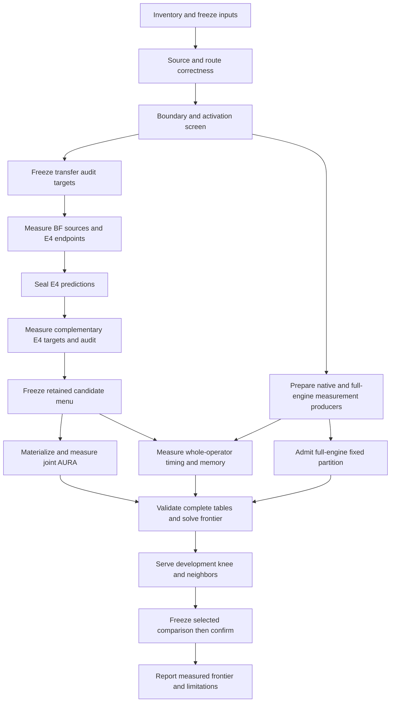

# Full-domain Tessera quality–prefill experiment

Status: implementation specification, research only. Requested by Rob on
2026-09-12 UTC; implementation and campaign ownership pass to Claude. This document
adds no running feature, measurement, serving qualification or production default.
Specification delivery: [#505](https://github.com/RobTand/prismaquant/issues/505).
Experiment/generalization: [#237](https://github.com/RobTand/prismaquant/issues/237).

Source basis: PrismaQuant `90faf8740fcfb9dbc51d5bf2b59fc1f8cf2284f6`.
The separate scalar-transfer implementation and results are in
[PR #503](https://github.com/RobTand/prismaquant/pull/503), reviewed at
`a115424b60cee0381d6a6e9252753c83f79f0589`; adopt that dependency explicitly.
The current source and new measured receipts take precedence over historical
issue descriptions. Proposed interfaces below are not existing CLI flags.

## 1. Deliverable and decision

Produce a reproducible empirical frontier of **whole-model mixed assignments**:
quality versus prefill time, with serialized-byte and physical-device-memory
constraints. Weight family/rate and compatible activation/execution policy
remain free in the same optimization. The operating point is an explicit
prefill budget or quality ceiling, with its neighboring assignments measured.
An activation-only plot and a three-uniform-format comparison are useful
controls, but neither is the requested final frontier.

There are three independently reportable outputs:

1. A full-domain inventory and bounded prospective transfer audit, including
   failures and unmeasured regions.
2. Matched joint-AURA, whole-operator runtime and independently admitted
   full-engine resource evidence for a declared retained candidate menu.
3. An exact discrete proposal frontier for that menu, followed by actual
   whole-model quality, memory and serving measurements at selected points.

A software milestone may complete while its scientific hypothesis fails.
A missing route or producer gate produces a named incomplete phase, not an
invented price or an apparently completed frontier. Preserve useful completed
phases; do not equate a negative transfer result with a broken implementation.

### What is already established

On GLM-5.3-Flash shared-expert down projections, the layer-10 exploratory
study and layer-20 prospective study support predicting E4M3 scalar output MSE
from a measured BF16 curve and two E4M3 endpoints over R832–1088. Layer 20's
primary p99/max relative errors were 0.534%/0.666%; E2M1 endpoint interpolation
over R832–895 gave 0.952%/1.093%, with R896 separate. Both passed the frozen
1% p99 / 5% maximum screen. Layer 20 had historical sparse exposure; its
fresh-rate audit excludes R960. The candidate needed 262 measured inputs
against a 579-point reference, including all 257 BF16 source points.

Those results do not establish sparse BF16 acquisition, full-domain transfer,
routed-expert transfer, joint-AURA interpolation, a speedup, or serving
qualification. The earlier sparse BF16/E4M3 adaptive policy failed its declared
accuracy screen even at large anchor counts. Preserve that negative result.

## 2. Scope, menu and units

### 2.1 Inventory the complete legal numerical space

The required primary families are Tessera-8 (`TESSERA_E4M3_K1`) and Tessera-16
(`TESSERA_BF16_K1`). At the audited producer
`d403cc5a3199a348cc7ee6262f4adbdab8138745` and reader pin
`387eda36fd410d6b2a4fb86b22285eab2a5e072c` (contract v22), the GLM column widths
2048, 4096 and 12288 admit these inclusive integer domains:

| Family | Research rates | Count per eligible Linear | Required boundary witnesses |
|---|---:|---:|---|
| E4M3 K1 | R256–2048 | 1,793 | R256, R2048; all discovered schedule/recipe transitions |
| BF16 K1 | R256–4096 | 3,841 | R256, R3584/3585, R3840/3841, R4096; other discovered transitions |

BF16's 14-bit table width is a floor. It widens to 15 bits at R3585 and 16
bits at R3841. R4096 remains a Tessera WINDOW/CHANNEL artifact, not proven
source-BF16 passthrough. Its error and complete serialized bytes must be
measured/derived from the real recipe. Keep source BF16 as a separate control.

Derive the new run's actual roster from the frozen producer grammar and
packaged reader contract using `tessera_formats`, `tessera_menu` and the real
shape. Assert the audited domains when the pinned inputs match. If a new pin
changes them, emit a reviewed inventory diff before measurement; do not carry
these constants into an incompatible producer or silently clamp its domain.
Account for the real schedule, metadata, scales, tables, alignment and padding
in bytes. R/256 is not the exported bpp calculation.

Every candidate has separate facts:

- producer legal for the exact shape/recipe;
- reader supported under an exact contract;
- an implemented execution route exists;
- native qualification covers its device/shape/structure/TP/mode;
- a complete assignment passes export and served validation.

These are separate sets, not one Boolean or a necessarily complete ladder.
The `tessera_research_sm121` profile is an emulation/allocation-report scope;
using it cannot authorize an export or label a timing as native serving.
Missing reader/route/native evidence does not delete a producer-legal research
candidate. It prevents the corresponding downstream operation and records a
specific gap. In v22 the relevant measured cells cover E4 R1024 dense/routed
and BF R1792 dense; they are not the research domain. Re-read the exact pin at
execution. Do not restore the retired release-tag gate or infer admission
from package importability. No PrismaQuant code imports/vendors Tessera's
serving runtime; native measurement crosses the existing file/receipt boundary.

E2M1/A4 may be retained as an existing, separately licensed control. It is not
a prerequisite to delivering the requested E4/BF research menu. Add no new A4
route or independent A4×BF/E4 combination by assumption. Existing NVFP4 or
compressed-tensors baselines are controls only when the frozen target actually
supports them. Gridbook and archived cross-layer machinery remain outside scope.

### 2.2 Distinguish a quality member from an execution unit

Enumerate logical Linears for quality. Use the profile/runtime's atomic serving
units for allocation and timing: a fused gate/up module or whole routed expert
operator must retain its ordered members, routes, layouts and permitted shared
recipe signature. A licensed mixed member recipe is one explicit composite
option. Never build an arbitrary weight×activation×route Cartesian product.

Record a bidirectional member-to-serving-unit map; every mutable member occurs
exactly once in an assignment. Preserve all necessary per-expert wire, source,
Hessian, activation-scale and routing identities. Sampled expert estimates are
not a full stack's materialized wires or joint-AURA prices. Preserve measured,
sampled and model-predicted provenance separately; model residuals must not
masquerade as Horvitz–Thompson sampling variance.

A full routed campaign needs the stack-to-member source/receipt bridge described
by architecture D35(iii), #290 and #495. Extend the existing dense
`tessera_joint_aura.load_measured_anchor_input` intake to resolve that map.
Keep its exact census/checkpoint/wire/PWC checks. Existing packed observers can
support a scoped member screen before this bridge, but that is not a completed
stack frontier. A missing bridge must not cause silent exclusion of routed units.

## 3. Frozen configuration and artifact contracts

Implement one opt-in experiment driver, preferably
`experiments/tessera_quality_prefill.py`, reusing the existing modules listed in
§12. It owns domain transitions; PB owns batch decomposition, placement and
execution. No agent decides the next unit during an ordinary run.

Proposed commands are `plan`, `freeze`, `submit`, `status`, `collect`, `solve`
and `report`, each accepting a versioned manifest. `plan` reads metadata and
writes a reviewable draft/count/estimate report. `freeze` rejects unresolved
required values and exclusively publishes immutable plan bytes. `submit` and
`collect` operate on that plan's dependency graph and receipt state. `solve`
and `report` refuse incomplete inputs for the requested coverage. Use existing
CLI/API entry points beneath this adapter; do not duplicate cache or allocator
implementations. Substantial planning/validation/analysis runs through PB.

### 3.1 Run manifest

Proposed schema: `prismaquant.quality_prefill_experiment.v1`. Closed field sets,
strict types, duplicate-key and nonfinite-number rejection, canonical
serialization and content hashes are required. Boolean values cannot satisfy
integer/number fields. At minimum bind these sections:

| Section | Required content |
|---|---|
| `source` | Model/config/tokenizer hashes, profile, source tensor-map identity, PQ source closure and required dependency commits |
| `producer_reader` | Tessera producer commit/source hash, reader pin and packaged contract hash, exact recipe resolver version |
| `data` | Calibration IDs/content and capture/census/H hashes, source execution selectors; separate development and untouched confirmation datasets |
| `population` | Full model unit/member inventory, eligible/excluded reasons, pilot/confirmation rosters and prior-exposure ledger |
| `menu` | Family/shape legal rosters, recipe partitions, activation/route maps, immutable-region roster, existing control assignments |
| `screen` | AQUA settings, transfer forms/partitions/audit draws, coverage quotas, uncertainty rules and refinement policy |
| `quality` | Joint probe count/seed/identity, calibration normalization, execution microbatch/arithmetic, cache and source-residency settings |
| `runtime` | GPU identity/configuration, immutable images and loaded-library/kernel manifests, workload manifests, numerical/timing/resource policies |
| `allocation` | Integer byte budgets, device/KV constraints, prefill budget sweep, optional decode constraints, exact solver limits and tie policy |
| `validation` | Baselines, development point-selection rule, final confirmation protocol, quality/performance acceptance thresholds |
| `execution` | Phase task rosters/dependencies, measured setup-cost references, PB batch/progress policies, phase work/cost limits and retry/withdrawal policy |

The first plan targets GLM-5.3-Flash and the canonical 512×512 calibration draw
used by the prior study, subject to a verified same-source capture. Preserve
its exact token artifact and separate int32/int64 identities where required;
matching names, seed or sample counts do not prove the same draw. Changes
create a new calibration identity, not a purported continuation.

Proposed workload defaults are 2,048 and 32,768 prompt tokens, B1/concurrency1,
TP1 and resident serving. Confirm actual model/context/runtime feasibility
before freezing. They are two distinct contexts/tables, not interchangeable
samples. Eager is the first correctness mode; measure graph mode separately
when it is the target. A change to chunking, graph mode, residency, KV dtype,
TP, prompt corpus or backend creates a new context. Initially keep chunked
prefill disabled only if the actual engine/context supports doing so safely;
otherwise freeze an explicit chunked workload and implement its occurrence
model before proposing a whole-prompt operator price. Current native v2
expects each prefill panel's row count to equal `context.prompt_tokens`; a sum
of differently sized chunks cannot be written into that field as one sample.

Rob has not selected a deployment byte/prefill/quality tradeoff in this spec.
For research, inherit explicit byte budgets and controls from the active
campaign configuration, or publish them as unresolved plan inputs. Never
invent a production default. Likewise, phase resource/cost limits must be
resolved from measured work estimates before that phase is submitted. Draft
planning and independent implementation can proceed with unresolved inputs;
a numerical execution phase cannot silently supply them at runtime.

### 3.2 Evidence records

Use existing cost, runtime, native-panel and PB schemas as the authoritative
inner records. Proposed experiment envelopes reference them; they do not
create a permissive alternative to an existing validator.

| Envelope | Minimum identity and payload |
|---|---|
| `candidate` | Semantic candidate ID, unit/member map, family/rate, complete recipe/activation/route, source and exact footprint, all support facts |
| `observation` | Candidate/context/phase/task IDs, inner currency/schema, raw artifact paths+hashes, producing action/attempt/receipt, validity/unknown reasons |
| `screen_decision` | Every candidate's disposition, input evidence, deterministic rule/version, retained/pruned/deferred reason and uncertainty |
| `transfer_seal` | Frozen form/segment/source/endpoints, ordered predictions, prior-exposure ledger and target plan hash; exclusive publication |
| `phase_result` | Frozen parent/plan IDs, expected task set, exact-cover child receipts, merged output digest, terminal coverage and refusal reasons |
| `assignment` | Complete member and serving-unit recipes, true integer bytes, joint-price table/context hashes, resource proposal, eligibility and exported artifact identity |
| `frontier_report` | Proposed and served points separately, raw uncertainty, selected neighbors/controls, omissions, all evidence links and reproducible commands |

Every numeric evidence record must carry `currency`, units,
`measurement_status` and provenance. Use the exact scalar currency
`output_mse_under_route_activation_contract` for scalar screens and
`joint_aura_predicted_dloss` for validated measured joint-price rows. The latter
is a measured local quadratic predictor, not observed downstream KL. Actual
held-out KL names its estimator and vocabulary/support; timings use explicit
milliseconds and byte fields are integers. Candidate identities contain no
price; separate observation IDs bind the candidate to a currency/context.
Scalar artifacts never enter the joint cost payload. The solve gate validates
all rows through the joint validator and rejects mixed currencies even when
outer hashes and rosters match.

Path strings are not identities. Verify the same owned bytes that consumers
parse. Output membership and semantic task IDs must be unique. Reject missing,
foreign, conflicting or duplicate observations. Hashes exclude their own digest
field; plan/action/result references form a DAG, never a cyclic hash graph.
Execution provenance may differ across workers without changing the common
measurement identity, but GPU/runtime measurements cannot cross device contexts
unless an explicit validated relationship permits it. Do not average hosts into
one operator price merely because both are GB10.

## 4. Deterministic phases and recovery



Transfer failure leads to the manifest's measured-only/expanded-measurement
fallback in `I`; it does not enable a different post-hoc fitted rule. A new
rule is a new development protocol with new untouched confirmation targets.

Phase states are `planned`, `waiting_dependencies`, `ready`, `submitted`,
`running`, `collecting`, `complete`, `failed`, `withdrawn`, or
`requires_plan_revision`. `complete` requires its exact expected durable
outputs and verified receipts, not a launch, heartbeat or subprocess message.
An explicit phase result may report a scientific rejection with complete
measurement coverage. `requires_plan_revision` names missing capacity, source,
route or input; agents are not state-machine transitions.

The driver resumes from immutable phase plans and validated results. It adopts
complete receipts, recovers only identity-compatible checkpoints, and retries
within the original attempt budget. Changes to candidates, data, probe
arithmetic, runtime or tolerances create a new plan/version. Completed
historical artifacts are never rewritten. Refinement rounds must be declared
in the parent policy, freeze their new roster before submission, and bind the
previous decision/result; they cannot mutate published child memberships.

## 5. Bounded pilot and full-domain coverage

### 5.1 Population selection before numerical target inspection

Use six quality strata in this canonical order: shared gate, shared up,
shared down, routed gate, routed up, routed down. Derive actual names from the
profile. Split the ordered eligible layer roster into three contiguous thirds
using cuts `floor(N/3)` and `floor(2*N/3)`. For stratum index `i` (zero-based),
choose the pilot from third `i % 3` and confirmation from `(i+1) % 3`. This
balances the six strata globally; it does not claim three depths per stratum.
Choose one eligible block in each pool by the stable rank below. Pilot and
confirmation unit IDs must differ. Preserve paired gate/up membership when
execution requires it; publish the resulting expanded roster/counts before
measurement. An empty pool is an explicit coverage gap requiring a new plan;
there is no automatic substitution from a convenient depth.

Exclude L10 and L20 shared-down from confirmation. Freeze the complete
historical exposure inventory, not only those two names. Prefer wholly
unexposed eligible units; if unavailable, report all-rate and fresh-rate audits
and state the overlap. Empty confirmation strata are incomplete coverage.
For a routed member diagnostic, select one expert from the highest and one
from the lowest nonzero routing-count quartile using the same stable hash.
Use the actual census counts, not the global calibration token count. These
members are diagnostics; whole-operator runtime and final stack quality retain
the entire required expert/member roster. Zero-route members remain explicit
and cannot acquire a zero population-wide cost from one unobserved sample.

Selection uses SHA256 over UTF-8 canonical JSON (sorted keys, compact
separators, no NaN), containing `source_sha256`, `selection_seed` (initially 0),
`purpose`, `stratum_id`, and canonical `unit_id` or integer `rate`. Sort by
`(digest, canonical_id)` and take the specified count without replacement.
Purpose domains distinguish pilot, confirmation, rate audit, routed expert
selection and discarded-candidate audit. Freeze the resulting explicit lists;
recomputation must match them exactly. This is the initial population minimum,
not permission to report model-wide or cross-model generalization. Additional
shapes/models remain a promotion gate.

### 5.2 Scope expansion and assignment completeness

The first six-stratum roster is a restricted pilot. A member diagnostic is
not a frontier. A pilot operator frontier is labeled with only its active
serving units. If it is materialized for a whole-model development comparison,
complete every other member from the frozen current baseline assignment and
record those locked choices, their measured resources and their fixed effect
on the comparison. They remain quantizable parameters for bpp accounting;
experimental locking does not turn them into immutable BF16 regions.

The final requested frontier requires a separate full-model coverage plan.
Enumerate every mutable serving unit, apply the declared candidate-retention
policy independently, materialize and measure every retained joint option,
and obtain all whole-unit runtime rows. A complete option for a routed stack
requires every required member wire, scale, source/PWC and aligned joint row;
a high/low-count expert diagnostic cannot satisfy this gate. Each unit needs
at least one verified feasible baseline option and every retained option needs
complete evidence. Only profile-pinned/actually immutable components belong
to the independently accounted fixed assignment.

Require exact equality between full mutable census membership, quality-table
coverage, runtime-binding expansion and selected assignment membership before
labeling a proposal as the whole-model retained-menu frontier. Unknown units
or a missing routed bridge leave it incomplete. Partial success retains its
restricted pilot label. Direct measured comparisons of complete baseline-filled
artifacts remain possible, with their restricted search scope stated.

### 5.3 Enumerate everything; acquire evidence in bounded stages

Full-domain inventory is exhaustive. Measurement coverage is separately typed:
`measured`, `predicted_screen`, `retained_pending_measurement`,
`pruned_by_declared_screen`, `unsupported_route`, or `not_yet_acquired`.
Publish counts by family, role, structure, shape and recipe segment. No member
of the legal numerical roster may disappear from the ledger.

Before a dense sweep, measure mandatory boundary/control cells and a frozen
stratified interior pilot. Use recipe/signature changes discovered by the
canonical resolver as hard boundaries. Also partition research audit strata
at integer schedule transitions (multiples of 256 and immediate neighbors
where legal). These are audit strata, not evidence that error is smooth between
them. Construct the mandatory set by querying the canonical recipe/schedule
resolver, adding each transition's legal immediate neighbors and domain ends,
and deduplicating exact candidate IDs. In each interior stratum choose exactly
`min(16, remaining_legal_rate_count)` rates by §5.1's stable rank after removing
mandatory points; publish the full roster and its digest.
This bounded screen covers the numerical extent without pretending to be a
complete reference curve. Small-sample p99 is descriptive only.

The next transfer qualification tier is the complete E4 domain R256–2048 on
confirmation units, paired with exactly the BF source rates R256–2048 (1,793
points in each family before any compatible receipt reuse). It is called
`complete_e4_common_domain`; it is not a full BF-domain curve. Report its exact
acquisition count/cost before launch. BF R2049–4096 has a separate sealed
`bf_high_domain` plan for boundaries, stratified screening and retained joint
candidates, and has no E4 counterpart. Only a separately requested and fully
receipted BF R256–4096 sweep may claim `complete_bf_domain` (3,841 points).
Its existence is not assumed or required by an E4 transfer pass. The full
research inventory and final measured retained-menu coverage still include
BF-high candidates; E4 transfer cannot stand in for their quality or runtime. Do not re-run completed compatible points merely to fill GPUs.

If a full confirmation tier exceeds the frozen phase budget, stop at an
honestly bounded pilot and publish the remaining roster/cost. Do not claim
full-domain transfer qualification. The joint/runtime pilot can proceed on its
explicitly measured retained menu without a successful interpolation shortcut.

### 5.4 Screening must preserve both allocation axes

The initial screen policy is `coverage_first_v1`: retain all mandatory
boundary/control candidates and the exact per-stratum draw in §5.3 for joint
and runtime measurement. The initial menu makes no AQUA-only hard deletion.
Use AQUA's existing activation-aware approximation to prioritize activation
policies and acquisition. Keep its uncertainty and approximation status. It
is not a joint price or a second term to add to joint AURA. Scalar wire MSE
and a validated transfer prediction may prioritize rate candidates.

Before runtime prices exist, quality/byte dominance alone must not remove a
possibly faster execution route. Retain each distinct licensed activation/route
class, all hard boundaries/controls, and the declared per-rate-stratum interior
quota. Record exact ranks, tie handling and every rejected candidate. Unknown
quality/runtime/uncertainty is not zero and cannot prove dominance. The manifest requires integer `max_retained_candidates`,
`max_composite_options`, `max_tasks_per_phase`, and measured phase work/cost
limits. Apply them after exact roster and licensed composite expansion. If
mandatory coverage exceeds any cap, freeze/submission refuses with required
versus allowed counts; it never reduces a quota, drops a class or retains a
prefix. A newly selected cap/policy is a new explicit plan. Any later hard
pruning policy is versioned separately and must define its complete score,
uncertainty, dominance/tie rule and discarded-candidate audit before seeing
those audit targets.

Use deterministic coverage audits of discarded candidates, chosen before their
joint/runtime truth is opened. A confirmed omitted nondominated candidate
causes expansion under the frozen refinement rule or marks that menu's
screening gate failed. Without valid global bounds this remains an empirical
retained-menu frontier, not a proof of full-domain optimality.

## 6. Prospective transfer protocol

Reuse and generalize PR #503's frozen protocol, exclusive seals and strict
collector. Separate laws by role, structure, compatible recipe segment and
common legal rate domain. No shared-down coefficients or pass verdict can
qualify routed gate/up/down. The existing pooled stack transfer law from #495
is a different model and must retain separate identity/evidence.

Primary form is `E4(r) = alpha + beta * BF(r)`, with coefficients solved solely
from the two paired segment endpoints. Fixed secondary form is
`BF(r) + linear_in_r(E4(left)-BF(left), E4(right)-BF(right))`.
Do not select the secondary retrospectively or extrapolate beyond endpoints.
Refuse coincident BF endpoint values, invalid/nonpositive predictions or an
empty interval. Every structural discontinuity has its own exact measured
boundary record; do not smooth it or mix a terminal recipe into a window fit.

For each target set: freeze forms, inputs, endpoint/target plans and prior
exposure; acquire required BF source values and E4 endpoints; seal the entire
ordered prediction set; only then publish the E4 target acquisition. In a
sampled pilot, BF is measured at every predicted target rate but not claimed
to be a full curve. In a complete-domain audit, source and target cover their
complete declared common-domain rosters (BF-high remains separate as §5.3
specifies). Keep exact endpoint equality and exclude endpoints
from interior accuracy metrics.

Use `abs(prediction / measured - 1)` in the original scalar-MSE currency.
Report count, mean, p50/p95/p99/max, worst rates and all/fresh views per unit,
segment and stratum, without pooling away a failed stratum. The inherited
screen is p99 ≤1% and maximum ≤5%, with finite positive complete predictions;
empty/fresh-empty is not pass. Sampled screens do not certify unobserved rates.
A shortcut is usable only within the measured validation scope and remains a
screen/acquisition hint in this experiment.

Crucially, neither transfer form becomes a joint-AURA price. Every candidate
retained for final optimization is rendered/measured under the actual joint
operator contract. Interpolated scalar values cannot be renamed, multiplied
by a fitted gain, or inserted into an exact joint cost table. Measure actual
winner wires even if an earlier screening estimate selected them.

## 7. Joint-quality producer

Extend `tessera_joint_aura` preparation and `compute_aura_cost_streamed` rather
than adding a quantizer/cache/probe stack. Reuse ProductionWeightCache,
PerturbedActivationCache, selected-source prefetch and shared activation QDQ.
Validate original source/H, producer wire bytes and decode-to-PWC equality.
Scale ownership, preclip behavior, actual routing and backend selectors belong
to identity. Pure source BF16 controls are measured aligned controls, not
fabricated zero rows.

For each invocation and probe, retain the signed components of

```text
dY = X dW.T + dX W.T + dX dW.T
a[k] = <G_Y[k], dY>
price(unit) = 0.5 * mean_k(a[k]^2)
```

Sum the three components and all invocations/partitions of the same logical
Linear before squaring. Preserve full calibration normalization and global
probe coordinates. Use at least two probes, with initial research proposal
16; freeze the actual count/seed and execution microbatch before acquisition.
Refinement uses a new sealed probe plan and complete aligned comparisons.
Do not mix different arithmetic/microbatch identities in one paired table.

Retain aligned probe samples and source/render/activation/operator/probe
identities. Run `validate_joint_aura_entry` before generic candidate scoring.
Apply the joint currency once: no second scalar Fisher, activation penalty,
AQUA value or calibrated scalar gain. A table cannot mix joint and scalar rows.

Allocation uses the existing additive sum of unary joint prices. Separately
report `paired_assignment_difference` for the additive objective and the
`joint_quadratic` diagnostic, which sums different units' signed totals before
squaring. Neither diagnostic is a fresh full-model KL measurement. Common
probe covariance is retained for paired differences; probe error and held-out
sequence uncertainty are reported separately.

Validate numerical decomposition against direct residual/projection on small
resident fixtures and representative real source boundaries, including
repeated invocations, fused views, packed experts, static scales and
microbatch partitions. Freeze tolerances from the existing arithmetic oracle
and baseline parity before candidate outputs are opened; store absolute and
relative errors and tolerance provenance. An unobserved hook or missing
member refuses instead of emitting a free zero candidate.

## 8. Runtime and resource measurement producer

### 8.1 Exact workload and operator identity

Extend `native_operator_panel`, `native_moe_panel` and their preparation /
freeze / consume adapters. PQ emits immutable source/reference panels;
Tessera's separate benchmark executes its own plugin/native code and returns
receipts. Bind the whole `RuntimeBinding`: ordered members, formats, shapes,
actual joint operator hashes and execution route. A fused operator needs a
whole fused timing; a routed operator needs dispatch, activation QDQ, packing,
expert kernels, combine and relevant shared work inside the declared boundary.
Do not sum isolated expert matmuls and call that a whole-MoE price.

A workload manifest freezes prompt IDs/content and tokenization, batch and
concurrency, total and chunk token counts, prefix-cache policy, graph capture,
KV dtype/capacity, resident/streamed mode, TP/topology, source attention/expert
backend, exact image+loaded libraries/plugin/kernel builds, GPU UUID/power
configuration and instrumentation versions. Record routed token IDs, weights,
counts and token coordinates per operator occurrence; B1 does not mean one
row per expert. Reuse only the same declared occurrence mixture, or qualify
an explicit parameterized runtime model in a separate protocol.

The primary resident experiment excludes model load/encode/compilation from
prefill pricing but records those costs and validates warm state. Include
activation quantization and all route work that actually occurs during
prefill. Streamed mode is a separate workload with transfers charged; it must
not borrow a resident timing table.

### 8.2 Timing protocol

For an operator comparison, baseline and candidate share the same frozen
inputs/routing and isolated device context. Default research protocol:
5 warm-up applications after compilation/capture, followed by 5 paired blocks
of 7 single-application measurements per arm. Freeze a balanced interleaved
arm order and seed; record every event sample, block and synchronization
boundary. Use GPU events around the actual complete operator with the proper
stream dependencies. A batching/amortization variant is a different protocol
and must explain how it preserves single-application behavior.

Confirm warm-up stability against a predeclared drift tolerance using baseline
only. If insufficient, revise the plan before target acquisition or mark it
inconclusive. Do not trim slow samples post hoc. Outlier, thermal/throttle and
external-load exclusions require predeclared evidence rules and retained raw
samples. When resident A/B preparation does not fit, use the same explicit
load/prefetch sequence outside each timing interval and verify its state.

Store operator median as the existing proposal price; report spread and
block-level paired uncertainty separately. Bootstrap blocks, not correlated
single inner-loop samples, with a frozen seed/resample count. No statistical
confidence turns an operator median sum into p95 TTFT. Keep timestamped clocks,
GPU event durations, sample counts and instrumentation overhead controls.

### 8.3 Complete resource partition: dependency #420

`runtime_provenance.admit_fixed_resources` recomputes the full-engine
partition and admits only on agreement; at the producer's current schema
version it still refuses every v2 partition, now naming which term, identity or
observation is missing. That refusal is correct, and the timing partition the
prefill budget needs is one of the missing observations. Implement and validate the producer
and independent consumer required by
[#420](https://github.com/RobTand/prismaquant/issues/420) before reporting a
complete allocatable runtime table. This is not a prerequisite to independent
direct comparisons of explicitly configured complete variants using the normal
byte/quality allocator and actual served measurements. Preserve the existing
six-variant flow described in the linked #420 design; this program must not
insert a new runtime-v2 requirement into that separate task. Such comparisons
can supply empirical points without claiming runtime-constrained optimality.
Do not bypass the optional table gate by emitting a permissive
v1 table, parsing without loading, setting a completion Boolean, or attaching
an arbitrary hashed proof blob.

The new versioned producer record must bind raw full-engine traces and an
independently recomputable ownership/temporal partition:

- Every allocation lifetime has a stable allocation ID/generation, address
  range, size, device, timestamps and owner. Address reuse is not identity.
- Ownership distinguishes candidate resident storage, candidate transient
  activation/scratch, immutable/fixed model storage, KV, graph pools, engine
  and allocator overhead. Shared storage has one declared owner and explicit
  aliases; opaque/unattributed live storage is an admission failure.
- Raw timeline events partition candidate operator work and fixed work
  without overlap or omission. Fixed latency cannot be obtained by subtracting
  a sum of independently measured medians from full-model wall time.
- Fixed inputs and resources must be invariant across the compared candidate
  assignments. Multi-option admission requires source-bound ownership/capacity
  invariance rules with qualified substitution controls. An option changing
  shared/fixed ownership needs a separately measured assignment/context or a
  versioned richer resource model; a standalone conservative envelope cannot
  waive this requirement.
- Logical tensor bytes, allocator reserved/allocated bytes and physical process
  residency remain distinct observations. Charge allocation pools once, account
  for unassigned reserved capacity, and reconcile the modeled total against
  raw observations in the declared GPU-allocation scope. Host/UMA observations
  are separate evidence and cannot silently enlarge scalar v2's scope. Do not double-count both a pool
  and all its backed tensors as independent physical memory.
- Persist source/runtime/provenance relation, full workload, atomic unit map,
  instrumentation/source-build IDs, trace hashes, arithmetic and partition
  rules. The consumer rederives all sums, lifetime overlaps, maxima and exact
  coverage from raw records; it does not trust supplied aggregates.

The first #420 positive adapter must remain one GPU, TP1, resident and eager
with an explicit GPU-allocation scope, as required by
[the existing fixed-resource design](runtime_fixed_resource_admission.md).
It does not certify whole-host/GB10 UMA fit. If the requested memory budget
means physical shared-system capacity, a versioned resource-domain/vector and
solver/feasibility extension is required. Record host/UMA observations in the
meantime and refuse physical-fit claims; neither rank sums nor CPU+GPU scalar
sums close aliasing. The program's physical-fit objective remains open until
that scope is supported or independently established by the stated final
whole-model measurement, with no predictive fit guarantee beyond it.

Existing proposal resource composition is the sequential model:
serialized bytes and terminal residency add, activation and scratch have
separate conservative maxima, and fixed/KV resources are charged once. Prove
its applicability to the measured execution graph. Unsupported concurrent
unit execution, overlapping memory lifetimes or chunk-dependent operator
mixtures require a versioned model extension and tests before admission.
A larger empirical whole-model peak can invalidate the proposal; it cannot
be silently dismissed as allocator noise.

For every repeated full-engine prefill and decode sample, preserve ordered
native apply intervals and adjacent fixed gaps in the same CUDA-event/stream
chain. Independently verify full-step recomposition, all expected operator
occurrences/launch correlations, and no dropped tail, overlap or unjoined
stream. Sum that sample's fixed gaps, then take the median of complete repeated
samples; never subtract independently measured medians. Require positive
warmups and at least three complete repeats per phase under the existing gate;
use the fuller paired policy for reported comparisons. Qualify observer impact
and trace completeness from raw control/partition arms before admitting prices.

Current `runtime_provenance.admit_native_rows` requires **both prefill and
one-token decode** timing/resource evidence per native row, even if the
allocation's decode constraint is unset. Its peak charges span both phases.
The new full-engine partition must cover both accordingly. A genuinely
prefill-only table needs a versioned producer/consumer change; omitting decode
from current v2 is not supported. Preserve actual engine-generated decode IDs;
a native M=1 prefix is a local operator check, not served autoregression.

The original resource, timing and observer-control run manifests remain
separate. The current runtime relation relates one engine run to its native
runs; additional full-engine/control runs require an explicitly versioned
multi-run relation, not replacing one digest with another. Native returned
output/input lifetimes must reconcile with carried full-engine activations,
including alias retention; never subtract output size from an independent peak.
Caller KV/scratch reserves must be disjoint extra capacity, not the same fixed
allocation charged a second time. Follow #420's existing ownership/timing
specification for detailed envelope/recomputation semantics.

The raw full-engine instrumentation must work with unforked vLLM and the
external Tessera plugin. Instrumentation belongs in the owning repository;
PQ consumes schemas and receipts across the pin boundary. Native/operator
parity alone cannot promote new native cells or supply full-engine resources.

### 8.4 Profiling and energy

Collect an in-process profile inside the actual CUDA process and Netdata
series on both GB10 hosts for representative baseline/candidate phases.
Verify that a requested CUDA trace contains CUDA/kernel events; an outer
Docker Nsys wrapper is not sufficient. Separate profiling from primary timing
unless both arms use the same measured instrumentation policy and overhead.

Record prefetch/residency counts, cache misses, CPU/I/O/PSI, device power,
thermal/clock state, ready queue and admission reasons. On GB10, compare power
with the approximate 140 W envelope and useful work per joule. GPU utilization
percentage is not a saturation diagnostic. Integrate the actual sampled
power timeline with its coverage; no mean-power × unrelated duration estimate,
no sum of overlapping box windows, no attribution through competing load.
Insufficient sensor resolution produces unknown energy, not a guessed value.

Profile baseline before changing a demonstrated hot path, then the same
workload afterward. Repair measured underfeeding through the existing cache/
prefetch/batching mechanisms within a separate implementation commit. Do not
add synthetic work or weaken memory enforcement to make the machine look busy.

## 9. Allocation and empirical knee

Admit complete matched joint and runtime tables through the existing loaders,
including independently supplied expected context and cost-payload digest.
Require existing `status: proposal_data` and
`composition: sequential_operator_sum` for the current measured-runtime table.
Missing candidate runtime rows, mismatched recipes or unknown fixed resources
refuse the requested solve. A user-declared reduced menu is a new explicit
scope, never an automatic consequence of missing evidence.

Use `preserve_runtime_frontier=True` before candidate reduction/fused folding,
then `allocator_solver.solve_runtime_frontier`. Optimize one assignment over
all mutable serving units:

```text
minimize sum of measured unary joint-AURA prices
subject to exact serialized mutable bytes <= byte budget
           modeled resident + transient + fixed/KV <= device budget
           measured operator-sum prefill proposal <= prefill budget
           optional decode proposal <= decode budget
           every choice satisfies its serving-unit compatibility constraints
```

All weight and activation choices remain available in each solve. No preceding
greedy activation pass freezes A16/A8; no global family rule replaces per-unit
choice. Keep exact integer bytes, nonconvex feasible choices and distinct
runtime routes. Solver state/transition/combination caps refuse excess work
rather than returning an incomplete answer as exact. Tie breaking must be
stable and explicitly recorded.

Sweep the frozen prefill budget grid at each frozen byte/device budget, retain
all nondominated assignments and identify gaps. Existing CLI naming includes
`--slo-prefill-p95-ttft-ms`; when used for this proposal it remains an
operator-sum budget, never an observed p95. Recheck the expanded/promoted
assignment and fixed auxiliary choices against the same resources.

Plots show separate panels for predicted joint loss versus proposed prefill,
measured held-out quality versus actual prefill duration, and prompt tokens/s.
Annotate weight bpp over quantizable parameters only, A16/A8/A4 distribution,
wire/resident/KV bytes and exact workload/recipe identity. Do not average in
immutable BF16 regions or join unmatched workload points into one frontier.

For reproducible development point selection, normalize latency and loss to
[0,1] using the frozen feasible endpoint/control range for that workload and
byte budget. Among nondominated points choose the greatest perpendicular
improvement from the endpoint chord; tie by lower measured/proposed latency,
then assignment ID. Publish the normalization and chord. Degenerate ranges,
insufficient points or overlapping uncertainty may yield no unique knee.
Always select its adjacent nondominated neighbors and both feasible endpoint
controls for measurement. This geometric rule proposes a region; Rob's actual
quality/budget choice remains an explicit configuration input.

## 10. Whole-model validation and refinement

Operator evidence proposes assignments. Materialize each selected complete
assignment through the existing export path and validate exact metadata,
wire bytes, source/static-scale bindings, pinned plugin and serving gates.
New rates/structures lacking a native/served route need Tessera-owned work and
qualification. A decoded BF16 fallback must be labeled as that different route;
its speed cannot be called native Tessera performance.

Use an unchanged BF16 teacher and common data. Separate datasets by purpose:
calibration for AQUA/joint prices, development for neighbor diagnosis/menu
refinement, and untouched confirmation for the final frozen comparison.
Keep whole-sequence uncertainty and teacher/student/tokenizer identities.
Do not tune the chosen point on final confirmation and reuse the same set to
claim independent validation.

At minimum compare the proposed knee, its two available neighbors, fastest
and best-quality feasible endpoints, the active current baseline, and feasible
uniform controls at matched budgets. Deduplicate identical assignments by
hash. If an endpoint is infeasible or unsupported, report it with its reason.
Include weight-only-AURA selection on the same retained renders/runtime menu
as a diagnostic baseline; do not compare independently tuned menus.

Measure actual prefill phase duration and prompt tokens/s where the engine
exposes them. Client TTFT includes queue/setup/first-token work and is separate.
Retain decode ITL when constrained, actual KV/memory peaks, output correctness,
eager/graph checks required by the target, and downstream quality checks
(PPL/mean NLL, held-out KL, log-likelihood tasks and the repository's applicable
serving suite). Bind the metric definition: `measure_served_gold.py` uses
its declared top-K-plus-tail KL, whereas `measure_vllm_full_kl.py` has a separate
full-vocabulary scope. Never compare or relabel them as the same estimator. Include ToolEvalBench when required for materialized artifacts.

For a p95 claim, the default research minimum is 100 completed requests per
assignment/workload, with a frozen common prompt roster, balanced paired blocks
and block-level uncertainty. A small smoke cannot certify p95. Record failures
and timeouts; do not drop them from completion/SLO accounting. Dataset coverage
and repetitions must justify the particular statistic, and repeated identical
requests cannot masquerade as independent prompt generalization.

Before confirmation, freeze numerical quality tolerance/noninferiority margins,
latency/memory limits and any required confidence criterion. The spec does not
invent a quality/performance trade for deployment. Report an inconclusive or
regressing result honestly. A model-quality gain or speed gain requires its
matched actual measurement and uncertainty, not the local price ranking.

Development discrepancies trigger only the declared bounded refinement:
materialize disputed candidates/swaps, measure their joint/native/full-model
behavior, revise the menu or resource model under a new sealed plan, and
rerun allocation. Keep the teacher fixed. Do not revive archived cross-layer
optimization or recenter Fisher on a quantized assignment as an unannounced
repair. Unresolved ranking/resource errors leave the result research-only.

## 11. PB integration, capacity and cancellation

Use the user-approved design in
[PB #517](https://github.com/RobTand/prismabuild/issues/517) /
[PR #518](https://github.com/RobTand/prismabuild/pull/518): immutable logical
parent → PB initial decomposer → frozen exact-cover child plan → ordinary
sealed child actions. The design is not proof of deployed capability.

PQ declares semantic tasks, dependencies, residency groups and measured
setup/useful-work costs. It never assigns hosts, worker/shard counts or live
subsets. Measure setup amortization before setting PB batch policy; use the
smallest useful children that preserve resident reuse. Once an execution child
is published, its scope stays immutable whether ready, running or retrying.
No actor/inner-lease pool, work stealing, live split or app-owned dispatcher.

Rate observations are independently identifiable tasks. A paired timing block
is atomic so baseline/candidate remain isolated on the same device. A joint
probe/replay partition is atomic at its existing signed-accumulation and
calibration barrier; arbitrary sharding that changes arithmetic is forbidden.
PB may group compatible tasks to amortize source/calibration preparation.
Each child writes attempt-private fragments and exact task results. Merge only
identity-equal disjoint fragments under the original full-domain plan; never
append concurrently to one full-band journal. Final curve collection keeps
its original plan/roster verification.

All non-vLLM tests, numerical analyses, builds, exports, probes and GPU work
run through PB. Children execute directly without recursive submission.
vLLM work is entirely exempt and runs directly in the known-good environment;
its load remains external load for other PB admissions. Do not submit a mixed
wrapper to evade or overextend either rule.

Use every eligible resource for independent useful work. Bound aggregate CPU,
native threads, unified memory, GPU demand, cache/source buffers and scratch.
Preserve PB affinity, including containers. Portable non-comparison tasks are
not host-pinned. Matched runtime comparisons have a real isolation/device
constraint. Never relax that constraint to fill an idle GPU.

Declare ordered semantic progress and empirically justified stall allowances
on runtimes actually offering `progress-v1` and the necessary pool/helper/cycle
capabilities. Report cumulative units only after durable publication. User
hard deadlines and withdrawal still apply. A sealed request is not extended
in place. Parent withdrawal prevents future child publication, invokes normal
child containment, and returns capacity only after exact scope cleanup.

At each phase boundary inspect receipts, logs, CAS payloads, actual output
coverage and completed resource profiles. Inspect ready/claimed/admission
state before diagnosing an idle host. Unsupported PB subdivision is a named
capability gap; implementation can proceed, but no bespoke dispatcher fills it.

## 12. Implementation map and ownership

| Work package | Existing extension points | Concrete completion |
|---|---|---|
| Inventory and manifest driver | `tessera_formats.py`, `tessera_menu.py`, `tessera_runtime_contract.py`, current source/census/profile plans | Exact legal roster, unit map, support ledger, closed frozen manifest and deterministic state transitions |
| Prospective multi-unit/segment audit | PR #503 `experiments/sparse_rate_family_transfer.py`, `collect_complete_rate_curve.py`, current rate-surface helpers | Preserved seals, per-segment audits/exposure, explicit sampled/full coverage and measured fallback |
| Routed source/receipt intake | `tessera_joint_aura.py`, `tessera_campaign.py`, `tessera_anchored_surface.py`; #290/#495 | Exact stack-to-member wire/source/PWC replay, no sampled-to-measured relabeling |
| Joint-quality acquisition | `aqua_activation_cost.py`, `aura_cost.py`, `joint_aura.py`, PWC/PAC and packed observers | Complete aligned measured joint rows and oracle/parity receipts |
| Native measurement producer | `native_operator_panel.py`, `native_moe_panel.py`, `experiments/pq267_native_panel.py`, `pq309_native_moe_panel.py` | Actual paired whole-operator numerical/timing/memory receipts for frozen candidate/workload scope |
| Full-engine partition | `runtime_provenance.py`, `measured_runtime_prices.py`; #420 | Real producer plus independent recomputation and raw full-engine evidence; preserve gate until qualified |
| Joint proposal/validation | `allocator_candidates.py`, `allocator_solver.py`, `allocator.py`, current export/serve/additivity harnesses | Exact retained-menu frontier, checked expanded assignments and measured whole-model comparisons |
| PB decomposition and PQ batch adapter | PB #517/#518 and existing campaign journals/collector | Deployed supported pre-execution subdivision, exact-cover/private-fragment semantics and recovery evidence |

Claude owns sequencing and implementation. Keep substantive changes in scoped
commits/PRs with the existing issue links and PB receipts. Tessera native
route/qualification work stays in Tessera; PB scheduling changes stay in PB.
Coordinate ownership before editing another agent's live branch. The spec
branch is handed over after its documentation PR is published.

Update `docs/ARCHITECTURE.md` and its provenance in the same implementation
commit for any actual new contract/default/stage topology. This specification
itself changes none. Keep experiments opt-in until ordinary numerical,
serving, second-model/shape and downstream promotion gates are satisfied.

## 13. Acceptance matrix

These are required implementation/measurement checks, not tests executed by
this documentation PR. Use regression-first tests for behavioral repairs.

| Gate | Positive evidence | Required refusal / negative evidence |
|---|---|---|
| Full numerical domain | Exact E4/BF legal counts on audited GLM shapes, schedule/byte derivation and both BF table transitions | Illegal shape/rate, missing legal candidate, R4096 misreported as source BF16, attestation used as research range |
| Closed identities | Same inputs reproduce rosters/keys; source, data, recipe, scale, arithmetic, workload changes invalidate proper stage | Unknown fields, malformed hashes, mutated bytes, stale pin, cross-workload/GPU mixing |
| Atomic serving units | Exact once-only member map and licensed composite expansion | Missing/duplicate members, incoherent fused scales/routes, sampled wires presented as full stack |
| Prospective seal | Source/endpoints only before seal; targets published afterward; exact endpoints and separate boundaries | Target leakage, changed form, empty audit, nonpositive prediction, refit or extrapolation |
| Screening | Complete disposition ledger, quotas and prechosen rejected-candidate audit | Missing runtime treated as zero; byte/quality pruning removes unknown faster routes; silent budget truncation |
| Joint residual | Direct oracle, signed repeated-call/partition parity, aligned probes and cache provenance | Squared terms before summation, missing hooks, fake zero rows, double Fisher/AQUA, scalar-as-joint |
| Native timing | Whole-unit route/numerical parity, raw paired single-apply samples and same-panel resource traces | Isolated matmul as fused/MoE price, changed input routing, encoder time as prefill, post-hoc outlier deletion |
| Fixed resources | #420 producer/consumer independently close ownership and lifetime/timing partition | Missing/overlap/alias/double count, pointer reuse, opaque scratch, unsupported concurrency, constant proof flags |
| Exact allocation | Small brute-force oracle including nonconvex and faster same-byte options; expanded assignment resource parity | Missing runtime rows, wrong currencies/units, incomplete state-cap result returned as optimum |
| PB recovery | Faults before/after plan freeze, partial child publication/result commit, retries and withdrawal; exact coverage | Child mutation, duplicate/foreign output, shared journal writes, capacity release before cleanup |
| Scientific confirmation | Untouched common-data complete assignments, baselines/neighbors and raw uncertainty | Calibration/probe variance as generalization, operator-sum as p95, tuning on confirmation, unsupported served route |
| Resource/perf evidence | In-process trace plus both hosts' Netdata, measured residency and paired work/joule where attributable | Empty CUDA trace accepted, GPU utilization as saturation, overlapping window energy sums |

## 14. Delivery sequence and final report

Implement in these reviewable milestones; independent producers can overlap:

1. Metadata inventory, frozen schemas, source/support dependency report and
   dry-run task/count/cost estimates. Resolve target budget/workload inputs.
2. PB decomposition qualification and PQ adapter; small deterministic source,
   grammar, cache and joint-residual correctness gates. Dense preparation can
   proceed while the routed bridge and #420 producers are built.
3. Bounded full-extent pilot and prospective transfer screen, with explicit
   failures/fallback. Freeze affordable confirmation and retained menus.
4. Expand to the full mutable-model census under §5.2; complete all retained
   joint/native options and qualify full-engine resource admission. Routed
   options require full member wire/PWC/joint coverage, not the diagnostic draw.
5. Exact proposal sweep, development knee/neighbors, any bounded refinement,
   frozen final comparison and untouched whole-model confirmation.
6. Final report/artifact bundle and definitive disposition of every candidate,
   incomplete route, failed hypothesis and reusable implementation.

The final bundle includes frozen configs and exposure ledgers; source/recipe/
unit inventories; all measured and screening currencies separately; raw native
and full-engine traces; verified PB/direct-vLLM receipts; models and exported
assignment hashes; scripts/commands; PNG/PDF figures and their input hashes;
actual KL/NLL/task results, prefill/TTFT/ITL/memory/energy where measured; test
modes/skips; and unresolved gaps. Claims are limited to the measured menu,
model, calibration, workloads, devices and validated runtime relation.

A successful handoff or software test is not completion of the campaign. A
completed campaign need not show a unique knee or an improvement; a negative
or inconclusive result with intact evidence is a valid scientific outcome.

## Source and evidence index

Read these alongside the implementation map; the source basis is the commit
at the top of this specification, except for the explicitly separate PR #503.
Function names are the stable navigation anchors; line numbers below describe
the inspected version.

| Contract | Inspected source |
|---|---|
| Full legal rate/shape validation | `tessera_formats.validate_body_rate_q256` (1125–1235), `tessera_runtime_contract.py` reader ranges (187–210), `tessera_formats.fused_shared_signature` (1615 onward) |
| Exact wire-to-joint intake | `tessera_joint_aura.load_measured_anchor_input` (81–238), `prepare_cache`, `execute` |
| Existing signed arithmetic and admission | `joint_aura.SignedJointProjectionLease` (281–502), `validate_joint_aura_entry` (787–880), `assignment_probe_summary`, `paired_assignment_difference` |
| Whole-unit runtime binding and fail-closed lookup | `measured_runtime_prices.RuntimeContext` (99), `RuntimeResources` (188), `RuntimeBinding` (220), `load_measured_runtime_table` (446), `build_runtime_resources` (473) |
| Fixed gate and mandatory native phases | `runtime_provenance.admit_fixed_resources` (418 onward), `_fixed_resource_refusals` (449 onward), `admit_native_rows` (603 onward) |
| Exact proposal and expanded assignment checks | `allocator_solver.solve_runtime_frontier`, `serve_constraints.evaluate_measured_assignment` (797 onward), allocator runtime integration (3847–3905) |
| Existing full-engine producer design | [Full-engine fixed-resource admission](runtime_fixed_resource_admission.md), including native output ownership, UMA scope, multi-run relations and the separate direct six-variant route |
| Narrow transfer result and raw figure | [Layer-20 result at the reviewed PR #503 commit](https://github.com/RobTand/prismaquant/blob/a115424b60cee0381d6a6e9252753c83f79f0589/docs/measurements/prospective-family-transfer-2026-09-11.md) |
| Legal domain derivation | Frozen shared audit below, with immutable Tessera source citations |

Original artifact root:
`/mnt/shared/tessera-measurements/glm-canonical-census-20260908/sparse-rate-20260911/`.
Legal-domain source audit: `tessera-legal-domain-source-audit-01.md`, SHA256
`b2ec2c6be76c6c0c557ffa642a9290e26f960b9781fb0e843c9d101fbc2c88b2`.
Prospective data: `prospective-shared-down-l20-01/`, including original plans,
seals, both audits, 579 measured point receipts, verified terminal/CAS ledgers
and figure input hashes. Reuse evidence only when the new plan's identities
and currency match; a citation never upgrades its validation scope.
