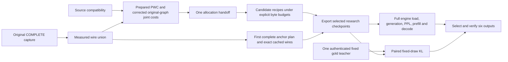

# GLM downstream handoff — 2026-09-08

This is the bounded handoff for six research artifacts: one Spark and two
Sparks, each with accuracy, prefill and balanced selection intent. It binds
existing interfaces and identifies missing inputs; it does not report six
completed artifacts or production qualification. `handoff-draft.json` is an
unsealed intake record with explicit nulls, not an accepted collection receipt.

Source basis: PrismaQuant `21ae7d28b7d313654beda6b4e622d732d4276a34`, gold
instrument fix `0661c3e7eb`, and frozen Tessera producer
`07ad344c3275bb2fa7ce2432f93d89945d66f4c2`. No `prismaquant/` or Tessera source
changes are part of this handoff. The original fit draw, producer identity,
family menu, release pin and production ship gates remain owned by the root
campaign. See the earlier [recipe intake](../glm-six-variant-recipes-20260908/README.md)
for allocator and common-input details; this report updates its downstream
dependencies, including the now bounded export-H reference handoff.

## Dependency order and first full-engine gate



The earliest full-engine attempt needs one complete whole-model anchor plan,
all its accepted selected wires, a working calibrated packed export handoff,
original BF16 passthrough tensors, full model
configuration/tokenizer, and the explicit packed execution configuration.
It does not require corrected-graph source compatibility and can start before
joint costs, final six-way allocation or optional runtime-v2
prediction. Raman owns anchor availability and selection; the first three
isolated expert wires are insufficient. Verify all 45 text layers and all 42
routed stacks, trained router/shared-expert behavior, and exact model inventory.

The native TP1 checkpoint-config control receipt is
`/mnt/shared/tessera-measurements/glm-packed-checkpoint-control-20260908/native-tp1-01/receipt.json`.
It tested ordinary `TesseraConfig` registration, 288 experts, q256=512, chunk=8,
1,853,603,840 owner bytes, 864 loads and one-token/empty execution. It used
repeated wire fixtures; it is not trained-router, full-model, quality or TP2
evidence. Its four-layer model config must never replace the full source config.

## Common inputs and the six variants

Reuse the original 36,423-unit/132-group census and the original 512×512 seed-0
fit-token artifact. Root owns the COMPLETE manifest SHA and explicit derivative
compatibility receipt. The common selected-candidate union must be measured,
not interpolated. Run the existing `tessera_joint_aura prepare`, `run`, then
`tessera_joint_allocation` commands in the earlier intake once. Pass the same
resulting pickle as both allocator `--probe` and `--costs` for every variant.
No second fitting capture, redraw or model probe is implied by this handoff.
Wire anchors depend on COMPLETE capture; derivative compatibility gates the
corrected joint path independently.

| Variant key | Serving topology | Selection intent |
|---|---|---|
| `spark1_low_prefill_high_accuracy` | TP1, one node | Lowest held-out loss among byte-fit candidates passing a declared loose prefill limit |
| `spark1_high_prefill_lower_accuracy` | TP1, one node | Highest measured prefill performance among candidates passing a declared quality ceiling |
| `spark1_balanced` | TP1, one node | Explicit intermediate constraints or observed quality saturation |
| `spark2_low_prefill_high_accuracy` | TP2, two nodes, one GPU per node | Same accuracy criterion, with independently observed device fit and runtime |
| `spark2_high_prefill_lower_accuracy` | TP2, two nodes, one GPU per node | Same prefill criterion on the declared two-node workload |
| `spark2_balanced` | TP2, two nodes, one GPU per node | Explicit intermediate constraints or observed quality saturation |

The current `glm_packed_research_sm121` profile is emulation-only and TP1. Use
its legal dense/routed family restrictions for common research candidates; do
not claim it prices or qualifies TP2. Routed stacks allow the measured legal
E4M3 K1 family or BF16, uniformly across members of each packed decision;
dense/fused constraints remain enforced by the existing planner. Keep
`PRISMAQUANT_TESSERA_MENU=readable` explicit and bind `--formats` to the measured
union. Do not invent rungs, bpp grids, byte ceilings, SLOs or TP2 profile prices.

For direct serving selection, use the allocator command in the earlier intake
with explicit byte budgets and omit `--measured-runtime-*` and `--slo-*` options.
`--target-disk-gb` is decimal GB; bpp excludes immutable BF16, while fit and
recursive artifact bytes include it. Re-run the full allocator for each chosen
budget and retain its final layer-config and metadata. Pareto or validator
assignment payloads are not a substitute: they lack the selected wire/source
metadata and the selector correctly refuses to borrow it from another recipe.

## Plan and export handoff — calibrated packed intake blocked

For each final allocator output, retain its SHA, carried expert population and
projection, selected cost/wire identities, source/fit/producer bindings, and
priced scales. The existing `_write_plan_assignment(assignment_path,
expected_sha256=...)` in `prismaquant.tessera_export_lane` expands packed
decision owners into a source-unit view and writes
`<stem>.tessera-source-units.json`. This is only a metadata projection. Ordinary
lane preflight calls it after release/scope qualification; that production
preflight remains closed for these research cells. An explicitly authorized
research preparation may reuse the helper without forging a build attestation.

The existing Tessera command consumes that projected view:

```text
python experiments/plan_from_layer_config.py SOURCE_UNIT_LAYER_CONFIG \
  ORIGINAL_MODEL PLAN_JSON --cover as-allocated --prismaquant PQ_CHECKOUT
```

Do not broadcast or allow fused disagreement. Check the plan sidecar for zero
unplanned body tensors, exact population/coverage, no demotions, and retained
immutable routers. A generated uniform-control proposal still needs measured
wires; never assume the proposed rung exists in the accepted union.

Use `cached_units_manifest(source, records, schema=CACHE_SCHEMA)` with the
producer's own constant and accepted complete selected dense+expert records.
Each record must retain `file`, `blob_sha256`, `blob_bytes` and `identity`; the
source block and paths must bind the original checkpoint and existing wire
directory. Validate exact plan coverage and blob bytes against receipts first.
This existing metadata helper does not authenticate arbitrary records by itself.
Retain the selected manifest SHA and every original receipt; never re-encode an
unpriced missing unit to complete it. The existing campaign merger owns the
complete accepted wire records and bounded H-reference descriptor.

```text
python experiments/export_tessera_serving.py ORIGINAL_MODEL VARIANT_CHECKPOINT \
  --plan-json PLAN_JSON --cached-units SELECTED_CLOSED_MANIFEST \
  --research-selected-moe-json PACKED_EXECUTION_JSON --allow-unserveable
```

This is the intended research export shape, currently **blocked for calibrated
packed GLM wires** by the frozen producer gate described below; it is not a
runnable accepted handoff. Export work would use PB admission.
`--cached-units` covers dense and expert planned units with no encode fallback;
the narrower `--cached-expert-units` would still permit dense re-encoding.
The frozen exporter refuses any non-null `--hessian` when a packed stack is
planned (`experiments/export_tessera_serving.py:1577`), including cached intake.
Omitting it constructs expected cached-unit identity with `calibration: null`
(`src/tessera/cached_unit.py:84–98`), which cannot match the accepted calibrated
wire record. Both cached expert intake (`:2021`) and dense intake (`:2110`)
reconstruct identity from that activation owner. **There is no valid current
CLI argument combination for this calibrated full packed plan.** Do not strip
calibration, change wires or invent an attestation to bypass the refusal.

The required repaired handoff must pass `--hessian BOUNDED_H_REFERENCE_JSON`
and the exact original encoder settings (`--ldlq-sigma`, `--ldlq-block` or its
budget, refit objectives and reach-floor), then verify the cached identity.
`--priced-inputs` and `--priced-inputs-sha256` are a paired optional exporter
argument, but the calibrated allocation handoff should carry its real v2 priced
block with capture seal and canonical reference binding. Its `require` method
compares loaded H seal/binding and scales; it does not unblock the packed gate.
Never fabricate a qualified preflight build. `--input-scales` is required for
selected dense NVFP4 routes and must match the original priced scalar file;
it is unnecessary for an all-E4M3/BF16 plan. A mixed menu cannot omit it merely
because experts use E4M3. The final selected plan determines that exact subset.
The root has been notified of this bounded producer intake defect; no frozen
source expansion or replacement encoding was performed here.
Keep verification enabled and export the whole model. PB owns any supported
fanout and partitioning; this handoff creates no dispatcher.

`PACKED_EXECUTION_JSON` is the existing versioned input:

```json
{"schema":"tessera.research_selected_moe.v1","decode_backend":"triton","expected_tensor_parallel_size":1,"max_experts_per_chunk":8}
```

For TP2, change only the explicit expected TP size to 2 in its own hashed input.
Bind any different chunk bound to its actual resource evidence. Retain the
checkpoint's full original config plus producer-generated quantization config,
including `quant_method=tessera`. No serving enable flag or vLLM core patch is
needed; `TESSERA_SERVE_MODE=resident` is the serving mode input.

## Stock serving and gold instruments

The inspected stock image is
`vllm/vllm-openai@sha256:4e31c581716a5cb9ef31eddb0a425842b75cab07d5cd63fb9572e69ae8794c33`.
Install/bind the exact frozen Tessera package through the existing known-good
container recipe and record its bytes. Commands below run inside that environment
with mounted immutable inputs and per-run outputs. vLLM work runs directly under
Rob's exemption. Respect existing GPU work and isolate actual measurements.

TP1 serving uses the ordinary CLI; every capitalized workload value is pending
explicit binding and validation, not a suggested default:

```text
vllm serve CHECKPOINT --served-model-name VARIANT_KEY \
  --tensor-parallel-size 1 --distributed-executor-backend mp \
  --moe-backend triton --dtype bfloat16 --enforce-eager \
  --gpu-memory-utilization MEMORY_FRACTION --max-model-len CONTEXT_LIMIT \
  --max-num-batched-tokens BATCH_TOKEN_LIMIT --port HTTP_PORT \
  --profiler-config PROFILER_JSON
```

For two nodes add `--tensor-parallel-size 2 --nnodes 2 --node-rank 0
--master-addr RANK0_ADDRESS --master-port RENDEZVOUS_PORT
--data-parallel-backend mp` (replace the TP1 flag). On the second box run the
same stock `vllm serve` configuration with `--node-rank 1 --headless`, the same
checkpoint bytes, rendezvous and workload/engine options. Preserve declared CPU
affinity in both containers. This is declarative stock launch, not a new worker
orchestration layer. Record both ranks' actual runtime/package/config identities.

The PPL and full-KL tools now accept those same topology flags directly, with
rank 0 as the only in-process coordinator. TP1 defaults are unchanged. Launch
the stock rank-1 headless peer for a two-node gold run; use matching engine and
workload options. The tools' `self_manifest` fingerprints local descendants;
it does not attest a remote rank, whose receipt must be retained separately.

```text
python tools/measure_vllm_wikitext_ppl.py --model CHECKPOINT --output PPL_JSON \
  --wikitext-inputs FIXED_PPL_INPUTS --seqlen SEQLEN --n-tokens TOKEN_COUNT \
  --dtype bfloat16 --enforce-eager --moe-backend triton \
  --gpu-memory-utilization MEMORY_FRACTION \
  --max-num-batched-tokens BATCH_TOKEN_LIMIT --serve-image IMAGE_AT_DIGEST \
  --tensor-parallel-size TP

python tools/measure_vllm_full_kl.py --mode student --model CHECKPOINT \
  --teacher-payload AUTHENTICATED_TEACHER --teacher-meta TEACHER_META \
  --output KL_JSON --score-positions final --n-samples SAMPLE_COUNT \
  --seqlen SEQLEN --max-logprobs VOCAB_SIZE --dtype bfloat16 --enforce-eager \
  --moe-backend triton --gpu-memory-utilization MEMORY_FRACTION \
  --max-num-batched-tokens BATCH_TOKEN_LIMIT --serve-image IMAGE_AT_DIGEST \
  --tensor-parallel-size TP
```

For both TP2 gold commands append `--nnodes 2 --node-rank 0 --master-addr
RANK0_ADDRESS --master-port RENDEZVOUS_PORT --distributed-executor-backend mp
--data-parallel-backend mp`. Nonzero gold coordinator rank is refused before
loading. These are validated CLI/kwargs contracts, not native TP2 measurements.

For actual prefill/decode, the inspected stock `vllm bench serve` supports
`--backend openai --base-url SERVER_ROOT --endpoint /v1/completions --model
VARIANT_KEY`, declared dataset/input/output lengths, request rate/concurrency,
`--seed`, `--num-prompts`, `--save-result --save-detailed --result-dir RUN_DIR
--result-filename RESULT_JSON --percentile-metrics ttft,tpot,itl,e2el
--metric-percentiles 50,95,99 --profile`. Bind the dataset schema and exact
request-token payload before treating a benchmark command as executable; no
request set is supplied here. Use the same hashed payload for paired candidates.
The stock profiler JSON fields are `profiler: "torch"`,
`torch_profiler_dir: "ABSOLUTE_RUN_DIR"`, `torch_profiler_record_shapes: true`,
`torch_profiler_with_memory: true`, `torch_profiler_with_stack: true`.

Measure full initialization/load/prepare/KV allocation and requests, each rank's
peak and steady resident memory, and prefill/decode separately. Record actual
request counts/errors, input/output tokens, concurrency, TTFT/ITL distributions,
throughput and repeat uncertainty. Collect in-process traces and Netdata on both
boxes for every before/after comparison; include power versus the approximately
140 W GB10 envelope and useful work per joule. GPU utilization percentage is
non-diagnostic. PB reservation arithmetic and operator timings do not establish
full-engine fit or end-to-end p95. Runtime-v2 remains optional for prediction.

## Teacher gap and final acceptance

The BF16 source has 642,652,070,880 bytes and does not fit resident on one or two
Sparks. TP2 plumbing does not solve the BF16 teacher. No GLM-bound teacher payload
was found in the bounded local measurement/run inventory searched for this
handoff; that is not a claim of global absence.

`tools/build_streamed_full_kl_teacher.py` reuses the existing streamed model
builder, but currently emits only all-position top-K=8192 for fixed 8×512,
seed-42 training WikiText windows. It has neither explicit derivative/source
authentication CLI inputs nor final-position full-vocabulary output. The shared
`cost_streaming.build_streamed_causal_lm` already accepts source authentication
and derivative inputs. The fixed seed-42 training draw is not yet proven disjoint from fitting; call
its result fixed-draw gold KL until overlap is checked. A bounded teacher
schema/CLI adaptation remains a named
dependency, to be designed and reviewed before implementation. It would produce one
authenticated fixed gold teacher reused by all six, not another fitting capture.
Do not relabel the existing top-K output as exact full-vocabulary KL. PPL,
generation and performance do not need that teacher and can run first.

Each accepted variant needs exact input/output SHAs, recursive artifact byte
count, quantizable-only bpp, full-model inventory, actual device-fit evidence,
unforked-engine load and generation, paired held-out quality, measured workload
performance, and its byte-matched uniform control. Root must bind budgets,
quality ceilings and workload; the six intent names do not supply them.
Use `artifact_collection.make_target_profile`, `make_collection_contract` and
`make_stage_receipt` to seal real records only after inputs exist. Stage receipts
carry contract reference, variant key (null for common work), stage/outcome,
input/output/evidence references and producer reference. Include remote rank
evidence explicitly. These APIs are offline record owners, not schedulers.

Research execution and delivery do not admit the production Tessera lane.
The current reviewed exact runtime pin has passed its pin check; routed/full-model
device qualification and measured serving gates remain pending. No runtime-v2,
release or qualification bypass is
introduced by this instrument change.

## Instrument validation

Issue #434 covers the gold topology plumbing. The four public CLI/stub-engine
regressions failed on the unchanged pre-fix tools in PB action
`abce7b0beecaba6eadd222adbf48ef578de68751069460c600cae513c8687262` (exit 1,
four failures). Its failed terminal/log and source bundle are verified; a failed
action correctly has no successful CAS receipt. The fix passed 102 tests,
zero skips, 112 Torch deprecation warnings, in 9.39 seconds on dl380g10 CPU
with Python 3.12, Torch 2.10 and native threads bounded to one. PB action
`48919781f545a692d5b4b8b97de047a3ccce472d20bee21b60609e18ef03bf13` exited 0;
CAS receipt, actual result and source bundle match the tested code. The attached
root audits contain exact hashes. Tests cover both public CLIs, actual LLM
kwargs, unchanged omitted TP1 kwargs, invalid/remote-rank rejection, topology
provenance and helper source closure. No native full-engine GPU run is claimed.

Final PB action `b87ff6f43e4c43807ccc4d01126024579e904dbc24bc04a909d8920cbbdd4d16`
compiled all touched tools/tests and passed 19 architecture/staleness tests,
zero skips, 56 Torch deprecation warnings, in 6.73 seconds. It ran on dl380g10
with 4 CPUs / 6 GiB and one native thread per worker. The canonical CAS receipt,
result bytes and fetched source bundle were checked; see `compile-docs-audit.json`.
Later changes are report/intake prose only. `git diff --check` passes.
